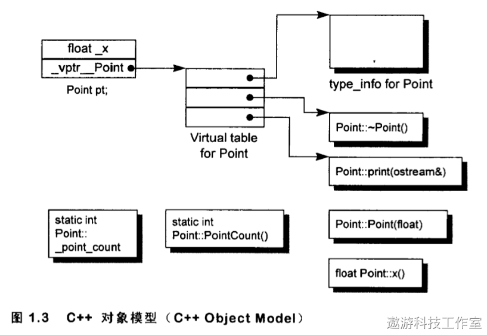

# 上部

## 面向对象三大特性

C++ 面向对象编程 (OOP) 的三大特性包括：封装、继承和多态。

### 封装（Encapsulation）

封装是将数据（属性）和操作这些数据的函数（方法）组合在一个类（Class）中的过程。

封装的主要目的是隐藏类的内部实现细节，仅暴露必要的接口给外部。

通过封装，我们可以控制类成员的访问级别（例如：public、protected 和 private），限制对类内部数据的直接访问，确保数据的完整性和安全性。

### 继承（Inheritance）

继承是一个类（派生类，Derived Class）从另一个类（基类，Base Class）那里获得其属性和方法的过程。

继承允许我们创建具有共享代码的类层次结构，减少重复代码，提高代码复用性和可维护性。

在 C++ 中，访问修饰符（如 public、protected、private）控制了派生类对基类成员的访问权限。

### 多态（Polymorphism）

多态是允许不同类的对象使用相同的接口名字，但具有不同实现的特性。

在 C++ 中，多态主要通过虚函数（Virtual Function）和抽象基类（Abstract Base Class）来实现。

虚函数允许在派生类中重写基类的方法，而抽象基类包含至少一个纯虚函数（Pure Virtual Function），不能被实例化，只能作为其他派生类的基类。

通过多态，我们可以编写更加通用、可扩展的代码，提高代码的灵活性。

总结：封装、继承和多态是面向对象编程的三大核心特性，能够帮助我们编写更加模块化、可重用和可维护的代码。

---

C++ 的多态，本质上就是一句话：

> **编译器通过虚函数表（vtable）和虚函数指针（vptr），把函数调用从编译时决定改成了运行时决定。**

很多人背"vtable、vptr"，但是不知道它们到底是怎么工作的。下面我们按照真正发生的过程来看。

------

## 第一阶段：没有 virtual 的情况

假设有这样两个类：

```
class Animal
{
public:
    void Speak()
    {
        cout << "Animal" << endl;
    }
};

class Dog : public Animal
{
public:
    void Speak()
    {
        cout << "Dog" << endl;
    }
};
```

然后：

```
Animal* p = new Dog();
p->Speak();
```

很多初学者会认为输出应该是：

```
Dog
```

实际上输出却是：

```
Animal
```

为什么？

因为 `Speak()` 不是虚函数。

编译器在编译 `p->Speak()` 这一行的时候，只知道 **p 的类型是 `Animal\*`**，于是直接把这次调用绑定到了 `Animal::Speak()`。

也就是说，编译器生成的代码已经固定了：

```
调用 Animal::Speak()
```

它不会运行时再去检查 `p` 实际指向的是不是 Dog。

这种绑定方式叫做：

> **静态绑定（Static Binding）**

也叫**早绑定（Early Binding）**。

------

## 第二阶段：加入 virtual

如果改成：

```
class Animal
{
public:
    virtual void Speak()
    {
        cout << "Animal" << endl;
    }
};
```

Dog：

```
class Dog : public Animal
{
public:
    void Speak() override
    {
        cout << "Dog" << endl;
    }
};
```

现在再执行：

```
Animal* p = new Dog();
p->Speak();
```

输出就变成了：

```
Dog
```

这是为什么？

因为 `virtual` 告诉编译器：

> **这个函数不要在编译期决定调用哪个实现，而是在运行时决定。**

那么问题来了：

**运行时怎么知道对象到底是 Animal 还是 Dog？**

答案就是：

**vtable 和 vptr。**

------

# 第三阶段：虚函数表（vtable）

只要一个类里面有虚函数，编译器就会自动为这个类生成一张**虚函数表（Virtual Table）**。

例如：

```
class Animal
{
public:
    virtual void Speak();
    virtual void Eat();
};
```

编译器会生成一张类似这样的表：

```
Animal vtable

+----------------------+
| Animal::Speak        |
+----------------------+
| Animal::Eat          |
+----------------------+
```

注意：

里面存放的不是函数本身，而是**函数地址**。

------

Dog 继承以后：

```
class Dog : public Animal
{
public:
    void Speak() override;
};
```

编译器又会生成另一张表：

```
Dog vtable

+----------------------+
| Dog::Speak           |
+----------------------+
| Animal::Eat          |
+----------------------+
```

因为 Dog 重写了 Speak，所以第一项换成了 Dog 的实现。

但是 Eat 没有重写，所以继续使用 Animal 的版本。

------

## 第四阶段：对象里面隐藏了一个 vptr

很多人不知道，一个带有虚函数的对象，其实比普通对象多了一个隐藏成员。

例如：

```
Dog dog;
```

你以为对象长这样：

```
+-----------+
| age       |
| weight    |
+-----------+
```

实际上编译器会变成：

```
+----------------------+
| vptr                 |  <-- 隐藏成员
+----------------------+
| age                  |
| weight               |
+----------------------+
```

这个 **vptr（Virtual Pointer）** 指向对应类的虚函数表。

例如：

```
Dog对象

+----------------------+
| vptr ---------------------------+
+----------------------+          |
| age                  |          |
| weight               |          |
+----------------------+          |
                                  |
                                  v

                      Dog vtable
                  +----------------------+
                  | Dog::Speak           |
                  +----------------------+
                  | Animal::Eat          |
                  +----------------------+
```

所以：

**每一个对象都知道自己属于哪个类。**

------

## 第五阶段：调用虚函数到底发生了什么？

来看这一句：

```
Animal* p = new Dog();

p->Speak();
```

CPU 实际执行的大概流程是：

第一步：

找到对象。

```
p
↓

Dog对象
```

第二步：

读取对象里的 vptr。

```
Dog对象
↓

vptr
```

第三步：

根据 vptr 找到虚函数表。

```
vptr
↓

Dog vtable
```

第四步：

找到 Speak 在虚函数表中的位置。

```
Dog vtable

第0项

↓

Dog::Speak()
```

第五步：

调用这个函数。

整个流程可以画成：

```
Animal*

↓

Dog对象

↓

vptr

↓

Dog vtable

↓

Dog::Speak()
```

所以真正决定调用哪个函数的，并不是指针的类型，而是**对象里面保存的 vptr**。

------

## 为什么必须用指针或引用？

很多面试都会问这一点。

例如：

```
Dog dog;

Animal animal = dog;
```

很多人觉得这里也应该发生多态。

其实不会。

这里发生的是：

> **对象切片（Object Slicing）**

什么意思？

Dog 对象复制到 Animal 对象的时候，只会复制 Animal 那一部分。

例如：

```
Dog

+----------------+
| Animal部分     |
+----------------+
| Dog新增成员    |
+----------------+
```

赋值以后：

```
Animal

+----------------+
| Animal部分     |
+----------------+
```

Dog 多出来的那部分已经没了。

所以：

```
animal.Speak();
```

一定调用 Animal 的版本。

真正的运行时多态必须使用：

```
Animal* p;

或者

Animal& ref;
```

因为这样保存的是同一个对象，而不是复制一个新的对象。

------

## UE 为什么大量使用 virtual？

这一点和 UE 的设计联系非常紧密。

例如：

```
class AActor
{
public:
    virtual void Tick(float DeltaTime);
    virtual void BeginPlay();
};
```

游戏里可能有：

- Player
- Enemy
- NPC
- Bullet

它们全部继承自 AActor。

引擎内部维护的是：

```
TArray<AActor*> Actors;
```

每一帧都会遍历：

```
for (AActor* Actor : Actors)
{
    Actor->Tick(DeltaTime);
}
```

虽然这里变量类型都是 `AActor*`，但是由于 Tick 是虚函数：

- Player 会调用 Player::Tick()
- Enemy 会调用 Enemy::Tick()
- NPC 会调用 NPC::Tick()
- Bullet 会调用 Bullet::Tick()

这就是多态最大的意义：

> **统一接口，不同实现。**

引擎只需要知道"所有对象都会 Tick"，不用关心具体是哪一种对象。

------

## virtual 的代价

多态不是免费的。

主要有三个成本：

**第一，每个对象会多一个 vptr。**

在 64 位系统中，一个指针通常是 8 字节，因此对象会增加至少 8 字节大小。

**第二，每个类都会有一张 vtable。**

不过这张表是类共享的，不是每个对象都有一份，所以占用不算大。

**第三，虚函数调用通常不能像普通函数那样直接内联。**

普通函数：

```
直接跳转到函数地址
```

虚函数：

```
对象

↓

读取vptr

↓

查vtable

↓

找到函数地址

↓

调用
```

多了一次间接寻址，因此理论上会慢一点。

不过现代 CPU 的分支预测和缓存做得很好，在绝大多数游戏逻辑里，这一点开销通常远小于逻辑本身。

------

## 一句话总结

可以把普通函数和虚函数理解成两种不同的调用方式：

**普通函数：**

> 编译器在编译时就决定好了调用哪个函数（静态绑定）。

**虚函数：**

> 编译器只知道"这是一个虚函数调用"，真正调用哪个实现，要等程序运行时，根据对象中的 vptr 找到对应的 vtable，再跳转到正确的函数（动态绑定）。

## 我们先把 Dog 想成一个"更大的 Animal"

例如：

```
class Animal
{
public:
    int age;

    virtual void Speak()
    {
        cout << "Animal" << endl;
    }
};

class Dog : public Animal
{
public:
    int weight;

    void Speak() override
    {
        cout << "Dog" << endl;
    }
};
```

Dog 继承 Animal 后，内存实际上可以理解成这样（忽略 vptr 等细节）：

```
Dog对象

+----------------------+
| age      (Animal)    |
+----------------------+
| weight   (Dog)       |
+----------------------+
```

Dog 对象里面其实包含了 **Animal 部分**，然后再加上自己新增的成员。

------

## 第一种情况：使用指针（发生多态）

```
Dog dog;

Animal* p = &dog;

p->Speak();
```

这里发生了什么？

```
dog对象

+----------------------+
| age                  |
+----------------------+
| weight               |
+----------------------+

        ▲
        │
        p
```

注意：

**p 只是一个指针。**

它没有复制对象。

它只是指向了 Dog。

所以：

虽然 p 的类型是：

```
Animal*
```

但是：

它指向的是：

```
Dog对象
```

Dog 对象里面的 vptr 指向 Dog 的 vtable。

因此：

```
p->Speak()
```

最后调用的是：

```
Dog::Speak()
```

这就是多态。

------

## 第二种情况：直接赋值（不会发生多态）

来看这一句：

```
Dog dog;

Animal animal = dog;
```

很多人以为：

> animal 就是 dog。

其实不是。

它发生的是：

**复制。**

编译器会把 Dog 对象里的 Animal 部分复制出来。

例如：

原来的 Dog：

```
Dog

+----------------------+
| age = 5              |
+----------------------+
| weight = 20          |
+----------------------+
```

复制以后：

```
Dog                     Animal

+----------------+      +----------------+
| age = 5        | ---> | age = 5        |
+----------------+      +----------------+
| weight = 20    |
+----------------+
```

Dog 新增的：

```
weight
```

已经没地方放了。

因为：

Animal 对象根本没有这个成员。

所以：

Dog 变成 Animal 的过程中：

```
Dog

↓

Animal
```

Dog 多出来的那部分被"切掉"了。

所以叫：

> **Object Slicing（对象切片）**

就像：

```
Dog

──────────────

Animal
```

只切了一半。

------

## 为什么这时候不能多态？

现在：

```
Animal animal;
```

它已经不是 Dog 了。

它真的是一个：

Animal 对象。

所以：

```
animal.Speak();
```

当然调用：

```
Animal::Speak()
```

因为：

世界上已经没有 Dog 了。

------

## 为什么指针不会切？

因为：

```
Animal* p = &dog;
```

没有复制。

只是：

```
Dog对象

▲

│

p
```

换句话说：

Dog 对象一直在那里。

所以：

Dog 的 vptr。

Dog 的成员。

Dog 的虚函数。

全部都还在。

因此：

运行时：

就能找到：

```
Dog::Speak()
```

------

## 引用也是一样

例如：

```
Dog dog;

Animal& ref = dog;

ref.Speak();
```

这里：

```
ref
```

不是一个新的对象。

它只是：

Dog 的另一个名字。

```
Dog对象

▲

│

dog

│

ref
```

因此：

仍然发生多态。

------

## 为什么 C++ 必须用指针或引用？

这里其实可以总结成一句话：

**多态的前提是：不能把派生类对象复制成基类对象。**

因为一旦复制：

```
Dog

↓

Animal
```

Dog 特有的信息就丢失了。

而：

指针和引用：

```
Animal*

Animal&
```

都不会复制对象。

它们只是：

**"站在 Animal 的角度去看同一个 Dog 对象。"**

因此运行时还能根据 Dog 对象里的 vptr 找到正确的虚函数。

------

## 最后举一个生活中的例子

假设：

```
Animal = 身份证

Dog = 身份证 + 驾驶证
```

如果：

```
Animal* p = &dog;
```

相当于：

> **你拿着这个人的身份证去看他。**

虽然你只说：

> "这是一个 Animal。"

但是：

这个人实际上还是 Dog。

驾驶证也还在。

所以：

系统知道：

这是 Dog。

------

如果：

```
Animal animal = dog;
```

相当于：

> **你把这个人的身份证复印了一份。**

复印件里只有身份证的信息。

驾驶证没有复印。

于是：

这份新的东西就真的只是：

```
Animal
```

而不是：

```
Dog
```

所以不会发生多态。

其实**不是**。

我觉得很多教材一上来就讲"多态=virtual"，反而把大家绕晕了。

真正应该这样理解：

> **多态（Polymorphism）是一种能力，而虚函数（virtual）只是 C++ 实现这种能力的一种机制。**

我们从"多态"这个词开始理解。

------

## 什么叫多态？

"多态"翻译过来就是：

> **同一种操作，可以表现出多种不同的行为。**

例如现实生活中有一个按钮：

```
播放()
```

对于不同的播放器：

```
QQ音乐

播放()

↓

开始播放音乐
腾讯视频

播放()

↓

开始播放视频
B站

播放()

↓

播放直播
```

你按的都是：

```
Play();
```

但是：

不同对象，

表现不同。

这就是：

> **多态（Poly = 多，Morph = 形态）**

------

## C++ 是怎么做到的？

例如：

```
class Animal
{
public:
    virtual void Speak()
    {
        cout << "Animal" << endl;
    }
};

class Dog : public Animal
{
public:
    void Speak() override
    {
        cout << "汪汪" << endl;
    }
};

class Cat : public Animal
{
public:
    void Speak() override
    {
        cout << "喵喵" << endl;
    }
};
```

现在有三个对象：

```
Animal* a = new Animal();
Animal* b = new Dog();
Animal* c = new Cat();
```

如果没有多态，你只能写：

```
Animal* p;

if (是Dog)
{
    Dog* d = ...
    d->Speak();
}
else if (是Cat)
{
    Cat* c = ...
    c->Speak();
}
```

每增加一种动物，就要多写一个 `if`。

但是有了虚函数：

```
a->Speak();
b->Speak();
c->Speak();
```

输出：

```
Animal

汪汪

喵喵
```

你发现了吗？

**调用代码完全一样：**

```
Speak();
```

但是行为不同。

这就是多态。

------

## 所以 virtual 的作用是什么？

virtual 的作用只有一句话：

> **让编译器不要提前决定调用哪个函数，而是在运行时根据对象类型决定。**

也就是说：

```
多态（目的）

↓

需要运行时决定函数

↓

virtual（实现方法）

↓

vtable

↓

vptr
```

所以：

很多人把：

```
virtual
```

和

```
多态
```

混成了一个东西。

实际上：

不是。

应该理解成：

```
多态

↓

C++用virtual实现
```

------

## 为什么叫"动态多态"？

其实 C++ 有两种多态。

### 第一种：静态多态

例如：

函数重载：

```
void Print(int);
void Print(float);
```

调用：

```
Print(1);

Print(3.14f);
```

编译器在编译的时候：

就知道：

调用哪个。

还有模板：

```
template<typename T>
void Add(T a,T b)
```

这些都是：

**编译时期**

决定。

所以叫：

> **静态多态。**

------

### 第二种：动态多态

例如：

```
Animal* p = new Dog();

p->Speak();
```

编译的时候：

不知道。

运行的时候：

才知道。

所以：

叫：

> **动态多态。**

我们平时说：

"C++ 多态"

其实默认都是：

**动态多态。**

------

## 为什么 UE 那么喜欢多态？

举一个 UE 最经典的例子。

假设：

```
class AActor
{
public:
    virtual void Tick(float DeltaTime);
};
```

然后：

```
class APlayer : public AActor
{
    void Tick(...) override;
};

class AEnemy : public AActor
{
    void Tick(...) override;
};

class ABullet : public AActor
{
    void Tick(...) override;
};
```

引擎里面：

只有一个数组：

```
TArray<AActor*> Actors;
```

每一帧：

```
for (AActor* Actor : Actors)
{
    Actor->Tick(DeltaTime);
}
```

引擎根本不关心：

```
这是玩家？

还是敌人？

还是子弹？
```

它只知道：

> "反正你们都是 Actor，都应该 Tick。"

至于：

Tick 到底干什么。

让对象自己决定。

这就是：

**面向对象最核心的思想。**

------

## 我觉得更准确的一句话应该是：

很多书都会说：

> **多态就是父类指针指向子类对象。**

我其实不喜欢这个定义。

我更喜欢这样说：

> **多态就是：统一的接口，不同的实现。**

例如：

都是：

```
Tick();
```

但是：

```
玩家：

更新输入

敌人：

更新AI

子弹：

更新飞行
```

对于引擎来说：

它永远只需要：

```
Actor->Tick();
```

这就是多态真正的价值。

------

## 以后你可以把这几个概念分开记

```
继承（Inheritance）
```

表示：

> "Dog 是一种 Animal。"

------

```
虚函数（virtual）
```

表示：

> "这个函数支持运行时重写。"

------

```
多态（Polymorphism）
```

表示：

> "虽然我调用的是同一个接口，但不同对象会执行不同的代码。"

------

所以，它们之间的关系更像这样：

```
        面向对象
             │
   ┌─────────┼─────────┐
   │         │         │
封装       继承      多态
                      │
                C++通过virtual实现
                      │
                 vtable + vptr
```

**模板（Template）**其实是 C++ 最容易被误解的特性之一。很多人觉得：

> `T` 是一种"万能类型"。

实际上**不是**。

> **`T` 在编译之前根本不存在，它只是编译器的一个"占位符"。**

模板和 `virtual` 恰好是两种完全不同的思想：

- `virtual`：**运行时**决定调用哪个函数（动态多态）
- `template`：**编译时**生成对应的代码（静态多态）

------

## 我们先看一个例子

例如：

```
template<typename T>
T Add(T a, T b)
{
    return a + b;
}
```

很多人以为：

编译器里面真的有一个：

```
T Add(T a, T b)
```

其实没有。

------

## 当你调用的时候

例如：

```
Add(1, 2);
```

编译器看到：

```
1

↓

int
```

所以：

它会自己生成：

```
int Add(int a, int b)
{
    return a + b;
}
```

------

然后：

```
Add(1.5, 2.3);
```

又生成：

```
double Add(double a, double b)
{
    return a + b;
}
```

所以：

真正编译后的代码里面，其实已经没有：

```
T
```

了。

而是：

```
int Add(int,int);

double Add(double,double);
```

这一步叫：

> **模板实例化（Template Instantiation）**

------

## 所以 T 到底是什么？

它其实就是：

```
一个占位符
```

类似于：

如果你写：

```
Hello XXX
```

然后：

```
XXX = 张三
```

得到：

```
Hello 张三
```

或者：

```
XXX = 李四
```

得到：

```
Hello 李四
```

模板也是一样。

例如：

```
T Add(T,T)
```

编译器：

```
T = int
```

得到：

```
int Add(int,int)
```

再来：

```
T = float
```

得到：

```
float Add(float,float)
```

所以：

> **模板就是编译器的代码生成器。**

------

# 编译器到底干了什么？

例如：

```
template<typename T>
void Print(T value)
{
    cout << value;
}
```

你写：

```
Print(1);

Print("abc");

Print(3.14);
```

编译器实际上偷偷生成：

```
void Print(int value)
{
    cout << value;
}

void Print(const char* value)
{
    cout << value;
}

void Print(double value)
{
    cout << value;
}
```

所以：

模板本质就是：

```
你的代码

↓

编译器生成很多真正的函数

↓

CPU执行
```

------

# 为什么模板没有运行时开销？

因为：

生成工作：

全部发生在：

```
编译阶段
```

例如：

```
vector<int>
```

实际上：

已经变成：

```
class vector_int
{
    ...
};
```

（当然名字不是这个。）

CPU 根本不知道：

```
template
```

是什么。

CPU 最后看到的：

永远都是：

```
vector<int>

↓

真正的类
```

所以：

模板：

几乎没有：

运行时成本。

------

# 为什么模板代码都写在 .h？

这是很多面试也喜欢问的。

例如：

你写：

```
// Add.h

template<typename T>
T Add(T a,T b);
```

然后：

```
// Add.cpp

template<typename T>
T Add(T a,T b)
{
    return a+b;
}
```

最后：

别的 cpp：

```
Add(1,2);
```

编译器：

会报错。

为什么？

因为：

模板是在：

**编译时实例化。**

编译：

main.cpp

的时候。

编译器必须看到：

完整代码。

否则：

它不知道：

怎么生成：

```
int Add(int,int)
```

所以：

模板一般：

全部写：

```
.h
```

里面。

------

# vector 为什么也是模板？

例如：

```
vector<int>
```

实际上：

编译器会生成：

一个：

```
int版vector
```

例如：

```
vector<float>
```

又生成：

```
float版vector
```

所以：

STL：

其实：

几乎全是：

模板。

例如：

```
vector

list

deque

map

set

unordered_map

unique_ptr

shared_ptr
```

几乎：

都是：

Template。

------

# 模板和虚函数有什么区别？

很多人容易把它们搞混。

例如：

都有：

```
多态
```

其实：

完全不是一种东西。

| 模板                 | 虚函数               |
| -------------------- | -------------------- |
| 编译时生成代码       | 运行时查 vtable      |
| 没有运行时开销       | 有一次虚函数调用开销 |
| 类型必须在编译期确定 | 类型可以运行时决定   |
| 静态多态             | 动态多态             |

举个例子。

模板：

```
template<typename T>
void Print(T t);
```

编译的时候：

就已经知道：

```
Print(int)

Print(float)
```

运行的时候：

CPU：

直接调用。

------

而：

```
Animal* p;

p->Speak();
```

编译的时候：

不知道：

是：

```
Dog

Cat

Bird
```

只能：

运行时：

查：

```
vtable
```

------

# 为什么模板这么强大？

因为：

模板不仅能替换：

类型。

还能替换：

值。

例如：

```
template<int N>
class Array
{
    int data[N];
};
```

然后：

```
Array<10>

Array<100>
```

编译器：

直接生成：

不同大小的类。

所以：

模板：

其实更像：

> **一种编译时代码生成语言。**

------

## 和 C# 泛型有什么区别？

因为你同时学 Unity，我顺便对比一下。

C#：

```
List<int>

List<float>
```

运行时：

CLR：

知道：

```
这是泛型
```

很多类型共享一份 IL（值类型和引用类型有一些差异）。

而 C++：

```
vector<int>

vector<float>
```

编译器：

直接生成：

两套代码。

所以：

- **C++ 模板**：更快，但可能导致代码膨胀（Code Bloat）。
- **C# 泛型**：生成的机器码更少，运行时负责一部分工作。

------

### 一句话总结

可以把模板理解成一个**"编译期代码工厂"**。

`T` 不是一种真实存在的类型，也不是运行时保存的信息，它只是告诉编译器："这里先留个空，等你看到实际使用的类型时，再把对应类型代入，并生成真正的函数或类。"

所以，模板的底层并没有什么像 vtable 那样的运行时结构，它最大的原理就是四个字：

> **编译期实例化（Compile-time Instantiation）**。

这也是为什么 C++ 模板能做到几乎零运行时开销的原因。

这个问题其实就是**为什么 C++ 禁止构造期间发生真正的多态**。

我们直接看代码。

## 假设有这样两个类

```
#include <iostream>
using namespace std;

class Animal
{
public:
    Animal()
    {
        cout << "Animal Constructor\n";
        Speak();      // 在构造函数里调用虚函数
    }

    virtual void Speak()
    {
        cout << "Animal Speak\n";
    }
};

class Dog : public Animal
{
public:
    Dog()
    {
        cout << "Dog Constructor\n";
    }

    void Speak() override
    {
        cout << "Dog Speak\n";
    }
};

int main()
{
    Dog dog;
}
```

很多人第一次学多态时，会猜输出是：

```
Animal Constructor
Dog Speak
Dog Constructor
```

因为觉得：

> 我创建的是 Dog，所以调用虚函数应该调用 Dog::Speak()。

**实际上不是。**

真正输出的是：

```
Animal Constructor
Animal Speak
Dog Constructor
```

这就是 C++ 的规定。

------

## 为什么？

我们来看整个构造过程。

假设 Dog 对象的内存长这样（简化一下）：

```
+----------------------+
| vptr                 |
+----------------------+
| Animal::age          |
+----------------------+
| Dog::name            |
+----------------------+
```

程序执行：

```
Dog dog;
```

不是一下子就把整个对象建好了。

实际上发生的是下面几个步骤。

### 第一步：申请内存

先申请一整块 Dog 大小的内存。

```
+----------------------+
| ???                  |
+----------------------+
| ???                  |
+----------------------+
| ???                  |
+----------------------+
```

注意，此时还没有执行任何构造函数。

------

### 第二步：进入 Animal 构造函数

开始执行：

```
Animal::Animal()
```

在进入构造函数之前，编译器会偷偷做一件事情。

它会把对象里的 **vptr** 设置成：

```
vptr -----> Animal vtable
```

于是对象现在是：

```
+----------------------+
| vptr ------------+   |
+----------------------+   |
| Animal::age          |   |
+----------------------+   |
| Dog::name            |   |
+----------------------+   |
                            |
                     Animal vtable
```

注意：

**Dog 的构造函数还没有执行。**

------

### 第三步：执行 Speak()

Animal 构造函数里面：

```
Speak();
```

实际上编译器会生成类似这样的代码（伪代码）：

```
vptr->Speak(this);
```

现在 vptr 指向的是：

```
Animal vtable
```

所以最终调用的是：

```
Animal::Speak();
```

因此输出：

```
Animal Speak
```

------

### 第四步：Animal 构造结束

这时候才开始：

```
Dog::Dog()
```

在进入 Dog 构造函数之前，编译器又会修改：

```
vptr -----> Dog vtable
```

对象变成：

```
+----------------------+
| vptr ------------+   |
+----------------------+   |
| Animal::age          |   |
+----------------------+   |
| Dog::name            |   |
+----------------------+   |
                            |
                       Dog vtable
```

从这一刻开始，再调用：

```
Speak();
```

就会进入：

```
Dog::Speak();
```

因为 vptr 已经改了。

------

## 那如果 C++ 真允许调用 Dog::Speak() 会怎么样？

假设：

```
class Dog : public Animal
{
public:

    string name;

    Dog()
    {
        name = "旺财";
    }

    void Speak() override
    {
        cout << name << endl;
    }
};
```

如果 Animal 构造函数里面真的调用了：

```
Dog::Speak();
```

那么：

```
cout << name;
```

这里的：

```
name
```

实际上还没有初始化。

因为：

```
Dog()
{
    name = "旺财";
}
```

根本还没执行。

也就是说：

```
Animal()
    ↓
Dog::Speak()
    ↓
访问还没有初始化的 name
```

程序行为就是未定义的。

这就是为什么 C++ 标准规定：

> **在基类构造函数执行期间，对象的动态类型就是基类，而不是最终派生类。**

这是为了保证对象不会访问尚未构造完成的成员。

------

## 更有意思的是，下面这段代码

```
class Animal
{
public:
    Animal()
    {
        Speak();
    }

    virtual void Speak()
    {
        cout << "Animal\n";
    }
};

class Dog : public Animal
{
public:
    int age = 10;

    void Speak() override
    {
        cout << age << endl;
    }
};
```

有人会说：

> "这里 Dog 没有 string，也没有复杂对象，只是一个 int，就算调用 Dog::Speak() 也没关系吧？"

答案仍然是**不会调用**。

原因不是因为 `int` 安全，而是 **C++ 根本不允许构造过程中发生向下的动态绑定**。

标准统一规定：

- 在 `Animal` 构造函数里，虚函数调用只能解析到 `Animal`。
- 在 `Dog` 构造函数里，虚函数调用才能解析到 `Dog`。

这样规则简单，而且不会因为不同成员是否初始化而产生不同的行为。

------

## 那析构函数呢？

析构函数正好相反。

假设：

```
delete dog;
```

执行顺序是：

```
Dog::~Dog()
        ↓
Animal::~Animal()
```

当进入：

```
Animal::~Animal()
```

的时候，编译器已经把：

```
vptr
```

重新改回：

```
Animal vtable
```

因此如果 Animal 的析构函数里面调用：

```
Speak();
```

仍然只会调用：

```
Animal::Speak();
```

原因和构造函数完全一样：

**Dog 部分已经被析构了，不能再调用 Dog 的虚函数。**

------

**我想问你一个问题，因为这关系到后面怎么讲。**

你现在是不是**不知道 vptr 是编译器什么时候偷偷写进去的**？

因为你之前一直问：

> "vtable 是编译期生成的，那 vptr 是什么时候有的？"

如果是卡在这里，我可以从 **C++ 编译器生成对象布局（Object Layout）** 开始讲，甚至给你画出 GCC/MSVC 编译后的对象内存，让你知道 **vptr 根本不是运行时创建的，而是编译器在类布局阶段就决定对象第一个成员就是它**。这一层理解之后，多态的整个底层都会串起来。

这也是 C++ 最经典的一个面试题之一。不过这篇文章有一点没讲透，它把**析构**、**多态**和**虚函数**揉在一起了，所以容易让人迷糊。

我们一步一步来看。

------

## 首先，为什么会有这个问题？

假设我们有两个类：

```
class Base
{
public:
    ~Base()
    {
        cout << "Base 析构\n";
    }
};

class Derived : public Base
{
public:
    Derived()
    {
        data = new int[100];
    }

    ~Derived()
    {
        cout << "Derived 析构\n";
        delete[] data;
    }

private:
    int* data;
};
```

现在创建对象：

```
Derived* d = new Derived();
```

对象在内存里的真实布局大概是：

```
+-------------------+
| Base 部分         |
+-------------------+
| Derived::data     | -----> new int[100]
+-------------------+
```

这里有两块内存：

1. **Derived 对象本身。**
2. **Derived 里面又申请的 int[100]。**

真正需要释放的是两块。

------

## 如果直接删除 Derived*

如果你写：

```
Derived* d = new Derived();

delete d;
```

编译器在编译的时候就知道：

> d 的类型就是 Derived*。

因此它会直接生成类似这样的代码（这是伪代码，不是真实代码）：

```
Derived::~Derived();

Base::~Base();

operator delete(d);
```

执行顺序就是：

```
Derived::~Derived()
        ↓
Base::~Base()
        ↓
释放对象内存
```

因此输出：

```
Derived 析构
Base 析构
```

同时：

```
delete[] data;
```

也执行了。

没有内存泄漏。

------

## 那为什么 Base* 会出问题？

现在换一种写法。

```
Base* ptr = new Derived();
```

注意：

这里对象还是：

```
Derived
```

只是：

```
ptr
```

这个变量的类型变成了：

```
Base*
```

这叫：

> **向上转型（Upcasting）**

这是 C++ 多态最基本的用法。

------

接下来执行：

```
delete ptr;
```

这里编译器遇到一个问题。

它只知道：

```
ptr 是 Base*
```

如果 Base 没有虚析构函数，那么编译器就会认为：

> "既然你告诉我是 Base*，那我就按 Base 来删。"

于是生成的代码大概就是：

```
Base::~Base();

operator delete(ptr);
```

它根本不知道下面还有：

```
Derived
```

于是：

```
Derived::~Derived()
```

没有执行。

输出只有：

```
Base 析构
```

------

## 为什么会内存泄漏？

因为：

```
Derived::~Derived()
{
    delete[] data;
}
```

根本没有执行。

于是：

```
对象内存
```

释放了。

但是：

```
data
```

指向的：

```
new int[100]
```

没人释放。

所以泄漏了。

可以画成这样。

删除之前：

```
Base* ptr
      │
      ▼
+----------------------+
| Base                 |
+----------------------+
| data ------------+   |
+----------------------+ |
                         ▼
                   int[100]
```

执行：

```
delete ptr;
```

如果没有虚析构。

发生的是：

```
Base::~Base()
        ↓
释放整个对象
```

于是：

```
+----------------------+
|        已释放        |
+----------------------+
```

但是：

```
int[100]
```

还在：

```
内存中
```

已经没人能找到它。

这就是：

> **内存泄漏（Memory Leak）**

------

## 那虚析构函数为什么能解决？

现在改一下。

```
class Base
{
public:

    virtual ~Base()
    {
        cout << "Base\n";
    }
};
```

这里只多了一个：

```
virtual
```

为什么就好了？

原因其实和我们昨天讲的：

> **虚函数调用**

完全一样。

因为：

```
delete ptr;
```

实际上：

也要调用析构函数。

既然析构函数是：

```
virtual
```

那么：

CPU 就不会直接调用：

```
Base::~Base()
```

而是：

通过：

```
vptr
```

去查：

```
vtable
```

现在：

```
ptr
```

虽然是：

```
Base*
```

但是：

对象真正是：

```
Derived
```

所以：

对象里面：

```
vptr
```

实际上指向：

```
Derived vtable
```

查表以后：

发现：

```
析构函数入口

↓

Derived::~Derived()
```

于是：

先执行：

```
Derived::~Derived()
```

释放：

```
delete[] data;
```

然后：

Derived 析构函数结束以后。

编译器自动继续：

```
Base::~Base()
```

最后：

```
operator delete
```

释放对象内存。

整个过程就是：

```
delete ptr
        │
        ▼
查 vptr
        │
        ▼
Derived::~Derived()
        │
        ▼
Base::~Base()
        │
        ▼
释放对象内存
```

所以输出：

```
Derived 析构
Base 析构
```

------

## 那这里到底发生了多态吗？

这里很多文章容易一句话带过，说"因为没有虚函数，所以没有多态"。

这句话并不完整。

准确来说应该是：

**`delete ptr` 本身也是一次函数调用，而析构函数也是成员函数。只有当析构函数被声明为 `virtual` 时，这次调用才会发生动态绑定（多态）。**

如果析构函数不是虚函数，那么：

```
delete ptr;
```

在编译阶段就已经决定：

```
调用 Base::~Base()
```

根本不会查：

```
vptr
```

也不会查：

```
vtable
```

因此对象真实类型是不是 `Derived`，编译器根本不关心。

------

## 最后记住一句几乎所有 C++ 面试都会问的话

> **只要一个类会被当作基类使用，并且可能通过基类指针或引用删除派生类对象，那么基类析构函数必须声明为 `virtual`。**

这是因为只有虚析构函数才能保证 `delete basePtr` 时发生动态绑定，先调用派生类析构函数，再调用基类析构函数，最终完整释放对象及其拥有的资源。

这篇文章这里其实把**两个概念混在一起了**，所以读起来会觉得"默认""基类"好像是两个身份，其实不是。

我们先把概念理清。

------

## 什么叫"默认析构函数"？

假设你写：

```
class A
{
public:
    int x;
};
```

你没有写析构函数。

编译器会偷偷帮你生成一个：

```
class A
{
public:
    ~A() {}
};
```

这个就是**默认析构函数（Default Destructor）**。

注意，它就是一个普通函数，相当于：

```
~A()
{
}
```

它**不是 virtual**。

------

## 如果你自己写呢？

例如：

```
class A
{
public:
    ~A()
    {
    }
};
```

它仍然不是虚函数。

因为你没有写：

```
virtual
```

------

## 什么时候才是虚析构函数？

只有你明确写：

```
class A
{
public:
    virtual ~A()
    {
    }
};
```

这时候：

A 才拥有：

- vtable（虚函数表）
- vptr（对象里的虚函数表指针）

所以这里不存在：

> 默认析构函数

和

> 基类析构函数

这两个东西。

真正的区别其实是：

```
普通析构函数

vs

虚析构函数
```

------

## 那文章为什么一直说"基类析构函数"？

因为它讨论的是一种**使用场景**。

例如：

```
class Animal
{

};

class Dog : public Animal
{

};
```

这里：

```
Animal
```

就是：

**基类（Base Class）**

```
Dog
```

就是：

**派生类（Derived Class）**

如果以后有人可能会写：

```
Animal* p = new Dog();
```

那么：

Animal 就是一个：

> **多态基类（Polymorphic Base Class）**

这种类应该写：

```
virtual ~Animal()
{
}
```

否则：

```
delete p;
```

就会出问题。

------

## 如果根本没人继承呢？

例如：

```
class Vector3
{
public:

    float x;
    float y;
    float z;
};
```

这个类就是拿来表示坐标。

你会写：

```
class MyVector : public Vector3
{

};
```

吗？

几乎不会。

所以：

它就是一个普通类。

它根本不会发生：

```
Base* ptr = new Derived();
```

这种事情。

因此：

```
~Vector3()
{
}
```

完全够了。

写成：

```
virtual ~Vector3()
{
}
```

反而会增加开销。

------

## 那为什么会增加开销？

假设：

```
class A
{
public:

    int x;
};
```

对象可能就是：

```
+------+
| x    |
+------+
```

占：

```
4 Byte
```

如果：

```
class A
{
public:

    virtual ~A()
    {

    }

    int x;
};
```

对象就变成：

```
+-------------+
| vptr        |   8 Byte（64位）
+-------------+
| x           |   4 Byte
+-------------+
```

由于内存对齐，最后对象大小通常会变成：

```
16 Byte
```

原来：

```
4 Byte
```

现在：

```
16 Byte
```

如果：

程序里：

有：

```
A arr[1000000];
```

那么：

就会白白多占很多内存。

------

## 所以 C++ 为什么不默认让析构函数成为 virtual？

这里其实体现的是 **C++ 的设计哲学**。

C++ 有一个很重要的原则：

> **You don't pay for what you don't use.**

中文一般翻译成：

> **不用，就不付出代价。**

例如：

如果你根本不用：

- 多态
- RTTI
- dynamic_cast

那么：

编译器就不会：

给你：

- vptr
- vtable

也不会增加对象大小。

如果：

编译器把所有析构函数都默认变成：

```
virtual
```

那么：

所有对象都会有：

```
vptr
```

即使：

这个类：

永远不会被继承。

这就违反了 C++ 的设计理念。

------

## 那什么时候应该写 virtual？

这里有一个非常经典的经验法则。

### 第一种：不会被继承

例如：

```
class Vector3
{

};
```

或者：

```
class FileReader
{

};
```

没有人会继承。

那么：

普通析构即可。

------

### 第二种：可能作为父类

例如：

```
class Animal
{

};
```

以后：

别人可能写：

```
class Dog : public Animal
{

};

class Cat : public Animal
{

};
```

甚至：

```
Animal* p = CreateAnimal();
```

这时候：

就应该：

```
virtual ~Animal()
{
}
```

因为：

你不知道：

```
p
```

真正指向：

谁。

------

## 为什么文章一直强调"基类要写 virtual"？

因为：

**不是因为它是基类，所以必须是 virtual。**

而是：

**因为它可能会被通过基类指针删除。**

这是重点。

例如：

```
class Animal
{

};
```

如果：

整个项目：

永远不会出现：

```
Animal* p = new Dog();
```

那么：

其实：

```
virtual
```

也不是必须。

只是：

现实开发中。

只要：

设计成：

```
Animal

Player

Component

Actor

Shape
```

这种名字。

基本就意味着：

别人：

一定会继承。

所以：

业内形成了：

> **面向继承设计的基类，析构函数默认写成 virtual。**

# C++ 虚函数、虚函数表、多态总结

很多人学习虚函数的时候，都会把 **virtual、vtable、vptr、构造函数、析构函数** 看成几个独立的知识点去背。实际上，它们都是围绕着**运行时多态（Runtime Polymorphism）**设计出来的一套机制。

理解了这套机制，后面的构造函数为什么不能调用子类虚函数、为什么析构函数要声明为 virtual，就都变得顺理成章了。

------

# 一、什么是多态？

多态（Polymorphism）的意思不是"有很多函数"，而是：

> **同一条调用语句，在运行时根据对象的真实类型执行不同的函数。**

例如：

```
class Animal
{
public:
    virtual void Speak()
    {
        cout << "Animal\n";
    }
};

class Dog : public Animal
{
public:
    void Speak() override
    {
        cout << "Dog\n";
    }
};
Animal* p = new Dog();
p->Speak();
```

变量 `p` 的类型是 `Animal*`，但是程序最终执行的是 `Dog::Speak()`。

这就是多态。

注意，这里的关键不是 `override`，也不是继承，而是 **virtual**。

只有成员函数声明为 `virtual`，编译器才会为它建立运行时多态机制。

------

# 二、虚函数是如何实现多态的？

很多人以为虚函数很神秘，其实它只是多了一层查表。

编译器发现一个类里存在 `virtual` 函数以后，会自动为这个类生成一张**虚函数表（Virtual Table，简称 vtable）**。

例如：

```
class Animal
{
public:
    virtual void Speak();
    virtual void Run();
};
```

编译器会生成：

```
Animal vtable

+----------------------+
| Animal::Speak        |
+----------------------+
| Animal::Run          |
+----------------------+
```

如果子类重写了 `Speak()`：

```
class Dog : public Animal
{
public:
    void Speak() override;
};
```

那么编译器还会生成另一张表：

```
Dog vtable

+----------------------+
| Dog::Speak           |
+----------------------+
| Animal::Run          |
+----------------------+
```

可以发现，**子类只是把对应位置的函数地址替换掉了**，没有重写的函数仍然沿用父类。

------

# 三、vtable 和 vptr 有什么区别？

这是最容易混淆的两个概念。

## vtable（虚函数表）

vtable 是**整个类共享的一张表**。

它在编译、链接阶段就已经生成好了，属于程序本身，而不是某一个对象。

一个类通常只有一张 vtable。

例如：

```
Dog vtable

+----------------------+
| Dog::Speak           |
+----------------------+
| Animal::Run          |
+----------------------+
```

程序里的所有 Dog 对象都会使用这同一张表。

------

## vptr（虚函数表指针）

vptr 是**对象中的一个隐藏成员**。

假设对象布局如下：

```
Dog Object

+----------------------+
| vptr                 |
+----------------------+
| Animal 成员          |
+----------------------+
| Dog 成员             |
+----------------------+
```

它的作用只有一个：

> **告诉程序，这个对象应该使用哪一张虚函数表。**

因此：

- vtable 属于类。
- vptr 属于对象。

不要把它们混为一谈。

------

# 四、虚函数调用的完整过程

例如：

```
Animal* p = new Dog();
p->Speak();
```

真正发生的事情并不是：

```
直接调用 Dog::Speak()
```

而是：

```
CPU
    │
    ▼
读取对象中的 vptr
    │
    ▼
找到 Dog vtable
    │
    ▼
找到 Speak 对应的函数地址
    │
    ▼
跳转到 Dog::Speak()
```

因此，**虚函数比普通函数仅仅多了一次查表和一次间接跳转**。

所谓"运行时多态"，本质就是运行时根据对象里的 vptr 决定最终调用哪个函数。

------

# 五、构造函数为什么不能调用子类虚函数？

这是很多面试都会问的问题。

假设：

```
class Animal
{
public:
    Animal()
    {
        Speak();
    }

    virtual void Speak()
    {
        cout << "Animal\n";
    }
};
```

以及：

```
class Dog : public Animal
{
public:
    void Speak() override
    {
        cout << "Dog\n";
    }
};
```

执行：

```
Dog dog;
```

很多人会以为输出：

```
Dog
```

实际上输出：

```
Animal
```

原因不是因为虚函数失效，而是因为 **Dog 还没有构造完成。**

对象构造的真实顺序是：

```
申请对象内存
        │
        ▼
构造 Animal
        │
        ▼
vptr 指向 Animal vtable
        │
        ▼
Animal 构造完成
        │
        ▼
构造 Dog
        │
        ▼
vptr 修改为 Dog vtable
        │
        ▼
Dog 构造完成
```

也就是说，在执行 `Animal()` 构造函数期间，这个对象还只是一个 **Animal**。

如果允许调用 `Dog::Speak()`，那么很可能访问到 Dog 中尚未初始化的数据。

为了保证对象始终处于合法状态，C++ 标准规定：

> **构造期间，虚函数不会发生向下的动态绑定，而是调用当前正在构造类自己的版本。**

------

# 六、析构函数为什么要声明为 virtual？

假设：

```
Base* p = new Derived();
delete p;
```

如果析构函数不是 virtual，那么编译器看到：

```
Base* p;
```

就会直接生成：

```
Base::~Base();
```

Derived 的析构函数不会执行。

如果 Derived 在析构函数中负责释放资源：

```
~Derived()
{
    delete[] data;
}
```

那么这部分代码永远不会执行，最终造成资源泄漏。

如果把基类析构函数改成：

```
virtual ~Base();
```

情况就不同了。

`delete p` 会先读取对象里的 vptr，找到真实对象对应的 vtable，然后执行：

```
Derived::~Derived()
        │
        ▼
Base::~Base()
        │
        ▼
释放对象内存
```

因此，所有资源都能正确释放。

------

# 七、为什么析构函数默认不是 virtual？

很多人看到这里会疑惑：

> "既然 virtual 这么重要，为什么编译器不默认把析构函数都变成 virtual？"

原因很简单：

**不是所有类都需要多态。**

例如：

```
class Vector3
{
public:
    float x;
    float y;
    float z;
};
```

这种数学类型通常不会被继承，也不会通过父类指针删除。

如果默认生成 virtual，那么每个对象都会额外增加一个 vptr，同时编译器还需要生成 vtable。

这会增加内存占用和一定的运行时开销。

C++ 一直遵循一个设计原则：

> **You don't pay for what you don't use.（不用，就不付出代价。）**

因此，只有程序员明确写下 `virtual`，编译器才会生成这套机制。

------

# 八、什么时候应该把析构函数写成 virtual？

记住这一条原则即可：

> **如果一个类打算作为多态基类使用，那么析构函数应该声明为 virtual。**

例如：

```
class Animal
{
public:
    virtual ~Animal() = default;
};
```

以后别人可以安全地写：

```
Animal* p = new Dog();
delete p;
```

如果一个类只是普通的数据类、工具类，例如 `Vector3`、`Color`、`Rect`，根本不会发生多态，那么普通析构函数即可，没有必要增加虚函数带来的额外开销。

------

# 九、整个虚函数机制可以总结为一句话

**编译阶段**，编译器为包含虚函数的类生成 vtable，并在对象布局中加入隐藏成员 vptr。

**对象构造阶段**，编译器根据当前构造到的类修改 vptr，使其指向对应类的 vtable。

**运行阶段**，调用虚函数时，CPU 先通过对象中的 vptr 找到 vtable，再从 vtable 中取出对应函数地址，最终跳转到真实对象所属类的函数实现。这就是 C++ 运行时多态的底层原理。

可以这么理解，但这句话还可以更准确一点。

你说的是：

> **使用基类作为析构函数是为了能把子类也正常析构。**

这里有两个问题：

1. **"使用基类作为析构函数"** 这句话语法不太对，应该是"**基类的析构函数声明为虚函数**"。
2. 真正的目的不是"析构子类"，而是**保证通过基类指针删除对象时，能够完整析构整个对象**。

更准确的表述应该是：

> **将基类析构函数声明为 `virtual`，是为了保证通过基类指针删除派生类对象时，能够先调用派生类析构函数，再调用基类析构函数，从而完整释放整个对象拥有的资源。**

------

你可以看下面这个例子。

```
class Animal
{
public:
    virtual ~Animal()
    {
        cout << "Animal\n";
    }
};

class Dog : public Animal
{
public:
    ~Dog()
    {
        cout << "Dog\n";
    }
};
```

当执行：

```
Animal* p = new Dog();
delete p;
```

程序并不是直接调用：

```
Animal::~Animal();
```

而是根据对象里的 `vptr` 找到真实类型：

```
delete p
      │
      ▼
对象真实类型是 Dog
      │
      ▼
Dog::~Dog()
      │
      ▼
Animal::~Animal()
      │
      ▼
释放对象内存
```

因此输出：

```
Dog
Animal
```

整个对象都被正确析构了。

------

如果没有 `virtual`：

```
class Animal
{
public:
    ~Animal() {}
};
```

同样执行：

```
Animal* p = new Dog();
delete p;
```

编译器只会认为：

> "`p` 是一个 `Animal*`，那我就调用 `Animal::~Animal()`。"

于是流程变成：

```
delete p
      │
      ▼
Animal::~Animal()
      │
      ▼
释放对象内存
```

`Dog::~Dog()` 根本不会执行。

如果 `Dog` 析构函数负责释放文件、Socket、纹理、内存等资源，这些资源就泄漏了。

------

### 面试中可以这样回答

如果面试官问：

> **为什么基类析构函数要声明为虚函数？**

你可以回答：

> **因为在多态场景下，我们通常会通过基类指针管理派生类对象。如果基类析构函数不是虚函数，`delete Base\*` 时只会调用基类析构函数，派生类析构函数不会执行，导致派生类持有的资源无法释放。将基类析构函数声明为 `virtual` 后，析构过程会发生动态绑定，先执行派生类析构函数，再执行基类析构函数，从而保证整个对象被正确析构。**

这也是最符合 C++ 对象模型的解释。

## C++ 类成员访问权限

这个知识面试考得不多，因为太简单了，但是呢，由于很基础也要掌握。

在 C++ 中，类成员的访问权限是通过访问修饰符来控制的。

有三种访问修饰符：public、private 和 protected，分别定义了类成员的访问级别，控制类成员的可见性和可访问性。

### public（公共）

公共成员在任何地方都是可访问的。

调用方可以直接访问和修改公共成员，公共访问修饰符通常用于类的外部接口。

但是一般情况下，不建议将类的成员变量设置为 public，因为这不符合封装的原则。

```cpp
class MyClass {
public:
    int x;
};
```

x 是一个公共成员，可以在类的对象中被访问。

### private（私有）

私有成员只能在类的内部访问，即仅在类的成员函数中可以访问。

私有成员用于实现类的内部实现细节，这些细节对于类的用户来说是隐藏的。

```cpp
class MyClass {
private:
    int x;
};
```

上面的x 是一个私有成员，不能在类的外部被直接访问，要想访问 x，必须由 MyClass 封装一些对外的 public 函数。

### protected（受保护）

受保护成员类似于私有成员，但它们可以被派生类访问。

受保护成员通常用于继承和多态等场景，这样子类也可以访问父类的成员变量。

```cpp
class MyBaseClass {
protected:
    int x;
};

class MyDerivedClass : public MyBaseClass {
public:
void setX(int a) {
    x = a;
}
};
```

## 重载、重写、隐藏的区别

在 C++ 中，重载（Overloading）、重写（Overriding）和隐藏（Hiding）这几个概念很容易搞混，接下来解释一下它们之间的区别：

### 一、 重载（Overloading）:

重载是指相同作用域(比如命名空间或者同一个类)内拥有相同的方法名，但具有不同的参数类型和/或参数数量的方法。 重载允许根据所提供的参数不同来调用不同的函数。它主要在以下情况下使用：

方法具有相同的名称。

方法具有不同的参数类型或参数数量。

返回类型可以相同或不同。

同一作用域，比如都是一个类的成员函数，或者都是全局函数

例如：

```cpp
class OverloadingExample {
  void display(int a) {
    System.out.println("Display method with integer: " + a);
  }

  void display(String b) {
    System.out.println("Display method with string: " + b);
  }
}
```

### 二、重写（Overriding）

重写是指在派生类中重新定义基类中的方法。

当派生类需要改变或扩展基类方法的功能时，就需要用到重写。

重写的条件包括：

方法具有相同的名称。

方法具有相同的参数类型和数量。

方法具有相同的返回类型。

重写的基类中被重写的函数必须有virtual修饰。

重写主要在继承关系的类之间发生。

例如:

```cpp
#include <iostream>
class BaseClass {
public:
    virtual void display() {
        std::cout << "Display method in base class" << std::endl;
    }
};

class DerivedClass : public BaseClass {
public:
    void display() override {
        std::cout << "Display method in derived class" << std::endl;
    }
};

int main() {
    DerivedClass derived;
    derived.display();

    return 0;
}
```

### 三、隐藏（Hiding）

隐藏是指派生类的函数屏蔽了与其同名的基类函数。注意只要同名函数，不管参数列表是否相同，基类函数都会被隐藏。 示例:

```cpp
#include<iostream>
using namespace std;

classA{
public:
  void fun1(int i, int j){
    cout <<"A::fun1() : " << i <<" " << j << endl;
  }
};
classB : public A{
public:
  //隐藏
  void fun1(double i){
    cout <<"B::fun1() : " << i << endl;
  }
};
int main(){
  B b;
  b.fun1(5);//调用B类中的函数
  b.fun1(1, 2);//出错，因为基类函数被隐藏
  system("pause");
  return 0;
}
```

### 四、区别

#### 4.1 重载和重写的区别：

范围区别：重写和被重写的函数在不同的类中，重载和被重载的函数在同一类中（同一作用域）。

参数区别：重写与被重写的函数参数列表一定相同，重载和被重载的函数参数列表一定不同。

virtual的区别：重写的基类必须要有virtual修饰，重载函数和被重载函数可以被virtual修饰，也可以没有。

#### 4.2 隐藏和重写，重载的区别：

与重载范围不同：隐藏函数和被隐藏函数在不同类中。

参数的区别：隐藏函数和被隐藏函数参数列表可以相同，也可以不同，但函数名一定同；当参数不同时，无论基类中的函数是否被virtual修饰，基类函数都是被隐藏，而不是被重写。

#### 4.3 示例代码:

```cpp
#include<iostream>
using namespace std;
class A{
public:
  void fun1(int i, int j){
    cout <<"A::fun1() : " << i <<" " << j << endl;
  }
  void fun2(int i){
    cout <<"A::fun2() : " << i << endl;
  }
  virtual void fun3(int i){
    cout <<"A::fun3(int) : " << i << endl;
  }
};
class B : public A{
public:
//隐藏
   void fun1(double i){
     cout <<"B::fun1() : " << i << endl;
  }
//重写
  void fun3(int i){
    cout <<"B::fun3(int) : " << i << endl;
  }
//隐藏
  void fun3(double i){
    cout <<"B::fun3(double) : " << i << endl;
  }
};

int main(){
  B b;
  A * pa = &b;
  B * pb = &b;
  pa->fun3(3);  // 重写，多态性，调用B的函数
  b.fun3(10);   // 根据参数选择调用哪个函数，可能重写也可能隐藏，调用B的函数
  pb->fun3(20); //根据参数选择调用哪个函数，可能重写也可能隐藏，调用B的函数
  system("pause");
  return 0;
}
```

输出结果:

B::fun3(int) : 3

B::fun3(int) : 10

B::fun3(int) : 20

请按任意键继续. . .

参考:

https://blog.csdn.net/zx3517288/article/details/48976097

https://www.cnblogs.com/jeakeven/p/5310182.html

# 中部

## C++ 类对象的初始化和析构顺序

类的初始化顺序

整体上来说，在C++中，类对象的初始化顺序遵循以下规则：

### 1. 基类初始化顺序

如果当前类继承自一个或多个基类，它们将按照声明顺序进行初始化，但是在有虚继承和一般继承存在的情况下，优先虚继承。

比如虚继承：class MyClass : public Base1, public virtual Base2，此时应当先调用 Base2 的构造函数，再调用 Base1 的构造函数。

### 2. 成员变量初始化顺序

类的成员变量按照它们在类定义中的声明顺序进行初始化（**注意，成员变量的初始化顺序只与声明的顺序有关！！**）。

### 3. 执行构造函数

在基类和成员变量初始化完成后，执行类的构造函数。

```cpp
#include <iostream>

class Base {
public:
Base() { std::cout << "Base constructor" << std::endl; }
~Base() {
    std::cout << "Base destructor" << std::endl;
}
};

class Base1 {
public:
Base1() { std::cout << "Base1 constructor" << std::endl; }
~Base1() {
    std::cout << "Base1 destructor" << std::endl;
}
};

class Base2 {
public:
Base2() { std::cout << "Base2 constructor" << std::endl; }
~Base2() {
    std::cout << "Base2 destructor" << std::endl;
}
};

class Base3 {
public:
Base3() { std::cout << "Base3 constructor" << std::endl; }
~Base3() {
    std::cout << "Base3 destructor" << std::endl;
}
};

class MyClass : public virtual Base3, public Base1, public virtual Base2 {
public:
MyClass() : num1(1), num2(2) {
    std::cout << "MyClass constructor" << std::endl;
}
~MyClass() {
    std::cout << "MyClass destructor" << std::endl;
}

private:
int num1;
int num2;
// 这个是为了看成员变量的初始化顺序
Base base;
};

int main() {
    MyClass obj;
    return 0;
}
```

输出结果:

Base3 constructor  // 虚继承排第一

Base2 constructor  // 虚继承优先

Base1 constructor  // 普通基类

Base constructor   // 成员函数构造

MyClass constructor // 构造函数

关于虚继承实际用得比较少，感兴趣的可以阅读以下这篇文章: https://www.jianshu.com/p/ab96f88e5285

### 4. 类的析构顺序 

记住一点即可，类的析构顺序和构造顺序完全相反

```cpp
#include <iostream>

class Base {
public:
    Base() { std::cout << "Base constructor" << std::endl; }
    ~Base() {
        std::cout << "Base destructor" << std::endl;
    }
};

class Base1 {
public:
    Base1() { std::cout << "Base1 constructor" << std::endl; }
    ~Base1() {
        std::cout << "Base1 destructor" << std::endl;
    }
};

class Base2 {
public:
    Base2() { std::cout << "Base2 constructor" << std::endl; }
    ~Base2() {
        std::cout << "Base2 destructor" << std::endl;
    }
};

class Base3 {
public:
    Base3() { std::cout << "Base3 constructor" << std::endl; }
    ~Base3() {
        std::cout << "Base3 destructor" << std::endl;
    }
};

class MyClass : public virtual Base3, public Base1, public virtual Base2 {
public:
    MyClass() : num1(1), num2(2) {
        std::cout << "MyClass constructor" << std::endl;
    }
    ~MyClass() {
        std::cout << "MyClass destructor" << std::endl;
    }

private:
    int num1;
    int num2;
    Base base;
};

int main() {
    MyClass obj;
    return 0;
}
```

输出结果:

Base3 constructor

Base2 constructor

Base1 constructor

Base constructor

MyClass constructor

MyClass destructor

Base destructor

Base1 destructor

Base2 destructor

Base3 destructor

## C++ 析构函数可以抛出异常吗？

首先，从语法层面 C++ 并没有禁止析构函数抛出异常，但是实践中建议不要这样做。

### 1. Effective C++ 条款08：别让异常逃离析构函数

由于析构函数常常被自动调用，在析构函数中抛出的异常往往会难以捕获，引发程序非正常退出或未定义行为。

另外，我们都知道在容器析构时，会逐个调用容器中的对象析构函数，而某个对象析构时抛出异常还会引起后续的对象无法被析构，导致资源泄漏。

这里的资源可以是内存，也可以是数据库连接，或者其他类型的计算机资源。

析构函数是由C++来调用的，源代码中不包含对它的调用，因此它抛出的异常不可被捕获。

对于栈中的对象而言，在它离开作用域时会被析构；对于堆中的对象而言，在它被delete时析构。

如:

```cpp
class C{
public:
    ~C(){ throw 1;}
};
void main(){
    try{
        C c;
    }
    catch(...){}
}
```

析构的异常并不会被捕获，因为try{}代码块中只有一行代码C c，它并未抛出异常。运行时会产生这样的错误输出：

libC++abi.dylib: terminating with uncaught exception of type int

如果在析构函数中真的可能存在异常，该如何处理呢？

看一个例子，假设你使用一个 Class 负责数据库连接：

```cpp
class DBConnection
{ 
public:
　　 ...
　　 static DBConnection create(); //返回DBConnection对象；为求简化暂略参数
　　 void close(); //关闭联机；失败则抛出异常。
};
```

为确保客户不忘记在DBConnection对象身上调用 close()，一个合理的想法是创建一个用来管理DBConection资源的class，并在其析构函数中调用close。

这就是著名的以对象管理资源即 RAII。

```cpp
//这个class用来管理DBConnection对象
class DBConn
{ 
public:
　　 ...
　　DBConn(const DBConnection& db)
　　{
       this->db=db;
   }
　 ~DBConn() //确保数据库连接总是会被关闭
　　{
　　    db.close();
　　}
　　
private:
　　 DBConnection db;
};
```

如果调用close成功，没有任何问题。但如果该调用导致异常，DBConn析构函数会传播该异常，如果离开析构函数，那会造成问题，解决办法如下：

#### 1.1. 如果close抛出异常就结束程序，通常调用abort完成：

```cpp
DBConn::~DBconn()
{
    try
    {
	    db.close(); 
    }
    catch(...)
    {
        abort();
    }
}
```

如果程序遭遇一个“于析构期间发生的错误”后无法继续执行，“强制结束程序”是个合理选项，毕竟它可以阻止异常从析构函数传播出去导致不明确行为。

#### 1.2. 吞下因调用 close 而发生的异常

```cpp
DBConn::~DBConn
{
    try{ db.close();}
    catch(...) 
    {
        //制作运转记录，记下对close的调用失败！
    }
}
```

一般而言，将异常吞掉不太好，然而有时候吞下异常比“草率结束程序”或“不明确行为带来的风险”好。

能够这么做的一个前提就是程序必须能够继续可靠的执行。

### 2. 重新设计 DBConn 接口，使客户有机会对出现的异常作出反应

我们可以给DBConn添加一个close函数，赋予客户一个机会可以处理“因该操作而发生的异常”。

把调用close的责任从DBConn析构函数手上移到DBConn客户手中，你也许会认为它违反了“让接口容易被正确使用”的忠告。

实际上这污名并不成立。如果某个操作可能在失败的时候抛出异常，而又存在某种需要必须处理该异常，那么这个异常必须来自析构函数以外的某个函数。

因为析构函数吐出异常就是危险，总会带来“过早结束程序”或“发生不明确行为”的风险。

### 3. 总结

析构函数可以抛出异常，但是这种做法是非常危险的，通常不推荐。 因为析构函数具有一种清理资源的特性，如果析构函数本身抛出异常，可能导致以下问题：

资源泄露：当一个对象被析构时，析构函数负责释放该对象持有的资源。如果析构函数抛出异常，这个过程可能会中断，导致资源泄露。

叠加异常：如果析构函数在处理另一个异常时抛出异常，会导致异常叠加。这种情况下，程序将无法处理两个异常，从而可能导致未定义行为或程序崩溃。

为了避免这些问题，通常建议在析构函数中处理异常或者避免执行会抛出异常的函数，可以在析构函数中使用 try-catch 块来捕获和处理潜在的异常，确保资源得到正确释放和清理。 保证程序的稳定性和健壮性。

参考:

https://blog.ycshao.com/2012/03/22/effective-c-item-8-prevent-exceptions-from-leaving-destructors/

https://blog.csdn.net/wallwind/article/details/6765167

https://blog.csdn.net/K346K346/article/details/55214384

https://harttle.land/2015/07/26/effective-cpp-8.html

## C++ 中深拷贝和浅拷贝

C++中的深拷贝和浅拷贝涉及到对象的复制。

当对象包含指针成员时，这两种拷贝方式的区别变得尤为重要。

### 1. 浅拷贝（Shallow Copy）

浅拷贝是一种简单的拷贝方式，它仅复制对象的基本类型成员和指针成员的值，而不复制指针所指向的内存。

这可能导致两个对象共享相同的资源，从而引发潜在的问题，如内存泄漏、意外修改共享资源等。

一般来说编译器默认帮我们实现的拷贝构造函数就是一种浅拷贝。POD(plain old data) 类型的数据就适合浅拷贝，简单来说，浅拷贝也可以理解为直接按 bit 位复制，基本等价于 memcpy()函数。

### 2. 深拷贝（Deep Copy）

深拷贝不仅复制对象的基本类型成员和指针成员的值，还复制指针所指向的内存。

因此，两个对象不会共享相同的资源，避免了潜在问题。

深拷贝通常需要显式实现拷贝构造函数和赋值运算符重载。

```cpp
#include <iostream>
#include <cstring>

class MyClass {
public:
    MyClass(const char* str) {
        data = new char[strlen(str) + 1];
        strcpy(data, str);
    }

    // 深拷贝的拷贝构造函数
    MyClass(const MyClass& other) {
        data = new char[strlen(other.data) + 1];
        strcpy(data, other.data);
    }

    // 深拷贝的赋值运算符重载
    MyClass& operator=(const MyClass& other) {
        if (this == &other) {
            return *this;
        }
        
        delete[] data;
        data = new char[strlen(other.data) + 1];
        strcpy(data, other.data);
        
        return *this;
    }
    
   void SetString(const char* str) {
     if (data != NULL) {
       delete[] data;
     }
     data = new char[strlen(str) + 1];
     strcpy(data, str);
   }
   
    ~MyClass() {
        delete[] data;
    }

    void print() {
        std::cout << data << std::endl;
    }

private:
    char* data;
};

int main() {
    MyClass obj1("Hello, World!");
    MyClass obj2 = obj1; // 深拷贝

    obj1.print(); // 输出：Hello, World!
    obj2.print(); // 输出：Hello, World!

    // 修改obj2中的数据，不会影响obj1
    obj1.SetString("Test");
    obj2.print(); // 输出：Hello, World!
    return 0;
}
```

上面例子中，实现了一个简单的MyClass类，其中包含一个指向动态分配内存的指针。

在拷贝构造函数和赋值运算符重载中，重新动态分配了内存，实现了深拷贝。

这样，当创建一个新对象并从另一个对象拷贝数据时，两个对象不会共享相同的资源。

## C++多态的实现方式

C++中的多态是**指同一个函数或者操作在不同的对象上有不同的表现形式**。

C++实现多态的方法主要包括**虚函数、纯虚函数和模板函数**

其中**虚函数、纯虚函数**实现的多态叫**动态多态**，模板函数、重载等实现的叫静态多态。

区分静态多态和动态多态的一个方法就是看决定所调用的具体方法是在编译期还是运行时，运行时就叫动态多态。

### 1. 虚函数、纯虚函数实现多态

在 C++ 中，可以使用虚函数来实现多态性。

虚函数是指在基类中声明的函数，它在派生类中可以被重写。

当我们使用基类指针或引用指向派生类对象时，通过虚函数的机制，可以调用到派生类中重写的函数，从而实现多态。

C++ 的多态必须满足两个条件：

**必须通过基类的指针或者引用调用虚函数**

**被调用的函数是虚函数，且必须完成对基类虚函数的重写**

```cpp
class Shape {
   public:
      virtual int area() = 0;
};

class Rectangle: public Shape {
   public:
      int area () { 
         cout << "Rectangle class area :"; 
         return (width * height); 
      }
};

class Triangle: public Shape{
   public:
      int area () { 
         cout << "Triangle class area :"; 
         return (width * height / 2); 
      }
};

int main() {
   Shape *shape;
   Rectangle rec(10,7);
   Triangle  tri(10,5);

   shape = &rec;
   shape->area();

   shape = &tri;
   shape->area();

   return 0;
}
```

### 2. 模板函数多态

模板函数可以根据传递参数的不同类型，自动生成相应类型的函数代码。模板函数可以用来实现多态。 

```cpp
template <class T>
T GetMax (T a, T b) {
   return (a>b?a:b);
}

int main () {
   int i=5, j=6, k;
   long l=10, m=5, n;
   k=GetMax<int>(i,j);
   n=GetMax<long>(l,m);
   cout << k << endl;
   cout << n << endl;
   return 0;
}
```

在上面这个例子用，编译器会生成两个 GetMax 函数实例，参数类型分别是 int 和 long 类型，这种调用的函数在编译期就能确定下来的叫静态多态。

### 3. 函数重载多态

静态多态还包括了函数重载。

函数重载（Function Overloading）是静态多态（Static Polymorphism）的一种表现形式。静态多态是指在编译时确定具体使用哪个函数或操作，而不是在运行时确定。这与动态多态（Dynamic Polymorphism）不同，后者通常通过虚函数（virtual functions）和继承机制在运行时实现。

函数重载允许在同一个作用域内定义多个同名函数，但这些函数的参数列表（参数的数量或类型）必须不同。编译器在编译时根据调用时提供的参数类型和数量来确定应该调用哪个重载函数。

```cpp
#include <iostream>
#include <string>
 
// 重载函数，打印整数
void print(int i) {
    std::cout << "Integer: " << i << std::endl;
}
 
// 重载函数，打印浮点数
void print(double d) {
    std::cout << "Double: " << d << std::endl;
}
 
// 重载函数，打印字符串
void print(const std::string& str) {
    std::cout << "String: " << str << std::endl;
}
 
int main() {
    print(42);           // 调用打印整数的函数
    print(3.14);         // 调用打印浮点数的函数
    print("Hello");      // 调用打印字符串的函数
    return 0;
}
```

在这个例子中，`print` 函数被重载了三次，分别用于打印整数、浮点数和字符串。编译器在编译时根据传递给 `print` 函数的参数类型来确定应该调用哪个版本的 `print` 函数。

需要注意的是，函数重载是静态绑定的，即在编译时就确定了调用哪个函数。这与虚函数（virtual functions）不同，后者通过动态绑定在运行时确定调用哪个函数。

## this 指针

关于 this 指针

this 是一个指向当前对象的指针。

其实在面向对象的编程语言中，都存在this指针这种机制， Java、C++ 叫 this，而 Python 中叫 self。

在类的成员函数中访问类的成员变量或调用成员函数时，编译器会隐式地将当前对象的地址作为 this 指针传递给成员函数。

因此，this 指针可以用来访问类的成员变量和成员函数，以及在成员函数中引用当前对象。

```cpp
#include <iostream>
class MyClass {
public:
    MyClass(int value) : value_(value) {}

    // 成员函数中使用 this 指针访问成员变量
    void printValue() const {
        std::cout << "Value: " << this->value_ << std::endl;
    }

    // 使用 this 指针实现链式调用
    MyClass& setValue(int value) {
        this->value_ = value;
        return *this; // 返回当前对象的引用
    }

private:
    int value_;
};

int main() {
    MyClass obj(10);
    obj.printValue(); // 输出 "Value: 10"

    // 链式调用 setValue 函数
    obj.setValue(20).setValue(30);
    obj.printValue(); // 输出 "Value: 30"

    return 0;
}
```

在常量成员函数（const member function）中，this 指针的类型是指向常量对象的常量指针（const pointer to const object），因此不能用来修改成员变量的值。

### 1. static 函数不能访问成员变量

在C++中，static 函数是一种静态成员函数，它与类本身相关，而不是与类的对象相关。

大家可以将 static 函数视为在类作用域下的全局函数，而非成员函数。

因为静态函数没有 this 指针，所以它不能访问任何非静态成员变量。

如果在静态函数中尝试访问非静态成员变量，编译器会报错。

下面这个示例代码，说明了静态函数不能访问非静态成员变量：

```cpp
class MyClass {
public:
    static void myStaticFunction() {
        // 以下代码会导致编译错误
        // cout << this->myMemberVariable << endl;
    }
private:
    int myMemberVariable;
};
```

在上面的示例中，myStaticFunction是一个静态函数，尝试使用this指针来访问非静态成员变量myMemberVariable，但这会导致编译错误。

### 2. 总结：

this 实际上是成员函数的一个形参，在调用成员函数时将对象的地址作为实参传递给 this。

不过 this 这个形参是隐式的，它并不出现在代码中，而是在编译阶段由编译器默默地将它添加到参数列表中。

this 作为隐式形参，本质上是成员函数的局部变量，所以只能用在成员函数的内部，并且只有在通过对象调用成员函数时才给 this 赋值。

成员函数最终被编译成与对象无关的普通函数，除了成员变量，会丢失所有信息，所以编译时要在成员函数中添加一个额外的参数，把当前对象的首地址传入，以此来关联成员函数和成员变量。

这个额外的参数，实际上就是 this，它是成员函数和成员变量关联的桥梁。

# 下部

## C++ 虚函数表

虚函数表在 C++ 面试中出现频率非常高，常常以各种形式的问题出现

### **1. 编译阶段生成**

虚函数表是由**编译器在编译阶段**为每个包含虚函数的类生成的静态数据结构。具体来说：

- **类定义处理**：当编译器解析到类的定义中包含虚函数（包括`virtual`成员函数或继承自基类的虚函数）时，会为该类创建一个虚函数表。
- **表内容确定**：虚函数表中存储的是指向该类所有虚函数的指针，顺序与虚函数在类中的声明顺序一致。基类的虚函数在前，派生类新增的虚函数在后。
- **虚函数表存储位置**：虚函数表通常被放置在程序的**只读数据段（如`.rodata`或`.data`段）**，在程序加载到内存时已存在。

------

### **2. 对象构造时关联**

- 虚指针（vptr）的初始化

  ：

  每个包含虚函数的类的对象内部会隐式包含一个指向其虚函数表的指针（称为

  ```
  vptr
  ```

  ）。这个

  ```
  vptr
  ```

  在

  对象构造时

  被初始化：

  - **构造函数中插入代码**：编译器会在类的构造函数中插入代码，将`vptr`指向当前类对应的虚函数表。
  - **继承链的处理**：在派生类的构造函数中，`vptr`会依次指向基类和派生类的虚函数表（按构造顺序调整）。

------

### **3. 运行时动态绑定**

- **多态调用机制**：
  通过基类指针或引用调用虚函数时，程序会根据对象的`vptr`找到对应的虚函数表，再从表中查找目标函数的地址，实现**运行时多态**。
- **虚函数表不变**：虚函数表本身在运行时是**只读的**，其内容在编译时已完全确定，不会在运行时修改。

---

### 1. C++对象模型

对 C++ 了解的人都应该知道虚函数（Virtual Function）是通过一张虚函数表（Virtual Table）来实现的，简称为V-Table。

在这个表中，存放的是一个类的虚函数的地址表，这张表解决了继承、覆盖的问题，保证其真实反应实际的函数。

这样，这个类的实例内存中都有一个虚函数表的指针，所以，当我们用父类的指针来操作一个子类的时候，这张虚函数表就显得由为重要了，它就像一个地图一样，指明了实际所应该调用的函数。

```cpp
class roint (
public:
	Point(float xval ); 
	virtoal ~Point();
	float x() const,
	static int PointCount();
protected:
	virtual ostream& print( ostream &os ) const;
	float _x;
	static int _point_count;
};
```

比如上面这个类，它的对象模型如下： 



上图就是《深度探索C++对象模型》这本书第一章介绍的 C++的对象模型，也就是 C++ 是如何存储一个对象的数据（成员函数、成员变量、静态变量、虚函数等等）。

建议学习C++的同学都看下这本书，需要获取这本书 PDF可以看下这个仓库: [https://github.com/imarvinle/awesome-cs-books](https://github.com/imarvinle/awesome-cs-books(opens)

在上面的示例中，意思就是一个对象在内存中一般由成员变量（非静态）、虚函数表指针(vptr)构成。

虚函数表指针指向一个数组，数组的元素就是各个虚函数的地址，通过函数的索引，我们就能直接访问对应的虚函数。

下面看个实际的例子，我们通过直接访问虚函数表来调用各个虚函数（注意，这种行为是未定义的，因为每个编译器/平台上，虚函数表的位置/实现都有可能不同）

假如我们有这样一个类:

```cpp
#include <iostream>

// 函数指针
typedef void(*Func)(void);

class MyBaseClass {
public:
    virtual void virtualMethod1() {
        std::cout << "BaseClass::virtualMethod1()" << std::endl;
    }
    virtual void virtualMethod2() {
        std::cout << "BaseClass::virtualMethod2()" << std::endl;
    }
    virtual void virtualMethod3() {
        std::cout << "BaseClass::virtualMethod3()" << std::endl;
    }

};

class MyDerivedClass : public MyBaseClass {
public:
    virtual void virtualMethod3() {
        std::cout << "DerivedClass::virtualMethod3()" << std::endl;
    }
    virtual void virtualMethod4() {
        std::cout << "DerivedClass::virtualMethod4()" << std::endl;
    }
    virtual void virtualMethod5() {
        std::cout << "DerivedClass::virtualMethod5()" << std::endl;
    }
};

void PrintVtable(void** vtable) {
    // 输出虚函数表中每个函数的地址
    for (int i = 0; vtable[i] != nullptr; i++) {
        // 最多调用五个函数，怕访问到虚函数表非法的地址，因为就五个函数
        if (i >= 5)  {
            return;
        }
        std::cout << "Function " << i << ": " << vtable[i] << std::endl;
        // 将虚函数表中的虚函数转换为函数指针，然后进行调用
        Func func = (Func) vtable[i];
        func();
    }
}

int main() {
    MyDerivedClass obj;

    // 取对象的首地址，然后转换为的指针，就取到了虚函数表指针，指向 obj 对象的虚函数表
    // 因为大多数实现上，虚函数表指针一般都放在对象第一个位置
    void** vtable = *(void***)(&obj);
    std::cout << "DerivedClass Vetable:" << std::endl;
    // 打印子类的虚函数表
    PrintVtable(vtable);

    std::cout << std::endl <<  "BaseClass Vetable:" << std::endl;
    MyBaseClass base_obj;
    void** vbtable = *(void***)(&base_obj);
    // 打印父类的虚函数表
    PrintVtable(vbtable);
    return 0;
}
```

运行的结果如下:

DerivedClass Vetable:

Function 0: 0x10d675050

BaseClass::virtualMethod1()

Function 1: 0x10d675090

BaseClass::virtualMethod2()

Function 2: 0x10d6750d0

DerivedClass::virtualMethod3()

Function 3: 0x10d675110

DerivedClass::virtualMethod4()

Function 4: 0x10d675150

DerivedClass::virtualMethod5()


BaseClass Vetable:

Function 0: 0x10d675050

BaseClass::virtualMethod1()

Function 1: 0x10d675090

BaseClass::virtualMethod2()

Function 2: 0x10d675190

BaseClass::virtualMethod3()

注意到，这个结果说明了，子类的虚函数表中 virtualMethod3 的地址和父类中 virtualMethod3 地址不同，这就是虚函数实现多态的底层原理，就是子类的虚函数表中用子类重写的函数地址去取代父类的函数地址。

当然虚函数表遇到继承、多重继承等就稍微复杂一些，但是大体的原理都像上面解释的这样，理解到这里基本也就理解了虚机制。

关于虚函数表的更多知识就不细讲了，感兴趣可以看下这篇博客: https://coolshell.cn/articles/12165.html

### 2. 动态多态底层原理

正如这篇C++实现多态的方式 (opens new window)文章所说，C++ 中的动态多态性是通过虚函数实现的。

当基类指针或引用指向一个派生类对象时，调用虚函数时，实际上会调用派生类中的虚函数，而不是基类中的虚函数。

**在底层，当一个类声明一个虚函数时，编译器会为该类创建一个虚函数表（Virtual Table）。 这个表存储着该类的虚函数指针，这些指针指向实际实现该虚函数的代码地址。**

每个对象都包含一个指向该类的虚函数表的指针，这个指针在对象创建时被初始化，通常是作为对象的第一个成员变量。

当调用一个虚函数时，编译器会通过对象的虚函数指针查找到该对象所属的类的虚函数表，并根据函数的索引值（通常是函数在表中的位置，编译时就能确定）来找到对应的虚函数地址。

然后将控制转移到该地址，实际执行该函数的代码。

对于派生类，其虚函数表通常是在基类的虚函数表的基础上扩展而来的。

在派生类中，如果重写了基类的虚函数，那么该函数在派生类的虚函数表中的地址会被更新为指向派生类中实际实现该函数的代码地址。

```cpp
Shape *shape;
Rectangle rec(10,7);
shape = &rec;
shape->area();
```

在上面的示例中，通过基类指针 shape 去调用 area() 方法时，实际调用到的就是虚函数表中被替换后的子类方法。

C++的动态多态必须满足两个条件：

- 必须通过基类的指针或者引用调用虚函数
- 被调用的函数是虚函数，且必须完成对基类虚函数的重写

其中第一条很重要，当我们使用派生类的指针去访问/调用虚函数时，实际上并未发生动态多态，因为编译时就能确定对象类型为派生类型，然后直接生成调用派生类虚函数的代码即可，这种叫做静态绑定。

通过基类的指针或引用调用虚函数才能构成多态，因为这种情况下运行时才能确定对象的实际类型，这种称为动态绑定。

## C++ 纯虚函数是什么？

### 1. 定义

纯虚函数是一种在基类中声明但没有实现的虚函数。

它的作用是定义了一种接口，这个接口需要由派生类来实现。（C++ 中没有接口，纯虚函数可以提供类似的功能

包含纯虚函数的类称为抽象类（Abstract Class））

抽象类仅仅提供了一些接口，但是没有实现具体的功能。

作用就是制定各种接口，通过派生类来实现不同的功能，从而实现代码的复用和可扩展性。

另外，抽象类无法实例化，也就是无法创建对象。

原因很简单，纯虚函数没有函数体，不是完整的函数，无法调用，也无法为其分配内存空间。

### 2. 例子

```cpp
#include <iostream>
using namespace std;

class Shape {
   public:
      // 纯虚函数
      virtual void draw() = 0;
};

class Circle : public Shape {
   public:
      void draw() {
         cout << "画一个圆形" << endl;
      }
};

class Square : public Shape {
   public:
      void draw() {
         cout << "画一个正方形" << endl;
      }
};

int main() {
   Circle circle;
   Square square;

   Shape *pShape1 = &circle;
   Shape *pShape2 = &square;

   pShape1->draw();
   pShape2->draw();

   return 0;
}
```

在上面的代码中，定义了一个抽象类 Shape，它包含了一个纯虚函数 draw()。

Circle 和 Square 是 Shape 的两个派生类，它们必须实现 draw() 函数，否则它们也会是一个抽象类。

在 main() 函数中，创建了 Circle 和 Square 的实例，并且使用指向基类 Shape 的指针来调用 draw() 函数。

由于 Shape 是一个抽象类，不能创建 Shape 的实例，但是可以使用 Shape 类型指针来指向派生类，从而实现多态。

## 为什么 C++ 构造函数不能是虚函数？

这个题经常会在C++面试中遇到，背后的原理会涉及到 C++ 的虚函数机制实现。

### 1. 从语法层面来说

虚函数的主要目的是实现多态，即允许在派生类中覆盖基类的成员函数。但是，构造函数负责初始化类的对象，每个类都应该有自己的构造函数。

在派生类中，基类的构造函数会被自动调用，用于初始化基类的成员。因此，构造函数没有被覆盖的必要，不需要使用虚函数来实现多态。

### 2. 从虚函数表机制回答

虚函数使用了一种称为虚函数表（vtable）的机制。然而，在调用构造函数时，对象还没有完全创建和初始化，所以虚函数表可能尚未设置。

这意味着在构造函数中使用虚函数表会导致未定义的行为。

只有执行完了对象的构造，虚函数表才会被正确的初始化。

## 为什么 C++ 基类析构函数需要是虚函数？

### 1. 析构函数作用

首先我们需要知道析构函数的作用是什么。

**析构函数是进行类的清理工作，比如释放内存、关闭DB链接、关闭Socket等等。**

前面我们在介绍虚函数的时候就说到，为实现多态性，可以通过基类的指针或引用访问派生类的成员。

也就是说，声明一个基类指针，这个基类指针可以指向派生类对象。

```cpp
#include <iostream>

class Base {
public:
    // 注意，这里的析构函数没有定义为虚函数
    ~Base() {
        std::cout << "Base destructor called." << std::endl;
    }
};

class Derived : public Base {
public:
    Derived() {
        resource = new int[100]; // 分配资源
    }

    ~Derived() {
        std::cout << "Derived destructor called." << std::endl;
        delete[] resource; // 释放资源
    }

private:
    int* resource; // 存储资源的指针
};

int main() {
    Base* ptr = new Derived();
    delete ptr; // class Base {
public:
    virtual ~Base() {
        std::cout << "Base destructor called." << std::endl;
    }
};

class Derived : public Base {
public:
    ~Derived() {
        std::cout << "Derived destructor called." << std::endl;
    }
};

int main() {
    Base* ptr = new Derived();
    delete ptr; // 调用Derived的析构函数，然后调用Base的析构函数
    return 0;
}，Derived的析构函数不会被调用
    return 0;
}
```

这个例子执行的输出结果为:

Base destructor called.

由于基类Base的析构函数没有定义为虚函数，当创建一个派生类Derived的对象，并通过基类指针ptr删除它时，只有基类Base的析构函数被调用（因为这里没有多态，构造多态的必要条件就是虚函数）。

派生类Derived的析构函数不会被调用，导致资源（这里是resource）没有被释放，从而产生资源泄漏。

再来看一个将基类定义为虚函数的例子:

```cpp
class Base {
public:
    virtual ~Base() {
        std::cout << "Base destructor called." << std::endl;
    }
};

class Derived : public Base {
public:
    ~Derived() {
        std::cout << "Derived destructor called." << std::endl;
    }
};

int main() {
    Base* ptr = new Derived();
    delete ptr; // 调用Derived的析构函数，然后调用Base的析构函数
    return 0;
}
```

输出结果为:

Derived destructor called.

Base destructor called.

在这个例子中，基类Base的析构函数是虚函数，所以当删除ptr时，会首先调用派生类Derived的析构函数，然后调用基类Base的析构函数，这样可以确保对象被正确销毁。

### 2. 为什么默认的析构函数不是虚函数？

**那么既然基类的析构函数如此有必要被定义成虚函数，为何类的默认析构函数却是非虚函数呢？**

因为，虚函数不同于普通成员函数，当类中有虚成员函数时，类会自动进行一些额外工作。

这些额外的工作包括生成虚函数表和虚表指针，虚表指针指向虚函数表。

每个类都有自己的虚函数表，虚函数表的作用就是保存本类中虚函数的地址，我们可以把虚函数表形象地看成一个数组，这个数组的每个元素存放的就是各个虚函数的地址。

这样一来，就会占用额外的内存，当们定义的类不被其他类继承时，这种内存开销无疑是浪费的。

这样一说，问题就不言而喻了。当我们创建一个类时，系统默认我们不会将该类作为基类，所以就将默认的析构函数定义成非虚函数，这样就不会占用额外的内存空间。

同时，系统也相信程序开发者在定义一个基类时，会显示地将基类的析构函数定义成虚函数，此时该类才会维护虚函数表和虚表指针。

### 3. 零成本抽象原则

#### 3.1. 定义与起源

零成本抽象原则起源于C++，由C++创始人Bjarne Stroustrup提出。它指的是，在使用抽象时，如果不使用某个特定的抽象功能，那么就不应该为该功能承担任何成本。换句话说，抽象的使用应该是“免费的”，即不会引入任何不必要的性能开销或运行时成本。

#### 3.2. 核心要求

1. **没有全局成本**：零成本抽象不应该对不使用该功能的程序的性能产生负面影响。例如，它不能要求每个程序都携带一个沉重的语言运行时（runtime），以使唯一使用该功能的程序模块受益。
2. **最佳性能**：一个零成本的抽象应该编译成相当于底层指令编写的最佳实现。它不能引入额外的成本，而这些成本在没有抽象的情况下是可以避免的。这意味着抽象的使用应该尽可能地接近手动编写的代码的性能。
3. **改善开发者体验**：抽象的意义在于提供一个新的工具，由底层组件组装而成，让开发者更容易写出他们想写的代码。零成本抽象应该比其他方法提供更好的使用体验，使开发者能够更高效地编写代码。

### 4. 总结

在C++中，基类的析构函数需要定义为虚函数，以确保在通过基类指针或引用删除派生类对象时，能够正确地调用派生类的析构函数，否则派生类的析构函数不会被调用，这部分资源也就并无法被释放。

将基类的析构函数定义为虚函数后，C++运行时会自动识别指向的对象的实际类型，并确保调用正确的派生类析构函数。

当派生类析构函数执行完毕后，基类的析构函数也会自动调用，以确保对象完全销毁。

## 为什么C++的成员模板函数不能是 virtual 的

这个题目在面试时问得倒不是很多(一些面试官其实也答不上来)，但是却值得了解，背后的原理会涉及到 C++ 的一些语法机制实现。

### 1. 问题含义

问题的意思是，为什么在C++里面，一个类的成员函数不能既是 template 又是 virtual 的。比如，下面的代码编译会报错：

```cpp
class Animal{
  public:
      template<typename T>
      virtual void make_sound(){
        //...
      }
};
```

### 2. 为什么？

这个问题涉及到一点 C++ 的实现机制（C++中模板是如何工作的、虚拟函数是如何实现的、编译器和链接器如何从源代码生成可执行文件），所以很少人能一下子答上来。

具体理由如下:

**因为C++的编译与链接模型是"分离"的。**

从Unix/C开始，一个C/C++程序就可以被分开编译，然后用一个linker链接起来。这种模型有一个问题，就是各个编译单元可能对另一个编译单元一无所知。

一个 function template最后到底会被 instantiate 为多少个函数，要等整个程序(所有的编译单元)全部被编译完成才知道。

同时，virtual function的实现大多利用了一个"虚函数表"（参考: 虚函数机制 (opens new window)）的东西，这种实现中，一个类的内存布局(或者说虚函数表的内存布局)需要在这个类编译完成的时候就被完全确定。

所以当一个虚拟函数是模板函数时，编译器在编译时无法为其生成一个确定的虚函数表条目，因为模板函数可以有无数个实例。但是编译时无法确定需要调用哪个特定的模板实例。因此，C++标准规定member function 不能既是 template 又是 virtual 的。

参考:

https://www.zhihu.com/question/60911582/answer/182045051

## sizeof 一个空类大小是多大

也就是下面这个输出多少:

```cpp
class Empty {};

int main() {
    Empty e1;
    Empty e2;
    std::cout << "Size of Empty class: " << sizeof(Empty) << std::endl;
}
```

大多数情况下 sizeof(Empty) = 1

### 1. 原因

这是因为C++标准要求每个对象都必须具有独一无二的内存地址。

为了满足这一要求，编译器会给每个空类分配一定的空间，通常是1字节。

这样，即使是空类，也能保证每个实例都有不同的地址。

### 2. C++之父的解释

更多可以看 C++ 之父对于这个问题的解释 (https://www.stroustrup.com/bs_faq2.html#sizeof-empty):


翻译下就是:

为了确保两个不同对象的地址不同。出于相同的原因，“new”总是返回指向不同对象的指针。

考虑以下示例：

```cpp
class Empty { };

void f()
{
    Empty a, b;
    if (&a == &b) cout << "impossible: report error to compiler supplier";

    Empty* p1 = new Empty;
    Empty* p2 = new Empty;
    if (p1 == p2) cout << "impossible: report error to compiler supplier";
}
```

有一个有趣的规则是：如果一个空类做基类，那么在派生类中不需要用一个单独的字节来表示，例如：

```cpp
struct X : Empty {
  int a;
  // ...
};

void f(X* p)
{
  void* p1 = p;
  void* p2 = &p->a;
  if (p1 == p2) cout << "nice: good optimizer";
}
```

上面说明了 p1 和 p2(成员变量a的地址)所指向相同的地方，也就是父类没有占空间。

这种优化允许使用空类来表示一些简单的概念，而且无需额外开销。

大多数编译器都提供了这种“空基类优化”。
