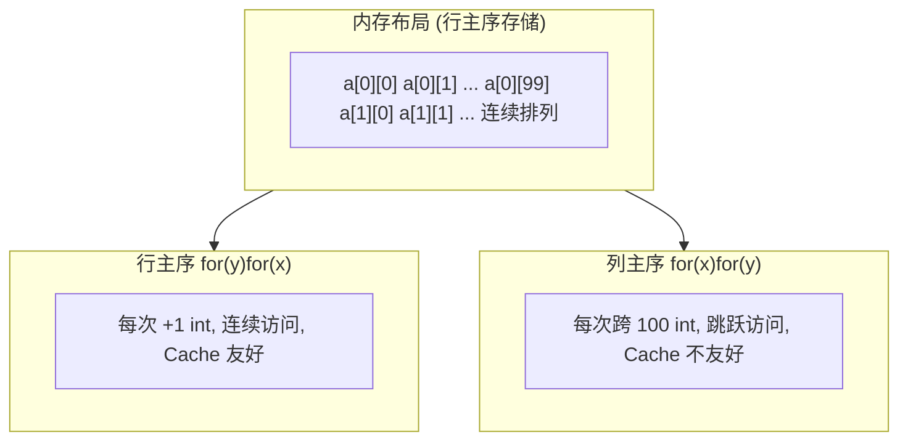
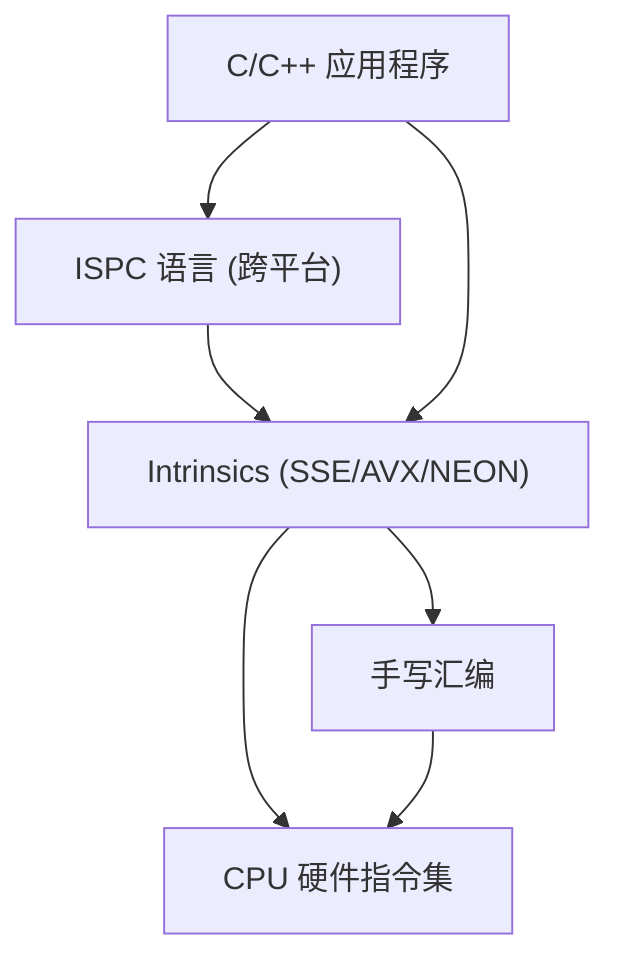
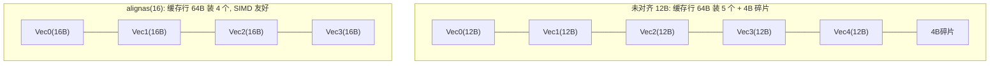
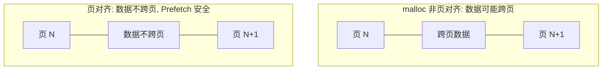
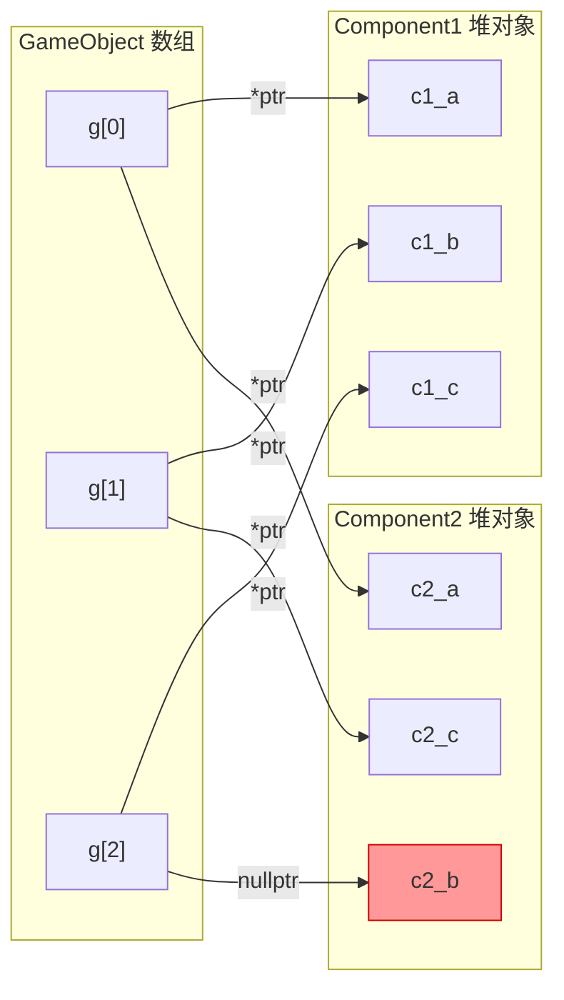
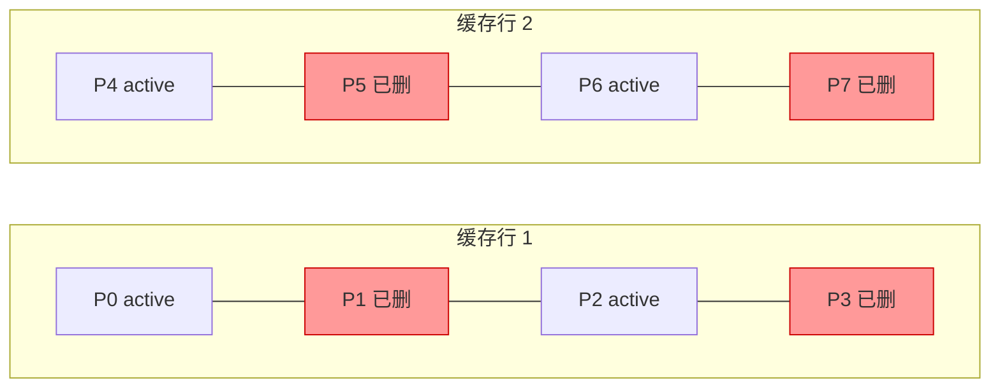
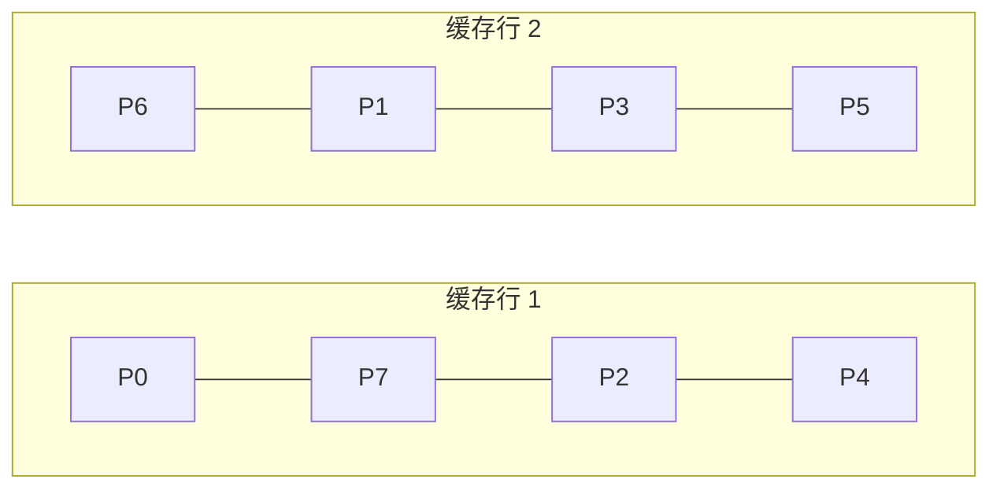
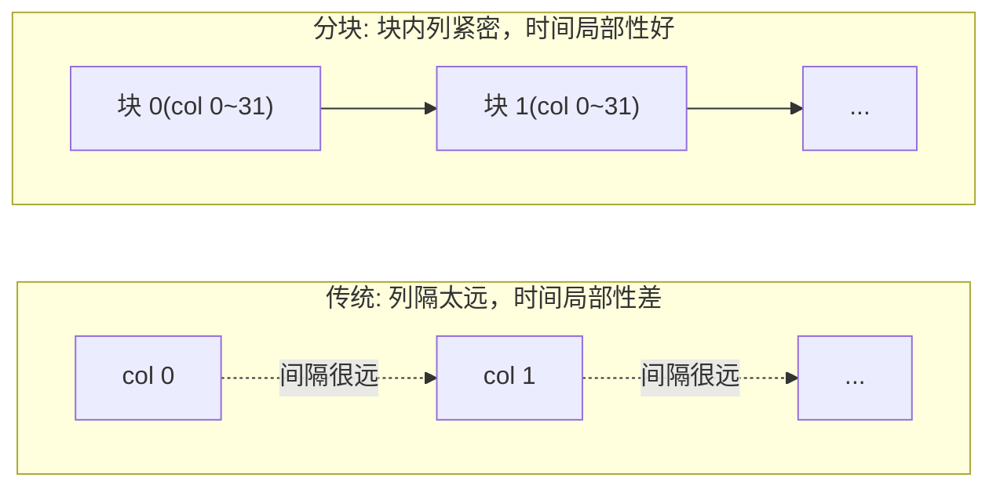
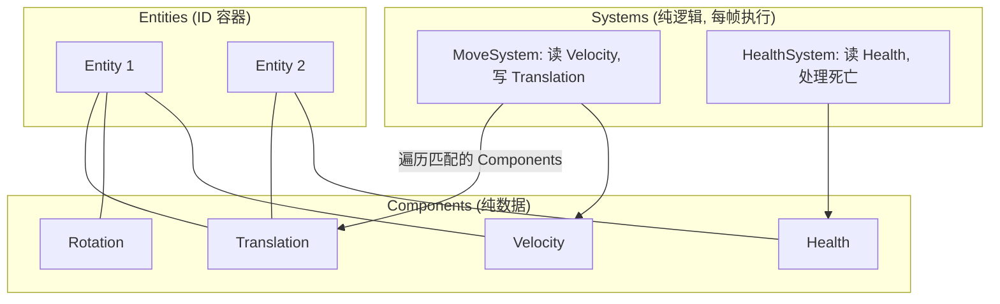
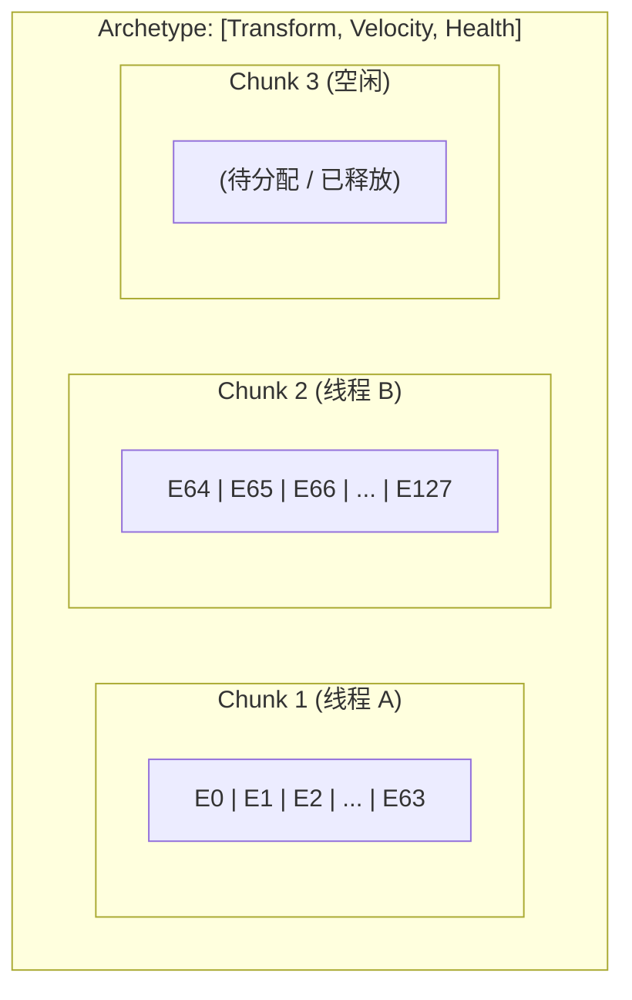

# 利用 CPU Cache 与 SIMD 优化程序性能

> 从 CPU Cache 的角度出发来减少 memory-bound，从指令级并行（SIMD 指令）的角度出发来减少 CPU-bound。

---

## 目录

- [背景：从 OOP 到 DOP](#背景从-oop-到-dop)
- [一、利用 CPU Cache](#一利用-cpu-cache)
  - [1.1 数据通路与缓存层级](#11-数据通路与缓存层级)
  - [1.2 局部性原理](#12-局部性原理)
  - [1.3 空间局部性](#13-空间局部性)
  - [1.4 预取（Prefetching）](#14-预取prefetching)
  - [1.5 直写（Streaming）](#15-直写streaming)
  - [1.6 伪共享（False Sharing）](#16-伪共享false-sharing)
- [二、访存优化](#二访存优化)
  - [2.1 行主序遍历 vs 列主序遍历](#21-行主序遍历-vs-列主序遍历)
  - [2.2 分块访问](#22-分块访问)
  - [2.3 循环融合（Loop Fusion）](#23-循环融合loop-fusion)
- [三、利用 SIMD 指令](#三利用-simd-指令)
  - [3.1 SIMD 基础](#31-simd-基础)
  - [3.2 引导编译器自动矢量化](#32-引导编译器自动矢量化)
  - [3.3 ISPC 语言](#33-ispc-语言)
  - [3.4 避免 Gather 行为](#34-避免-gather-行为)
- [四、数据布局优化](#四数据布局优化)
  - [4.1 结构体大小对齐到 2 的幂次方](#41-结构体大小对齐到-2-的幂次方)
  - [4.2 分配页对齐的内存](#42-分配页对齐的内存)
    - [实用工具 ndarray](#实用工具-ndarray)
  - [4.3 使用对象数组存储批处理对象](#43-使用对象数组存储批处理对象)
  - [4.4 AOS、SOA、AOSOA](#44-aossoaaosoa)
  - [4.5 避免无效数据夹杂在 Cache](#45-避免无效数据夹杂在-cache)
  - [4.6 冷热数据分割](#46-冷热数据分割)
- [五、应用案例](#五应用案例)
  - [5.1 Blur 操作优化](#51-blur-操作优化)
  - [5.2 ECS 架构](#52-ecs-架构)
- [六、总结](#六总结)
- [参考资料](#参考资料)

---

## 背景：从 OOP 到 DOP

随着软件需求的日益复杂发展，远古时期的面向过程编程（POP）思想才渐渐萌生了面向对象编程思想。当人们发现面向对象在应对高层软件的种种好处时，越来越沉醉于面向对象（OOP），热衷于研究如何更加优雅地抽象出对象。然而现代开发中渐渐发现面向对象编程层层抽象造成臃肿，导致运行效率降低，而这是性能要求高的游戏编程领域不想看到的。

之后，面向数据编程（DOP）的思想越来越被接受，已经是现代游戏编程中不可或缺的一部分，ECS 架构也成了游戏工业界里架构的一个典中典。

---

## 一、利用 CPU Cache

### 1.1 数据通路与缓存层级

- 一般的数据通路：**CPU Register（CPU 寄存器） ←→ Main Memory（内存）**

CPU 的运行频率非常快，而 CPU 访问内存的速度很慢。在上述数据通路的情况下，在处理器时钟周期内，CPU 常常需要等待寄存器读取内存，浪费时间。

CPU Cache 是介于内存和 CPU 寄存器之间的一个存储区域。CPU 访问 CPU Cache 速度会比访问内存快很多，但同时 CPU Cache 的存储空间比内存小，比寄存器大。

- 引入了 Cache 的数据通路：**CPU Register（CPU 寄存器） ←→ CPU Cache（CPU 缓存） ←→ Main Memory（内存）**

为了缓解 CPU 和内存之间速度的不匹配问题，则会让 CPU Cache 充当它们之间的一个缓冲中介。

CPU Cache 会预先读取好 CPU 可能会访问的内存数据到 Cache 上。

- 如果 Cache 命中成功，则 CPU 便可以很快从 Cache 上读取出想要的内存数据到寄存器（**减少 memory-bound**）
- 如果 Cache 命中失败，那么 CPU 便直接访问内存

> 下图是一个现代 CPU（Intel Core i7 Cache Hierarchy）的简化架构样例，可以大概了解下 Cache 的分级和关系：CPU core 的 Register（寄存器）可以和 L1 d-cache 直接通信；一个 CPU core 拥有 L1 d-cache（数据缓存），L1 i-cache（指令缓存），L2 cache；多个 CPU core 共享 L3 cache。

**各级缓存的典型延迟参考（粗略量级）：**

| 缓存层级 | 典型大小 | 访问延迟（约） |
|----------|----------|----------------|
| L1 Cache | 32 KB   | ~1 ns（4 cycles） |
| L2 Cache | 256 KB  | ~3 ns（10 cycles） |
| L3 Cache | 8 MB    | ~12 ns（40 cycles） |
| 内存      | 若干 GB  | ~100 ns（~200 cycles） |

> 可以看到，L1 和内存之间的延迟差距可达两个数量级，因此提升 Cache 命中率对性能至关重要。

### 1.2 局部性原理

那么 CPU Cache 一般读取的数据是什么呢？它是基于两个局部性来决定的：

- **空间局部性（Spatial Locality）**：如果某个数据被访问，那么与它相邻的数据很快也能被访问。
- **时间局部性（Temporal Locality）**：如果某个数据被访问，那么在不久的将来它很可能再次被访问。

CPU Cache 根据这两个特点，一般存储的是 **最近被访问过的数据** 和 **被访问数据的相邻数据**。

### 1.3 空间局部性

CPU Cache 和内存之间传输数据的最小单位是 **缓存行（Cache Line）**，一般为 **64 字节**。

换句话说，假如通过内存直接访问了某个 16 字节的内存数据之后（Cache 命中失败一次），那么 Cache 会将该数据所处内存位置的整行（64 字节）读取出来存着。倘若接下来要使用的 3 个 16 字节的内存数据都在 Cache 中（Cache 命中），那么 CPU 就直接去 Cache 取数据，而不必要进行内存直接访问。

而如果要使用的数据在内存中的分布间隔比较疏远，那么可能会发生更多次的内存直接访问和缓存行读取（多次 Cache 命中失败）。

**因此要尽可能充分利用好空间局部性来提高 CPU Cache 命中率，关键就是要尽量让使用的数据紧凑在一起。**

### 1.4 预取（Prefetching）

此外，现代 CPU 还会智能预测出可能要访问到的内存，提前给 Cache 发送一个读取缓存行指令，而不是等到命中失败后再读取缓存行。

> 例如，当程序顺序访问 a[0], a[1] 时（假设一个元素占据刚好一个缓存行，即 64 字节），CPU 会智能地预测到接下来可能会读取 a[2]，于是让 Cache 提前读取 a[2] 所在的缓存行。Cache 在后台默默读取数据的同时，CPU 自己在继续处理 a[0] 的数据。
>
> 这样等 a[0], a[1] 处理完以后，Cache 也刚好读取完 a[2] 了，从而 CPU 不用等待就可以直接开始处理 a[2]，避免等待数据的时候 CPU 空转浪费时间。

**预取（prefetch）**：由硬件自动识别程序的访存规律，决定要预取的地址。一般来说只有线性的地址访问规律（包括顺序、逆序；连续、跨步）能被识别出来，而如果程序的访存是随机的，那就很难预测，于是 CPU 不得不放弃预取，空转等待数据的抵达才能继续工作，浪费了时间。

但实际上，对于不得不随机访问一块的情况，我们还可以通过指令手动预取一个缓存行，只不过相比硬件自动预取的速度仍然会慢些。

**`_mm_prefetch`**：手动从内存地址预取一个缓存行

```cpp
_mm_prefetch(&a[i*16], _MM_HINT_T0);  // example
```

- 第一个参数：要预取的地址（最好对齐到缓存行，即 64 字节）
- 第二个参数（预取策略）：
  - `_MM_HINT_T0`：预取数据到一级 Cache
  - `_MM_HINT_T1`：预取数据到二级 Cache
  - `_MM_HINT_T2`：预取数据到三级 Cache
  - `_MM_HINT_NTA`：预取到非临时缓冲结构中，可以最小化对 Cache 的污染，但是必须很快被用上

**需要注意的是，prefetch 后是需要一定时间后才能取到缓存行，而不是立即可以访问该行数据**，因此要访问该行数据时，应提前一定的时间来 prefetch。

但提前的时间又不能太久，不然可能堆积太多数据到当前级别的 Cache，到最后 Cache 容纳不下，不得不把最早 prefetch 的数据下放到下一级 Cache 乃至内存。

```cpp
// example：提前 32 次循环来 prefetch
for (int y = 0; y < N; y++)
{
    _mm_prefetch(&a[y+32][0], _MM_HINT_T0);
    float sum = 0.0f;
    for (int x = 0; x < 16; x++)
    {
        sum += a[y][x];
    }
    b[y][0] = sum;
}
```

### 1.5 直写（Streaming）

当 CPU 试图写入时，Cache 往往假设这个写入的内存地址所在的 64 字节（一个缓存行大小）会在将来再次用到，因此会将该缓存行读取进 Cache。

但如果想要的只是纯粹的直接写入（Streaming）内存行为，而 Cache 还是从内存中读取了缓存行，就会浪费多约 1 倍的带宽。

> 容易推出：写入耗时是读取耗时的 2 倍；写入时同时读取的耗时和单单写入的耗时几乎是一样的。

**`_mm_stream_si32`**：可代替直接赋值的写入，绕过 Cache 并直接写入 4 字节到挂起队列。

- 只支持 int 做参数，使用别的类型则需要强制转换成 int 类型

**`_mm_stream_ps`**：利用 xmm 寄存器一次性写入 16 字节到挂起队列，更加高效。

- 第二个参数是 `__m128` 类型，一般配合 SIMD 指令使用
- 写入的地址必须对齐到 16 字节，否则会产生段错误等异常

stream 系列指令需要注意的是：

- **挂起队列凑满 64 字节后将直接写入内存，从而完全避免读的带宽**
- **写入的地址必须是连续的，中间不能有跨步，否则无法合并写入（会产生有中间数据读的带宽）**

```cpp
_mm_stream_si32((int*)&a[i], *(int*)&value);  // example
_mm_stream_ps(&a[i], _mm_set1_ps(1.f));        // example
```

**推荐符合以下全部情况时才应该用 stream 指令代替赋值写入：**

1. **想要写入的内容长度应为 64 字节的若干倍** — 为了凑满挂起队列
2. **写入前不久没有读取该数组** — 如果写入前不久读取过该数组，那么 Cache 大概率是存储了该数组的内容，赋值写入行为就是写入到 Cache 中，并不需要 stream 指令优化
3. **写入后没有立即读取该数组** — 因为 stream 会直接把数据写入到内存，之后立即读取的话，就需要等待 stream 写回执行完成，然后重新读取到 Cache，反而更低效

---

> **冷知识：为什么 write0 比 write1 快？**
>
> ```cpp
> void write0() {
>     for (int i = 0; i < N; i++) a[i] = 0;
> }
> void write1() {
>     for (int i = 0; i < N; i++) a[i] = 1;
> }
> ```
>
> **答**：write0 代码被编译器优化成 `memset`，而 `memset` 的实现利用了 stream 指令绕开缓存以获得更快的写入速度。把 write1 也换成 stream 指令时，就可以获得与 write0 差不多的运行时间。
>
> ```cpp
> void write1() {
>     for (int i = 0; i < N; i++) _mm_stream_si32(&a[i], 1);
> }
> ```

### 1.6 伪共享（False Sharing）

在多核的情形下，Cache 还需要注意 False Sharing 现象。

**伪共享（False Sharing）**：当多个 CPU core 同时写入的地址非常接近时，速度会变得很慢。

这是因为如果两个 core 同时要修改内存上的某个缓存行（64 字节）时，可能一个修改了前 32 字节而另一个修改了后 32 字节。为了保证缓存行写回内存时的一致性（既有前 32 字节的修改，又有后 32 字节的修改），Cache 只敢将该缓存行读取进所有 core 可共享的 L3 Cache，而不敢读取进每个 core 独有的 L1 Cache。

因此，**多个 core 同时写入同一缓存行的速度受限于 L3 Cache 的速度，而不是 L1 Cache 的速度**。

> 不过，False Sharing 只会发生在多个 core 同时写入的情况。如果多个核心同时读取很靠近的变量，是不会产生冲突的，因此 CPU 也可以放心读取进 L1 Cache。

**如何避免 False Sharing：**

- 尽量把每个 core 写入的地址分隔开至少 **64 字节**（一个缓存行大小）的间距
- 在 C++ 中可使用 `alignas(64)` 或 `std::hardware_destructive_interference_size`（C++17）来确保变量对齐到独立的缓存行

```cpp
// C++17: 确保两个变量位于不同缓存行
struct alignas(std::hardware_destructive_interference_size) PerThreadData {
    int counter;
    // ...
};
```

---

## 二、访存优化

### 2.1 行主序遍历 vs 列主序遍历

对二维数组 `int a[100][100]` 的遍历：

```cpp
// 行主序遍历（Row-Major）
for (int y = 0; y < 100; ++y)
    for (int x = 0; x < 100; ++x)
        sum += a[y][x];

// 列主序遍历（Column-Major）
for (int x = 0; x < 100; ++x)
    for (int y = 0; y < 100; ++y)
        sum += a[y][x];
```

内循环应该是对 x 递增（行主序遍历）还是对 y 递增（列主序遍历）比较快？

**答**：对 x 递增（行主序遍历）比较快。因为，对 x 的递增（行主序遍历）是 1 个 int 大小的跳转，也就是说容易访问到相邻的内存，即容易命中 Cache；对 y 的递增（列主序遍历）是 100 个 int 大小的跳转，不容易命中 Cache。



> **经验法则**：C/C++ 中多维数组采用行主序（Row-Major）存储，所以**让最内层循环沿着内存连续的方向遍历**，是 Cache 优化的第一原则。

### 2.2 分块访问

我们知道列主序遍历比行主序遍历的跳转更大，因此性能差了很多。但这是否意味着列向（纵向）的访问就必定是低效？

**答**：不是。只要对访问的区域进行分块（Tiling / Blocking），让每一块的大小都相当于装满 Cache 的容量（例如 L1 Cache 有 32 KB），那么在这个块内的任何次序的访问都是可以命中 Cache 的。

> 如图，假设 Cache 只能容纳 4 个缓存行，一个缓存行相当于 4 个数据大小，那么：
>
> - 左图按照行主序遍历有 75% 的 Cache 命中率
> - 右图采用分块访问，块内部采用列主序遍历，但也有 75% 的 Cache 命中率
>
> 不过还要一提，在实际的 CPU 环境中，按行主序遍历命中率还会更高些（例如因为硬件预测 prefetch 机制），所以**分块访问更适合用在不得不采用非连续访问的情形**（如矩阵转置、图像模糊等）。

```cpp
// 分块访问示例：矩阵转置
constexpr int BLOCK = 32; // 根据 L1 Cache 大小调整
for (int y = 0; y < N; y += BLOCK)
    for (int x = 0; x < N; x += BLOCK)
        for (int yy = y; yy < y + BLOCK && yy < N; yy++)
            for (int xx = x; xx < x + BLOCK && xx < N; xx++)
                B[xx][yy] = A[yy][xx];
```

#### 矩阵乘法分块

另一个经典案例是**矩阵乘法** `C = A × B`。朴素三重循环中，B 按列访问导致大量 cache miss：

```cpp
// 朴素矩阵乘法：B 按列访问，Cache 极不友好
for (int i = 0; i < N; i++)
    for (int j = 0; j < N; j++)
        for (int k = 0; k < N; k++)
            C[i][j] += A[i][k] * B[k][j];  // B[k][j] 跨行跳跃
```

分块后，将矩阵切成小块，每次计算一个小块的乘积，让 B 的小块能在 Cache 中被充分复用：

```cpp
// 分块矩阵乘法：所有访问都在块内连续
constexpr int BLK = 64;  // 块大小适配 L1 Cache
for (int i0 = 0; i0 < N; i0 += BLK)
    for (int j0 = 0; j0 < N; j0 += BLK)
        for (int k0 = 0; k0 < N; k0 += BLK)
            for (int i = i0; i < i0 + BLK && i < N; i++)
                for (int j = j0; j < j0 + BLK && j < N; j++)
                    for (int k = k0; k < k0 + BLK && k < N; k++)
                        C[i][j] += A[i][k] * B[k][j];
```

> 分块矩阵乘法将 Cache 命中率从接近 0 提升到接近 100%，典型加速比可达 **5~20 倍**。

### 2.3 循环融合（Loop Fusion）

当多个循环遍历同一数组时，可以将它们**合并为一个循环**，这样数据只被加载进 Cache 一次，避免多次遍历带来的重复 Cache miss。

```cpp
// 融合前：两次独立遍历，a[] 需加载两次
for (int i = 0; i < N; i++)
    a[i] = b[i] + c[i];
for (int i = 0; i < N; i++)
    d[i] = a[i] * e[i];

// 融合后：一次遍历，a[] 加载一次即被复用
for (int i = 0; i < N; i++) {
    a[i] = b[i] + c[i];
    d[i] = a[i] * e[i];
}
```

> **适用条件**：两个循环的迭代空间相同、无循环间依赖。编译器在 `-O2` 以上有时会自动做融合，但跨函数或复杂场景下仍需手动优化。

---

## 三、利用 SIMD 指令

### 3.1 SIMD 基础

**SIMD（Single Instruction Multiple Data）**：简单说就是用单个指令来同时对多个数据分别执行相同的操作，实现指令级并行，可以大大增加计算密集型程序的吞吐量。

SIMD 把多个 float 打包到一个 xmm 寄存器里同时运算，很像数学中矢量的逐元素加法。因此 SIMD 优化又被称为**矢量化（Vectorization）**，而原始的一次只能处理 1 个 float 的方式，则称为**标量（Scalar）**。

> 例如，两个 int32 可以打包成一个 int64，四个 int32 可以打包成一个 `__m128`，八个 int32 可以打包为一个 `__m256`（需支持 AVX 指令集）。

在一定条件下，聪明的编译器能够自动把处理标量 float 的代码，转换成利用 SIMD 指令来处理矢量 float 的代码，从而减轻 CPU-bound，增强程序的吞吐能力。

> 我们可以查看生成的汇编代码来推断出有无矢量化成功，例如对于加法指令：
>
> | 指令 | 含义 |
> |------|------|
> | `addss` | 一个 float 加法（标量单精度） |
> | `addsd` | 一个 double 加法（标量双精度） |
> | `addps` | 四个 float 加法（矢量单精度） |
> | `addpd` | 两个 double 加法（矢量双精度） |
>
> - add 后面第一个字母：**s** = 标量（scalar），**p** = 矢量（packed）
> - add 后面第二个字母：**s** = 单精度 float，**d** = 双精度 double
>
> 如果编译器生成的汇编里，有大量 `ss` 结尾的指令则说明矢量化失败；如果看到大多数都是 `ps` 结尾则说明矢量化成功。

理想状态下，同时处理 4 个 float 的 SIMD 指令可以加速约 **4 倍**（对于 CPU-bound 程序）。

但是 SIMD 指令也有一定局限，因为它一般对矢量算术型操作（例如矢量相加，矢量相乘）支持的很好，而不支持其他类型操作（例如分支判断和跳转）。所以 SIMD 技术常用于 CPU 计算密集型应用（例如人工智能、物理计算、粒子系统、光线追踪、图像处理）。

而现在主流就是用 SSE/AVX 指令集来实现 SIMD 技术，并且现代 x86 CPU 都支持了 SSE 系列指令集：

- **SSE 指令集**：128 位操作（4×32bits 或 2×64bits）
- **AVX 指令集**：256 位操作（8×32bits 或 4×64bits）
- **AVX-512 指令集**：512 位操作（16×32bits 或 8×64bits）

> 我们可以在编译器里通过 `-mavx`、`-mavx2`、`-mavx512f` 等选项来启用对应的指令集支持。

### 3.2 引导编译器自动矢量化

首先，编译器需要添加命令行选项 `-O1`、`-O2`、`-O3` 可以进行不同级别的优化（包含 SIMD 优化），这样可以提高程序的性能，同时代价是也会加大程序的规模。

但是在相当部分情形下，编译器仍然不敢去做 SIMD 优化。

> 例如，在下面这个例子中，由于编译器不确定 a 指针和 b 指针是否指向同一块地方（**指针别名 / Pointer Aliasing**），因此不敢进行 SIMD 优化。
>
> ```cpp
> void func(float* a, float* b) {
>     for (int i = 0; i < 1024; i++)
>         a[i] = b[i] + 1;
> }
> ```
>
> **方案一：`__restrict`** — 保证 a 和 b 不会有数据依赖，可让编译器大胆执行 SIMD 优化。
>
> ```cpp
> void func(float* __restrict a, float* __restrict b) {
>     for (int i = 0; i < 1024; i++)
>         a[i] = b[i] + 1;
> }
> ```
>
> **方案二：OpenMP 指令** — 强行启用 SIMD 优化（需编译器打开 `-fopenmp` 选项）。
>
> ```cpp
> void func(float* a, float* b) {
> #pragma omp simd
>     for (int i = 0; i < 1024; i++)
>         a[i] = b[i] + 1;
> }
> ```
>
> 而对于 `std::vector` 等变成引用的情形，无法使用 `__restrict`，通常通过 `#pragma omp simd` 或 `#pragma GCC ivdep` 来强制矢量化：
>
> ```cpp
> void func(std::vector<int>& a, std::vector<int>& b) {
> #pragma omp simd
>     for (int i = 0; i < 1024; i++)
>         a[i] = b[i] + 1;
> }
> ```

如果引导编译器进行隐式的 SIMD 优化仍不够多，那么可以包含进 SIMD 指令集库来直接显式使用 SIMD 指令，就能更大程度利用 SIMD 指令集。



但是，这样编写的代码就需要根据不同平台指令集，包含不同指令集库头文件（无跨平台特性），而且使用这些接近汇编指令会让代码变得晦涩难懂。

### 3.3 ISPC 语言

- ISPC 是英特尔推出的面向 CPU 的着色器语言，它适用多种指令集的矢量指令（如 SSE2、SSE4、AVX、AVX2 等）
- ISPC 是基于 C 语言的，所以它大部分语法和 C 语言是一致的，可以减少学习成本
- ISPC 源代码，经过编译后输出 `.obj` 文件和 `.h` 文件。这样我们在编写 C/C++ 程序时可以包含该头文件以使用 ISPC 代码

> 在线编译器 Godbolt，可以用于测试 ISPC 代码及调试汇编代码：[Compiler Explorer | ISPC](https://ispc.godbolt.org/)

ISPC 语言的语法非常易学，因为它的关键字真的很少：

- 类似于 C/C++ 的关键字：`if`, `else`, `switch`, `for`, `while`, `do…while`, `goto`
- 支持并行循环的关键字：`foreach`, `foreach_active`, `foreach_tiled`, `foreach_unique`

> 更多更具体的 ISPC 语法就不多讲解，可以自行去查看官方文档（文末参考部分会给出链接）。

```cpp
// 标准 C/C++ 代码：标量循环
void func(int N,
    float A[],
    float B[],
    float C[]) {
    for (int i = 0; i < N; i++) {
        C[i] = A[i] * B[i];
    }
}
```

上面是一个正常的 C/C++ 循环代码，这样就是一般的分量操作（每次处理 1 个元素）。

在 ISPC 语法里，只需简单的写上 `foreach(i = 0 ... N)`，ISPC 编译器编译时会为其编译成一次循环并行处理 M 个元素，实际循环 N/M 次：

```cpp
// ISPC 代码：自动并行化
export void rgb2grey(int N,
    uniform float A[],
    uniform float B[],
    uniform float C[]) {
    foreach (i = 0 ... N) {
        C[i] = A[i] * B[i];
    }
}
```

> 更方便的是，ISPC 会自动处理并行循环的边界情况（例如每次并行处理 4 个元素时，N/4 次循环后余出 1~3 个元素）；而且 ISPC 还支持 Parallel For，利用多核进一步并行化循环。

### 3.4 避免 Gather 行为

SIMD 寄存器读取变量一般都是一次性读取连续若干个变量，这种行为叫做**矢量读取（Vector Load）**。

这是一个 OOP（面向对象编程）定义的颜色结构：

```cpp
struct Color {
    float r, g, b;
};
Color colors[1024];
```

其内存分布为 `(rgb)(rgb)(rgb)...`。当程序只想要对 4 个 r 分量进行矢量化操作时，却需要进行多次非连续读取，这被称为 **Gather 行为**，对 SIMD 极不友好。

如果我们将结构体定义成 SOA 风格：

```cpp
struct VaryingColor {
    float r[VLEN];
    float g[VLEN];
    float b[VLEN];
};
Color colors[1024 / VLEN];
```

其内存分布变为 `(rrrr...)(gggg...)(bbbb...)`，可以一次 Vector Load 得到 4 个 r 分量，从而更加容易进行 SIMD 优化，而且也是对齐到 2 的幂次方，因此被称为一种 **SIMD 友好型结构**。

而在 ISPC 语言里，使用 `varying` 类型可以在代码层面上符合 OOP 设计思想，在实际编译出来的行为上却是实现成 SIMD 友好型结构，非常方便：

```cpp
struct Color {
    float r, g, b;
};
varying Color vPixels[1024];
```

---

## 四、数据布局优化

### 4.1 结构体大小对齐到 2 的幂次方

结构体大小如果对齐到 2 的幂次方字节，会对计算机各种硬件更加友好。

> 例如：SIMD 矢量化单位往往是 16 字节或 32 字节，对齐可以更加容易 SIMD 矢量化。

为了填充结构体大小，可以直接塞入 padding 变量：

```cpp
struct MyVec {
    float x;
    float y;
    float z;
    char padding[4];   // 12 + 4 = 16 bytes
};
```

而 C++11 提供了 `alignas` 的语法糖，自动塞入 padding，让 struct 对齐到指定的大小：

```cpp
struct alignas(16) MyVec {
    float x;
    float y;
    float z;
};
```

但同时，要注意塞入 padding 后的结构体大小比原来大了，为此可能带来另一种性能代价：

> 例如：原本一个缓存行可以装载 5 个 MyVec，对齐后只能装载 4 个 MyVec，影响 Cache 命中率。



因此，**结构体尽量设计成对齐 2 的幂次方大小，实在对不齐则需要严格测试两种方式的性能，再选择是否使用 padding 对齐**。

### 4.2 分配页对齐的内存

操作系统的内存是采用分页（page）来管理的，有些页可能不可访问或者还没有分配到内存，访问这些页就会产生异常，进入内核模式。**因此硬件出于安全，会让 Cache Prefetch 不能跨越页边界，否则可能会触发不必要的 page fault。**

那么，只要我们申请分配内存时边界地址对齐到页：

- 所需分配的内存大小 ≤ 一页（4096 B）时，就能完全避免块内部跨页现象
- 所需分配的内存大小 > 一页（4096 B）时，则稍微注意一下内部访问的对齐也能避免内部跨页现象

而使用 `malloc` 等常用的内存分配是不对齐的，那么无论所需分配的内存有多大，都不能保证避免内部跨页现象。



**`_mm_malloc`**：申请起始地址对齐到指定边界地址大小的一段内存，**为了实现页对齐，应当将边界地址大小设置为 4096 字节**；需要搭配 `_mm_free` 使用；仅适用于 Intel 编译器。

```cpp
float* a = (float*)_mm_malloc(n * sizeof(float), 4096);
// ... use ...
_mm_free(a);
```

**`aligned_alloc`**（C++17 `<cstdlib>` 或 C11）：标准化的内存对齐分配函数，跨平台性更好。

```cpp
float* a = (float*)aligned_alloc(4096, n * sizeof(float));
// ... use ...
free(a);  // aligned_alloc 分配的内存可用标准 free 释放
```

> **实用工具 — ndarray**：小彭老师的并行课提供了一个 `ndarray<维度, 类型, 对齐边界>` 多维数组模板类，自动处理对齐分配和边界填充，适合在工程中落地 Cache 友好的数组操作：
>
> ```cpp
> ndarray<2, float, 16> a(nx, ny);  // 2D float 数组，自动对齐到 16 字节
> a(x, y) = 1.0f;
> ```
>
> 参考：[parallel101/course - ndarray.h](https://github.com/parallel101/course/blob/master/07/07_stencil/01/ndarray.h)

### 4.3 使用对象数组存储批处理对象

传统的组件模式，往往让游戏对象持有一个或多个组件的引用（指针）：

```cpp
// 例如一个游戏对象类，包含了 2 种组件的指针
class GameObject {
    // ...GameObject 的属性
    Component1* m_component1;
    Component2* m_component2;
};
```



游戏对象/组件往往是批处理操作较多（每帧更新/渲染/或其他操作）的对象。

这个传统结构相应的每帧更新代码：

```cpp
for (int i = 0; i < GameObjectsNum; ++i) {
    if (g[i].component1 != nullptr) g[i].component1->update();
    if (g[i].component2 != nullptr) g[i].component2->update();
}
```

而根据图中可以看到，这种指来指去的结构对 CPU Cache 极其不友好：为了访问各个组件，总是跳转到不相邻的内存。

倘若游戏对象和组件的更新顺序不影响游戏逻辑，则一个可行的办法是将他们都以**连续数组**形式存在。

> **注意**：是对象数组，而不是指针数组。如果是指针数组的话，这对 CPU 缓存命中没有意义（因为要通过指针跳转到不相邻的内存）。

```cpp
Component1 a[MAX_COMPONENT_NUM];
Component2 b[MAX_COMPONENT_NUM];

// 连续数组存储能让下面的批处理中 CPU 缓存命中率较高
for (int i = 0; i < Component1Num; ++i) {
    a[i].update();
}
for (int i = 0; i < Component2Num; ++i) {
    b[i].update();
}
```

### 4.4 AOS、SOA、AOSOA

**AOS（Array of Struct）**：单个对象的属性紧挨着存，即 `(xyz)(xyz)(xyz)(xyz)`

```
AOS 内存布局:
+-----+-----+-----+-----+-----+-----+-----+-----+
| x0  | y0  | z0  | x1  | y1  | z1  | x2  | ... |
+-----+-----+-----+-----+-----+-----+-----+-----+
每次访问 x 分量需要跳过 y,z -> 不利于 SIMD Vector Load
```

- 是 OOP（面向对象编程）的数据布局方式，便于存储在各类容器
- AOS 必须对齐到 2 的幂才能高效（便于 SIMD 优化），但总体来看往往效率不高

```cpp
struct MyVec { float x; float y; float z; };
MyVec a[N];

void func() {
    for (int i = 0; i < N; i++) {
        a[i].x *= a[i].y;
    }
}
```

**SOA（Struct of Array）**：属性分离存储在多个数组，即 `(xxxxxxxx)(yyyyyyyy)(zzzzzzzz)`

```
SOA 内存布局:
x[]: +-----+-----+-----+-----+-----+-----+-----+-----+
     | x0  | x1  | x2  | x3  | x4  | x5  | x6  | x7  |
     +-----+-----+-----+-----+-----+-----+-----+-----+
y[]: +-----+-----+-----+-----+-----+-----+-----+-----+
     | y0  | y1  | y2  | y3  | y4  | y5  | y6  | y7  |
     +-----+-----+-----+-----+-----+-----+-----+-----+
z[]: +-----+-----+-----+-----+-----+-----+-----+-----+
     | z0  | z1  | z2  | z3  | z4  | z5  | z6  | z7  |
     +-----+-----+-----+-----+-----+-----+-----+-----+
一次 Vector Load 即可读取 4 个 x -> SIMD 友好
```

- 比较反直觉，只适合存储在数组，属于 DOP（面向数据编程）的一种数据布局方式
- 便于 SIMD 优化，通常效率更高

```cpp
struct MyVec { float x[N]; float y[N]; float z[N]; };
MyVec a;

void func() {
    for (int i = 0; i < N; i++) {
        a.x[i] *= a.y[i];
    }
}
```

**AOSOA（Array of Struct of Array）**：属于 AOS 和 SOA 的组合方式，如 `((xxxx)(yyyy)(zzzz))((xxxx)(yyyy)(zzzz))`

```
AOSOA 内存布局:
块0: +-----+-----+-----+-----+-----+-----+-----+-----+-----+-----+-----+-----+
     | x0  | x1  | x2  | x3  | y0  | y1  | y2  | y3  | z0  | z1  | z2  | z3  |
     +-----+-----+-----+-----+-----+-----+-----+-----+-----+-----+-----+-----+
块1: +-----+-----+-----+-----+-----+-----+-----+-----+-----+-----+-----+-----+
     | x4  | x5  | x6  | x7  | y4  | y5  | y6  | y7  | z4  | z5  | z6  | z7  |
     +-----+-----+-----+-----+-----+-----+-----+-----+-----+-----+-----+-----+
块内 SOA (SIMD 友好) + 块间 AOS (支持容器存储)
```

- 既有 AOS 便于存储在各类容器的特性，又有类似 SOA 那样一定的高效特性
- 数据访问方式变复杂，例如遍历可能需要两层 for 循环
- 对象数量需要保证是内部 SOA 大小（例子中是 1024）的整数倍，否则需要额外特判法代码
- **内部 SOA 不宜太小**：假如内部 SOA 太小，就会使得内部循环的连续访问次数会少些，从而导致 prefetch 机制失效率更高（内部 SOA 遍历完后，需要跳转到一个 SOA 的距离，而不是一个标量的距离）

```cpp
struct MyVec {
    float x[1024];
    float y[1024];
    float z[1024];
};
MyVec a[N / 1024];

void func() {
    for (int i = 0; i < N / 1024; i++) {
        for (int j = 0; j < 1024; j++) {
            a[i].x[j] *= a[i].y[j];
        }
    }
}
```

---

**简单总结：一般来说，在面向数据编程（DOP）中应当多使用 SOA 或者 AOSOA，在大部分情况下都能获得较好的优化效果，但这不意味着 AOS 就是绝对低效的。**

| 场景 | 推荐布局 | 原因 |
|------|----------|------|
| 需要做 SIMD 优化 | SOA、AOSOA | SIMD 友好型结构，几乎都能很好做矢量化；AOS 需要对齐到 2 的幂次方才可能做部分优化 |
| 属性几乎总是同时使用 | AOS | 减轻 prefetch 压力，例如位置的 x,y,z 分量总是同时读写 |
| 属性有时只用到部分，或不一定会同时写入 | SOA | 省内存带宽，例如 position 是读写、velocity 是只读的场景 |
| 希望方便使用各种数据结构，同时享受 SOA 优化 | AOSOA | 在高层保持 AOS 的统一索引，底层又享受 SOA 带来的 SIMD 优化和缓存行预取等好处（如稀疏哈希网格等非数组数据结构） |

### 4.5 避免无效数据夹杂在 Cache

这是一个简单的粒子系统：

```cpp
// 粒子类
struct Particle {
    Vec3 position;
    Vec3 velocity;
    bool active;
    // ... 其它成员
};

int main() {
    Particle particles[MAX_PARTICLE_NUM];
    int particleNum = 1024;

    for (int i = 0; i < particleNum; ++i) {
        if (particles[i].isActive()) {
            particles[i].update();
        }
    }
    return 0;
}
```

它使用了典型的 lazy 策略：

- 当要删除一个粒子时，只需改变 active 标记，无需移动内存
- 利用标记判断，每帧更新的时候可以略过删除掉的粒子
- 当需要创建新粒子时，只需要找到第一个被删除掉的粒子，更改其属性即可

表面上看这很科学，实际上这样做 CPU Cache 命中率不高：每次批处理 CPU Cache 都加载过很多不会用到的粒子数据（标记被删除的粒子）。

> 例如：加载的两个缓存行，可能实际进行有效 update 的粒子只有 4 个，浪费了一半的 Cache。



一个可行的方法是：当要删除粒子时，将队列尾的粒子内存复制到该粒子的位置，并记录减少后的粒子数量。**移动内存（复制内存）操作是程序员最不想看到的，但是实际执行批处理带来的速度提升相比删除的开销多的非常多，除非你移动的内存对象大小实在大到令人发指。**

```cpp
particles[i] = particles[particleNum - 1];
particleNum--;
```



这样我们就可以保证在这个粒子批量更新操作中，CPU Cache 总是能以高命中率命中。

```cpp
for (int i = 0; i < particleNum; ++i) {
    particles[i].update();
}
```

### 4.6 冷热数据分割

有人可能认为这样能最大程度利用 CPU Cache：把一个对象所有要用的数据（包括组件数据）都塞进一个类里，而没有任何用指针或引用的形式间接存储数据。

实际上这个想法是错误的，我们不能忽视一个问题：**CPU Cache 的存储空间是有限的**。

于是我们希望 CPU Cache 存储的是经常使用的数据，而不是那些少用的数据。这就引入了**冷数据/热数据分割**的概念：

- **热数据（Hot Data）**：经常要操作使用的数据，一般可以直接作为可直接访问的成员变量
- **冷数据（Cold Data）**：比较少用的数据，一般以引用/指针来间接访问（即存储的是指针或者引用）

一个游戏中的例子：对于怪物对象来说，生命值、位置、速度都是经常需要操作的变量，是热数据。而掉落物对象只有怪物死亡的时候才需要用到，所以是冷数据。

```cpp
class Monster {
    Vec3 position;      // 热数据
    Vec3 velocity;      // 热数据
    float health;       // 热数据
    LootDrop* drop;     // 冷数据：通过指针间接访问
    // ...
};

class LootDrop {
    std::vector<Item> itemsToDrop;
    std::vector<float> possibility;
    // ...
};
```

---

## 五、应用案例

### 5.1 Blur 操作优化

以 2D 均值模糊的操作为例，可以分成横向的 Blur 和纵向的 Blur。按顺序做完这两个方向的 Blur，其效果就等价于对 2D 范围内的 Blur（可分离卷积核的性质）。


#### X 方向 Blur

- **使用 prefetch**：由于 Blur 的时候，最内层循环的遍历方向往往是跳到反方向的某个位置开始访问，使得硬件自动预测的 prefetch 容易失效（预测原本是期待顺着 x 方向连续访问），因此这里需要手动使用 prefetch 指令提示机器预取 Cache
- **使用 stream**：由于我们只需要写入 `b[y][x]` 而不需要读取 `b[y][x]` 的值，因此使用直写可以避免 b 数组污染 Cache

```cpp
for (int y = 0; y < height; y++)
    for (int xBase = 0; xBase < width; xBase += 16)
    {
        // prefetch，提前了 16 次内循环的时间
        _mm_prefetch(&a[y][xBase + 16], _MM_HINT_T0);
        // 一个缓存行大小
        for (int x = xBase; x < xBase + 16; x++)
        {
            float res = 0;
            for (int t = -RADIUS; t <= RADIUS; t++)
            {
                res += a[y][x + t];
            }
            // stream
            _mm_stream_ps(&b[y][x], _mm_set1_ps(res / SUM));
        }
    }
```

#### Y 方向 Blur

- **分块访问**：
  - 上图为传统行主序遍历的纵向 Blur，可以看到纵向的元素相隔的时间太远，对时间局部性不友好，很难命中 Cache
  - 下图为利用分块访问的思想，一竖块一竖块地遍历，块内正常使用行主序遍历，那么此时会发现纵向的元素相隔时间都较短，对时间局部性友好



- **使用 prefetch**：y 方向的访问必定是跳跃的，无连续可言，因此需要用 prefetch 指令提示机器预取 Cache
- **使用 SIMD 指令**：并行计算，减轻 CPU-bound
- **使用 stream**：只需要写入 `b[y][x]` 而不需要读 `b[y][x]` 的值，因此使用直写可以避免 b 数组污染 Cache

```cpp
// 对 X 分块
for (int x = 0; x < width; x += 32)
    for (int y = 0; y < height; y++)
    {
        // prefetch，提前了 RADIUS+40 次内循环的时间
        _mm_prefetch(&a[y + RADIUS + 40][x], _MM_HINT_T0);
        _mm_prefetch(&a[y + RADIUS + 40][x + 16], _MM_HINT_T0);

        // 让 res 初始化为 0，利用 SIMD (AVX指令) 置0
        __m256 res[4];
#pragma GCC unroll 4
        for (int offset = 0; offset < 4; offset++)
        {
            res[offset] = _mm256_setzero_ps();
        }

        // 利用 SIMD (AVX指令) 累加
        for (int t = -RADIUS; t <= RADIUS; t++)
#pragma GCC unroll 4
            for (int offset = 0; offset < 4; offset++)
            {
                res[offset] = _mm256_add_ps(res[offset],
                    _mm256_load_ps(&a[y + t][x + offset * 8]));
            }

#pragma GCC unroll 4
        // stream 写回
        for (int offset = 0; offset < 4; offset++)
        {
            _mm256_stream_ps(&b[y][x + offset * 8],
                _mm256_div_ps(res[offset], _mm256_set1_ps(SUM)));
        }
    }
```

> **优化效果对比**（以 X 方向 Blur 为例，来自 parallel101/course 实测）：
>
> | 优化手段 | 相对加速 | 累积加速 |
> |----------|----------|----------|
> | 朴素循环（baseline） | 1× | 1× |
> | + prefetch | ~1.3× | 1.3× |
> | + tiling（分块） | ~1.2× | 1.6× |
> | + tiling + prefetch + stream + SIMD | ~1.8× | **~2.8×** |
>
> 可见每个优化手段叠加后累积效果显著，最终可达 **3 倍左右加速**。

### 5.2 ECS 架构

**ECS 架构**：由 **Entities（实体）**、**Components（组件）**、**Systems（系统）** 三部分组成的一个面向数据编程（DOP）架构，也是游戏工业界比较新的架构。要理解 ECS 架构，可以分别从这三部分的概念了解。

> ECS 架构的普及可以归功于 GDC 2017 上的演讲 *"Overwatch Gameplay Architecture and Netcode"*，这个演讲便是讲述了《守望先锋》所使用的 ECS 架构；Unity 也有插件所支持的 Entitas 框架，再后来 Unity 2018 也推出了 ECS 框架的 preview 版本（至今仍然 preview）；至于 Epic 则在 UE5 中推出了 MASS 框架，其实也是属于一种 ECS 架构。

**Entity（实体）**：代表了一个装有若干个 Component 的容器，可以添加或删除 Component；Entity 本身没有属性和逻辑，而是通过 Components 的组合来体现 Entity 的属性组成。

**Component（组件）**：代表了一份特定格式的数据；例如：Translation，它可以包含一个 vec4 变量来表示位移数据。

**System（系统）**：代表一个每帧都会执行的行为逻辑，其接口一般是输入若干个 Component，输出（或者更准确说是修改）若干个 Component；例如：TransformUpdate，它可以输入 Rotation、Scale、Translation，然后修改 LocalToWorld。



**ECS 架构的优势：**

- 组件模式设计，解耦合，易扩展
- 数据布局对 CPU Cache 友好，减少 memory-bound
- 可以搭配 Job System 来充分利用多核，从而获得更好的并行加速，减少 CPU-bound

**缺点：**

- 编写 ECS 代码实际上就是在某种规范约束下写逻辑（DOP 是比较反直觉的，需要优先考虑数据布局），很难像面向对象编程（OOP）那样随心所欲地抽象出各种逻辑（例如父子关系就难以在 ECS 框架中实现），在某种意义上是牺牲了代码开发效率
- 在某些方面（例如游戏 UI），ECS 框架的优化效果并不明显；只有在**比较大规模相同物体**的情况下才能获得明显的优化效果

#### 更多设计细节

**Entity**

- Entity 的具体实现往往只包含一个身份 ID（索引），通过向数据结构（一般是动态数组）进行索引查询可以知道这个 Entity 对应的那些 Components

**Component**

- Component 的属性应当是强联系的，相关性不强的属性应该切分成多种 Components，这主要是为了 Cache 友好。例如一些 System 行为中，只对 Component 的部分数据感兴趣，但由于空间局部性，另一部分不感兴趣的数据也加载进 Cache（避免无效数据夹杂在连续内存）。如果切分 Component 的粒度设计的好，那么就可以只加载感兴趣的 Component 进 Cache。
- 删除 Entity 时，需要删除其对应的 Components。为此不推荐使用 lazy 标记的删除方法，而是将 buffer 中最后一个 Entity 的 Components 覆盖到被删除的位置，并将 buffer 中的 Components 数量减去 1。

**System**

- 如果确定各个 System 行为的依赖关系（无依赖关系则是最理想的情况）并分好顺序，那么就可以使用多线程来并行跑 Systems（Job System 就是为此而用的），减少 CPU-bound
- 还可以引入 LOD 机制，通过计算与玩家的距离来决定 Systems 的 update 频率

#### Unity ECS 实现举例

> 举个 Unity ECS 框架的例子，来一窥 ECS 的一种实现方案。

**Archetype（原型）**：一种 Components 的组合方式，可以把 Archetype 理解成一个类，而 Entity 则是类的实例化对象。通过 Archetype 可以生成并管理若干个含有相同 Components 组合的 Entities。

**为什么需要 Archetype？**

- 使用 Archetype 可以将相同种类的 Entities 聚拢，设计 System 的行为时就可以跑在指定种类的 Entities 上，也就是跑在一个或多个 Archetype 上



**ArchetypeChunk**：是存放 Entity 对应 Components 的 buffer，而每个 Archetype 各自管理着自己的 Chunks；每个 Chunk 只能容纳一定数量的 Components，若超出数量，Archetype 会创建新的 Chunk 来容纳多出的 Entity Components。

**为什么需要 ArchetypeChunk？**

- 假如 Archetype 直接管理着一个无限大的 Chunk，然后把所有自己实例化出来的 Entity Components 通通塞进去，那么在多线程环境下的删除等操作很容易造成冲突
- 分成若干个 Chunk（但不宜让 Chunk 容量太小，不然会丧失 ECS 的优化效果），并让每个 Chunk 最多受到一个线程的处理。那么对某个 Entity 的删除操作则只会影响当前 Chunk 的线程，不会干扰到其它线程

---

## 六、总结

本文从两个主要角度探讨了如何写出对 CPU 更友好的高性能代码：

### 减少 memory-bound（CPU Cache 优化）

| 策略 | 核心思想 |
|------|----------|
| **空间局部性** | 让数据紧凑连续存储，顺序访问 |
| **时间局部性** | 尽量复用刚访问过的数据 |
| **预取（Prefetch）** | 利用硬件自动预取 + 必要时手动 `_mm_prefetch` |
| **直写（Streaming）** | 纯写入场景用 `_mm_stream_*` 绕开 Cache，避免读带宽浪费 |
| **避免伪共享** | 多核写入的地址分隔至少 64 字节 |
| **行主序遍历** | 内层循环沿内存连续方向遍历 |
| **分块访问** | 非连续访存时，按 Cache 大小分块 |
| **SOA/AOSOA 布局** | 属性分离存储，提升 SIMD 友好度和 Cache 利用率 |
| **冷热数据分割** | 热数据内联，冷数据通过指针间接访问 |
| **避免无效数据** | 删除元素时用 swap-and-pop 代替 lazy 标记 |

### 减少 CPU-bound（SIMD 指令级并行）

| 策略 | 核心思想 |
|------|----------|
| **编译器自动矢量化** | 开启 `-O2/-O3`，使用 `__restrict` / `#pragma omp simd` 消除别名疑虑 |
| **显式 SIMD 指令** | 直接使用 SSE/AVX intrinsics 精细控制 |
| **ISPC 语言** | 用 `foreach` 语法自动生成跨平台的矢量化代码 |
| **避免 Gather** | 让数据按 SOA 风格排列，支持 Vector Load |

### 一条黄金法则

> **先测量，再优化。** 使用 profiler（如 perf、VTune、Instruments）定位真正的瓶颈所在，然后有针对性地应用上述技术。盲目的"优化"不仅可能无效，还可能让代码变复杂却毫无收益。

---

## 参考资料

- [What Every Programmer Should Know About Memory - Ulrich Drepper](https://people.freebsd.org/~lstewart/articles/cpumemory.pdf) — 关于内存与 Cache 的经典长文
- [Intel Intrinsics Guide](https://www.intel.com/content/www/us/en/docs/intrinsics-guide/index.html) — Intel SIMD 指令在线参考
- [ISPC 官方文档](https://ispc.github.io/) — Intel SPMD Program Compiler
- [GDC 2017: Overwatch Gameplay Architecture and Netcode](https://www.youtube.com/watch?v=W3aieHjyNvw) — 《守望先锋》ECS 架构演讲
- [Unity ECS 文档](https://docs.unity3d.com/Packages/com.unity.entities@latest) — Unity DOTS / ECS 官方文档
- [UE5 Mass Framework](https://docs.unrealengine.com/5.0/en-US/overview-of-mass-entity-system-in-unreal-engine/) — Unreal Engine 的 ECS 框架
- [Agner Fog's Optimization Guides](https://www.agner.org/optimize/) — C++ 与 x86 优化的权威指南
- [Compiler Explorer (Godbolt)](https://ispc.godbolt.org/) — 在线 ISPC / C++ 编译与汇编查看
