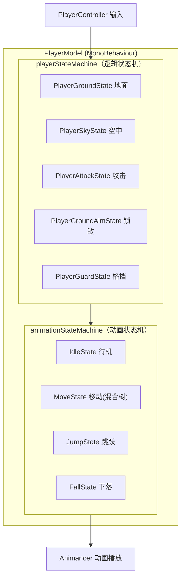
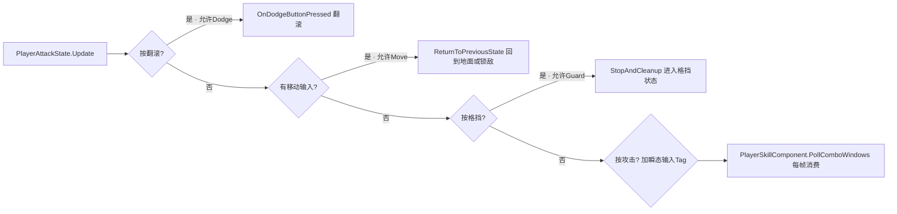
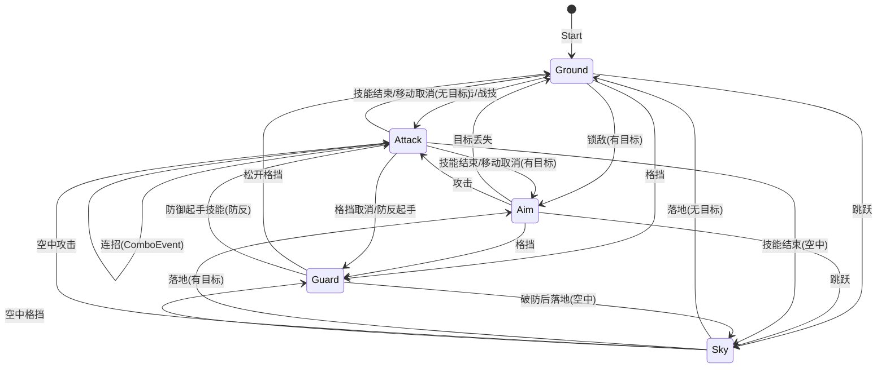
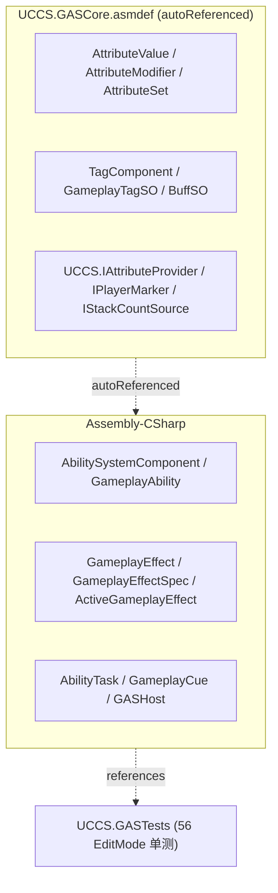
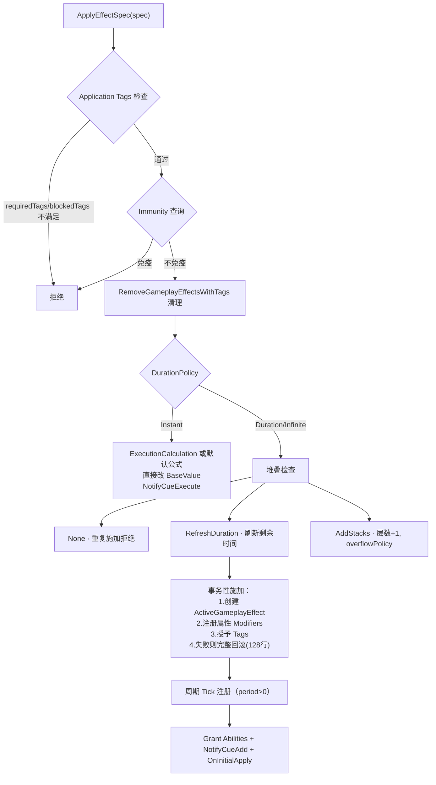
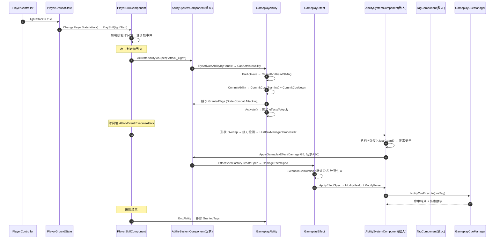
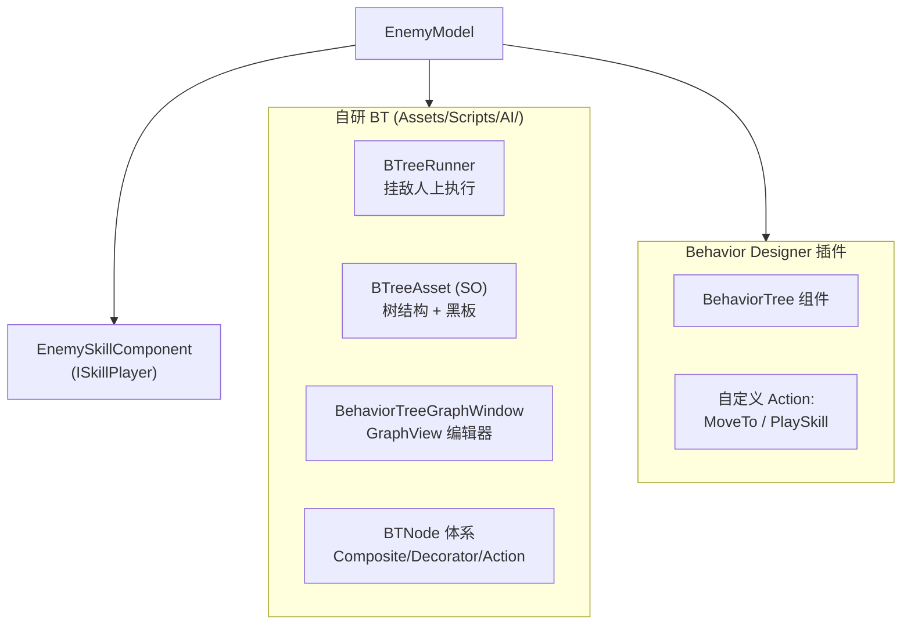
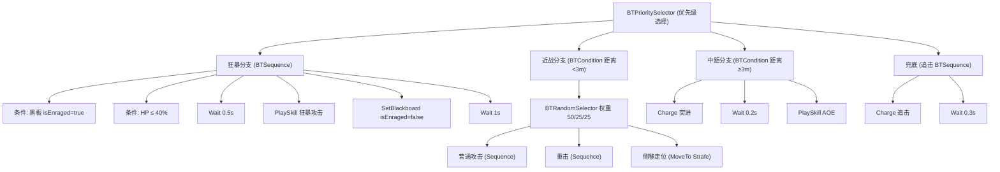
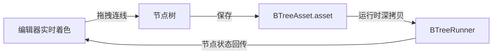

# UCCS 核心系统技术文档（状态机 / GAS / 敌人行为树）

> **项目定位**：基于 Unity 6 (URP) + Animancer 的第三人称动作游戏（类魂 + 鬼泣手感），
> 战斗系统深度参考 UE5 GAS 架构；敌人 AI 使用行为树（自研 + Behavior Designer 双轨）。
> **本文目的**：将《玩家状态机》《GAS 深度剖析》《敌人行为树》三篇面试级技术文档合并为
> 一份总文档，系统化记录三大核心系统，同时作为面试时"结合项目回答"的参考手册。
> **参考格式**：结构对齐《网络同步系统技术文档》的详细程度（表格 + Mermaid + 代码 + 口述稿 + 踩坑 + 面试速查）。

---

# 目录

1. [第一部分：玩家状态机](#第一部分玩家状态机)
2. [第二部分：GAS 深度剖析](#第二部分gas-深度剖析)
3. [第三部分：敌人行为树](#第三部分敌人行为树)

---

# 第一部分：玩家状态机

> **项目定位**：基于 Unity 6 (URP) + Animancer 的第三人称动作游戏（类魂 + 鬼泣手感），
> 核心战斗系统参考 UE5 GAS 架构。
> **本文目的**：系统化记录玩家双状态机（逻辑状态机 + 动画状态机）的设计与实现，
> 同时作为面试时"结合项目回答状态机问题"的参考手册。
> **参考格式**：本文档结构对齐《网络同步系统技术文档》的详细程度。

---


## 1. 状态机架构总览

### 1.1 双状态机设计

玩家拥有**两套独立的状态机**，分别驱动"逻辑行为"和"动画表现"：



| 维度 | 逻辑状态机 | 动画状态机 |
|------|-----------|-----------|
| 状态集 | ground / sky / attack / aim / guard | idle / move / jump / fall / aim |
| 驱动 | PlayerController 输入 + 技能事件 | 逻辑状态 + 输入 |
| 职责 | 决定"能做什么"（能否攻击/翻滚/格挡） | 决定"播什么动画" |
| 切换方式 | `playerModel.ChangePlayerState(PlayerState.xxx)` | `playerModel.ChangeAnimationState(PlayerAnimationState.xxx)` |
| 基类 | `PlayerStateBase` | `PlayerStateBase`（同一个基类！） |

> **设计亮点**：两套状态机共用同一个 `PlayerStateBase` 基类和 `StateMachine` 通用引擎，
> 只是注册的状态类不同。动画状态机甚至复用了逻辑状态的 `playerModel`/`playerController` 引用。

### 1.2 为什么拆两套状态机（面试必答）

> **"把'能做什么'和'播什么'分开，是动作游戏状态机的核心拆分。**
> 攻击态（逻辑）里不需要关心动画是 idle 还是 move；移动态（动画）里不需要知道
> 玩家是否在锁敌。逻辑状态决定规则（能不能翻滚、能不能被取消），动画状态决定表现
> （走、跑、跳的混合）。两个维度独立演进，改动画不影响玩法逻辑。"

---

## 2. 通用状态机 StateMachine

### 2.1 核心实现

```csharp
// Assets/Scripts/Base/StateMachine.cs
public class StateMachine
{
    private StateBase currentState;
    private IStateOwner owner;
    private Dictionary<Type, StateBase> states = new();   // 状态实例缓存池

    public void EnterState<T>(object parameter = null) where T : StateBase, new()
    {
        if (currentState != null && currentState.GetType() == typeof(T)) return; // 幂等：同状态不重复进入
        currentState?.Exit();
        currentState = LoadState<T>();
        currentState.Enter(parameter);
    }

    private StateBase LoadState<T>() where T : StateBase, new()
    {
        if (!states.TryGetValue(typeof(T), out var state))
        {
            state = new T();
            state.Init(owner);          // 首次创建时注入 owner
            states.Add(typeof(T), state);
        }
        return state;                   // 之后复用实例（状态类是有状态的！）
    }
}
```

#### 三个关键设计

| 设计 | 说明 |
|------|------|
| **状态实例缓存** | 每个状态类只 `new` 一次，之后复用。状态字段（如 `_isDodging`）跨切换保留，靠 Enter 重置 |
| **EnterState 幂等** | 请求的状态 == 当前状态时直接 return，防止重复 Enter/Exit（尤其防连点输入导致状态抖动） |
| **Editor 转换历史** | `#if UNITY_EDITOR` 下记录最近 20 次转换（From/To/时间戳），供 `StateMachineDebuggerWindow` 实时显示 |

### 2.2 生命周期

```
Init(owner)  → 首次加载时：注入 PlayerModel/PlayerController 引用
    ↓
Enter()      → 进入：注册 Update 委托（MonoManager）
    ↓
Update()     → 每帧：由 MonoManager 统一驱动
    ↓
Exit()       → 退出：注销 Update 委托 + 清理订阅
    ↓
Destroy()    → 状态机 Stop 时：全部状态清理
```

> **状态驱动方式**：`PlayerStateBase.Enter()` 里 `MonoManager.Instance.AddUpdateAction(Update)`，
> 退出时 `RemoveUpdateAction(Update)`。MonoManager 是单例，聚合所有 Update 委托在
> 一个 MonoBehaviour 的 Update 里统一调用——避免每个状态都挂一个 Update。

```csharp
// Assets/Scripts/Base/MonoManager.cs
public class MonoManager : SingletonPatternMonoBase<MonoManager>
{
    private Action updateAction;
    public void AddUpdateAction(Action task) => updateAction += task;
    public void RemoveUpdateAction(Action task) => updateAction -= task;
    private void Update() => updateAction?.Invoke();
}
```

---

## 3. 双状态机设计（逻辑层 + 动画层）

### 3.1 PlayerModel 的装配

```csharp
// Assets/Scripts/Player/PlayerModel.cs
public class PlayerModel : MonoBehaviour, IStateOwner, Parryable.IBehaviorController,
    UCCS.IDefenseStateProvider, UCCS.IPlayerMarker
{
    private StateMachine animationStateMachine;
    private StateMachine playerStateMachine;

    public enum PlayerState { ground, sky, attack, aim, guard }
    public enum PlayerAnimationState { idle, move, jump, fall, aim }

    void Awake()
    {
        animationStateMachine = new StateMachine(this);
        playerStateMachine = new StateMachine(this);
    }

    void Start()
    {
        ChangeAnimationState(PlayerAnimationState.idle);
        ChangePlayerState(PlayerState.ground);
    }

    public void ChangePlayerState(PlayerState newState, object parameter = null)
    {
        switch (newState)
        {
            case PlayerState.ground: playerStateMachine.EnterState<PlayerGroundState>(parameter); break;
            case PlayerState.sky:    playerStateMachine.EnterState<PlayerSkyState>(parameter); break;
            case PlayerState.attack: playerStateMachine.EnterState<PlayerAttackState>(parameter); break;
            case PlayerState.aim:    playerStateMachine.EnterState<PlayerGroundAimState>(parameter); break;
            case PlayerState.guard:  playerStateMachine.EnterState<PlayerGuardState>(parameter); break;
        }
        _PlayerState = newState;
    }
}
```

#### 3.2 状态转换的三层机制

```
① 输入采集层：PlayerController.Update 读输入 → 置标志位（lightAttack/dodge/defend...）
② 状态路由层：当前状态 Update 里查标志位 → 决定切换目标（能否切取决于取消规则）
③ 状态执行层：目标状态 Enter → 播技能/播动画 → 直到退出条件
```

**关键**：输入是"标志位"而非"直接命令"。玩家按攻击键只是把 `lightAttack = true` 置位，
由**当前状态**决定是否响应（地面态直接进攻击；攻击态要查 `CanBeCanceledBy` 取消窗口）。

---

## 4. 逻辑状态机详解

### 4.1 PlayerGroundState 地面态

**职责**：移动（含奔跑倾斜）、跳跃、翻滚、攻击/战技/格挡入口。

**Update 优先级（从上到下，命中即 return）**：

| 优先级 | 输入 | 动作 |
|--------|------|------|
| 1 | `isAttacking` / `isHitting` | 直接 return（不响应新输入） |
| 2 | 移动摇杆 | 平滑加减速 + 倾斜角插值 |
| 3 | jump | 起跳 → `PlayerState.sky` |
| 4 | dodge | `OnDodgeButtonPressed()` → 体力预扣 + 完美闪避检测 + 四向翻滚 |
| 5 | aim | 切换锁敌 → `PlayerState.aim` |
| 6 | lightAttack / heavyAttack / combatArt | `PlayerState.attack` + 攻击类型参数 |
| 7 | defend | `PlayerState.guard` |

**翻滚四向判定**（相机相对）：

```csharp
// PlayerGroundState.OnDodgeButtonPressed
float angle = Vector3.Angle(playerForward, desiredMoveDirection);  // 相对面朝
if (angle <= 45f)  dodgeF;        // 前
else if (angle >= 135f) dodgeB;   // 后
else { crossY = Cross(...).y; crossY > 0 ? dodgeR : dodgeL; }  // 左/右
```

> **细节**：翻滚前 `TryConsumeDodgeStamina()` 做体力预扣（同帧幂等：`_dodgeStaminaConsumedFrame` 记录帧号，一帧内多次调用只扣一次），防止状态机与 PlayerController 双路径重复扣体力。

### 4.2 PlayerAttackState 攻击态

**职责**：攻击技能播放 + 连招 + 取消出口管理。

#### 进入

```csharp
public override void Enter(object parameter = null)
{
    _currentAttackType = (AttackType)parameter;   // light / heavy / skill / skyLight / defend
    if (!playerModel.isComboChain) playerModel.isAttacking = true;
    SkillTimelineAsset startingSkill = GetStartingSkill(_currentAttackType);
    playerModel.pac.PlaySkill(startingSkill);      // PlayerSkillComponent 播放技能时间轴
    playerModel.pac.OnSkillEnd += OnSkillEnd;
}
```

#### 攻击中的可取消出口（每帧 Update 检查）



**取消窗口由技能时间轴控制**：技能资产里配置 `CancelEvent`（`CancelActionType` 枚举：
Move/Dodge/Guard/Jump...），`PlayerSkillComponent.CanBeCanceledBy()` 检查当前是否处于
允许取消的帧区间。**这是"动作游戏手感"的核心**——前摇不能取消，后摇可取消。

#### 连招机制（Tag 驱动）

```csharp
// PlayerAttackState.Update
if (playerController.lightAttack)
    playerModel.tagComponent.AddTransientTag(playerModel.LightAttackInputTag);  // 瞬态输入标签

// PlayerSkillComponent.PollComboWindows（每帧）
bool tagMatched = tagComponent.ConsumeTag(combo.RequiredTag);  // 消费输入 Tag
if (tagMatched && combo.nextSkill != null) PlaySkill(combo.nextSkill);  // 连招
```

输入被转成**瞬态标签**（单帧有效），技能时间轴的 `ComboEvent` 在窗口帧内轮询消费——
连招不再依赖"恰好按在某一帧"，而是"窗口内任意帧有效"（P7 修复）。

#### 空中追击跳（P13）

连招目标为空中技能且玩家在地面时：`StartChaseJump` = 垂直起跳 + 水平向锁敌目标冲锋，
保证贴近被浮空的敌人（`ChaseRoutine` 协程，接近 1.2m 自动停冲）。

### 4.3 PlayerSkyState 空中态

**职责**：空中控制（重力由 OnAnimatorMove 积分）、空中攻击、空中格挡。

```csharp
public override void Update()
{
    // 落地判定：垂直速度 < 0 且着地 → 地面（有锁敌 → aim）
    if (verticalVelocity < 0 && playerController.isGround)
        playerModel.ChangePlayerState(playerModel.ts.HasTarget ? PlayerState.aim : PlayerState.ground);

    // 锁敌时：空中朝向目标 + 恢复水平移动速度（BUG6 修复）
    if (ts.HasTarget) { 朝向插值; playerController.speed = walkSpeed * movement.magnitude; }

    if (playerController.lightAttack) ChangePlayerState(attack, AttackType.skyLight);  // 空中攻击
    if (playerController.defend)      ChangePlayerState(attack, AttackType.defend);   // 空中格挡/弹反
}
```

> **踩坑（BUG6）**：锁敌时进入空中，`PlayerGroundAimState.Exit()` 会把 speed 归零，
> 导致空中无法水平移动。修复：SkyState 在锁敌时重新设置 speed。

### 4.4 PlayerGroundAimState 锁敌态

**职责**：锁敌模式（面向目标 + 环绕移动 + 翻滚恢复朝向）。

| 特性 | 说明 |
|------|------|
| 进入 | `ts.HasTarget` 时自动进入（地面态/攻击结束/落地均会检查） |
| 旋转 | 面向目标 `Quaternion.Slerp(..., 10f)` |
| 翻滚后恢复 | 翻滚越过敌人导致角度 >90° → `SmoothRotateToTarget` 协程平滑旋转（0.35s），避免相机跳变 |
| 退出 | 目标丢失 → 回 ground；攻击/翻滚/格挡 → 对应状态 |

### 4.5 PlayerGuardState 格挡态

**职责**：防御姿态（格挡/弹反/Just Guard 三合一），详见战斗文档 06。

| 机制 | 窗口 | 效果 |
|------|------|------|
| Just Guard | 进入格挡后 0.13s | 无伤 + 零消耗 + 弹开攻击者 + 慢动作 + 反击 |
| 完美弹反 | 0.18s | 中断攻击者 + 弹反硬直 |
| 普通弹反 | 0.35s | 中断攻击者 |
| 格挡 | 持续按住 | 减伤 80% + 韧性/体力消耗 + 破防 |

**关键维护**：Update 里**每帧强制攻击层权重 = 1**（`_attackLayer.SetWeight(1f)`），
对抗外部系统（HitStop/HitReaction）降权——保证防御姿态不被覆盖。

---

## 5. 动画状态机详解

动画状态机是**另一组 PlayerStateBase 子类**，只负责播动画：

| 状态 | 动画实现 | 切换条件 |
|------|---------|---------|
| IdleState | `animancer.Play(idle, 0.25f)` | 移动输入≠0 → move；跳跃 → jump；离地 → fall |
| MoveState | **LinearMixer 四段混合**：idle(0) / walk(0.7) / jog(1) / run(2) | 速度驱动 `_moveMixer.Parameter` |
| JumpState | 跳跃动画 | 落地 → idle |
| FallState | 下落动画 | 落地 → idle |

**MoveState 混合树**（Animancer LinearMixerState）：

```csharp
_moveMixer = new LinearMixerState()
{
    { _IdleAnimation, 0f },
    { _WalkAnimation, 0.7f },
    { _JogAnimation,  1f },
    { _RunAnimation,  2f }
};
// Update 里：_targetBlend 由 speed 决定，_animBlend 用 smoothSpeed=5 平滑逼近
```

> **说明**：攻击动画不走动画状态机——由 `PlayerSkillComponent` 在 **Layer 1（攻击层）**
> 单独播放，实现"攻击动画覆盖移动动画"的多层混合（见技能时间轴文档 03）。

---

## 6. 输入系统与状态路由

### 6.1 输入采集（PlayerController）

```csharp
// Update 里每帧采集 + LateUpdate 里清零（一帧有效的标志位）
movement = input.Simple.Move.ReadValue<Vector2>();
jump     = input.Simple.Jump.WasCompletedThisFrame();
defend   = input.Simple.Parry.WasPressedThisFrame();
defendHeld = input.Simple.Parry.IsPressed();
aim      = input.Simple.Aim.WasPressedThisFrame();
// 长短按区分（InputActionWatcher）：
dodgeRunWatcher.onShortPress.AddListener(() => dodge = true);        // 短按 = 翻滚
dodgeRunWatcher.onLongPressStart.AddListener(() => running = true);  // 长按 = 奔跑
attackWatcher.onShortPress.AddListener(() => lightAttack = true);    // 短按 = 轻击
attackWatcher.onLongPressStart.AddListener(() => heavyAttack = true);// 长按 = 重击
```

### 6.2 输入生命周期（一帧）

```
PlayerController.Update  → 采集输入置标志位
      ↓
当前状态.Update（MonoManager 驱动）→ 读标志位 → 决定状态切换
      ↓
PlayerController.LateUpdate → 清零标志位（dodge/combatArt/lightAttack/heavyAttack/defend）
```

> **为什么 LateUpdate 清零**：状态机 Update 由 MonoManager 在 PlayerController.Update
> 之后调用，先采集后消费再清零，保证一帧内输入恰好被消费一次，且不跨帧残留。

---

## 7. 状态转换完整图



---

## 8. 调用链与生命周期

### 8.1 一次完整攻击的调用链

```
玩家按攻击键（短按）
  → PlayerController.Update: lightAttack = true
  → PlayerGroundState.Update: 读到 lightAttack → ChangePlayerState(attack, AttackType.light)
  → PlayerModel.ChangePlayerState → playerStateMachine.EnterState<PlayerAttackState>(light)
  → PlayerAttackState.Enter:
      ├→ PlayerGroundState.Exit: 注销 Update 委托
      ├→ PlayerAttackState.Enter: 注册 Update 委托
      ├→ pac.PlaySkill(lightStart): PlayerSkillComponent 加载技能时间轴
      │     ├→ 攻击层播放动画（Animancer Layer 1）
      │     ├→ 注册帧事件（HitBox/Attack/Combo/Cancel...）
      │     └→ 激活 ClashDetector（拼刀检测）
      └→ 订阅 pac.OnSkillEnd
  → PlayerAttackState.Update（每帧）:
      ├→ 检查取消出口（翻滚/移动/格挡）
      ├→ 面向锁敌目标
      └→ 攻击输入 → 加瞬态 Tag（连招候选）
  → 技能帧事件触发:
      ├→ HitBoxEvent: 开启/关闭受击盒
      ├→ AttackEvent: 形状 Overlap 判定 → 命中 → 拼刀检测/伤害
      └→ ComboEvent: 连招窗口轮询输入
  → 动画结束 → pac.HandleAnimationEnd → StopAndCleanup → OnSkillEnd
  → PlayerAttackState.OnSkillEnd: ReturnToPreviousState（有锁敌→aim，否则→ground/sky）
```

### 8.2 StateMachineDebuggerWindow

Editor 工具（`Assets/Editor/StateMachineDebuggerWindow.cs`，445 行）：
- 实时显示当前状态类型 + 已注册状态列表
- 最近 20 次转换历史（From → To + 时间戳）
- 依赖 `StateMachine` 的 `#if UNITY_EDITOR` 记录机制

---

## 9. 踩坑记录（生产事故）

| # | 问题 | 根因 | 修复 |
|---|------|------|------|
| P1 | 翻滚被连点多次触发 | EnterState 未做幂等 | EnterState 同类型直接 return |
| P2 | 翻滚重复扣体力 | PlayerController 和状态机双路径扣体力 | `_dodgeStaminaConsumedFrame` 同帧幂等标记 |
| P3 | 连招窗口太窄几乎按不出 | ComboEvent 只在起始帧判一次（16ms 窗口） | 改为窗口 [StartFrame,EndFrame] 内每帧轮询（P7） |
| P4 | 打断攻击重播卡在被打断位置 | Animancer FromStart 复用零权重状态不重置时间 | `animState.TimeD = 0` 显式归零 |
| P5 | 受击时"边挥刀边挨打" | 攻击层 0.25s 淡出期间与受击层混权 | `ForceSuppressAttackLayer` 立即清零攻击层权重（P9） |
| P6 | 锁敌空中无法水平移动 | AimState.Exit 归零 speed | SkyState 锁敌时重设 speed |
| P7 | 攻击层被外部系统降权导致防御姿态丢失 | HitStop/HitReaction 干扰攻击层 | GuardState 每帧强制 `SetWeight(1f)` |
| P8 | 翻滚越过后旋转生硬跳变 | Update 硬拉旋转 | 大角度用协程平滑旋转过渡 |

---

## 10. 面试速查清单（带答案版）

**Q1：为什么用两套状态机而不是一套？**
> 逻辑（能做什么）和表现（播什么）分离。攻击态关心取消窗口和连招，不关心走跑混合；
> 移动动画态只关心速度混合，不关心战斗规则。独立演进、各自简单。

**Q2：状态是怎么驱动的？每帧的流程？**
> 输入采集（PlayerController.Update 置标志位）→ 状态 Update（MonoManager 聚合委托调用，
> 当前状态查标志位决定是否切换）→ LateUpdate 清零标志位。状态自身通过 Enter/Exit
> 向 MonoManager 注册/注销 Update 委托，保证"只有一个状态在跑"。

**Q3：攻击取消怎么做？**
> 技能时间轴配置 CancelEvent 定义取消窗口（前摇不可取消、后摇可取消）。
> 攻击态每帧查 `pac.CanBeCanceledBy(CancelActionType)`，允许则翻滚/移动/格挡打断。

**Q4：连招怎么实现？**
> 输入转瞬态标签（TagComponent.AddTransientTag），技能时间轴 ComboEvent 在
> [StartFrame, EndFrame] 窗口内每帧轮询 `ConsumeTag`，命中则播下一段技能。
> 窗口制判定，不是单帧判定。

**Q5：状态切换的幂等性怎么保证？**
> EnterState 里 `if (currentState.GetType() == typeof(T)) return`。防止同状态重复
> Enter/Exit 导致抖动（比如连点攻击键）。

**Q6：怎么调试状态机？**
> StateMachine 在 Editor 下记录最近 20 次转换历史（From/To/时间戳），
> StateMachineDebuggerWindow 实时显示当前状态和转换记录。

---

---

# 第二部分：GAS 深度剖析

> **项目定位**：基于 Unity 6 (URP) 的动作游戏，战斗系统深度参考 **UE5 GAS** 架构实现。
> **本文目的**：GAS 的**面试级**深度剖析——不仅讲有什么，更讲完整调用链、生命周期时序、
> 设计取舍与踩坑，可对照代码逐行阅读。
> **阅读前提**：本文是《01-GAS-System.md》的超集，01 讲"有什么"，本文讲"怎么运转"。

---


## 1. GAS 全景与 UE5 映射

### 1.1 UE5 → UCCS 同构映射（面试基础题）

| UE5 GAS | UCCS 实现 | 文件 |
|---------|----------|------|
| `UAbilitySystemComponent` | `AbilitySystemComponent` | `GASSystem/AbilitySystemComponent.cs` (1284行) |
| `UGameplayAbility` | `GameplayAbility` | `GASSystem/GameplayAbility.cs` (551行) |
| `FGameplayAbilitySpec` | `GameplayAbilitySpec` | `GASSystem/Core/GameplayAbilitySpec.cs` |
| `UGameplayEffect` | `GameplayEffect` (SO) | `ScriptsObject/GameplayEffect.cs` |
| `FGameplayEffectSpec` | `GameplayEffectSpec` | `GASSystem/GameplayEffectSpec.cs` |
| `FActiveGameplayEffect` | `ActiveGameplayEffect` | `GASSystem/ActiveGameplayEffect.cs` |
| `UAttributeSet` | `AttributeSet` | `GASCore/AttributeSet.cs` |
| `FGameplayAttribute` | `GameplayAttribute` (枚举) | `GASCore/AttributeModifier.cs` |
| `FGameplayTag` | `GameplayTagSO` (SO) | `GASCore/GameplayTagSO.cs` |
| `UAbilityTask` | `AbilityTask` | `GASSystem/Task/AbilityTask.cs` |
| `UGameplayCueManager` | `GameplayCueManager` | `GASSystem/GameplayCueManager.cs` |
| `FGameplayEventData` | `GameplayEventData` | `GASSystem/Core/GameplayEventData.cs` |
| `FGameplayTagQuery` | `GameplayTagQuery` | `GASSystem/Core/GameplayEventData.cs` |
| `UAttributeSet` 修改器 | `AttributeModifier` / `EffectAttributeModifier` | `GASCore/AttributeModifier.cs` |

### 1.2 核心设计理念

```
① 数据驱动：能力/效果/标签全部 ScriptableObject，策划可配，代码零改动
② 标签驱动通信：Ability 激活/阻塞、GE 施加条件/免疫、连招、Cue 全部走 GameplayTag
③ 解耦攻击方/受击方：攻击命中只施加 Tag/Effect，受击方自己响应
```

---

## 2. 程序集结构（UCCS.GASCore）

GAS 核心纯逻辑被抽到独立 asmdef（**Unity 6 中 asmdef 无法引用 Assembly-CSharp**，
被测代码必须独立程序集，详见 `GAS_Tests_README.md`）：



---

## 3. AbilitySystemComponent 核心调度

### 3.1 职责矩阵

| 子系统 | 入口方法 | 说明 |
|--------|---------|------|
| Ability 管理 | `GiveAbility` / `TryActivateAbilityByHandle` / `TryActivateAbilitiesByTag` / `CancelAbility` | Spec 列表管理 |
| Effect 管理 | `ApplyEffectSpec` / `RemoveActiveEffectByHandle` / `TickFromHost` | 活跃效果生命周期 |
| Tag 管理 | `AddLooseGameplayTag` / `GetTagCount` / `RegisterGameplayTagEvent` | 转发 TagComponent |
| Context | `MakeEffectContext` / `MakeOutgoingSpec` | 效果上下文与出站 Spec |
| Event | `HandleGameplayEvent` | 触发匹配 Ability |
| Task | `RegisterTask` / `CancelTasksForAbility` / `TickActiveTasks` | 能力任务池 |

### 3.2 双 API 兼容（历史演进）

```csharp
// 旧版 string-key API（向后兼容）
public int ActivateAbility(string abilityName) { ... }

// 新版 Spec API（推荐，对齐 UE5）
public int GiveAbility(GameplayAbility ability, int level = 1, int inputID = -1) { ... }
public bool TryActivateAbilityByHandle(int handle) { ... }
```

> `PlayerSkillComponent.ActivateAbilityViaSpec` 先按 Spec API 查找，找不到再 fallback
> 旧 string-key——新代码一律走 Spec API（收敛计划见 `07-System-Consolidation-Plan.md`）。

### 3.3 GASHost 全局调度

```csharp
// GASSystem/Core/GASHost.cs
public class GASHost : MonoBehaviour
{
    public float TimeScale { get; set; } = 1f;   // 全局时间缩放（慢动作/暂停）
    private List<AbilitySystemComponent> _registeredASCs;

    void Update()
    {
        float dt = DeltaTime;                      // Time.deltaTime * TimeScale
        for (int i = _registeredASCs.Count - 1; i >= 0; i--)
            _registeredASCs[i].TickFromHost(dt);   // 集中驱动所有 ASC
    }
}
```

> **设计点**：所有 ASC 由 GASHost **集中 Tick**（不是各自 Update），这样全局
> TimeScale（子弹时间/暂停）能统一作用到所有活跃效果的周期 Tick。

---

## 4. Ability 生命周期完整时序

### 4.1 生命周期方法链（对齐 UE5）

```
GiveAbility → 创建 GameplayAbilitySpec → 加入 _activatableAbilities
   ↓
TryActivateAbilityByHandle(handle)
   ├→ 检查 BlockAbilitiesWithTag（被其他活跃能力阻塞？）
   ├→ CanActivateAbility（冷却？消耗？标签？）
   ├→ 按 InstancingPolicy 决定实例策略
   ├→ PreActivate
   ├→ CancelAbilitiesWithTag（取消冲突能力）
   ├→ 授予 ActivationOwnedTags
   ├→ ActivateAbility
   │    ├→ CommitAbility → CommitCost + CommitCooldown
   │    ├→ 授予 GrantedTags
   │    └→ Activate()（子类实现）
   └→ OnAbilityActivated 事件
   ↓
EndAbility → 移除 GrantedTags + ActivationOwnedTags → 移除 cancelOnAbilityEnd 关联 GE
```

### 4.2 核心代码（GameplayAbility）

```csharp
// GASSystem/GameplayAbility.cs
public abstract class GameplayAbility
{
    // 实例化策略：每个 Actor 一份 / 每次激活一份 / 不实例化
    public InstancingPolicy AbilityInstancingPolicy;

    // 标签集合
    public List<GameplayTagSO> AbilityTags;            // 自身标签
    public List<GameplayTagSO> CancelAbilitiesWithTag; // 激活时取消
    public List<GameplayTagSO> BlockAbilitiesWithTag;  // 激活时阻塞
    public List<GameplayTagSO> ActivationOwnedTags;    // 激活时授予

    // 冷却三模式
    public float Cooldown;                  // 简单时间戳
    protected GameplayEffect _cooldownEffect; // 标签驱动（GE）
    public int MaxCharges;                  // 充能式

    public virtual bool CanActivateAbility(...)   // 预检查（无副作用）
    public virtual void PreActivate(...)          // 预激活钩子
    public virtual void ActivateAbility(...)      // 实际激活
    public virtual bool CommitAbility(...)        // 提交消耗+冷却（原子）
    public virtual void EndAbility(...)           // 结束
    public virtual bool ShouldAbilityRespondToEvent(...) // 事件响应
}
```

### 4.3 提交的原子性（踩坑 P5）

```csharp
// CommitAbility：先检查再提交，任一失败则整体失败（防止"扣了费没上冷却/上了冷却没扣费"）
public bool CommitAbility(AbilitySystemComponent asc, ...)
{
    if (!CheckCost(asc)) return false;
    if (!CheckCooldown(asc)) return false;
    CommitCost(asc);
    CommitCooldown(asc);
    return true;
}
```

> 早期实现是"先扣费后上冷却"，中途失败会导致状态不一致（e5ba05b6 提交修复）。

---

## 5. 属性系统：聚合公式与 Aggregator

### 5.1 聚合公式

```
CurrentValue = (BaseValue + Σ Additive × StackCount) × (1 + Σ Multiplicative × StackCount)
               → Override 取最后一个
               → OnPreAttributeChange 钳制
               → CurrentValue
```

### 5.2 AggregatorMode（UE5 AggregatorEvaluateParameters 对应）

| 模式 | 行为 | 应用场景 |
|------|------|---------|
| `Default` | Base + ΣAdd × (1+ΣMult)，Override 取最后 | 通用属性 |
| `MostPositive` | 只取最大正向 Additive modifier | 增益取最大（如"最强 buff 生效"） |
| `MostNegative` | 只取最大负向 Additive modifier | 减益取最大（如"最强 debuff 生效"） |

### 5.3 StackCount 感知

```csharp
// AttributeValue.GetCurrentValue 内部
if (mod.Source != null)               // IStackCountSource（解耦接口）
    return mod.value * mod.Source.CurrentStacks;   // 有效值 = value × 层数

// 堆叠层数变化 → SetDirty() → 下次查询重算（按需缓存）
```

> **解耦设计**：`AttributeModifier.Source` 是 `UCCS.IStackCountSource` 接口
> （`ActiveGameplayEffect` 实现）。测试用轻量假实现，不依赖重组件（GASCore 程序集解耦）。

### 5.4 属性修改器 Magnitude 计算（4 种）

| 模式 | 说明 |
|------|------|
| `Static` | SO 上的固定值 |
| `AttributeBased` | 施加者/目标快照指定属性（`CapturedAttackerAttributes`） |
| `Custom` | `IMagnitudeCalculation` 接口自定义 |
| `SetByCaller` | 调用方运行时通过 Tag 指定值（`SetByCallerMagnitude`） |

> **应用**：Just Guard 反击伤害 = `SetMagnitudeOverride(i, GetMagnitude(i) × 1.5)`，
> 无需改任何 GE 资产（见 `06-Just-Guard-Clash-System.md`）。

---

## 6. 效果系统：施加/堆叠/事务性回滚

### 6.1 效果类型（EffectSpecFactory 工厂）

| EffectType | Spec 子类 | 用途 |
|-----------|----------|------|
| Damage | `DamageEffectSpec` | 伤害（ExecutionCalculation 或默认公式） |
| Heal | `HealEffectSpec` | 治疗 |
| Buff | `BuffEffectSpec` | 属性修改器管理 |
| Cost | `CostEffectSpec` | 消耗检查+扣除 |
| Cooldown | `GameplayEffectSpec`(基类) | CD 标签管理 |
| Custom | `GameplayEffectSpec` | 默认基类行为 |

### 6.2 施加完整流程（事务性）



### 6.3 事务性回滚（面试亮点）

```csharp
// 记录所有已应用的 modifiers 和 tags，失败时遍历回滚
foreach (var (attrVal, modifier) in appliedModifiers)
    attrVal.RemoveModifier(modifier);
foreach (var tag in appliedTags)
    tagComponent.RemoveTag(tag);
```

> **为什么重要**：一个 Duration 效果要同时做三件事（建实例/注册修改器/授予标签），
> 任一步失败（如属性不存在）若不回滚，会产生"标签有了但修改器没有"的脏状态，
> 导致角色属性永久错乱。事务性保证"要么全部生效，要么全部不生效"（f62e43e3 提交）。

### 6.4 堆叠策略（对齐 UE5）

| 策略 | 行为 |
|------|------|
| `None` | 不可叠加，重复施加被拒绝 |
| `RefreshDuration` | 刷新剩余时间（Reset/Extend 子策略） |
| `AddStacks` | 层数+1，达上限触发 overflowPolicy（拒绝新效果 / 触发 overflowEffect） |
| Expiration | RemoveAllStacks / RemoveOneStack |

---

## 7. 标签系统：引用计数与瞬态标签

### 7.1 三种标签类型（TagComponent）

| 类型 | 生命周期 | 用途 |
|------|---------|------|
| **永久标签**（RefCount） | GE 授予/移除 | 状态标签（State.Guarding、破防） |
| **瞬态标签**（Transient） | 单帧有效 | 连招输入（LightAttackInput）、弹反事件 |
| **缓存标签**（Cached） | 0.25s | 瞬态标签的历史（宽限判定） |

### 7.2 核心方法

```csharp
AddTag(tag)        // 引用计数 +1
RemoveTag(tag)     // 引用计数 -1（归零才真正移除）
HasTag(tag)        // 精确匹配（含瞬态）
HasTagOrChild(tag) // 层级匹配（父标签命中子标签）
ConsumeTag(tag)    // 消耗性查询（连招触发，一次性）
AddTransientTag(tag) // 单帧标签
```

### 7.3 层级匹配

```csharp
// GameplayTagSO.HasChild：沿 otherTag.parentTag 链向上找 this
public bool HasChild(GameplayTagSO otherTag)
{
    var current = otherTag.parentTag;
    while (current != null)
    {
        if (current == this) return true;
        current = current.parentTag;
    }
    return false;
}
```

> **语义注意**：无循环引用时 `HasChild(自身)` 返回 **false**（沿链向上找不到自己），
> `HasChild(子标签)` 返回 true。测试按此断言（`HasChild_Self_ReturnsFalseWithoutCycle`）。

---

## 8. 冷却系统三种模式

| 模式 | 实现 | 优先级 |
|------|------|--------|
| 简单时间戳 | `Time.time < lastCastTime + Cooldown` | 最低 |
| 标签驱动 | 施加 Duration CooldownEffect + 授予 cooldownTag，`IsOnCooldown()` 查 Tag | 中 |
| 充能式 | `MaxCharges > 1`，ChargeRecoveryTime 恢复 | 最高 |

**标签驱动 CD 的精妙**（面试可讲）：
```
CommitCooldown → 创建 CooldownEffectSpec → 施加 Duration GE + 授予 cooldownTag
→ IsOnCooldown() 检查 TagComponent.HasTag(cooldownTag)
→ GE 到期自动移除 tag → CD 结束
```
CD 完全融入 GE 生命周期 → 天然支持 Immunity / RemoveEffectsWithTags 等高级交互。

---

## 9. AbilityTask 异步任务

### 9.1 架构

```csharp
public abstract class AbilityTask
{
    public bool IsActive { get; }
    public bool IsFinished { get; }
    public EAbilityTaskWaitState WaitState;  // WaitingOnGame / WaitingOnUser / WaitingOnAvatar
    public event Action OnTaskCompleted;
    public event Action OnTaskCancelled;
}
```

### 9.2 已实现任务

| 任务 | 等待什么 |
|------|---------|
| `WaitDelayTask` | 指定时间 |
| `WaitInputTasks` | 玩家输入 |
| `WaitTargetDataTask` | 目标数据 |
| `WaitGameplayEventTask` | GameplayEvent |
| `WaitAttributeChangeTask` | 属性变化 |
| `WaitGameplayTagTask` | 标签变化 |
| `WaitOverlapTask` | 碰撞重叠 |
| `SearchTargetTask` | 搜索目标 |
| `PlayMontageAndWaitTask` | 动画播放完成 |
| `EndAbilityTask` | 结束能力 |
| `RemainingAbilityTasks` | 剩余任务全部完成 |

> **当前定位**：时间轴事件（EventFactory）负责"技能动画帧事件"，AbilityTask 负责
> "能力异步等待"，职责已分离（见 `07-System-Consolidation-Plan.md` 第 4 条）。

---

## 10. GameplayCue 反馈系统

### 10.1 架构

```
GameplayCueManager (单例)
  └─ Dictionary<GameplayTagSO, IGameplayCue>
       ├─ ParticleCue   粒子特效
       ├─ SoundCue      音效
       ├─ FloatingTextCue 浮动伤害数字
       └─ HitImpactCue  受击特效（可扩展任意实现）
```

### 10.2 接口与触发时机

```csharp
public interface IGameplayCue
{
    void OnExecute(GameObject target, GameplayEffectSpec spec);  // Instant 效果
    void OnAdd(GameObject target, GameplayEffectSpec spec);      // Duration 施加
    void OnRemove(GameObject target);                             // Duration 移除
}
```

| 时机 | 触发 |
|------|------|
| Instant GE 施加 | `ExecuteCue(tag)` → `cue.OnExecute()` |
| Duration GE 施加 | `AddCue(tag)` → `cue.OnAdd()` |
| Duration GE 移除 | `RemoveCue(tag)` → `cue.OnRemove()` |

> **设计**：效果数据里配 `cueTag`，特效系统完全解耦——攻击方只管施放效果，
> 视觉/音效由 CueManager 按标签分发。

---

## 11. 一次攻击的 GAS 全流程（时序图）

> 玩家释放一次攻击技能，从输入到伤害结算的 GAS 视角完整时序：



---

## 12. 设计取舍与踩坑

### 12.1 设计取舍

| 决策 | 为什么 |
|------|--------|
| GameplayTag 用 SO 而非字符串 | 层级匹配 + Inspector 可视化 + 资产复用 |
| 标签驱动而非直接伤害调用 | 攻击方/受击方完全解耦，可插拔 |
| GASCore 独立程序集 | Unity 6 asmdef 无法引用 Assembly-CSharp（实测） |
| AttributeModifier.Source 用接口 | 解耦 ActiveGameplayEffect，纯逻辑可单测 |
| 旧 string-key API 保留 | 场景资产/旧代码兼容，收敛计划中逐步淘汰 |

### 12.2 踩坑记录

| 提交 | 问题 | 修复 |
|------|------|------|
| e5ba05b6 | Commit 非原子（先扣费后上冷却） | CommitAbility 先检查后提交 |
| f62e43e3 | Duration 施加部分失败留脏状态 | 事务性施加 + 完整回滚 |
| ff176b3d | 缺失属性时 Apply 失败无感知 | 视作 apply failure + 测试反射修复 |
| facd05a2 | HasTagOrChild 迭代错误集合 | 改用 _tagRefCounts 迭代 |
| 598e0fdf | 值类型 AttributeModifier 无效 null 检查 | 移除 |
| 6071e346 | 格挡无攻击者反制 | 格挡命中给攻击者施加 staggerEffect |

---

## 13. 面试速查清单（带答案版）

**Q1：GAS 相比直接写伤害逻辑有什么优势？**
> 三层解耦：能力（能不能放）、效果（放了发生什么）、属性（数值怎么算）各自独立，
> 全部数据驱动。标签体系让攻击方不用知道受击方怎么响应——攻击命中只施加
> Effect 和 Tag，格挡/弹反/免疫都是受击方自己的标签响应。

**Q2：效果施加的原子性怎么保证？**
> Duration/Infinite 效果施加是"事务"：创建实例、注册修改器、授予标签三步，
> 任一步失败遍历回滚已应用的部分，保证不留脏状态。

**Q3：属性怎么做到按需重算？**
> AttributeValue 用 Dirty 标记：BaseValue 或 modifier 变化时置 dirty，下次
> GetCurrentValue 才重算并缓存。StackCount 变化（外部）需显式 SetDirty。

**Q4：冷却有几种？怎么选？**
> 三种：简单时间戳（最省）、标签驱动 GE（最灵活，融入效果生命周期）、充能式
> （多段技能）。优先级 充能 > 标签 > 时间戳。

**Q5：怎么解耦攻击方和受击方？**
> 攻击方武器命中 → HurtBoxManager.ProcessHit → 按受击方标签分流（Just Guard/
> 弹反/格挡/闪避/受击），受击方 ASC 自己 ApplyEffect。攻击方不直接改受击方血量。

**Q6：单测覆盖了什么？**
> 56 个 EditMode 测试：AttributeValue 聚合公式/StackCount/Dirty/钳制、TagComponent
> 引用计数/ConsumeTag/层级匹配、AttributeSet 事件/消耗（见 GAS_Tests_README.md）。

---

---

# 第三部分：敌人行为树

> **项目定位**：基于 Unity 6 (URP) 的动作游戏（类魂 + 鬼泣手感），敌人 AI 使用行为树。
> **本文目的**：系统化记录敌人 AI 的双轨行为树方案——自研 BT 引擎（运行时 + 可视化编辑器）
> 与 Behavior Designer 插件的共存现状、节点实现、执行流程与扩展方法。

---


## 1. AI 双轨架构总览

项目存在**两套行为树**（历史演进，收敛计划见 `07-System-Consolidation-Plan.md`）：

| 维度 | 自研 BT | Behavior Designer |
|------|---------|------------------|
| 运行时 | `Assets/Scripts/AI/`（BTreeRunner） | 插件自带 `BehaviorTree` 组件 |
| 资产 | `BTreeAsset` (SO) | `.asset` 资产 |
| 编辑器 | 自研 GraphView 窗口 | 插件自带可视化编辑器 |
| 敌人行动作 | `BTA_*` 节点 | `Assets/Scripts/BehaviorDesigner/*` Action |
| 当前状态 | 调试/演示用 | **敌人实际使用** |



> **说明**：自研 BT 曾计划"替换 Behavior Designer"（见 `Docs/BTree_Design.md`），
> 但敌人 AI 仍在使用 Behavior Designer。两套系统通过 `EnemyModel`/`EnemySkillComponent`
> 的接口层（`IMovementController`/`ISkillPlayer`）与战斗系统解耦，可平滑切换。

---

## 2. 自研 BT 核心引擎

### 2.1 节点类型体系

```
BTNode（抽象基类）
├── BTComposite  组合节点（多子节点）
│     ├── BTSequence       顺序（与）
│     ├── BTSelector       选择（或）
│     ├── BTRandomSelector 随机选择（带权重）
│     └── BTPrioritySelector 优先级选择（子节点按顺序检查，第一个成功的执行）
├── BTDecorator  装饰节点（单子节点）
│     ├── BTCondition   条件（满足才执行子节点）
│     ├── BTInverter    取反
│     ├── BTRepeater    重复
│     └── BTWait        等待（在 Core 中）
└── BTAction     动作/叶子节点
      ├── BTA_MoveTo            移动（Circle/Strafe/Charge）
      ├── BTA_PlaySkill         播放技能（ISkillPlayer）
      ├── BTA_SetAnimationState 切换动画状态
      ├── BTA_LookAtPlayer      面向玩家
      ├── BTA_SetBlackboard     写黑板
      └── BTA_WaitForCondition  条件等待
```

### 2.2 节点三态与执行语义

```csharp
// Core/BTNodeState.cs
public enum BTNodeState { Inactive, Running, Success, Failure }
```

| 状态 | 含义 | 转换 |
|------|------|------|
| `Inactive` | 未开始/已退出 | OnEnter → Running |
| `Running` | 执行中，等待后续 tick | 完成 → Success/Failure |
| `Success` | 成功 | OnExit → Inactive |
| `Failure` | 失败 | OnExit → Inactive |

**节点生命周期**（每个节点）：

```csharp
OnEnter(runner)  // 首次 tick 前：注入 runner 引用，置 Running
OnTick()         // 每帧/每 tick 执行，返回状态（子类必须实现）
OnExit()         // 完成或被中断：置 Inactive
Reset()          // 树重入时：递归重置（组合/装饰会带子节点）
```

### 2.3 组合节点实现

**BTSequence（顺序/与）**：

```csharp
public class BTSequence : BTComposite
{
    public override BTNodeState OnTick()
    {
        while (_currentIndex < children.Count)
        {
            var child = children[_currentIndex];
            if (child.State == BTNodeState.Inactive) child.OnEnter(_runner);
            var result = child.OnTick();

            if (result == BTNodeState.Failure)      // 任一失败 → 整体失败
                return _state = BTNodeState.Failure;
            if (result == BTNodeState.Running)      // 挂起等下一 tick
                return _state = BTNodeState.Running;
            // Success → 下一个
            child.OnExit();
            _currentIndex++;
        }
        return _state = BTNodeState.Success;        // 全部成功 → 成功
    }
}
```

**BTSelector（选择/或）**：逻辑对称——任一 Success 即整体 Success，全 Failure 才 Failure。
**BTRandomSelector（随机）**：`OnEnter` 时按权重选一个子节点执行（`PickWeightedRandom`）。
**BTPrioritySelector（优先级）**：子节点按声明顺序，**第一个返回非 Failure 的胜出**——BOSS 树的狂暴 > 近战 > 中距离 > 兜底就是靠它。

---

## 3. 资产与序列化（SerializeReference）

### 3.1 树怎么存盘

```csharp
// BTreeAsset.cs — ScriptableObject 存盘
[CreateAssetMenu(menuName = "AI/BTree Asset")]
public class BTreeAsset : ScriptableObject
{
    [SerializeReference]   // ← 关键：多态节点类型被 Unity 序列化
    public BTNode rootNode;
    public List<BlackboardEntry> blackboard;  // 黑板键定义
}
```

`[SerializeReference]` 让 Unity 在资产里保存**具体子类**（BTSequence/BTA_MoveTo...），
而不是基类引用。树结构以 JSON 形式存在 .asset 里。

### 3.2 运行时深拷贝（防止改资产）

```csharp
// BTreeRunner.Play()
_rootInstance = CloneNode(treeAsset.rootNode);

private static BTNode CloneNode(BTNode node)
{
    // JsonUtility + [SerializeReference] 自动递归深拷贝整个子树
    var json = JsonUtility.ToJson(node);
    return JsonUtility.FromJson(json, node.GetType()) as BTNode;
}
```

> **踩坑（严重）**：如果不深拷贝直接用资产节点运行，`OnEnter` 修改的运行时状态
> （_runner 引用、_currentIndex）会**直接写回资产文件**——编辑器里跑一次游戏，
> 资产就被污染了。深拷贝保证运行时树与资产完全隔离。

---

## 4. 黑板 Blackboard

### 4.1 双形态

| 形态 | 类 | 用途 |
|------|-----|------|
| 存盘定义 | `BlackboardEntry`（key + BlackboardType） | 资产里声明有哪些键 |
| 运行时存储 | `BTBlackboard`（6 个类型字典） | 实际读写 |

### 4.2 键类型

```
Float / Int / Bool / Vector3 / GameObject / Transform
```

### 4.3 关键用法：player 引用缓存

```csharp
// BTreeRunner.Play() 里只查找一次（不在每帧 Update 找）
if (_cachedPlayer == null)
{
    var playerGo = GameObject.FindGameObjectWithTag("Player");
    if (playerGo != null) _cachedPlayer = playerGo.transform;
}
if (_cachedPlayer != null) Blackboard.Set("player", _cachedPlayer);
```

> **设计点**：`FindGameObjectWithTag("Player")` 是昂贵调用，只在 Play 时执行一次，
> 之后所有节点从黑板取 `Blackboard.Get<Transform>("player")`。

---

## 5. 叶子节点 Actions 详解

### 5.1 BTA_MoveTo（移动）

**三种移动模式**（通过 `EnemyModel.moveCommandTarget` 接口驱动）：

| 模式 | 行为 | 用途 |
|------|------|------|
| `Circle` | 在玩家周围随机取点走位 | 游走/骚扰 |
| `Strafe` | 垂直玩家方向左右平移 | 战斗走位 |
| `Charge` | 冲向玩家（stoppingDistance 停） | 突进/追击 |

```csharp
public override BTNodeState OnTick()
{
    if (!_started)
    {
        _targetPos = CalcTarget();                 // 按模式计算目标点
        _model.moveCommandTarget = _targetPos;     // 写入 EnemyModel（帧级移动在 EnemyModel.Update）
        _model.moveCommandStopDist = stoppingDistance;
        _started = true;
        return _state = BTNodeState.Running;       // 第一帧不检查距离
    }
    // 到达判定：sqrMagnitude 避免 sqrt
    if (dist² <= stoppingDistance²) { OnExit(); return Success; }
    return Running;
}
```

> **设计点**：节点**不直接移动角色**，而是把目标写入 `EnemyModel.moveCommandTarget`，
> 由 EnemyModel.Update 每帧消费（`IMovementController` 接口）。行为树只管"决策"，
> 移动执行交给模型层——职责分离，受击打断时 EnemyModel 直接清空移动命令即可暂停。

### 5.2 BTA_PlaySkill（播放技能）

```csharp
public class BTA_PlaySkill : BTAction
{
    public SkillTimelineAsset skillAsset;
    private ISkillPlayer _skillPlayer;   // ← 接口，不依赖具体组件

    public override void OnEnter(BTreeRunner runner)
    {
        _skillPlayer = runner.GetComponent<ISkillPlayer>();
        _skillPlayer.OnSkillEnd += OnSkillFinished;
        _skillPlayer.PlaySkill(skillAsset);
    }

    public override BTNodeState OnTick()
    {
        _skillPlayer.ManualUpdate();     // ← 由行为树驱动技能时间轴事件
        return _skillFinished ? Success : Running;
    }

    public override void OnExit()
    {
        _skillPlayer.OnSkillEnd -= OnSkillFinished;
        if (_skillPlayer.IsPlaying) _skillPlayer.StopAndCleanup();  // 树中断时清理技能
        base.OnExit();
    }
}
```

> **关键设计**：技能时间轴由**行为树驱动**（`ManualUpdate`）而非技能组件自己 Update——
> 敌人被打断（受击硬直）时，行为树暂停 → 技能自动停止，不会出现"人被打飞还在挥刀"。
> `ISkillPlayer` 接口让节点同时适用于玩家/敌人的技能组件。

### 5.3 其余 Actions

| 节点 | 功能 |
|------|------|
| `BTA_SetAnimationState` | 切换 `EnemyAnimationData.CurrentState`（Idle/Move/Attack...） |
| `BTA_LookAtPlayer` | 面向黑板中的 player（平滑旋转） |
| `BTA_SetBlackboard` | 写黑板（Bool/Float/Int/Vector3/GameObject）——BOSS 狂暴标记等 |
| `BTA_WaitForCondition` | 等待条件满足（可配超时），条件与 BTCondition 相同类型 |

---

## 6. 执行引擎 BTreeRunner

### 6.1 挂载与参数

```csharp
public class BTreeRunner : MonoBehaviour
{
    public BTreeAsset treeAsset;
    [Tooltip("Tick 间隔（秒），0 = 每帧。建议 AI 用 0.1~0.2")]
    public float tickInterval = 0.15f;   // ← 降频：AI 不需要每帧决策
    public bool runOnStart = true;
}
```

### 6.2 主循环

```csharp
void Update()
{
    // 降频：0.15s 一次 tick（约 7Hz），省 CPU
    _tickTimer += Time.deltaTime;
    if (_tickTimer < tickInterval) return;
    _tickTimer -= tickInterval;

    var result = _rootInstance.OnTick();

    // 树完成一轮 → 立即重入（Repeater 外层也可实现，这里是 Runner 兜底）
    if (result != BTNodeState.Running)
    {
        _rootInstance.OnExit();
        _rootInstance.Reset();
        _rootInstance.OnEnter(this);
    }
}
```

> **性能优化**：AI tick 降频到 7Hz（配合 Docs/Performance_Optimization.md 的 P0 优化项），
> 移动执行在 EnemyModel.Update（60Hz）——决策低频、执行高频，动作仍然流畅。

### 6.3 公共 API

```csharp
Play()    // 初始化黑板 + 深拷贝树 + 缓存 player + OnEnter 根节点
Pause()   // 退出当前节点（受击暂停 AI 用）
Stop()    // 完整停止 + 清理
```

---

## 7. BOSS 行为树示例（工厂代码）

`BTreeAsset.CreateBossTree` 用代码直接搭一棵 BOSS 树（等价于编辑器搭的资产）：



**设计要点**：
- **狂暴分支**：`isEnraged` 黑板标记 + HP<40% 双条件，触发后播狂暴攻击并复位标记
- **近战分支**：随机选择（权重 50% 普攻 / 25% 重击 / 25% 走位），AI 行为不呆板
- **中距分支**：突进 + AOE，压迫玩家走位
- **兜底分支**：永远执行的追击，保证 AI 永远有动作

---

## 8. 敌人集成：EnemyModel + ISkillPlayer

### 8.1 接口解耦层

```csharp
// EnemyModel 实现两个接口，供行为树节点消费
public class EnemyModel : MonoBehaviour, UCCS.IMovementController, ...
{
    public Vector3? moveCommandTarget;   // BTA_MoveTo 写入
    public float moveCommandStopDist;

    // IMovementController
    Vector3? MoveTarget { get => moveCommandTarget; set => moveCommandTarget = value; }
    bool IsMoving => moveCommandTarget.HasValue;
    void MoveTowards(...) { moveCommandTarget = target; moveCommandStopDist = stopDistance; }
    void StopMoving() { moveCommandTarget = null; }
}

// EnemySkillComponent 实现 ISkillPlayer，供 BTA_PlaySkill 消费
public class EnemySkillComponent : MonoBehaviour, IClashable, UCCS.ISkillPlayer
{
    public void PlaySkill(SkillTimelineAsset skill);  // 播放 + 激活 ClashDetector
    public void ManualUpdate();                        // 由行为树驱动帧事件
    public void StopAndCleanup();                      // 停止 + 清理事件
    public event Action OnSkillEnd;
}
```

### 8.2 受击暂停/恢复 AI

```csharp
// EnemyModel 受击时暂停行为树，硬直结束后恢复（带恢复延迟）
public void OnHitInterrupt()
{
    bTreeRunner.Pause();       // 退出当前节点
    moveCommandTarget = null;  // 清移动命令，防止硬直中位移
    // 受击结束后：恢复延迟倒计时 → bTreeRunner.Play()
}
```

> **流程**：敌人受击 → 行为树 Pause + 清移动命令 → 播放受击硬直动画 →
> 硬直结束（+恢复延迟）→ 行为树重新 Play。保证"被打时 AI 不继续执行旧计划"。

---

## 9. Behavior Designer 双轨现状

### 9.1 现状

敌人 AI **实际运行在 Behavior Designer**（场景 `Enemy_Aggressive_BTree.asset`），
自定义了两个 Action：

| Action | 说明 |
|--------|------|
| `MoveTo` | 封装移动（同样走 EnemyModel.moveCommandTarget） |
| `PlaySkill` | 封装技能播放（同样走 EnemySkillComponent + ManualUpdate 驱动） |

```csharp
// Assets/Scripts/BehaviorDesigner/PlaySkill.cs
public class PlaySkill : Action
{
    public SkillTimelineAsset skillToPlay;
    public override void OnStart()
    {
        _skillComponent = GetComponent<EnemySkillComponent>();
        _skillComponent.OnSkillEnd += HandleSkillFinished;
        _skillComponent.PlaySkill(skillToPlay);
    }
    public override TaskStatus OnUpdate()
    {
        _skillComponent.ManualUpdate();   // 同样由行为树驱动技能事件
        return _skillComponent.IsPlaying ? TaskStatus.Running : TaskStatus.Success;
    }
}
```

### 9.2 双轨并存原因与迁移方向

- 自研 BT 完整可用（含可视化编辑器），是"技术验证 + 摆脱插件依赖"的尝试
- Behavior Designer 成熟稳定（可视化调试、断点、变量面板），当前实际使用
- **收敛方向**（见 07 文档）：敌人 AI 统一 Behavior Designer，自研 BT 不再扩展，
  或反之——取决于团队对插件依赖的态度。两套系统都通过同一组接口
  （IMovementController/ISkillPlayer）与战斗解耦，切换成本低

---

## 10. 可视化编辑器

`Assets/Editor/AI/BehaviorTreeGraphWindow.cs`（845 行）：

| 功能 | 说明 |
|------|------|
| 节点创建 | 右键菜单创建各类节点 |
| 连线 | 拖拽端口连接父/子 |
| 属性面板 | 底部编辑选中节点参数 |
| 保存 | 写入 BTreeAsset |
| 运行时调试 | 节点状态着色（Running/Success/Failure） |



---

## 11. 面试速查清单（带答案版）

**Q1：行为树相比状态机/有限自动机做 AI 有什么优势？**
> 可组合、可复用、可视化。状态机状态间关系是网状（N² 条转换），行为树是树状层级，
> 决策逻辑（条件+动作）以节点形式模块化，新增行为=新增节点，不改其他逻辑。
> 本项目的玩家逻辑用状态机（角色手感需要精确状态控制），敌人 AI 用行为树（决策复杂度高）。

**Q2：为什么 AI tick 要降频？**
> 决策不需要每帧做：敌人 0.15s（7Hz）决策一次，但移动执行在 Update 每帧消费目标。
> 决策低频 + 执行高频，CPU 省 90%+，动作仍然流畅（Docs/Performance_Optimization.md）。

**Q3：运行时树和资产树为什么必须隔离？**
> 资产是共享数据。节点运行时会写运行时状态（runner 引用、子节点索引），不深拷贝
> 会污染资产文件——JsonUtility + [SerializeReference] 递归深拷贝解决。

**Q4：技能播放为什么由行为树驱动（ManualUpdate）？**
> 敌人被打断时行为树 Pause → 技能自动停止清理。如果技能自己 Update，
> 人被打飞了技能还在播，出现"被打还在挥刀"。行为树是敌人行为的唯一时钟。

**Q5：怎么和战斗系统解耦？**
> 两层接口：IMovementController（移动目标）+ ISkillPlayer（技能播放）。行为树节点
> 只依赖接口不依赖具体组件；受击时 EnemyModel 清移动命令 + Pause 行为树即可暂停 AI。

**Q6：自研 BT 和 Behavior Designer 什么关系？**
> 自研 BT 是"摆脱插件依赖"的完整实现（运行时+编辑器+资产），Behavior Designer 是
> 当前实际使用的成熟方案。两者通过同一组接口与战斗解耦，可平滑切换（07 文档有收敛计划）。

---