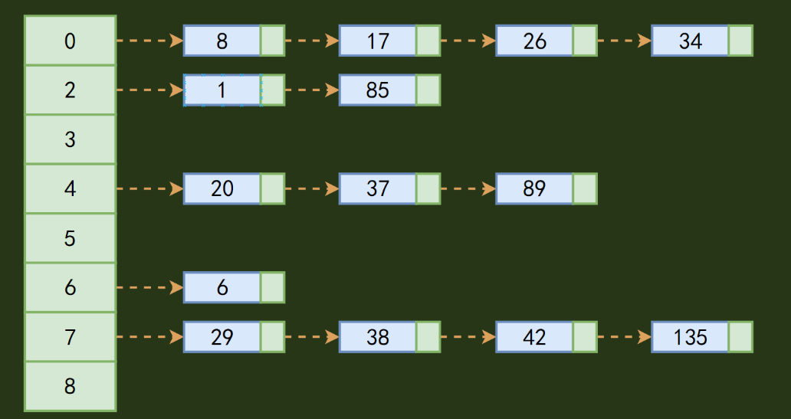

# Dictionary基本概念

C#中的字典（Dictionary\<TKey, TValue\>）是一个集合，它存储了一组键值对（key-value pairs）。每个键在字典中都是唯一的，并与一个值相关联。字典提供了非常快速的基于键的数据检索，因为它们是使用哈希表来实现的。

下面是字典Dictionary\<TKey, TValue\>的一些主要特点和用法：

1. **键的唯一性**：每个键在字典中只能出现一次。尝试使用相同的键添加元素会导致异常，除非你先删除了原有的键值对。
2. **高效的数据检索**：字典提供了近乎O(1)复杂度的检索速度，这意味着无论字典中有多少元素，检索一个键关联的值所需的时间都是常数。
3. **动态大小**：字典可以动态增长以容纳新元素；当你添加元素时，它会根据需要自动调整其内部数组的大小。
4. **泛型**：Dictionary\<TKey, TValue\>是一个泛型集合，意味着你可以指定键和值的类型，从而提供类型安全性。
5. **线程不安全**：Dictionary\<TKey, TValue\>不是线程安全的。如果在多个线程中同时修改字典，可能会导致数据损坏。在多线程环境中，你可以使用ConcurrentDictionary\<TKey, TValue\>来替代。

## 总结字典

1. Dictionary表示键和值的集合。
2. Dictionary\<object, object\>是一个泛型。
3. 他本身有集合的功能有时候可以把它看成数组。
4. 他的结构是这样的：Dictionary\<[key], [value]\>。
5. 他的特点是存入对象是需要与[key]值一一对应的存入该泛型，任何键都是唯一。
6. 通过某一个一定的[key]去找到对应的值。查找元素的时间复杂度为O(1)。

## 增删查改时间复杂度

1. Dictionary字典类是hash表，Add操作是O(1)。
2. 其Containskey方法是O(1)，原因是通过hash来查找元素而不是遍历元素。
3. ContainsValue方法的时间复杂度是O(N)，原因是内部通过遍历key来查找value，而不是通过hash来查找。
4. ltem[Key]属性根据key来检索value，其时间复杂度也是O(1)。
5. 基本都是O(1)

底层实现原理 —— Dictionary 在构造时做了以下初始化：

```csharp
// Dictionary 内部核心结构（简化）
public class Dictionary<TKey, TValue>
{
    private struct Entry
    {
        public int      hashCode;   // key 的哈希码（缓存，避免重复计算）
        public int      next;       // 碰撞链：下一个 Entry 的索引（-1 表示链尾）
        public TKey     key;
        public TValue   value;
    }

    private int[]       _buckets;   // 桶数组：每个桶存储链头 Entry 的索引
    private Entry[]     _entries;   // 条目数组：存储所有键值对
    private int         _count;     // 当前元素数量
    private int         _version;   // 版本号（检测迭代时修改）
    // ...
}
```

1. `_buckets = new int[prime]` —— bucket 容量为大于字典容量的最小质数
2. `_entries = new Entry[prime]` —— 与 bucket 同容量
3. `_buckets` 存储碰撞链头索引，`_entries` 存储实际数据

## 实现过程 —— 以 `Add(key, value)` 为例

```csharp
public bool TryInsert(TKey key, TValue value)
{
    // 1. 计算哈希
    int hashCode = key.GetHashCode() & 0x7FFFFFFF;  // 确保非负

    // 2. 定位桶（取余 → 桶索引）
    int bucket = hashCode % _buckets.Length;

    // 3. 检查碰撞链（该桶是否已有 entry？）
    for (int i = _buckets[bucket] - 1; i >= 0; i = _entries[i].next)
    {
        // 哈希相同 + key 相同（Equals 判断）→ 重复 key，抛出异常
        if (_entries[i].hashCode == hashCode &&
            EqualityComparer<TKey>.Default.Equals(_entries[i].key, key))
        {
            throw new ArgumentException("key 已存在");
        }
    }

    // 4. 添加新 Entry
    int index = _count++;
    _entries[index].hashCode = hashCode;
    _entries[index].key = key;
    _entries[index].value = value;

    // 5. 头插法链入碰撞链
    _entries[index].next = _buckets[bucket] - 1;  // 指向原链头
    _buckets[bucket] = index + 1;                  // 新 entry 成为链头
    _version++;
    return true;
}
```

**关键设计点**：
- **碰撞解决**：拉链法（Chaining）—— 碰撞链通过 `Entry.next` 索引串联，不分配额外的链表节点
- **索引 `+1/-1`**：`_buckets` 的值 = entry 索引 + 1，0 表示空桶。因为 0 也是合法索引，所以用 +1 区分
- **`GetHashCode` + `Equals`**：先比哈希（快），哈希相同再比 Equals（精确但慢）

## 查找过程

```csharp
// _buckets 存储的是 Entry 索引 + 1
// bucket = hashCode % buckets.Length
// → 遍历碰撞链：for (int i = buckets[bucket]-1; i >= 0; i = entries[i].next)
```



> **性能陷阱**：如果 `GetHashCode` 实现得不好（返回常数），所有 key 都进入同一个桶，退化为链表查找 O(n)。正确实现 `GetHashCode` + `Equals` 是关键。
