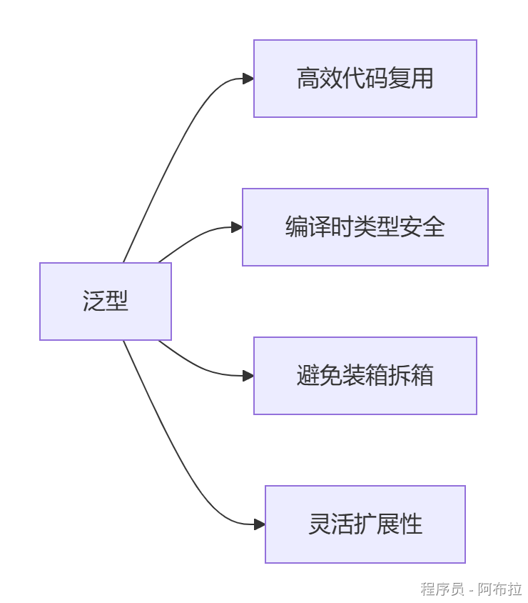
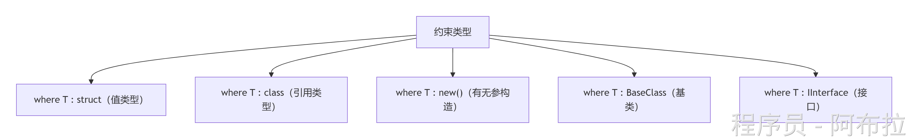

# 泛型

### **泛型是什么？**

**泛型（Generics）** 是C#中的**类型参数化技术**，允许编写可处理多种数据类型的代码，避免为每种类型重复编写逻辑。

**核心思想**：用占位符`T`表示类型，使用时再指定具体类型。




**示例对比**：

```csharp
// 非泛型：只能处理int类型
public class IntList { 
    private int[] items; 
}

// 泛型：可处理任意类型
public class List<T> { 
    private T[] items;  // T是类型占位符
}
```

💡 当调用`List<int>`时，编译器将`T`替换为`int`，生成专用类。

### **泛型的核心类型**

#### **(1) 泛型类**

```csharp
public class Box<T> {
    private T _value;
    public void SetValue(T value) => _value = value;
    public T GetValue() => _value;
}

// 使用
var intBox = new Box<int>();
intBox.SetValue(123);
```

一个类可支持多种类型参数，如`Dictionary<TKey, TValue>`。

#### **(2) 泛型方法**

```csharp
public static T Max<T>(T a, T b) where T : IComparable<T> {
    return a.CompareTo(b) > 0 ? a : b;
}

// 调用（类型自动推断）
int max = Max(10, 20); // T被推断为int
```

即使非泛型类中也可定义泛型方法。

#### **(3) 泛型接口**

```csharp
public interface IRepository<T> {
    void Add(T entity);
    T GetById(int id);
}

public class UserRepository : IRepository<User> {
    // 实现接口方法
}
```

接口契约可复用，实现类指定具体类型。

------

### **泛型约束**

约束确保类型参数符合要求，提升安全性




**示例**

```csharp
public class DataProcessor<T> where T : class, IEntity, new() {
    public void Process() {
        var obj = new T(); // 安全创建实例
        obj.Id = 1;       // 可访问IEntity成员
    }
}
```

若无约束，`new T()`或`obj.Id`会编译报错。

------

### **泛型核心优势**

| **优势**     | **说明**                           | **示例对比**                                                 |
| ------------ | ---------------------------------- | ------------------------------------------------------------ |
| **类型安全** | 编译时检查类型错误，避免运行时异常 | `List<int>`添加字符串会报错 vs `ArrayList`添加任意类型导致运行时错误 |
| **性能优化** | 避免值类型的装箱/拆箱操作          | `List<int>`直接操作栈内存，`ArrayList`需装箱到堆             |
| **代码复用** | 一套逻辑处理多种类型               | `Max<T>`方法支持int/string/double等                          |
| **可读性**   | 代码意图明确，减少类型转换噪音     | `Dictionary<string, User>` vs `Hashtable`                    |

------

### **实际应用场景**

#### **(1) 集合类（最常用）**

```csharp
List<int> numbers = new List<int>();  // 动态数组
Dictionary<string, User> userCache;   // 键值对
Queue<Order> orderQueue;              // 先进先出
```

优先使用泛型集合而非`ArrayList`/`Hashtable`。

#### **(2) 泛型缓存**

```csharp
public static class Cache<T> {
    static Cache() {
        // 每个T类型生成独立缓存
    }
    public static T Get(string key) { ... }
}
```

比字典缓存更快，因类型信息在编译时确定。

#### **(3) 工厂模式**

```csharp
public class Factory<T> where T : new() {
    public T Create() => new T();
}
var userFactory = new Factory<User>();
User user = userFactory.Create();
```

约束`new()`确保可实例化。

### **高级特性：协变与逆变**

- **协变（out）**：子类泛型→父类泛型（安全） 

```csharp
IEnumerable<Dog> dogs = new List<Dog>();
IEnumerable<Animal> animals = dogs; // 合法
```

- **逆变（in）**：父类泛型→子类泛型（需谨慎） 

```csharp
Action<Animal> feedAnimal = a => a.Feed();
Action<Dog> feedDog = feedAnimal; // 合法
```

仅适用于接口/委托，通过`out`/`in`关键字实现。

## C# 泛型到底是什么？

一句话来说：

> **C# 泛型是一种让代码能够适用于多种类型，同时保证类型安全、避免装箱拆箱的语言机制。**

很多人第一次接触泛型时，会觉得它只是为了省去强制类型转换，例如：

```
List<int> numbers = new List<int>();
numbers.Add(10);

List<string> names = new List<string>();
names.Add("Alice");
```

实际上，这只是泛型带来的表面效果。

真正的问题是：**为什么微软要设计泛型？**

------

# 第一阶段：没有泛型的时候

在 .NET 1.0 时代，并没有 `List<T>`。

那时候使用的是 `ArrayList`。

例如：

```
ArrayList list = new ArrayList();

list.Add(1);
list.Add("Hello");
list.Add(3.14f);
```

为什么什么都能放进去？

因为 ArrayList 内部其实保存的是：

```
object[]
```

也就是说，它并不知道真正存储的数据是什么类型。

------

## 这会产生什么问题？

### 第一个问题：没有类型安全

例如：

```
ArrayList list = new ArrayList();

list.Add(100);
list.Add("Hello");

int x = (int)list[1];
```

程序会在运行时报错：

```
InvalidCastException
```

因为第二个元素实际上是字符串。

编译器无法提前帮你发现这个错误。

------

### 第二个问题：装箱（Boxing）

这是游戏开发中更重要的问题。

例如：

```
ArrayList list = new ArrayList();

list.Add(10);
```

这里 `10` 是一个 `int`。

但是 ArrayList 只能存 `object`。

于是 CLR 必须执行下面这个过程：

```
int

↓

创建一个 object 对象

↓

把 int 的值复制进去

↓

返回 object 引用
```

这就是**装箱（Boxing）**。

装箱意味着：

- 在堆上创建对象
- 增加 GC 压力
- 多一次内存分配

如果游戏每一帧都发生很多装箱，就可能导致 GC 卡顿。

------

## 泛型解决了什么？

于是微软设计了：

```
List<T>
```

例如：

```
List<int> list = new List<int>();
```

这里的 T 表示：

> **"以后再告诉我具体是什么类型。"**

当你写：

```
List<int>
```

CLR 就知道：

```
T = int
```

因此 List 内部保存的其实是：

```
int[]
```

而不是：

```
object[]
```

这样就完全不需要装箱。

------

# 那 T 到底是什么？

很多初学者会认为：

> T 是一种特殊的数据类型。

其实不是。

T 更像一个占位符。

例如：

```
public class Box<T>
{
    public T Value;
}
```

当你使用：

```
Box<int>
```

相当于：

```
class Box
{
    public int Value;
}
```

如果你使用：

```
Box<string>
```

相当于：

```
class Box
{
    public string Value;
}
```

注意，这只是帮助理解。

CLR 的实现方式并不是简单地复制代码（这一点和 C++ 模板不同）。

------

# C# 泛型和 C++ 模板最大的区别

这是面试非常喜欢问的一题。

很多人觉得：

```
List<int>

↓

和

vector<int>
```

应该是一样的。

实际上完全不同。

------

## C++ Template

例如：

```
template<typename T>
void Print(T value)
{
}
```

调用：

```
Print(1);
Print(3.14);
```

编译器会直接生成两份函数：

```
void Print(int value)
{
}

void Print(double value)
{
}
```

也就是说：

**每一种类型都会生成一份新的代码。**

因此：

- 编译速度慢一些
- 可执行文件会变大
- 运行速度最快

------

## C# 泛型

CLR 的思路完全不同。

它会保存：

```
List<T>
```

这个泛型定义。

等程序真正运行的时候，由 JIT（即时编译器）决定如何生成机器码。

也就是说：

**泛型信息会一直保留到运行时。**

例如：

```
Console.WriteLine(typeof(List<int>));
```

输出：

```
System.Collections.Generic.List`1[System.Int32]
```

说明 CLR 在运行时仍然知道：

这是一个 List<int>。

这就是为什么 C# 可以进行泛型反射。

------

# 为什么引用类型可以共享代码？

这是 C# 泛型最有意思的地方。

例如：

```
List<string>

List<Player>

List<GameObject>
```

这些其实都是引用类型。

对于 CPU 来说：

它们本质上都是一个指针。

例如：

```
List<string>

↓

保存的是 string 的引用

↓

8 字节
List<Player>

↓

保存的是 Player 的引用

↓

也是 8 字节
```

因此 CLR 可以让它们共享同一份机器码。

------

## 为什么 int 不行？

例如：

```
List<int>

List<float>
```

虽然 int 和 float 都是 4 字节。

但是：

```
int

需要整数运算
float

需要浮点运算
```

CPU 指令完全不同。

所以：

CLR 会分别为值类型生成对应的机器码。

因此你会听到一句话：

> **C# 泛型对于引用类型通常共享代码，对于值类型通常单独生成机器码。**

------

# 为什么泛型速度更快？

这是 Unity 面试很喜欢问的问题。

例如：

```
ArrayList list = new ArrayList();
list.Add(100);
```

发生了：

```
int

↓

装箱

↓

object
```

每次都可能产生 GC。

而：

```
List<int> list = new List<int>();
list.Add(100);
```

内部直接就是：

```
int[]
```

根本没有 object。

因此：

- 不需要装箱
- 不需要拆箱
- 不容易产生 GC
- 类型安全

这就是为什么现在几乎所有集合都是泛型。

------

# Unity 为什么大量使用泛型？

你其实每天都在写泛型，只是没有注意。

例如：

```
GetComponent<Rigidbody>();
```

其实它就是：

```
GetComponent<T>()
```

如果没有泛型，你只能写：

```
Rigidbody rb =
(Rigidbody)GetComponent(typeof(Rigidbody));
```

不仅代码更长，还需要强制类型转换。

又例如：

```
ObjectPool<Bullet>

Dictionary<int, Enemy>

List<Player>

Queue<Skill>

Stack<Node>
```

这些都是泛型类。

泛型让 Unity API 既安全又高效。

------

# 泛型约束是什么？

有时候我们希望：

不是任何类型都可以作为 T。

例如：

```
public class Singleton<T>
    where T : MonoBehaviour
{
}
```

这里表示：

T 必须继承自 MonoBehaviour。

因此：

```
Singleton<Rigidbody>
```

可以。

但是：

```
Singleton<int>
```

编译就会报错。

还有：

```
where T : class
```

表示只能是引用类型。

```
where T : struct
```

表示只能是值类型。

```
where T : new()
```

表示必须有无参构造函数，因此可以写：

```
T obj = new T();
```

------

# 最后总结一下

如果让我用一句话概括 C# 泛型，我会这样说：

> **C# 泛型不是编译器复制代码，而是 CLR 保留泛型类型信息，在运行时通过 JIT 生成或共享机器码，从而既保持类型安全，又避免装箱拆箱，同时尽可能减少代码重复。**

------

### 你可以把 C++ 模板和 C# 泛型放在一起记忆：

| C++ Template                 | C# Generic                               |
| ---------------------------- | ---------------------------------------- |
| 编译器负责                   | CLR + JIT 负责                           |
| 编译期实例化                 | 运行期保留泛型信息                       |
| 每种类型生成一份代码         | 引用类型通常共享代码，值类型通常单独 JIT |
| 零运行时开销，但容易代码膨胀 | 运行时更灵活，代码体积更小               |
| 本质是编译期代码生成         | 本质是运行时类型系统的一部分             |

你会发现，这也体现了两门语言的设计理念：

- **C++** 更强调"把所有事情都放到编译期解决"，追求极致性能。
- **C#** 更强调"运行时有一个强大的 CLR 来管理程序"，在性能和开发效率之间取得平衡。

这也是为什么 UE 源码大量使用模板，而 Unity/.NET 则大量使用泛型。

很多人在学习 C# 的时候都会听到 CLR（Common Language Runtime，公共语言运行时）这个词，但不知道它到底是什么。实际上，可以把 CLR 理解为 **.NET 平台的运行环境**。它的地位非常类似于 Java 中的 JVM。你写的 C# 程序并不会直接被 CPU 执行，而是先交给 CLR，再由 CLR 去完成后续的一系列工作。

假设我们写了一个非常简单的程序：

```
Console.WriteLine("Hello World");
```

很多人以为 C# 编译器会直接把它编译成机器码，就像 C++ 那样。但实际上不是。

当你点击编译的时候，C# 编译器（csc）生成的并不是 CPU 能直接执行的机器码，而是一种叫做 **IL（Intermediate Language，中间语言）** 的代码。IL 可以理解为一种与平台无关的中间指令，它既不是 C#，也不是真正的机器码。

因此，一个 C# 程序真正的执行流程其实是：

```
C# 源代码
    ↓
C# 编译器（csc）
    ↓
IL（中间语言）
    ↓
CLR
    ↓
JIT 编译器
    ↓
机器码
    ↓
CPU
```

这里最重要的角色就是 CLR。当程序启动时，Windows 会先加载 CLR，然后由 CLR 去读取程序集（例如 exe 和 dll 文件），检查其中的 IL 和元数据，并在真正需要执行某个函数的时候，再通过 JIT（Just-In-Time Compiler，即时编译器）把 IL 翻译成本机机器码。

例如，你有一个 `Update()` 函数。如果程序启动以后从来没有调用过它，那么 JIT 根本不会去编译这个函数。只有第一次真正执行到 `Update()` 时，CLR 才会通知 JIT："把这个函数编译成机器码。" 编译完成以后，后续再次调用这个函数，就直接执行已经生成好的机器码，不需要重复编译了。

这也是为什么它叫 **Just-In-Time（即时编译）**——不是程序启动时全部编译，而是在真正需要的时候才编译。

不过，JIT 只是 CLR 提供的功能之一。很多人会误以为 CLR 就等于 JIT，其实这是错误的。CLR 更像是整个 .NET 程序运行期间的"操作系统"。除了负责把 IL 编译成机器码之外，它还负责垃圾回收（GC）、内存管理、异常处理、线程调度、类型安全检查、反射以及泛型等几乎所有运行时服务。

举个 Unity 中最常见的例子：

```
GameObject obj = new GameObject();
```

当你执行 `new` 的时候，并不是 C# 自己去申请内存，而是 CLR 在托管堆（Managed Heap）中为这个对象分配空间。当这个对象以后没有任何引用指向它时，CLR 中的垃圾回收器（GC）会自动判断它已经不可达，然后在合适的时机回收这块内存。

这也是为什么 Unity 中经常强调"不要在 Update 中频繁 new 对象"。因为每一次 `new` 都意味着 CLR 要在托管堆中分配内存，而大量短生命周期对象最终会导致 GC 频繁运行，从而造成游戏卡顿。

如果把整个 .NET 平台比作一个公司，那么 C# 更像是一门办公语言，而 CLR 就像公司的管理系统。程序员只负责写业务代码，而对象什么时候创建、什么时候释放、什么时候编译、什么时候检查类型、什么时候处理异常，都交给 CLR 来管理。CPU 最终执行的，也不是 C#，而是 CLR 经过 JIT 编译之后生成的机器码。
