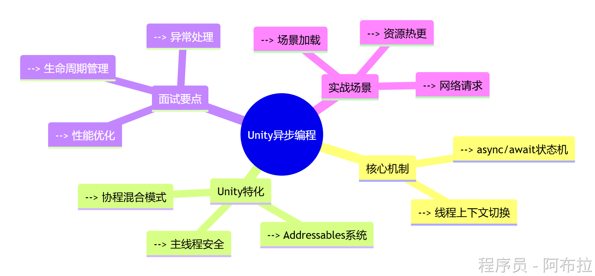
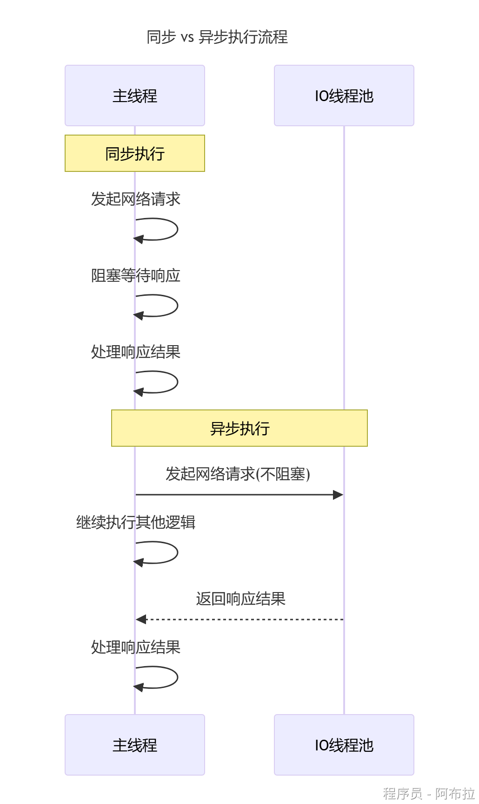
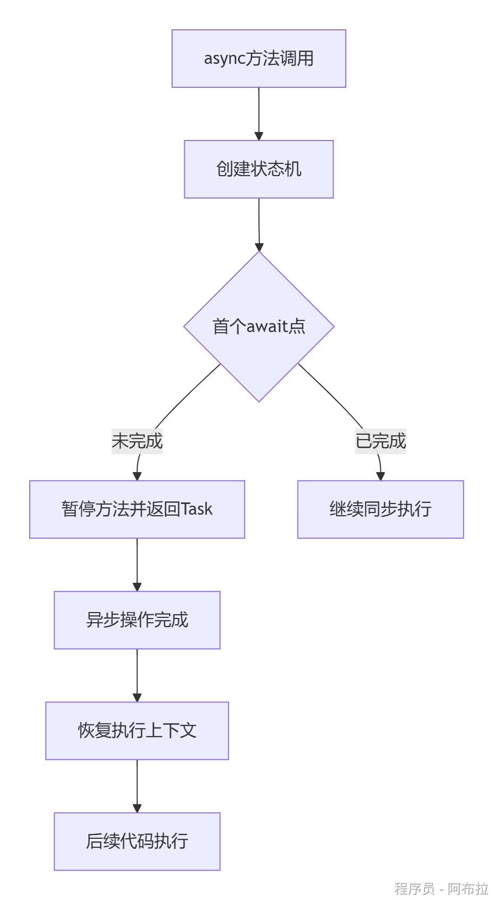
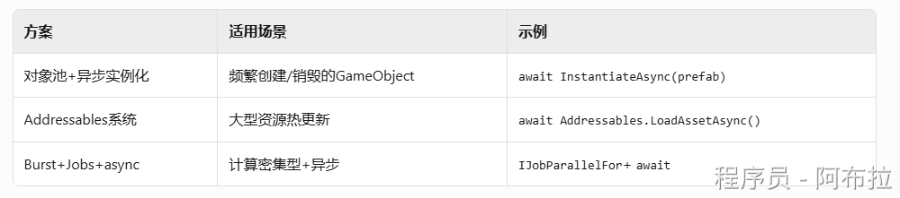
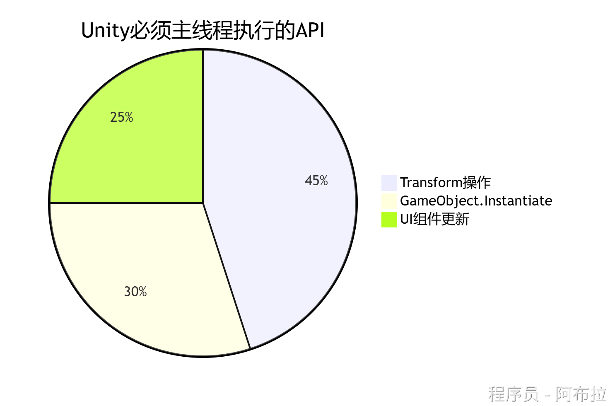
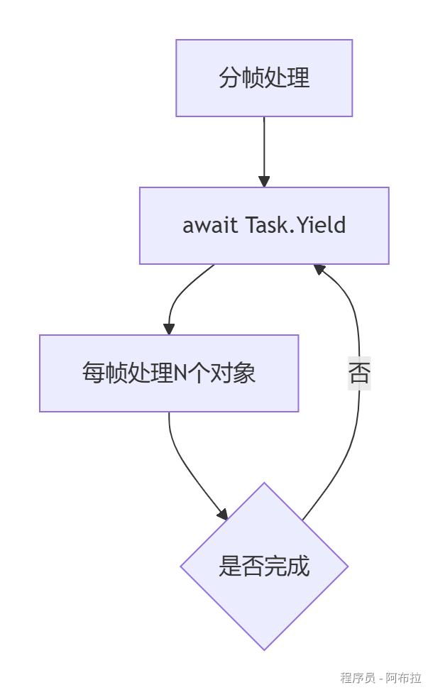
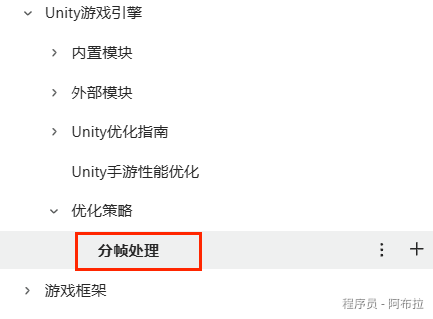

# 异步编程



在C#中，await 关键字用于异步编程，它允许你等待一个异步操作（例如网络请求或长时间运行的计算任务）的完成，而不会阻塞主线程的执行。await 只能在标记为 async 的方法内部使用，并且只能与返回 Task 或 Task\<TResult\> 的方法一起使用。

### 异步编程核心原理图示

#### 1. 同步/异步执行流程对比



**关键区别**：异步编程通过线程池分流耗时操作，避免主线程阻塞（尤其在Unity中需保持60FPS渲染）

#### 2. async/await状态机原理



编译器会将async方法转换为实现`IAsyncStateMachine`接口的状态机类，管理await断点与恢复

------

### Unity中5大异步实现方式

#### 1. async/await（推荐方案）

```csharp
// Unity资源加载示例
public async Task<GameObject> LoadAssetAsync(string path) {
    ResourceRequest request = Resources.LoadAsync<GameObject>(path);
    await request; // 等待异步加载完成
    return request.asset as GameObject;
}

// 调用示例
async void Start() {
    var prefab = await LoadAssetAsync("Enemies/Dragon");
    Instantiate(prefab);
}
```

**优势**：代码简洁如同步，自动处理线程切换

#### 2. Coroutine（协程）与异步混用


```csharp
IEnumerator LoadSceneCoroutine() {
    var webRequest = UnityWebRequest.Get("https://api.gamedata");
    yield return webRequest.SendWebRequest(); // 传统Yield
    var data = JsonUtility.FromJson<GameData>(webRequest.downloadHandler.text);

    // 与await混用
    await LoadAssetsAsync(data.assetList); 
}
```

**适用场景**：兼容旧代码或需要与WWW/UnityWebRequest配合

#### 3. Task.Run（CPU密集型计算）

```csharp
public async Task<int> CalculateDamageAsync() {
    return await Task.Run(() => {
        // 复杂伤害计算（避免卡主线程）
        int result = 0;
        for (int i = 0; i < 1000000; i++) {
            result += i % 10;
        }
        return result;
    });
}
```

**注意**：Unity部分API（如Transform）需回到主线程执行

#### 4. UniTask（第三方优化方案）

```csharp
// 避免GC分配的传统Task
using Cysharp.Threading.Tasks;

async UniTaskVoid LoadAllAssets() {
    await UniTask.WhenAll(
        LoadPrefabAsync("Player"),
        LoadSceneAsync("Level1")
    );
    Debug.Log("All loaded!");
}
```

**优势**：零GC分配、支持取消操作，专为Unity优化

#### 5. EAP模式（旧版网络请求）

```csharp
void DownloadFile(string url) {
    WebClient client = new WebClient();
    client.DownloadFileCompleted += (sender, e) => {
        // 回到主线程执行
        UnityMainThreadDispatcher.Instance.Enqueue(() => {
            Debug.Log("Download complete!");
        });
    };
    client.DownloadFileAsync(new Uri(url), "localPath");
}
```

**现状**：已被TAP模式（async/await）取代，但需了解。

------

### 面试核心概念（高频考点）

#### 1. `ConfigureAwait(false)` 和 `SynchronizationContext`

这是最常见的异步面试题。`await` 默认会捕获当前上下文（`SynchronizationContext`），完成后回到原上下文执行后续代码：

```csharp
// 默认行为：await 完成后回到调用线程（如 Unity 主线程、UI 线程）
await SomeAsync();

// ConfigureAwait(false)：不回到原上下文，在任意线程池线程继续
await SomeAsync().ConfigureAwait(false);

// 库代码中应使用 ConfigureAwait(false) 避免死锁和性能问题
// 只有顶层代码（如 UI 事件处理、Controller）才需要回到原上下文
```

**为什么要用 `ConfigureAwait(false)`？** 避免在库代码中强行回到调用方上下文导致：
- 不必要的线程切换（性能损失）
- **死锁**（见下文）

#### 2. async void 的危险（只用于事件处理器）

```csharp
// ❌ 危险：async void 异常无法被调用方捕获
async void BadMethod()
{
    await Task.Delay(100);
    throw new Exception("没人能捕获我！"); // 直接崩溃
}

// ✅ 正确：除了事件处理器，始终返回 Task
async Task GoodMethod()
{
    await Task.Delay(100);
    throw new Exception("调用方可以 try-catch"); // 可以被捕获
}

// ✅ async void 唯一合法场景：事件处理器
button.OnClick += async (s, e) =>
{
    await SaveAsync();
};
```

> **`async void` 三大问题**：① 异常无法被调用方捕获 ② 无法被 `await` ③ 调用方无法知道何时完成。

#### 3. 死锁场景（经典陷阱）

```csharp
// ❌ 死锁！在 UI 线程 / Unity 主线程中调用 .Wait() / .Result
public void OnButtonClick()
{
    var result = DownloadAsync().Result;  // 死锁！
    // DownloadAsync 完成后要回到 UI 线程，但 UI 线程正在等 .Result
}

// ✅ 正确：一直 await 到底
public async void OnButtonClick()
{
    var result = await DownloadAsync();   // 不阻塞
}
```

#### 4. `TaskCompletionSource` —— 桥接回调与 Task

```csharp
// 将传统回调 API 包装为 Task
public Task<bool> LoginAsync(string user, string pwd)
{
    var tcs = new TaskCompletionSource<bool>();

    LegacyLoginSystem.Login(user, pwd, success =>
    {
        tcs.SetResult(success);  // 回调转 Task
    });

    return tcs.Task;  // 调用方可以用 await LoginAsync()
}
```

#### 5. `IAsyncEnumerable<T>` —— 异步流（C# 8+）

```csharp
// 分页获取数据，yield 配合 await
public async IAsyncEnumerable<string> GetPagesAsync()
{
    for (int i = 1; i <= 5; i++)
    {
        var page = await FetchPageAsync(i);
        yield return page;  // 每页返回后继续处理
    }
}

// 消费
await foreach (var page in GetPagesAsync())
{
    Console.WriteLine(page);
}
```

#### 6. TAP 命名规范

| 规则 | 示例 |
|---|---|
| 返回 Task 的方法以 `Async` 结尾 | `GetDataAsync()` |
| 接受 `CancellationToken`（最后参数） | `LoadAsync(path, token)` |
| 返回 `Task` / `Task<T>` / `ValueTask<T>` | 不使用 `void`（除事件外） |

---

### Unity特化面试问题与优化策略

#### 异步加载资源时如何避免"MissingReferenceException"？

**解决方案**：

使用`MonoBehaviour`生命周期检测

```csharp
if (this == null) return; // 对象已销毁
```

通过`CancellationToken`取消任务

```csharp
var cts = new CancellationTokenSource();
void OnDestroy() {
    cts.Cancel();
}
await LoadAssetAsync("path", cts.Token);
```

通过`GameObject.activeInHierarchy`检查对象有效性

#### 如何优化高频异步调用（如伤害计算）？

**性能优化方案**：

1. **对象池+缓存Task**

```csharp
static Dictionary<string, Task<GameObject>> _prefabCache = new();

public static Task<GameObject> GetPrefabAsync(string path) {
    if (!_prefabCache.TryGetValue(path, out var task)) {
        task = Resources.LoadAsync<GameObject>(path).AsTask();
        _prefabCache[path] = task;
    }
    return task;
}
```

1. **使用ValueTask减少堆分配**：

```csharp
public async ValueTask<int> OptimizedCalculation() {
    if (_cachedResult != null) 
        return _cachedResult.Value;
    return await Task.Run(...);
}
```

#### async/await会创建新线程吗？

- **I/O操作**（如网络请求）：不创建线程，使用操作系统回调机制
- **CPU密集型任务**：`Task.Run`会使用线程池线程
- **Unity主线程**：await默认回到原同步上下文（主线程）

#### 异步编程性能优化方案



------

### 异步编程禁忌与最佳实践

#### 1. **Unity主线程限制**



**解决方案**：通过`UnitySynchronizationContext`回到主线程

```csharp
await Task.Run(() => {
    // 后台线程计算
}).ContinueWith(t => {
    // 自动切换回主线程
}, TaskScheduler.FromCurrentSynchronizationContext());
```

#### 2. **异常处理模板**

```csharp
async void SafeAsyncMethod() {
    try {
        var result = await RiskyOperation();
    }
    catch (UnityWebRequestException ex) {
        Debug.LogError($"网络错误: {ex.ResponseCode}");
    }
    catch (OperationCanceledException) {
        Debug.Log("任务已取消");
    }
    finally {
        // 资源清理
    }
}
```

1. **帧率敏感场景优化**



详情可以看《Unity 客户端面试宝典》中 Unity 游戏引擎 - 优化策略 - 分帧处理




1. **调试技巧**

- 使用`Debug.Log($"Thread: {Thread.CurrentThread.ManagedThreadId}")`查看线程切换
- Unity Profiler中观察`Task`对象分配情况
