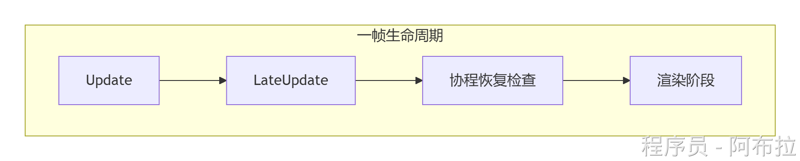

# 协程原理

# 面试题

1. **协程与线程的区别？**

- **协程**：主线程串行执行，无并发，避免线程安全问题。
- **线程**：并行执行，需处理同步锁，但Unity中无法直接操作游戏对象。

2. **如何实现自定义等待条件？**
    继承`CustomYieldInstruction`，重写`keepWaiting`属性：

```js
class WaitForEvent : CustomYieldInstruction {
    public override bool keepWaiting => !eventTriggered;
}
// 使用：yield return new WaitForEvent();
```

3. **协程的嵌套执行原理？**
    `yield return StartCoroutine(Child())`会等待子协程完成再继续，通过嵌套状态机管理。

4. **协程为何不能返回值？**

 	 Unity协程的本质是迭代器，核心定位是控制代码执行流程（如延时、等待事件），而非传递计算结果。

协程由Unity主线程的更新循环调度（如 Update 后）。StartCoroutine 仅返回一个 Coroutine 对象用于控制协程生命周期（如停止），不提供获取返回值的接口。

  若协程返回值，其语义会与 IEnumerator 的 Current 属性冲突。例如，yield return 1 已经占用 Current 传递等待指令，无法同时传递计算结果 。

其基于迭代器的设计更注重流程调度而非数据交互，这是无法返回值的根本原因。对于需要返回值的异步场景，建议使用回调、UniTask 或 C# Task（需注意线程切换）等方案  。

5. **协程与UniTask的对比？**

 	UniTask支持异步返回值，减少GC，但协程更轻量。

6. **如何实现协程超时机制？**
    结合`CustomYieldInstruction`自定义条件等待。

## 原理

协程并非线程，而是通过C#的`IEnumerator`迭代器实现的状态机，由Unity引擎在主线程中调度执行。**协程的本质：基于C#迭代器的状态机。**

协程 = C#迭代器状态机 + Unity主线程调度
生命周期绑定随`GameObject`销毁自动终止，禁用脚本（enabled=false）不终止协程！

性能优化：避免频繁创建yield对象，分帧处理耗时逻辑

**工作流程**

- **状态机转换**：编译器将协程函数转换为隐藏类，每个`yield return`对应一个状态编号，局部变量提升为类的字段。
- **恢复执行**：`MoveNext()`方法从上次暂停的位置继续执行，直到下一个`yield`或结束。

**调度时机**：协程在Unity主循环的特定阶段被唤醒



**恢复条件**

- `yield return null` → Update后、LateUpdate前恢复。
- `yield return WaitForSeconds(2)` → 引擎记录目标时间，每帧检查时间是否到达。
- `yield return WaitForEndOfFrame` → 所有渲染完成后恢复。

**额外**

- **yield** 在下一帧上调用所有 Update 函数后，协程将继续。
- **yield WaitForSeconds** 在为帧调用所有 Update 函数后，在指定的时间延迟后继续。
- **yield WaitForFixedUpdate** 在所有脚本上调用所有 FixedUpdate 后继续。如果协同程序在 FixedUpdate 之前生成，那么它会在当前帧的 FixedUpdate 之后继续运行。
- **yield WWW** 在 WWW 下载完成后继续。
- **yield StartCoroutine** 将协程链接起来，并会等待 MyFunc 协程先完成。

**生命周期与终止条件**⚠️

- **自动终止**

- 当绑定的`MonoBehaviour`被销毁（`Destroy`）或`GameObject`禁用时，协程自动停止。
- **注意**：仅禁用脚本（`enabled=false`）**不会**停止协程！

- **手动控制**

- `StopCoroutine()`需匹配启动方式（方法名/IEnumerator引用）。
- `StopAllCoroutines()`终止当前脚本所有协程。

## 常规应用场景

### ⏱️**时间控制与延时执行**

**技能冷却系统**：管理技能释放间隔，避免频繁触发。

*优势*：代码线性可读，无需手动管理计时器变量。

```js
IEnumerator SkillCooldown(string skillName, float cooldownTime) {
    skillCooldowns[skillName] = true;  // 标记冷却中
    yield return new WaitForSeconds(cooldownTime);
    skillCooldowns[skillName] = false; // 冷却结束
}
```

**动画序列控制**：按顺序播放角色动作或UI动效。

*场景*：过场动画、教程引导步骤。

```js
IEnumerator PlayCutscene() {
    yield return StartCoroutine(ShowDialogue());
    yield return new WaitForSeconds(1f);
    yield return StartCoroutine(PlayCharacterAnimation());
}
```

### 🌈**渐变与过渡效果**

**UI淡入淡出**：平滑改变透明度实现视觉过渡。

*关键点*：通过`yield return null`实现帧率无关的平滑插值。

```js
IEnumerator FadeIn(Image image, float duration) {
    float elapsed = 0;
    while (elapsed < duration) {
        image.color = new Color(1, 1, 1, elapsed / duration); // 透明度渐变
        elapsed += Time.deltaTime;
        yield return null; // 每帧更新
    }
}
```

**动态相机特效**：震动、平滑跟随等。

*应用*：受击反馈、爆炸效果。

```js
IEnumerator CameraShake(float intensity) {
    Vector3 originPos = transform.position;
    while (/*震动条件*/) {
        transform.position = originPos + Random.insideUnitSphere * intensity;
        yield return null;
    }
}
```

### ⚡**分帧处理与异步加载**

- **分帧处理大数据**：避免单帧卡顿。

*适用场景*：大型地图生成、批量NPC创建。

```js
IEnumerator GenerateMap(int tileCount) {
    for (int i = 0; i < tileCount; i++) {
        Instantiate(tilePrefab, GetPosition(i));
        if (i % 10 == 0) yield return null; // 每10个物体暂停一帧
    }
}
```

**资源异步加载**：结合`ResourceRequest`实现无卡顿加载。

*对比同步加载*：避免主线程阻塞，提升流畅度。

```js
IEnumerator LoadAssetAsync(string path) {
    ResourceRequest request = Resources.LoadAsync<GameObject>(path);
    while (!request.isDone) {
        UpdateProgressBar(request.progress); // 更新进度条
        yield return null;
    }
    Instantiate(request.asset); // 加载完成后实例化
}
```

### 🎮 **游戏流程与状态机**

- **游戏阶段控制**：管理战斗循环、关卡流程。

*优势*：逻辑分层清晰，避免Update中复杂状态判断。

```js
IEnumerator GameLoop() {
    while (!gameOver) {
        yield return StartCoroutine(StartPhase()); // 准备阶段
        yield return StartCoroutine(CombatPhase()); // 战斗阶段
        yield return StartCoroutine(RewardPhase()); // 结算阶段
    }
}
```

**AI行为序列**：实现巡逻-追击-攻击等状态切换。

*关键机制*：通过`yield break`可中断当前行为（如巡逻中发现玩家）。

```js
IEnumerator EnemyAI() {
    while (true) {
        yield return StartCoroutine(Patrol());
        if (DetectPlayer()) yield return StartCoroutine(Chase());
    }
}
```

### 🌐 **网络请求与响应处理**

**异步HTTP请求**：避免等待网络响应时界面冻结。 

*注意点*：错误处理需在协程内完成。

```js
IEnumerator FetchPlayerData() {
    UnityWebRequest request = UnityWebRequest.Get("https://api.example.com/data");
    yield return request.SendWebRequest();
    if (request.result == UnityWebRequest.Result.Success) {
        ParseData(request.downloadHandler.text);
    }
}
```

### 🛠️ **特殊场景需求**

- **逐帧渲染控制**

- `yield return new WaitForEndOfFrame()` 用于截图、后处理效果同步。

- **超短时动画控制**

*场景*：受击闪白、粒子特效瞬发。

```js
IEnumerator PlayShortAnimation() {
    animator.Play("Hit");
    yield return new WaitForSeconds(0.1f); // 精确控制播放时长
    animator.Stop();
}
```
