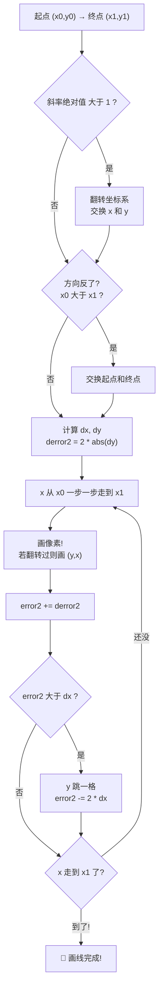
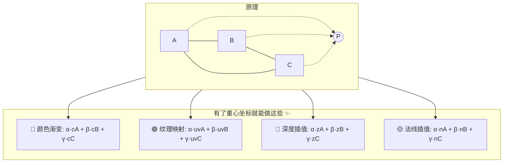
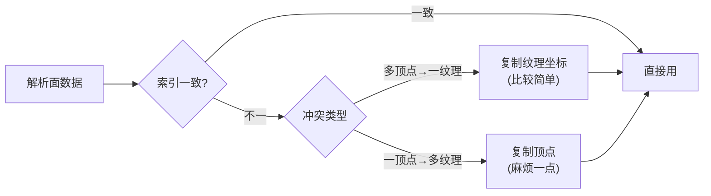
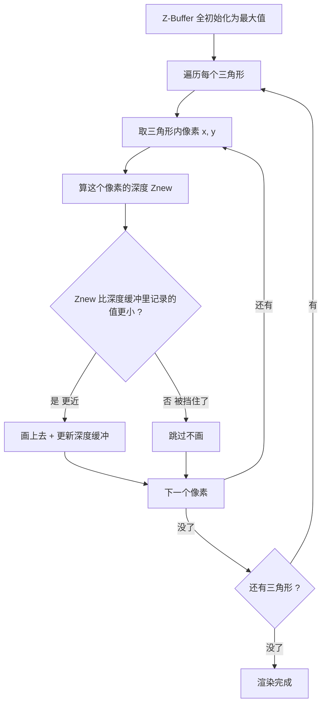
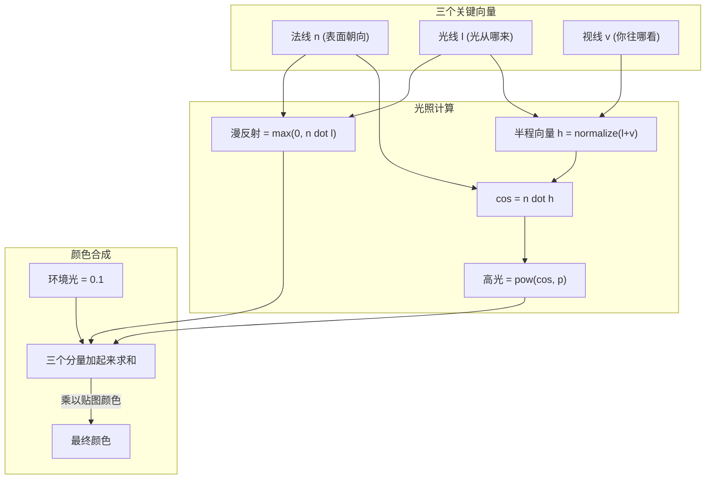
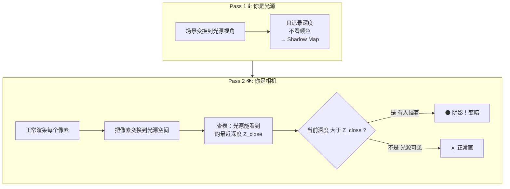
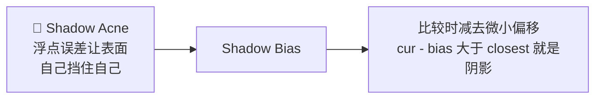
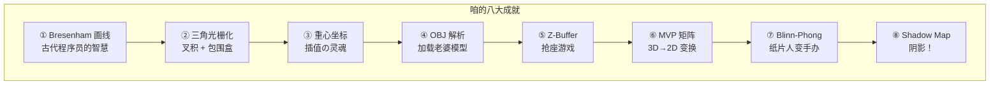

# 咱的软渲染器冒险谭 ✨

> 用纯 CPU 手搓一个 3D 渲染器，把老婆渲染出来！
> —— 泉此方の图形学攻略笔记

---

## 0. 前言：为什么咱要手搓渲染器？

嘛，事情是这样的～咱玩了一堆 Galgame 和 3D 游戏之后突然想到一个问题：**这屏幕上的老婆到底是怎么显示出来的？**

你一定觉得是"显卡画的"对吧～太天真了！显卡也是个打工人，它只是按照程序员的代码在跑流水线而已。所以理论上——**咱也可以手写代码替代显卡！**

这就叫软渲染器（Software Renderer），说白了就是用纯 C++ 从零造一个"小显卡"。不靠 OpenGL、不靠 DirectX、连 GPU 都给我一边凉快去～

> 游戏引擎本质上就是个超级复杂的软渲染器。咱这次要做的是丐版，但核心管线一个不少！

### 咱的目标

| 功能 | 说明 |
|------|------|
| 画线画三角形 | Bresenham + 光栅化，从像素开始 |
| MVP 矩阵 | 让 3D 老婆变换到 2D 屏幕上 |
| 纹理贴图 | 把老婆的贴图读进来贴上 |
| OBJ 模型 | 加载 3D 模型文件 |
| Blinn-Phong 光照 | 让老婆有立体感，不是纸片人 |
| Z-Buffer | 正确处理遮挡，前面的挡住后面的 |
| Shadow Map | 阴影！让老婆有影子 |

最终效果大概长这样：


### 准备工作

- 📺 先去看 [GAMES101](https://www.bilibili.com/video/BV1X7411F744)，闫令琪老师讲得超好，不看血亏
- 💻 C++ 要会，Eigen 库用来做矩阵运算（比手写矩阵舒服一百倍）
- 🎮 最好玩过 Unity/Unreal，这样你看咱的文章会不断发出"啊啊原来底层是这样的！"的感叹
- 🛠️ Visual Studio 2022 + Windows 11

---

## 1. 第一天：画一条线怎么这么难？😫

### Bresenham 算法——古代程序员的智慧

咱一开始想：画线？不就两点连起来嘛，`for` 循环一下不就好了～

结果发现——**像素是整数格**！一条斜线经过的地方根本没法精确落在像素中心。如果用浮点数去算 `y = kx + b`，每次都要四舍五入，太慢了！

于是 1962 年一个叫 Bresenham 的大佬发明了一种**只用整数加减**的画线算法。思想其实超简单：

> 🏔️ 你在爬一个缓坡。每走一步水平距离，高度应该增加 0.3 米。但像素是整数格，不能走 0.3 格。所以你先横着走，把"亏欠的高度"记在小本本上（error2），攒够了 1.0 米就往上跳一格！



### 上代码！

```cpp
void line(int x0, int y0, int x1, int y1, TGAImage& img, TGAColor c) {
    bool steep = false;
    // 太陡了就把坐标系翻一下，假装它是缓坡
    if (std::abs(x1 - x0) < std::abs(y1 - y0)) {
        std::swap(x0, y0); std::swap(x1, y1);
        steep = true;
    }
    // 保证从左往右画
    if (x0 > x1) {
        std::swap(x0, x1); std::swap(y0, y1);
    }

    int dx = x1 - x0, dy = y1 - y0;
    int derror2 = std::abs(dy) * 2;  // 每步的亏欠增量
    int error2 = 0, y = y0;           // error2 = 咱的"亏欠小本本"

    for (int x = x0; x <= x1; x++) {
        if (steep) img.set(y, x, c);  // 翻转过的要翻回来
        else       img.set(x, y, c);

        error2 += derror2;             // 又亏了一点...
        if (error2 > dx) {             // 亏太多了！
            y += (y1 > y0 ? 1 : -1);  // 跳一格！
            error2 -= dx * 2;          // 还清亏欠
        }
    }
}
```

### 🤔 为什么到处都是 ×2？

原本的判断是 `error > 0.5` 就进位。但 `0.5` 是小数！（CPU 算浮点比算整数慢很多）两边乘以 2 → `2*error > 1` → 等价于 `error2 > dx`，**全程整数运算**，效率拉满！这就是 Bresenham 的核心 trick～

---

## 2. 第二天：给三角形填色——这比 Galgame 选分支还刺激 🎨

### 叉积：判断左右的神器

线画好了，接下来要把三角形填满颜色——这叫**光栅化**。但首先咱需要一个终极问题：**怎么判断一个像素在不在三角形里？**

答案是用**叉积**！2D 叉积长这样：

$$cross(a, b, c) = (b_x - a_x)(c_y - a_y) - (b_y - a_y)(c_x - a_x)$$

- `> 0` → 点 c 在向量 ab 的**左边**
- `< 0` → 点 c 在向量 ab 的**右边**
- `= 0` → 三点共线

那一瞬间咱悟了——**如果点 P 在三角形三条边的同一侧，那它就在三角形里面！**

```cpp
bool inside(int x, int y, Vec2i a, Vec2i b, Vec2i c) {
    float c1 = cross(a, b, {x,y});
    float c2 = cross(b, c, {x,y});
    float c3 = cross(c, a, {x,y});
    return (c1>=0 && c2>=0 && c3>=0)   // 都在左边
        || (c1<=0 && c2<=0 && c3<=0);  // 都在右边
}
```

### 包围盒优化——别傻乎乎遍历整个屏幕！

如果屏幕是 700×700 = 49 万个像素，每个三角形都遍历一遍？CPU 会哭的！所以咱只遍历三角形的**外接矩形**（Bounding Box）：

```cpp
void rasterize(Vec2i a, Vec2i b, Vec2i c, Vec3i color) {
    int mx = min({a.x, b.x, c.x}), Mx = max({a.x, b.x, c.x});
    int my = min({a.y, b.y, c.y}), My = max({a.y, b.y, c.y});
    for (int x = mx; x <= Mx; x++)
        for (int y = my; y <= My; y++)
            if (inside(x, y, a, b, c))
                set_pixel(x, y, color);
}
```

### 重心坐标——图形学的 MVP 工具 🏆

但咱不只是想知道"在不在里面"，咱还想知道**具体在什么位置**！这样才可以做各种插值。

重心坐标就是三角形的"面积坐标"——任意点 P 可以表示为三个顶点的加权平均：

$$P = \alpha A + \beta B + \gamma C, \qquad \alpha+\beta+\gamma=1$$

其中 α、β、γ 就是 P 和三个顶点组成的"子三角形"的面积占比：



**没有重心坐标的话，三角形只能是纯色的纸片！有了它，颜色渐变、纹理贴图、光照着色全部解锁！**

代码实现出乎意料地短：

```cpp
auto barycentric(float x, float y, Vec2i a, Vec2i b, Vec2i c) {
    float total = cross(a, b, c);
    float alpha = cross(b, c, {x,y}) / total;  // A 的权重
    float beta  = cross(c, a, {x,y}) / total;  // B 的权重
    return tuple{alpha, beta, 1 - alpha - beta}; // C 的权重
}

// 一步搞定"判断在不在 + 获取权重"
auto [α, β, γ] = barycentric(x+0.5f, y+0.5f, a, b, c);
if (α >= -0.001f && β >= -0.001f && γ >= -0.001f) {
    Vec3f color = α*red + β*green + γ*blue;  // 彩虹三角形！
}
```

> 🐛 小坑：用 `>= -0.001f` 而不是 `>= 0`，不然三角形边缘会出现神秘的黑线！浮点精度就是这么烦人～

---

## 3. 第三天：读取老婆的模型文件 📂

### OBJ 文件长啥样？

OBJ 就是文本格式的 3D 模型，记事本就能打开！来看看：

```
v  -10.0 0.0 10.0     ← 顶点坐标 xyz
vn -0.7 0.0 0.7       ← 法线向量 xyz（表面朝向）
vt 0.1 0.3            ← 纹理坐标 uv（左上角为原点！）
f  3/3/3 2/2/2 1/1/1  ← 三角形面：v/vt/vn  v/vt/vn  v/vt/vn
```

> ⚠️ 两个大坑：① OBJ 索引从 **1** 开始，代码里要 `-1`！② 纹理坐标原点在**左上角**，不是常规的左下角！

### 索引不一致？重排列！

OBJ 允许顶点索引 ≠ 纹理索引（跟 Unity 不一样，Unity 只允许一组索引）。咱需要让它们一一对应：



---

## 4. 第四天：Z-Buffer——谁在前面谁说话 🔝

### 一句话理解

> 🪑 **大学抢座游戏**。每个像素只有一个座位，你离讲台（相机）更近你就能坐。后面来的？抱歉，被挡了～



### 比想象中简单一百倍的代码

```cpp
vector<float> zbuf(W * H, INFINITY);

// 在光栅化里：
float z = α*v0.z + β*v1.z + γ*v2.z;   // 重心坐标插值深度
int idx = y * W + x;                    // 2D → 1D 索引
if (z < zbuf[idx]) {                    // 我比你近！
    zbuf[idx] = z;                      // 抢到座位
    set_pixel(x, y, color);             // 画！
}
```

### 为什么是 `y * W + x`？

屏幕是 2D 的（宽 × 高），但内存是一维数组（一条直线）。这个公式把 2D 坐标压平到 1D。为什么不用 `vector<vector<float>>`？因为一维数组内存连续，**CPU Cache 命中率高三四倍**。这是图形学界的"普通话"！

---

## 5. 第五天：MVP 矩阵——让 3D 老婆"啪"地出现在屏幕上 📷

### 拍照三部曲

```mermaid
flowchart LR
    subgraph 现实生活
        R1["妹子摆 Pose 💃"] --> R2["你找角度 📐"] --> R3["咔嚓！📸"]
    end
    subgraph 图形学（完全一样！）
        G1["Model 矩阵<br/>旋转·平移·缩放"] --> G2["View 矩阵<br/>相机变换"] --> G3["Projection 矩阵<br/>投影成像"]
    end
```

### 一个顶点的旅途


### View 矩阵的究极心法

> 📷 **不要动相机——让整个世界反过来动！**
>
> 相机被 502 胶水粘死在原点，看向 -Z 方向。你"往右走"的效果 = 世界往左移。View 矩阵就是把相机动作取反！

$$M_{view} = \begin{bmatrix} 1 & 0 & 0 & -c_x \\ 0 & 1 & 0 & -c_y \\ 0 & 0 & 1 & -c_z \\ 0 & 0 & 0 & 1 \end{bmatrix}$$

就这么简单——反向平移而已！

### 透视投影——怎么实现"近大远小"？

初中物理：小孔成像。屏幕上的高度 $Y'$ 跟距离 $Z$ 成反比：

$$\frac{Y'}{1} = \frac{Y}{Z}$$

数学上就是**除以 Z**。但矩阵乘法只能做加减乘，不能做除法！

怎么办？图形学的神来之笔：**把 Z 偷偷存到齐次坐标的 w 分量里**，最后手动 `÷ w`！

```cpp
// 透视矩阵——不用理解推导，直接用就行！
Matrix4f projection(float fov, float aspect, float n, float f) {
    Matrix4f m = Matrix4f::Zero();
    float t = tan(fov * M_PI / 360.0);
    m(0,0) = 1/(aspect*t);  m(1,1) = 1/t;
    m(2,2) = -(f+n)/(f-n);  m(2,3) = -2*f*n/(f-n);
    m(3,2) = -1;            // ← 这里！把 -Z 塞到 w！
    return m;
}

// 使用：
Vector4f clip = proj * view * model * Vector4f(x,y,z,1);
Vector3f ndc  = clip.head<3>() / clip.w();   // 👈 透视除法！
// 此时 ndc 在 [-1,1] 范围内
float sx = (ndc.x()+1) * 0.5f * WIDTH;       // 映射到屏幕
float sy = (ndc.y()+1) * 0.5f * HEIGHT;
```

### 旋转矩阵小抄

| 绕哪个轴转 | 哪个不变 | 矩阵长这样 |
|:---------:|:------:|:---------:|
| Z | Z | $\begin{bmatrix}\cos & -\sin & 0\\ \sin & \cos & 0\\ 0 & 0 & 1\end{bmatrix}$ |
| X | X | $\begin{bmatrix}1 & 0 & 0\\ 0 & \cos & -\sin\\ 0 & \sin & \cos\end{bmatrix}$ |
| Y | Y | $\begin{bmatrix}\cos & 0 & \sin\\ 0 & 1 & 0\\ -\sin & 0 & \cos\end{bmatrix}$ ⚠️ sin 符号反的！|

> 😎 偷懒：`Eigen::AngleAxisf(angle, Vector3f::UnitY()).toRotationMatrix()`

---

## 6. 第六天：打光！让老婆从纸片人变手办 💡

Blinn-Phong = 环境光 + 漫反射 + 高光。把它拆开看：



### 公式速查

| 分量 | 公式 | 一句话 |
|------|------|--------|
| 环境光 | $L_a = k_a$ | 常数亮度，保证暗面不黑死 |
| 漫反射 | $L_d = \max(0, \mathbf{n}\cdot\mathbf{l})$ | 兰伯特余弦定律，体现体积感 |
| 高光 | $L_s = \max(0, \mathbf{n}\cdot\mathbf{h})^p$ | Blinn 的偷懒改进，p 控制反光大小 |

### Blinn 怎么偷的懒？

原始 Phong：算反射向量 $R = 2(\mathbf{n}\cdot\mathbf{l})\mathbf{n} - \mathbf{l}$，又长又臭。

Blinn 灵光一闪：**如果眼睛恰好看到了反射光 → 那法线 n 一定夹在光线 l 和视线 v 的正中间！** 所以直接算半程向量 $h = \frac{l+v}{\|l+v\|}$，看 h 离 n 有多近就行。省了一大坨计算，效果还差不多——天才！

### 完整代码

```cpp
Vector3f n = (α*n0 + β*n1 + γ*n2).normalized();  // ⚠️ 一定要归一化！
Vector3f l(0,0,1), v(0,0,1);  // 光从屏幕来，相机也在前面
Vector3f h = (l + v).normalized();

float amb  = 0.1f;
float diff = max(0.0f, n.dot(l));
float spec = pow(max(0.0f, n.dot(h)), 128);   // 128 = 金属感

Vector3f tex = sample_texture(u, v);
Vector3f col = tex * (amb + diff) + Vec3f(255,255,255) * spec;
```

加上这段之后，老婆的脸颊会有明暗变化，头发上会出现高光，旋转模型时光影跟着动——**纸片人秒变手办！**

### 法线也要跟着旋转

```cpp
// 法线是方向 (w=0)，平移影响不到它
n_trans = (model * Vector4f(n, 0)).head<3>().normalized();
```

---

## 7. 第七天：阴影！让光也有"看不到"的地方 🌑

### Shadow Map 的核心思想

> 🕶️ **"假装你是光源，往外看。你看不到的地方，就是阴影。"**

### 两趟渲染



### 排队买票类比

> 🎫 光源 = 售票窗口。
> - Pass 1：售票员探头："我最近能看到的人是 A，离我 1 米"→ 记下来。
> - Pass 2：检查 B。B 离窗口 2 米 > 记录里的 1 米 → **有人挡在 B 前面！阴影！**

### 代码 + 最大坑

```cpp
float cur_depth = /* 当前点离光源多远 */;
float closest   = shadow_map[v][u];   // 光源能看到的最短距离

if (cur_depth - 0.005 > closest)      // 0.005 = bias（偏移）
    final_color *= 0.5f;              // 在阴影里，暗一半
```



不加 bias 的话，浮点精度误差会导致模型表面长满黑斑——像青春痘一样！这叫 Shadow Acne（阴影痤疮），Shadow Map 的经典问题。

### 需要加的东西

| 零件 | 干嘛的 |
|------|--------|
| Light View / Projection | 假装光源是相机。平行光→正交投影 |
| `shadow_buffer` | 1024×1024 的深度图 |
| `render_shadow_map()` | 极简光栅化：只写深度，不看颜色 |

---

## 8. 通关感言 🎊



这八步走完，咱就从零手搓出了一个完整的软渲染器！

以后再玩 3D 游戏的时候，看到画面就会想：哦这个三角形是这么光栅化的，这个光影是 Blinn-Phong 算的，这个阴影是 Shadow Map～感觉打开了新世界的大门呢！

写代码真的跟打 Galgame 一样，一步一步攻略下去，最后就能看到老婆出现在屏幕上。只不过这个 Galgame 的攻略对象是**图形学**罢了～

---

## 📚 参考（咱也参考了好多资料的说）

- [GAMES101 - 闫令琪](https://www.bilibili.com/video/BV1X7411F744) — 入门神课，讲得超清楚！
- [tinyrenderer](https://github.com/ssloy/tinyrenderer) — 战斗民族大佬的软渲染器教程
- [Scratchapixel](https://www.scratchapixel.com/) — 图形学理论，深入浅出
- [OpenGL Tutorial](http://www.opengl-tutorial.org/) — 矩阵推导参考

---

> *"写完这个软渲染器，咱终于可以对着屏幕说：老婆不是显卡画的，是咱一笔一划写出来的！"*
> —— 泉此方，于某个通宵写代码后的清晨 🌅
