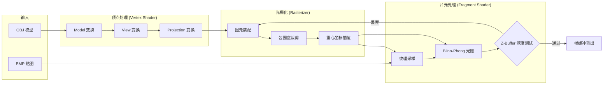
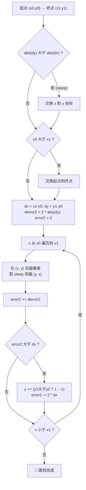
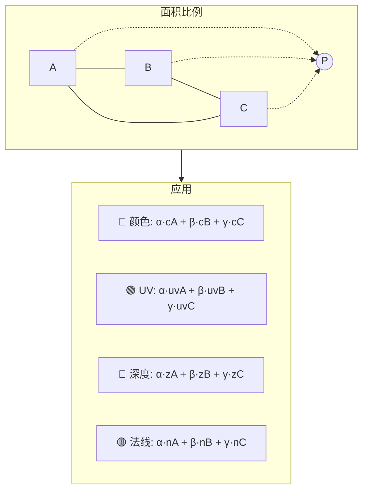
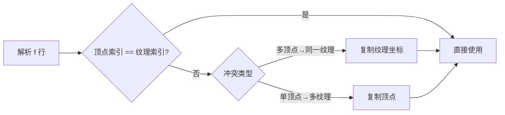
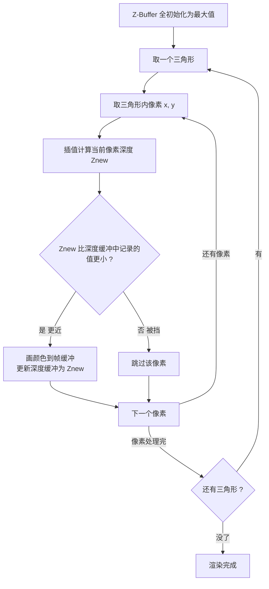
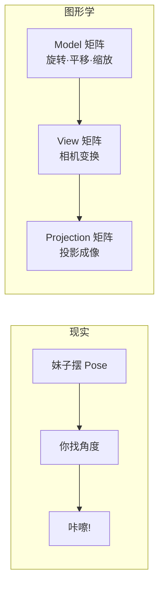
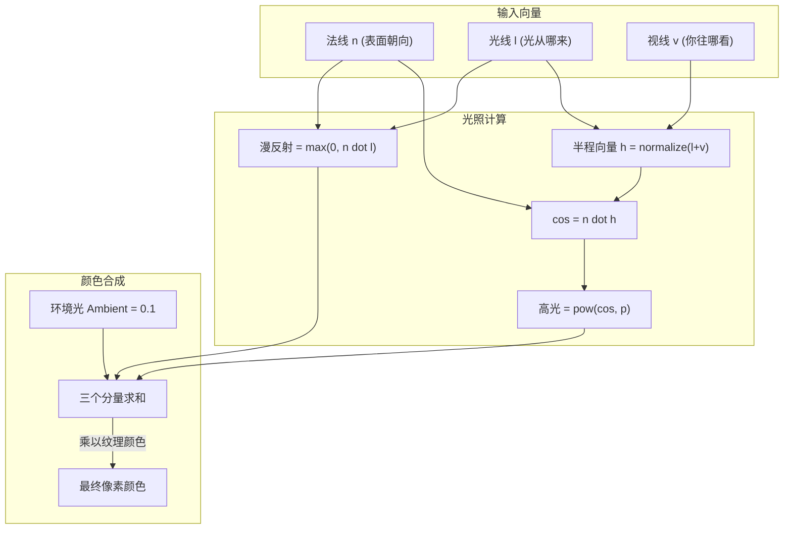
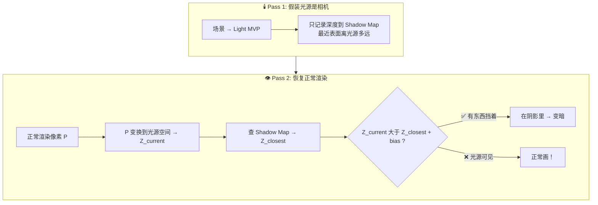
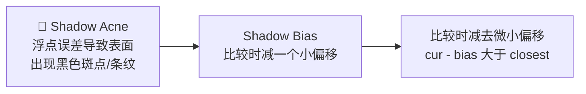
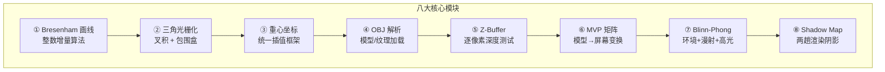

# 自制软渲染器

> 用纯 CPU 代码模拟 GPU 渲染管线，从零构建一个 3D 软渲染器。把"泉此方"渲染到屏幕上！

---

## 总览

### 什么是软渲染器？

游戏引擎本质就是一个功能极其复杂的软渲染器。软渲染器 = 不依赖 GPU / OpenGL / DirectX，纯 CPU 实现**顶点变换 → 光栅化 → 片元着色 → 帧缓冲**的完整渲染流程。说白了，就是用代码从零造一个"小显卡"。

### 功能目标

| 功能 | 说明 |
|------|------|
| 图元绘制 | 线、三角形（Bresenham + 包围盒光栅化） |
| 投影变换 | 正交/透视投影 (MVP) |
| 纹理映射 | OBJ 模型 + BMP 贴图，把老婆贴上去 |
| 光照模型 | Blinn-Phong（Ambient + Diffuse + Specular） |
| 深度测试 | Z-Buffer，谁在前面画谁 |
| 阴影 | Shadow Map，让老婆有影子 |


### 前提条件

- 图形学基础——没学过的话先去看 [GAMES101](https://www.bilibili.com/video/BV1X7411F744)，闫令琪老师 yyds！
- C++ 编程，用到 Eigen 库做线性代数
- 最好用过 Unity / Unreal，这样你能对照着理解"哦原来引擎底层就是这么干的"
- 开发环境：Windows 11 + Visual Studio 2022

---

## 渲染管线总览

整个软渲染器就是在 CPU 上跑一遍 GPU 的流水线：



好，下面我们就一步一步来，从画一条线开始！

---

## 第一步：画线 — Bresenham 算法

### 核心思想

Bresenham 是经典的**增量算法**：每次在主位移方向走一步，另一个方向走不走取决于**误差累积**。全程只用整数加减，不用浮点乘除，效率拉满。

这其实就是 GAMES101 第一节课画线部分讲的内容。



### 完整代码

```cpp
void line(int x0, int y0, int x1, int y1, TGAImage& image, TGAColor color) {
    bool steep = false;
    // 1. 陡峭线 (|k|>1)：交换 xy，最后画点时再换回来
    if (std::abs(x1 - x0) < std::abs(y1 - y0)) {
        std::swap(x0, y0); std::swap(x1, y1);
        steep = true;
    }
    // 2. 保证从左到右
    if (x0 > x1) {
        std::swap(x0, x1); std::swap(y0, y1);
    }
    int dx = x1 - x0, dy = y1 - y0;
    int derror2 = std::abs(dy) * 2;  // 每步误差增量
    int error2 = 0, y = y0;

    for (int x = x0; x <= x1; x++) {
        if (steep) image.set(y, x, color);
        else       image.set(x, y, color);
        error2 += derror2;
        if (error2 > dx) {
            y += (y1 > y0 ? 1 : -1);
            error2 -= dx * 2;
        }
    }
}
```

### `*2` 是干嘛的？

原本的逻辑是 `error > 0.5` 就进位。但 `0.5` 是浮点数！为了避开浮点，等式两边 × 2 → `2*error > 1` → 等价于 `error2 > dx`，**全程整数运算**。这是面试官最爱问的考点。

> 🏔️ **爬坡类比**：你在爬一个缓坡，每走一步高度应该增加 0.3 米。但屏幕像素是整数格，你不能走 0.3 格。所以你只能先横着走，`error2` 记录"亏欠的高度"，攒够 1.0 米就往上跳一格。

---

## 第二步：三角形光栅化 + 重心坐标

### 核心武器：2D 叉积

叉积的几何意义是**平行四边形面积**：

$$cross(a, b, c) = (b_x - a_x)(c_y - a_y) - (b_y - a_y)(c_x - a_x)$$

- 结果 > 0 → c 在 ab **左侧**
- 结果 < 0 → c 在 ab **右侧**
- 结果 = 0 → 三点共线

**面试必问**：怎么判断点 P 在三角形 ABC 里面？答案：P 在三条边的**同一侧**！

```cpp
bool inside(int x, int y, Vec2i v0, Vec2i v1, Vec2i v2) {
    float c1 = cross(v0, v1, {x,y});
    float c2 = cross(v1, v2, {x,y});
    float c3 = cross(v2, v0, {x,y});
    return (c1>=0 && c2>=0 && c3>=0) || (c1<=0 && c2<=0 && c3<=0);
}
```

### 包围盒优化

遍历全屏 700×700 = 49 万个像素去测一个三角形？太蠢了。**包围盒 (Bounding Box)** 只遍历三角形的最小外接矩形：

```cpp
void rasterize(Vec2i v0, Vec2i v1, Vec2i v2, Vec3i color) {
    int mx = std::min({v0.x, v1.x, v2.x}), Mx = std::max({v0.x, v1.x, v2.x});
    int my = std::min({v0.y, v1.y, v2.y}), My = std::max({v0.y, v1.y, v2.y});
    for (int x = mx; x <= Mx; x++)
        for (int y = my; y <= My; y++)
            if (inside(x, y, v0, v1, v2))
                set_pixel(x, y, color);
}
```

### 重心坐标 — 图形学插值之魂

光栅化不只是判断"在不在"，更需要知道"在什么位置"——这就是重心坐标。

$$P = \alpha A + \beta B + \gamma C, \qquad \alpha+\beta+\gamma=1$$

$\alpha, \beta, \gamma$ 就是**面积比**：

$$\alpha = \frac{\text{Area}(P,B,C)}{\text{Area}(A,B,C)},\quad \beta = \frac{\text{Area}(A,P,C)}{\text{Area}(A,B,C)},\quad \gamma = 1-\alpha-\beta$$

> 分子分母都带 1/2，直接用叉积算就行，不用除以 2！



**没有重心坐标，三角形只能是纯色平涂。有了它，颜色渐变、纹理贴图、深度缓存、光照着色全部解锁！**

```cpp
auto barycentric(float x, float y, Vec2i v0, Vec2i v1, Vec2i v2) {
    float area = cross(v0, v1, v2);
    float alpha = cross(v1, v2, {x,y}) / area;  // 对边 v0 的子面积
    float beta  = cross(v2, v0, {x,y}) / area;  // 对边 v1 的子面积
    return tuple{alpha, beta, 1.0f - alpha - beta};
}

// 一步完成"判断内部 + 获取插值权重"
auto [a, b, g] = barycentric(x+0.5f, y+0.5f, v0, v1, v2);
if (a >= -0.001f && b >= -0.001f && g >= -0.001f) {  // 给点容差防黑边
    Vec3f color = a*c0 + b*c1 + g*c2;  // 彩虹三角形！
}
```

> 🐛 **踩坑提醒**：用 `>= -0.001f` 而不是 `>= 0`，不然三角形边缘会出现难看的黑线（浮点精度问题）。

---

## 第三步：OBJ 模型解析

OBJ 文件就是文本格式的 3D 模型，拿记事本就能打开。来认识一下：

```
v  -10.0 0.0 10.0     ← 顶点坐标 (x y z)
vn -0.7 0.0 0.7       ← 法线向量 (x y z)
vt 0.1 0.3            ← 纹理坐标 (u v)，注意原点在左上角！
f  3/3/3 2/2/2 1/1/1  ← 面: 顶点索引/纹理索引/法线索引
```

> ⚠️ 两个坑：OBJ 索引从 **1** 开始，代码里要用 `index-1`。纹理坐标原点在**左上角**（不是左下角！）。

### 纹理坐标小知识

一个顶点可能对应多个纹理坐标（比如嘴角在贴图上出现了两次），也可能多个顶点共用一个纹理坐标。渲染需要"一顶点一纹理"的严格对应。



---

## 第四步：Z-Buffer 深度缓冲

### 一句话理解

> 🪑 **抢座游戏**。屏幕每个像素只有一个"座位"，离相机更近（Z 更小）的才能坐上去。后来的如果更远，直接被挡住，没资格画。



### 代码实现

相比那些吓人的希腊字母公式，代码其实简单得不行：

```cpp
vector<float> zbuf(W*H, INFINITY);

// 在光栅化循环里：
float z = alpha*v0.z + beta*v1.z + gamma*v2.z;  // 重心坐标插值深度
int idx = y * W + x;     // 把 2D 坐标压平到 1D 数组
if (z < zbuf[idx]) {
    zbuf[idx] = z;
    set_pixel(x, y, color);
}
```

### 为什么是 `y * W + x`？

屏幕是 2D，内存是 1D。用这个公式把二维坐标映射到一维索引。**为什么不用 `vector<vector<float>>`？** 因为一维数组内存连续，CPU Cache 命中率高得多，速度能快好几倍。这是图形学界的"普通话"。

---

## 第五步：MVP 矩阵变换

### 拍照类比——把你绕晕的概念一秒理清

现实拍照：妹子摆 Pose → 你找角度 → 按快门。
图形学里完全一样：



### 空间变换链——一个顶点的奇幻漂流


### View 矩阵终极心法

> 📷 **永远别动相机，让世界动。** 相机被胶水粘在原点看向 -Z。View 矩阵 = 把相机的动作**反向**施加给所有物体。摄像机往右走 5 米 = 世界往左移 5 米。

$$M_{view} = \begin{bmatrix} 1 & 0 & 0 & -c_x \\ 0 & 1 & 0 & -c_y \\ 0 & 0 & 1 & -c_z \\ 0 & 0 & 0 & 1 \end{bmatrix}$$

就这么简单，就是取反平移！

### 透视投影——第一个大魔王

透视 = 近大远小。数学本质就一句话：**除以 Z**。

$$\frac{Y'}{1} = \frac{Y}{Z} \quad\Longrightarrow\quad \text{屏幕上越小} \propto \text{越远}$$

但矩阵是线性的（只能加减乘），做不了除法！怎么办？图形学的神之一手：**把 Z 偷偷塞到齐次坐标的第 4 分量 w 里**，最后手动 `÷ w` 就完成了透视除法。

```cpp
// 透视矩阵（OpenGL 标准，GAMES101 同款）
Matrix4f projection(float fov, float aspect, float n, float f) {
    Matrix4f m = Matrix4f::Zero();
    float t = tan(fov * M_PI / 360.0);
    m(0,0) = 1/(aspect*t);  m(1,1) = 1/t;
    m(2,2) = -(f+n)/(f-n);  m(2,3) = -2*f*n/(f-n);
    m(3,2) = -1;            // ← 关键！把 -Z 塞进 w
    return m;
}

// 顶点变换完整流程（面试高频考点！）
Vector4f clip  = proj * view * model * Vector4f(x,y,z,1);
Vector3f ndc   = clip.head<3>() / clip.w();     // 👈 透视除法！近大远小在此一举
float screen_x = (ndc.x()+1) * 0.5f * WIDTH;    // 视口变换 [-1,1] → [0,W]
float screen_y = (ndc.y()+1) * 0.5f * HEIGHT;
```

### 旋转矩阵速查

| 绕轴 | 不变的轴 | 矩阵（3×3 旋转部分） |
|:----:|:--------:|:---------------------:|
| Z | Z | $\begin{bmatrix}\cos & -\sin & 0\\ \sin & \cos & 0\\ 0 & 0 & 1\end{bmatrix}$ |
| X | X | $\begin{bmatrix}1 & 0 & 0\\ 0 & \cos & -\sin\\ 0 & \sin & \cos\end{bmatrix}$ |
| Y | Y | $\begin{bmatrix}\cos & 0 & \sin\\ 0 & 1 & 0\\ -\sin & 0 & \cos\end{bmatrix}$ ⚠️ sin 符号反转（右手定则）|

> 😎 Eigen 偷懒大法：`Eigen::AngleAxisf(angle, Vector3f::UnitY()).toRotationMatrix()`

---

## 第六步：光照 — Blinn-Phong 模型

### 为什么你能看到颜色？

光打到物体 → 物体反射 → 进入你的眼睛。Blinn-Phong 把进入相机的光拆成三份：



### 公式速查

| 分量 | 公式 | 干嘛的 |
|------|------|--------|
| **环境光** Ambient | $L_a = k_a$ | 给个基础亮度，不然背光面一片死黑 |
| **漫反射** Diffuse | $L_d = k_d \cdot \max(0,\ \mathbf{n}\!\cdot\!\mathbf{l})$ | 兰伯特余弦定律，体现体积感和立体感 |
| **高光** Specular | $L_s = k_s \cdot \max(0,\ \mathbf{n}\!\cdot\!\mathbf{h})^p$ | 亮晶晶的反光小白点，Blinn 的偷懒改进 |

### Blinn 偷了什么懒？

原始 Phong 模型需要算反射向量 $R = 2(\mathbf{n}\cdot\mathbf{l})\mathbf{n} - \mathbf{l}$，公式长还费计算。

Jim Blinn 发现了：**如果眼睛恰好看到反射光 → 那法线 n 一定夹在光线 l 和视线 v 的正中间！** 所以直接算半程向量 $h = \frac{l+v}{\|l+v\|}$，看 h 和 n 有多接近就行——省了一大坨计算，效果还差不多！

### 高光指数 p —— 控制"油光瓦亮"程度

`pow(cos, p)` 里的 p：越大 → 高光越集中越小（金属感），越小 → 高光越散（塑料感）。p=128 是经典值。

### 完整实现

```cpp
// 在光栅化循环内：
Vector3f n = (alpha*n0 + beta*n1 + gamma*n2).normalized();  // ⚠️ 必须归一化！
Vector3f l(0,0,1), v(0,0,1);           // 光从屏幕来，相机也在前方
Vector3f h = (l + v).normalized();      // Blinn 的精髓：半程向量

float amb  = 0.1f;
float diff = max(0.0f, n.dot(l));      // 漫反射
float spec = pow(max(0.0f, n.dot(h)), 128);  // 高光

Vector3f tex = sample_texture(u, v);
Vector3f col = tex * (amb + diff) + Vec3f(255)*spec;
col = col.cwiseMin(255);  // 防止过曝
```

这样你的老婆模型就有立体感了！脸颊侧面变暗，头发上出现高光，旋转模型时光影跟着实时变化。

### 法线变换

模型旋转时，法线**必须**跟着转。法线是方向向量 (w=0)，不受平移影响：

```cpp
n_trans = (model * Vector4f(n, 0)).head<3>().normalized();
```

> 🔬 面试加分：严谨做法用 model 矩阵的**逆转置矩阵** `(M⁻¹)ᵀ` 变换法线，但如果只有旋转平移（等距变换），直接用 model 矩阵就行。

---

## 第七步：Shadow Mapping 阴影

### 灵魂概括

> 🕶️ **"不看颜色，只看深度——连灯光都看不到的地方，就是阴影。"**

### 两趟渲染



### 排队买票类比

> 🎫 售票窗口 = 光源。
> - Pass 1：售票员探头一看："最近的人 A 离我 1 米"→ Shadow Map 记下 1.0
> - Pass 2：上帝视角检查 B。B 离窗口 2 米 > 记录的 1 米 → **B 被 A 挡住了！阴影！**

### 需要新增的零件

| 组件 | 说明 |
|------|------|
| Light View/Projection | 平行光用**正交投影**；点光源用透视投影 |
| `shadow_buffer` | `vector<float>`，1024×1024 |
| `render_shadow_map()` | 极简光栅化：只管深度，不看颜色 |

### 核心逻辑 + 最大坑

```cpp
float cur = /* 当前点在光源空间的深度 */;
float closest = shadow_map[sample_v][sample_u];

if (cur - 0.005 > closest)    // 👈 bias = 0.005
    final_color *= 0.5f;      // 阴影中变暗
```



> 不加 bias，浮点精度会让模型表面布满脏兮兮的黑斑（Shadow Acne/阴影痤疮），这是 Shadow Map 的经典坑。

---

## 结束语



这八个模块走完，你就从零写出了一个完整的软渲染器。以后用 Unity/Unreal 的时候，看到 Vertex Shader → Rasterizer → Fragment Shader → Output Merger 这条管线，心里就门儿清了——因为每个环节你都用 C++ 亲手撸过一遍！

---

## 参考资料

- [GAMES101 - 现代计算机图形学入门](https://www.bilibili.com/video/BV1X7411F744) — 入门神课，必看
- [tinyrenderer](https://github.com/ssloy/tinyrenderer) — 著名的软渲染器教程，本文深受其启发
- [Scratchapixel](https://www.scratchapixel.com/) — 图形学理论讲得最透彻的网站
- [OpenGL Tutorial - Matrices](http://www.opengl-tutorial.org/beginners-tutorials/tutorial-3-matrices/)
