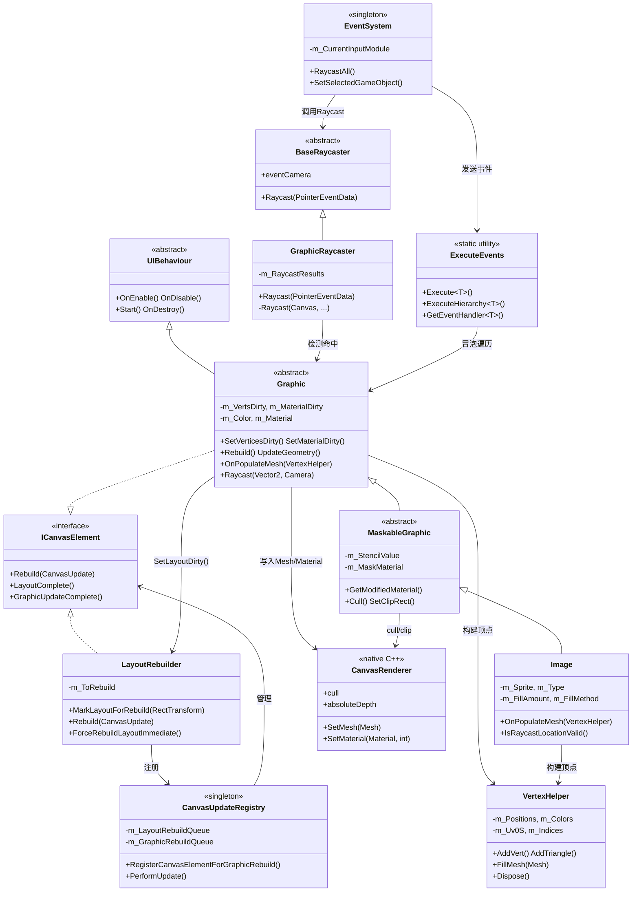
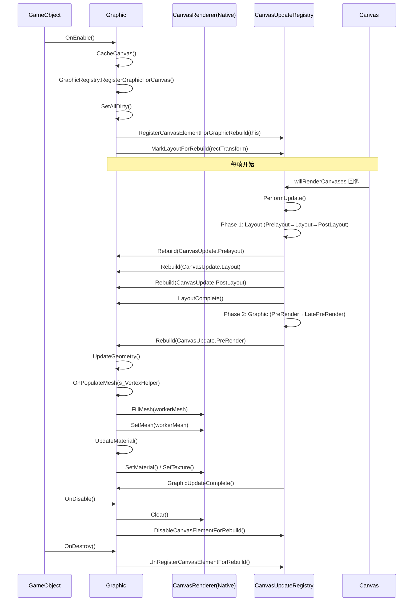
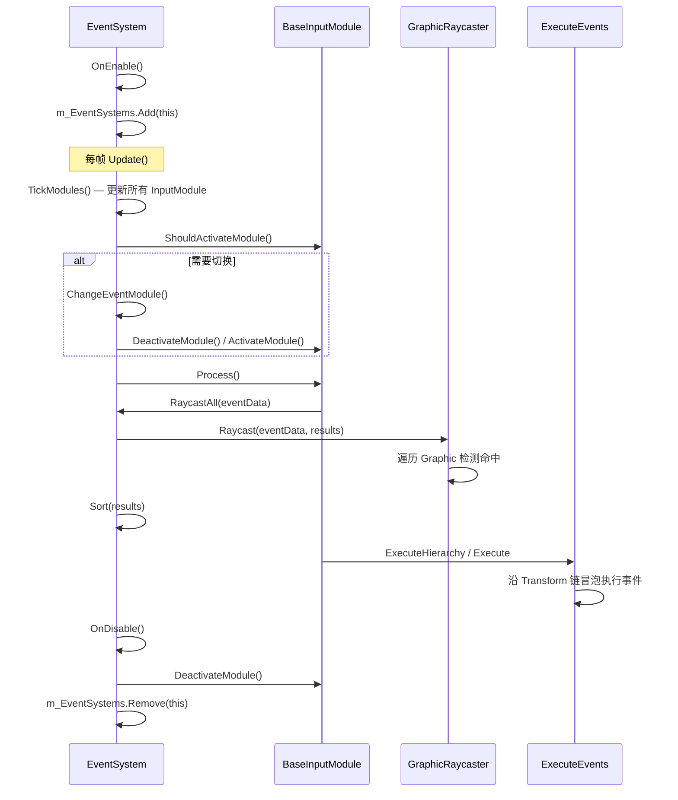
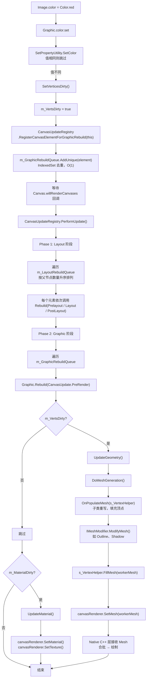
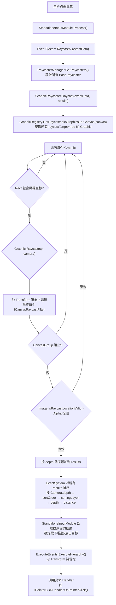
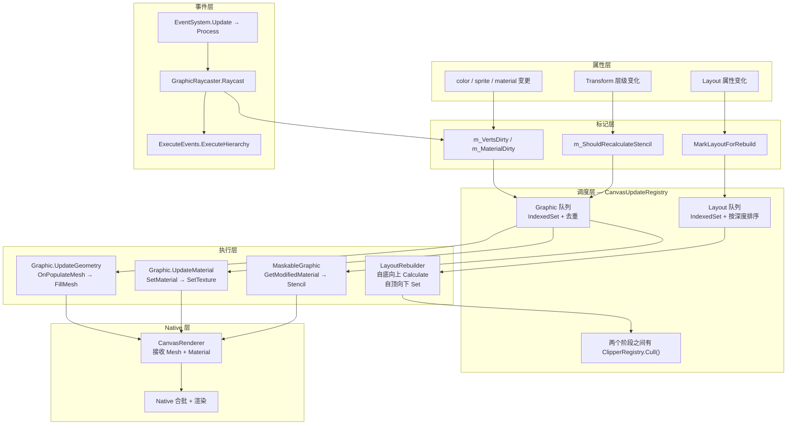

# UGUI 核心渲染与事件系统 — 源码分析

> 分析范围：`Graphic` / `CanvasUpdateRegistry` / `CanvasRenderer` / `Image` / `GraphicRaycaster` / `EventSystem` / `ExecuteEvents` / `LayoutRebuilder` / `VertexHelper` / `MaskableGraphic`
>
> 源码版本：Unity `com.unity.ugui` package

---

## 一、模块作用

### 1.1 这些模块共同解决了什么问题？

这 10 个模块构成了 UGUI 的**核心骨架**——它们共同解决了"如何在 Unity 中高效地渲染 2D UI 并处理用户输入"这个问题。具体可以拆分为三个子系统：

| 子系统 | 核心模块 | 解决的问题 |
|--------|---------|-----------|
| **渲染管线** | `Graphic` → `CanvasUpdateRegistry` → `CanvasRenderer` → `VertexHelper` | UI 顶点如何生成、如何合批、何时提交给 GPU |
| **视觉组件** | `Image` → `MaskableGraphic` | 具体的 UI 控件如何生成自己的网格（简单图、九宫格、平铺、填充） |
| **事件系统** | `EventSystem` → `GraphicRaycaster` → `ExecuteEvents` | 鼠标/触屏点击如何命中 UI、事件如何冒泡 |
| **布局系统** | `LayoutRebuilder` | UI 的自动排列和尺寸计算何时触发、按什么顺序执行 |

### 1.2 为什么 Unity 要这样设计？

UGUI 的核心设计哲学是 **"脏标记 + 延迟重建 + 合批渲染"**：

1. **脏标记（Dirty Flag）**：属性变化时不立即重建，只设置标记位，把实际工作推迟到渲染前统一处理。这避免了同一帧内多次修改同一 UI 导致的重复计算。
2. **CanvasUpdateRegistry 集中调度**：所有需要重建的 UI 元素注册到全局队列，由 `Canvas.willRenderCanvases` 回调统一驱动。这保证了重建的顺序性（先 Layout 后 Graphic）和去重（同一元素只重建一次）。
3. **CanvasRenderer 桥接 Native**：Mesh 数据通过 `CanvasRenderer` 提交到 C++ 层，Native 层负责最终的合批和绘制。C# 层只负责"生成什么"，不关心"怎么画"。

### 1.3 如果没有这些模块会怎样？

- **没有 CanvasUpdateRegistry**：每个 UI 属性变化都立即重建，一帧内可能出现 O(n²) 次重建。
- **没有脏标记机制**：在 `Update()` 中修改 color 和 position 将触发两次完整重建，而不是合并为一次。
- **没有 EventSystem + ExecuteEvents**：每个可交互的 UI 元素都需要自己实现射线检测和事件处理，无法复用。
- **没有 LayoutRebuilder**：无法实现自动布局，每个子元素的尺寸和位置都需要手动计算。

---

## 用自然语言讲一遍完整流程

> 如果你刚接触 UGUI 源码，可以先看这一章。下面用"讲故事"的方式，把渲染流程和事件流程各讲一遍，不涉及代码细节，只讲"发生了什么"。

### 渲染流程：一个 Image 从修改颜色到出现在屏幕上

想象你有一个 `Image` 组件挂在一个 GameObject 上，它在一个 Canvas 下面。你在代码里写了一行：

```csharp
myImage.color = Color.red;
```

**第一步：设置脏标记，仅此而已。**

`color` 的 setter 不是直接去改屏幕上的像素——它只做两件事：先把新颜色存下来，然后把一个叫 `m_VertsDirty` 的 bool 变量设为 `true`。这个变量名字很直白："顶点脏了，需要重建"。

然后它把自己（这个 Image 对应的 Graphic 对象）交给一个全局的"待办队列"。这个队列叫 `CanvasUpdateRegistry`，它是整个 UGUI 渲染系统的"调度中心"。

你在同一帧里怎么改颜色都无所谓——改 10 次就是 10 次 setter 调用，但 `m_VertsDirty` 只能从 false 变成 true 一次，而那个"待办队列"用的是去重的数据结构（IndexedSet），同一个元素只会被加进去一次。

**第二步：等待 Canvas 的"渲染前"信号。**

`CanvasUpdateRegistry` 在它被创建的时候就订阅了一个事件：`Canvas.willRenderCanvases`。这个事件是 Unity 引擎在每帧渲染 Canvas 之前发出的——相当于引擎在对 Canvas 说"我要画你了，你准备好了吗？"

UGUI 就是把自己的准备工作挂在这个回调上。这个时机选得很好：太早的话，你可能改来改去白准备了；太晚的话，渲染已经开始了，来不及了。

**第三步：两轮重建——先布局，再画图。**

当 `Canvas.willRenderCanvases` 触发时，`CanvasUpdateRegistry.PerformUpdate()` 开始干活。它分两个阶段：

**阶段一：Layout（布局）阶段。** 这个阶段处理所有"位置和尺寸"相关的事情。比如你的 Image 在一个 LayoutGroup 里面，LayoutGroup 需要根据所有子元素的大小重新计算每个元素的位置。这个阶段分三个子步骤：Prelayout（布局前准备）、Layout（正式计算）、PostLayout（布局后收尾）。

布局阶段有一个关键细节：它按"父节点深度"排序。深度浅的先执行——也就是说，越靠近 Canvas 根的越先算。为什么？因为父节点的尺寸先确定，子节点的尺寸才能基于父节点来计算。

布局算完后，所有参与了布局重建的元素会收到一个 `LayoutComplete()` 回调，意思是"你关心的布局已经算完了"。然后布局队列被清空。

在布局和图像重建之间，还插了一步 **Culling（裁剪）**。Layout 算完了才知道每个元素的最终位置，这时才能判断哪些元素在屏幕外面——在屏幕外面的就把 `canvasRenderer.cull` 设为 true，后续跳过它们的渲染。

**阶段二：Graphic（图像）阶段。** 这个阶段处理所有"顶点和材质"相关的事情。它遍历 Graphic 队列中的每个元素，调用它们的 `Rebuild` 方法。

`Rebuild` 里会检查两个标记位：`m_VertsDirty` 和 `m_MaterialDirty`。如果顶点脏了，就调用 `UpdateGeometry()`；如果材质脏了，就调用 `UpdateMaterial()`。

**第四步：生成顶点网格。**

`UpdateGeometry()` 的核心调用链是：

1. **`OnPopulateMesh(VertexHelper vh)`**：这是子类（Image、Text 等）重写的方法，负责往 VertexHelper 里塞顶点。Image 会根据自己的 type（Simple/Sliced/Tiled/Filled）生成不同形状的 quad，每个顶点包含 position、color、uv。你在第一步改的 `Color.red`，就是在这里作为顶点色写入的。

2. **`IMeshModifier.ModifyMesh()`**：遍历所有实现了 IMeshModifier 的组件（比如 Outline、Shadow），让它们修改顶点。Outline 的原理就是往四个方向多画几遍，Shadow 就是往一个方向偏移再画一遍。

3. **`VertexHelper.FillMesh(workerMesh)`**：把 VertexHelper 里攒的顶点和索引数据填充到一个 Mesh 对象里。WorkerMesh 是一个 static 共享的 Mesh，所有 Graphic 共用一个。

4. **`CanvasRenderer.SetMesh(workerMesh)`**：把 Mesh 提交给 Native C++ 层的 CanvasRenderer。到这里 C# 层的工作就结束了。

**第五步：Native 层合批渲染。**

C++ 层的 CanvasRenderer 拿到 Mesh 和 Material 后，不会立刻画。它会把同一个 Canvas 下、使用相同 Material 和 Texture 的所有元素合并成一个大的 DrawCall。这就是 UGUI 的**自动合批**。合并完成后，才真正提交给 GPU 渲染管线。

全部 Graphic 重建完毕后，队列清空，每个元素收到 `GraphicUpdateComplete()` 回调。

**第六步：下一帧再来。**

帧结束了。如果你下一帧又改了颜色，流程从头开始。如果没有任何变化，`Canvas.willRenderCanvases` 还是触发，但队列是空的，`PerformUpdate` 几乎零开销退出。

---

### 事件流程：一个点击如何找到它应该触发的按钮

刚才说的是"画出来"的流程，现在说"点上去"的流程。

**第一步：InputModule 检测到输入。**

你点击了鼠标左键。Unity 的输入系统捕捉到这个事件。

`EventSystem` 是事件系统的"大脑"。它在每帧的 `Update()` 里做三件事：TickModules（更新所有 InputModule）、检查是否需要切换 InputModule、让当前激活的 InputModule 执行 `Process()`。

`StandaloneInputModule.Process()` 里会检测鼠标状态的变化——比如鼠标左键从"没按"变成"按下"，就判定为 PointerDown 事件。

**第二步：Raycast——从屏幕上的一点找到它击中了哪些 UI。**

InputModule 调用 `EventSystem.RaycastAll(pointerEventData, raycastResults)`。RaycastAll 会遍历所有激活的 Raycaster。

对于 UGUI 来说，每个 Canvas 自动带一个 `GraphicRaycaster`。GraphicRaycaster 的 Raycast 流程：

1. 从 `GraphicRegistry` 拿到这个 Canvas 下所有 `raycastTarget = true` 的 Graphic。
2. 逐个检查鼠标坐标是否在 Graphic 的 RectTransform 矩形内。
3. 如果矩形命中，调用 `Graphic.Raycast(sp, camera)` 做进一步检查——这个方法会沿 Transform 链向上遍历，检查途经的 CanvasGroup（是否可交互？是否被 Alpha 挡住？是否 IgnoreParentGroups？）和 ICanvasRaycastFilter（比如 Image 的 AlphaHitTest）。
4. 所有命中的 Graphic 按 `depth`（渲染深度，越大越靠前）**降序**排列——使用者看到的最前面的 UI 排在最前面。

**第三步：排序所有命中结果。**

不同的 Raycaster 可能返回不同的结果（比如同时有 UGUI 的 Canvas 和物理碰撞体）。EventSystem 用一个复杂的 `RaycastComparer` 对所有结果统一排序，优先级从高到低是：

```
Camera.depth → sortOrderPriority → renderOrderPriority → sortingLayer → sortingOrder → depth → distance → index
```

排序后，第一个结果就是"用户最可能想点的那个东西"。

**第四步：确定事件目标并发送。**

InputModule 拿到排序后的结果，根据不同的输入阶段确定目标：

- **PointerDown**：第一个命中的元素成为"按下目标"（pressTarget）
- **PointerUp**：再次 Raycast，找到"释放目标"。如果释放目标和按下目标是同一个 → **Click 事件**
- **Drag**：如果鼠标在按下后移动超过阈值（`pixelDragThreshold`），进入拖拽模式，目标切换为"拖拽目标"

确定目标后，InputModule 使用 `ExecuteEvents` 静态工具类来发送事件。

**第五步：事件冒泡。**

`ExecuteEvents.ExecuteHierarchy<T>(target, eventData, handler)` 是事件冒泡的实现：

1. 从目标 GameObject 开始，沿 `transform.parent` 一路向上构建一条"从子到根"的链条。
2. 在链条的每个节点上调用 `Execute<T>`——获取该节点上所有实现了 T 接口的组件，逐个调用 `handler.OnXXX(eventData)`。
3. 如果某个节点成功处理了事件（说明该节点上有对应接口的组件），就停止冒泡，返回该节点。

举个例子：你点了一个 Button 里面的 Text 子节点。事件从 Text → Button → 父层……逐层冒泡。Text 上没有 `IPointerClickHandler`，Button 上有——所以 Button 截获了这个点击。

**第六步：选中管理。**

点击一个 Selectable（Button、Toggle 等）会触发 `EventSystem.SetSelectedGameObject()`。这个方法先对旧选中对象发 `OnDeselect`，再对新选中对象发 `OnSelect`。它内部有一个 `m_SelectionGuard` 标记防止递归选择（比如在 OnSelect 回调里又触发了 SetSelected）。

---

### 两个流程的汇合点

渲染流程和事件流程看起来是独立的，但它们在几个地方会交汇：

| 交汇点 | 说明 |
|--------|------|
| **Raycast 依赖 depth** | 事件命中排序用的是 `canvasRenderer.absoluteDepth`，这是渲染系统算出来的 |
| **Culling 影响事件** | 被 cull 的 Graphic，在 Raycast 时会被跳过（`canvasRenderer.cull` 检查） |
| **Layout 影响事件命中区域** | 事件用 `RectTransform.rect` 做矩形检测，如果布局还没更新，检测区域就是旧的 |
| **CanvasGroup 同时影响渲染和事件** | `interactable = false` 阻止 Raycast，`alpha = 0` 仍可被 Raycast 命中 |

---

## 二、整体架构

### 2.1 类关系图



### 2.2 各模块职责

| 模块 | 职责 | 层次 |
|------|------|------|
| `UIBehaviour` | 提供 `OnEnable/OnDisable/Start/OnDestroy` 生命周期 | 基类 |
| `Graphic` | 所有 UI 视觉元素的抽象基类，管理 dirty 标记、颜色、材质、射线检测 | 核心 |
| `MaskableGraphic` | 在 Graphic 基础上增加 Mask（遮罩）和 Clipping（裁剪）支持 | 中间层 |
| `Image` | 具体视觉组件：Sprite 渲染、四种填充模式、九宫格、Alpha 检测 | 叶子 |
| `CanvasUpdateRegistry` | 全局单例，管理两阶段（Layout → Graphic）的延迟重建队列 | 调度 |
| `CanvasRenderer` | Native C++ 类，接收 Mesh/Material 并提交渲染 | 渲染桥接 |
| `VertexHelper` | 顶点和索引的临时缓冲区，使用 `ListPool` 避免 GC | 工具类 |
| `LayoutRebuilder` | 驱动 `ILayoutElement` 和 `ILayoutController` 的自底向上/自顶向下计算 | 布局 |
| `EventSystem` | 全局单例，管理 InputModule 切换、驱动射线检测、管理选中对象 | 事件中枢 |
| `GraphicRaycaster` | 针对 Canvas 下 Graphic 元素的射线检测器 | 射线检测 |
| `ExecuteEvents` | 静态工具类，封装事件执行、层次冒泡、EventHandler 查找 | 事件分发 |

---

## 三、生命周期

### 3.1 Graphic 的生命周期



### 3.2 EventSystem 的生命周期



---

## 四、源码调用流程

### 4.1 从属性修改到屏幕渲染的完整链路



### 4.2 关键步骤详解

**步骤 1：属性变更（Graphic.color.set）**

```
类：Graphic
函数：color.set
调用者：用户代码或 Animation
作用：比较新旧值，相同则跳过，不同则标记顶点脏
关键设计：SetPropertyUtility.SetColor 先比较再赋值，
          避免对相同值的重复设置触发无意义的重建
```

**步骤 2：注册到全局队列（SetVerticesDirty → RegisterCanvasElementForGraphicRebuild）**

```
类：Graphic → CanvasUpdateRegistry
函数：SetVerticesDirty() → RegisterCanvasElementForGraphicRebuild()
作用：将自身加入全局 Graphic 重建队列
关键设计：使用 IndexedSet（内部是 Dictionary + List），
          AddUnique 保证同一元素不会重复注册，O(1) 复杂度
```

**步骤 3：Canvas.willRenderCanvases 触发 PerformUpdate**

```
类：CanvasUpdateRegistry
函数：PerformUpdate()
触发时机：Canvas 组件在渲染前回调
关键设计：这是 Unity 提供的"渲染前钩子"，
          UGUI 整个重建系统都挂在这个回调上
```

**步骤 4：分阶段重建**

```
类：CanvasUpdateRegistry
关键设计：Layout 阶段（Prelayout → Layout → PostLayout）
         先按父节点深度升序排列（浅层先执行，保证父节点先于子节点）
         Graphic 阶段（PreRender → LatePreRender）
         两个阶段之间有 ClipperRegistry.Cull() 裁剪操作
```

**步骤 5：更新 Mesh（UpdateGeometry → DoMeshGeneration）**

```
类：Graphic
函数：UpdateGeometry() → DoMeshGeneration()
流程：
  1. OnPopulateMesh(s_VertexHelper) — 子类填充顶点
  2. 遍历所有 IMeshModifier 组件（如 Outline、Shadow）修改顶点
  3. s_VertexHelper.FillMesh(workerMesh) — 填充到共享 Mesh
  4. canvasRenderer.SetMesh(workerMesh) — 提交到 Native 层
关键设计：
  - s_VertexHelper 是 static，所有 Graphic 共用一个
  - workerMesh 是 static，所有 Graphic 共用一个 Mesh 对象
  - 这避免了每次重建都 new Mesh 和 new VertexHelper
```

### 4.3 事件处理的完整链路



---

## 五、核心成员变量

### 5.1 Graphic

| 变量 | 类型 | 作用 | 写入时机 | 读取时机 | 为什么存在 |
|------|------|------|---------|---------|-----------|
| `m_VertsDirty` | bool | 标记顶点需要重建 | SetVerticesDirty() | Rebuild() | 脏标记模式的基石，避免重复重建 |
| `m_MaterialDirty` | bool | 标记材质需要更新 | SetMaterialDirty() | Rebuild() | 与顶点重建分离，材质切换不触发顶点重算 |
| `m_Color` | Color | 顶点色 | Inspector / 代码 | OnPopulateMesh | 作为顶点色写入，与 CanvasRenderer 颜色独立 |
| `m_RaycastTarget` | bool | 是否参与射线检测 | Inspector / 代码 | GraphicRaycaster | 控制事件穿透行为 |
| `m_SkipLayoutUpdate` | bool | 跳过布局重建 | Sprite 切换时优化 | SetAllDirty() | SpriteSheet 动画时避免不必要的布局重建 |
| `m_SkipMaterialUpdate` | bool | 跳过材质更新 | Sprite 切换时优化 | SetAllDirty() | 同纹理 Sprite 切换不需要重建材质 |
| `m_CanvasRenderer` | CanvasRenderer | Native 渲染器引用 | Lazy 缓存 + 自动创建 | UpdateGeometry/UpdateMaterial | 连接 C# 和 C++ 渲染的桥梁 |
| `s_VertexHelper` | VertexHelper(static) | 全局共享顶点缓冲区 | DoMeshGeneration() | DoMeshGeneration() | 避免每帧分配，所有 UI 元素共用 |
| `s_Mesh` | Mesh(static) | 全局共享 Mesh | DoMeshGeneration() | workerMesh | 同上，所有 UI 元素共用一个 Mesh |

### 5.2 CanvasUpdateRegistry

| 变量 | 类型 | 作用 |
|------|------|------|
| `m_LayoutRebuildQueue` | `IndexedSet<ICanvasElement>` | 布局重建队列，内部 Dictionary + List |
| `m_GraphicRebuildQueue` | `IndexedSet<ICanvasElement>` | 图像重建队列 |
| `m_PerformingLayoutUpdate` | bool | 防止嵌套重建的标志位 |
| `m_PerformingGraphicUpdate` | bool | 同上 |

### 5.3 Image

| 变量 | 类型 | 作用 |
|------|------|------|
| `m_Sprite` | Sprite | 渲染的 Sprite 源 |
| `m_OverrideSprite` | Sprite | 临时覆盖 Sprite（不序列化） |
| `m_Type` | Type enum | Simple / Sliced / Tiled / Filled |
| `m_FillAmount` | float (0-1) | 填充比例 |
| `m_AlphaHitTestMinimumThreshold` | float | Alpha 命中测试阈值 |
| `m_UseSpriteMesh` | bool | 是否使用 Sprite 的 Tight Mesh |

### 5.4 MaskableGraphic

| 变量 | 类型 | 作用 |
|------|------|------|
| `m_ShouldRecalculateStencil` | bool | Stencil 值需要重新计算的标记 |
| `m_StencilValue` | int | 当前 Stencil 层级深度 |
| `m_MaskMaterial` | Material | Mask 生成的 Stencil 材质 |
| `m_ParentMask` | RectMask2D | 父级 RectMask2D 引用 |

### 5.5 EventSystem

| 变量 | 类型 | 作用 |
|------|------|------|
| `m_CurrentInputModule` | BaseInputModule | 当前激活的输入模块 |
| `m_CurrentSelected` | GameObject | 当前选中的 GameObject |
| `m_SelectionGuard` | bool | 防止递归选择的卫语句 |
| `m_EventSystems` | `static List<EventSystem>` | 全局 EventSystem 列表，索引 0 为 current |

---

## 六、核心函数

### 6.1 Graphic

#### `SetAllDirty()` — 全量标记脏

```
作用：一次性标记 Layout、Material、Vertices、Raycast 全部脏
调用时机：OnEnable()、OnTransformParentChanged()、OnDidApplyAnimationProperties()、OnValidate()
谁调用：生命周期回调 + 用户手动调用
设计目的：
  - 提供"全部重置"的入口，OnEnable 时必须全量重建
  - SkipLayoutUpdate / SkipMaterialUpdate 可以跳过不必要的子项
    这是 SpriteSheet 动画的优化：只改变 UV，不需要重建 Layout 和 Material
```

#### `Rebuild(CanvasUpdate update)` — 延迟重建的入口

```
作用：根据 update 阶段决定做 Layout 还是 Graphic 重建
调用时机：CanvasUpdateRegistry.PerformUpdate() 遍历队列时
谁调用：CanvasUpdateRegistry
内部流程：
  if (canvasRenderer.cull) return; // 被裁剪的元素跳过重建，关键优化
  switch (update):
    PreRender → UpdateGeometry() + UpdateMaterial()
设计目的：
  统一的重建入口，CanvasUpdateRegistry 不关心具体类型，
  只通过 ICanvasElement 接口调用
```

#### `Raycast(Vector2 sp, Camera eventCamera)` — 射线检测

```
作用：判断屏幕坐标是否命中此 Graphic
调用时机：GraphicRaycaster 遍历 Graphics 时
谁调用：GraphicRaycaster
内部流程：
  1. 沿 Transform 链向上遍历
  2. 检查每个节点的 ICanvasRaycastFilter 组件
  3. CanvasGroup.ignoreParentGroups 可以中断向上遍历
  4. 任一 filter 返回 false 则整体返回 false
设计目的：
  CanvasGroup 的射线过滤作用域扩展到子节点，
  不需要每个子节点都挂 CanvasGroup
```

### 6.2 CanvasUpdateRegistry

#### `PerformUpdate()` — 核心调度

```
作用：执行一帧内所有注册的 UI 重建任务
调用时机：Canvas.willRenderCanvases 回调
谁调用：Canvas（通过事件订阅）
内部流程：
  1. CleanInvalidItems() — 清理已销毁元素
  2. Layout 阶段：按父节点深度排序（浅→深），遍历 Prelayout/Layout/PostLayout
  3. LayoutComplete() 回调所有元素
  4. 清空 Layout 队列
  5. ClipperRegistry.Cull() — 执行裁剪
  6. Graphic 阶段：遍历 PreRender/LatePreRender
  7. GraphicUpdateComplete() 回调所有元素
  8. 清空 Graphic 队列
设计目的：
  两阶段分离（Layout → Graphic），保证布局先于渲染完成，
  因为渲染依赖布局计算的结果（RectTransform 的尺寸）
```

### 6.3 ExecuteEvents

#### `Execute<T>(GameObject, BaseEventData, EventFunction<T>)` — 事件执行

```
作用：在目标 GameObject 上执行指定类型的事件
调用时机：StandaloneInputModule 发出各种事件时
谁调用：InputModule
内部流程：
  1. ListPool 获取临时 IEventSystemHandler 列表
  2. GetEventList<T> 获取目标上所有 T 类型的 handler
  3. 逐个调用 functor(handler, eventData)
  4. 归还临时列表到 ListPool
设计目的：
  使用泛型 + delegate 实现类型安全的事件分发，
  ListPool 零 GC 分配
```

#### `ExecuteHierarchy<T>(GameObject, BaseEventData, EventFunction<T>)` — 层次冒泡

```
作用：从目标沿 Transform 链向上冒泡执行事件
调用时机：拖拽、点击等需要冒泡的事件
谁调用：InputModule
内部流程：
  1. GetEventChain 构建从目标到根的 Transform 列表
  2. 从目标开始向上遍历
  3. 每个节点调用 Execute<T>
  4. 第一个返回 true 的节点停止冒泡并返回其 GameObject
设计目的：
  实现 DOM 风格的事件冒泡，
  子节点可以"消费"事件阻止继续向上传递
```

### 6.4 LayoutRebuilder

#### `MarkLayoutForRebuild(RectTransform)` — 标记需要重建布局

```
作用：从给定 RectTransform 向上找到最近的 ILayoutGroup 根节点并标记
调用时机：Graphic.SetLayoutDirty() / 子元素增删
谁调用：Graphic / LayoutGroup / ContentSizeFitter 等
内部流程：
  1. 从 rect 向上遍历父节点
  2. 找到第一个有 ILayoutGroup 的祖先 → layoutRoot
  3. 验证 layoutRoot 有 ILayoutController
  4. MarkLayoutRootForRebuild → 从 ObjectPool 取 LayoutRebuilder → 注册到 CanvasUpdateRegistry
设计目的：
  "找根"机制避免了对每个叶子节点都执行完整布局计算，
  子节点只标记自己，布局计算在最近的 Group 层面统一执行
```

### 6.5 Image.OnPopulateMesh

```
作用：根据 Image.type 生成对应网格
调用时机：Graphic.UpdateGeometry() → DoMeshGeneration()
内部流程：
  switch (type):
    Simple: GenerateSimpleSprite / GenerateSprite（Tight Mesh）
    Sliced: GenerateSlicedSprite（3×3 网格，border 区域不变形）
    Tiled:  GenerateTiledSprite（重复填充，顶点数可能很大）
    Filled: GenerateFilledSprite（用 RadialCut 裁剪顶点）
设计目的：
  模板方法模式 — Graphic 定义框架（何时重建），
  Image 只负责"生成什么样的网格"
```

---

## 七、涉及的数据结构

### 7.1 IndexedSet（CanvasUpdateRegistry 的队列）

| 特性 | 说明 |
|------|------|
| **内部结构** | `Dictionary<T, int>` + `List<T>` |
| **Add** | O(1) — 先查 Dict 去重，再 Add 到 List |
| **Remove** | O(1) — 标记式删除（DisableItem），非真正删除 |
| **Contains** | O(1) — Dict 查找 |
| **Sort** | O(n log n) — 对 List 排序 |
| **为什么选它** | 既需要 O(1) 去重（Set），又需要按序迭代（List），还需要排序能力 |

### 7.2 ListPool（通用临时列表池）

| 特性 | 说明 |
|------|------|
| **设计模式** | 对象池 |
| **GC 优化** | 避免 `new List<T>()` 的短期分配 |
| **使用位置** | ExecuteEvents.GetEventList、Graphic.GetComponents 调用、LayoutRebuilder 遍历 |
| **关键细节** | Get 从池中取空 List，Release 时 Clear 并归还 |

### 7.3 ObjectPool（LayoutRebuilder 的池）

| 特性 | 说明 |
|------|------|
| **对象** | `ObjectPool<LayoutRebuilder>` |
| **创建** | `() => new LayoutRebuilder()` |
| **归还** | `x => x.Clear()` |
| **为什么** | LayoutRebuilder 是短生命周期对象（一帧内创建和释放），池化避免 GC |

### 7.4 static shared objects（Graphic 的共享对象）

| 对象 | 类型 | 作用 |
|------|------|------|
| `s_VertexHelper` | `static VertexHelper` | 所有 Graphic 共用，降低 GC |
| `s_Mesh` (workerMesh) | `static Mesh` | 所有 Graphic 共用，避免每帧 new Mesh |
| `s_SortedGraphics` | `static List<Graphic>` | GraphicRaycaster 排序共用 |

### 7.5 VertexHelper 的内部存储

| List | 类型 | 说明 |
|------|------|------|
| `m_Positions` | `List<Vector3>` | 顶点坐标 |
| `m_Colors` | `List<Color32>` | 顶点色（注意是 Color32 不是 Color，省内存） |
| `m_Uv0S` | `List<Vector4>` | UV0（shader 用 xy，实际 Vector4） |
| `m_Indices` | `List<int>` | 三角形索引 |

**为什么用 SoA（Structure of Arrays）而不是 AoS（Array of Structures）？**
- `UIVertex`（AoS）每次修改一个属性需要读写整个 struct
- SoA 对 GPU 更友好，`Mesh.SetVertices(List<Vector3>)` 可以直接传递连续内存
- `ListPool` 进一步消除了分配开销

---

## 八、设计模式

### 8.1 模板方法模式 — Graphic 体系

```
Graphic（抽象基类）
├── 定义框架：Rebuild()、UpdateGeometry()、UpdateMaterial()
├── 定义钩子：OnPopulateMesh(VertexHelper vh)  "virtual"
└── 子类只需要重写 OnPopulateMesh

Image : MaskableGraphic : Graphic
└── 重写 OnPopulateMesh，根据 type 分发到 4 种生成方法

Text : MaskableGraphic : Graphic
└── 重写 OnPopulateMesh，生成文字网格
```

**为什么这样设计？** Graphic 定义了"何时重建，如何提交流程"，子类只关心"生成什么形状"。新增自定义 UI 组件只需继承 Graphic 并重写 OnPopulateMesh。

### 8.2 单例模式 — CanvasUpdateRegistry

```csharp
private static CanvasUpdateRegistry s_Instance;
public static CanvasUpdateRegistry instance
{
    get
    {
        if (s_Instance == null)
            s_Instance = new CanvasUpdateRegistry();
        return s_Instance;
    }
}
```

**为什么不继承 MonoBehaviour？** 不需要挂在场景里，通过 `Canvas.willRenderCanvases` 事件驱动。纯 C# 单例更轻量，避免了 GameObject.Find 的开销。

### 8.3 观察者模式 — Dirty Callback

```csharp
// Graphic 支持注册三个类型的 dirty 回调
public void RegisterDirtyLayoutCallback(UnityAction action);
public void RegisterDirtyVerticesCallback(UnityAction action);
public void RegisterDirtyMaterialCallback(UnityAction action);
```

**使用场景：** ContentSizeFitter、AspectRatioFitter 等组件监听 Graphic 的 dirty 事件来触发自身计算。

### 8.4 对象池模式 — LayoutRebuilder / ListPool

```
LayoutRebuilder: ObjectPool<LayoutRebuilder>
ListPool<T>:     通用 List 对象池
```

**关键设计：** LayoutRebuilder 的 `LayoutComplete()` 方法直接将自身归还给池（`s_Rebuilders.Release(this)`），调用者无需手动管理。

### 8.5 策略模式 — EventSystem 的 InputModule

```
EventSystem（上下文）
├── StandaloneInputModule（策略：鼠标+键盘+触摸）
├── TouchInputModule（策略：纯触摸，移动端）
└── 自定义 InputModule（扩展点）
```

EventSystem.Update() 遍历所有 InputModule，找到第一个 `ShouldActivateModule()` 返回 true 的作为当前模块。这允许同一套 EventSystem 在不同平台上切换不同的输入策略。

### 8.6 组合模式 — LayoutGroup 体系

```
ILayoutElement（叶子）
├── LayoutElement
├── Image (也是叶子)
└── Text

ILayoutGroup（容器）
├── HorizontalLayoutGroup
├── VerticalLayoutGroup
└── GridLayoutGroup

LayoutRebuilder（驱动者）
└── 自底向上 Calculate → 自顶向下 Set
```

### 8.7 桥接模式 — CanvasRenderer

```
C# 层（Graphic / VertexHelper）→ 生成顶点数据
C++ 层（CanvasRenderer）→ 接收 Mesh/Material，合批渲染

桥接：calls from managed to native are internal
```

这是 Unity 的通用模式：**性能关键路径下沉到 C++**，C# 层只做逻辑控制。

---

## 九、性能优化

### 9.1 脏标记 + 延迟批量重建

```
问题：一帧内多次修改同一个 UI（color 改 3 次，position 改 2 次）→ 5 次重建
解决：
  1. 属性 setter 只设置 m_VertsDirty = true，不立即重建
  2. CanvasUpdateRegistry 在渲染前统一执行（IndexedSet 自动去重）
  3. 最终只重建 1 次
```

### 9.2 SkipLayoutUpdate / SkipMaterialUpdate

```csharp
// Image.sprite.set 中的关键优化
m_SkipLayoutUpdate = m_Sprite.rect.size.Equals(value ? value.rect.size : Vector2.zero);
m_SkipMaterialUpdate = (m_Sprite.texture == (value ? value.texture : null));
```

**场景：** SpriteSheet 动画，每帧更换 Sprite。如果同图集、同尺寸，只需要重建顶点（UV），不需要重建布局和材质。省去了 `LayoutRebuilder.MarkLayoutForRebuild` 和 `UpdateMaterial()` 的开销。

### 9.3 共享 static 对象（零分配热路径）

```csharp
// DoMeshGeneration — 每帧调用的热路径
s_VertexHelper.Clear();                     // 复用 static VertexHelper
s_VertexHelper.FillMesh(workerMesh);        // 复用 static Mesh
canvasRenderer.SetMesh(workerMesh);
```

没有 new，没有 GC.Alloc。

### 9.4 ListPool 消除临时 List 分配

ExecuteEvents.Execute 每帧可能被调用数十次，每次都 `GetEventList` → `new List<IEventSystemHandler>()` 会造成极大 GC 压力。使用 ListPool.Get/Release 后，实际上只有第一次调用会分配内存。

### 9.5 Culling 跳过隐藏元素

```csharp
public virtual void Rebuild(CanvasUpdate update)
{
    if (canvasRenderer.cull) return; // 不在可见区域的元素跳过重建
    // ...
}
```

### 9.6 CanvasRenderer.cull 的巧妙利用

```csharp
public virtual void OnCullingChanged()
{
    if (!canvasRenderer.cull && (m_VertsDirty || m_MaterialDirty))
        CanvasUpdateRegistry.RegisterCanvasElementForGraphicRebuild(this);
}
```

如果元素之前被 cull 了，m_VertsDirty 可能还是 true，cull 恢复时需要补一次重建。

### 9.7 Canvas.willRenderCanvases 回调时机

这个回调在所有 Canvas 的渲染更新之前触发，正好用来做批量 UI 重建。这是 Unity 官方为 UGUI 预留的"合法钩子"。

### 9.8 顶点数限制保护

```csharp
// FillMesh 中的保护
if (m_Positions.Count >= 65000)
    throw new ArgumentException("Mesh can not have more than 65000 vertices");

// Tiled Image 的顶点数保护
if (nVertices > 65000.0)
    // 增大 tile 尺寸，减少 tile 数量
```

---

## 十、源码中的优秀设计

### 10.1 CanvasUpdate 的两阶段分离

**设计：** Layout 阶段（Prelayout → Layout → PostLayout）完全在 Graphic 阶段之前完成。

**为什么：** Graphic 阶段需要读取 RectTransform 的最终尺寸来生成顶点。如果 Layout 没完成，顶点可能基于旧尺寸生成，导致一帧的错位。

**替代方案：** 合并为一个阶段，先 Layout 后 Graphic 交替进行——但这样同一个元素可能被遍历两次，且逻辑混杂。

### 10.2 LayoutRebuilder 的"找根"算法

**设计：** `MarkLayoutForRebuild(rect)` 不是直接重建 rect，而是向上寻找最近的 ILayoutGroup 祖先。

**为什么：** 布局计算是子树级别而非节点级别的操作。一个子元素尺寸变化，整棵布局树可能需要重新计算。找根后用 LayoutRebuilder 驱动整棵子树避免了逐个节点重建。

**替代方案：** 每个 dirty 元素都注册自己并自己重建——会导致同一子树被重复重建多次。

### 10.3 ExecuteEvents 的泛型 + Delegate 模式

**设计：** 17 个 EventFunction<T> 的 static readonly 委托，配合泛型 Execute<T> 方法。

**为什么：**
- `static readonly` 保证每个 handler 只装箱一次
- 泛型确保了类型安全（不会把 PointerEventData 传给 ScrollHandler）
- 调用方不需要知道具体接口，只需 `ExecuteEvents.Execute<IPointerClickHandler>(target, data, ExecuteEvents.pointerClickHandler)`

### 10.4 CanvasRenderer 的设计分离

**设计：** C# 层只负责"生成数据"，C++ 层负责"渲染"。

**为什么：**
- C# 层的修改（改颜色、改 Sprite）不直接触发 C++ 层的操作
- 所有 C++ 调用集中在 `UpdateGeometry` 和 `UpdateMaterial` 两个函数
- 性能敏感的批处理和绘制逻辑在 C++ 中可充分利用 SIMD 和多线程

**替代方案：** 每个属性 setter 都直接调用 Native → 属性批量修改时 N 次 P/Invoke 跨域调用。

### 10.5 EventSystem 的模块切换（ChangeEventModule）

**设计：** EventSystem.Update() 每帧检查是否需要切换 InputModule，先 Deactivate 旧的再 Activate 新的。

**为什么：** 支持运行时热切换输入方式（例如从鼠标切换到手柄），模块内部可以保存状态（如当前选中对象）。

### 10.6 MaskableGraphic 的 Stencil 延迟重算

**设计：** `m_ShouldRecalculateStencil` 标记位 + `GetModifiedMaterial()` 中的懒计算。

**为什么：** Transform 层级变化时只设标记，实际 Stencil 值计算推迟到渲染前。避免了多次层级变化导致的重复 Stencil 计算。

---

## 十一、容易问的面试题

### Q1：UGUI 的 Graphic 修改 color 后，底层发生了什么？

**答：** 
1. `color.set` → `SetPropertyUtility.SetColor` 比较新旧值，相同则返回
2. `SetVerticesDirty()` → 设置 `m_VertsDirty = true`
3. `CanvasUpdateRegistry.RegisterCanvasElementForGraphicRebuild(this)` → 加入全局 Graphic 队列（IndexedSet 去重）
4. 下一帧 `Canvas.willRenderCanvases` 触发 `PerformUpdate()`
5. `Graphic.Rebuild(CanvasUpdate.PreRender)` → `UpdateGeometry()` → `OnPopulateMesh(s_VertexHelper)` 重新生成顶点（color 作为顶点色写入）
6. `s_VertexHelper.FillMesh(workerMesh)` → `canvasRenderer.SetMesh(workerMesh)` → Native 层渲染

**关键点：不是立即重建，是延迟到渲染前批量重建。**

### Q2：CanvasUpdateRegistry 的 Layout 阶段和 Graphic 阶段为什么要分开？

**答：** 
- Layout 阶段计算的是 RectTransform 的 sizeDelta / anchoredPosition
- Graphic 阶段根据 RectTransform 的最终尺寸生成顶点
- 如果混在一起，可能出现 Graphic 先于 Layout 执行，基于旧尺寸生成顶点，导致一帧的画面错位
- ClipperRegistry.Cull() 在两个阶段之间执行，clip 操作依赖 Layout 结果

### Q3：UGUI 如何避免同一帧内对同一元素多次重建？

**答：** 使用 `IndexedSet<ICanvasElement>`：
- 内部是 `Dictionary<T, int>` + `List<T>`
- `AddUnique` 先查 Dict，已存在则返回 false
- 无论同一帧内 SetVerticesDirty 被调用多少次，队列中只有一个副本
- `PerformUpdate` 执行完毕后 Clear 队列

### Q4：Image 的四种 Type（Simple / Sliced / Tiled / Filled）在源码层面如何分发？

**答：** `Image.OnPopulateMesh(VertexHelper toFill)` 中通过 switch 分发：
- **Simple**: `GenerateSimpleSprite`（4 顶点 quad）或 `GenerateSprite`（用 Sprite.triangles 的 Tight Mesh）
- **Sliced**: `GenerateSlicedSprite`（3×3 = 最多 9 个 quad，border 区域不变形）
- **Tiled**: `GenerateTiledSprite`（重复填充，有 65000 顶点保护）
- **Filled**: `GenerateFilledSprite`（用 `RadialCut` 对顶点做径向裁剪）

### Q5：ExecuteEvents.ExecuteHierarchy 是如何实现事件冒泡的？

**答：**
1. `GetEventChain` 从目标 GameObject 沿 `transform.parent` 构建到根的列表
2. 从目标开始向上遍历（目标在最前面）
3. 对每个节点调用 `Execute<T>(transform.gameObject, eventData, functor)`
4. `Execute<T>` 通过 `GetEventList<T>` 获取该节点上实现了 T 接口的所有组件
5. 遍历组件调用 `functor(handler, eventData)`
6. 如果某节点返回 true（handlerCount > 0），`ExecuteHierarchy` 返回该 GameObject 并停止冒泡

### Q6：GraphicRaycaster 的 depth 排序是如何工作的？

**答：**
- `canvasRenderer.absoluteDepth` 是 Native 层计算的渲染深度
- Raycast 后结果按 depth 降序排列（depth 越大越靠前，先被命中）
- EventSystem 的 `RaycastComparer` 多层排序：`Camera.depth → sortOrder → sortingLayer → depth → distance → index`
- depth 比较仅在相同 rootCanvas 下有意义（不同 Canvas 之间 depth 不可比）

### Q7：LayoutRebuilder.MarkLayoutForRebuild 为什么要向上"找根"？

**答：**
- 单个子元素的尺寸变化可能影响整棵布局树
- 从变化的 rect 向上遍历，找到第一个启用的 ILayoutGroup 作为 layoutRoot
- 用 layoutRoot 注册 LayoutRebuilder，Rebuild 时从根开始自底向上计算
- 如果每个叶子都自己注册，同一布局子树会被重复计算多次

### Q8：VertexHelper 为什么用 List<Vector3>、List<Color32>… 分开存储而不是 List<UIVertex>？

**答：**
- SoA（Structure of Arrays）vs AoS（Array of Structures）的选择
- `Mesh.SetVertices(List<Vector3>)` 可以直接传连续 Vector3 数组给 GPU
- 如果是 `List<UIVertex>`，需要拆分成独立数组再传，多一次拷贝
- 每个 List 通过 ListPool 获取，零 GC

### Q9：Mask 在 UGUI 中是如何通过 Stencil 实现的？

**答：**
- `MaskableGraphic.GetModifiedMaterial()` 中调用 `MaskUtilities.GetStencilDepth()` 计算 Stencil 层级
- 如果 `m_StencilValue > 0` 且不是 MaskingGraphic 自身，调用 `StencilMaterial.Add()` 生成带 Stencil 状态的材质
- 嵌套 Mask 通过递增 Stencil 值实现，每层 Mask 的 Stencil Read Mask 为 `(1 << depth) - 1`
- 关键点：这生成了新的 Material 实例，会打断合批（同一个 Mask 下的 UI 仍可合批）

### Q10：为什么 UGUI 的 workerMesh 和 s_VertexHelper 可以设为 static？

**答：**
- CanvasUpdateRegistry 的 `PerformUpdate` 是单线程同步执行的
- 在同一帧内，所有 Graphic 的 `Rebuild` 是按顺序逐个调用的，不存在并发
- 前一个 Graphic 用完 `s_VertexHelper` → FillMesh 到 `workerMesh` → SetMesh 提交给 CanvasRenderer（CanvasRenderer 内部拷贝了数据）→ 下一个 Graphic 复用
- 每个 CanvasRenderer 持有自己的 Mesh 副本，所以 static workerMesh 被覆盖不会影响之前的

### Q11：UGUI 的合批（Batching）是在哪个层面做的？

**答：**
- **不在 C# 层面**，C# 层没有任何合批逻辑
- CanvasRenderer.SetMesh/SetMaterial 只是把数据提交给 Native CanvasRenderer
- Native 层在渲染时根据 Material、Texture、Stencil 等状态自动合批
- 同一个 Canvas 下、相同 Material+Texture 的 UI 元素会被合并为一个 DrawCall
- Mask 会打断合批（因为生成了不同的 Stencil Material）

---

## 十二、项目应用

### 12.1 如果要自己写一套 UGUI，哪些设计值得借鉴？

| 设计 | 借鉴价值 | 推荐度 |
|------|---------|--------|
| **脏标记 + 延迟重建** | 任何需要"属性修改→重新计算"的系统都可以用 | ⭐⭐⭐⭐⭐ |
| **IndexedSet** | O(1) 去重 + 有序迭代 + 支持排序，非常适合任务队列 | ⭐⭐⭐⭐⭐ |
| **CanvasUpdate 分阶段** | 有依赖关系的计算必须分阶段（布局→渲染） | ⭐⭐⭐⭐⭐ |
| **模板方法模式（Graphic→OnPopulateMesh）** | 框架定义流程，子类实现细节 | ⭐⭐⭐⭐⭐ |
| **ListPool / ObjectPool** | 热路径零 GC 的标配 | ⭐⭐⭐⭐⭐ |
| **ExecuteEvents 泛型委托** | 类型安全的事件分发系统 | ⭐⭐⭐⭐ |
| **EventSystem 模块热切换** | 需要运行时切换策略的场景 | ⭐⭐⭐⭐ |
| **CanvasRenderer C++/C# 分离** | 性能关键路径下沉到 Native | ⭐⭐⭐⭐ |

### 12.2 哪些可以直接照搬？

1. **IndexedSet 数据结构**：`Dictionary<T, int>` + `List<T>`，任何需要去重+有序的场景
2. **ListPool 工具类**：通用 List 对象池，几乎零成本集成
3. **脏标记模式**：三行代码（bool + setter + 统一处理函数），效果立竿见影
4. **SetPropertyUtility**：属性 setter 的"比较再赋值"模式，避免无效更新
5. **CanvasUpdate 枚举 + switch 分发**：把复杂的更新流程拆成枚举驱动的多阶段管线

---

## 十三、总结

### 13.1 核心设计思想

UGUI 的核心可以用一句话概括：

> **"脏标记驱动 + CanvasUpdateRegistry 集中调度 + CanvasRenderer 桥接 Native + 对象池消除 GC"**



### 13.2 一句话总结每个模块

| 模块 | 一句话 |
|------|--------|
| **Graphic** | UI 视觉元素的抽象基类，脏标记 + Lazy 缓存 + 静态共享对象 |
| **CanvasUpdateRegistry** | 全局单例调度器，Layout→Graphic 两阶段批量重建 |
| **CanvasRenderer** | C++ Native 渲染桥接，接收 Mesh/Material 并合批 |
| **Image** | 四种填充模式的具体实现，模板方法模式的叶子节点 |
| **MaskableGraphic** | Stencil 实现 + RectMask2D Clipping 的中间层 |
| **VertexHelper** | SoA 顶点缓冲区，ListPool 消除 GC |
| **LayoutRebuilder** | "找根" + 对象池 + 自底向上/自顶向下的布局驱动 |
| **EventSystem** | 单例 + InputModule 热切换 + Raycaster 统一排序 |
| **GraphicRaycaster** | depth 降序命中 + CanvasGroup/Alpha 过滤 |
| **ExecuteEvents** | 泛型委托 + 层次冒泡 + ListPool 零分配 |

---

*文档生成时间：2026-07-19 | 源码版本：com.unity.ugui package*
