# 游戏客户端面试 — 网络篇

> **目标岗位**：Unity客户端开发 / Unreal客户端开发 / 游戏客户端开发（C++）
> **面向读者**：假设你已有基础编程能力（会C#或C++），但对网络知识是零基础或仅学过教材
> **评级说明**：★★★★★ 必须掌握 | ★★★★☆ 高频 | ★★★☆☆ 建议掌握 | ★★☆☆☆ 了解即可 | ★☆☆☆☆ 可暂时跳过

---

# 目录

1. [网络基础](#第1章-网络基础)
2. [传输层 — TCP与UDP深度对比](#第2章-传输层--tcp与udp深度对比)
3. [应用层协议](#第3章-应用层协议)
4. [网络安全与HTTPS](#第4章-网络安全与https)
5. [游戏网络同步](#第5章-游戏网络同步)
6. [Unity网络编程](#第6章-unity网络编程)
7. [Unreal网络编程](#第7章-unreal网络编程)
8. [附录：面试速查表与项目关联矩阵](#附录面试速查表与项目关联矩阵)

---

# 第1章 网络基础

> 本章解决一个核心问题：**两台计算机之间，数据是怎么传输的？** 我们会从最底层的物理概念讲到游戏开发中真正用到的部分。如果你是零基础，请按顺序阅读，每一节都是后一节的前置知识。

---

## 1.1 为什么需要网络分层？— OSI模型与TCP/IP模型

**重要程度**：★★★★☆ 高频

**原因**：面试中直接问"说一下OSI七层模型"的概率很高。更重要的是，理解分层思想是后续所有网络知识的基础——设计游戏协议、排查延迟问题、理解Unity/Unreal的网络架构，全都依赖分层概念。

### 1.1.1 一个思想实验

假设你要从北京发一封信到上海的朋友。整个过程涉及：

1. **写信**：你用中文把内容写在纸上 —— 这是"内容层"
2. **装信封**：把信装进信封，写上地址和邮编 —— 这是"寻址层"
3. **交给邮局**：邮局决定走空运还是陆运 —— 这是"路由层"
4. **运输**：飞机/卡车实际运送 —— 这是"物理传输层"

你不需要关心邮局用什么飞机运，邮局不需要关心你写了什么内容。**每一层只关心自己的职责，层与层之间通过标准接口交互。**

计算机网络的分层也是这个思想。

### 1.1.2 OSI七层模型（理论标准）

OSI（Open Systems Interconnection）是 ISO 在 1985 年制定的理论模型，7 层结构。虽然实际网络栈并没有严格按照 OSI 实现，但它是理解网络分层的最佳参考。


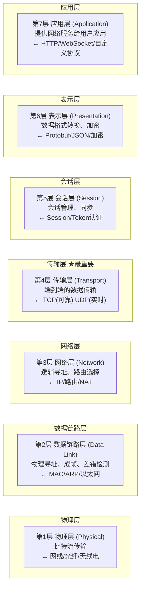

**记忆口诀**：从下往上 — **"物数网传会表应"**（物理层→数据链路层→网络层→传输层→会话层→表示层→应用层）

### 1.1.3 TCP/IP四层模型（实际使用的标准）

TCP/IP 模型是互联网实际使用的模型，它把 OSI 的上三层合并为"应用层"，下两层合并为"网络接口层"：

```
OSI七层                    TCP/IP四层              游戏开发中的对应
───────────────────     ────────────────     ──────────────────────────
应用层                   ┐
表示层                   ├ 应用层            HTTP/HTTPS/WebSocket/自定义协议
会话层                   ┘                   Protobuf/JSON/MessagePack序列化
───────────────────     ────────────────     ──────────────────────────
传输层                   传输层              TCP(登录/支付) UDP(实时同步)
                                             可靠UDP(KCP/ENet)
───────────────────     ────────────────     ──────────────────────────
网络层                   网络层(网际层)       IP寻址、NAT穿透(P2P联机)
                                             ICMP(ping测延迟)
───────────────────     ────────────────     ──────────────────────────
数据链路层               ┐
物理层                   └ 网络接口层        局域网联机、WiFi/5G延迟特性
───────────────────     ────────────────     ──────────────────────────
```

### 1.1.4 数据在各层之间是怎么流动的？

这是最重要的图——**数据封装过程**：

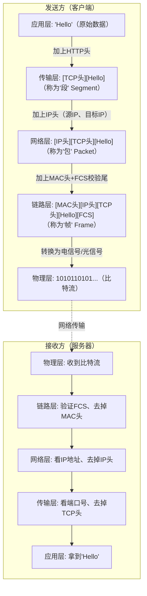

这个过程说明了分层的好处：**每一层只关心自己加的头和自己要处理的事**。传输层不关心IP地址怎么写，网络层不关心TCP做了什么可靠性保证。

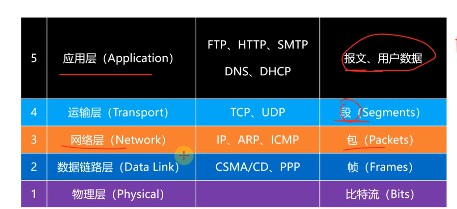

### 1.1.5 面试标准答案

> **问：说一下OSI七层模型？**

**标准回答**：
"OSI七层从下到上分别是物理层、数据链路层、网络层、传输层、会话层、表示层、应用层。

- 物理层：定义物理接口标准，传输比特流，比如网线、光纤
- 数据链路层：负责相邻节点间的可靠传输，用MAC地址寻址，封装成帧
- 网络层：负责跨网络的路径选择和数据转发，用IP地址寻址，核心是路由
- 传输层：负责端到端（进程到进程）的可靠或不可靠传输，TCP和UDP在这一层
- 会话层：管理会话的建立和终止
- 表示层：数据格式转换，加密解密
- 应用层：提供网络服务给用户应用，HTTP、DNS、WebSocket都在这一层

实际互联网使用的是TCP/IP四层模型，把上三层合并为应用层，下两层合并为网络接口层。"

> **追问：TCP/IP四层和OSI七层有什么区别？**

**回答**：
"OSI是理论标准，先有模型后有协议；TCP/IP是实际标准，先有协议后总结的模型。
OSI分七层，更细致，适合教学；TCP/IP分四层，更贴近实际实现。
对我们游戏开发来说，TCP/IP模型更实用——我们关注应用层（自定义协议）、传输层（TCP/UDP选择）、网络层（NAT穿透）。"

---

### 1.1.6 为什么游戏客户端需要理解分层？

- **协议设计**：设计帧同步协议时，你要决定协议跑在UDP之上（跳过TCP和HTTP），直接在应用层处理可靠性。不理解分层，你就不知道为什么这样做。
- **性能理解**：每一层都有头部开销：
  ```
  以太网帧头 14字节 + IP头 20字节 + TCP头 20字节 = 至少54字节开销
  如果你的游戏消息体只有10字节，那么实际带宽利用率只有 10/(54+10) ≈ 15%！
  这就是为什么游戏中要尽量减少小包数量。
  ```
- **问题排查**：游戏延迟高，你要能判断问题在哪一层——是应用层逻辑慢（代码问题）？TCP拥塞控制导致（传输层）？还是WiFi信号差（物理层）？

### 1.1.7 在Unity中的应用

Unity的网络API按照分层原则设计。理解分层有助于你选用正确的API：

| 你需要的功能 | Unity API | 工作在哪层 |
|------------|-----------|-----------|
| 发HTTP请求（登录、下载资源） | `UnityWebRequest` | 应用层 |
| TCP/UDP直接通信（自定义协议） | `NetworkDriver`（Unity Transport） | 传输层 |
| P2P/NAT穿透 | `Unity Relay` | 网络层（辅助） |
| WebSocket通信（H5游戏） | `NativeWebSocket` | 应用层 |

**Unity Transport Package** 是什么？

它是 Unity 自 2021 年推出的新一代底层网络库（替代旧的 UNET LLAPI）。你可以把它理解为一个**跨平台的传输层封装**。它：

1. 封装了操作系统底层的 Socket（Berkeley Socket），让你不用写 `send()`/`recv()` 这些 C 语言 API
2. 默认基于 UDP，但在 UTP 之上可以建立"可靠管道"（Reliable Pipeline）
3. 支持 Job System + Burst 编译器加速（高性能）
4. 是 Netcode for GameObjects（NGO）的底层传输

**当你使用 UnityWebRequest 时**，你工作在应用层：
```csharp
// UnityWebRequest 封装了 HTTP 协议（应用层）
// 底层自动处理 TCP 连接、TLS 加密等
using (UnityWebRequest www = UnityWebRequest.Get("https://game-api.com/rank"))
{
    await www.SendWebRequest();  // 底层走了完整的 TCP三次握手 + TLS握手 + HTTP请求
    Debug.Log(www.downloadHandler.text);
}
```

**当你使用 NetworkDriver 时**，你直接工作在传输层：
```csharp
// NetworkDriver 让你直接操作传输层
// 你需要自己决定：用UDP还是基于UDP的可靠管道
var driver = NetworkDriver.Create(new NetworkSettings());
var endpoint = NetworkEndpoint.Parse("192.168.1.100", 7777);
// 这里没有HTTP！你需要自己定义消息格式
driver.BeginSend(connection, out var writer);
writer.WriteBytes(messageData);  // 直接写二进制数据
driver.EndSend(writer);
```

### 1.1.8 在Unreal中的应用

UE 的网络架构天然就是分层的。从底层到上层：

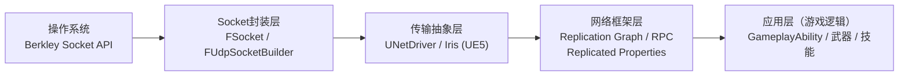

**UE 做 HTTP 请求**（应用层）：
```cpp
// 这和 UnityWebRequest 类似，但你必须手动创建和管理
TSharedRef<IHttpRequest, ESPMode::ThreadSafe> Request = 
    FHttpModule::Get().CreateRequest();
Request->SetURL("https://api.game.com/login");
Request->SetVerb("POST");
Request->SetHeader("Content-Type", "application/json");
Request->SetContentAsString(JsonString);
Request->OnProcessRequestComplete().BindLambda(
    [](FHttpRequestPtr Req, FHttpResponsePtr Resp, bool bSuccess)
    {
        if (bSuccess && Resp.IsValid())
        {
            UE_LOG(LogTemp, Log, TEXT("Response: %s"), *Resp->GetContentAsString());
        }
    }
);
Request->ProcessRequest();  // 底层自动走 TCP + TLS + HTTP
```

**UE 做底层 Socket 通信**（传输层）：
```cpp
// 这是直接操作传输层，相当于 Unity 的 NetworkDriver
FUdpSocketBuilder SocketBuilder(TEXT("GameSocket"));
SocketBuilder.BoundToPort(7777);
FSocket* UdpSocket = SocketBuilder.Build();

// 发送数据——没有HTTP头，没有JSON，纯二进制
int32 BytesSent = 0;
UdpSocket->SendTo(Data, DataSize, BytesSent, *RemoteAddress);
```

### 1.1.9 面试速记

> **"游戏为什么通常不用 HTTP 做实时通信？"**

这是非常常见的面试题。答案分三层：

**第一层（直接原因）**：HTTP 基于 TCP，TCP 有队头阻塞、拥塞控制等问题，延迟不稳定。HTTP 本身是"请求-响应"模式，服务器无法主动推送数据给客户端。

**第二层（深度原因）**：HTTP 的头部开销太大——每次请求至少几百字节的头（Cookie、User-Agent 等），而游戏实时数据通常只有几十字节的位置/输入信息，Header 比 Body 还大，极度浪费带宽。

**第三层（架构原因）**：HTTP 的设计目标是"文档传输"（获取网页），不是"实时状态同步"。游戏需要的是一秒内几十分次的、低延迟的状态同步，这根本不是 HTTP 的设计场景。

**但也有例外**：
- 登录、支付、排行榜 → 适合 HTTP（非实时、可靠性要求高）
- H5 游戏 → WebSocket（基于 HTTP 升级，但升级后就脱离了 HTTP 的请求-响应模式）
- 资源下载/热更新 → HTTP/HTTPS（支持断点续传、CDN 分发）

> "那 HTTP/3 呢？它基于 QUIC（UDP），是不是就适合游戏了？"

HTTP/3 确实解决了 TCP 层队头阻塞的问题，但：
1. HTTP/3 仍然是"请求-响应"模式（虽然有多路复用），不是为实时状态同步设计的
2. HTTP/3 目前还没有大规模部署，浏览器支持不完整
3. 游戏引擎（Unity Transport、UE UNetDriver）已经为实时同步做了专门优化，直接用引擎方案更合适

---

## 1.2 MAC地址 — 局域网内的"身份证"

**重要程度**：★★☆☆☆ 了解即可

**原因**：游戏客户端开发中很少直接操作 MAC 地址。但理解 MAC 地址有助于理解 ARP 协议，而 ARP 在局域网联机调试中会用到。

### 1.2.1 什么是MAC地址？

- **全称**：Media Access Control Address（介质访问控制地址）
- **本质**：每个网卡（NIC）出厂时固化的全球唯一标识，6 字节（48 bit）
- **格式**：前 3 字节是厂商编号（OUI，由 IEEE 分配），后 3 字节是厂商自分配
- **表示方式**：
  - Windows：`20-89-84-41-88-09`
  - Linux/Mac/Android：`20:89:84:41:88:09`
  - Cisco设备：`2089.8441.8809`

### 1.2.2 MAC地址的作用

MAC 地址用于**同一局域网内**的通信。当两台计算机在同一网段时，它们通过 MAC 地址直接通信，不需要路由器。

```
局域网内通信：
  计算机A 想知道 计算机B 的 MAC 地址 → 发 ARP 广播询问
    → "谁有 IP 192.168.1.20？告诉我你的 MAC 地址"
    → 计算机B 回复 "是我！我的 MAC 是 aa:bb:cc:dd:ee:ff"
    → 计算机A 缓存这个映射（ARP缓存，通常2分钟过期）
    → 之后就可以直接发以太网帧给这个 MAC 地址了
```

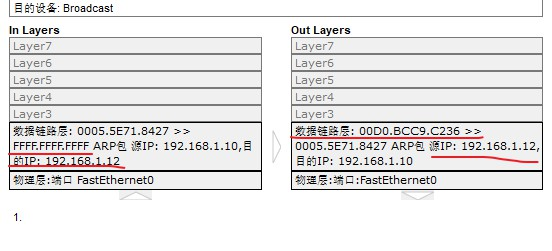

### 1.2.3 和游戏开发的关系

- **局域网发现**：Switch/PS5 的本地联机功能，通过局域网广播发现其他玩家
- **ARP 缓存**：理解为什么第一次 ping 不通（ARP 查询延迟），之后就可以
- **移动端**：手机切换 WiFi/4G 时 MAC 地址会变（现在还有 MAC 随机化），不影响游戏（游戏用 IP+端口做会话标识）

---

## 1.3 IP地址与子网掩码 — 互联网的"门牌号"

**重要程度**：★★☆☆☆ 了解即可

**原因**：IP 的基本概念必须懂，但详细的子网划分计算（等长子网、变长子网、超网合并）是网络工程师的工作，游戏客户端面试几乎不会考。

### 1.3.1 什么是IP地址？

- **全称**：Internet Protocol Address
- **本质**：32 bit（IPv4）或 128 bit（IPv6）的二进制数，用来在互联网中唯一标识一台主机。注意，IP 地址是**逻辑地址**（可以改变），不像 MAC 地址是**物理地址**（固化在硬件中）
- **目前主流**：IPv4，但地址已耗尽（2019年11月），IPv6 正在推广

### 1.3.2 IP地址的两部分

每个 IP 地址分为**网络ID** + **主机ID**：

```
例如：192.168.1.10 / 255.255.255.0

  192.168.1   .10
  └───┬───┘   └┬┘
  网络ID      主机ID

意思是：在 192.168.1.0 这个网段中，编号为 10 的主机
```

### 1.3.3 子网掩码的作用

子网掩码（Subnet Mask）就是告诉你 IP 地址中哪部分是网络ID，哪部分是主机ID。

```
子网掩码中连续为1的位 → 对应IP的网络部分
子网掩码中连续为0的位 → 对应IP的主机部分

255.255.255.0 = 11111111.11111111.11111111.00000000
                 └──── 24位全是1 ────┘ └─ 8位全是0 ─┘
                 = /24（CIDR表示法）

IP:   192.168.1.10  = 11000000.10101000.00000001.00001010
掩码: 255.255.255.0 = 11111111.11111111.11111111.00000000
与运算:              11000000.10101000.00000001.00000000
                   = 192.168.1.0  ← 这就是网段地址
```

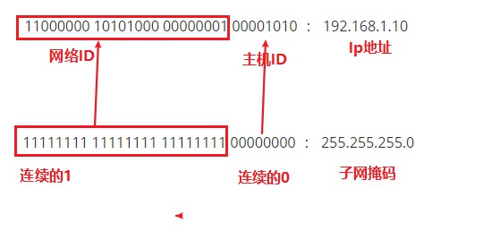

### 1.3.4 计算主机能用的IP数量

以 `192.168.1.0/24` 为例：
- 主机位有 8 位，总共 2⁸ = 256 个地址
- 减去 2 个不能用：
  - 主机位全 0（`192.168.1.0`）= 网段地址（代表这个网）
  - 主机位全 1（`192.168.1.255`）= 广播地址（发给这个网段所有主机）
- 可用地址：**256 - 2 = 254 个**，范围 `192.168.1.1 ~ 192.168.1.254`

### 1.3.5 私网地址（非常重要！）

由于全球 IPv4 已耗尽，大部分设备实际使用的是**私网地址**（不能在公网路由）。

| 类别 | 私网地址范围 | 数量 |
|------|------------|------|
| A类 | `10.0.0.0/8` | 一个A类网段 |
| B类 | `172.16.0.0/16 ~ 172.31.0.0/16` | 16个B类网段 |
| C类 | `192.168.0.0/24 ~ 192.168.255.0/24` | 256个C类网段 |

**你家 WiFi 路由器分配的 `192.168.x.x` 就是私网地址！** 你家里的所有设备共享一个公网 IP（通过 NAT 转换）上网。

### 1.3.6 面试标准答案

> **问：公网IP和私网IP有什么区别？**

**回答**：
"公网IP由Inter NIC统一分配，全球唯一，可以在互联网上直接路由。
私网IP是保留给局域网使用的，不能在公网中路由，需要通过NAT转换成公网IP才能上网。

游戏开发中的意义：如果两个玩家各自在家的局域网内，它们的私网IP不能直接用于通信。要让它们联机，需要通过服务器中转（Client-Server模式）或NAT穿透（P2P模式）。Unity Relay和Unreal的EOS P2P都是解决这个问题的。"

---

## 1.4 NAT — 网络地址转换（重点理解！）

**重要程度**：★★★☆☆ 建议掌握

**原因**：游戏P2P联机涉及NAT穿透，不理解NAT就无法理解Unity Relay和Unreal P2P的存在意义。

### 1.4.1 NAT解决了什么问题？

**问题**：全球 IPv4 地址不够用，每个设备分配一个公网 IP 不现实。
**解决**：多台设备共用一个公网 IP，通过 NAT 路由器做地址转换。

### 1.4.2 NAT 的工作原理

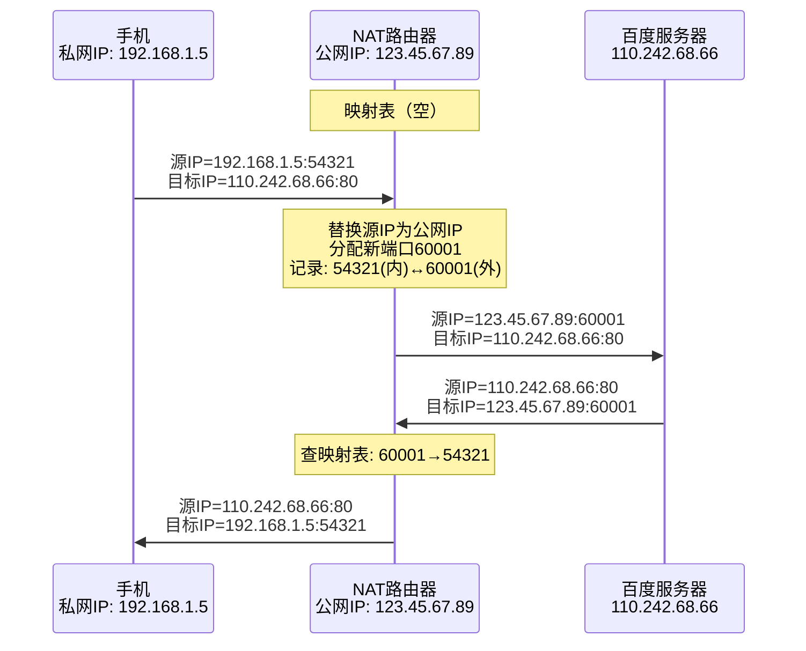

**关键理解**：NAT 路由器维护了一张**映射表**。从外部主动发起的连接因为没有映射记录，会被路由器直接丢弃。这就是为什么两个私网设备无法直接通信。

### 1.4.3 对游戏联机的影响

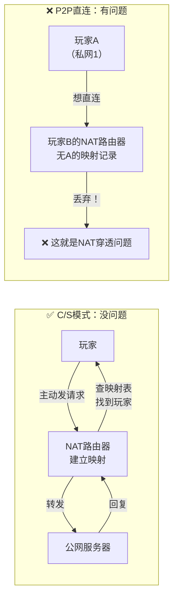

### 1.4.4 解决方案

**方案1：中继服务器（最可靠）** — Unity Relay、EOS P2P Relay 都这样做。缺点是额外延迟和服务器成本。

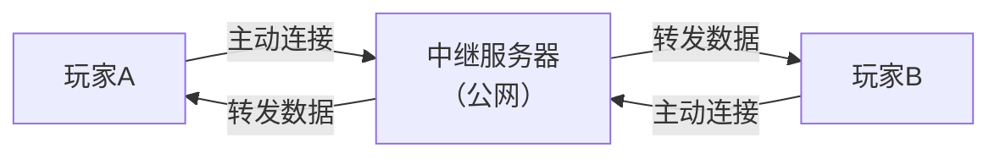

**方案2：NAT穿透（STUN/TURN/ICE）**
```
STUN：帮客户端发现自己被NAT映射后的公网IP和端口
TURN：当P2P打不通时，作为中继转发数据
ICE：综合框架，收集所有可能的连接方式，自动选最优的
→ WebRTC 使用的就是这套方案
```

**方案3：端口转发/UPnP**
```
用户手动在路由器上配置端口转发规则
或者程序通过UPnP协议自动请求路由器开放端口
→ 控制台游戏（Xbox/PS/Switch）常用UPnP
```

### 1.4.5 面试标准答案

> **问：为什么两个在不同家里的玩家不能直接用IP直连？**

**回答**：
"因为两个玩家都在各自家庭的NAT路由器后面，使用的是私网IP地址（如192.168.x.x）。当玩家A尝试向玩家B的公网IP发数据时，数据包到达B的路由器，但B的路由器上没有对应的NAT映射记录（因为B没有主动联系过A），所以数据包会被丢弃。

解决方法有三种：
1. 使用中继服务器（双方主动连服务器，服务器转发）
2. NAT穿透（STUN/TURN/ICE方案）
3. UPnP自动端口映射

Unity的Relay Service和Epic的EOS P2P都提供了中继+NAT穿透的方案。"

---

## 1.5 【标记删除区】以下内容游戏客户端低优先级

| 内容 | 标记原因 |
|------|---------|
| 子网划分计算（等长/变长/超网） | 网络工程师的工作 |
| 物理层信号传输（模拟信号/数字信号/曼彻斯特编码） | 通信工程内容 |
| CSMA/CD 协议 | 历史协议，已被交换机淘汰 |
| PPP 协议（点对点协议） | 路由器之间的协议 |
| 以太网帧格式细节（Ethernet V2 / IEEE 802.3） | 不需要知道帧的每个字段 |
| IP首部的每个字段详解（标识、片偏移、标志位） | 了解MTU概念即可 |
| 静态路由/动态路由配置 | 网络工程师的工作 |

> 以上内容已从原笔记中识别并移除，保留了能在游戏开发中用到的核心概念。

---

# 第2章 传输层 — TCP与UDP深度对比

> 这是**整个网络八股的重中之重**。游戏客户端面试中，对 TCP/UDP 的理解深度直接决定你的水平档次。
> 本章会详细对比两个协议，并给出所有常见面试题的完整答案。

---

## 2.1 TCP vs UDP — 游戏网络选型的底层逻辑

**重要程度**：★★★★★ 必须掌握

**原因**：这是游戏客户端面试**最核心**的网络问题。几乎所有游戏公司都会问"为什么你的游戏用UDP而不是TCP？"你对这个问题的回答深度，决定了面试官对你网络功底的评价。

### 2.1.1 先搞清楚：这两个协议是干什么的？

想象你要给朋友寄快递。有两种快递服务：

- **TCP** = 顺丰快递。每个包裹都有追踪号，丢了会重发，按顺序送达，收件人必须签收。但贵，而且路上堵车时会减速。
- **UDP** = 往信箱里塞明信片。塞进去就完事了，不保证对方收到，不保证顺序，但非常快、非常灵活。

游戏实时通信（位置同步、射击判定）需要 "尽可能快的明信片"；但登录/支付需要 "保证送达的快递"。

### 2.1.2 快速对比表

| 维度 | TCP | UDP |
|------|-----|-----|
| **连接** | 面向连接（先三次握手建立连接） | 无连接（直接发数据，不需要建立连接） |
| **可靠性** | 可靠（确认+重传+校验，保证送达） | 不可靠（尽力交付，丢了就丢了） |
| **顺序** | 保证有序（字节流严格有序） | 不保证有序（后发的包可能先到） |
| **首部开销** | 20~60 字节 | 8 字节 |
| **流量控制** | 有（滑动窗口，防止发送太快） | 无 |
| **拥塞控制** | 有（慢启动+拥塞避免+快重传+快恢复） | 无 |
| **速度** | 相对慢（因上述控制机制） | 相对快（无控制，直发） |
| **适用场景** | 文件传输、网页、邮件、登录、支付 | 音视频通话、直播、游戏核心同步 |
| **游戏中的用途** | 登录验证、支付回调、排行榜、资源下载 | 位置同步、技能释放、射击、帧同步指令 |
| **一句话总结** | 我要保证数据完整到达 | 我要尽可能低的延迟 |

### 2.1.3 深入理解：TCP 为什么不适合实时游戏？

这是面试中**区分初级和高级候选人的关键问题**。初级回答 "TCP 慢"，高级回答会从三个层面分析：

**层面一：队头阻塞（Head-of-Line Blocking）—— 最致命的问题**

```
发送方连续发送：包1、包2、包3、包4
             包2在传输中丢失了
接收方收到：  包1 ✓、包4 ✓、包3 ✓
但 TCP 不会把包3、包4交给应用层！
TCP 会一直等到包2重传到达，然后按顺序交付：1→2→3→4

对游戏的影响：
  包2 = 1秒前的旧位置（已经过时了）
  包3 = 最新的位置更新
  包4 = 最新的技能状态
→ 因为包2没到，包3和包4被卡住，玩家看到的是1秒前的状态！
→ 这就是"队头阻塞"——一个丢包阻塞了后面所有数据
```

**层面二：拥塞控制策略对游戏过于激进**

```
TCP 的核心假设：丢包 = 网络拥塞 → 必须降低发送速率

实际情况：
  有线网络丢包 ≈ 拥塞（TCP 的假设基本正确）
  无线/移动网络丢包 ≈ 信号干扰（TCP 的假设完全错误！）

当玩手机游戏（4G/5G/WiFi）时：
  信号波动导致偶然丢包 → TCP 认为拥塞了
  → 拥塞窗口减半 → 发送速率骤降
  → 游戏延迟突然飙升 → 玩家感觉卡顿
  → 但实际网络带宽完全足够，只是偶然丢了一个包！
```

**层面三：重传策略对过期数据无效**

```
TCP 的重传超时（RTO）通常从 200ms 起步

场景：你在 FPS 中移动，客户端每 33ms（30fps）发一次位置
  包在第 10 帧丢了
  TCP 要等 200ms 才重传
  200ms 后已经过了 6 帧了
  重传到达的包是 200ms 前的位置——已经完全没用了！

游戏需要的是：
  "这个包丢了？无所谓，下一个包带了更新的位置"
  而不是
  "我一定要把那个过时的位置重传过来"
```

**什么时候用 TCP？**
- 登录/注册：数据完整性比延迟重要 100 倍
- 支付/内购：交易数据一个字都不能错
- 资源下载：需要完整的文件，支持断点续传
- 聊天消息：玩家发的话不能丢也不能乱序

### 2.1.4 为什么游戏需要自定义 "可靠UDP"

**核心思想**：不是"UDP 完全不可靠"，而是 **"在应用层自己决定哪些数据需要可靠"**。

在游戏自定义协议中，每条消息可以单独标记：

| 消息类型 | 可靠？ | 有序？ | 原因 |
|---------|--------|--------|------|
| 玩家位置更新 | ❌ | ❌ | 高频发送（30次/秒），丢了下一帧覆盖，没必要重传 |
| 技能释放指令 | ✅ | ✅ | 必须保证服务器收到，而且必须在位置更新之前处理 |
| 聊天消息 | ✅ | ✅ | 不能丢也不能乱序 |
| 子弹命中事件 | ✅ | ❌ | 必须送达，但到达顺序无所谓（因为每个命中事件是独立的） |
| 特效播放指令 | ❌ | ❌ | 丢了不影响游戏逻辑，少看到一个特效无所谓 |

这就是 TCP 做不到的灵活性——TCP 是"全部可靠+全局有序"，不能选择。

### 2.1.5 面试完整答案模板

> **问："说一下 TCP 和 UDP 的区别？游戏中什么时候用 TCP，什么时候用 UDP？"**

**标准回答框架**：

"TCP 是面向连接的、可靠的、保证有序的传输协议，通过三次握手建立连接，通过确认+重传+滑动窗口保证可靠性，通过拥塞控制适应网络状况。UDP 是无连接的、不可靠的、不保证有序的传输协议，首部只有 8 字节，直接发送，没有拥塞控制。

在游戏开发中：
- 登录、支付、资源下载等需要数据完整性的场景，用 TCP（或基于TCP的HTTP/HTTPS）
- 核心战斗中的位置同步、技能释放、帧同步指令等对延迟敏感的场景，用 UDP
- 实际项目中，我们通常在 UDP 之上实现一个可选可靠层（如 KCP 协议），根据消息类型决定是否需要可靠传输。这样既有 UDP 的低延迟优势，又有选择性可靠的灵活性

TCP 不适合实时游戏的核心原因有三点：
1. 队头阻塞——一个丢包阻塞后续所有数据
2. 拥塞控制过于激进——无线网络丢包被误判为拥塞，导致发送速率骤降
3. 重传策略对过期数据无效——200ms 后重传来的旧位置已经没有意义了"

### 2.1.6 容易踩的坑

- ❌ **"UDP 比 TCP 快"** —— 不严谨！UDP 不比 TCP "快"，只是没有拥塞控制、没有队头阻塞、没有重传延迟。如果网络环境完美（0丢包），UDP 和 TCP 的延迟差不多
- ❌ **"游戏全部用 UDP"** —— 登录/支付/下载还是要用 TCP/HTTP
- ❌ **"UDP 就是不可靠版 TCP"** —— 忽略了 UDP 的核心价值：**应用层可控性**。你可以自己决定哪些数据需要可靠
- ❌ **把端口号的概念和协议关联** —— 端口号是传输层的概念（用于区分同一台主机上不同的应用进程），TCP 和 UDP 都有端口号，它们是各自独立的（TCP 80 端口和 UDP 80 端口是不同的端口）

---

## 2.2 TCP三次握手 — 面试必考的经典

**重要程度**：★★★★★ 必须掌握

**原因**：面试 100% 会考。你需要能画出时序图，并解释"为什么是三次"。

### 2.2.1 三次握手过程（图文详解）

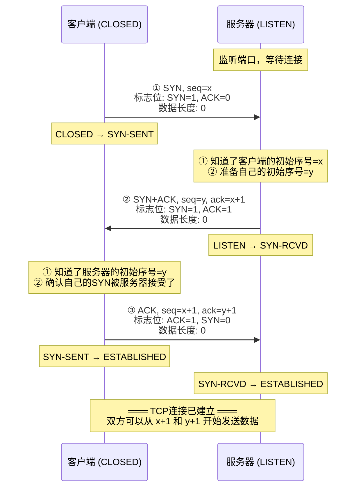

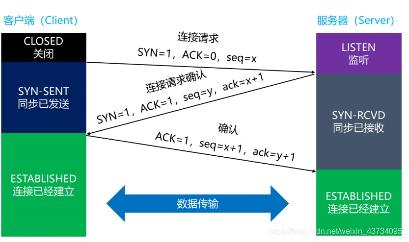

### 2.2.2 三次握手 — 完整过程串讲

> 以下是把整个过程从头到尾串联起来的讲法，面试时可以按这个逻辑一口气说下来。

客户端一开始处于 CLOSED 状态，服务器处于 LISTEN 状态，在某一个端口上等待连接。

**第一次握手**：客户端主动发起。它构造一个 TCP 报文，把标志位 SYN 置为 1、ACK 置为 0，意思是"这是一个建立连接的请求，我没有要确认的东西"。同时在这个报文的序号字段里填上一个随机生成的初始序号 x——这个序号是客户端单方面选的，将来客户端发给服务器的第一个数据字节就从 x+1 开始编号。这个报文的数据部分长度为 0，因为连接还没建立，没有应用层数据要传。发完之后，客户端从 CLOSED 进入 SYN-SENT 状态，意思是"我已经发出了 SYN，正在等待服务器确认"。

**第二次握手**：服务器收到这个 SYN 报文。它从报文中知道了两件事：第一，有客户端想跟我建立连接；第二，客户端那边字节编号从 x 开始。服务器也生成一个自己的随机初始序号 y，然后构造一个回应的报文：标志位 SYN=1、ACK=1——SYN=1 表示"我也要跟你建立连接"，ACK=1 表示"我确认收到了你的请求"。这个报文的序号字段填 y（服务器的初始序号），确认号字段填 x+1——确认号 x+1 的含义是"你发给我的数据，x 之前的我都收到了，我期待你下次从第 x+1 个字节开始发"。因为客户端发的 SYN 报文数据部分是 0 字节，所以确认号 = x + 0 + 1 = x+1。发完之后，服务器从 LISTEN 进入 SYN-RCVD 状态。

**第三次握手**：客户端收到 SYN+ACK。它检查确认号是不是自己期待的——确认号是 x+1，说明服务器确实收到了自己的 SYN。然后客户端再发一个 ACK 报文：SYN=0（不需要再请求建立连接了），ACK=1，序号填 x+1（因为上次发的 SYN 报文数据长度是 0，所以这次序号只加了 1），确认号填 y+1（告诉服务器"你发的数据，y 之前的我都收到了，期待你从 y+1 开始发"）。发完之后，客户端进入 ESTABLISHED 状态。服务器收到这个 ACK 后也进入 ESTABLISHED 状态。

此时双方都进入了 ESTABLISHED，连接正式建立。后续通信中，客户端发的数据从序号 x+1 开始编号，服务器发的数据从序号 y+1 开始编号。

**三个关键细节**：

1. 三次握手的前两次，SYN 标志位都是 1，所以很容易抓包识别——凡是 SYN=1 的包就是握手包
2. 三次握手的报文数据长度都是 0，只有 TCP 首部，没有数据部分。TCP 首部通常 32 字节（固定 20 + 选项 12），选项里携带了 MSS、Window Scale、SACK-Permitted 等协商参数
3. 序号和确认号的关系：确认号 = 对方上次的序号 + 对方上次发的数据长度 + 1。因为握手报文数据长度为 0，所以确认号只加 1

先看一张简化的 TCP 首部：

```
 0                   15                  31
+--------------------+--------------------+
|      Source Port   |   Destination Port |
+--------------------+--------------------+
|                Sequence Number          | ← seq
+-----------------------------------------+
|             Acknowledgment Number       | ← ack
+----+------+-----------------------------+
|Hdr |Flags |        Window               |
|Len |      |                             |
+----+------+-----------------------------+

Flags里面：

URG ACK PSH RST SYN FIN
```

其中你问的 **SYN、ACK、seq、ack** 都在这里。

------

# ① SYN 是什么？

SYN 全称：

> **Synchronize Sequence Numbers**
>
> **同步序列号**

很多人翻译成：

> **同步位**

它其实不是"同步数据"，而是：

> **"我要和你同步双方的初始序号（ISN）"**

它只是 TCP Header 里面的**一个标志位（Flag）**。

只有：

```
0

或者

1
```

例如：

```
SYN=1
```

意思就是：

> **我想建立 TCP 连接。**

所以：

第一次握手：

```
SYN = 1
ACK = 0
```

就是：

> 我想和你建立连接。

------

# ② ACK 是什么？

ACK 全称：

> **Acknowledgment**

翻译：

> **确认**

它也是一个 Flag。

例如：

```
ACK = 1
```

表示：

> **Acknowledgment Number 字段有效。**

注意：

很多人会把：

```
ACK
```

和：

```
ack
```

混了。

其实：

```
ACK
```

（大写）

是：

**标志位（Flag）**

而：

```
ack

(Acknowledgment Number)
```

是：

**确认号字段。**

例如：

```
ACK = 1
```

意思：

```
请看我的 ack 字段。
```

例如：

```
ack = 101
```

意思：

```
我已经收到了100以前的数据。

下一次请从101开始发。
```

------

# ③ seq 是什么？

seq：

全称：

> **Sequence Number**

翻译：

> **序号**

这个非常重要。

TCP：

不是：

```
包编号
```

而是：

```
字节编号。
```

例如：

发送：

```
Hello
5 Bytes
```

如果：

```
seq = 100
```

那么：

意思就是：

```
H

↓

100

e

↓

101

l

↓

102

l

↓

103

o

↓

104
```

每一个字节：

都有编号。

所以：

服务器到以后回复：

```
ack = 105
```

意思：

```
100~104

都收到了。

请继续发105。
```

------

# ④ 为什么 SYN 会占一个序号？

这是面试特别喜欢问的。

例如：

第一次：

```
seq = 100
SYN = 1
```

虽然没有数据。

但是服务器回复：

```
ack = 101
```

为什么？

因为：

TCP：

规定：

> **SYN 本身也要占用一个序号。**

所以：

以后：

真正的数据：

从：

```
101
```

开始。

同样FIN也会占一个序号。

------

# ⑤ ack 为什么总是 x+1？

因为：

公式：

```
ack

=

对方seq

+

数据长度

+

(SYN或FIN占一个序号)
```

例如：

第一次：

```
SYN

seq =100

长度=0
```

所以：

```
ack

=

100

+

0

+

1

=

101
```

如果：

发送：

```
100 Bytes
```

那么：

```
seq=101
```

服务器：

收到：

回复：

```
ack

=

101

+

100

=

201
```

所以：

ack：

永远表示：

> **下一次希望收到哪个字节。**

不是：

最后收到哪个。

------

# ⑥ SYN-RCVD 怎么念？

这个很多老师不会讲。

它其实就是：

```
SYN

Received
```

缩写。

读：

```
/sɪn rɪˈsiːvd/
```

中文：

> **辛（sin）·瑞西夫德**

一般面试：

直接说：

> **SYN Received 状态**

没人会要求读缩写。

------

TCP 状态：

```
LISTEN

↓

SYN-SENT

↓

SYN-RCVD

↓

ESTABLISHED
```

读法：

```
Listen

/listən/
```

监听。

------

```
SYN Sent

/sɪn sent/
```

SYN 已发送。

------

```
SYN Received

/sɪn rɪˈsiːvd/
```

收到 SYN。

------

```
Established

/ɪˈstæblɪʃt/
```

连接建立。

------

# ⑦ MSS 是什么？（你文里不是 MTT，应该是 MSS）

你最后写的：

> **MTT**

这里应该是：

> **MSS（Maximum Segment Size）**

不是MTT。

MSS全称：

> **Maximum Segment Size**

翻译：

> **最大报文段长度。**

例如：

网卡MTU：

```
1500 Bytes
```

IP Header：

```
20 Bytes
```

TCP Header：

```
20 Bytes
```

那么：

```
1500

-

20

-

20

=

1460 Bytes
```

所以MSS通常：

```
1460 Bytes
```

意思：

> **TCP 一次最多发送1460字节数据。**

------

很多人容易混：

## MTU

```
Maximum Transmission Unit
```

网络层。

整个 IP 包：

最大：

```
1500
```

------

## MSS

```
Maximum Segment Size
```

TCP：

真正的数据：

```
1460
```

关系：

```
MTU

=

IP Header

+

TCP Header

+

MSS
```

通常：

```
1500

=

20

+

20

+

1460
```

------

# 面试最推荐的理解方式

不要把 TCP 想成"发包"，而要把它想成**两个人互相记账**。

假设你借我一本书。

我会说：

```
这是：

第100页开始。
```

（seq=100）

我看完：

100~199。

我回复：

```
收到。

下一次给我：

200开始。
```

（ack=200）

TCP 就是在不停地进行这样的"记账"。

- **seq**：我这次发的数据从哪里开始编号。
- **ack**：我希望你下一次从哪个编号开始发。
- **SYN**：我们先把双方的"账本起始页码"对齐。
- **ACK**：我已经收到你的内容，并告诉你我期待的下一个编号。

### 2.2.3 为什么是三次握手？（接续上面的逻辑）

理解了上面的过程，就能回答"为什么三次"：

**核心原因**：防止已经失效的连接请求报文突然又传到服务器，导致服务器建立无意义的连接。

客户端发的第一个 SYN 可能因为网络拥塞在某个路由器上卡了很久。客户端等不到回应，超时后重新发了一个 SYN，第二次成功了，双方正常通信完后关闭了连接。但此时，那个卡了很久的第一个 SYN 终于到达了服务器——服务器并不知道这是一个"过期"的连接请求。如果只握两次手，服务器回复 SYN+ACK 后就直接进入 ESTABLISHED，分配资源等待客户端发数据——但客户端早就忘了这个连接，永远不会发数据来，服务器的资源就白白浪费了。三次握手的关键在于：服务器收到 SYN 后不直接进入 ESTABLISHED，而是先进入 SYN-RCVD，等客户端再回一个 ACK。那个迟到的 SYN 引发的 SYN+ACK 到达客户端时，客户端会发现这不是自己期望的连接，不会回 ACK——服务器收不到第三次握手，超时后就释放资源了。

### 2.2.4 握手过程中协商了什么？

很多人只知道握手建立连接，不知道握手还协商了重要参数。在三次握手的 TCP 首部选项中：

| 参数 | 说明 | 为什么需要协商 |
|------|------|-------------|
| **MSS** (最大报文段长度) | 每个TCP段的数据部分最大值，理论最大1460字节 | 双方取最小值，兼容网络条件 |
| **Window Scale** (窗口缩放系数) | TCP首部的窗口字段只有2字节（最大65535），乘以这个系数才能表示更大的窗口 | 支持高速网络的大窗口 |
| **SACK-Permitted** (是否支持选择性确认) | 是否支持SACK（告诉对方具体哪些包丢了，只重传丢失的） | 提高重传效率 |

### 2.2.3 前两次握手的特点

- 前两次握手中 SYN=1（标志这是建立连接的报文）
- 数据部分长度都是 0（只有 TCP 首部）
- TCP 首部长度通常是 32 字节（固定 20 字节 + 选项 12 字节，存 MSS、Window Scale 等）

### 2.2.4 为什么是三次握手？（面试核心考点）

> **"为什么需要三次握手，两次不行吗？"**

**回答**：核心原因是**防止已失效的连接请求报文突然传到服务器**，导致服务器白白等待、浪费资源。

**场景推演 — 两次握手的问题**：

```
时序：
  t=0:    客户端发送SYN（连接请求1）
  t=100ms: SYN在网络中延迟了（没有到达服务器）
  t=200ms: 客户端超时，重新发送SYN（连接请求2）
  t=250ms: 连接请求2到达服务器
  t=260ms: 服务器回复SYN+ACK，建立连接（两次握手的话，服务器直接进入ESTABLISHED）
  t=300ms: 客户端收到SYN+ACK，连接建立，开始通信
  t=500ms: 通信完成，连接关闭
  t=2000ms: 连接请求1 终于到达服务器！！！（延迟了2秒）
  
  如果是两次握手：
  服务器收到这个迟到的SYN → 以为是一个新连接 → 回复SYN+ACK → 进入ESTABLISHED
  → 服务器一直等待客户端发送数据
  → 但客户端根本没发这个连接请求
  → 服务器资源白白消耗
```

**三次握手如何解决**：
服务器收到迟到的 SYN 后回复 SYN+ACK，但进入的是 SYN-RCVD 状态（不是 ESTABLISHED），等待客户端的第三次握手。客户端收到这个"来路不明"的 SYN+ACK 后，发现这不是自己请求的连接，不回复 ACK。服务器收不到 ACK → 超时 → 释放资源。

**一句话总结**：第三次握手让服务器确认"客户端是真的想建立连接，而且知道我同意建立连接了"。

### 2.2.5 常见追问

> **"第三次握手失败了怎么办？"**

服务器在 SYN-RCVD 状态等不到 ACK → 超时后重发 SYN+ACK → 如果多次重发仍失败 → 发送 RST 强制释放连接。

> **"SYN Flood 攻击是什么？"**

攻击者发送大量伪造源IP的 SYN 报文，服务器为每个 SYN 创建半连接（SYN-RCVD 状态），回复 SYN+ACK 后永远等不到 ACK。服务器连接队列被填满，正常用户无法连接。

**防御手段**：
- **SYN Cookie**：服务器收到 SYN 时不分配资源，而是将连接信息编码到 seq 序列号中返回。只有收到合法的 ACK 才真正分配资源
- 缩短 SYN 超时时间
- 增加最大半连接数

> **"三次握手能携带数据吗？"**

前两次握手**不能**携带数据（连接还没建立）。第三次握手的 ACK 报文**理论可以**携带数据（因为对客户端来说连接已建立），但实际上一般不这么做。

> **"第二次握手为什么 SYN 和 ACK 可以合并？"**

SYN 是服务器主动发送建立连接请求，ACK 是对客户端 SYN 的确认。TCP 的报文格式允许在一个报文中同时设置 SYN 和 ACK 标志位，所以可以合并。

### 2.2.6 游戏开发中的实际意义

- **RTT 估算**：三次握手需要 1.5 个 RTT。TCP三次握手（1.5 RTT）+ TLS握手（2 RTT）= 至少 3.5 个 RTT，如果 RTT=50ms，登录连接就需要 ~175ms。这就是为什么游戏登录会比一般网站慢
- **连接复用**：不要频繁建连/断连。登录时建立一次 TCP 长连接，后续复用
- **TIME_WAIT 问题**：频繁建连断连会产生大量 TIME_WAIT 状态，耗尽端口资源

---

## 2.3 TCP四次挥手 — 连接释放的"分手协议"

**重要程度**：★★★★★ 必须掌握

**原因**：和三次握手一样是必考题。游戏开发中处理断线/踢人时需要理解。

### 2.3.1 四次挥手过程

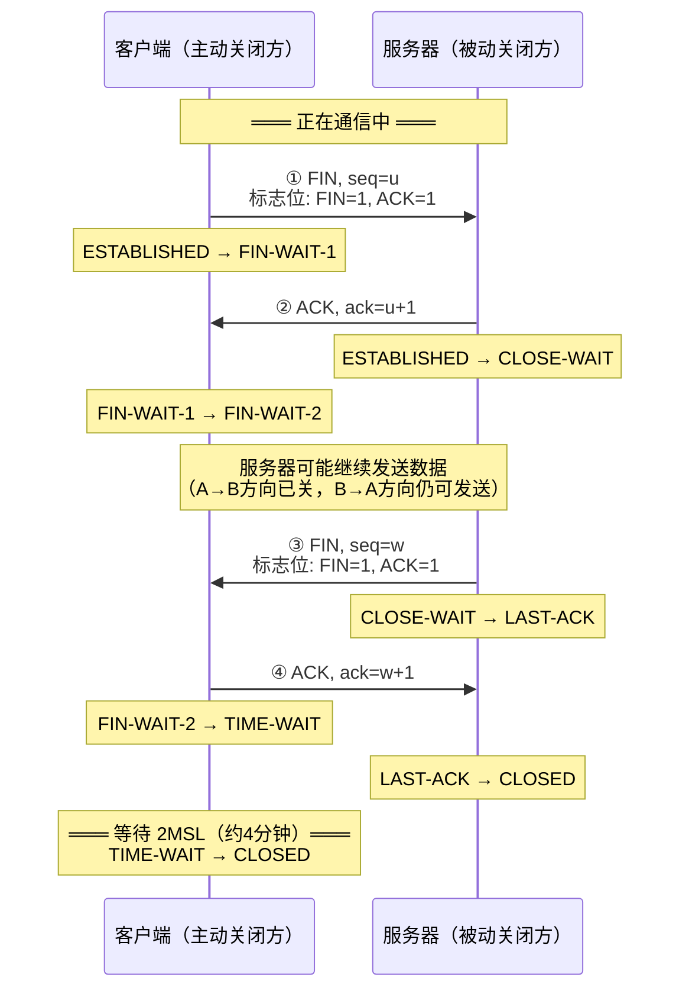

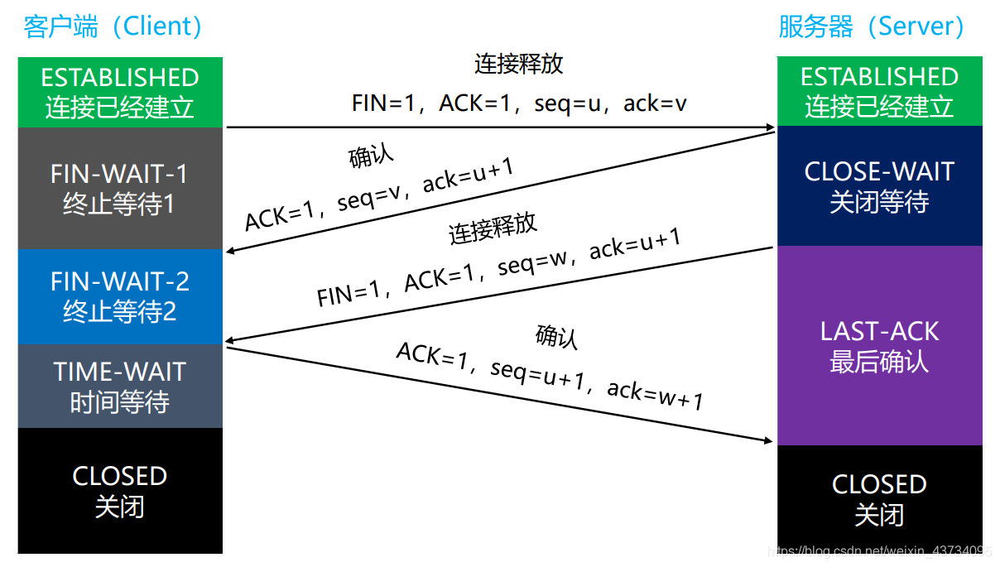

### 2.3.2 四次挥手 — 完整过程串讲

双方一开始都处于 ESTABLISHED 状态，TCP 连接在正常工作。现在假设客户端决定主动关闭连接。

**第一次挥手**：客户端构造一个 FIN 报文——标志位 FIN=1、ACK=1，序号设为客户端的当前发送序号 u。这个报文的意思是"我这边的数据已经全部发完了，我要关闭'客户端→服务器'这个方向"。发完之后，客户端从 ESTABLISHED 进入 FIN-WAIT-1 状态，意思是"我已经发出了 FIN，正在等待服务器确认"。注意此时客户端只是关闭了自己这一侧的发送通道，它仍然可以接收数据——"我嘴巴闭上了，但耳朵还在听"。

**第二次挥手**：服务器收到客户端的 FIN。它知道客户端不会再发数据了，但服务器自己可能还有数据要发给客户端。所以服务器先回复一个 ACK，确认号设为 u+1，意思是"你的 FIN 我收到了，u 之前的数据我也都收了"。发完之后服务器从 ESTABLISHED 进入 CLOSE-WAIT 状态，意思是"对端已经说要关了，我正在考虑自己还需不需要发数据"。客户端收到这个 ACK 后，从 FIN-WAIT-1 进入 FIN-WAIT-2 状态，意思变成了"服务器已经知道我这边要关了，我在等服务器那边也说关"。这个阶段，服务器还可以继续向客户端发送剩余的数据，客户端也仍然能接收——"我已经闭嘴了，但我还在等你说完"。

**第三次挥手**：服务器把自己要发的数据全部发完后，也构造一个 FIN 报文——标志位 FIN=1、ACK=1，序号设为服务器的当前发送序号 w。这个报文的意思是"我这边的数据也发完了，我也要关闭'服务器→客户端'这个方向"。发完之后，服务器从 CLOSE-WAIT 进入 LAST-ACK 状态，意思是"我已经发了 FIN，正在等客户端最终确认"。

**第四次挥手**：客户端收到服务器的 FIN。它知道服务器也要关闭了，于是回复最后一个 ACK，确认号设为 w+1。发完之后，客户端从 FIN-WAIT-2 进入 TIME-WAIT 状态——注意不是直接 CLOSED。客户端会在 TIME-WAIT 状态等待 2MSL（约 4 分钟），然后才真正进入 CLOSED。服务器收到这个 ACK 后直接进入 CLOSED。

**为什么要等 2MSL？** TIME-WAIT 存在两个目的：

第一，**确保最后一个 ACK 能被服务器收到**。如果第四个 ACK 在网络中丢失了，服务器收不到 ACK 就会重发第三次的 FIN。如果客户端已经 CLOSED 了，它就看不到这个重发的 FIN，也就不会再回复 ACK——服务器会永远卡在 LAST-ACK。而客户端在 TIME-WAIT 状态时，如果收到服务器重发的 FIN，会重新计时 2MSL 并重发 ACK，确保服务器顺利关闭。

第二，**让本次连接中所有在网络中滞留的报文消失**。2MSL 足够让任何一个方向上的报文要么到达目的地、要么被路由器丢弃。如果客户端立即用相同的 IP+端口建立新连接，上一个连接中延迟到达的旧数据包可能会被误认为是新连接的数据。等待 2MSL 确保这些"幽灵包"全部消散。

### 2.3.3 为什么是四次而不是三次？

TCP 是**全双工**的——两个方向的数据传输可以同时进行，需要分别关闭。

- ①+②：关闭"客户端→服务器"方向（客户端不再发数据，但还能收）
- ③+④：关闭"服务器→客户端"方向（服务器也不再发数据）

② 和 ③ 为什么不能合并？因为服务器收到 FIN 时，自己可能还有数据没发完。必须等发完数据，才能发自己的 FIN。如果服务器恰好没数据要发，② 和 ③ 就可以合并成一个 ACK+FIN 报文（实际抓包经常看到 3 次挥手）。

### 2.3.3 TIME-WAIT 状态详解（频繁被问）

**TIME-WAIT 出现在主动关闭方**，持续 2 × MSL（Maximum Segment Lifetime，报文最大生存时间），RFC 建议 MSL=2 分钟，所以 TIME-WAIT = 4 分钟。

**为什么需要 TIME_WAIT？**

原因一：**确保最后一个 ACK 能被服务器收到**
```
如果第④步的ACK在网络中丢失了：
  服务器等不到ACK → 重发FIN（第③步）
  客户端还在TIME-WAIT → 收到重发的FIN → 重发ACK
  客户端如果已经CLOSED了 → 收不到FIN → 服务器一直LAST-ACK → 资源无法释放
```

原因二：**让旧连接的残留报文在网络中消散**
```
如果客户端立即关闭并建立新连接（相同IP+端口）：
  旧连接中滞留的数据包可能在这个时刻到达
  → 被误认为是新连接的数据
  → 导致数据错乱
等待2MSL确保所有旧报文都消失
```

### 2.3.4 为什么游戏客户端需要理解四次挥手

- **异常断线检测**：玩家 Alt+F4 强退 → 客户端没有机会发 FIN → 服务器收不到 FIN → 只能靠心跳超时判断断线（见 2.7 节）
- **TIME-WAIT 导致端口占用**：游戏服务器重启时，如果旧的连接还在 TIME-WAIT，新进程 bind 相同端口会失败（`Address already in use`）。解决：设置 `SO_REUSEADDR` Socket 选项
- **CLOSE-WAIT 堆积**：服务器代码没正确调用 close()，导致大量 CLOSE-WAIT 连接，耗尽文件描述符（是代码 bug）

### 2.3.5 面试完整答案

> **"说一下四次挥手的过程？为什么是四次？"**

"TCP是全双工通信，每个方向需要独立关闭。
- 第一次：主动方发 FIN，表示我不再发数据了
- 第二次：被动方回复 ACK，表示知道了（此时被动方可能还有数据要发）
- 第三次：被动方发完数据后，也发 FIN
- 第四次：主动方回复 ACK，进入 TIME-WAIT，等待 2MSL 后关闭

之所以是四次因为第二次和第三次通常不能合并——被动方收到 FIN 后不一定立即发完数据。如果恰好没数据要发，会出现三次挥手（ACK+FIN 合并）。"

> **"TIME-WAIT 为什么等 2MSL？"**

"两个原因：
1. 确保最后一个 ACK 被对方收到——如果ACK丢了，对方会重发FIN，这边还在TIME-WAIT就能再发ACK
2. 确保旧连接的所有报文从网络中消失——防止旧连接的滞留报文混入新连接"

> **"服务器上有大量 CLOSE-WAIT 状态是什么问题？"**

"CLOSE-WAIT 是被动关闭方收到 FIN 后的状态，说明对方已经要关闭连接了，但本端还没有调用 close() 发 FIN。大量 CLOSE-WAIT 通常是代码 bug——比如在回调中忘记关闭 Socket，或者业务逻辑阻塞了关闭流程。"

---

## 2.4 TCP可靠传输的底层机制

**重要程度**：★★★★☆ 高频

**原因**：理解 TCP 怎么保证可靠性，才能理解自己实现可靠 UDP 时要怎么做（以及哪些 TCP 的做法不能照搬）。

---

### 2.4.0 TCP为什么可靠 — 九大机制全景

> 这是腾讯、网易、米哈游几乎必问的问题。
>
> 很多人的回答都是：**"TCP 有重传机制，所以可靠。"** — 这只能拿到 **30 分**。
>
> 真正面试希望你回答的是：**TCP 的可靠性不是靠某一个机制，而是多个机制共同保证的。**

#### 一句话总结

> **TCP 通过连接管理、序号机制、确认应答、超时重传、滑动窗口、流量控制、拥塞控制、校验和等机制，共同保证数据可靠、有序、不重复地传输。**

面试的时候可以按下面几个点展开。

#### ① 连接管理 — 三次握手

TCP 是**面向连接**的协议。发送数据之前，必须通过**三次握手**在 Client 和 Server 之间建立连接，确认双方都可以发送和接收数据。这样就不会出现"我发了，你根本没准备好"的情况。

> 详见 [2.2 TCP三次握手](#22-tcp三次握手--面试必考的经典)

#### ② Sequence Number（序列号）

这是 TCP **最重要的机制**。

发送数据时，TCP 不是给"包"编号，而是给**每一个字节**编号。比如发送 `"Hello"` 5 个字节，如果起始 seq=1，那么 H、e、l、l、o 分别对应 seq=1、2、3、4、5。

即使网络传输乱序——比如收到顺序是 2、5、1、3、4——接收方也能靠 seq 重新排列成 1、2、3、4、5。

> 所以 TCP 保证了**数据有序**。

#### ③ ACK（确认应答）

TCP 的确认不是回复"我收到了"，而是回复**"我已经收到哪里了，下一次请从这里开始发"**。

例如客户端发送 `seq=100`，服务器收到后回复 `ACK=101`，意思是"100 之前的数据我都收到了，期待你下次从 101 开始发"。

**关键公式**：`ACK = 对方 seq + 数据长度 + (SYN或FIN占1)`。这是一个"期待值"而非"已收值"。

#### ④ 超时重传（Retransmission）

如果发送了 `seq=100` 的数据，一直没收到对应的 ACK，等待一段时间（RTO，Retransmission Timeout）后，发送方认为**丢包了**，于是重新发送 `seq=100`。

这就是最基础的重传保障。

#### ⑤ 快速重传（Fast Retransmit）

不是所有重传都要死等超时。

例如连续发送 1、2、3、4、5，结果包 2 丢了。接收方收到 1、3、4、5，每次都回复 `ACK=2`（"我还在等 2"）。发送方**连续收到三个相同的 ACK**，立刻知道"包 2 丢了"，不用等超时，直接重发包 2。

> 超时重传是"我等不及了"，快速重传是"我根据证据判断你丢了"。

#### ⑥ 滑动窗口（Sliding Window）

如果发一个包就等一个 ACK，效率太低。TCP 允许一次发送**窗口大小**个包，不需要逐个等待。

例如窗口大小为 4，可以连续发送包 1、2、3、4，然后边收 ACK 边把窗口往前滑。这是 TCP 提高吞吐量的关键机制。

#### ⑦ 流量控制（Flow Control）

假设服务器处理不过来怎么办？服务器会在 ACK 中告诉客户端"我的接收窗口只有 1024 字节"，客户端就最多只发 1024 字节。

> **这是接收方控制发送方**，防止接收缓冲区被撑爆。

#### ⑧ 拥塞控制（Congestion Control）

流量控制保护的是**接收方**，拥塞控制保护的是**整个网络**。

当网络开始拥堵时，TCP 会自动降低发送速率。经典算法是：慢启动 → 拥塞避免 → 快速恢复。不会一直疯狂发包把网络堵死。

> 这也是"为什么游戏不用 TCP"的关键论据——拥塞控制把偶然的无线信号丢包误判为网络拥塞，导致发送速率骤降、延迟飙升。详见 [2.5 TCP拥塞控制](#25-tcp拥塞控制--为什么游戏不用tcp的关键)。

#### ⑨ 校验和（Checksum）

发送方在发送前计算 Checksum 并写入 TCP 首部。接收方收到后重新计算，如果不一致说明数据在传输中损坏，直接丢弃并等待重传。

> 所以 TCP 还能保证**数据正确性**。

#### 全景总结表

| 机制 | 作用 | 一句话 |
|------|------|--------|
| 三次握手 | 建立可靠连接 | 确认双方都能收发 |
| Sequence Number | 保证数据有序 | 每个字节都有编号，乱序可重排 |
| ACK | 确认收到数据 | "期待你下次从第N字节开始发" |
| 超时重传 | 丢包重发 | 等不到 ACK 就重发 |
| 快速重传 | 提前发现丢包 | 3 个重复 ACK → 不等超时，直接重传 |
| 滑动窗口 | 提高吞吐量 | 一次发多个，不等逐个确认 |
| 流量控制 | 防止接收方被压垮 | 接收方告知窗口大小，发送方限速 |
| 拥塞控制 | 防止网络拥塞 | 探测网络容量，自适应调整速率 |
| Checksum | 检测数据损坏 | 校验和不一致 → 丢弃等重传 |

#### 游戏开发视角：为什么游戏不用 TCP？

如果面试官追问：**"为什么游戏不用 TCP？"**

可以回答：

> TCP 的可靠性依赖于重传、排序和拥塞控制。这些机制虽然保证了数据可靠到达，但也会引入额外延迟。例如某个包丢失后，后续数据可能因为等待重传而被阻塞（Head-of-Line Blocking，队头阻塞）。实时游戏更关注时效性，因此角色移动、射击等高频同步通常采用 UDP，并在应用层自行实现确认、重传、序列号等机制；而登录、聊天、支付等必须可靠的业务更适合使用 TCP。

#### 一分钟面试回答模板

> **TCP 能保证可靠连接，不是依赖单一机制，而是多个机制共同作用。首先通过三次握手建立连接；利用序列号保证数据有序；通过 ACK 确认数据是否收到；如果没有收到 ACK，则通过超时重传或快速重传重新发送数据；滑动窗口提高传输效率；流量控制防止接收方缓冲区溢出；拥塞控制避免网络拥塞；最后通过 Checksum 校验数据完整性。因此 TCP 能保证数据可靠、有序且不重复地传输。**

---

### 2.4.1 ARQ — 自动重传请求（基础机制）

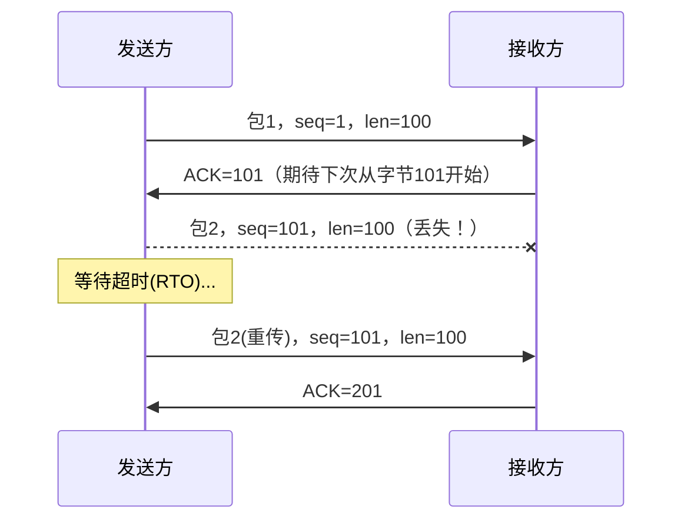

这就是 ARQ 的基本逻辑：发送 → 等待 ACK → 超时 → 重传。但这样效率很低——发一个包就要等一个 ACK，网络利用率极低。

### 2.4.2 滑动窗口 — 流水线化发送

TCP 不等待每个包的 ACK，而是连续发送**窗口内**的所有包。假设窗口大小=4：

- 一次性发送包 1、2、3、4，不等待每个包的 ACK
- 接收方收到 1、2、4（包 3 丢失），回复 ACK=3（期待收到 3）
- 发送方知道：1、2 已确认 ✓，3 丢失 ✗，4 可能到可能没到
- 有 SACK 时：接收方告知"4 已收到，3 丢失"→ 只重传 3
- 无 SACK 时：发送方重传 3、4、5、6（Go-Back-N）

### 2.4.3 SACK — 选择性确认

不用 SACK 时：包 3 丢了，发送方要重传 3、4、5、6（即使 4、5、6 已经收到了）。
用 SACK 时：接收方告诉发送方 "我收到了 4、5、6，但 3 丢了" → 只重传 3。

SACK 信息存放在 TCP 首部的选项部分，是双方在三次握手时协商的（SACK-Permitted 选项）。

### 2.4.4 为什么传输层要把数据分段？

> **"为什么在传输层就分段，而不是等网络层再分片？"**

因为**可靠传输是在传输层控制的**。如果在传输层不分段，一旦网络层的某个分片丢失，整个传输层的数据都要重传。先分段再传：丢了哪段重传哪段，效率更高。

**MSS 在三次握手时协商**，双方取最小值。MSS 的理论最大值 = 1500（MTU）- 20（IP头）- 20（TCP头）= **1460 字节**。

### 2.4.5 游戏开发中的借鉴

- **不照搬 TCP 的超时重传**（RTO 太保守），而是用 NACK + 快速重传（收到 3 次 NACK 就重传，不等超时）
- **不照搬 TCP 的全局有序**，每条消息独立管理可靠性
- **借鉴滑动窗口思想**做流量控制（接收窗口/发送窗口）

---

## 2.5 TCP拥塞控制 — 为什么游戏不用TCP的关键

**重要程度**：★★★☆☆ 建议掌握（应聘高性能/服务器方向则升级为★★★★★）

**原因**：这是"为什么TCP不适合游戏"的核心论据。能讲清楚拥塞控制说明你不只是背八股。

### 2.5.1 拥塞控制和流量控制的区别

| 维度 | 流量控制 | 拥塞控制 |
|------|---------|---------|
| 范围 | 端到端（发送方 ↔ 接收方） | 全局（涉及整个链路的路由器） |
| 依据 | 接收方的接收能力（rwnd） | 网络的承载能力（cwnd） |
| 信号 | 接收方窗口字段 | 丢包/延迟增加 |
| 目标 | 不让接收方被淹没 | 不让网络被拥塞 |

**发送窗口 = min(cwnd, rwnd)**，取拥塞窗口和接收窗口的最小值。

### 2.5.2 四个算法流程

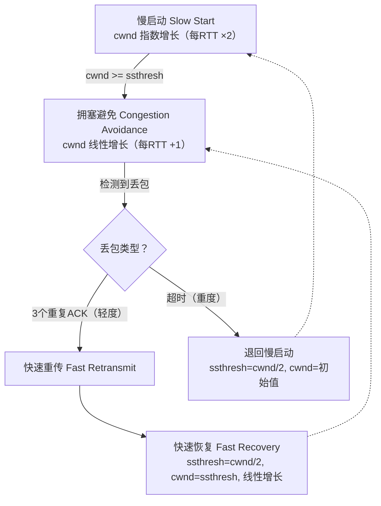

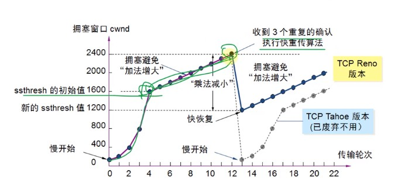

### 2.5.3 拥塞控制 — 完整过程串讲

> 面试时，不要一上来就列四个算法名称。正确节奏：先说"拥塞控制是干啥的"→ 再说四个算法怎么接力 → 最后落到"所以对游戏不友好"。

TCP 的设计假定了一个场景：两台通信的机器之间隔着复杂的互联网，中间有无数路由器。发送方不知道整个链路的瓶颈带宽是多少，如果一上来就全速发送，可能会塞爆某个中间路由器。拥塞控制的目的就是：**自动探测网络能承受多大的发送速率，然后以这个速率发送，同时根据网络状况动态调整。**

TCP 用一个叫 **拥塞窗口（cwnd）** 的变量来控制发送速率。实际的发送窗口取拥塞窗口和接收方通告的接收窗口的最小值：`swnd = min(cwnd, rwnd)`。拥塞控制就是一套调整 cwnd 的算法。

**第一阶段：慢启动**。TCP 刚建立连接时，它完全不知道网络能承受多大速率，所以从很小开始试。初始 cwnd 通常设为 10 个 MSS（最大报文段长度），然后每收到一个 ACK，cwnd 就乘以 2。这个阶段叫做"慢启动"，但这个名字有误导性——它其实增长极快，一个 RTT 就翻一倍，是指数级别的。那为什么叫"慢"？因为比起一开始就全速发，它确实是从"慢"开始的。

**第二阶段：拥塞避免**。cwnd 不可能一直指数增长下去。TCP 设了一个阈值叫 **ssthresh**（慢启动阈值）。当 cwnd 达到 ssthresh 时，TCP 认为"已经快接近网络极限了，不能再翻了"，于是进入拥塞避免阶段。在这个阶段，cwnd 每个 RTT 只增加一个 MSS——从指数增长变成线性增长，小心翼翼地试探网络极限。

**第三阶段：检测到丢包**。如果 cwnd 增长到某个值后出现了丢包，TCP 就认为"已经碰到天花板了"。丢包分为两种情况，严重程度不同：

- **超时（RTO 超时）**：发了包，等了好久都没收到 ACK。这意味着网络可能拥塞得很严重——不仅数据包丢了，连 ACK 都没回来。TCP 认为这是重度拥塞，采取激烈措施：ssthresh 设为当前 cwnd 的一半，cwnd 直接打回初始值，重新从慢启动开始。

- **3 个重复 ACK**：接收方发现某个包没收到，但后续的包还在到达，于是每次收到一个乱序的包就重发一次"我还在等那个丢了的包"的 ACK。当发送方连续收到 3 个相同 ACK 时，它知道"只有一个包丢了，后面的包还在到达，网络没那么糟"。这时候触发**快速重传**——不等超时，立刻重传那个丢失的包。然后进入**快速恢复**：ssthresh 设为 cwnd 的一半，但 cwnd 不被打回初始值，而是直接设为新的 ssthresh，然后线性增长。这比超时后重新慢启动高效得多——因为网络并没有真的拥塞，只是偶尔丢了一个包。

**为什么这套机制对实时游戏是灾难？** 整套拥塞控制的逻辑建立在"丢包 = 拥塞"这个假设上。但在 4G/5G/WiFi 环境下，丢包大概率只是因为信号干扰，不是网络拥塞。当信号波动导致偶然丢包时，TCP 却执行了"cwnd 减半 + 重传 + 降低发送速率"这一整套反应——结果就是，明明网络带宽充足，游戏的延迟却突然从 30ms 飙升到 500ms。更糟的是，队头阻塞意味着一个丢包会卡住后面所有数据，重传超时 200ms+ 意味着你等到的位置信息已经是几百毫秒前的了。

### 2.5.4 对游戏的致命影响

| 拥塞控制行为 | 对游戏的影响 |
|------------|------------|
| 丢包 → cwnd 减半 | 移动网络偶然丢包导致发送速率骤降，游戏延迟飙升 |
| 慢启动 | 新连接前几秒只能慢速发送，玩家刚进游戏时感觉特别卡 |
| 队头阻塞 | 一个丢包阻塞后续所有消息，旧位置堵住新数据 |
| RTO 超时重传 | 200ms+ 才能重传，对需要<50ms延迟的游戏完全不可接受 |

### 2.5.4 KCP 是怎样改进这些问题的

KCP 是国内最知名的可靠 UDP 协议，被大量游戏使用。它解决了 TCP 的什么问题？

| TCP 的问题 | KCP 的做法 |
|-----------|-----------|
| RTO 计算保守（×2） | RTO 计算更激进（×1.5） |
| 快速重传需 3 个重复 ACK | 可配置为 2 个甚至 1 个就触发 |
| 必须保证有序 | 可选，每条消息独立控制 |
| 拥塞控制强制开启 | 可选关闭，让应用层控制发送速率 |
| 队头阻塞 | 无序通道完全避免 |

---

## 2.6 Socket编程基础 — 操作系统的网络API

**重要程度**：★★★★☆ 高频（C++岗位必问）

**原因**：Socket 是所有网络通信的基础。Unity Transport 和 UE Socket Subsystem 底层最终都调用 Socket API。

### 2.6.1 什么是 Socket？

Socket（套接字）是操作系统提供的网络编程接口。它不是协议，而是**调用传输层协议（TCP/UDP）的API**。

你可以把 Socket 想象成一个"网络通信的句柄/文件描述符"。打开一个 Socket，然后通过它来收发数据。

### 2.6.2 TCP Socket 编程流程

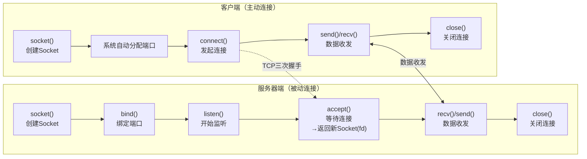

**关键理解**：
- `accept()` 返回的是**新的 Socket**，用于和这个客户端通信。原来 `listen()` 的 Socket 继续监听新连接
- 服务器通过 **IP + 端口** 来区分不同客户端（五元组：源IP、源端口、目标IP、目标端口、协议）

### 2.6.3 TCP vs UDP Socket 编程的区别

| 维度 | TCP Socket | UDP Socket |
|------|-----------|------------|
| 创建 | `socket(AF_INET, SOCK_STREAM, 0)` | `socket(AF_INET, SOCK_DGRAM, 0)` |
| 服务器 | bind → listen → accept → recv/send | bind → recvfrom/sendto（无需listen/accept） |
| 客户端 | connect → send/recv | 直接 sendto/recvfrom（也可先connect固化目标地址） |
| 连接概念 | 有连接，一个Socket对应一个对端 | 无连接，一个Socket可以给多个对端发数据 |
| 数据边界 | 流式（没边界！多次send的数据可能合并或拆分） | 数据报（有边界，一次sendto对应一个完整UDP包） |

### 2.6.4 代码示例：TCP 回显服务器（C++）

```cpp
// 仅展示关键流程，省略错误处理
#include <sys/socket.h>
#include <netinet/in.h>
#include <unistd.h>
#include <string.h>

void TcpEchoServer() {
    // 1. 创建Socket
    int listenFd = socket(AF_INET, SOCK_STREAM, 0);  // SOCK_STREAM = TCP
    
    // 2. 绑定端口
    sockaddr_in addr{};
    addr.sin_family = AF_INET;
    addr.sin_port = htons(8080);                     // 监听8080端口
    addr.sin_addr.s_addr = INADDR_ANY;               // 接收任何IP的连接
    bind(listenFd, (sockaddr*)&addr, sizeof(addr));
    
    // 3. 开始监听
    listen(listenFd, 5);  // backlog=5，等待队列最大长度
    
    // 4. 接受连接（阻塞等待）
    sockaddr_in clientAddr{};
    socklen_t clientLen = sizeof(clientAddr);
    int clientFd = accept(listenFd, (sockaddr*)&clientAddr, &clientLen);
    // clientFd 是用于和这个客户端通信的新Socket
    
    // 5. 收发数据
    char buffer[1024];
    int n = recv(clientFd, buffer, sizeof(buffer), 0);
    // n 是实际收到的字节数，不一定等于发送方一次 send 的字节数！
    send(clientFd, buffer, n, 0);  // 原样返回
    
    // 6. 关闭
    close(clientFd);
    close(listenFd);
}
```

### 2.6.5 代码示例：UDP 回显服务器（C++）

```cpp
void UdpEchoServer() {
    // 1. 创建Socket
    int sockFd = socket(AF_INET, SOCK_DGRAM, 0);  // SOCK_DGRAM = UDP
    
    // 2. 绑定端口
    sockaddr_in addr{};
    addr.sin_family = AF_INET;
    addr.sin_port = htons(8080);
    addr.sin_addr.s_addr = INADDR_ANY;
    bind(sockFd, (sockaddr*)&addr, sizeof(addr));
    
    // 3. 收发数据（不需要listen/accept！）
    char buffer[1024];
    sockaddr_in clientAddr{};
    socklen_t clientLen = sizeof(clientAddr);
    
    // recvfrom 会告诉你数据来自哪个地址
    int n = recvfrom(sockFd, buffer, sizeof(buffer), 0,
                     (sockaddr*)&clientAddr, &clientLen);
    
    // sendto 指定目标地址
    sendto(sockFd, buffer, n, 0,
           (sockaddr*)&clientAddr, clientLen);
    
    close(sockFd);
}
```

### 2.6.6 TCP 粘包/拆包问题（重要！）

**这是 TCP Socket 编程最容易踩的坑：**

TCP 是**流式协议**，没有消息边界。你调用 `send("Hello")` 两次，接收方调用 `recv()` 一次可能收到 `"HelloHello"`（粘包），也可能分两次收到 `"Hel"` 和 `"loHello"`（拆包）。

**解决方案**：
1. **固定长度**：每条消息固定 N 字节，不足补零
2. **分隔符**：用特殊字符（如 `\n`）分隔消息
3. **长度前缀**（最常用）：每条消息前加 2 或 4 字节的长度字段
   ```
   [4字节:消息长度N][N字节:消息内容]
   ```

**UDP 没有这个问题**：UDP 是数据报协议，一次 `sendto` 对应一个完整的 UDP 包，接收方 `recvfrom` 一次拿到的就是一个完整的数据报。

### 2.6.7 阻塞 vs 非阻塞

| 模式 | 特点 | 游戏中的应用 |
|------|------|------------|
| **阻塞模式** | `recv()` 没数据时线程挂起 | ❌ 游戏主线程绝对不能阻塞！会卡死整个游戏 |
| **非阻塞模式** | `recv()` 没数据立即返回错误码 | ✅ 游戏每帧调用一次，有数据则处理，无数据则跳过 |
| **IO多路复用** | `select/poll/epoll` 同时监听多个Socket | ✅ 游戏服务器用 epoll 管理数千连接 |
| **异步IO** | IOCP(Windows) / io_uring(Linux) | ✅ 高性能服务器 |

### 2.6.8 在Unity/Unreal中的应用

**Unity NetworkDriver 示例**（非阻塞、事件驱动）：
```csharp
var driver = NetworkDriver.Create();
driver.Bind(NetworkEndpoint.AnyIpv4.WithPort(7777));
driver.Listen();

// 每帧调用
driver.ScheduleUpdate().Complete();

NetworkConnection connection;
DataStreamReader reader;
NetworkEvent.Type eventType;
while ((eventType = driver.PopEvent(out connection, out reader)) 
       != NetworkEvent.Type.Empty)
{
    switch (eventType)
    {
        case NetworkEvent.Type.Data:
            // reader 里有收到的数据，这是非阻塞的！
            byte[] data = new byte[reader.Length];
            reader.ReadBytes(data);
            ProcessMessage(data);
            break;
        case NetworkEvent.Type.Connect:
            Debug.Log("新客户端连接");
            break;
        case NetworkEvent.Type.Disconnect:
            Debug.Log("客户端断开");
            break;
    }
}
```

**UE FSocket 示例**（非阻塞）：
```cpp
FSocket* Socket = FUdpSocketBuilder(TEXT("GameSocket"))
    .AsNonBlocking()  // 设为非阻塞！
    .BoundToPort(7777)
    .Build();

uint32 PendingDataSize = 0;
while (Socket->HasPendingData(PendingDataSize))
{
    TArray<uint8> Data;
    Data.SetNumUninitialized(PendingDataSize);
    int32 BytesRead = 0;
    TSharedRef<FInternetAddr> SenderAddr = ...;
    Socket->RecvFrom(Data.GetData(), Data.Num(), BytesRead, *SenderAddr);
    // 处理收到的数据
}
```

---

## 2.7 心跳机制 — 游戏长连接的核心

**重要程度**：★★★★☆ 高频

**原因**：面试中几乎必问"怎么检测玩家断线？"。所有需要长连接的场景（C/S 游戏、大厅、聊天）都需要心跳。

### 2.7.1 为什么需要心跳？

**TCP 自带的 Keep-Alive 为什么不能用？**

TCP Keep-Alive 是协议栈自带的保活机制，但参数太保守：
- 默认 **2 小时**才发第一个探测包！
- 探测间隔 75 秒
- 探测 9 次失败才判定断开
- → 最坏情况要 2 小时 + 75×9 = 2 小时 11 分钟才能检测到断线！

对游戏来说，15 秒没收到心跳就应该判定断线了。

### 2.7.2 应用层心跳的设计

```
客户端：每隔 T_heartbeat 发一次心跳包
服务器：如果连续 3*T_heartbeat 没收到心跳 → 判定断线

典型参数：
  T_heartbeat = 5秒
  超时阈值 = 15秒（3次心跳）
  
心跳包内容：
  最简单的就是一个字节的消息类型标记
  稍微丰富的可以携带：当前Ping值、客户端帧率、电量等
```

### 2.7.3 为什么用应用层心跳而不是 TCP Keep-Alive

| 维度 | TCP Keep-Alive | 应用层心跳 |
|------|---------------|----------|
| 检测粒度 | 小时级（默认2h） | 秒级（可配置） |
| 灵活性 | 只能检测TCP连接存活 | 可携带自定义数据（Ping值、帧率） |
| "假活"检测 | ❌ 进程卡死但TCP还通，检测不到 | ✅ 逻辑层停止更新心跳 → 服务器知道客户端出了问题 |
| 跨层 | 传输层 | 应用层 |

### 2.7.4 心跳设计的权衡

- **太频繁（如 1 秒）**：浪费带宽、手机耗电（频繁唤醒 Radio）、增加服务器负载
- **太稀疏（如 60 秒）**：断线发现太慢，玩家可能已经卡了 1 分钟
- **常见方案**：5-15 秒发一次，超时阈值 = 3× 心跳间隔

### 2.7.5 在Unity中的应用

**Unity Transport** 可以配置心跳参数：
```csharp
var settings = new NetworkSettings()
    .WithNetworkConfigParameters(
        heartbeatTimeoutMS: 15000,    // 15秒超时
        connectTimeoutMS: 1000,      // 连接超时
        maxConnectAttempts: 60       // 最大重连次数
    );
var driver = NetworkDriver.Create(settings);
```

**NGO (Netcode for GameObjects)** 中：
```csharp
// NetworkManager 中可以访问 NetworkConfig
var config = NetworkManager.Singleton.NetworkConfig;
// 断线回调
NetworkManager.Singleton.OnClientDisconnectCallback += (clientId) =>
{
    Debug.Log($"客户端 {clientId} 断开连接");
};
```

### 2.7.6 在Unreal中的应用

UE 的网络超时检测：

```cpp
// DefaultEngine.ini 中的配置
[/Script/Engine.GameNetworkManager]
InitialConnectTimeout=120.0    // 初始连接超时
ConnectionTimeout=30.0        // 已连接后的超时（心跳超时）

// 或者通过 UNetDriver 配置
UNetDriver* NetDriver = GetWorld()->GetNetDriver();
NetDriver->ConnectionTimeout = 15.0f;
```

### 2.7.7 面试标准答案

> **"游戏中怎么判断玩家掉线了？"**

"我们使用应用层心跳机制。客户端每 5 秒发送一个心跳包，服务器如果 15 秒（3次心跳周期）没有收到任何数据，就判定该客户端已断开。

不用 TCP 自带的 Keep-Alive 是因为它的默认参数太保守——默认 2 小时才发第一个探测包，对游戏来说完全不可接受。

心跳包设计得尽量小，通常就是一个字节的消息类型 ID，有时也会携带客户端的 Ping 值和帧率，方便服务器做统计分析。"

> **"心跳包发太频繁会有什么问题？"**

"三个问题：
1. 带宽浪费——特别是移动网络下用户对流量敏感
2. 手机耗电——每次发送都会唤醒网络 Radio，频繁唤醒很耗电
3. 服务器压力——大量在线玩家每人每秒发一次心跳包，服务器需要处理的包数量非常可观
所以需要权衡，通常 5-15 秒是比较合理的范围。"

---

## 2.8 UDP首部 — 最精简的传输层协议

**重要程度**：★★★☆☆ 建议掌握

**原因**：理解 UDP 为什么"轻量"——首部只有 8 字节。面试中能说出首部字段说明你真的读过协议规范。

### 2.8.1 UDP 首部结构（8 字节）

```
  0      16      32
 ┌───────┬───────┬───────────────┐
 │ 源端口 │ 目标端口│               │  各2字节
 ├───────┼───────┤    数据        │
 │ 长度   │ 校验和 │               │  各2字节
 └───────┴───────┴───────────────┘
  ← 8字节首部 →←──── 数据部分 ────→

字段说明：
  源端口：发送方端口号（2字节，0~65535）
  目标端口：接收方端口号（2字节）
  长度：UDP首部+数据的总长度（2字节，最小8=仅有首部）
  校验和：验证首部和数据是否损坏（2字节，可选）
```

对比 TCP 首部最少 20 字节（通常 32 字节含选项），UDP 只有 8 字节。

### 2.8.2 UDP 的特点

- **无连接**：不建立连接，直接发包，`sendto` 就能发
- **不可靠**：不保证送达，不保证顺序，不保证不重复
- **面向数据报**：保留应用层的消息边界（一次 sendto = 一个完整的UDP数据报），接收方不会收到半个包
- **没有拥塞控制**：发送速率由应用层自己控制，不会因为丢包自动降速

---

# 第3章 应用层协议

> 本章聚焦游戏客户端真正需要的应用层协议：HTTP（登录/资源）、WebSocket（H5/大厅）、DNS（CDN分发）。删除Cookie/Session、CORS等Web后端内容。

---

## 3.1 HTTP协议核心 — 游戏非实时通信的基础

**重要程度**：★★★★☆ 高频

**原因**：登录、支付、排行榜、资源热更新都用HTTP。不需要像Web后端那样深入，但要理解核心。

### 3.1.1 HTTP是什么？

HTTP（HyperText Transfer Protocol）是**应用层**协议，设计目标是传输超文本（HTML页面），现在也广泛用于传输JSON、二进制数据等。

**关键特性**：
- 基于 TCP（HTTP/1.1、HTTP/2）或 QUIC/UDP（HTTP/3）
- **请求-响应模式**：客户端发请求，服务器返回响应。服务器不能主动推送（HTTP/2有Server Push但有限制）
- **无状态**：每次请求都是独立的，服务器不记忆上次请求的信息（这是设计哲学，Cookie/Session是为了绕开这个限制）

### 3.1.2 HTTP报文结构（你面试时要能画出来）

**请求报文**：
```
GET /api/rank?page=1 HTTP/1.1        ← 请求行（方法 URL 版本）
Host: game.example.com               ← 请求头（key: value）
Accept: application/json              ← 告诉服务器我期待JSON格式
Authorization: Bearer token_xxx       ← 认证Token
User-Agent: Unity/2022.3              ← 客户端标识
                                      ← 空行（头与体之间的分隔）
                                      ← 请求体（GET通常没有）
```

**响应报文**：
```
HTTP/1.1 200 OK                       ← 状态行（版本 状态码 描述）
Content-Type: application/json        ← 响应头
Content-Length: 256                   ← 告诉客户端Body有多长
Cache-Control: max-age=3600           ← 缓存策略
                                      ← 空行
{"rank": 1, "score": 9999}            ← 响应体（实际数据，JSON/HTML/二进制等）
```

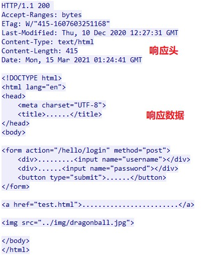

### 3.1.3 HTTP请求方法

HTTP定义了9种方法，游戏开发中主要用到：

| 方法 | 语义 | 游戏场景 |
|------|------|---------|
| **GET** | 获取资源 | 拉取排行榜、获取玩家信息、下载资源 |
| **POST** | 提交数据 | 登录、注册、提交战绩、上传存档 |
| **PUT** | 整体替换 | 更新玩家完整配置 |
| **DELETE** | 删除 | 删除角色/存档（通常不开放给客户端） |
| HEAD | 仅获取头部 | 下载前确认文件大小、是否更新 |
| PATCH | 部分修改 | 更新单个字段 |

**GET vs POST 的区别（面试常问）**：

| 维度 | GET | POST |
|------|-----|------|
| 参数位置 | URL 查询字符串（`?key=value`） | 请求体（Body） |
| 长度限制 | 受URL长度限制（浏览器/服务器限制，通常2KB-8KB） | 无理论限制 |
| 语义 | 获取数据（幂等，多次请求结果相同） | 提交数据（不幂等） |
| 缓存 | 可被浏览器缓存 | 默认不缓存 |
| 安全性 | 参数暴露在URL中（日志会记录） | 参数在Body中，URL不可见 |

**游戏开发要点**：登录接口必须用 POST（密码在Body中，不会出现在服务器日志的URL里）；排行榜可以用 GET（参数简单、可缓存）。

### 3.1.4 HTTP状态码速记

| 类别 | 范围 | 含义 |
|------|------|------|
| 1xx | 100-199 | 信息（请求已收到，继续处理） |
| 2xx | 200-299 | 成功 |
| 3xx | 300-399 | 重定向 |
| 4xx | 400-499 | 客户端错误 |
| 5xx | 500-599 | 服务器错误 |

**游戏开发最常遇到的状态码**：

| 状态码 | 含义 | 游戏场景 |
|--------|------|---------|
| **200 OK** | 成功 | 正常响应 |
| **206 Partial Content** | 部分内容 | 断点续传，配合 `Range` 头下载大文件 |
| **301 Moved Permanently** | 永久重定向 | CDN域名迁移 |
| **302 Found** | 临时重定向 | 登录后跳转 |
| **304 Not Modified** | 未修改 | 资源缓存验证，省流量 |
| **400 Bad Request** | 请求错误 | 参数格式错误 |
| **401 Unauthorized** | 未认证 | Token过期或无效 |
| **403 Forbidden** | 禁止访问 | 没有权限 |
| **404 Not Found** | 不存在 | 请求了不存在的资源 |
| **500 Internal Server Error** | 服务器内部错误 | 服务器挂了/代码bug |
| **502 Bad Gateway** | 网关错误 | 前置Nginx/负载均衡连接后端失败 |
| **503 Service Unavailable** | 服务不可用 | 服务器维护/过载 |

### 3.1.5 HTTP版本演进：为什么HTTP/3选择了UDP？

| 版本 | 年份 | 底层 | 核心改进 | 局限 |
|------|------|------|---------|------|
| HTTP/1.0 | 1996 | TCP | 支持Header、多种方法 | 一次请求一个连接，用完就关 |
| HTTP/1.1 | 1997 | TCP | 长连接(keep-alive)、管道化 | 队头阻塞（请求串行） |
| HTTP/2 | 2015 | TCP | 多路复用、头部压缩、Server Push | TCP层队头阻塞仍在 |
| HTTP/3 | 2018+ | QUIC(UDP) | 0-RTT、真正无队头阻塞、连接迁移 | CPU消耗高，生态未成熟 |

**核心理解**：HTTP/2 在应用层实现了多路复用（一个连接上并行发多个请求），但底层 TCP 保证有序，一个TCP包的丢失仍然会阻塞该连接上的所有HTTP请求。HTTP/3 换用 QUIC（基于UDP），在UDP之上为每个请求流独立管理可靠性，彻底解决了队头阻塞。

**这和游戏选择UDP的思路完全一样！** TCP的队头阻塞无法在应用层绕过，必须在传输层解决。HTTP/3 证明了业界对这个问题的共识。

### 3.1.6 在Unity中的应用

**UnityWebRequest 发送GET请求**：
```csharp
using UnityEngine;
using UnityEngine.Networking;
using System.Collections;

// 获取排行榜
IEnumerator GetRankList()
{
    using (UnityWebRequest www = UnityWebRequest.Get("https://api.game.com/rank?page=1"))
    {
        // 设置超时
        www.timeout = 10;
        // 设置请求头
        www.SetRequestHeader("Authorization", "Bearer " + playerToken);
        
        yield return www.SendWebRequest();
        
        if (www.result == UnityWebRequest.Result.Success)
        {
            string json = www.downloadHandler.text;
            // 解析JSON
            RankList list = JsonUtility.FromJson<RankList>(json);
            UpdateUI(list);
        }
        else
        {
            Debug.LogError($"请求失败: {www.responseCode} - {www.error}");
            // 处理错误：重试、提示玩家等
        }
    }
}
```

**UnityWebRequest 发送POST请求**：
```csharp
IEnumerator Login(string username, string password)
{
    // 构造JSON Body
    var loginData = new LoginRequest { username = username, password = password };
    string json = JsonUtility.ToJson(loginData);
    
    using (UnityWebRequest www = new UnityWebRequest("https://api.game.com/login", "POST"))
    {
        // 设置Body
        byte[] bodyRaw = System.Text.Encoding.UTF8.GetBytes(json);
        www.uploadHandler = new UploadHandlerRaw(bodyRaw);
        www.downloadHandler = new DownloadHandlerBuffer();
        
        // 设置Content-Type（重要！否则服务器不知道Body是JSON）
        www.SetRequestHeader("Content-Type", "application/json");
        
        yield return www.SendWebRequest();
        
        if (www.responseCode == 200)
        {
            string response = www.downloadHandler.text;
            // 解析Token，保存到PlayerPrefs或内存
        }
    }
}
```

**大文件断点续传（依赖状态码206）**：
```csharp
IEnumerator DownloadAssetBundle(string url, string savePath)
{
    // 先检查本地已有多少
    long existingSize = File.Exists(savePath) ? new FileInfo(savePath).Length : 0;
    
    using (UnityWebRequest www = UnityWebRequest.Get(url))
    {
        if (existingSize > 0)
        {
            // 设置Range头，从已有位置继续下载
            www.SetRequestHeader("Range", $"bytes={existingSize}-");
        }
        
        www.downloadHandler = new DownloadHandlerFile(savePath, true); // true=append模式
        
        yield return www.SendWebRequest();
        
        // 如果返回206，说明服务器支持断点续传
        if (www.responseCode == 206 || www.responseCode == 200)
        {
            Debug.Log($"下载完成: {savePath}");
        }
    }
}
```

### 3.1.7 在Unreal中的应用

**FHttpModule 发送请求**：
```cpp
#include "HttpModule.h"
#include "Interfaces/IHttpResponse.h"
#include "Json.h"
#include "JsonObjectConverter.h"

void UGameAPIClient::GetPlayerRank(int32 Page)
{
    TSharedRef<IHttpRequest, ESPMode::ThreadSafe> Request = 
        FHttpModule::Get().CreateRequest();
    
    // 设置URL和参数
    Request->SetURL(FString::Printf(TEXT("https://api.game.com/rank?page=%d"), Page));
    Request->SetVerb("GET");
    
    // 设置请求头
    Request->SetHeader("Authorization", FString::Printf(TEXT("Bearer %s"), *PlayerToken));
    Request->SetHeader("Accept", "application/json");
    
    // 绑定回调（注意线程安全！回调在GameThread执行）
    Request->OnProcessRequestComplete().BindUObject(this, &UGameAPIClient::OnRankReceived);
    
    Request->ProcessRequest();
}

void UGameAPIClient::OnRankReceived(FHttpRequestPtr Request, FHttpResponsePtr Response, bool bSuccess)
{
    if (!bSuccess || !Response.IsValid())
    {
        UE_LOG(LogTemp, Error, TEXT("请求失败: 网络错误"));
        return;
    }
    
    int32 ResponseCode = Response->GetResponseCode();
    if (ResponseCode == 200)
    {
        FString JsonString = Response->GetContentAsString();
        // 解析JSON
        TSharedPtr<FJsonObject> JsonObject;
        TSharedRef<TJsonReader<>> Reader = TJsonReaderFactory<>::Create(JsonString);
        if (FJsonSerializer::Deserialize(Reader, JsonObject))
        {
            // 处理数据...
        }
    }
    else
    {
        UE_LOG(LogTemp, Error, TEXT("请求失败: HTTP %d"), ResponseCode);
    }
}
```

### 3.1.8 面试标准答案

> **"GET和POST有什么区别？"**

"GET 参数在 URL 中，POST 参数在 Body 中。
GET 有长度限制（URL长度限制），POST 理论上无限制。
GET 是幂等的（多次请求结果一致），POST 不是。
GET 可以被缓存，POST 默认不缓存。
游戏开发中：登录接口用 POST（密码在Body更安全），获取排行榜用 GET。"

> **"HTTP和HTTPS有什么区别？"**

"HTTPS = HTTP + SSL/TLS。主要区别：
1. HTTP 明文传输，HTTPS 加密传输（防窃听）
2. HTTPS 需要证书（验证服务器身份，防中间人攻击）
3. HTTP 默认 80 端口，HTTPS 默认 443 端口
4. HTTPS 需要 TLS 握手（额外 2 RTT），连接建立稍慢
5. 游戏开发中，登录/支付等敏感操作必须用 HTTPS；资源下载可以用 HTTP 提升速度（CDN一般两个都支持）"

---

## 3.2 WebSocket — 全双工的游戏利器

**重要程度**：★★★★★ 必须掌握

**原因**：WebSocket 是 H5 游戏、微信小游戏、Unity WebGL 游戏的核心通信方式。面试中一定要能说清楚它和 HTTP、Socket 的区别。

### 3.2.1 WebSocket 是什么？

WebSocket 是应用层协议，它让浏览器（或任何WebSocket客户端）和服务器之间建立**全双工、长连接**的通信通道。

```
传统HTTP:  客户端 → 请求 → 服务器 → 响应 → 客户端 → 请求...（轮询模式）
WebSocket: 客户端 ⟷ 服务器（双方随时可以发消息，不需要等对方请求）
```

### 3.2.2 为什么会有 WebSocket？

**问题**：HTTP 是"请求-响应"模式，服务器不能主动给客户端发数据。以前实现"推送"功能只能：

1. **轮询（Polling）**：客户端每 N 秒发一个请求问"有没有新消息？"
   - 缺点：大量无效请求（没新消息时也发），浪费带宽和服务器资源
2. **长轮询（Long Polling）**：客户端发请求，服务器挂起，有新消息才返回
   - 缺点：实现复杂，大量挂起请求占用服务器资源

WebSocket 直接解决了这个问题：建立连接后双方随时发消息，服务器有新消息直接推送。

### 3.2.3 WebSocket vs HTTP vs 原生Socket

> 这是一个常见的混淆点，必须理清。

| 维度 | HTTP | WebSocket | 原生Socket（TCP/UDP） |
|------|------|-----------|---------------------|
| 层级 | 应用层协议 | 应用层协议 | 传输层API（不是协议） |
| 通信模式 | 请求-响应（半双工） | 全双工 | 取决于协议（TCP全双工） |
| 建立方式 | TCP连接 + HTTP请求 | HTTP Upgrade → WebSocket | TCP三次握手 |
| 消息边界 | 需自行处理（HTTP/1.1） | 内置帧格式（有边界） | TCP无边界 / UDP有边界 |
| 协议开销 | 每个请求带完整Header | 握手后每帧2-14字节头 | 无协议层开销 |
| 浏览器支持 | ✅ 原生支持 | ✅ 原生支持（所有现代浏览器） | ❌ 不可用（安全限制） |
| 使用场景 | API调用、资源下载 | H5游戏、聊天、实时推送 | 原生客户端游戏核心同步 |

**一句话总结关系**：WebSocket 和 HTTP 都是**应用层协议**（平级关系），Socket 是**操作系统API**（底层工具）。WebSocket 在建立连接时借助 HTTP 完成"协议升级"握手，之后就走独立的 WebSocket 协议。

### 3.2.4 WebSocket 握手过程

```
客户端（浏览器/Unity）                  服务器
      |                                    |
      |── HTTP GET /chat ──────────────→|  看起来像普通HTTP请求
      |   Upgrade: websocket             |  但有几个特殊的头：
      |   Connection: Upgrade            |  Upgrade: websocket
      |   Sec-WebSocket-Key: dGhl...     |  （告诉服务器"我想升级到WebSocket"）
      |   Sec-WebSocket-Version: 13      |
      |                                    |
      |←── HTTP 101 Switching Protocols ─|  服务器同意升级
      |   Upgrade: websocket             |  状态码101 = 协议切换
      |   Connection: Upgrade            |
      |   Sec-WebSocket-Accept: s3p...   |  （服务器对Key做了SHA1+Base64）
      |                                    |
      |═══ WebSocket 连接已建立 ═══════════|
      |  之后收发的是 WebSocket 二进制帧    |
      |  不再是 HTTP 报文                   |
```

**关键理解**：WebSocket 握手借用了 HTTP 的"升级"机制，但握手后的通信是完全独立的 WebSocket 协议格式（二进制帧），不是 HTTP 文本格式。

### 3.2.5 WebSocket 帧格式（简化理解）

```
WebSocket 帧结构（简化）：
┌────┬────┬────┬────┬──────────┬──────────┐
│FIN │Opcode│MASK│长度│  Masking │  Payload │
│1bit│4bits │1bit│7bit│  Key(4B) │   Data   │
└────┴────┴────┴────┴──────────┴──────────┘

比HTTP报文开销小得多！最小只有2字节的帧头（vs HTTP的几百字节Header）
这就是为什么WebSocket适合实时通信
```

### 3.2.6 在游戏中的应用场景

| 场景 | 为什么用WebSocket |
|------|------------------|
| **H5游戏**（微信小游戏、WebGL） | 浏览器不支持原生UDP Socket，WebSocket是唯一选择 |
| **游戏大厅/聊天** | 全双工适合聊天（服务器主动推送消息），开销小 |
| **匹配系统** | 等待匹配结果时服务器推送，不需要客户端轮询 |
| **推送通知** | 活动推送、好友上线通知等 |
| **Unity WebGL导出** | Unity编译到WebGL时，网络只有WebSocket可用 |

### 3.2.7 在Unity中的应用

```csharp
// 使用 NativeWebSocket 库（Unity WebGL兼容）
using NativeWebSocket;

public class GameWebSocket : MonoBehaviour
{
    WebSocket websocket;
    
    async void Start()
    {
        websocket = new WebSocket("ws://game-server.com:8080/game");
        
        websocket.OnOpen += () =>
        {
            Debug.Log("WebSocket连接成功!");
            // 发送加入房间的消息
            var joinMsg = new { type = "join", roomId = 123 };
            websocket.SendText(JsonUtility.ToJson(joinMsg));
        };
        
        websocket.OnMessage += (bytes) =>
        {
            // 收到服务器消息
            string message = System.Text.Encoding.UTF8.GetString(bytes);
            var data = JsonUtility.FromJson<ServerMessage>(message);
            
            switch (data.type)
            {
                case "player_joined":
                    OnPlayerJoined(data);
                    break;
                case "chat":
                    OnChatMessage(data);
                    break;
                case "game_start":
                    OnGameStart(data);
                    break;
            }
        };
        
        websocket.OnError += (error) =>
        {
            Debug.LogError($"WebSocket错误: {error}");
        };
        
        websocket.OnClose += (closeCode) =>
        {
            Debug.Log($"WebSocket关闭: {closeCode}");
            // 尝试重连
        };
        
        await websocket.Connect();
    }
    
    void Update()
    {
        // WebSocket需要每帧Dispatch来接收消息
        #if !UNITY_WEBGL || UNITY_EDITOR
        websocket?.DispatchMessageQueue();
        #endif
    }
    
    public async void SendChatMessage(string text)
    {
        if (websocket.State == WebSocketState.Open)
        {
            var msg = new { type = "chat", text = text };
            await websocket.SendText(JsonUtility.ToJson(msg));
        }
    }
    
    async void OnDestroy()
    {
        if (websocket != null)
        {
            await websocket.Close();
        }
    }
}
```

### 3.2.8 在Unreal中的应用

UE 通过 `WebSockets` 模块（需在 `.Build.cs` 中启用）支持 WebSocket：

```cpp
// YourModule.Build.cs
PublicDependencyModuleNames.AddRange(new string[] { "WebSockets" });

// 使用
#include "WebSocketsModule.h"
#include "IWebSocket.h"

void AMyGameMode::ConnectToLobby()
{
    if (!FModuleManager::Get().IsModuleLoaded("WebSockets"))
    {
        FModuleManager::Get().LoadModule("WebSockets");
    }
    
    const FString ServerURL = TEXT("ws://lobby-server.com:8080/game");
    TSharedPtr<IWebSocket> WebSocket = FWebSocketsModule::Get().CreateWebSocket(ServerURL);
    
    // 绑定回调
    WebSocket->OnConnected().AddLambda([]()
    {
        UE_LOG(LogTemp, Log, TEXT("WebSocket连接成功"));
    });
    
    WebSocket->OnMessage().AddLambda([](const FString& Message)
    {
        UE_LOG(LogTemp, Log, TEXT("收到消息: %s"), *Message);
        // 解析JSON并处理...
    });
    
    WebSocket->OnClosed().AddLambda([](int32 StatusCode, const FString& Reason, bool bWasClean)
    {
        UE_LOG(LogTemp, Log, TEXT("WebSocket关闭: %d - %s"), StatusCode, *Reason);
    });
    
    WebSocket->OnConnectionError().AddLambda([](const FString& Error)
    {
        UE_LOG(LogTemp, Error, TEXT("WebSocket错误: %s"), *Error);
    });
    
    // 连接
    WebSocket->Connect();
}
```

### 3.2.9 面试标准答案

> **"WebSocket 和 Socket 有什么区别？"**

"Socket 是操作系统提供的网络编程 API，用于操作传输层（TCP/UDP）。你用 `socket()` 创建、`bind()` 绑定、`listen()` 监听、`accept()` 接受连接。
WebSocket 是应用层协议，它跑在 TCP 之上，有自己的帧格式。建立连接时通过 HTTP Upgrade 握手，之后就可以全双工通信。

简单来说：Socket 是底层工具，WebSocket 是高层协议。就像 Socket 是"铁轨"，WebSocket 是"铁路公司的运营规则"。"

> **"WebSocket 和 HTTP 长连接有什么区别？"**

"HTTP/1.1 的 keep-alive 长连接只是复用 TCP 连接，但通信模式仍然是'请求-响应'——客户端不发请求，服务器就不能发数据。
WebSocket 是全双工的——建立连接后，客户端和服务器可以随时给对方发消息，没有'一问一答'的限制。

打个比方：HTTP长连接像对讲机（同一时间只能一方说话），WebSocket 像电话（双方可以同时说）"

> **"WebSocket 的心跳怎么做？"**

"WebSocket 协议有内置的 Ping/Pong 控制帧（opcode=9/10），专门用于心跳检测。可以定时发 Ping 帧，对端自动回复 Pong 帧。
实际上很多服务器框架也支持在 WebSocket 上做应用层心跳（发自定义消息），灵活度更高。通常 WebSocket 心跳间隔可以设得比游戏UDP心跳长一些（30-60秒），因为 WebSocket 一般用在非战斗场景（大厅/聊天）。"

---

## 3.3 DNS — 域名解析

**重要程度**：★★★☆☆ 建议掌握

**原因**：理解CDN资源分发、排查网络问题时需要DNS知识。

### 3.3.1 DNS 是什么？

DNS（Domain Name System）= 把域名（`game.com`）翻译成 IP 地址（`123.45.67.89`）的系统。

**为什么不用域名直接通信？**
- IP 是 4 字节（IPv4），域名可能是几十字节 → 全部换成域名会让每个 IP 包变大几十倍，浪费带宽
- IP 是定长的，路由器的硬件可以做快速匹配；域名是变长的，匹配效率低

### 3.3.2 DNS 查询流程

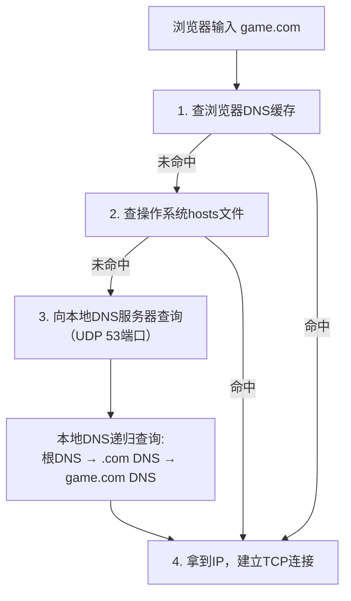

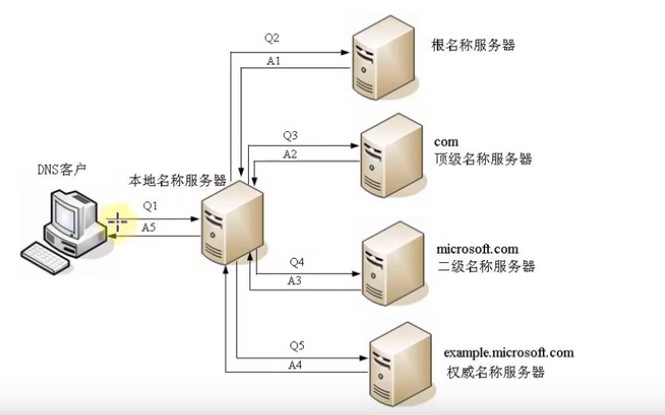

### 3.3.3 游戏开发中的DNS

- **CDN资源分发**：`cdn.game.com` 的 DNS 解析到离玩家最近的 CDN 节点 IP
- **HTTPDNS（移动端）**：传统 DNS 走 UDP 53，容易被运营商劫持。HTTPDNS 改用 HTTP 请求查询 IP，绕过运营商 Local DNS，更安全可靠。腾讯云和阿里云有现成的 HTTPDNS 服务
- **DNS 预热**：游戏启动时提前解析资源CDN域名，减少下载时的DNS查询延迟

---

## 3.4 CDN — 游戏资源分发的加速器

**重要程度**：★★★☆☆ 建议掌握

**原因**：游戏热更新（AssetBundle/Pak）依赖CDN分发，理解CDN有助于设计可靠的资源更新方案。

### 3.4.1 CDN 是什么？

CDN（Content Delivery Network）= 内容分发网络。在全国/全球各地的机房部署**边缘节点**，缓存你的资源文件。玩家下载时，从最近的节点获取，而不是从源站（可能很远）拉取。

```
没有CDN：
  深圳玩家 → 下载 skin.bundle → 源站在北京 → 延迟高、速度慢

有CDN：
  深圳玩家 → 下载 skin.bundle → 深圳CDN节点(有缓存) → 秒下！
  如果深圳节点没缓存 → 回源到北京 → 缓存 → 后续的深圳玩家就快了
```

### 3.4.2 游戏中的CDN用法

```
热更新流程：
1. 客户端启动，检查资源版本号
2. 比对服务器最新版本号
3. 有更新 → 请求CDN下载增量包
   cdn.example.com/assets/v1.2/patch_1.2.1.bundle
4. 下载完成后本地校验MD5
5. 应用更新
```

**配合断点续传**：大文件（如几百MB的AssetBundle）下载时，用 HTTP Range 头 + 206状态码实现断点续传。

### 3.4.3 面试标准答案

> **"你的热更新资源怎么分发的？"**

"资源打包成 AssetBundle / Pak 后上传到 CDN。客户端启动时对比版本号，从 CDN 下载增量更新包。下载用 HTTP Range 头做断点续传，避免大文件下载中断后重新开始。下载完成后用 MD5 校验文件完整性。CDN 选用了腾讯云/阿里云的CDN服务，边缘节点覆盖全国，保证下载速度。"

---

## 3.5 【标记删除区】以下为Web后端/运维内容

| 已删除内容 | 原因 |
|-----------|------|
| Cookie/Session 机制及Java代码 | Web后端内容，游戏用Token（JWT等）替代 |
| 跨域CORS及Java代码 | 浏览器端限制，原生客户端不存在跨域问题 |
| DHCP详细分配流程 | 运维内容，游戏开发不需要 |
| FTP文件传输协议 | 已被HTTP替代，热更新不用FTP |
| 邮件协议(SMTP/POP3/IMAP) | 完全无关 |
| WebService/SOAP | 落后技术，已被REST API取代 |
| RESTful API设计建议 | Web后端规范，游戏API简单设计即可 |
| 网络爬虫代码 | 完全无关 |
| VPN配置/原理 | 运维内容 |
| tcpdump抓包工具 | Linux运维工具 |
| Tomcat/Nginx配置 | Java后端/运维内容 |
| 代理服务器（正向/反向代理） | 运维内容 |
| Java Servlet所有代码 | Java后端内容 |

---

# 第4章 网络安全与HTTPS

> 保留加密基础、TLS握手等核心概念，删除操作层面的配置命令和Java代码。

---

## 4.1 加密基础 — 对称加密与非对称加密

**重要程度**：★★★★☆ 高频

**原因**：HTTPS的TLS握手过程是经典面试题，理解加密是前提。游戏防外挂中也会用到加密和签名的思路。

### 4.1.1 对称加密（Symmetric Encryption）

**核心特点**：加密和解密用**同一个密钥**。

```
明文 + 密钥 → [加密算法] → 密文
密文 + 密钥 → [解密算法] → 明文

双方必须事先共享同一个密钥
```

| 算法 | 密钥长度 | 特点 | 是否安全 |
|------|---------|------|---------|
| DES | 56 bit | 已被暴力破解 | ❌ 不安全 |
| 3DES | 168 bit（有效112） | DES的三次重复 | ⚠️ 慢且逐渐淘汰 |
| **AES** | 128/192/256 bit | 当前标准，最广泛使用 | ✅ 安全 |

**优点**：速度快（比非对称快 100~1000 倍）
**缺点**：密钥配送问题——你怎么把密钥安全地告诉对方？如果在网上直接传密钥，被窃听就完了。

### 4.1.2 非对称加密（Asymmetric Encryption）

**核心特点**：加密和解密用**不同的密钥**——公钥和私钥。

```
公钥（public key）：可以公开给任何人
私钥（private key）：只有自己知道，绝不能泄露

公钥加密 → 私钥解密（用于加密通信）
私钥加密 → 公钥解密（用于数字签名）

一对公私钥是数学相关的，但从公钥推导出私钥在计算上不可行
```

| 算法 | 密钥长度 | 特点 |
|------|---------|------|
| **RSA** | 2048/4096 bit | 最广泛使用的非对称加密算法 |

**优点**：天然解决密钥配送问题——公钥可以公开传输，不怕被窃听
**缺点**：速度慢（比对称慢 100~1000 倍），不适合加密大量数据

### 4.1.3 混合密码系统 — HTTPS的核心思路

既然对称加密快但不安全（密钥难配送），非对称加密安全但慢，那就**结合两者的优势**：

```
1. 客户端生成一个随机的"会话密钥"（对称密钥，如AES-256密钥）
2. 用服务器的公钥（非对称）加密这个会话密钥 → 安全传输
3. 服务器用私钥解密得到会话密钥
4. 之后的数据用会话密钥（对称）加密通信 → 快速！
```

这就是 HTTPS（TLS）的核心设计：**非对称加密保护对称密钥的传输，对称加密负责后续的数据加密**。

### 4.1.4 在游戏安全中的应用

- **登录加密**：密码在客户端用服务器公钥加密（或至少走HTTPS），不能明文传输
- **协议加密**：战斗数据经过简单加密（XOR/位运算等轻量方法），增加外挂破解难度
- **防篡改**：重要数据（如服务器下发的道具信息）附带签名，客户端验证签名防篡改
- **注意**：客户端无论怎么加密，终究可以被逆向。防外挂的核心是把关键逻辑放在服务器，客户端只做表现

---

## 4.2 数字签名与证书

**重要程度**：★★★☆☆ 建议掌握

**原因**：理解HTTPS的信任链。

### 4.2.1 数字签名做什么？

数字签名解决三个问题：
1. **防篡改**：确认消息在传输中没被修改
2. **防伪造**：确认消息确实是声称的发件人发的
3. **防抵赖**：发件人不能否认自己发过

**签名过程（改进版，使用Hash）**：
```
发送方：
  1. 对消息内容计算Hash摘要（如SHA-256，固定长度）
  2. 用【自己的私钥】加密这个Hash摘要 → 这就是"签名"
  3. 发送：消息原文 + 签名

接收方：
  1. 对收到的消息原文计算Hash摘要
  2. 用【发送方的公钥】解密签名，得到发送方的Hash摘要
  3. 比较两个Hash：一致 → 消息未被篡改，确实是发送方发的
```

**为什么对Hash签名而不是对原文签名？**
原文可能很长（几MB），非对称加密大文件太慢。Hash固定长度（如32字节），签名速度快。

### 4.2.2 证书（Certificate）— 解决公钥信任问题

**问题**：数字签名可以防篡改，但前提是你有发送方的正确公钥。如果中间人把自己的公钥替换成发送方的公钥给你呢？

**解决**：引入可信第三方——CA（Certificate Authority，证书颁发机构）。

```
证书 = {
    服务器域名：game.com
    服务器公钥：XXXXX
    颁发机构：DigiCert
    有效期：2024.1.1 ~ 2025.1.1
    数字签名：CA用自己的私钥对以上信息签名
}
```

浏览器/操作系统内置了各大CA的公钥，可以用这些公钥验证证书中的CA签名是否有效。

**信任链**：操作系统信任 → CA → CA签发的服务器证书 → 服务器公钥可信

### 4.2.3 面试标准答案

> **"数字签名和加密有什么区别？"**

"加密是为了**保密**（不让别人看到内容），用接收方的公钥加密；签名是为了**验证身份**（证明是我发的、没被改过），用发送方的私钥加密（签名）。

方向上：加密 = 公钥加密 → 私钥解密；签名 = 私钥加密（签名）→ 公钥解密（验签）。
实际应用经常两者结合：先签名（证明来源），再加密（保护内容）。"

---

## 4.3 HTTPS/TLS通信过程（完整版）

**重要程度**：★★★★☆ 高频

**原因**：这是面试中经典的"硬八股"，完整的TLS握手过程是展示你网络基础深度的机会。

### 4.3.1 TLS在协议栈中的位置

```
应用层:    HTTP（明文）
              ↓
表示层:    TLS/SSL（加密） ← 工作在这一层！在HTTP和TCP之间
              ↓
传输层:    TCP
```

TLS 不是应用层协议，而是工作在应用层和传输层之间。它对 HTTP 报文进行加密后，再交给 TCP 传输。

### 4.3.2 TLS 1.2 握手过程（共 4 个 RTT）

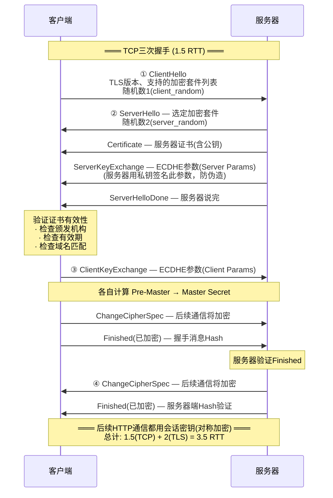

### 4.3.3 会话密钥是怎么生成的？

以 ECDHE（椭圆曲线 Diffie-Hellman 密钥交换）为例：

```
1. 客户端生成: client_random, Client Params
2. 服务器生成: server_random, Server Params
3. 双方各自计算:
   Pre-Master Secret = ECDHE(Server Params, Client Params)
   Master Secret = PRF(Pre-Master Secret, "master secret", 
                        client_random + server_random)
   会话密钥 = PRF(Master Secret, "key expansion", 
                   client_random + server_random)

PRF = Pseudo Random Function（伪随机函数）

关键点：Pre-Master Secret 从未在网络上传输过！
双方各自用同样的算法，根据交换的参数各自计算出来。
即使中间人截获了 Client Params 和 Server Params，
没有私钥也无法计算出 Pre-Master Secret。
```

### 4.3.4 对游戏的影响

TLS 握手需要额外的 2 个 RTT。加上 TCP 三次握手 1.5 RTT，**登录时建立 HTTPS 连接总共需要约 3.5 RTT**。

假设 RTT=50ms（一般国内网络），连接建立就需要 ~175ms。如果你的登录流程还要做账号验证、拉取角色列表等，总时间可能超过 1 秒。

**优化方向**：
- **TLS Session Resumption**：复用之前的 TLS 会话，跳过完整握手（1-RTT 或 0-RTT）
- **连接池**：保持一个到登录服务器的长连接，避免频繁建连
- **TLS 1.3**：握手只需 1-RTT（比 TLS 1.2 少一个 RTT）

### 4.3.5 面试标准答案

> **"说一下HTTPS的通信过程/TLS握手过程"**

"HTTPS = HTTP + TLS。TLS握手分为几个关键步骤：

1. ClientHello：客户端发送支持的加密套件、TLS版本、客户端随机数
2. ServerHello + Certificate + ServerKeyExchange：服务器选定加密套件，发送证书（含公钥）和密钥交换参数
3. 客户端验证证书，然后发送ClientKeyExchange + ChangeCipherSpec + Finished（已加密）
4. 服务器回复ChangeCipherSpec + Finished（已加密）

之后双方用协商出的会话密钥进行对称加密通信。

核心思想：握手阶段用非对称加密（证书、密钥交换）安全地协商出会话密钥，后续数据传输用对称加密（速度快）。这就是混合密码系统在HTTPS中的应用。"

---

# 第5章 游戏网络同步

> ⚠️ **这是全篇最核心的章节。** 前 4 章讲的是通用网络知识，本章开始讲游戏开发特有的网络技术。这是区分"懂网络的程序员"和"懂游戏网络的程序员"的分水岭。
>
> 本章内容来源于业界经典实现：Valve Source Engine、守望先锋、王者荣耀的同步方案。
> 每个小节都是一个独立的知识点，按"问题 → 方案 → 原理 → 面试回答"组织。

---

## 5.1 网络架构：你的游戏用哪种？

**重要程度**：★★★★★ 必须掌握

**原因**：面试第一个关于网络同步的问题往往是"你们游戏用的是什么网络架构？"——你的回答决定了后续所有问题。

### 5.1.1 三种主流架构

#### Client-Server（客户端-服务器）— 最主流

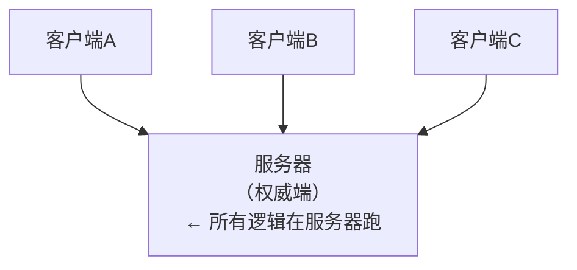

特点：服务器是唯一权威，所有游戏逻辑在服务器执行。客户端只发输入、收状态、做表现。
优点：反作弊（服务器验证一切）、一致性好。
缺点：服务器成本、服务器→客户端有一定延迟。
代表游戏：绝大多数网游（英雄联盟、守望先锋、原神）

#### Dedicated Server（专用服务器）— C/S 的一种

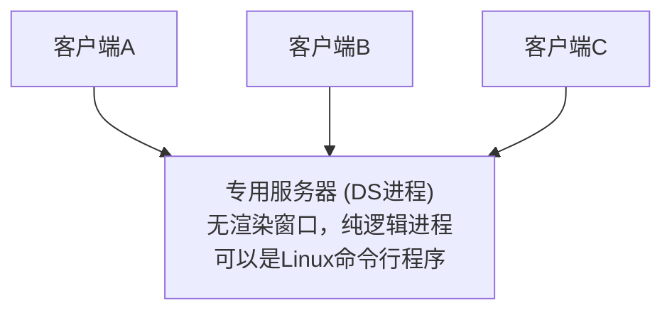

Dedicated Server 是 C/S 的特例：服务器是一台独立运行的进程，没有渲染、没有UI、纯逻辑。
与 Listen Server 的区别：Listen Server = 一个玩家同时是服务器（有渲染）；DS = 独立进程（更稳定，CPU用于逻辑而非渲染）。

#### P2P（Peer-to-Peer）— 有限场景可用

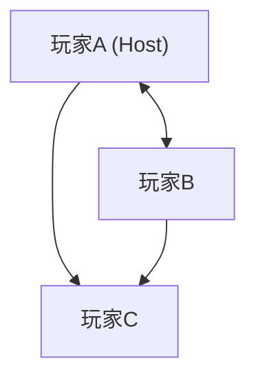

### 5.1.2 三种架构选型指南

| 维度 | C/S（Dedicated Server） | P2P |
|------|------------------------|-----|
| **反作弊** | ✅ 强（服务器验证） | ❌ 弱（Host可改数据） |
| **成本** | 高（需服务器） | 低（无服务器） |
| **Host断线** | N/A（无Host概念） | 必须处理（主机迁移） |
| **延迟** | 取决于服务器位置 | 局域网极低 |
| **适用** | 竞技/FPS/MOBA/大型网游 | 休闲合作/局域网联机 |
| **Unity实现** | NGO + Dedicated Server | NGO Host模式 |
| **UE实现** | Dedicated Server Build | Listen Server |

### 5.1.3 主机迁移（Host Migration）— P2P特有的难题

当 P2P 中的 Host 掉线时，需要选一个新 Host：

```
1. 检测Host掉线（心跳超时）
2. 在剩余玩家中选择新Host（选延迟最低、硬件最好的）
3. 新Host收集所有玩家的最新状态，重建权威世界
4. 迁移期间游戏短暂暂停，或显示"迁移中"提示
5. 迁移完成，游戏继续
```

Unity NGO 有实验性的 Host Migration 支持，UE 的 Listen Server 也可以配合 Session 系统实现。

### 5.1.4 面试标准答案

> **"你们游戏用的是什么网络架构？为什么？"**

"我们用的是 Client-Server 架构。服务器（Dedicated Server）是唯一权威，所有关键逻辑——移动验证、伤害计算、掉落判定——都在服务器执行。客户端只负责接收输入、发送给服务器、根据服务器返回的状态做表现。

选择这个架构的原因是：我们的游戏有PVP竞技，反作弊是第一优先级。如果让客户端做权威，玩家可以修改本地数据获得不公平优势。服务器验证虽然增加了一点点延迟感，但通过客户端预测（见5.4节）可以大幅减轻。"

---

## 5.2 状态同步（State Synchronization）

**重要程度**：★★★★★ 必须掌握

**原因**：这是最主流的同步方式。Unreal 的 Replication 系统就是状态同步的标杆实现。面试必问"状态同步和帧同步的区别"。

### 5.2.1 什么是状态同步？

**核心思想**：服务器计算游戏状态，把状态的变化同步给客户端。客户端收到的不是"玩家按了什么键"，而是"玩家到了什么位置、血量变成了多少"。

```
每一帧的流程：
  ① 客户端发送输入到服务器
  ② 服务器收集所有客户端的输入
  ③ 服务器执行游戏逻辑，产生新的游戏状态
  ④ 服务器计算状态变化（哪些属性变了）
  ⑤ 服务器广播状态变化给所有客户端
  ⑥ 客户端收到后更新本地表现
```

### 5.2.2 增量同步 vs 全量同步

**全量同步**：每次都把完整状态发过去。适合状态小、变化频繁的情况。

**增量同步（更常用）**：只发送变化的部分。

```
Dirty Mask（脏标记）机制：

对象有属性: Position, Health, Ammo, Score
这一帧只有 Health 和 Ammo 变了

  DirtyMask = 0110  (bit 1和2标记为脏)
  序列化时只序列化 Health 和 Ammo 的值
  发送: [DirtyMask(1字节)] [Health(4字节)] [Ammo(2字节)]
  而不是: [Position(12B)][Health(4B)][Ammo(2B)][Score(4B)] = 22字节
  → 节省 64% 的带宽

这正是 Unreal Replication 和 Unity NGO 的底层机制
```

### 5.2.3 状态同步 vs 帧同步（面试必考对比题）

| 维度 | 状态同步 | 帧同步（Lockstep） |
|------|---------|-------------------|
| **同步什么** | 游戏状态（位置、血量） | 玩家输入（按键） |
| **谁计算逻辑** | 服务器计算 → 广播结果 | 所有客户端各自计算 |
| **服务器负担** | 重（跑游戏逻辑+物理） | 轻（只需转发输入） |
| **带宽** | 较高（几十KB/s/玩家） | 较低（几KB/s） |
| **确定性要求** | 无（服务器是权威） | 极高（所有客户端结果必须一致） |
| **断线重连** | 快（获取最新快照即可） | 慢（需重放所有帧） |
| **反外挂** | 好（服务器不发给外挂者不该看的数据） | 差（所有客户端拥有全部状态） |
| **观战/回放** | 需额外实现 | 天然支持（回放=重放输入） |
| **代表游戏** | FPS（守望先锋）、MMO、大多数网游 | MOBA（王者荣耀/英雄联盟）、RTS |
| **适用场景** | 状态量大、单位多的游戏 | 状态量小、需要确定性的游戏 |

### 5.2.4 Unity NGO 中的状态同步

Unity NGO 的 `NetworkVariable<T>` 就是状态同步的典型实现：

```csharp
using Unity.Netcode;

public class Player : NetworkBehaviour
{
    // NetworkVariable 自动处理 Dirty检测 + 增量同步
    public NetworkVariable<Vector3> Position = new NetworkVariable<Vector3>(
        Vector3.zero,
        NetworkVariableReadPermission.Everyone,   // 所有人都能读
        NetworkVariableWritePermission.Server     // 只有服务器能写
    );
    
    public NetworkVariable<float> Health = new NetworkVariable<float>(
        100f,
        NetworkVariableReadPermission.Everyone,
        NetworkVariableWritePermission.Server
    );
    
    // [ServerRpc] 客户端调用，在服务器执行
    [ServerRpc]
    void MoveServerRpc(Vector3 direction)
    {
        if (!IsServer) return;
        
        // 服务器执行移动逻辑
        Vector3 newPos = transform.position + direction * moveSpeed * Time.deltaTime;
        
        // 直接修改 NetworkVariable，NGO 自动同步到客户端
        Position.Value = newPos;
    }
    
    void Update()
    {
        if (IsOwner && IsClient)
        {
            // 本地玩家：收集输入，发给服务器
            Vector3 input = new Vector3(Input.GetAxis("Horizontal"), 0, Input.GetAxis("Vertical"));
            if (input.magnitude > 0)
                MoveServerRpc(input.normalized);
        }
        
        if (!IsServer)
        {
            // 客户端：平滑插值到服务器权威位置
            transform.position = Vector3.Lerp(transform.position, Position.Value, Time.deltaTime * 20f);
        }
    }
}
```

### 5.2.5 Unreal 中的状态同步

UE 的 `UPROPERTY(Replicated)` 是状态同步的标杆实现：

```cpp
// .h 文件
UCLASS()
class AMyCharacter : public ACharacter
{
    GENERATED_BODY()
    
public:
    // 标记为需要同步的属性
    UPROPERTY(Replicated)
    FVector Position;
    
    UPROPERTY(ReplicatedUsing = OnRep_Health)
    float Health;
    
    // 当 Health 在客户端同步变化时触发
    UFUNCTION()
    void OnRep_Health();
    
    // 声明属性的生命周期（告诉引擎哪些属性要同步）
    virtual void GetLifetimeReplicatedProps(TArray<FLifetimeProperty>& OutLifetimeProps) const override;
};

// .cpp 文件
#include "Net/UnrealNetwork.h"

void AMyCharacter::GetLifetimeReplicatedProps(TArray<FLifetimeProperty>& OutLifetimeProps) const
{
    Super::GetLifetimeReplicatedProps(OutLifetimeProps);
    
    // 无条件同步给所有客户端
    DOREPLIFETIME(AMyCharacter, Position);
    
    // 只同步给 Owner（拥有这个角色的玩家）
    DOREPLIFETIME_CONDITION(AMyCharacter, Health, COND_OwnerOnly);
}

void AMyCharacter::OnRep_Health()
{
    // 客户端收到新的血量时自动回调
    UpdateHealthBar(Health);
    if (Health <= 0)
        PlayDeathAnimation();
}

// 服务器修改属性，自动触发同步
void AMyCharacter::TakeDamage(float Damage)
{
    if (HasAuthority())  // 只在服务器执行
    {
        Health -= Damage;  // UE 自动检测变化 → 序列化 → 发送给客户端
    }
}
```

**UE 的同步条件（Replication Condition）**：

| 条件 | 含义 | 使用场景 |
|------|------|---------|
| `COND_None` | 同步给所有客户端 | 位置、可见状态 |
| `COND_OwnerOnly` | 只发给Owner | 血量（只有你自己需要精确血量） |
| `COND_SkipOwner` | 发给除Owner外的所有人 | 角色外观（自己不需要收到自己的外观） |
| `COND_InitialOnly` | 只在初始化时发一次 | 角色名字、初始配置 |

### 5.2.6 面试标准答案

> **"什么是状态同步？你们是怎么做的？"**

"状态同步的核心是：服务器计算游戏状态，把状态变化同步给客户端。

实现上我们用了增量同步 + Dirty标记。每个需要同步的对象维护一个变化掩码——只有当属性值真正改变时才标记为脏。每帧结束时，服务器遍历所有连接，对每个连接只序列化对该连接相关的对象的脏属性。这样避免了全量同步的带宽浪费。

在Unity中，我们使用NGO的NetworkVariable，它内部封装了Dirty检测和增量序列化。
在Unreal中，使用Replicated Properties，通过DOREPLIFETIME宏声明需要同步的属性，UE自动处理变化检测和同步。"

---

## 5.3 帧同步（Lockstep）

**重要程度**：★★★★★ 必须掌握

**原因**：MOBA 和 RTS 的经典方案。国内面试非常喜欢问帧同步——因为王者荣耀等热门游戏使用了帧同步。

### 5.3.1 什么是帧同步？

**核心思想**：不是同步状态，而是同步**操作**。所有客户端从相同的初始状态开始，执行完全相同的输入序列，得到完全相同的状态。

```
原理（类比）：
  两个孩子玩同一个乐高积木
  他们从完全相同的初始积木开始（相同的初始状态）
  每一步，双方都被告知同样的搭建指令："放红色方块在位置(3,5)"
  因为是同样的积木+同样的指令 → 最后搭出来的东西一定一样
  
帧同步的"指令" = 玩家输入，"积木" = 游戏状态
```

### 5.3.2 帧同步的完整流程

```
时间轴（每个逻辑帧 = 66ms，即每秒15帧）:

帧N:
  ① 所有玩家发送自己在帧N的输入（按键）
  ② 等待所有输入到齐（或超时）
  ③ 服务器广播所有输入给所有玩家
  ④ 所有客户端（和服务器）执行帧N的逻辑
     ExecuteFrame(frameN, inputs)
     → 移动计算、碰撞检测、技能判定...
  ⑤ 所有客户端得到完全相同的帧N结束状态

帧N+1:
  重复①~⑤

关键区别：
  状态同步：服务器算状态 → 广播状态
  帧同步：  广播输入 → 所有客户端各自算状态
```

### 5.3.3 帧同步的"确定性"问题（最核心的挑战）

**确定性** = 相同的初始状态 + 相同的输入序列 → 相同的结果

这是帧同步最大的难点！以下任何一点不一致都会导致"不同步"（desync）：

| 问题源 | 为什么会导致不同步 | 解决方案 |
|--------|------------------|---------|
| **浮点数** | `0.1 + 0.2 != 0.3` 在不同CPU/编译器上可能不同 | **用定点数**替代浮点数（如×1000存为int） |
| **随机数** | 不同客户端调用 `rand()` 结果不同 | 统一随机种子，使用确定性随机数生成器（如Mersenne Twister带相同种子） |
| **容器遍历顺序** | `Dictionary`/`HashSet` 的遍历顺序不确定 | 使用有序容器（`SortedDictionary`/`List`），避免依赖遍历顺序 |
| **物理引擎** | PhysX/Box2D 不一定保证确定性 | 使用确定性物理，或自实现简化物理 |
| **帧率** | 渲染帧率（30/60/120fps）和逻辑帧率（15fps）不同 | 逻辑帧和渲染帧分离：逻辑帧固定频率，渲染帧独立插值 |
| **多线程** | 不同CPU核心的执行顺序不同 | 逻辑帧内禁用多线程，单线程执行 |

### 5.3.4 定点数（Fixed-Point Math）详解

这是帧同步面试中必问的：

```csharp
// 不用 float（不精确）
float posX = 1.5f;
posX += 0.1f;  // 可能是 1.600000023...

// 用定点数（精确）
public struct FPFloat  // Fixed-Point Float
{
    long rawValue;  // 实际值 = rawValue / SCALE
    const long SCALE = 1000;  // 精度：3位小数
    
    public static FPFloat FromFloat(float f) => new FPFloat { rawValue = (long)(f * SCALE) };
    public float ToFloat() => (float)rawValue / SCALE;
    
    public static FPFloat operator +(FPFloat a, FPFloat b) 
        => new FPFloat { rawValue = a.rawValue + b.rawValue };
    
    // 乘法需要注意溢出和精度
    public static FPFloat operator *(FPFloat a, FPFloat b)
        => new FPFloat { rawValue = (a.rawValue * b.rawValue) / SCALE };
        // (1.500 * 2.000) = (1500 * 2000) / 1000 = 3000 → 3.000 ✓
}

// 使用：
FPFloat posX = FPFloat.FromFloat(1.5f);
posX += FPFloat.FromFloat(0.1f);  
// posX.rawValue = 1500 + 100 = 1600 → 1.600 ← 精确！
// 在所有平台、所有编译器上结果完全一致
```

**为什么定点数保证确定性？**
因为整数运算在所有CPU上结果一致。`1500 + 100` 在任何计算机上都等于 `1600`。而浮点数 `1.5 + 0.1` 的二进制表示和舍入方式可能因平台而异。

### 5.3.5 乐观帧同步 vs 悲观帧同步

| 方式 | 策略 | 优点 | 缺点 | 使用者 |
|------|------|------|------|--------|
| **悲观**（严格Lockstep） | 必须等所有玩家输入到齐才执行帧 | 强一致性 | 延迟=最慢玩家的延迟 | 传统RTS |
| **乐观**（Predictive Lockstep） | 不等，预测其他玩家输入先执行；收到后如果不一致→回滚 | 延迟感更低 | 预测错误需回滚 | 王者荣耀等的现代MOBA |

### 5.3.6 帧同步的断线重连（难点）

```
问题：玩家在帧500断了，到了帧2000才连回来
  错过了1500帧的输入数据

解决方案：
  1. 服务器保存关键帧快照（如每100帧一个快照）
  2. 最近快照在帧500
  3. 客户端下载快照+帧500~2000的输入序列
  4. 客户端从帧500开始"追帧"（Fast-Forward）：
     - 以极快速度执行帧500→2000的所有逻辑
     - 不渲染、不播放动画
     - 只更新内部状态
  5. 追上当前帧2000 → 开始正常渲染
```

**为什么帧同步重连比状态同步慢？**
- 状态同步：服务器直接给最新状态快照 → 瞬间恢复
- 帧同步：需要重放所有错过的帧 → 断线越久，重连越慢

### 5.3.7 帧同步在Unity中的实现要点

```csharp
// 逻辑帧与渲染帧分离
public class LockstepCore : MonoBehaviour
{
    const int LOGIC_FRAME_RATE = 15;  // 每秒15逻辑帧
    const float LOGIC_DELTA = 1f / LOGIC_FRAME_RATE;  // 0.066s
    
    int currentLogicFrame = 0;
    FPFloat deltaTime = FPFloat.FromFloat(LOGIC_DELTA);
    
    // 待执行的输入队列
    Queue<FrameInput> pendingInputs = new Queue<FrameInput>();
    
    void Update()
    {
        // Update() 跑在渲染帧率（60fps）
        // 收集本地玩家输入
        GatherInput();
        
        // 驱动逻辑帧
        accumulatedTime += Time.deltaTime;
        while (accumulatedTime >= LOGIC_DELTA && pendingInputs.Count > 0)
        {
            var frameInput = pendingInputs.Dequeue();
            ExecuteLogicFrame(frameInput);  // 用定点数跑所有逻辑！
            currentLogicFrame++;
            accumulatedTime -= LOGIC_DELTA;
        }
        
        // 渲染帧做插值，让画面平滑
        float t = accumulatedTime / LOGIC_DELTA;
        InterpolateRenderState(t);
    }
    
    void ExecuteLogicFrame(FrameInput input)
    {
        // ⚠️ 这里面所有运算必须用定点数！
        // ⚠️ 不能调用 Time.deltaTime（那是渲染帧的）
        foreach (var playerInput in input.playerInputs)
        {
            // 定点数移动
            FPFloat moveX = FPFloat.FromFloat(playerInput.horizontal) * moveSpeed * deltaTime;
            player.FPX += moveX;
            
            // 定点数碰撞检测
            // 确定性随机
            // ...
        }
    }
}
```

### 5.3.8 面试标准答案

> **"帧同步和状态同步有什么区别？各自的优缺点？"**

这是王者级面试题。标准回答：

"本质区别是**同步的内容不同**：
- 状态同步同步的是'游戏状态'（位置、血量），逻辑在服务器跑，客户端只是播放器
- 帧同步同步的是'玩家输入'（按键），逻辑在所有客户端各自跑，结果必须一致

带宽上：帧同步只需同步输入（几KB/s），远低于状态同步（几十KB/s）
确定性的要求上：帧同步要求所有客户端的运算结果完全一致，这是最大的技术挑战——浮点数要用定点数替代、随机数要统一种子、容器要保证遍历顺序、物理引擎要用确定性版本

反外挂上：状态同步更好，因为服务器可以控制谁看到什么数据；帧同步所有客户端都知道所有状态
断线重连上：状态同步秒恢复（拿快照），帧同步断线久了重连很慢（要重放所有帧）
回放/观战上：帧同步天然支持（回放=重放输入序列），状态同步需额外开发

选择上：MOBA/RTS 状态量小但单位多、对带宽敏感，适合帧同步；FPS/MMO 状态量大、对反外挂要求高，适合状态同步。"

> **"帧同步浮点数问题怎么解决？"**

"用定点数。把浮点数乘以一个系数（如1000）转成整数存储和运算，所有运算都用整数完成。因为整数运算在所有平台上结果完全一致，所以保证确定性。自己实现一个定点数类型（FPFloat），支持加减乘除、开方、三角函数等基本运算。ET框架就有一套完善的定点数数学库。"

---

## 5.4 客户端预测（Client-Side Prediction）

**重要程度**：★★★★★ 必须掌握

**原因**：FPS/动作游戏的核心技术。面试中能画图解释客户端预测+服务器协调的完整流程，说明你是真正做过网络同步的。

### 5.4.1 客户端预测 — 完整过程串讲

> 这是游戏网络同步中最重要的一段内容。面试时你应该能从"问题是什么"一口气讲到"怎么纠正错误"。

**问题**：假设你的网络到服务器 ping 50ms（RTT 100ms）。在传统的 C/S 架构下，你按下 W 键之后发生了什么？客户端把输入发给服务器（50ms 到达），服务器执行移动逻辑，算出新位置，把结果广播回来（再 50ms 到达）——总延迟 100ms 后，你的角色才开始移动。100ms 的操作延迟感非常明显，玩家会觉得角色"不听使唤"，就像在远程桌面上操作一样。

**解决方案的核心思路**：客户端不等服务器确认，**先斩后奏**。你按下 W 键的那一刻，客户端立刻在本地执行移动逻辑——角色当场就动了，0ms 延迟。同时，输入照常发给服务器。服务器收到后也执行同样的移动逻辑，算出一个"权威位置"发回来。客户端拿到权威位置后，跟自己的预测位置比一比——如果一致，万事大吉；如果不一致，就以权威位置为准纠正。

**那什么时候会不一致？** 最常见的情况是碰撞。客户端预测自己往前走，它不知道路上有另一个玩家正在穿过来——因为那个玩家的实时位置也是服务器广播的，客户端收到的可能有延迟。服务器掌握所有玩家的实时位置，所以服务器算出来的位置才是正确的——客户端没算到碰撞，预测偏了。这时候就需要纠正。

**纠正机制（Server Reconciliation）**：客户端需要保存"输入历史"和"预测快照历史"，因为服务器返回的权威位置对应的是过去某个时刻的输入（比如 100ms 前你发的那个输入，服务器刚刚处理完）。具体流程：

1. 客户端维护一个环形缓冲区，每帧把自己发出的输入和一个预测出来的位置快照一起存进去：`[tick=100, input=W, pos_predict=X]`、`[tick=101, input=W, pos_predict=Y]`，依此类推
2. 服务器返回消息："你第 100 帧的权威位置是 Z"
3. 客户端从历史中找到第 100 帧的预测快照，比较 X 和 Z
4. **如果误差很小（<0.3m）**：忽略，这是正常浮点数精度范围内的误差，服务器和客户端的计算结果基本一致
5. **如果误差中等（0.3m~3m）**：预测基本正确但有偏差。保留当前快照中后续的预测，但对当前位置做一个平滑修正——不跳变，用 Lerp 逐渐拉向权威位置
6. **如果误差很大（>3m）**：碰撞这类事情导致预测完全错了。当前快照的预测位置硬设为服务器的权威位置，然后拿着后续所有未被确认的输入，以权威位置为起点重新模拟一遍（Re-simulation）。这就是"回滚"——角色可能会跳一下，但后续状态就对了

**什么东西绝对不能客户端预测？** 伤害判定。如果客户端说"我打中了"就算打中了，那外挂直接改客户端代码就能秒杀所有人。所以：移动、动画、特效这些"表现层"的东西可以客户端预测；伤害、死亡、拾取、技能冷却这些"判定层"的东西必须服务器说了算。客户端可以先播一个命中特效（表现层预测），但真正的扣血必须等服务器确认。

### 5.4.2 哪些可以预测，哪些不能？

### 5.4.4 哪些可以预测，哪些不能预测？

| ✅ 可以预测 | ❌ 不能预测（必须服务器判定） |
|-----------|------------------------|
| 自己的移动 | 伤害判定（有没有打中） |
| 自己的动画播放 | 其他玩家的行为 |
| 自己的技能前摇 | 物品拾取 |
| 本地特效 | 角色死亡判定 |
| 本地音效 | 掉落/奖励确认 |

**规则**：表现层可以预测，判定层必须服务器验证。

### 5.4.5 在Unreal中的实现

UE的 `CharacterMovementComponent` **内置了完整的客户端预测**，这是UE最强大的网络特性之一：

```cpp
// UE自动处理以下流程（开发者几乎不需要写额外代码）：
// 1. 本地玩家输入 → CMC立即执行移动 → 即时响应
// 2. 输入同时发送给服务器
// 3. 服务器CMC也执行移动 → 得到服务器权威位置
// 4. 服务器位置自动复制回客户端
// 5. 客户端CMC自动比较预测位置和服务器位置
// 6. 自动平滑纠正（不跳变）

// 配置网络平滑参数（Project Settings或代码中）：
// p.NetEnableListenServerSmoothing 1
// p.NetEnableSmoothing 1
```

**GAS（GameplayAbilitySystem）中的预测**：
```cpp
// 技能激活时指定预测策略
UCLASS()
class UGA_Shoot : public UGameplayAbility
{
    // Instancing Policy
    // ...
};

// 激活时：
// 如果配置了 LocalPredicted：
//   1. 客户端立即激活技能（预测）
//   2. 技能在服务器也激活
//   3. 如果服务器判定不合法（如没蓝了）→ 服务器拒绝 → 客户端回滚
```

### 5.4.6 在Unity中的实现（NGO不支持内置预测，需自己实现）

```csharp
public class ClientPredictionMovement : NetworkBehaviour
{
    struct InputRecord
    {
        public int tick;
        public Vector3 input;
        public Vector3 predictedPosition;
    }
    
    Queue<InputRecord> pendingInputs = new();  // 尚未被服务器确认的输入
    int currentTick = 0;
    float moveSpeed = 5f;
    
    void Update()
    {
        if (!IsOwner) return;
        
        Vector3 input = new Vector3(Input.GetAxis("Horizontal"), 0, Input.GetAxis("Vertical"));
        if (input.magnitude > 0)
        {
            input = input.normalized * Mathf.Min(input.magnitude, 1f);
            
            // 客户端立即预测
            Vector3 predicted = MoveSimulation(transform.position, input);
            transform.position = predicted;
            
            // 保存预测记录
            pendingInputs.Enqueue(new InputRecord 
            { 
                tick = currentTick, 
                input = input, 
                predictedPosition = predicted 
            });
            
            // 发送给服务器
            SendMoveInputServerRpc(input, currentTick);
            currentTick++;
        }
    }
    
    [ServerRpc]
    void SendMoveInputServerRpc(Vector3 input, int tick)
    {
        // 服务器验证移动合法性
        Vector3 newPos = MoveSimulation(transform.position, input);
        
        // 验证：移动距离是否合理？（防外挂：防止瞬移）
        float moveDist = Vector3.Distance(transform.position, newPos);
        float maxPossibleDist = moveSpeed * Time.fixedDeltaTime * 1.1f;  // 10%容差
        if (moveDist > maxPossibleDist)
        {
            newPos = transform.position;  // 拒绝不合理的移动
        }
        
        transform.position = newPos;
        
        // 返回权威位置给客户端
        ConfirmPositionClientRpc(newPos, tick);
    }
    
    [ClientRpc]
    void ConfirmPositionClientRpc(Vector3 serverPosition, int tick)
    {
        if (!IsOwner) return;
        
        // 找到对应tick的预测记录
        while (pendingInputs.Count > 0 && pendingInputs.Peek().tick <= tick)
        {
            var record = pendingInputs.Dequeue();
            
            if (record.tick == tick)
            {
                // 比较预测位置和服务器位置
                float error = Vector3.Distance(record.predictedPosition, serverPosition);
                
                if (error > 1.0f)  // 误差超过1米
                {
                    // 回滚：以服务器位置为准
                    transform.position = serverPosition;
                    
                    // 重新预测后续所有未确认的输入
                    RePredictPendingInputs();
                }
                // 误差小则忽略，继续正常预测
            }
        }
    }
    
    Vector3 MoveSimulation(Vector3 from, Vector3 input)
        => from + input * moveSpeed * Time.fixedDeltaTime;
    
    void RePredictPendingInputs()
    {
        Vector3 currentPos = transform.position;
        foreach (var record in pendingInputs)
        {
            record.predictedPosition = MoveSimulation(currentPos, record.input);
            currentPos = record.predictedPosition;
        }
        // 更新当前位置到最后预测的位置
        if (pendingInputs.Count > 0)
        {
            var last = pendingInputs.ToArray()[^1];
            transform.position = last.predictedPosition;
        }
    }
}
```

### 5.4.7 面试标准答案

> **"怎么解决网络延迟带来的操作延迟感？"**

"用客户端预测。原理是：客户端收到玩家输入后，不等服务器确认，立即在本地执行移动/技能逻辑，让玩家感觉零延迟。同时把输入发给服务器，服务器也执行同样的逻辑得到权威结果。客户端收到权威结果后，对比自己的预测位置——如果误差小（正常情况），继续正常显示；如果误差大，以服务器位置为准，重新预测后续未确认的输入来平滑纠正。

要注意的是：客户端只预测表现层（移动、动画、特效），伤害判定、死亡、拾取等关键逻辑必须在服务器验证，防止外挂。"

---

## 5.5 插值（Interpolation）— 让其他玩家看起来不卡顿

**重要程度**：★★★★★ 必须掌握

**原因**：你看到的其他玩家是通过插值渲染的。理解插值和客户端预测的区别是关键。

### 5.5.1 问题

```
如果没有插值：
  服务器每50ms广播一次其他玩家的位置
  客户端收到后直接设置位置
  → 其他玩家的移动是"一跳一跳"的（因为50ms才更新一次）
  → 而且网络包到达时间不均匀（抖动），更显卡顿
```

### 5.5.2 解决方案：插值缓冲

```
客户端维护一个"过去状态"的缓冲区（通常缓冲100ms的数据）：

时间轴：
  t=0:    收到 pos_0
  t=50ms: 收到 pos_1
  t=100ms: 收到 pos_2
  t=150ms: 收到 pos_3

客户端的渲染时间线（延迟100ms）：
  t=0:     不渲染（还没凑够缓冲）
  t=100ms: 开始渲染！在 pos_0 和 pos_1 之间插值
  t=120ms: Lerp(pos_0, pos_1, 0.4)
  t=150ms: 用 pos_1（收到了pos_3，在pos_1和pos_2之间插值）
  t=180ms: Lerp(pos_1, pos_2, 0.6)

即使网络包到达不均匀，渲染始终有数据可插值 → 平滑！
代价：看到的是100ms前的过去状态
```

### 5.5.3 插值和客户端预测的区别（容易混淆）

| 维度 | 客户端预测 | 插值 |
|------|----------|------|
| **对象** | 自己控制的角色 | 其他玩家的角色 |
| **目标** | 消除操作延迟感 | 让其他玩家看起来平滑 |
| **策略** | 立即预测执行 | 延迟渲染，在已知状态间插值 |
| **时间方向** | 预测未来（向前看） | 回放过去（向后看） |
| **UE角色** | Autonomous Proxy | Simulated Proxy |

### 5.5.4 Unity和Unreal中的实现

**Unity NGO** 的 `NetworkTransform` 自动处理插值：
```csharp
var networkTransform = GetComponent<NetworkTransform>();
// 插值缓冲（秒），越大越平滑但看到的状态越旧
// 默认值通常够用
```

**Unreal** 的 `CharacterMovementComponent` 对 Simulated Proxy 自动插值。项目设置中的 `p.NetEnableSmoothing` 开启此项功能。

---

## 5.6 延迟补偿（Lag Compensation）— FPS判定的关键技术

**重要程度**：★★★★☆ 高频

**原因**：FPS 射击判定的核心技术。守望先锋的 "Favor the Shooter" 设计就是这个。

### 5.6.1 问题

```
玩家A（ping 50ms）瞄准了玩家B的头 → 开枪
但在服务器看来（收到A的射击请求时），
B已经因为自己的50ms延迟多走了50ms的距离
→ A明明在屏幕上瞄到了头，但服务器判定没打中
→ A的体验："我明明打中了他！"
```

### 5.6.2 解决方案：回溯判定

```
服务器维护过去N毫秒（如500ms）的所有玩家的位置快照：

  snapshots = {
    t-500ms: {A: pos_a_500, B: pos_b_500, ...}
    t-450ms: {A: pos_a_450, B: pos_b_450, ...}
    ...
    t-50ms:  {A: pos_a_50,  B: pos_b_50,  ...}
    t(现在):  {A: pos_a_0,   B: pos_b_0,   ...}
  }

收到A的射击请求时：
  1. A的延迟 = 50ms（半RTT）
  2. 查找 t-50ms 时的快照 → 那是A真正看到的世界
  3. 用快照中的位置做命中判定
  4. 如果命中 → 服务器确认伤害（即使B现在已经不在那里了）

结果：A看到打中了 → 服务器回溯到A的视角 → 判定打中！
```

### 5.6.3 "我已经躲到掩体后面了怎么还被打到？"

这就是延迟补偿的"代价"。因为判定偏向射击方（Shooter-Favored）：

- 在B的屏幕上，B已经躲进掩体了
- 但在A的屏幕上（由于A的延迟），B还没躲进去
- 服务器回溯到A看到的时刻 → B确实没躲进去 → 判定A命中
- B的感觉："我都躲进去了怎么还被打到！"

**设计取舍**：没有完美方案。选择偏向射击方（大多数FPS的做法）可以让进攻方体验更好。有的游戏限制最大补偿时间（如200ms），超过阈值的延迟不被补偿。

### 5.6.4 面试标准答案

> **"FPS游戏中，为什么我明明打中了对方却没有判定命中？反过来，为什么我已经躲进掩体了还被打到？"**

"这两个问题的原因都是延迟补偿（Lag Compensation）。

第一个情况（打中了没判定）：如果网络极差，你的延迟超过了服务器设置的最大补偿阈值（通常150-200ms），服务器就不会补偿你的视角，用服务器当前状态判定 → 你没打中。

第二个情况（躲进去还被打到）：这是延迟补偿的代价。服务器偏向射击方——当你被击中时，服务器回溯到你对手的视角。虽然你看起来已经躲进去了，但在对手的屏幕上（有50ms延迟），你还没完全躲进去。服务器用对手看到的状态做判定 → 你被打到了。

这是FPS游戏的设计取舍：一般偏向射击方（'Favor the Shooter'），让进攻体验更好。"

---

## 5.7 可靠UDP — 在UDP之上实现"选配式"可靠性

**重要程度**：★★★★☆ 高频

**原因**：理解KCP/ENet原理。面试中能解释"为什么不用TCP但又要可靠"说明你有设计网络协议的能力。

### 5.7.1 为什么需要可靠UDP？

回顾第2章：
- TCP：太慢（拥塞控制、队头阻塞），但保证可靠
- UDP：快但不可靠（丢包、乱序）

我们想要：**UDP的速度 + 选择性的可靠性**

### 5.7.2 可靠UDP在协议栈中的位置

```
应用层:    游戏逻辑（只关心"消息"）
             ↓
可靠UDP层:  KCP / ENet / 自定义协议
             ↓           可靠传输层的职责：
         ┌───────┐       ① 分片与重组
         │  UDP  │       ② 序列号与ACK
         └───────┘       ③ 重传（超时/NACK触发）
             ↓           ④ 流量控制（简化）
         IP层/物理层      ⑤ 可选的有序/可靠
```

### 5.7.3 KCP 协议核心理念

KCP（国内知名可靠UDP协议，C语言实现，纯算法库）：

```
KCP 不负责底层UDP收发——它只是一个"把应用数据变成可靠UDP包"的算法库

你给 KCP 喂应用层数据：
  ikcp_send(kcp, data, len);
  
KCP 内部处理分段、序列号、ACK、重传等逻辑

KCP 输出UDP包：
  ikcp_output(kcp, buffer, len);
  // 你把这个 buffer 直接 sendto 出去

接收端：
  // 从UDP收到数据
  ikcp_input(kcp, receivedData, len);
  // KCP内部处理后，通过回调返回有序可靠数据
  ikcp_recv(kcp, buffer, len);
```

**KCP 为什么比 TCP 快？**

| TCP 的做法 | KCP 的做法 | 效果 |
|-----------|-----------|------|
| RTO 每次翻倍（保守） | RTO ×1.5（激进） | 丢包后更快重传 |
| 3个重复ACK触发快速重传 | 可配置为2个或1个 | 不等超时，更快发现丢包 |
| 拥塞控制强制开启 | 可选择关闭 | 应用层控制发送速率 |
| 所有数据全局有序 | 可选无序通道 | 避免队头阻塞 |
| 没有NACK | 支持NACK（告诉对方哪些包丢了） | 不等超时 |

### 5.7.4 消息类型设计

在自己的协议中，每条消息标记可靠性级别：

```cpp
enum EReliability
{
    Unreliable,           // 不可靠：丢了就丢了（位置更新、特效）
    ReliableUnordered,    // 可靠无序：保证送达，不管顺序（聊天）
    ReliableOrdered,      // 可靠有序：保证送达+顺序（技能释放）
};

struct MessageHeader
{
    uint16_t type;         // 消息类型
    uint16_t sequence;     // 序列号
    uint8_t reliability;   // 可靠性级别（对应 EReliability）
    uint8_t channel;       // 通道号（同一个通道内保证有序）
    uint16_t length;       // 消息体长度
};
```

### 5.7.5 面试标准答案

> **"了解KCP/ENet吗？可靠UDP怎么实现？"**

"KCP是一个纯算法的可靠UDP协议库。它的核心思路是：在UDP之上用序列号追踪每个包的送达状态，用ACK和NACK反馈丢包信息，用比TCP更激进的重传策略来降低延迟。

和TCP的关键区别：
1. RTO不翻倍（×1.5而非×2），丢包后更快重传
2. 选择性关闭拥塞控制，让应用层控制发送速率
3. 支持无序通道，避免队头阻塞
4. 支持NACK（主动告诉对方丢了哪个包），不等超时

我们项目中用KCP封装了三条通道：通道0（可靠有序）用于技能和状态变化，通道1（可靠无序）用于聊天，通道2（不可靠）用于位置更新。这样比TCP灵活得多。"

---

## 5.8 断线重连

**重要程度**：★★★★☆ 高频

### 5.8.1 状态同步的重连（快）

```
1. 客户端检测到断线 → 进入重连状态
2. 重新建立连接（TCP三次握手 + 可能的TLS握手）
3. 向服务器请求当前状态（"我断了，给我最新状态"）
4. 服务器发送当前快照
5. 客户端恢复 → 继续游戏

典型时间：1~3秒
```

### 5.8.2 帧同步的重连（慢但可优化）

```
1. 客户端断线（比如在帧500）
2. 重连在帧2000
3. 请求服务器：从帧500开始的快照 + 帧500~2000的输入
4. 服务器返回最近的快照（帧0）+ 帧0~2000的输入
5. 客户端"追帧"：快速执行帧0→2000的逻辑
   - 设置 TimeScale = 10x 甚至更高
   - 跳过渲染、跳过音效
   - 只更新内部状态
6. 追上当前帧2000 → 恢复正常速度

优化：服务器每N帧保存一次快照，减少需重放的帧数
```

### 5.8.3 面试标准答案

> **"你们的游戏怎么做断线重连？"**

"状态同步的重连很简单：重连后服务器直接给最新状态快照，客户端恢复渲染即可。

帧同步的重连需要'追帧'：服务器保存了关键帧快照（比如每100帧一个），重连时客户端下载最近的快照和之后所有的输入，然后以10倍速快速执行这些逻辑帧直到追上当前帧。执行期间不渲染不播动画，只更新内部状态。这就是为什么MOBA游戏重连需要几秒到十几秒。"

---

## 5.9 带宽优化技巧

**重要程度**：★★★★☆ 高频（移动端开发特别重视）

| 技巧 | 方法 | 效果 |
|------|------|------|
| **量化** | float(4B) → 定点数 → int16(2B) → int8(1B) | 节省50-75% |
| **位域打包** | 多个bool打包到1字节 | 极省 |
| **AOI裁剪** | 只同步玩家周围一定范围内的实体 | 大量减少 |
| **LOD同步** | 远的实体降低同步频率 | 减少 |
| **增量编码** | 发delta而非绝对值 | 减少 |
| **压缩** | LZ4/Zstd快速压缩序列化数据 | 减少30-70% |

**量化实例**：地图 256m×256m，精度 1cm：
```
原始：float X(4B) + float Y(4B) = 8字节
量化：
  X: 25600个可能值 → 需要15bit（2^15=32768）
  Y: 25600个可能值 → 需要15bit
  共30bit = 4字节（实际上3.75字节，对齐到4）
  → 节省50%！
```

---

# 第6章 Unity网络编程

> 本章聚焦 Unity 引擎的网络 API。如果你投 Unity 岗位，必须掌握 Netcode for GameObjects。

---

## 6.1 Unity Transport Package（UTP）

**重要程度**：★★★★★ 必须掌握

**原因**：Unity 新网络架构的底层，NGO 也是基于 UTP 构建的。

### 6.1.1 UTP 是什么？

UTP 是 Unity 2021+ 推出的新一代底层网络传输库。它是**传输层封装**，让你不用直接操作 Socket，但又能做比 HTTP 更底层的事情。

**UTP 在 Unity 网络栈中的位置**：
```
游戏逻辑代码
    ↓ 使用
Netcode for GameObjects (NGO) / 自定义网络框架
    ↓ 基于
Unity Transport Package (UTP)   ← 你在这里
    ↓ 调用
操作系统 Socket API
```

### 6.1.2 UTP 核心类

| 类 | 作用 |
|---|------|
| `NetworkDriver` | 网络驱动的核心，管理所有连接和事件 |
| `NetworkConnection` | 代表一个连接 |
| `NetworkPipeline` | 数据处理管道（可叠加：可靠、加密、压缩等Stage） |
| `NetworkEndpoint` | IP地址+端口 |
| `DataStreamWriter` | 写数据到发送缓冲区 |
| `DataStreamReader` | 从接收缓冲区读数据 |

### 6.1.3 UTP 使用示例

```csharp
using Unity.Networking.Transport;
using Unity.Collections;

public class GameTransport : MonoBehaviour
{
    NetworkDriver driver;
    NetworkConnection connection;
    
    void Start()
    {
        // 创建 Driver
        var settings = new NetworkSettings();
        driver = NetworkDriver.Create(settings);
        
        if (isServer)
        {
            // 服务器：绑定端口，开始监听
            driver.Bind(NetworkEndpoint.AnyIpv4.WithPort(7777));
            driver.Listen();
        }
        else
        {
            // 客户端：连接服务器
            var serverEndpoint = NetworkEndpoint.Parse("127.0.0.1", 7777);
            connection = driver.Connect(serverEndpoint);
        }
    }
    
    void Update()
    {
        // 每帧驱动网络（非阻塞）
        driver.ScheduleUpdate().Complete();
        
        // 处理网络事件
        NetworkConnection conn;
        DataStreamReader reader;
        NetworkEvent.Type eventType;
        
        while ((eventType = driver.PopEvent(out conn, out reader)) 
               != NetworkEvent.Type.Empty)
        {
            switch (eventType)
            {
                case NetworkEvent.Type.Connect:
                    Debug.Log("新连接！");
                    break;
                    
                case NetworkEvent.Type.Data:
                    // 从 reader 读取数据
                    int messageType = reader.ReadInt();
                    float x = reader.ReadFloat();
                    float y = reader.ReadFloat();
                    ProcessMessage(messageType, x, y);
                    break;
                    
                case NetworkEvent.Type.Disconnect:
                    Debug.Log("连接断开");
                    break;
            }
        }
    }
    
    public void SendMessage(byte[] data)
    {
        if (driver.BeginSend(connection, out var writer) == 0)
        {
            writer.WriteBytes(data);
            driver.EndSend(writer);
        }
    }
    
    void OnDestroy()
    {
        driver.Dispose();
    }
}
```

### 6.1.4 UTP 的 Pipeline（数据管道）

```csharp
// 创建可靠管道
var reliablePipeline = driver.CreatePipeline(
    typeof(ReliableSequencedPipelineStage)  // 可靠+有序
);

// 创建不可靠管道
var unreliablePipeline = NetworkPipeline.Empty;

// 发送时选择管道
driver.BeginSend(reliablePipeline, connection, out var writer);    // 可靠发送
driver.BeginSend(unreliablePipeline, connection, out var writer2); // 不可靠发送
```

---

## 6.2 Netcode for GameObjects（NGO）

**重要程度**：★★★★★ 必须掌握

**原因**：Unity 官方网络框架，Unity 网络岗位的必修课。

### 6.2.1 核心组件速查

| 组件/类 | 说明 |
|---------|------|
| `NetworkManager` | 网络管理器（单例），控制 Host/Server/Client 的启动和停止 |
| `NetworkObject` | 标记为网络对象，必须挂载 |
| `NetworkBehaviour` | 替代 MonoBehaviour，网络对象的基类 |
| `NetworkVariable<T>` | 自动同步的网络变量 |
| `NetworkTransform` | 自动同步 Transform |
| `NetworkAnimator` | 自动同步 Animator 参数 |
| `[ServerRpc]` | 客户端调用 → 服务器执行 |
| `[ClientRpc]` | 服务器调用 → 所有客户端执行 |

### 6.2.2 完整示例

```csharp
using Unity.Netcode;
using UnityEngine;

public class Player : NetworkBehaviour
{
    // ===== NetworkVariables =====
    // 自动Dirty检测、增量序列化、客户端回调
    public NetworkVariable<Vector3> ServerPosition = new(
        Vector3.zero,
        NetworkVariableReadPermission.Everyone,
        NetworkVariableWritePermission.Server
    );
    
    public NetworkVariable<int> Health = new(
        100,
        NetworkVariableReadPermission.Everyone,
        NetworkVariableWritePermission.Server
    );
    
    public NetworkVariable<int> Score = new(
        0,
        NetworkVariableReadPermission.Everyone,
        NetworkVariableWritePermission.Server
    );
    
    // ===== 生命周期 =====
    public override void OnNetworkSpawn()
    {
        // 在服务器和所有客户端都调用
        if (IsServer)
        {
            Health.Value = 100;
        }
        
        if (IsClient)
        {
            // 监听值变化（在客户端触发）
            Health.OnValueChanged += OnHealthChanged;
        }
    }
    
    public override void OnNetworkDespawn()
    {
        if (IsClient)
        {
            Health.OnValueChanged -= OnHealthChanged;
        }
    }
    
    void OnHealthChanged(int oldValue, int newValue)
    {
        Debug.Log($"血量从 {oldValue} 变为 {newValue}");
        UpdateHealthBar(newValue);
        if (newValue <= 0)
            PlayDeathAnimation();
    }
    
    // ===== RPC =====
    // ServerRpc: 客户端→服务器（只有Owner可以调用）
    [ServerRpc]
    void ShootServerRpc(Vector3 direction, ServerRpcParams rpcParams = default)
    {
        // 这段代码在服务器执行！
        // rpcParams.Receive.SenderClientId 知道是哪个客户端发的
        
        // 服务器做射线检测、伤害判定...
        if (Physics.Raycast(transform.position, direction, out var hit, 100f))
        {
            if (hit.collider.TryGetComponent<Player>(out var target))
            {
                target.TakeDamage(25);
            }
        }
    }
    
    // ClientRpc: 服务器→所有客户端
    [ClientRpc]
    void PlayEffectClientRpc(Vector3 position, ClientRpcParams rpcParams = default)
    {
        // 在所有客户端播放特效
        Instantiate(hitEffect, position, Quaternion.identity);
    }
    
    // 服务器端的方法（只有服务器能调用）
    void TakeDamage(int damage)
    {
        if (!IsServer) return;  // 只在服务器执行
        
        Health.Value -= damage;
        
        if (Health.Value <= 0)
        {
            // 通知所有客户端这个玩家死了
            OnPlayerDiedClientRpc(OwnerClientId);
        }
    }
    
    [ClientRpc]
    void OnPlayerDiedClientRpc(ulong deadPlayerId)
    {
        Debug.Log($"玩家 {deadPlayerId} 死了");
    }
    
    // ===== 客户端本地逻辑 =====
    void Update()
    {
        if (IsOwner && IsClient)
        {
            // 这里处理本地玩家的输入
            HandleInput();
        }
        
        if (!IsServer)
        {
            // 客户端平滑插值到服务器位置
            transform.position = Vector3.Lerp(
                transform.position, 
                ServerPosition.Value, 
                Time.deltaTime * 20f
            );
        }
    }
    
    void HandleInput()
    {
        if (Input.GetMouseButtonDown(0))
        {
            // 调用ServerRpc → 在服务器执行射击逻辑
            ShootServerRpc(transform.forward);
        }
    }
}
```

### 6.2.3 所有权（Ownership）— 关键概念

```
NetworkObject 有一个 Owner（所有者客户端）
  - 只有Owner可以调用 [ServerRpc]
  - 默认只有Server可以修改 NetworkVariable
  - 可以配置 Owner 也能写入 NetworkVariable：
    NetworkVariableWritePermission.Owner

为什么这样设计？
  → 安全！服务器是权威，客户端不能随意修改自己的状态
  → 防止外挂：比如客户端不能直接设置自己的血量
```

### 6.2.4 面试常见问题

> **"ServerRpc 和 ClientRpc 有什么区别？"**

"ServerRpc 是客户端调用、在服务器执行的 RPC。用于客户端向服务器请求操作（如开火、使用技能）。只有 `IsOwner` 为 true 的客户端才能调用。

ClientRpc 是服务器调用、在所有客户端执行的 RPC。用于服务器广播事件给所有人（如播放效果、更新UI）。

还有一种是从服务器调用、在特定客户端执行的 ClientRpc（通过 ClientRpcParams 指定目标客户端）。"

> **"NetworkVariable 的同步机制是什么？"**

"NetworkVariable 在值被修改时自动标记为 Dirty。在下一个网络 Tick，NGO 遍历所有 NetworkBehaviour 上的脏 NetworkVariable，只序列化变化的值（增量同步），然后发送给客户端。客户端收到后反序列化并触发 OnValueChanged 回调。这个过程对开发者透明——你只需要修改值，同步自动发生。"

---

## 6.3 Mirror（社区方案）— 了解即可

Mirror 是 UNET（Unity 旧网络系统）的社区继任者，API 和 NGO 非常相似，很多旧项目还在用。知道其存在即可，新项目首选 NGO。

---

# 第7章 Unreal网络编程

> UE 的 Replication 系统是业界最成熟的游戏网络框架之一。投 UE 岗位必须深入理解本章内容。

---

## 7.1 UE的Server-Client架构

**重要程度**：★★★★★ 必须掌握

### 7.1.1 三种网络模式

```cpp
// UE 中通过 ENetMode 判断当前角色
ENetMode NetMode = GetNetMode();

switch (NetMode)
{
    case NM_Standalone:       // 单机（没有网络）
    case NM_Client:           // 客户端（连到服务器）
    case NM_ListenServer:     // 监听服务器（既是Host也是玩家，有渲染）
    case NM_DedicatedServer:  // 专用服务器（纯逻辑进程，无渲染）
}
```

### 7.1.2 网络角色（Network Role）— UE的核心概念

每个 Actor 在客户端和服务器上有不同的角色：

```
服务器端（Authority）：
  所有 Actor 的 Role = ROLE_Authority ← 唯一权威

客户端：
  自己控制的角色 → ROLE_AutonomousProxy（自主代理，可以预测）
  其他玩家的角色 → ROLE_SimulatedProxy（模拟代理，只能插值）
  纯装饰Actor   → ROLE_SimulatedProxy 或不复制
```

```cpp
// 判断方式
if (HasAuthority())  // 我是服务器
{
    // 做权威逻辑：伤害计算、判定...
}

if (GetLocalRole() == ROLE_AutonomousProxy)  // 这是我控制的角色
{
    // 处理本地输入，客户端预测生效
}

if (GetLocalRole() == ROLE_SimulatedProxy)   // 这是别人的角色
{
    // 插值平滑，不能处理输入
}
```

### 7.1.3 面试标准答案

> **"UE中Authority、AutonomousProxy、SimulatedProxy分别是什么意思？"**

"Authority 是服务器端的角色，拥有最终决定权——伤害计算、碰撞判定都在 Authority 上执行。AutonomousProxy 是本地玩家在客户端上的角色——可以接收输入、做客户端预测。SimulatedProxy 是其他玩家在本地客户端上的角色——只能通过插值来平滑表现，不能处理输入。"

---

## 7.2 Replicated Properties（属性复制）

### 7.2.1 完整示例

```cpp
// ===== 头文件 (.h) =====
UCLASS()
class AMyCharacter : public ACharacter
{
    GENERATED_BODY()
    
public:
    // GetLifetimeReplicatedProps 是必须重写的！
    // 告诉UE哪些属性需要同步，以及同步条件
    virtual void GetLifetimeReplicatedProps(
        TArray<FLifetimeProperty>& OutLifetimeProps
    ) const override;
    
    // UPROPERTY(Replicated) 标记需要同步
    UPROPERTY(Replicated)
    float Health;
    
    // ReplicatedUsing：同步时触发回调
    UPROPERTY(ReplicatedUsing = OnRep_Ammo)
    int32 Ammo;
    
    UFUNCTION()
    void OnRep_Ammo();  // 客户端回调
};

// ===== 实现文件 (.cpp) =====
#include "Net/UnrealNetwork.h"

void AMyCharacter::GetLifetimeReplicatedProps(
    TArray<FLifetimeProperty>& OutLifetimeProps) const
{
    Super::GetLifetimeReplicatedProps(OutLifetimeProps);
    
    // 基础同步（给所有客户端）
    DOREPLIFETIME(AMyCharacter, Health);
    
    // 条件同步（只给Owner）
    DOREPLIFETIME_CONDITION(AMyCharacter, Ammo, COND_OwnerOnly);
    
    // 条件：不发给Owner
    DOREPLIFETIME_CONDITION(AMyCharacter, bIsSprinting, COND_SkipOwner);
    
    // 只在初始时同步一次
    DOREPLIFETIME_CONDITION(AMyCharacter, PlayerName, COND_InitialOnly);
}

void AMyCharacter::OnRep_Ammo()
{
    // 只在客户端触发！HasAuthority() 为 false
    UpdateAmmoUI(Ammo);
    if (Ammo == 0)
    {
        PlayReloadAnimation();
    }
}

// 修改属性：服务器修改后UE自动检测变化 → 序列化 → 发送
void AMyCharacter::Fire()
{
    if (HasAuthority() && Ammo > 0)
    {
        Ammo--;  // UE自动检测到Ammo变了 → 标记Dirty → 下一帧同步
    }
}
```

**同步流程（UE自动处理）**：

```
服务器: Ammo = 10 → 代码修改 Ammo = 9
  → UE 自动检测变化（Dirty）
  → 下一个网络Tick序列化 Ammo
  → 发送给符合条件的客户端
客户端收到:
  → 反序列化
  → 更新 Ammo = 9
  → 触发 OnRep_Ammo() 回调
→ 开发者只需要写 OnRep_Ammo() 回调，其他全自动！
```

---

## 7.3 RPC（远程过程调用）

### 7.3.1 三种RPC

```cpp
// ===== Server RPC：客户端 → 服务器 =====
UFUNCTION(Server, Reliable)
void ServerFire(FVector_NetQuantize Direction);  
// _NetQuantize是UE的量化类型，比普通FVector省带宽

void AMyCharacter::ServerFire_Implementation(FVector_NetQuantize Direction)
{
    // 只在服务器执行！
    // UE自动验证调用者是否是Owner
    SpawnProjectile(GetActorLocation(), Direction);
}

// ===== Client RPC：服务器 → 特定客户端 =====
UFUNCTION(Client, Reliable)
void ClientShowDamage(float Damage);

void AMyCharacter::ClientShowDamage_Implementation(float Damage)
{
    // 只在拥有这个Actor的客户端执行
    ShowDamageNumber(Damage);
}

// ===== NetMulticast RPC：服务器 → 所有客户端 =====
UFUNCTION(NetMulticast, Unreliable)
void MulticastPlayExplosion(FVector Location);

void AMyCharacter::MulticastPlayExplosion_Implementation(FVector Location)
{
    // 在所有客户端执行
    SpawnExplosionEffect(Location);
}
```

### 7.3.2 Reliable vs Unreliable

```cpp
UFUNCTION(Server, Reliable)    // 保证送达、有序，用于关键操作
UFUNCTION(Server, Unreliable)  // 尽力送达，用于不重要的更新（如位置微调）

// 选择规则：
// Reliable:  伤害、死亡、技能释放、状态变化
// Unreliable: 移动更新（高频，丢了没关系）、特效播放
```

### 7.3.3 RPC vs Replicated Property

| 什么时候用 RPC | 什么时候用 Replicated Property |
|---------------|-------------------------------|
| 一次性事件（开火、死亡、播放特效） | 持续性状态（位置、血量、弹药） |
| "做某事" | "某物是什么状态" |
| 需要传递参数 | 只需要知道当前值 |
| 瞬时的、不持久的 | 持久的、需要新玩家看到当前状态 |

---

## 7.4 Actor Relevancy — 谁需要收到这个Actor的更新？

**重要程度**：★★★★☆ 高频

### 7.4.1 为什么需要 Relevancy？

场景：100 人吃鸡游戏，每个客户端都在地图上。如果服务器把 100 人的位置全部发给每个客户端，带宽会爆炸。

解决：**只同步相关的 Actor**。距离你 1 公里的敌人不需要每帧更新位置。

### 7.4.2 UE中的实现

```cpp
// 方式1：简单距离裁剪（默认行为）
// 在 Actor 上设置 NetCullDistanceSquared
// 超过此距离的客户端不会收到该Actor的更新

// 方式2：自定义相关性判断
virtual bool IsNetRelevantFor(
    const AActor* RealViewer,     // 实际观察者
    const AActor* ViewTarget,     // 观察目标
    const FVector& SrcLocation    // 源位置
) const override;

bool AMyCharacter::IsNetRelevantFor(
    const AActor* RealViewer,
    const AActor* ViewTarget,
    const FVector& SrcLocation) const
{
    // 总是相关：ViewTarget 就是我自己（别人在看我）
    if (ViewTarget == this) return true;
    
    // 总是相关：Owner（我控制的对象）
    if (GetOwner() == RealViewer) return true;
    
    // 距离判断：500米以内的敌人
    float DistSq = FVector::DistSquared(GetActorLocation(), SrcLocation);
    if (DistSq < 500.f * 500.f) return true;
    
    return false;  // 太远了，不同步
}
```

### 7.4.3 AOI（Area of Interest）— MMO的更高级方案

MMO 中可能需要更复杂的可见性管理：
- **网格AOI**：地图分格子，只同步玩家所在格子及周围格子的实体
- **视野AOI**：只同步玩家视野范围内的实体
- **关系AOI**：好友、队友总是可见（即使距离远）

---

## 7.5 Iris Replication（UE5+）

**重要程度**：★★★☆☆ 建议掌握

UE 5.0 引入的下一代复制系统，在 5.3+ 已较成熟。

### Iris vs 旧系统的改进

| 维度 | 旧系统 | Iris |
|------|--------|------|
| 过滤 | Actor Relevancy（单个重载） | ReplicationFilter（可组合多个过滤器） |
| 优先级 | NetPriority（单个重载） | ReplicationPrioritizer（更灵活） |
| 序列化 | FArchive | NetSerializer（可定制、更高效） |
| 架构 | 基于Actor Channel | 基于ReplicationGraph（更适合大规模） |
| 性能 | 单线程为主 | 多线程友好、可并行序列化 |

**启用 Iris**：
```ini
; DefaultEngine.ini
[/Script/Engine.Engine]
+IrisNetDriverConfigs=(NetDriverDefinition="GameNetDriver")
```

---

# 附录：面试速查表与项目关联矩阵

## A. 面试速查表

### 🔴 必问（100%会考）

| 问题 | 一句话答案 | 详细参考 |
|------|----------|---------|
| TCP和UDP区别？为什么游戏用UDP？ | TCP可靠但队头阻塞+拥塞控制延迟大；UDP不可靠但可控，游戏在UDP上自己做选择性可靠 | [2.1](#21-tcp-vs-udp--游戏网络选型的底层逻辑) |
| TCP三次握手过程？为什么三次？ | SYN→SYN+ACK→ACK。三次防止已失效连接请求导致服务器空等 | [2.2](#22-tcp三次握手--面试必考的经典) |
| TCP四次挥手过程？为什么四次？ | FIN→ACK→FIN→ACK。TCP全双工，每个方向独立关闭 | [2.3](#23-tcp四次挥手--连接释放的分手协议) |
| 状态同步和帧同步区别？ | 状态同步=服务器算状态广播；帧同步=广播输入各自算 | [5.2](#52-状态同步state-synchronization) / [5.3](#53-帧同步lockstep) |
| OSI七层模型 | 物数网传会表应 | [1.1](#11-为什么需要网络分层-osi模型与tcpip模型) |
| HTTPS/TLS握手过程 | ClientHello→ServerHello+证书→密钥交换→加密通信 | [4.3](#43-httpstls通信过程完整版) |

### 🟡 高频（80%会考）

| 问题 | 参考 |
|------|------|
| 客户端预测是什么？怎么纠正错误？ | [5.4](#54-客户端预测client-side-prediction) |
| WebSocket 和 HTTP/Socket 的区别？ | [3.2](#32-websocket--全双工的游戏利器) |
| 怎么检测玩家断线？（心跳） | [2.7](#27-心跳机制--游戏长连接的核心) |
| 帧同步浮点数问题怎么解决？（定点数） | [5.3.4](#534-定点数fixed-point-math详解) |
| 延迟补偿（Lag Compensation）是什么？ | [5.6](#56-延迟补偿lag-compensation--fps判定的关键技术) |
| TCP拥塞控制为什么对游戏不友好？ | [2.5](#25-tcp拥塞控制--为什么游戏不用tcp的关键) |
| 对称加密 vs 非对称加密 | [4.1](#41-加密基础--对称加密与非对称加密) |
| GET vs POST | [3.1.3](#313-http请求方法) |
| Socket编程流程？TCP粘包怎么处理？ | [2.6](#26-socket编程基础--操作系统的网络api) |
| 断线重连怎么做？帧同步为什么慢？ | [5.8](#58-断线重连) |

### 🟢 进阶（展示深度）

| 问题 | 参考 |
|------|------|
| KCP/ENet原理？可靠UDP怎么实现？ | [5.7](#57-可靠udp--在udp之上实现选配式可靠性) |
| 带宽优化手段有哪些？ | [5.9](#59-带宽优化技巧) |
| Unity NGO的 NetworkVariable 同步机制？ | [6.2](#62-netcode-for-gameobjectsngo) |
| UE的 Authority/AutonomousProxy/SimulatedProxy？ | [7.1](#71-ue的server-client架构) |
| UE Iris Replication 改进？ | [7.5](#75-iris-replicationue5) |
| HTTP/3（QUIC）为什么用UDP？对游戏的启发？ | [3.1.5](#315-http版本演进为什么http3选择了udp) |
| NAT穿透？STUN/TURN/ICE？ | [1.4](#14-nat--网络地址转换重点理解) |
| P2P的Host Migration怎么做？ | [5.1.3](#513-主机迁移host-migration--p2p特有的难题) |

---

## B. 项目关联矩阵

| 项目方向 | 关键网络知识点 | 面试话术示例 |
|----------|-------------|------------|
| **网络同步** | TCP/UDP/KCP/状态同步vs帧同步/客户端预测 | "我们采用C/S架构，UDP+KCP可靠层。对于移动和技能，走可靠有序通道；对于位置更新，走不可靠通道" |
| **动画系统** | 插值/客户端预测 | "自己角色的动画由客户端预测驱动（即时响应），其他角色的动画通过插值网络位置来驱动Animator" |
| **Gameplay** | RPC/ServerRpc/服务器权威 | "技能走ServerRpc到服务器验证，客户端做了本地预测播动画。服务器确认OK→RPC通知所有人；服务器拒绝→客户端回滚动画" |
| **ECS** | 帧同步/定点数/确定性 | "ECS天然适合帧同步：纯数据+纯System，只要输入相同、执行顺序相同，结果就确定。用定点数替代float保证跨平台一致" |
| **AI** | DS架构/AOI | "AI在DS上运行，客户端只收到AI的状态同步。通过AOI裁剪，距玩家远的AI降低同步频率或完全不同步" |
| **Asset** | CDN/HTTP/断点续传 | "AssetBundle上传CDN，客户端通过HTTP Range头做断点续传，MD5校验完整性" |
| **多线程** | Socket/序列化/消息队列 | "网络线程负责UDP收发+序列化，逻辑线程处理状态，通过无锁SPSC队列传递数据" |
| **热更新** | CDN/HTTP/版本管理 | "增量包从CDN下载，ETag做缓存校验，MD5防篡改" |

---

## C. 面试前一天快速自检

- [ ] 能画出TCP三次握手和四次挥手的时序图
- [ ] 能用三句话说清"为什么TCP不适合实时游戏"（队头阻塞+拥塞控制+重传对过期数据无效）
- [ ] 能说清楚状态同步（同步状态）和帧同步（同步输入）的本质区别
- [ ] 能画图解释客户端预测的流程（预测→发输入→收权威→比较→纠正）
- [ ] 能解释插值和客户端预测分别用于谁（别人/自己）
- [ ] 能解释Lag Compensation（服务器回溯到射击方视角判定）
- [ ] 能说清楚 WebSocket ≈ 全双工的应用层协议，Socket ≈ OS网络API
- [ ] 了解引擎的RPC用法（NGO的[ServerRpc]/[ClientRpc]，UE的Server/Client/NetMulticast）
- [ ] 能说清楚你项目里网络同步的具体方案
- [ ] 知道定点数（Fixed-Point）是帧同步的基石
- [ ] 能说清楚 NetworkVariable / Replicated Property 的Dirty+增量同步机制
- [ ] 能解释 TLS握手 ~3.5 RTT，有什么优化手段

---

## D. 优质参考资料

- [Valve - Source Multiplayer Networking](https://developer.valvesoftware.com/wiki/Source_Multiplayer_Networking) — FPS网络同步经典必读
- [Gabriel Gambetta - Client-Server Game Architecture](https://www.gabrielgambetta.com/client-server-game-architecture.html) — 客户端预测最佳入门教程
- [GDC - Overwatch Gameplay Architecture and Netcode](https://www.youtube.com/watch?v=W3aieHjyNvw) — 守望先锋网络架构
- [KCP源码](https://github.com/skywind3000/kcp) — 最知名的可靠UDP协议实现
- [Unity Netcode for GameObjects 文档](https://docs-multiplayer.unity3d.com/)
- [Unreal Engine Networking 文档](https://docs.unrealengine.com/en-US/InteractiveExperiences/Networking/)

---

> 📝 本文档是对原始网络笔记（1-13号.md）的游戏客户端导向重构。原始文件保留在仓库中供查阅。


