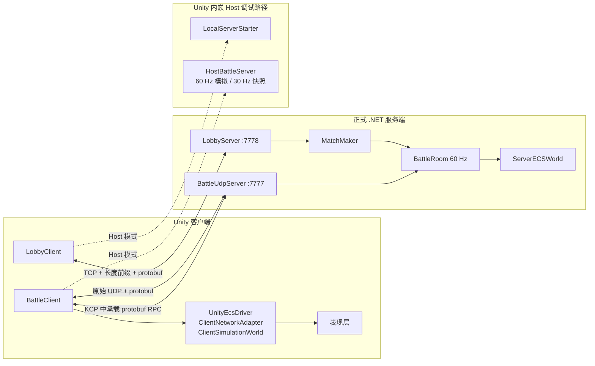
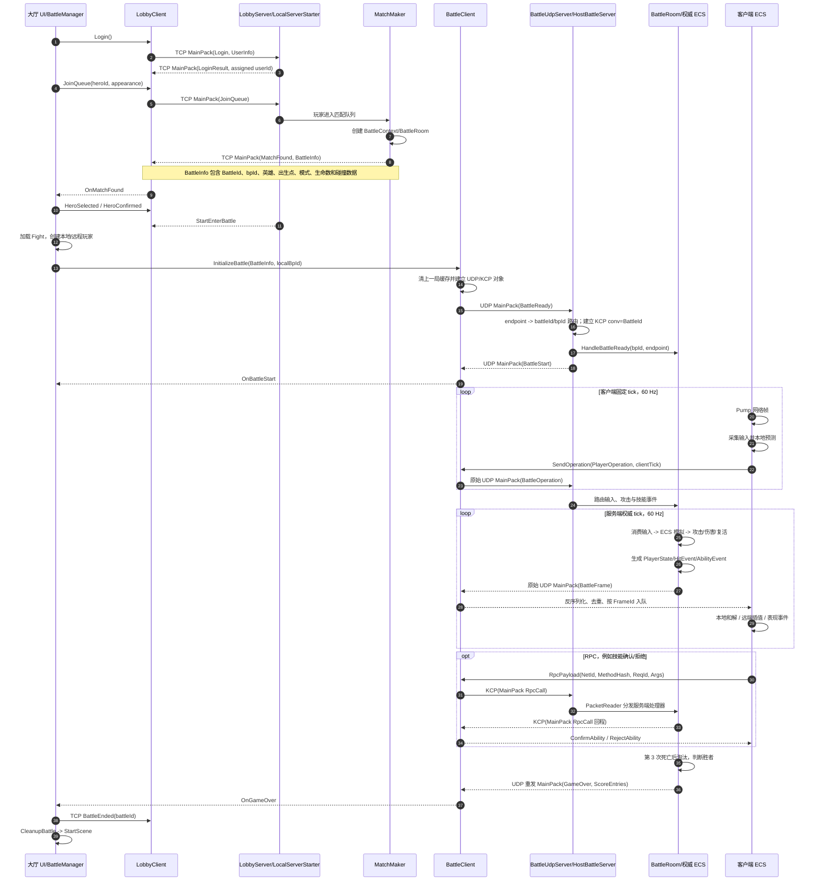
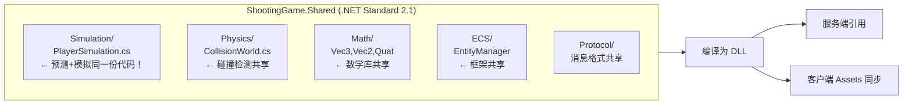
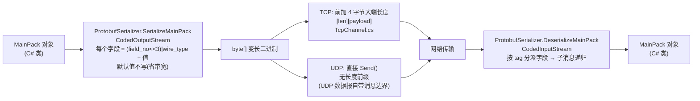
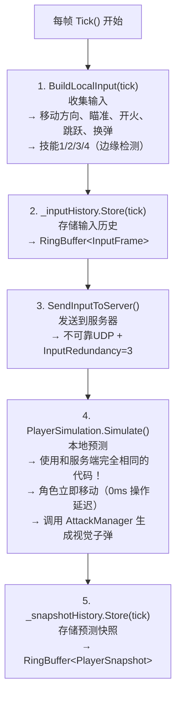
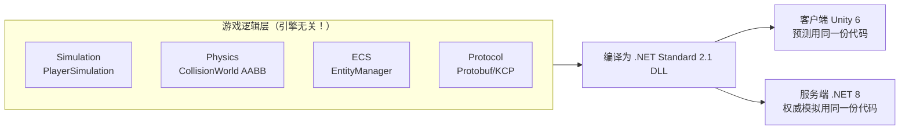
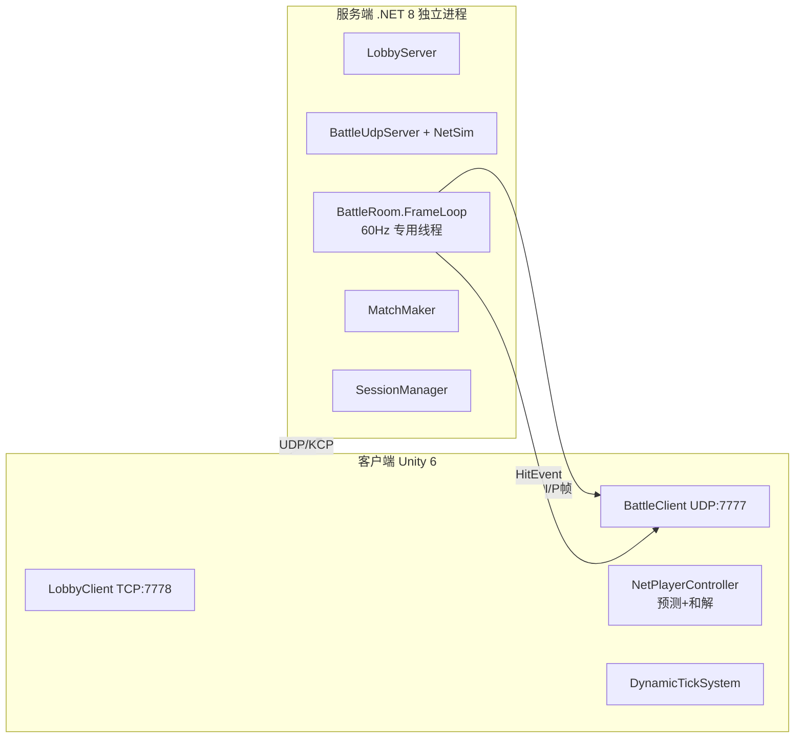

# ShootingConnectGame — 网络同步系统技术文档

# 当前实现：客户端与服务端交互全过程（2026-08-26）

> 本章以当前仓库代码为唯一依据，是阅读网络系统时的权威入口。
> 旧版比较、重复架构和非主线附录已于 2026-08-26 清理；面试话术与题库按要求保留。保留的历史面试片段若与本章冲突，以本章和当前源码为准。

## 0. 先给结论

当前项目是“大厅 TCP + 战斗 UDP + RPC 专用 KCP”的服务器权威状态同步架构：

- 大厅连接使用 TCP `7778`，负责登录、房间、匹配、选角和下发 `BattleInfo`。
- 战斗连接使用 UDP `7777`。输入、快照、心跳和终局消息走原始 UDP；RPC 在完成 `BattleReady` 后可走 KCP 可靠通道。
- 客户端与服务端都以 `MainPack` 为外层信封，使用 `ProtobufSerializer` 编码成 protobuf wire format。
- `RpcPayload` 是二进制扩展槽。RPC 与 `DeltaState` 的内部数据使用小端 `PacketWriter/PacketReader`，然后作为 protobuf `bytes` 字段放进 `MainPack`。
- 正式 `.NET` 服务端以 `BattleRoom` 运行 60 Hz 权威模拟，当前每 tick 广播最新一帧 `BattleFrame`。
- Unity 内嵌 Host 以 `HostBattleServer` 运行 60 Hz 模拟，但每 2 tick 广播一次，即 30 Hz；每 10 tick 构建一次简化 I 帧。
- 当前正式服务端的主同步仍是 `BattleFrame`。I/P 帧还没有取代它；客户端 P 帧组件应用也是占位实现。
- 死斗模式是每人 3 条命，死亡后 3 秒复活；第 3 次死亡后淘汰。再次匹配依赖新 `BattleId` 和客户端/Host 两侧清场。

## 1. 当前架构与两条服务端路径



两条路径必须分开理解：

| 维度 | 正式独立服务端 | Unity 内嵌 Host |
|---|---|---|
| 大厅入口 | `LobbyServer` | `LocalServerStarter` |
| 战斗入口 | `BattleUdpServer` | `ServerTransport` + `HostBattleServer` |
| 权威世界 | `BattleRoom` + `ServerECSWorld` | `HostServerEcsWorld` |
| 模拟频率 | 60 Hz | 60 Hz |
| `BattleFrame` 下发 | 当前每 tick，约 60 Hz | 每 2 tick，约 30 Hz |
| I/P 帧 | 正式主链未发送 `DeltaState` | 每 10 tick 生成简化 I 帧；P 帧尚未形成完整增量链 |
| KCP | RPC 上下行 | 当前 Host 主链仍使用自身传输接口 |
| 用途 | 部署和正式联机 | 本机 Host 调试 |

## 2. 一局游戏的完整时序



## 3. 大厅阶段：TCP 从对象到字节再回到对象

### 3.1 客户端发送

`LobbyClient.Login/JoinQueue/SendHeroSelected/SendHeroConfirmed` 都先构造 `MainPack`：

```text
业务对象 MainPack
  -> ProtobufSerializer.SerializeMainPack
  -> protobuf body
  -> TcpChannel.Send
  -> [4 字节大端 bodyLength][body]
  -> NetworkStream.Write
```

TCP 是字节流，没有消息边界，因此 `TcpChannel` 必须增加 4 字节长度前缀。长度采用大端；protobuf body 自己仍遵循 protobuf wire format。

### 3.2 服务端接收

```text
NetworkStream
  -> ReadExact(4) 读取大端长度
  -> 校验 0 < length <= 64 MiB
  -> ReadExact(length)
  -> ProtobufSerializer.DeserializeMainPack
  -> 按 RequestCode/ActionCode 分发
```

`MatchFound` 可能携带较大的 `CollisionData`，所以 `TcpChannel` 对超过 64 KiB 的帧按实际长度分配缓冲，最大允许 64 MiB。

### 3.3 客户端接收线程边界

`TcpChannel.ReceiveLoop` 在后台线程读取完整帧并触发 `LobbyClient.OnFrameReceived`。`LobbyClient` 在该回调中反序列化 `MainPack`，然后把 `HandlePacket(pack)` 投递到 `UnityMainThreadDispatcher`。因此：

- TCP 读包和 protobuf 解码在后台接收线程。
- Unity 状态修改、事件回调、场景流程在主线程。
- 收包顺序由单条 TCP 连接保证。

## 4. 匹配结果与进入战斗

### 4.1 `BattleInfo` 是战斗握手上下文

当前关键字段如下：

| 字段 | 含义 |
|---|---|
| `BattleId` | 对局 ID，同时用作 KCP `conv` |
| `RandSeed` | 对局随机种子 |
| `BattlePlayers` | `userId -> battlePlayerId`、队伍、英雄、外观、初始出生点 |
| `SpawnPoints` | 可供初始出生和复活选择的全量出生点 |
| `CollisionData` | 与服务端一致的碰撞数据字节 |
| `GameMode` | `0` 团队，`1` 死斗 |
| `LivesPerPlayer` | 死斗当前为 3 |

正式服务端在 `MatchMaker.CreateBattle` 中先创建并注册 `BattleRoom`，再向每名玩家发送定制的 `MatchFound`。这保证客户端收到 `BattleInfo` 后立即发送 `BattleReady` 时，UDP 路由已经存在。

### 4.2 选角和场景切换仍走 TCP

`HeroSelected`、`HeroConfirmed` 和 `StartEnterBattle` 属于大厅/控制流程，仍通过可靠 TCP 发送。全员确认后，服务端广播 `StartEnterBattle`；`BattleManager` 再加载 Fight 场景并调用 `BattleClient.InitializeBattle`。

### 4.3 战斗握手

`InitializeBattle` 会先清理上一局状态：

- `_receivedFrames`
- `_processedHitEvents`
- `_pendingAttacks`
- 客户端帧号、攻击 ID、最后服务端帧号
- 当前模式、生命数、玩家名字表

随后创建 UDP socket 和客户端 KCP 对象，并发送：

```text
MainPack
  RequestCode = Battle
  ActionCode  = BattleReady
  BattleInfo.BattleId   = 当前 BattleId
  BattleInfo.OperationId = 当前 battlePlayerId
```

这里复用了 `OperationId` 承载 `battlePlayerId`，是现有协议约定，不是普通战斗帧号。

服务端收到后建立：

```text
remote endpoint -> battlePlayerId -> battleId -> BattleRoom
KCP conv = BattleId
```

服务端先给该客户端回复一次 `BattleStart`；全员 Ready 后再启动 `BattleRoom` 帧线程并广播开始。

## 5. 战斗传输：原始 UDP 与 KCP 如何分流

### 5.1 收包识别

UDP 数据报本身有消息边界，不需要 4 字节长度前缀。客户端和服务端都使用相同分流规则：

```text
收到 UDP datagram
  -> 长度达到 KCP 最小头长度，并且头部 conv == 当前 BattleId？
       是：KcpChannel.Input -> 重组 -> DeserializeMainPack
       否：直接 DeserializeMainPack(datagram)
```

这意味着 KCP 包和原始 protobuf UDP 包共用同一个端口，并靠 KCP 头部 `conv` 区分。

### 5.2 当前可靠性矩阵

| 消息 | 方向 | 通道 | 可靠性处理 |
|---|---|---|---|
| Login/JoinQueue/MatchFound/选角 | 双向 | TCP | TCP 可靠、有序 |
| BattleReady/BattleStart | 双向 | 原始 UDP | 控制包；当前不走 KCP |
| BattleOperation | C -> S | 原始 UDP | 可丢、低延迟；新输入覆盖旧输入 |
| BattleFrame | S -> C | 原始 UDP | 可丢、只接受递增 FrameId |
| Ping/Pong | 双向 | 原始 UDP | 周期发送，单包可丢 |
| RpcCall | 双向 | KCP | ACK、排序和重传；无会话时回退原始 UDP |
| GameOver | S -> C | 原始 UDP | 正式服务端连续重发 60 tick |

`BattleUdpServer.GetPacketStrategy` 中的 `RouteSetup/Control/Data` 用于弱网模拟策略分类，不等于自动获得可靠性。

## 6. 客户端固定 tick：收帧、预测和上行输入

### 6.1 当前 ECS 驱动顺序

旧的 `NetPlayerController` 已不在当前主链。现在由 `UnityEcsDriver` 驱动：

```text
UnityEcsDriver.Update
  -> 累积 unscaledDeltaTime
  -> 每个 1/60 秒固定 tick，单渲染帧最多追 5 tick
       1. ClientNetworkAdapter.Pump
       2. ClientSimulationWorld.Tick
       3. ClientECSWorld.OnSimulationTick
       4. ClientNetworkSyncSystem.SendLocalOperation
  -> ClientECSWorld.DriverPresentation
```

先 Pump 网络、再模拟本 tick，避免把已经到达的权威帧额外延迟一个固定 tick。若渲染严重卡顿，最多追 5 tick，之后限制累积量，防止“越追越慢”。

### 6.2 输入采集和预测

`ClientInputSystem` 采集移动、镜头朝向、跳跃边沿、射击、瞄准、换弹、下蹲和 4 个技能键，写成 `InputFrame`。`ClientSimulationWorld` 使用共享 `PlayerSimulationPipeline` 在本地立即模拟，并把输入和快照放入固定容量历史缓冲。

客户端预测的目的不是决定最终结果，而是让本地移动和操作不等待 RTT。服务器下发的 HP、弹药、换弹状态和位置仍是权威值。

### 6.3 `BattleOperation` 内容

每个上行包主要包含：

```text
MainPack(BattleOperation)
  BattleInfo.BattleId
  BattleInfo.OperationId       = clientFrameId
  BattleInfo.ClientAckedFrame  = 最后收到的服务端 FrameId
  BattleInfo.SelfOperation
    move / yaw / pitch
    fire / jump / run / aim / reload / crouch
    AttackOperations[]
    AbilityEvents[]
```

正式服务端会保存 `ClientAckedFrame`，但当前广播策略始终只发最新 1 帧，并不会按 ACK 补发缺失帧。

### 6.4 客户端帧号和服务端帧号的真实关系

先纠正一个常见前提：**服务器权威不等于 `serverFrameId` 数值必须永远大于 `clientFrameId`**。权威性的含义是服务器独立推进世界，并对位置、弹药、命中、伤害、死亡、复活和技能结果拥有最终决定权；它不需要提前知道客户端未来输入，也不能在输入到达之前模拟玩家将要按什么键。

当前项目存在两条独立的 60 Hz 计数器：

```text
客户端时间线                           服务端时间线
ClientSimulationWorld._currentTick     BattleRoom._frameId
从 BattleStart 后独立递增               从 StartFrameLoop 后独立递增
        |                                      |
        | BattleOperation                     |
        | clientFrameId = C                    |
        | clientAckedFrame = lastReceived S    |
        +------------------------------------->|
                                               | 在“收到后的下一个权威 tick”
                                               | 消费当前最新输入并模拟
        | BattleFrame                          |
        | serverFrameId = S                    |
        | authoritative PlayerState            |
        |<-------------------------------------+
        |
        | 本地和解 / 远端插值 / 事件确认
```

二者都从接近 1 的位置开始，并且目标频率都为 60 Hz，但启动时刻、线程调度、卡顿和网络延迟都不同。因此：

- `clientFrameId=120` 和 `serverFrameId=120` 不表示同一个绝对时刻。
- 有时客户端数字更大，有时服务端数字更大；代码没有维护固定 offset。
- 服务端不会等待“同编号客户端输入”才推进第 N 帧。
- 客户端输入携带的帧号主要用于去重、输入历史、攻击时间和诊断，不是服务端权威 tick 的替代品。

#### 6.4.1 服务端数据来自客户端，为什么仍然是权威数据

客户端只提供**意图和观测值**：移动轴、瞄准角、跳跃、换弹、蹲伏、技能请求，以及带唯一 ID 的攻击请求。客户端还附带预测位置和速度，但服务器不会直接把它们当成最终世界状态。

```text
客户端发送：我在 client tick C 想向前移动并发起 attackId=A
服务端决定：在 server tick S 收到并接受哪些意图
服务端执行：碰撞、移动、射速、弹药、技能、命中、伤害、生命和复活规则
服务端产出：server tick S 的 PlayerState / HitEvent / AbilityEvent
```

所以“原材料来自客户端”不等于“结果由客户端决定”。键盘输入来自玩家，但输入是否有效、在哪个权威 tick 生效、最终移动到哪里、子弹是否允许生成、击中谁和扣多少血，全部由服务端 ECS 计算。

#### 6.4.2 输入到达服务端后在哪一帧生效

`BattleUdpServer` 收到 `BattleOperation` 后，根据 UDP endpoint 找到 `battlePlayerId`，把 `PlayerOperation` 转为 `InputFrame(Tick=clientFrameId)`，再写入 `ServerECSWorld` 的并发队列。网络线程只入队，不直接修改模拟世界。

下一个 `BattleRoom.ProcessFrame` 调用 `_ecsWorld.Tick()` 时，`ServerNetworkReceiveSystem` 会：

1. 排空本 tick 开始前已经到达的输入消息。
2. 用 session generation 拒绝上一局或旧连接的残留消息。
3. 用 `InputBufferComponent.Store` 拒绝 `clientFrameId <= LastReceivedTick` 的旧包和重复包。
4. 把最新被接受的输入写入玩家 ECS `InputComponent`。
5. 后续移动、武器和能力系统在当前 `serverFrameId` 下使用该输入推进世界。

当前实现不是严格的“服务端 S 帧只消费客户端 C=S-offset 的输入缓冲”模式，而是**到达即在下一个服务端 tick 应用最新输入**：

```text
输入 C=100 在服务端 S=96 模拟前到达 -> 通常在 S=96 生效
输入 C=101 丢失                    -> InputComponent 保持最近状态
输入 C=102 在 S=98 前到达           -> 在 S=98 更新为 C=102 的输入
旧包 C=100 之后才到                 -> 因不大于 LastReceivedTick 被丢弃
```

这能降低额外输入等待，但代价是客户端 tick 与服务端 tick 没有精确映射。跳跃通过 `InputEdgeComponent` 把持续按住转为边沿，攻击则作为带 `AttackId/ClientFrameId` 的独立请求进入攻击队列，避免只依赖持续输入状态。

#### 6.4.3 `ClientAckedFrame` 的作用和当前边界

客户端每次上行都发送：

```text
BattleInfo.OperationId      = 当前 clientFrameId
BattleInfo.ClientAckedFrame = 客户端已接收的最大 serverFrameId
```

这两个值不能相减得到可靠 RTT，也不能直接判断谁“领先”：前者属于客户端时钟，后者属于服务端时钟。`ClientAckedFrame` 表示“截至这次输入发送时，客户端确认看到了服务端哪一帧”。

当前独立服务端会保存这个 ACK，但广播策略仍然只发送最新一个 `BattleFrame`，不会按 ACK 补发 `_frameHistory` 中的缺失帧，也没有把 ACK 回显为“你的 clientFrameId 已处理到多少”。因此它目前主要是连接/同步观测数据和未来可靠快照策略的基础，不是完整的输入确认协议。

#### 6.4.4 客户端收到服务端帧后如何使用

服务端在权威 tick `S` 结束时产生：

```text
BattleFrame
  BattleInfo.OperationId = S
  AllPlayerOperation.FrameId = S
  Operations[]     = 本次服务端实际采用的玩家输入
  PlayerStates[]   = 模拟后的权威状态
  HitEvents[]      = 权威命中/伤害结果
  AbilityEvents[]  = 技能确认/拒绝/结束结果
```

客户端处理分为五层：

1. **乱序过滤**：`BattleClient` 只接受 `FrameId > _lastReceivedFrame` 的帧，旧帧和重复帧不进入业务层；最多保存最近 64 帧索引。
2. **线程交接**：`BattleClient` 在主线程解包后触发 `OnFrameReceived`，`ClientECSWorld` 将帧放入 `ClientNetworkAdapter`；`UnityEcsDriver` 每个固定 tick 先 `Pump()` 权威帧，再做本地预测 tick，减少额外一帧延迟。
3. **本地玩家和解**：找到本地 `PlayerStateMsg`，HP、弹药、换弹和死亡状态以服务端为准；位置误差大于 3 m 时硬纠正，中等误差做 10% 平滑，随后必要时重演最近最多 15 个本地输入。
4. **远程玩家表现**：远端状态写入插值缓存，位置和朝向沿服务端快照时间线平滑显示；HP、标签、死亡等离散状态直接按权威值更新。
5. **事件确认**：本地预测攻击用 `AttackId` 与服务端帧中的攻击对应，已预测的表现不重复播放；`HitEvent` 决定命中和伤害表现；`AbilityEvent` 或 RPC 回程确认/拒绝预测技能。

需要准确描述当前和解算法的限制：`ReconcileLocal(serverState, serverFrameId)` 会用 `serverFrameId` 过滤重复权威帧，但它**没有**用该服务端帧号去索引同编号的客户端预测历史。发生硬纠正时，它从“当前客户端 tick 往前最多 15 tick”重演，而不是从“服务端明确确认的 client tick + 1”开始重演。因此现在是可工作的近似和解，不是严格的 input-ack reconciliation。

#### 6.4.5 谁在时间线上领先

要区分三个概念：

| 概念 | 谁领先/谁权威 |
|---|---|
| 服务端当前世界 vs 客户端最后收到的服务端快照 | 服务端真实世界更“新”；快照经过单向网络延迟才到客户端 |
| 客户端本地预测 vs 客户端最后收到的服务端快照 | 客户端预测通常更“靠前”，因为没有停下来等待 RTT |
| `serverFrameId` 数值 vs `clientFrameId` 数值 | 当前没有固定领先关系，不能直接比较 |

例如单向延迟约 50 ms、双方 60 Hz 时，客户端看到的最新服务端快照通常落后服务端当前世界约 3 tick；但客户端本地角色已经用最近 3 tick 输入预测到了“现在”。快照到达后，客户端不是倒退停住，而是用权威结果校正预测误差。

```text
服务端当前权威时刻 S=200
          |
          | 约 3 tick 网络在途
          v
客户端刚收到的权威快照 S=197
客户端本地预测已继续运行到自己的 C=203（示意，数字不可直接对应）
```

`DynamicTickSystem` 中存在根据 RTT 和帧差调整 30–120 Hz 的算法，但当前实际模拟由 `UnityEcsDriver` 固定 60 Hz 驱动；项目中也没有调用 `DynamicTickSystem.UpdateServerFrame/UpdateRtt` 的生产链路。它现在主要是遥测/遗留实现，不能据此声称“已经保证客户端与服务器维持固定帧差”。

#### 6.4.6 若要升级为严格帧映射，需要增加什么

更严格的预测和解协议应让服务端在每个玩家的下行状态中回传：

```text
serverTick                 本权威快照的服务端 tick
lastProcessedClientTick    该玩家已被权威世界消费的最大客户端 tick
```

客户端收到后应：

1. 取 `lastProcessedClientTick` 对应的本地预测快照与权威状态比较。
2. 丢弃 `<= lastProcessedClientTick` 的输入历史。
3. 从 `lastProcessedClientTick + 1` 到当前 client tick 精确重演仍未确认的输入。
4. 对服务端快照维持插值缓冲；不要为了让帧号数值领先而人为暂停权威世界。

如果还希望服务端按固定输入延迟消费，则再建立 `clientTick -> serverTick` 的 offset 估计和输入等待窗口；缺包时明确采用“保持上一持续输入”还是“空输入”，边沿事件单独可靠/去重。这个方案能获得更稳定的时间映射，但会增加输入延迟，必须按射击手感和抗抖动需求取舍。

### 6.5 攻击消息的真实语义

每次攻击带唯一 `AttackId`、客户端帧号、方向、俯仰和枪口位置。客户端 `_pendingAttacks` 用于等待命中确认和超时清理；当前 `ResendPendingAttacks` 实际只删除超过 10 个客户端帧的记录，并没有重新发送网络包。因此不要把它描述成已经完成的可靠重传层。

## 7. 正式服务端权威帧循环

### 7.1 网络线程只负责路由和入队

`BattleUdpServer.ReceiveLoop`：

1. 阻塞接收 UDP datagram。
2. 识别 KCP 或原始 UDP。
3. `DeserializeMainPack`。
4. 根据 `ActionCode` 路由。
5. `BattleOperation` 根据 endpoint 找到 `battlePlayerId/battleId`。
6. 调用 `BattleRoom.HandlePlayerOperation`，把输入、攻击和技能事件写入服务端 ECS 队列。

网络线程不直接推进游戏世界。`BattleRoom` 自己持有 60 Hz 帧线程，所有关键入口使用房间锁保护跨线程状态。

### 7.2 每个服务端 tick

```text
BattleRoom.ProcessFrame
  -> ServerECSWorld.Tick
       消费网络输入和攻击
       推进移动/武器/能力/投射物/复活计时
  -> ConsumeDamageEvents -> HitEventMsg
  -> ConsumeSnapshots / ConsumeRespawnRequests
  -> 构建本 tick PlayerOperation 回显
  -> PackPlayerStates
  -> 附加 HitEvents 与 AbilityEvents
  -> 写入 64 帧历史
  -> BroadcastFrame(最新 1 帧)
```

服务端是权威方：客户端只发送意图，最终位置、弹药、伤害、击杀、死亡、技能结果和复活都由服务端 ECS 产生。

### 7.3 广播包

正式服务端当前每名客户端构造：

```text
MainPack(BattleFrame)
  BattleInfo.OperationId = serverFrameId
  BattleInfo.BattleId
  BattleInfo.AllPlayerOperations[0]
    FrameId
    Operations[]
    PlayerStates[]
    HitEvents[]
    AbilityEvents[]
  BattleInfo.HitEvents[]
```

只广播最新帧。丢包后客户端不会收到旧帧补发，而是由远端插值和下一份权威状态恢复。

## 8. 客户端下行处理、反序列化与表现

### 8.1 战斗客户端线程边界

`BattleClient.ReceiveLoop` 后台线程只做 `_udp.Receive` 并把原始 `byte[]` 放入 `ConcurrentQueue`，不在后台线程调用 Unity API，也不在那里反序列化。

主线程 `BattleClient.Update`：

1. 每渲染帧最多取 256 个 datagram，避免无上限阻塞主线程。
2. 识别 KCP 包；KCP 重组完成后再取出 protobuf body。
3. 调用 `ProtobufSerializer.DeserializeMainPack`。
4. 按 `ActionCode` 进入 `HandleBattleFrame/HandlePong/HandleGameOver/DeltaState/RpcCall`。

### 8.2 `BattleFrame` 防乱序和去重

- 只有 `frame.FrameId > _lastReceivedFrame` 才进入业务层。
- 客户端最多保留 64 帧接收历史。
- 命中事件用 `AttackId * 1000 + VictimId` 去重，并在 10 秒后清理去重表。
- 命中确认会从 `_pendingAttacks` 移除相同 `AttackId`。
- 技能事件从 `AllPlayerOperation.AbilityEvents` 分发。

### 8.3 从网络帧进入 ECS

```text
BattleClient.OnFrameReceived
  -> ClientECSWorld.OnFrameReceived
  -> ClientNetworkAdapter.EnqueueFrame
  -> 下一个固定 tick 的 Pump
  -> ClientNetworkSyncSystem.OnFrameReceived
```

对本地玩家：执行权威和解，HP/弹药/换弹直接以服务器为准；位置误差大于 3 m 时硬纠正并重演最近最多 15 tick 输入，0.3–3 m 做 10% 平滑，小于 0.3 m 忽略。

对远程玩家：写入权威状态和插值目标，表现层在延迟时间轴上插值，而不是直接每包瞬移。

死亡和复活同样来自 `PlayerStateMsg.IsDead/Hp/Position`：从存活变死亡时进入死亡表现；服务端状态重新变为存活时，客户端按权威出生位置 `Revive` 并请求视图瞬移，避免从旧尸体位置平滑穿过地图。

## 9. 序列化与反序列化

### 9.1 `MainPack`：业务路由信封，而不是单一业务对象

当前项目没有为登录、匹配、战斗分别定义独立的顶层包。所有大厅 TCP、战斗原始 UDP，以及 KCP 重组后的业务消息，最终都还原成同一种顶层对象 `MainPack`：

```text
MainPack
├── 路由头：RequestCode + ActionCode
├── 结果/通用槽：ReturnCode + Timestamp + Str + IntVal
├── 大厅对象：UserInfo / RoomInfo / RoomInfos[] / BattlePlayerPacks[]
├── 战斗对象：BattleInfo
├── 二进制扩展槽：RpcPayload
└── 终局对象：ScoreEntries[]
```

它更接近“业务信封”或 tagged union：`ActionCode` 决定当前包的业务语义，其他字段只在对应动作下有效。代码并没有使用 C# `union`、protobuf `oneof` 或按动作分型的消息类，因此接收方必须先看 `ActionCode`，再读取约定的字段组合。

权威定义与编解码位置：

- 对象定义：`Assets/Scripts/Network/Shared/Protocol/ProtoMessages.cs`
- protobuf wire 编解码：`Assets/Scripts/Network/Shared/Protocol/Generated/ProtobufSerializer.cs`
- 大厅客户端收发：`Assets/Scripts/Network/LobbyClient.cs`
- 独立大厅服务端分发：`Server/ShootingGame.Server/Program.cs`
- 战斗客户端收发：`Assets/Scripts/Network/BattleClient.cs`
- 独立战斗服务端分发：`Server/ShootingGame.Server/BattleUdpServer.cs`
- 权威帧与终局包生产：`Server/ShootingGame.Server/BattleRoom.cs`

#### 9.1.1 顶层 13 个 protobuf 字段

| 字段号 | C# 字段 | wire 类型 | 业务含义 |
|---:|---|---|---|
| 1 | `RequestCode` | varint enum | 粗粒度业务域：`User`、`Matching`、`Battle` |
| 2 | `ActionCode` | varint enum | 精确动作，是当前实际分发的主键 |
| 3 | `ReturnCode` | varint enum | 响应结果：成功、失败、未找到、已存在、服务器已满 |
| 4 | `Timestamp` | varint int64 | 当前用于 `Ping/Pong` 的 Unix 毫秒时间戳 |
| 5 | `Str` | length-delimited string | 通用文本槽：提示/错误；`GameOver` 中复用为胜者 ID 文本 |
| 6 | `IntVal` | varint int32 | 通用整数槽，含义由动作决定 |
| 7 | `BattleInfo` | length-delimited submessage | 匹配上下文、战斗握手、上行输入或下行权威帧 |
| 8 | `UserInfo` | length-delimited submessage | 登录身份，以及英雄外观选择 |
| 9 | `RoomInfo` | length-delimited submessage | 单个房间的请求/结果 |
| 10 | `RoomInfos[]` | repeated submessage | 房间列表响应 |
| 11 | `BattlePlayerPacks[]` | repeated submessage | 旧式轻量战斗玩家列表；当前主流程使用较完整的 `BattleInfo.BattlePlayers[]` |
| 12 | `RpcPayload` | length-delimited bytes | RPC 或 `DeltaState` 的内层自定义二进制 |
| 13 | `ScoreEntries[]` | repeated submessage | `GameOver` 权威记分板 |

`RequestCode` 只做粗分类，当前客户端和服务端的核心 `switch` 实际主要按 `ActionCode` 分发。因此不能只设置 `RequestCode` 而省略动作。三个枚举的当前取值如下：

```text
RequestCode: None=0, User=1, Matching=2, Battle=3

ReturnCode: Success=0, Fail=1, NotFound=2,
            AlreadyExists=3, ServerFull=4

ActionCode:
  User       Login=0, LoginResult=1
  Matching   JoinQueue=100, LeaveQueue=101, MatchFound=102,
             StartEnterBattle=103, OnlinePlayers=104, MatchCancelled=105
  Room       RoomList=150, CreateRoom=151, JoinRoom=152,
             LeaveRoom=153, RoomUpdate=154
  Battle     BattleReady=200, BattleStart=201, BattleOperation=202,
             BattleFrame=203, HitEvent=204, GameOver=205,
             Ping=206, Pong=207, PlayerJoined=208, PlayerLeft=209,
             Disconnect=210, BattleEnded=211
  Hero       HeroSelected=220, HeroConfirmed=221
  Extension  RpcCall=230, DeltaState=231
```

`HitEvent`、`PlayerJoined`、`PlayerLeft`、`RoomUpdate` 虽然已占用枚举值，但当前主链没有把它们作为独立 `MainPack` 动作发送：命中事件放在 `BattleFrame` 内；玩家列表和房间状态也主要通过其他消息更新。保留枚举值不等于已形成端到端业务链路。

#### 9.1.2 通用槽不是通用语义：必须和 `ActionCode` 一起解释

| `ActionCode` | 方向/通道 | 有效载荷 | 当前语义 |
|---|---|---|---|
| `Login` | 客户端→大厅 TCP | `UserInfo` | `Username` 作为登录名；请求里的 `UserId` 不作为服务端最终身份 |
| `LoginResult` | 大厅→客户端 TCP | `ReturnCode`, `Str`, `IntVal` | `IntVal` 是服务端分配的 `userId`，`Str` 是欢迎或错误文本 |
| `OnlinePlayers` | 大厅→客户端 TCP | `Str` | 在线人数被转成字符串发送 |
| `JoinQueue` 请求 | 客户端→大厅 TCP | `IntVal`, `UserInfo` | `IntVal` 是 `heroId`，`UserInfo` 携带外观选择 |
| `JoinQueue/LeaveQueue` 响应 | 大厅→客户端 TCP | `ReturnCode`, `Str` | 排队操作结果和提示文本 |
| `MatchFound` | 大厅→客户端 TCP | `BattleInfo` | 初次下发对局 ID、随机种子、完整玩家表、出生点、碰撞数据、模式与生命数 |
| `HeroSelected/HeroConfirmed` | 双向大厅 TCP | `IntVal`, `UserInfo`, `ReturnCode` | `IntVal` 是英雄 ID；`UserInfo.UserId` 标识选择者；其他字段是外观 |
| `StartEnterBattle` | 大厅→客户端 TCP | `BattleInfo` | 所有人确认后的最终阵容；客户端据此加载 `Fight` 并初始化战斗连接 |
| `MatchCancelled` | 大厅→客户端 TCP | `ReturnCode`, `Str` | 进入战斗失败或阵容失效原因 |
| `RoomList` | 双向大厅 TCP | 响应使用 `RoomInfos[]` | 请求无载荷；响应返回当前房间列表 |
| `CreateRoom` | 双向大厅 TCP | 请求/响应使用 `RoomInfo` | 请求主要用房名、最大人数；响应补齐房间 ID、创建者、人数、状态 |
| `JoinRoom` | 双向大厅 TCP | `IntVal`, `ReturnCode`, `Str` | `IntVal` 是房间 ID |
| `LeaveRoom` | 双向大厅 TCP | `ReturnCode` | 离开当前房间的结果 |
| `BattleReady` | 客户端→战斗 UDP | `BattleInfo` | `BattleId` 定位房间；`OperationId` 在此动作下复用为 `battlePlayerId` |
| `BattleStart` | 战斗服务端→客户端 UDP | `ReturnCode` | UDP endpoint 注册完成，客户端可正式开始战斗 tick |
| `BattleOperation` | 客户端→战斗 UDP | `BattleInfo` | 当前输入、攻击/技能事件、客户端帧号和已确认服务端帧号 |
| `BattleFrame` | 战斗服务端→客户端 UDP | `BattleInfo` | 最新权威帧、玩家状态、命中与技能结果 |
| `Ping/Pong` | 双向战斗 UDP | `Timestamp` | 服务端原样回显客户端 Unix 毫秒时间戳，双方据此更新 RTT EWMA |
| `RpcCall` | 双向 KCP | `RpcPayload` | 内层是 `NetId + MethodHash + ReqId + Args`，不是 protobuf 子消息 |
| `DeltaState` | Host→客户端 UDP | `RpcPayload` | 同一个 bytes 槽改装为 `NetworkFrameSerializer` 的 I/P 帧数据 |
| `GameOver` | 战斗服务端→客户端 UDP | `IntVal`, `Str`, `ScoreEntries[]` | `IntVal`: 0 团队/1 死斗；`Str`: 胜利队伍 ID 或胜者 bpId；列表是权威记分板 |
| `BattleEnded` | 客户端→大厅 TCP | `IntVal` | `IntVal` 是已结束的 `battleId`，用于清理匹配映射；服务端回显结果 |
| `Disconnect` | 客户端→战斗 UDP | 无额外载荷 | 按来源 endpoint 清理战斗路由 |

这里最容易产生误读的是字段复用：

```text
BattleInfo.OperationId
  BattleReady     -> battlePlayerId
  BattleOperation -> clientFrameId
  BattleFrame     -> serverFrameId

MainPack.IntVal
  LoginResult     -> assigned userId
  JoinQueue       -> heroId
  HeroSelected    -> heroId
  JoinRoom        -> roomId
  BattleEnded     -> battleId
  GameOver        -> gameMode

MainPack.Str
  普通响应         -> 提示/错误文本
  OnlinePlayers   -> 在线人数文本
  GameOver        -> winner teamId 或 winner battlePlayerId 的十进制文本
```

这些复用是当前协议事实，但类型安全较弱。修改任一动作时，应把生产方和消费方作为一个协议契约一起检查。

#### 9.1.3 `UserInfo`：身份与角色外观的复合对象

`UserInfo` 同时承担登录信息和选角外观快照。字段号与含义如下：

| 字段号 | 字段 | 含义 |
|---:|---|---|
| 1 | `UserId` | 服务端身份；选角广播时用于标识选择者 |
| 2 | `Username` | 登录名/显示名 |
| 3 | `Password` | 预留密码字段；当前登录流程没有校验密码 |
| 4 | `OutfitIndex` | 服装款式 |
| 5–8 | `GunColorR/G/B/A` | 武器颜色 RGBA |
| 9 | `FaceIndex` | 面部款式 |
| 10 | `WeaponVariantIndex` | 武器外观变体 |
| 11–13 | `HelmetDisabled/AccessoryDisabled/JacketDisabled` | 头盔、配件、外套显隐开关 |
| 14–16 | `ClothingColorIndex/HairColorIndex/MaterialPresetIndex` | 服装色、发色和材质预设 |
| 17–20 | `HelmetColorR/G/B/A` | 头盔颜色 RGBA |

登录请求只关心 `Username`；服务端使用 TCP 连接的 `ClientId` 分配最终 `UserId`，不会信任客户端传入的身份。`JoinQueue`、`HeroSelected` 和 `HeroConfirmed` 则通过 `CharacterAppearanceState.CopyTo(UserInfo)` 填充外观，服务端保存到大厅连接状态，再复制进最终 `BattlePlayerInfo`。因此 `UserInfo` 是大厅阶段的选择载体，`BattlePlayerInfo` 是对局阶段的冻结阵容快照。

#### 9.1.4 房间与轻量玩家对象

`RoomInfo` 的字段号为：`RoomId=1`、`RoomName=2`、`CreatorName=3`、`PlayerCount=4`、`MaxPlayers=5`、`Status=6`。`Status` 当前约定 `0=Waiting`、`1=Playing`。

- 创建房间请求通常只填 `RoomName/MaxPlayers`。
- 创建成功后服务端返回完整 `RoomInfo`，并在顶层 `IntVal` 再回显 `RoomId`。
- 房间列表把多个 `RoomInfo` 放进 `MainPack.RoomInfos[]`，每个 repeated 元素都以独立 length-delimited 子消息编码。

`BattlePlayerPack` 是较早期的轻量对象：`UserId=1`、`BattleId=2`（注释说明这里实际是 battlePlayerId）、`PlayerName=3`、`TeamId=4`。类中虽然还有 `HeroId`，但当前 `SerializeBattlePlayerPack/DeserializeBattlePlayerPack` 没有为它分配字段号，所以该值不会进入网络字节。当前正式匹配链使用 `BattleInfo.BattlePlayers[]`，不要再依赖 `BattlePlayerPacks[].HeroId`。

#### 9.1.5 `BattleInfo`：一个类型承载四个战斗阶段

`BattleInfo` 不是只用于“战斗基本信息”。它被复用于匹配结果、战斗握手、上行输入和下行帧：

| 字段号 | 字段 | wire 类型 | 主要用途 |
|---:|---|---|---|
| 1 | `OperationId` | varint int32 | 按动作分别表示 bpId/clientFrameId/serverFrameId |
| 2 | `BattleId` | varint int32 | 对局/房间路由 ID，同时作为 KCP `conv` |
| 3 | `RandSeed` | varint int32 | 匹配建立时生成的同步随机种子 |
| 4 | `ClientAckedFrame` | varint int32 | 客户端最后收到的服务端帧号；当前不用于批量历史补发 |
| 5 | `SelfOperation` | submessage | 当前客户端自己的输入和事件 |
| 6 | `Operations[]` | repeated submessage | 预留/兼容的输入列表；当前主帧使用下一项 |
| 7 | `AllPlayerOperations[]` | repeated submessage | 服务端下发的帧容器 |
| 8 | `HitEvents[]` | repeated submessage | 顶层命中结果，客户端按攻击/受击者组合去重 |
| 9 | `PlayerStates[]` | repeated submessage | 可直接携带状态；当前主链主要放在帧容器内 |
| 10 | `BattlePlayers[]` | repeated submessage | 最终阵容、英雄、外观和每人的初始出生点 |
| 11 | `SpawnPoints[]` | repeated submessage | 场景可用出生点全集 |
| 12 | `CollisionData` | bytes | 战斗碰撞数据；可让 TCP 匹配包明显变大 |
| 13 | `GameMode` | varint int32 | `0=团队模式`、`1=死斗` |
| 14 | `LivesPerPlayer` | varint int32 | 死斗每人生命数，当前为 3；团队模式通常为 0 |

四种形态可以直接对照：

```text
MatchFound / StartEnterBattle:
  BattleId + RandSeed + BattlePlayers[] + SpawnPoints[]
  + CollisionData + GameMode + LivesPerPlayer

BattleReady:
  BattleId + OperationId(battlePlayerId)

BattleOperation:
  BattleId + OperationId(clientFrameId)
  + ClientAckedFrame + SelfOperation

BattleFrame:
  BattleId + OperationId(serverFrameId)
  + AllPlayerOperations[] + HitEvents[]
```

`BattlePlayerInfo` 是对局成员静态资料，字段为：

| 字段号 | 字段组 | 含义 |
|---:|---|---|
| 1–4 | `PlayerId`, `TeamId`, `UserId`, `PlayerName` | 对局内 ID、队伍、账号身份和显示名 |
| 5 | `SpawnPosition` | 该玩家本局分配到的初始出生位置 |
| 6 | `HeroId` | 最终锁定英雄 |
| 7–23 | 与 `UserInfo` 对应的服装、枪色、脸、武器变体、显隐开关、色彩和材质 | 进入战斗后不再依赖选角 UI 状态 |

其中 `PlayerId` 是 battlePlayerId，只在当前对局内有效；它与大厅 `UserId` 不是同一个身份空间。`SpawnPointMsg` 则描述场景出生点全集：字段 1 `Position(Vec3)`、字段 2 `Yaw(float)`、字段 3 `TeamId(int32)`。死斗可使用 `TeamId=0` 的通用点；团队模式可按队伍筛选。

#### 9.1.6 上行输入对象：`PlayerOperation` 与 `AttackOperation`

`PlayerOperation` 描述客户端在一个模拟 tick 的意图，而不是权威结果：

| 字段号 | 字段 | 含义 |
|---:|---|---|
| 1 | `PlayerId` | 玩家 ID；服务端主入口仍以 endpoint 路由出的 bpId 为准 |
| 2–3 | `MoveX/MoveY` | 平面移动输入 |
| 4–5 | `AimYaw/AimPitch` | 视角/瞄准方向 |
| 6–7 | `Fire/Jump` | 持续射击意图与跳跃意图 |
| 8–9 | `AttackId/ClientFrameId` | 兼容的单攻击 ID与客户端帧号 |
| 10 | `AttackOperations[]` | 离散射击事件列表，支持一个输入包携带多个待重发攻击 |
| 11–13 | `Run/Aim/Reload` | 奔跑、瞄准和换弹意图 |
| 14 | `AbilityEvents[]` | 技能请求/结束事件 |
| 15–17 | `PosX/PosY/PosZ` | 客户端预测位置，供服务端验证/诊断 |
| 18–19 | `VelX/VelZ` | 客户端预测平面速度 |
| 20 | `IsGrounded` | 客户端预测落地状态 |
| 24 | `Crouch` | 蹲伏意图；字段 21–23 当前空置 |

射击不能只看 `Fire=true`。`AttackOperation` 才是每次离散射击的身份对象：`AttackId=1`、`TowardX=2`、`TowardY=3`、`AimPitch=4`、`ClientFrameId=5`、`SpawnPos(Vec3)=6`。服务端以独立攻击事件做射速、弹药、命中和去重判定；客户端以 `AttackId` 维护待确认集合。一个 `PlayerOperation` 可以携带多个 `AttackOperation`，这是为了容纳重发/批处理，不代表服务端应在一次扳机动作中无条件生成多颗子弹。

#### 9.1.7 下行帧对象：`AllPlayerOperation`、`PlayerStateMsg` 和事件

`AllPlayerOperation` 是一个权威服务端帧容器：

| 字段号 | 字段 | 含义 |
|---:|---|---|
| 1 | `FrameId` | 服务端权威帧号 |
| 2 | `Operations[]` | 本帧实际消费的各玩家输入 |
| 3 | `PlayerStates[]` | 本帧后的权威状态快照 |
| 4 | `HitEvents[]` | 本帧产生的命中/伤害事件 |
| 5 | `AbilityEvents[]` | 本帧技能确认、拒绝、结束或取消事件 |

正式服务端每 tick 只把最新一个 `AllPlayerOperation` 放进 `BattleInfo.AllPlayerOperations[]`。列表结构保留了批量帧能力，但当前不会因为客户端 ACK 落后而一次补发大量历史帧。

`PlayerStateMsg` 是客户端和解、远端插值和动画表现的权威输入：

| 字段号 | 字段 | 消费语义 |
|---:|---|---|
| 1–2 | `PlayerId`, `Position(Vec3)` | 定位玩家；本地用于和解，远端用于插值目标 |
| 3–4 | `Hp`, `IsDead` | 权威生命与死亡/复活边沿 |
| 5–6 | `Velocity(Vec3)`, `IsGrounded` | 移动与落地表现 |
| 7–10 | `StateEnum`, `FireCooldown`, `RotationY`, `IsRunning` | 状态机、射击冷却、朝向和奔跑 |
| 11–12 | `CurrentAmmo`, `IsReloading` | 权威弹药和换弹状态 |
| 13–14 | `TagBitmask`, `ActiveAbilities[]` | 技能标签与活动实例 |
| 15–18 | `VerticalVelocity`, `MaxHp`, `Kills`, `Deaths` | 垂直运动、最大生命和权威比分 |
| 19 | `IsAiming` | 远程瞄准状态 |
| 25 | `IsCrouching` | 远程蹲伏状态；字段 20–24 当前空置 |

`HitEventMsg` 的字段为 `AttackId=1`、`AttackerId=2`、`VictimId=3`、`Damage=4`、`IsKill=5`、`HitPoint(Vec3)=6`、`HitFrameId=7`、`BodyPart=8`。`BodyPart` 当前约定 `0=胸、1=头、2=腹、3=四肢`。客户端用 `AttackId * 1000 + VictimId` 做表现去重，并用同一个 `AttackId` 移除待确认攻击。

`ScoreEntryMsg` 只在终局使用：`PlayerId=1`、`PlayerName=2`、`Kills=3`、`Deaths=4`。服务端发送前按击杀降序、同击杀按死亡升序排列。

#### 9.1.8 技能对象与 RPC bytes 不是同一种协议层

技能领域事件有两类对象：

- `AbilityEventData`：`PlayerId=1`、`InstanceId=2`、`AssetId=3`、`EventType=4`。事件类型为请求激活、确认激活、拒绝激活、正常结束、强制取消。
- `AbilityInstanceData`：`InstanceId=1`、`AssetId=2`、`State=3`、`CooldownRemaining=4`、`DurationRemaining=5`、`AppliedTagsMask=6`。它作为 `PlayerStateMsg.ActiveAbilities[]` 描述权威运行时实例。

`AbilityEventData` 是 protobuf 子消息，可以放在上行 `PlayerOperation.AbilityEvents[]` 或下行 `AllPlayerOperation.AbilityEvents[]`。`RpcPayload` 则是另一层协议：protobuf 只把它视为不透明 `bytes`，其内部由 `PacketWriter/PacketReader` 按小端格式解释。

```text
MainPack(ActionCode=RpcCall)
└── field 12 RpcPayload
    ├── NetId:uint32
    ├── MethodHash:int64
    ├── ReqId:uint32
    └── Args: 按方法签名顺序编码

MainPack(ActionCode=DeltaState)
└── field 12 RpcPayload
    └── NetworkFrameSerializer 编码的 I/P 帧
```

所以接收方不能仅凭 `RpcPayload != null` 决定解码器，必须先看 `ActionCode`：`RpcCall` 交给 RPC 分发，`DeltaState` 交给帧同步解码器。

#### 9.1.9 protobuf 实际序列化与反序列化过程

对象到字节的过程：

```text
SerializeMainPack(pack)
  -> 对每个非默认顶层字段写 tag
  -> enum/int/bool 使用 varint
  -> float 使用 fixed32
  -> string/bytes 使用 length-delimited
  -> 子对象先写入临时 MemoryStream
  -> 外层写 [tag][subMessageLength][subMessageBytes]
  -> repeated 字段逐元素重复写相同字段号
```

tag 的计算规则为：

```text
tag = (fieldNumber << 3) | wireType
fieldNumber = tag >> 3
```

反序列化时 `DeserializeMainPack` 创建一个空 `MainPack`，循环 `ReadTag`，用 `tag >> 3` 取字段号并进入 `switch`。单个子消息先通过 `ReadMessage()` 限定读取范围，再调用对应的 `DeserializeXxx`；repeated 字段每遇到一次相同字段号就向列表追加一个对象。

线上三种封装仍然共享同一个 protobuf body：

```text
TCP:     [4B 大端 bodyLength][protobuf MainPack]
UDP:     [protobuf MainPack]
KCP:     [KCP 分段/重传数据] -> 重组得到 [protobuf MainPack]
```

TCP 的 4 字节长度属于 `TcpChannel` 帧边界，不属于 protobuf；UDP 数据报天然有边界；KCP 必须先按 `conv=BattleId` 重组，之后才能调用 `DeserializeMainPack`。

#### 9.1.10 默认值、省略规则与当前兼容性边界

手写序列化器通常不写默认值：整数/枚举的 0、`false`、空字符串、空数组和零向量会被省略。接收端新建对象后保留 C# 默认值，因此：

- `ActionCode.Login=0` 不会写字段 2；反序列化出的默认值仍是 `Login`。
- `ReturnCode.Success=0` 不会写字段 3；未携带结果字段也会表现为 `Success`。
- `GameMode=0` 团队模式、`TeamId=0` 无队伍、`BodyPart=0` 胸部等合法零值与“字段没发”在线上不可区分。
- `GunColorA`、`HelmetColorA` 和对应战斗玩家 alpha 默认是 255，当前序列化器会主动写出这些非零默认值。

这符合 protobuf 的默认值模型，但业务代码不能用“反序列化后为 0”推断发送方一定显式发送了 0。需要区分 presence 时，应新增显式布尔字段、状态枚举，或改为真正支持 presence 的协议定义。

当前还有两个需要明确记录的兼容性限制：

1. `DeserializeMainPack` 及多数子对象的 `switch` 没有 `default: cis.SkipLastField()`。因此文档不能声称旧版本一定能跳过未来未知字段；在补上未知字段跳过逻辑并测试前，新增字段需要客户端和服务端同步升级。
2. `BattlePlayerPack.HeroId` 已存在于 C# 类，但序列化器没有对应字段号，往返后会丢失。当前主链应继续使用 `BattlePlayerInfo.HeroId`。

协议演进时至少遵守：已有字段号不改语义、不复用废弃字段号；客户端和服务端共享同一份 `ProtoMessages.cs/ProtobufSerializer.cs`；新增字段补齐序列化与反序列化两端；为每个新增对象增加 round-trip 测试，并对默认值、空列表和未知字段单独测试。

### 9.2 三种线上封装

```text
TCP 大厅：
[4B big-endian protobufLength][protobuf MainPack]

原始 UDP 战斗：
[protobuf MainPack]

KCP RPC：
[KCP segment header/payload ...]
  -> KCP 重组后得到 [protobuf MainPack]
```

### 9.3 `PacketWriter/PacketReader` 内层格式

二进制内层采用小端定长整数和 IEEE-754 float：

- `byte/bool`：1 字节
- `int16/uint16`：2 字节小端
- `int32/uint32/float`：4 字节小端
- `int64/uint64`：8 字节小端
- `string`：`int32 byteLength + UTF-8 bytes`
- `Vec3`：3 个 float
- `Quat`：4 个 float

它不替代 protobuf，而是用于 `RpcPayload` 内部：

```text
RPC payload
[NetId:uint32][MethodHash:int64][ReqId:uint32][Args...]

DeltaState payload
[ServerTick:int32][IsFull:bool][BaseFrameId:int32][EntityCount:byte]
  repeated Entity:
    [NetId:uint32][ComponentCount:byte]
      repeated Component:
        [ComponentTypeId:byte][IsFull:bool][DataLength:uint16][Data]
```

反序列化端 `PacketReader.CheckRemaining` 会在读越界前抛异常；字符串还会验证长度不为负且不超过剩余字节。

## 10. RPC 与技能交互

客户端 RPC 路径：

```text
业务方法/生成代理
  -> PacketWriter: NetId + MethodHash + ReqId + 参数
  -> MainPack(ActionCode.RpcCall, RpcPayload)
  -> BattleClient.SendRpcCall
  -> KCP reliable
```

服务端：

```text
BattleUdpServer KCP 重组
  -> DeserializeMainPack
  -> BattleRoom.HandleRpcCall
  -> PacketReader 读取 NetId/MethodHash/ReqId
  -> _rpcHandlers[MethodHash]
```

技能还存在随 `BattleOperation` 上行的 `AbilityEvents` 路径。服务端处理 `RequestActivate/Deactivate/Cancel`，并把 `ConfirmActivate/RejectActivate` 放进下一个 `BattleFrame.AbilityEvents`；特定技能也可通过 KCP RPC 回程调用 `ConfirmAbility/RejectAbility`。

不要把两者混为同一层：`AbilityEvents` 是战斗帧内的领域事件，RPC 是以 `MethodHash` 路由的方法调用。

## 11. `DeltaState` I/P 帧的当前真实状态

客户端已经具备：

- `ActionCode.DeltaState` 接收入口。
- `NetworkFrameSerializer.ReadDeltaState`。
- `ClientDeltaReceiver` 的 I 帧/P 帧基准检查。
- 连续 3 次 `BaseFrameId` 不匹配时请求 I 帧的回调接口。

Unity 内嵌 Host 已经具备：

- 60 Hz 模拟、30 Hz `BattleFrame`。
- 每 10 tick 将 `HealthComponent` 全量写入 `DeltaState`。
- `DeltaState` 作为 `MainPack.RpcPayload` 的 protobuf `bytes` 下发。

但目前还不能宣称完整 I/P 增量同步已落地：

- 正式 `.NET BattleRoom` 当前不发送 `DeltaState`。
- Host 的 `deltaState.Entities` 只在 `isFull` 时加入 Health 组件，所谓 P 帧通常为空。
- `ClientDeltaReceiver.ApplyPFrame` 的组件级增量应用仍是占位实现。
- I 帧请求回调仍走另一套 `NetworkClient.SendRawMessage`，没有形成正式 `BattleClient` 端到端闭环。

因此当前生产主链必须按 `BattleFrame` 状态同步描述，`DeltaState` 是并行迁移中的实验链。

## 12. 心跳、RTT 和延迟补偿

`BattleClient` 每 200 ms 发送：

```text
Ping.Timestamp = UtcNowMilliseconds
```

服务端原样回显 `Pong.Timestamp`。客户端计算 `rtt = now - sent`，再使用：

```text
SmoothedRtt = 0.875 * old + 0.125 * sample
```

正式服务端也为每名玩家维护同样的 EWMA RTT。射击延迟补偿使用客户端攻击帧与当前服务端帧的差值，但最大追赶帧数受 RTT 推导值限制；服务端逐帧推进子弹并做扫掠碰撞，防止一次大步进穿透墙或玩家。

RTT 测量不代表已经完成断线重连。当前 `BattleClient` 断开会关闭 UDP 并清状态，正式战斗链没有在该类中实现自动重新握手和状态恢复；旧文档中“Token 重连 30 秒/3 次”的表述不能视为当前客户端已接通能力。

## 13. 三条命、出生点和再次匹配

### 13.1 三条命

共享常量：

```text
TickRate = 60
RespawnDelay = 3 seconds
DeathmatchLives = 3
```

死斗中：

1. 服务端权威伤害把 HP 降到 0。
2. 记录击杀者 Kills 和受害者 Deaths。
3. `Deaths < 3` 时创建 3 秒复活计时。
4. 复活时选择新出生点、恢复 HP/弹药/状态并广播新 `PlayerStateMsg`。
5. `Deaths == 3` 时标记淘汰，不再复活。
6. 仅剩一名仍有生命的玩家，或到达时间限制时结束。

### 13.2 出生点

匹配阶段将场景配置的出生点写入 `BattleInfo.SpawnPoints`。初始出生点还会写到每个 `BattlePlayerInfo.SpawnPosition`，客户端优先直接使用这个确定位置，避免先随机出生再被权威帧拉走。

死斗复活时，正式服务端：

- 排除玩家刚使用过的出生点。
- 排除与碰撞世界重叠的无效点。
- 选择与当前存活敌人最安全的点。

### 13.3 再次匹配清场

正式路径：

- `BattleRoom.EndBattle` 从 `MatchMaker` 移除 active battle 和 user-to-battle 映射。
- `BattleManager.EndBattle` 发送 TCP `BattleEnded(battleId)`。
- `CleanupBattle` 清本地/远程实体、ECS、Delta receiver 和战斗连接。
- 下一次 `MatchFound` 带新 `BattleId`；`BattleClient.InitializeBattle` 重新清帧号、攻击 ID、命中去重和玩家表。

Host 路径：

- `LocalServerStarter` 生成新 `BattleId` 和新的 `BattleInfo`。
- `HostBattleServer.SetPlayerSelections` 发现 BattleId 变化后设置 `_matchResetRequested`。
- 下一次主线程 `Update` 在 tick 前清 ECS、玩家路由、命中、待处理攻击、GameOver 标记和帧号。

这个清理顺序用于避免上一局实体和出生位置污染下一局。

## 14. GameOver 与返回大厅

`GameOver` 包：

| 字段 | 含义 |
|---|---|
| `IntVal` | `0` 团队模式，`1` 死斗 |
| `Str` | 团队模式为胜利队 ID；死斗为胜者 `battlePlayerId` |
| `ScoreEntries` | 每名玩家的名字、Kills、Deaths |

正式服务端停止模拟后连续 60 tick 向已连接端点重发 `GameOver`，弥补原始 UDP 可能丢包的问题。客户端保存模式和记分板，触发 `OnGameOver`，3 秒后由 `BattleManager.EndBattle` 清理并回到 `StartScene`。

## 15. 性能与分配边界

当前链路中已经有这些保护：

- `BattleClient` 后台线程只入队，主线程每帧最多处理 256 包。
- `UnityEcsDriver` 每渲染帧最多补 5 个固定 tick。
- Host 每 2 tick 才构建/广播快照，并且同一份序列化字节复用给所有客户端。
- Host 只在实际 I 帧 tick 创建 `PacketWriter/EntityDelta`。
- 子弹实体列表、过期攻击 ID 列表等高频容器已复用。
- 丢包时正式服务端不批量补历史帧，避免 ACK 落后造成主线程包洪峰。

仍需注意：正式 `BattleRoom.BroadcastFrame` 当前按客户端逐个构造 `MainPack`，随后由 `BattleUdpServer.Send` 逐个序列化。它与 Host 的“一次序列化、多客户端复用”优化还没有统一。

## 16. 当前消息路由速查

| ActionCode | 发送者 | 接收入口 | 主要负载 |
|---|---|---|---|
| `Login` | LobbyClient | LobbyServer/LocalServerStarter | `UserInfo` |
| `JoinQueue` | LobbyClient | MatchMaker | `UserInfo`, heroId |
| `MatchFound` | MatchMaker | LobbyClient | `BattleInfo` |
| `HeroSelected/HeroConfirmed` | 双向 | Lobby handler | heroId, appearance |
| `StartEnterBattle` | Lobby server | BattleManager | `BattleInfo/BattleId` |
| `BattleReady` | BattleClient | BattleUdpServer | BattleId + bpId |
| `BattleStart` | Battle server | BattleClient | 控制消息 |
| `BattleOperation` | BattleClient | BattleRoom | 输入、攻击、技能、ACK |
| `BattleFrame` | BattleRoom | BattleClient | 权威状态和领域事件 |
| `DeltaState` | 当前主要为 Host | BattleManager/Bridge | `RpcPayload` 二进制 I/P 帧 |
| `RpcCall` | 双向 | RPC 分发器 | `RpcPayload` |
| `Ping/Pong` | 双向 | BattleClient/UdpServer | 时间戳 |
| `GameOver` | BattleRoom | BattleClient | 胜者和记分板 |
| `BattleEnded` | LobbyClient | Lobby server | battleId |

## 17. 当前源码地图

客户端：

- `Assets/Scripts/Network/LobbyClient.cs`：大厅 TCP 业务与主线程分发。
- `Assets/Scripts/Network/BattleClient.cs`：UDP/KCP、战斗消息收发、帧和事件去重。
- `Assets/Scripts/Network/BattleManager.cs`：匹配、场景、玩家生成、GameOver 和清理。
- `Assets/Scripts/ECS/UnityEcsDriver.cs`：60 Hz 客户端固定 tick。
- `Assets/Scripts/ECS/ClientECSWorld.cs`：Unity 表现与纯 ECS 世界的兼容门面。
- `Assets/Scripts/Network/Shared/ECS/ClientNetworkAdapter.cs`：线程安全网络到 ECS 队列。
- `Assets/Scripts/Network/Shared/ECS/ClientSimulationWorld.cs`：预测、历史和权威和解。
- `Assets/Scripts/ECS/Systems/ClientNetworkSyncSystem.cs`：输入上行和权威帧应用。

正式服务端：

- `Server/ShootingGame.Server/LobbyServer.cs`：TCP 大厅入口。
- `Server/ShootingGame.Server/MatchMaker.cs`：匹配、BattleContext、BattleInfo。
- `Server/ShootingGame.Server/BattleUdpServer.cs`：原始 UDP/KCP 分流和 endpoint 路由。
- `Server/ShootingGame.Server/BattleRoom.cs`：60 Hz 权威房间、帧广播、死亡复活和结束。
- `Server/ShootingGame.Server/ECS/ServerECSWorld.cs`：服务端 ECS 网络队列与游戏状态。

共享协议：

- `Assets/Scripts/Network/Shared/Protocol/ProtoMessages.cs`
- `Assets/Scripts/Network/Shared/Protocol/Generated/ProtobufSerializer.cs`
- `Assets/Scripts/Network/Shared/Protocol/Tcp/TcpChannel.cs`
- `Assets/Scripts/Network/Shared/Protocol/Kcp/KcpChannel.cs`
- `Assets/Scripts/Network/Shared/Protocol/PacketWriter.cs`
- `Assets/Scripts/Network/Shared/Protocol/PacketReader.cs`
- `Assets/Scripts/Network/Shared/Protocol/NetworkFrameMessages.cs`

Host 调试服务端：

- `Assets/Scripts/Network/Server/LocalServerStarter.cs`
- `Assets/Scripts/Network/Server/HostBattleServer.cs`

## 18. 阅读和排查顺序

发生网络问题时按以下边界定位：

1. 大厅失败：检查 `TcpChannel` 帧边界、`MainPack.ActionCode` 和主线程 dispatcher。
2. 匹配后进不了 Fight：检查 `BattleInfo`、`StartEnterBattle`、本地 `battlePlayerId`。
3. BattleReady 无响应：检查 UDP endpoint 路由、BattleId 和 KCP conv 是否一致。
4. 操作无效：检查 `BattleOperation.OperationId`、服务端 `_hasStarted`、玩家是否死亡。
5. 位置抖动：区分本地和解与远端插值，核对 FrameId 是否单调递增。
6. 射击丢失：核对 `AttackId`、客户端帧号、UDP 丢包和服务端射速校验；不要误以为 `_pendingAttacks` 已实现网络重发。
7. 技能不同步：先判断走 `AbilityEvents` 还是 KCP `RpcCall`，再查对应反序列化路径。
8. 第二局位置错误：检查上一局 `CleanupBattle`、新 BattleId、Host `_matchResetRequested` 和初始 `SpawnPosition`。

---

> 以下为原有文档，暂未删除。涉及 `NetPlayerController`、正式服务端 `DeltaState`、完整 P 帧、自动断线重连、全量 KCP 战斗通道等描述时，应以本章和当前源码为准。


> **项目定位**：基于 Unity 6（客户端 + Headless 服务端）的多人射击游戏（TPS），实现完整 C/S 网络架构、状态同步、客户端预测和延迟补偿。
> **参考项目**：hyld-master（TCP + 帧同步思路的 Top-Down 对战游戏）、SpaceBuilder（KCP + 状态同步的 2D 体素对战游戏，毕业设计）
> **本文目的**：系统化记录网络同步设计，同时作为面试时"结合项目回答网络知识"的参考手册。

---

# 目录

- 当前实现：客户端与服务端交互全过程（2026-08-26）
- 2. 网络架构设计（保留面试内容）
- 3. 传输层选型与实现
- 5. 序列化方案
- 7. 客户端预测与服务器和解
- 8. 插值与视觉平滑
- 9. 延迟补偿
- 10. 动态追帧系统
- 11. ECS 与网络同步
- 12. RPC 系统与 Roslyn Source Generator
- 13. 心跳与超时检测
- 14. 带宽优化
- 18. 反作弊与服务器验证
- 19. 面试速查清单（带答案版）
- 附录 A：术语详解与代码示例
- 附录 C：Roslyn Source Generator 深入
- 附录 E：Unity headless vs .NET 独立进程做服务器
- 附录 F：protobuf 与 RPC 通识（零基础版）
- 附录 G：细节追问题库（往深了问）
- 从删除章节中保留的面试内容
# 2. 网络架构设计

## 2.3 面试速查：架构选型理由

> **"为什么选择 C/S + 状态同步？"**

三步回答法：

**① 反作弊是第一位**：PvP 竞技游戏，客户端不可信任。C/S 架构下服务器验证一切：伤害、碰撞、移动合法性。帧同步会让所有客户端拥有全部状态，地图透视外挂更容易。

**② 游戏类型匹配**：FPS/TPS 状态量极大（位置、旋转、速度、血量、弹药、Buff、技能冷却、动画参数...）。这些状态本身就是我们要同步的，用状态同步最自然。帧同步虽然带宽低，但确定性问题（浮点数→定点数、随机数种子、物理引擎确定性）在 3D 射击游戏中极难解决。

**③ 断线重连体验**：状态同步拿最新快照即可恢复（<1 秒）。帧同步要重放所有错过帧（重连 10 分钟游戏可能追帧 10-15 秒）。移动端网络不稳定，快重连很重要。

---

## 2.4 文件地图与完整调用链（全流程覆盖）

> 面试前按这条链走一遍代码，就能把整个联机流程讲清楚。每个节点都是仓库里的真实文件。

### 2.4.4 自然语言讲解（面试口述稿）

> 下面的文字就是"照着讲"的稿子：**30 秒版**用来开场定调，**分段版**按阶段展开，
> 每句话都对应真实文件和真实调用关系，可以直接背。

#### 30 秒版（开场白）

"这个项目是一套完整的 C/S 状态同步联机系统：客户端用 TCP 走大厅登录匹配，用 UDP 走战斗实时同步；服务器是 .NET 8 独立进程，每场战斗一个 60Hz 的帧循环线程做权威模拟；游戏逻辑全部引擎无关，编成 .NET Standard 库双端共用，所以客户端预测和服务器模拟跑的是同一份代码。整局流程分八段：启动装配、登录、匹配、选角加载、战斗连接、战斗主循环、结算、断线重连。"

#### 分段详细版

**阶段0 启动装配**
"游戏从 SceneBootstrapper 的 Awake 开始，它把整个客户端要用的网络组件一次性装配好：主线程调度器 UnityMainThreadDispatcher（收包线程怎么把数据切回主线程就靠它）、GameInitializer 存服务器地址和用户信息、LobbyClient 负责大厅 TCP、BattleClient 负责战斗 UDP、BattleManager 负责整局流程编排，还有 DynamicTickSystem、AttackManager、HitEventManager、AuthoritySync 这些战斗期组件。所有组件都是场景启动自动创建的，不依赖手动拖拽，场景在任何机器上打开都能跑。"

**阶段1 登录**
"用户点登录，LobbyClient 把用户名密码包成 MainPack，经 ProtobufSerializer 序列化成字节，TcpChannel 在前面加 4 字节长度前缀后走 TCP 发给大厅服务器。LobbyServer 验证完回 LoginResult，客户端 OnLoginResult 事件通知 UI。这里顺带讲为什么大厅用 TCP：登录事务不能丢，可靠优先。"

**阶段2 匹配**
"点匹配后 BattleManager 调 LobbyClient.JoinQueue，请求经 TCP 到 MatchMaker 入队。凑齐人数后 MatchMaker 生成 BattleInfo——包含战斗 ID、所有玩家的 ID/队伍/名字——同时创建 BattleRoom 并注册到 BattleUdpServer。MatchFound 包一路回传到 LobbyClient 的 HandleMatchFound，触发 BattleManager.OnMatchFound，按 userId 或用户名找到本地玩家是谁、在哪个队。"

**阶段3 选角加载**
"BattleManager 弹 HeroSelectPanel 让双方选英雄，带倒计时。确认后 LoadBattleSceneAsync 异步加载战斗场景，场景就绪后调 BattleClient.InitializeBattle，把 BattleInfo 和本地玩家 ID 传进去。"

**阶段4 战斗连接**
"BattleClient.InitializeBattle 先清掉上一场的所有残留——帧、命中事件、攻击、计数器——防止脏数据串场。然后开 UDP 连接：绑定本地端口、起一个后台 ReceiveLoop 线程收包，发 BattleReady 给服务器。BattleUdpServer 按 BattleId 找到 BattleRoom，HandleBattleReady 确认玩家就位，立刻回 BattleStart。客户端 OnBattleStart 触发 BattleManager 生成本地玩家 NetPlayerController、远程玩家槽位和 BattleUI。同时 BattleRoom 的 StartFrameLoop 已经起了专用线程，用 Stopwatch 加 Accumulator 跑 60Hz 帧循环。"

**阶段5 战斗主循环（重点，讲 2-3 分钟）**
"战斗主循环是**三个异步节拍**并行转：客户端 tick（60Hz）、服务器 frame（60Hz）、客户端收帧回调。它们不握手、不同步，靠输入时间戳 + 按序消费 + 确定性模拟各转各的（见 2.4.4 末尾的时序图）。

**节拍①：客户端 tick（每秒 60 次，DynamicTickSystem 驱动）**——这一拍永远最先动，因为玩家操作只发生在客户端：
　1. `NetPlayerController.ClientTick` 调 `BuildLocalInput(tick)`，采集这一帧的移动、瞄准、开火、跳跃；
　2. 开火是边沿触发：`AttackManager.TryCreateAttack` 生成本地预测子弹、登记 AttackId（去重/确认用）；
　3. `ClientPredictionSystem.PredictTick` 用共享模拟代码跑一次本地预测，角色立刻动——0ms 操作延迟就来自这里；
　4. `SendInputToServer` 把输入发给服务器（不可靠 UDP，攻击操作随包带上）；
　5. 输入和预测快照分别存进 RingBuffer 历史，留给将来的重模拟。
这一拍 60 次/秒循环，玩家感觉是"我按了键，角色马上动"。

**节拍②：服务器 frame（每 50ms 一次，BattleRoom 专用线程）**——比客户端慢 3 倍，是权威的一拍：
　1. 先处理 BattleUdpServer 转交的 BattleOperation：`HandlePlayerOperation` 把跳跃边沿塞进事件队列（防被输入消费顺序吃掉）、攻击塞进待处理表、输入塞进各玩家 InputBuffer；
　2. `ProcessFrame` 开始：处理复活；
　3. 对每个玩家 `ConsumeNext` 取最新输入、应用跳跃事件，然后用同一套共享代码做权威模拟——这是服务器说了算的位置；
　4. `RecordPosition` 把位置写进延迟补偿历史（保留 30 帧）；
　5. 开火判定：回溯历史位置做射线检测，命中生成 HitEventMsg；
　6. `PackPlayerStates` 打包 PlayerStateMsg，`BroadcastFrame` 广播——只发最新一帧。
这一拍 20 次/秒，产出是"全房间的权威状态"。

**节拍③：客户端收帧（随时触发）**：`BattleClient.ReceiveLoop` 后台线程 → `UnityMainThreadDispatcher` 切主线程：
　1. 本地玩家：`OnFrameReceived → ReconcileWithServer → ClientReconciliationSystem` 分级和解——血量直接覆盖权威值；位置 >3m 硬对齐并重模拟、0.3-3m 10% 平滑、<0.3m 忽略；
　2. 远程玩家：状态丢进 InterpolationBuffer，渲染故意滞后约 100ms 插值，画面绝对平滑；
　3. 心跳是独立节拍：每 200ms 一次 Ping → Pong → RTT 经 EWMA 平滑 → `DynamicTickSystem.UpdateRtt` 调整追帧速度，让客户端始终领先服务器约半 RTT。

三个节拍能并行不乱，靠的正是时序三机制：输入带 tick 时间戳、服务器按序消费、双端确定性模拟。"


**阶段6 延迟补偿**
"当某个玩家开火时，服务器不拿当前帧的对手位置判定，而是回溯到'射击方屏幕上看到的那一帧'——用 RTT 的一半换算成帧数，从 positionHistory 里取那帧的对手位置做 Hitscan。这就是偏向射击方。为了防止高延迟玩家滥用，回溯上限 12 帧约 200ms。命中后 HitEventMsg 走可靠通道发给客户端，HitEventManager 做扣血和击杀确认。"

**阶段7 结算**
"帧循环每帧检查 CheckDeathmatchEnd 或 IsTeamEliminated，满足条件就 EndBattle：广播 GameOver，带服务器权威的记分板，并重传几次防丢包。客户端 HandleGameOver 触发 BattleManager.OnGameOverReceived 显示结算界面。"

**阶段8 重连**
"如果客户端心跳超时，ClientConnectionFSM 从 Connected 切到 Reconnecting，带着 Token——格式是 tok 加玩家 ID 加会话号——重连。服务器 SessionManager 在断线时保留了 ECS Entity、最后快照和房间上下文，30 秒窗口内验证 Token 就恢复状态，客户端拿到最新快照直接继续，不用重放任何帧。这也是我选状态同步而不是帧同步的原因之一。"

#### 收尾升华

"这套系统最核心的设计判断有三个：一是服务器权威加客户端预测，反作弊和低延迟两手抓；二是共享代码库保证预测确定性；三是状态同步加 Token 重连保证断线体验。整条链路我都能对应到具体文件，比如权威模拟在 BattleRoom.ProcessFrame，预测在 NetPlayerController.ClientTick，和解在 ClientReconciliationSystem.Reconcile。"

### 2.4.5 面试怎么用这张图

1. **先讲主线**（阶段0→7）：用「客户端输入 → 服务器权威 → 广播状态 → 客户端和解/插值」一句话概括，再按阶段展开
2. **重点展开阶段5**：这是预测/和解/插值/心跳四大机制同时工作的地方，面试官 80% 的追问都在这
3. **引用具体文件**：每句话带上文件名（如 "BattleRoom.ProcessFrame 里 PackPlayerStates 打包 PlayerStateMsg"），比空谈概念可信得多
4. **主动讲踩坑**：阶段5 输入缓冲演进、跳跃事件驱动、广播只发最新帧——证明你真的跑过
# 3. 传输层选型与实现

## 3.1 为什么不用纯 TCP？

三个项目的实践给出了一致的答案：

| 场景 | 用 TCP 的后果 |
|------|-------------|
| 队头阻塞 | 射击游戏中 60Hz 同步，一个丢包阻塞后续 5-10 帧的数据。玩家看到角色突然"瞬移"。 |
| 拥塞控制误判 | 4G/5G 网络下，偶然丢包≠拥塞，但 TCP 减半窗口→发送速率骤降→延迟 30ms→500ms+ |
| 重传过时数据 | TCP 等 200ms+ 才重传，但旧位置的包重传到了也已经被新位置覆盖，完全没用 |
| **hyld-master 为什么能用 TCP？** | 它的卡牌游戏（斗地主）对延迟容忍度极高（秒级），射击模式体验明显更差 |
| **SpaceBuilder 为什么也不用 TCP？** | KCP 兼顾可靠+低延迟，对即时性要求高的战斗同样不愿用 TCP |

## 3.3 双通道设计

| 通道 | 传输方式 | 可靠性 | 用途示例 |
|------|---------|--------|---------|
| **KCP 可靠通道** | UDP+KCP | ✅ 可靠有序 | 握手、伤害事件、RPC、断线通知 |
| **原始 UDP 通道** | UDP 直发 | ❌ 不可靠无序 | WorldState（位置更新）、InputBatch（输入） |

**为什么输入也走不可靠？**

输入有冗余机制（`InputRedundancy=3`）。发送帧 100 的输入时，同时带上帧 98、99、100 的输入。即使帧 99 的UDP包丢了，帧 100 的包里也包含了帧 99 的输入。重传旧输入没有意义——新帧的输入已经覆盖了旧帧。

---

# 5. 序列化方案

## 5.1 统一 Protobuf 方案

项目运行时**全部使用手写 `ProtobufSerializer.cs`**（1600+ 行），直接调用 `Google.Protobuf.CodedOutputStream`/`CodedInputStream`。`.proto` 文件作为协议文档，`ProtobufGenerator.cs` Editor 工具已就绪。

### 实际序列化代码

**MainPack 序列化**（项目 `ProtobufSerializer.cs` 第 24-55 行）：

```csharp
public static byte[] SerializeMainPack(MainPack pack)
{
    using var ms = new MemoryStream();
    using var cos = new CodedOutputStream(ms);
    // 只有非默认值才写入——protobuf 风格，零值不占带宽
    if (pack.RequestCode != RequestCode.None)
        cos.WriteInt32Tag(1).WriteEnum((int)pack.RequestCode);
    if (pack.ActionCode != ActionCode.Login)
        cos.WriteInt32Tag(2).WriteEnum((int)pack.ActionCode);
    if (pack.ReturnCode != ReturnCode.Success)
        cos.WriteInt32Tag(3).WriteEnum((int)pack.ReturnCode);
    if (pack.Timestamp != 0)
        cos.WriteInt64Tag(4).WriteInt64(pack.Timestamp);
    // 嵌套消息用子序列化器
    if (pack.BattleInfo != null)
        SerializeSubMessage(cos, 7, subCos => SerializeBattleInfo(subCos, pack.BattleInfo));
    // ...
    cos.Flush();
    return ms.ToArray();
}
```

**MainPack 反序列化**：

```csharp
public static MainPack DeserializeMainPack(byte[] data)
{
    var pack = new MainPack();
    using var ms = new MemoryStream(data);
    using var cis = new CodedInputStream(ms);
    while (!cis.IsAtEnd)
    {
        uint tag = cis.ReadTag();
        int fieldNum = (int)(tag >> 3);
        switch (fieldNum)
        {
            case 1: pack.RequestCode = (RequestCode)cis.ReadEnum(); break;
            case 2: pack.ActionCode = (ActionCode)cis.ReadEnum(); break;
            case 7: // BattleInfo 子消息
                cis.ReadLength();
                pack.BattleInfo = DeserializeBattleInfo(cis);
                break;
            // ... 其他 field 同理
        }
    }
    return pack;
}
```

### Protobuf 的 Wire Format 原理

```
每条字段的编码：(field_number << 3) | wire_type
Wire Type: 0=Varint(int/bool/enum)  1=Fixed64  2=LengthDelimited(string/bytes/subMsg)  5=Fixed32
```

- Varint：小整数高效（1-127 只用 1 字节，传统 int 固定 4 字节）
- 默认值不序列化：`RequestCode=0` 时不占带宽
- 嵌套消息走 length-delimited：先写长度，再写子消息的 protobuf 二进制

### 为什么手写而非 protoc 生成？

| 手写 `CodedOutputStream` | `protoc` 生成 |
|---|---|
| 完全控制序列化格式，可按需优化 | 改 .proto → `protoc --csharp_out=.` → 覆盖生成文件 |
| 默认值裁剪精确可控 | 生成代码量大（2000+ 行的 .cs） |
| 无外部工具链依赖 | 需安装 protoc + Grpc.Tools NuGet |
| 新增字段需手写 3 处（序列化/反序列化/字段声明） | 新增字段只需改 .proto 并重新生成 |

当前 `.proto` 文件 + `ProtobufGenerator.cs` 已就绪，随时可切换到自动生成。

## 5.2 PacketWriter/PacketReader — 高频增量数据

对于 ECS 组件同步（I/P帧）和 RPC 参数，使用更轻量的 `PacketWriter`/`PacketReader`：

```csharp
public class PacketWriter
{
    private byte[] _buffer;
    public int Position { get; private set; }
    
    public void WriteByte(byte v)   { _buffer[Position++] = v; }
    public void WriteInt32(int v)   { /* little-endian 4字节 */ }
    public void WriteFloat(float v) { WriteInt32(BitConverter.SingleToInt32Bits(v)); }
    public void WriteVec3(Vec3 v)   { WriteFloat(v.x); WriteFloat(v.y); WriteFloat(v.z); }
    public void WriteBool(bool v)   { WriteByte(v ? (byte)1 : (byte)0); }
    public byte[] ToArray()         { /* 返回已写入部分的副本 */ }
}
```

- 无 varint 编码（固定宽度，随机访问友好）
- 无 tag（顺序读写，比 protobuf 的 tag+wire_type 省 1-2 字节每字段）
- 用于 ECS 组件的 `WriteDelta/WriteFull` 和 RPC 参数序列化

## 5.3 共享代码库的价值



→ 预测精度取决于代码一致性。**同一份代码 = 无代码不一致导致的预测偏差。**

**hyld-master 也有共享**：客户端和服务器各自有 `SocketProto.cs`（都是 Protobuf 生成的），但 Simulation 逻辑是两端独立实现的，没有共享代码库。

---

## 5.4 protobuf 是怎么传输的（字节流全链路）

### 5.4.1 完整链路



### 5.4.2 每个字节长什么样

以 `MainPack{ RequestCode=Battle, ActionCode=BattleOperation }` 为例（TCP 路径）：

```
应用层对象                          MainPack
  │ 序列化（CodedOutputStream）
  ▼
Protobuf 字节流：
  [0x08][0x04]        ← field 1 (RequestCode), varint 值 4(Battle)
  [0x10][0x08]        ← field 2 (ActionCode),  varint 值 8(BattleOperation)
  （其余字段都是默认值 → 一个字节都不写）
  ▼
TCP 帧：
  [0x00][0x00][0x00][0x0A]  ← 4 字节大端长度前缀（=10）
  [0x08][0x04][0x10][0x08]  ← protobuf 字节
  ▼
网络 → 服务器 TcpChannel.ReceiveLoop 读满 4 字节长度 → 再读 10 字节
  ▼
反序列化（CodedInputStream）：读 tag(0x08) → field 1 → 读 varint(0x04) → Battle
```

**UDP 路径的区别**：UDP 数据报本身就是消息边界，收包时 `_udp.Receive(ref remote)` 返回完整一包，
不需要长度前缀——所以 `BattleClient.Send()` 直接 `SerializeMainPack → _udp.Send(bytes)`。

**性能要点**：
- varint：小整数 1 字节（127 以内），普通 int 固定 4 字节 → 状态同步帧里大量小值字段极省
- 默认值裁剪：`RequestCode=None/0`、`Timestamp=0` 不占位 → 心跳包可能只有 2-4 字节
- 嵌套消息（BattleInfo）走 length-delimited：先写长度再写子消息，反序列化递归

### 5.4.3 自然语言讲解（面试口述稿）

"protobuf 在项目里的传输其实就一句话：对象序列化成字节，字节按传输层协议包一层，收端再解析回对象。序列化用的是 Google.Protobuf 的 CodedOutputStream，每个字段编码成 tag 加值——tag 是字段号左移三位或上 wire type——默认值一个字节都不写。TCP 路径上，因为 TCP 是字节流没有消息边界，所以 TcpChannel 在 protobuf 前面加 4 字节大端长度前缀，收端先读满 4 字节知道长度再读正文；UDP 路径不用，数据报本身就是边界，BattleClient 序列化完直接 send。反序列化端 CodedInputStream 按 tag 分派字段，遇到 length-delimited 就递归解析子消息。这个设计让一个心跳包可能只有几个字节，因为全是默认值——这就是 varint 和默认值裁剪的价值。"

### 5.4.4 序列化 / 反序列化调用链（代码定位版）

**发送链（对象 → 字节 → 网络）**：

```
业务代码构造 MainPack
  → ProtobufSerializer.SerializeMainPack(pack)      // 按字段号逐个写 tag+值，默认值跳过
  → byte[]
  → TCP: TcpChannel.Send()                          // 加 4 字节大端长度前缀
  → UDP: BattleClient.Send() / BattleUdpServer.Send // 直接 _udp.Send，无前缀
  → 网络
```

**接收链（网络 → 字节 → 对象 → 业务分发）**：

```
收包线程拿到 byte[]
  ├→ TCP 客户端: LobbyClient.OnFrameReceived → DeserializeMainPack → Enqueue 主线程 → HandlePacket
  ├→ TCP 服务端: LobbyServer.OnFrameReceived → DeserializeMainPack → HandleMessage
  ├→ UDP 客户端: BattleClient.ReceiveLoop → Enqueue 主线程 → HandlePacket switch(ActionCode)
  └→ UDP 服务端: BattleUdpServer.ReceiveLoop → DeserializeMainPack → switch(ActionCode)
       → BattleReady → HandleBattleReady（RegisterPlayer 绑定路由）
       → BattleOperation → HandleBattleOperation（endpoint 反查 → BattleRoom）
       → Ping / Disconnect
```

**反序列化的逐字段还原**（DeserializeMainPack）：

```csharp
while (cis.ReadTag(out uint tag))
{
    int field = (int)(tag >> 3);              // tag 高 3 位 = 字段号
    switch (field)
    {
        case 1:  pack.RequestCode = (RequestCode)cis.ReadEnum(); break;
        case 5:  pack.Str = cis.ReadString(); break;
        case 7:  // 子消息：读长度 → 截子流 → 递归
            var subCis = cis.ReadMessage();
            pack.BattleInfo = DeserializeBattleInfo(subCis);
            break;
    }
}
```

**关键点**：默认值字段序列化时没写 → 反序列化直接跳过（对象保持默认值）＝ 0 成本默认值；
子消息递归 = 快递盒里的盒子；双端同一份序列化代码（diff IDENTICAL）保证打包/拆包必然对上。

## 5.5 手写 Protobuf vs protoc 生成（深度对比）

### 5.5.1 项目现状

| 项 | 状态 |
|---|---|
| 运行时序列化 | **手写** `ProtobufSerializer.cs`（1600 行，CodedOutputStream/InputStream） |
| .proto 文档 | `ShootingGame.proto`（客户端/服务端两份 diff 一致） |
| protoc 工具链 | `ProtobufGenerator.cs`（Editor 菜单 Tools→ShootingGame→Update Protobuf）**已就绪但未启用** |

### 5.5.2 两条路线对比

| 维度 | 手写 CodedOutputStream（现状） | protoc 生成（就绪待切换） |
|------|------------------------------|--------------------------|
| **生成方式** | 手动维护每个字段的读/写 | `.proto` → `protoc --csharp_out` → 自动生成 .cs |
| **包体积** | 默认值裁剪精确可控，可手动微调 | 生成器也会裁剪默认值（标准行为） |
| **性能** | 相同（都走 Google.Protobuf 运行时编解码） | 相同 |
| **改字段成本** | 手写 3 处（序列化/反序列化/字段声明）+ 易漏 | 改 .proto 重新生成，绝不遗漏 |
| **一致性风险** | 高：序列化和反序列化手写两处可能不一致（漏字段/错 tag） | 零：生成器保证读写对称 |
| **工具链依赖** | 无（只需 Google.Protobuf 运行时 DLL） | 需 protoc.exe + 生成步骤（已集成 Editor 菜单） |
| **可读性** | 手写代码人类可读可调 | 生成代码量大（每类型 2000+ 行样板） |
| **协议演进** | 手写容易忘加向后兼容（optional 处理） | protoc 生成天然兼容（保留未知字段/缺省值） |
| **跨语言** | 只服务 C# | .proto 可生成 Go/Java/C++ 等多语言（当前项目无此需求） |

### 5.5.3 为什么现在还是手写（面试回答）

1. **运行等价**：两者底层都调用 `CodedOutputStream/InputStream`，性能与格式完全一致，切换不是性能问题
2. **协议文档已沉淀**：`.proto` 已是唯一协议真相，手写代码按它逐字段实现，且 178 个测试锁住了读写对称性
3. **当前消息量可控**：MainPack + GameMessage 十几个消息，手写维护成本可接受
4. **切换路径已铺好**：`ProtobufGenerator.cs` 随时可一键切换到 protoc 生成——等消息类型膨胀到 30+ 或需要跨语言时再切，**成本接近零**

> **面试话术**："我项目里 protobuf 序列化是手写的（1600 行，基于 Google.Protobuf 的 CodedOutputStream），
> .proto 文件作为协议文档，客户端/服务端各一份且 diff 完全一致；protoc 生成工具链（Editor 菜单一键更新）
> 已就绪但未启用——手写和生成的底层运行时是同一套，性能无差异，切换只是维护成本的权衡。
> 现在 178 个测试锁住了读写对称，等消息膨胀或需要跨语言时一键切换。"

# 7. 客户端预测与服务器和解

## 7.1 完整流程图



## 7.2 和解的分级策略（实际代码：ClientReconciliationSystem）

```csharp
// ClientReconciliationSystem.Reconcile() — ECS 驱动的和解
void Reconcile(EntityManager em, Entity entity, PlayerStateMsg serverState, int serverTick, ...)
{
    PlayerSnapshot predicted = snapshotHistory.Get(serverTick);
    float posDist = Vec3.Distance(predicted.Position, serverState.Position);
    bool needsResim = false;
    
    // HP — 直接覆盖 + 同步写入 ECS，防止下一帧 BuildSnapshot 覆盖
    if (predicted.Health != serverState.Hp) {
        currentSnapshot.Health = (byte)serverState.Hp;
        em.SetComponent(entity, new HealthComponent(...));  // ECS 同步
    }
    
    // 弹药/换弹状态 — 直接覆盖 + 标记 needsResim
    if (predicted.CurrentAmmo != serverState.CurrentAmmo)
        { currentSnapshot.CurrentAmmo = serverState.CurrentAmmo; needsResim = true; }
    if (predicted.IsReloading != serverState.IsReloading)
        { currentSnapshot.IsReloading = serverState.IsReloading; needsResim = true; }
    
    // 位置 — 3 级处理
    if (posDist > 3f) {
        // >3m：硬对齐位置+速度+地面状态，标记 needsResim
        currentSnapshot.Position = serverState.Position;
        currentSnapshot.Velocity = serverState.Velocity;
        needsResim = true;
    }
    else if (posDist > 0.3f) {
        // 0.3-3m：10% 平滑混合（几乎无感）
        currentSnapshot.Position = Vec3.Lerp(predicted.Position, serverState.Position, 0.1f);
    }
    // < 0.3m → 正常浮点误差，忽略
    
    // needsResim 或 posDist > 10f（冗余安全网）→ ECS 全量覆盖 + 重模拟
    if (needsResim || posDist > 10f) {
        ECSBridge.ApplyServerCorrection(em, entity, currentSnapshot);
        ClientPredictionSystem.Resimulate(em, entity, serverTick+1, currentTick, dt, world, ...);
    }
}
```

# 8. 插值与视觉平滑

## 8.1 本地玩家：视觉追随模拟位置

```csharp
// NetPlayerController.Update()
float dist = Vector3.Distance(_visualPosition, _currentSnapshot.Position.ToUnity());

if (dist > snapThreshold)  // 5m → 直接跳（传送/复活场景）
{
    _visualPosition = _currentSnapshot.Position.ToUnity();
}
else
{
    // 指数衰减平滑（帧率无关）
    float t = 1f - Mathf.Exp(-smoothingSpeed * Time.deltaTime);
    _visualPosition = Vector3.Lerp(_visualPosition, current, t);
}
// 好处：高频时平滑追踪，低频时也能快速跟上
```

## 8.2 远程玩家：插值缓冲

```csharp
// InterpolationBuffer.cs
public bool Sample(float renderTime, out PlayerSnapshot from, out PlayerSnapshot to, out float t)
{
    // renderTime = 当前时间 - 插值延迟(~100ms)
    // 在缓冲中找包住 renderTime 的两个快照
    // → 看到的永远是过去 100ms 的状态
    // → 代价是 100ms 额外延迟（对远程角色来说完全可接受）
    // → 画面绝对平滑，无论网络抖动多大
}
```

## 8.3 本地 vs 远程策略差异

| 策略 | 本地玩家（自己） | 远程玩家（别人） |
|------|---------------|----------------|
| 目标 | 消除操作延迟感（0ms） | 画面平滑（不怕100ms延迟） |
| 技术 | 客户端预测+和解 | 插值缓冲 |
| 时间方向 | 预测未来 | 渲染过去 |
| UE 概念 | Autonomous Proxy | Simulated Proxy |

---

# 9. 延迟补偿

## 9.1 实际时间同步：RTT 双轨 EWMA（NetworkTime 已确认从未接入）

> ⚠️ **勘误（v3.16）**：文档早期把 `NetworkTime`（Now/ServerTimeOffset/CurrentTick）描述为时钟同步核心，
> 但代码实测 `NetworkTime.cs` **全项目 0 引用、git 历史从未提交**——它是"设计愿景"而非实现。
> 延迟补偿/追帧用的时间基准由以下 **RTT 双轨 EWMA** 提供：

**客户端侧（BattleClient.HandlePong）**——应用层 Ping/Pong 测 RTT：
```csharp
// 客户端 Ping 时记录 t1 → 服务器回 Pong → 客户端收时 t3
float rtt = (now - sent) / 1000f;
SmoothedRtt = 0.875f * SmoothedRtt + 0.125f * rtt;   // EWMA α=0.125
```

**服务器侧（BattleUdpServer._playerRtt）**——延迟补偿的 RTT 来源：
```csharp
// Ping/Pong → EWMA → _playerRtt[bpId]
// BattleRoom.SetRttProvider(_getPlayerRtt) → 开火回溯帧数 = RTT/帧间隔
```

**动态追帧（DynamicTickSystem.UpdateRtt）**——客户端追帧节拍调节（EWMA α=0.125）。

**关键事实**：项目**没有统一时钟**（无 NetworkTime.Now/ServerTimeOffset），帧号对齐不靠"服务器时间换算"，
而靠 D.2 的三机制：输入带客户端 tick 时间戳 + 服务器按序消费 + 确定性模拟。RTT 只用于：
延迟补偿回溯、动态追帧、插值延迟（RTT 驱动）。

## 9.4 补偿限制

```csharp
public const int MaxCompensationTicks = 12;  // 约 200ms
// 超过 200ms 延迟的玩家不享受延迟补偿
// → 防止高延迟玩家滥用
```

**对比 hyld-master**：hyld 也有位置历史和服务端子弹模拟，实现了类似的延迟补偿效果。

**对比 SpaceBuilder**：SpaceBuilder 没有实现延迟补偿（2D 游戏命中判定更简单，精度要求低）。

---

# 10. 动态追帧系统

## 10.1 为什么需要？

客户端和服务端理论上都是 60Hz，但实际：
- 客户端渲染压力掉帧
- 网络抖动导致某些帧数据迟到
- GC 暂停
- → "帧N"在两端对不上 → 和解频繁失败 → 画面抖动

## 10.3 RTT 平滑

```csharp
// EWMA（指数加权移动平均）
smoothedRtt = 0.875f * smoothedRtt + 0.125f * rtt;
// alpha=0.125: 新样本权重12.5%，旧值权重87.5%
// → 对网络抖动不敏感，但会追踪趋势
```

**对比 hyld-master**：hyld 也有类似的动态追帧系统（`adjustRate=0.04`, `minSpeedFactor=0.88`, `maxSpeedFactor=1.10`），但参数设置不同——hyld 的调整更保守（速度范围 88%-110%），ShootingConnectGame 的范围更宽（50%-200%，因为 30-120Hz 对应 50%-200%）。

---

# 11. ECS 与网络同步

## 11.1 为什么射击游戏用 ECS？

| ECS（ShootingConnectGame） | 传统 OOP（hyld-master） |
|---------------------------|------------------------|
| Player = Entity + Components（组合） | Player : Character : Actor（继承层级深） |
| Component Dirty 检测 = 自动增量同步 | 需要手动序列化每个字段 |
| 天然适合 Job System 并行 | 多线程改造困难 |
| 服务端/客户端共享 Component 定义 | 各自维护状态 |

## 11.3 ECS 的真实覆盖范围与意义（诚实版）

### 11.3.3 面试话术（主动说混合架构）

> "我项目是**混合架构**：ECS 用在了模拟执行、客户端预测/和解、技能系统、组件增量序列化——
> 这些是收益最直接的层，双端共享 PlayerSystemGroup 保证了预测确定性，组件 Dirty + 自动生成序列化
> 支撑了带宽优化；但主状态存储和主战斗同步还是快照/字典模式，客户端组件增量接收端也还在占位。
> 我不认为这是失败：ECS 的收益不需要全量落地才成立，渐进式演进（先模拟层→再同步层→最后存储层）
> 比一次性重写 BattleRoom 风险低得多，收益未兑现前没做无谓重写正是工程判断力。
> 下一步演进是把 DeltaState 客户端接收端补全，让组件级增量同步真正闭环。"

---

# 12. RPC 系统与 Roslyn Source Generator

## 12.1 Roslyn Source Generator 原理

Roslyn Source Generator 是 .NET 编译器的一项能力：在编译期间，Generator 可以**读取你的源代码**（通过语法树和语义模型），然后**生成新的 C# 源码**注入到编译流程中。生成的代码和手写代码**在同一编译单元**，享受完全的类型安全和 IntelliSense。

```
编译开始
  ↓
Roslyn 解析所有 .cs → 语法树 (SyntaxTree)
  ↓
ISourceGenerator.Execute() 被调用
  ├── 接收 Compilation（所有类型的完整语义信息）
  ├── 找到所有 [ServerRpc] 标记的方法
  ├── 分析参数类型、返回值（void vs Task<T>）
  └── context.AddSource("xxx.g.cs", 生成的代码字符串)
  ↓
生成的 .g.cs 和手写代码一起参与后续编译
  ↓
编译完成 —— 你的代码可以直接调用生成的方法
```

**关键优势**：生成的代码是**可见的**（可以在 IDE 中跳转查看），是**可调试的**，不会像反射那样在运行时失败。

## 12.2 项目中的 Generator：RpcMethodGenerator

`SourceGenerators/RpcMethodGenerator.cs`（500+ 行）在编译时扫描所有继承 `NetworkBehaviour` 的 partial class：

### 第一步：语法接收器

```csharp
[Generator]
public class RpcMethodGenerator : ISourceGenerator
{
    public void Initialize(GeneratorInitializationContext context)
    {
        // 注册语法接收器 —— 收集所有带 [Attribute] 的方法声明
        context.RegisterForSyntaxNotifications(() => new RpcMethodReceiver());
    }
    
    private class RpcMethodReceiver : ISyntaxReceiver
    {
        public List<MethodDeclarationSyntax> CandidateMethods = new();
        
        public void OnVisitSyntaxNode(SyntaxNode node)
        {
            // 只收集有 Attribute 的方法（快速过滤，减少后续语义分析开销）
            if (node is MethodDeclarationSyntax m && m.AttributeLists.Count > 0)
                CandidateMethods.Add(m);
        }
    }
}
```

### 第二步：分析 + 生成

```csharp
public void Execute(GeneratorExecutionContext context)
{
    foreach (var methodDecl in receiver.CandidateMethods)
    {
        var model = context.Compilation.GetSemanticModel(methodDecl.SyntaxTree);
        var methodSymbol = model.GetDeclaredSymbol(methodDecl) as IMethodSymbol;
        
        // 1. 检查是否继承 NetworkBehaviour
        if (!IsNetworkBehaviour(methodSymbol.ContainingType)) continue;
        
        // 2. 检查是否有 [ServerRpc] 或 [ClientRpc]
        bool isServerRpc = HasAttribute(methodSymbol, "ServerRpcAttribute");
        bool isClientRpc = HasAttribute(methodSymbol, "ClientRpcAttribute");
        if (!isServerRpc && !isClientRpc) continue;
        
        // 3. 生成代理方法
        //    void → Fire-and-Forget
        //    Task<T> → 异步 Request/Response
    }
}
```

### 第三步：Method Hash 计算

```csharp
// SHA256(完整方法签名) 取前 8 字节作为唯一标识
static long ComputeMethodHash(IMethodSymbol method)
{
    var sb = new StringBuilder();
    sb.Append(method.ContainingType);  // PlayerCombatBehaviour
    sb.Append('.');
    sb.Append(method.Name);            // RequestShoot
    sb.Append('(');
    // float,float,float,int
    sb.Append(string.Join(",", method.Parameters.Select(p => p.Type)));
    sb.Append(')');
    
    using var sha = SHA256.Create();
    return BitConverter.ToInt64(sha.ComputeHash(Encoding.UTF8.GetBytes(sb.ToString())), 0);
}
```

### 生成的代码示例

**输入**（你写的）：
```csharp
public partial class PlayerCombatBehaviour : NetworkBehaviour
{
    [ServerRpc]
    public void RequestShoot(float towardX, float towardY, float aimPitch, int clientFrameId)
    {
        // 服务端执行：检查弹药 → 检查冷却 → 入队 hitscan
    }
}
```

**输出**（Generator 生成的 `PlayerCombatBehaviour_Rpc.g.cs`）：
```csharp
partial class PlayerCombatBehaviour
{
    static PlayerCombatBehaviour()
    {
        RpcMethodRegistry.Register(0xA3B2C1D4E5F60718L, __RpcHandler_RequestShoot_A3B2C1D4E5F60718);
    }
    
    // 客户端调用的代理
    public void InvokeServerRpc_RequestShoot(float towardX, float towardY, float aimPitch, int clientFrameId)
    {
        var w = new PacketWriter();
        w.WriteUInt32(NetId);
        w.WriteInt64(0xA3B2C1D4E5F60718L);  // method hash
        w.WriteUInt32(0);                      // reqId=0 = Fire-and-Forget
        w.WriteFloat(towardX);
        w.WriteFloat(towardY);
        w.WriteFloat(aimPitch);
        w.WriteInt32(clientFrameId);
        SendServerRpc(w.ToArray());
    }
    
    // 服务端分发处理器
    private static void __RpcHandler_RequestShoot_A3B2C1D4E5F60718(NetworkBehaviour target, PacketReader r)
    {
        var self = (PlayerCombatBehaviour)target;
        var towardX = r.ReadFloat();
        var towardY = r.ReadFloat();
        var aimPitch = r.ReadFloat();
        var clientFrameId = r.ReadInt32();
        self.RequestShoot(towardX, towardY, aimPitch, clientFrameId);
    }
}
```

## 12.3 RpcMethodRegistry — 全局分发

```csharp
public static class RpcMethodRegistry
{
    private static Dictionary<long, RpcInvokeDelegate> _handlers = new();
    
    public static void Register(long methodHash, RpcInvokeDelegate handler)
    {
        _handlers[methodHash] = handler;
    }
    
    public static void Dispatch(NetworkBehaviour target, long methodHash, PacketReader reader)
    {
        if (_handlers.TryGetValue(methodHash, out var handler))
            handler(target, reader);
    }
}
```

**RPC 完整调用链**：
```
客户端调用 InvokeServerRpc_RequestShoot(x, y, pitch, frame)
  → PacketWriter 序列化 NetId + methodHash + 参数
  → SendServerRpc(payload) → 网络发送
  → 服务端收到 UDP 包
  → 解析 methodHash → RpcMethodRegistry.Dispatch(target, hash, reader)
  → __RpcHandler_RequestShoot 反序列化参数
  → 调用实际 RequestShoot() 方法体
```

## 12.4 ComponentSyncGenerator — ECS 组件 I/P帧生成

`SourceGenerators/ComponentSyncGenerator.cs` 扫描 `[SyncComponent]` 标记的 ECS struct：

```csharp
[SyncComponent]
public partial struct HealthComponent
{
    [SyncVar] public byte Current;
}
```

**生成的代码**：
```csharp
partial struct HealthComponent
{
    public const byte ComponentTypeId = 1;
    private byte __last_Current;  // 影子字段，用于脏检测
    
    public bool HasDelta_Current => Current != __last_Current;
    public bool HasAnyDelta => HasDelta_Current;
    
    // P帧：只写变化的字段
    public void WriteDelta(PacketWriter w) { /* ComponentTypeId + bitmask + delta fields */ }
    public void ReadDelta(PacketReader r)  { /* 按 bitmask 读取并更新变化字段 */ }
    
    // I帧：全量写入
    public void WriteFull(PacketWriter w) { /* ComponentTypeId + 全部字段 */ }
    public void ReadFull(PacketReader r)  { /* 全部字段 + MarkClean */ }
    
    public void MarkClean() { __last_Current = Current; }
}
```

### I/P帧 带宽对比

假设 HealthComponent 有 4 个字段，通常只有 `Current` 变化：

```
I帧（全量）: CompTypeId(1B) + field1(4B) + field2(4B) + field3(1B) + field4(4B) = 14B
P帧（增量）: CompTypeId(1B) + bitmask(1B) + delta_Current(1B) = 3B

节省: 14B → 3B = 78% 带宽节省
```

**核心机制：**

```
客户端调用 InvokeServerRpc_GetHealth()
    ↓
RpcMethodGenerator 生成的代理：
    var result = await RpcTransactionService.Instance
        .SendServerRequestAsync<int>(NetId, methodHash, payload, timeout: 5f);
    ↓
RpcTransactionService:
    1. reqId = ++_idCounter
    2. 创建 TaskCompletionSource，存入 _pendingRequests[reqId]
    3. 构造 RPC 包（netId + methodHash + reqId + payload）→ 发送
    4. await tcs.Task（带 CancellationToken 超时）
    ↓
服务端收到 → RpcMethodRegistry.Dispatch → __RpcHandler_xxx()
    ↓
执行实际方法 → 返回值序列化 → 构造 RpcResponseMsg(reqId, returnValue) → 发回客户端
    ↓
客户端 RpcTransactionService.OnResponseReceived(reqId, returnValueBytes)
    ↓
_pendingRequests[reqId].Complete(returnValueBytes) → tcs.TrySetResult()
    ↓
await 返回 → 反序列化 → 调用方拿到结果
```

**API 方法：**

| 方法 | 方向 | 说明 |
|------|------|------|
| `SendServerFireAndForget()` | 客户端→服务端 | 不等待回复 |
| `SendServerRequestAsync<T>()` | 客户端→服务端 | 异步等待回复，带超时 |
| `SendClientFireAndForget()` | 服务端→客户端 | 向指定玩家发送 |
| `SendClientRequestAsync<T>()` | 服务端→客户端 | 异步等待客户端回复 |

**批量广播（RpcBatchExtensions）：**
```csharp
// 向所有玩家广播并收集结果
var results = await RpcTransactionService.Instance.BroadcastAndWait<int>(
    netId, methodHash, payload, allPlayerIds,
    deserializer: bytes => BitConverter.ToInt32(bytes, 0),
    timeoutSec: 5f);
```

## 12.8 为什么射击/跳跃不走 RPC（三原因，面试必答）

| 原因 | 权重 | 说明 |
|------|------|------|
| **① 客户端预测重模拟（主因，硬伤）** | ★★★ | 射击必须活在输入流（InputFrame）里，`Resimulate` 用输入历史重放才能对齐服务器；RPC 是独立消息、不在输入历史 → 重模拟时射击无法重放 → 预测对不上 → 频繁硬对齐 |
| **② 高频开销（次要）** | ★★ | 射击 60Hz，RPC 每次有方法 Hash 查询 + 参数打包 + 独立消息；输入冗余 3 帧本就兜底丢包，可靠通道反而队头阻塞 |
| **③ 延迟补偿帧号上下文（最次）** | ★ | 开火回溯 `positionHistory` 需要帧号；RPC 与帧循环解耦丢帧号上下文——但可带 clientFrameId 参数补救，不是硬伤 |

**结论**：延迟补偿是次要原因，**重模拟是硬伤**。射击/移动必须活在输入流（BattleOperation 快照通道），RPC 管低频事件（技能确认链/伤害/击杀/广播）。

**正确分工**：请求走输入流（保证重放+帧序）→ 确认走 RPC（OnHitReceived/ConfirmAbility 回程）→ 可靠投递走 KCP（技能 RPC/伤害/击杀）→ 高频状态走原始 UDP 不可靠（输入冗余兜底）。

# 13. 心跳与超时检测

## 13.1 双层心跳设计

| 层级 | 机制 | 间隔 | 超时判定 |
|------|------|------|---------|
| **KCP 层** | KcpSession 内置心跳 | 1 秒 | 10 秒无数据 |
| **应用层** | BattleClient Ping/Pong | 200 毫秒 | 5 秒（服务器） |

**为什么需要两个？**

KCP 层心跳只能检测"KCP 连接是否存活"。应用层 Ping/Pong 还能：
1. 精确测量 RTT（ms 级精度，用于延迟补偿和动态追帧）
2. 检测"客户端卡死但 KCP 还存活"的情况（逻辑层不更新了）
3. 统计网络质量（RTT 方差、丢包率）

# 14. 带宽优化

## 14.1 已实现

| 策略 | 实现 | 效果 |
|------|------|------|
| KCP MTU 512 | 确保总包 < 1500 不触发 IP 分片 | 减少丢包率 |
| 输入冗余 3 | 每次发包带最近 3 帧输入 | 容忍连续 2 帧丢包 |
| 帧历史限制 | 只保留 64 帧（约 1 秒） | 内存控制 |
| 双通道分离 | 可靠/不可靠分开，减少不必要重传 | 减少冗余流量 |

# 18. 反作弊与服务器验证

## 15.1 服务器权威原则

**客户端只发输入，服务器做所有判定：**

```csharp
// ❌ 客户端永远不做的：
// - 伤害判定（"我打中你了" — 客户端说了不算）
// - 血量修改（"我回血了" — 服务器验证是否应该回血）
// - 位置设置（"我在这" — 服务器验证移动是否合法）

// ✅ 服务器的验证：
// 1. 攻击冷却验证：两次开火间隔是否 >= FireRate？
// 2. 位置合理性：移动距离是否 <= MaxSpeed × deltaTime？
// 3. 弹道一致性：瞄准方向和命中位置是否合理？
// 4. 血量合法性：减血量是否 <= 武器伤害？
```

## 15.2 移动速度验证

```csharp
float maxPossibleDist = MoveSpeed * FrameTimeSec * 1.2f;  // +20% 容差（浮点误差）
if (actualDist > maxPossibleDist)
{
    // 拒绝！可能是加速外挂
    newPos = oldPos;  // 保持在原位
    LogCheatAttempt(playerId, "move_speed_hack");
}
```

# 19. 面试速查清单（带答案版）

> 每题都是完整答案，可直接背诵。已去掉"三项目对比"类问题（对比见正文各节）。
> 引用文件时配合 2.4 的调用链图记忆。

### 架构与选型

**Q1. 为什么选 C/S + 状态同步？**
三步回答：① **反作弊第一**——PvP 竞技客户端不可信，服务器验证一切（伤害/碰撞/移动合法性），C/S 下客户端只有输入、没有权威；帧同步则所有客户端持有全量状态，地图透视外挂容易。② **游戏类型匹配**——TPS 状态量极大（位置/旋转/速度/血量/弹药/技能 CD），这些状态本身就是要同步的内容，状态同步最自然；帧同步要解决确定性（浮点、随机种子、物理引擎）在 3D 射击里极难。③ **断线重连快**——状态同步拿最新快照 1 秒恢复；帧同步要重放所有错过的帧。

**Q2. 为什么用双端口（TCP 7778 大厅 + UDP 7777 战斗）？**
职责分离（登录/匹配要可靠不能丢，战斗要低延迟可丢）+ 性能隔离（大厅流量小不干扰战斗大流量）+ 部署灵活（可独立扩缩容）。

**Q3. 为什么服务器是 .NET 8 独立进程而不是 Unity headless？**
早期 Unity headless（复用引擎+共享代码），后期迁移 .NET 8：启动秒级（vs 引擎 10-60s）、Linux/容器可部署（镜像 <100MB vs 数 GB）、178 个 xUnit 测试免引擎直跑、权威模拟确定性完全可控、无 Unity 许可成本。关键是共享逻辑（Simulation/Physics/ECS/Protocol）从第一天就引擎无关，编译 .NET Standard 2.1 DLL 双端引用，迁移只换帧循环外壳（Unity PlayerLoop → BattleRoom.FrameLoop 专用线程）。

**Q4. 为什么需要客户端预测？**
网络 RTT 至少几十 ms，不预测则操作延迟 = RTT（本机 30ms、跨省 100ms+），射击游戏不可接受。预测让本地操作 0ms 响应，服务器回传权威后纠正。

### 传输层

**Q5. 为什么不用 TCP？**
① 队头阻塞：一个丢包阻塞后续 5-10 帧数据，角色瞬移；② 拥塞控制误判：移动网络偶然丢包被当拥塞，发送速率骤降，延迟 30ms→500ms；③ 重传过时数据：200ms 后才重传，但旧位置已被新位置覆盖，重传无意义。

**Q6. KCP 配置及原因？**
`NoDelay(1, 10, 2, 1)`：快速模式（内部时钟 10ms，TCP 最小 RTO 200ms）、2 次重复 ACK 快速重传（TCP 要 3 个）、关闭拥塞控制（应用层自己控速）。`WndSize(128,128)` 小窗口低延迟。`SetMtu(512)`：加 UDP(8)+IP(20) 头 <1500，杜绝 IP 分片（VPN/隧道还有额外头，512 更安全）。

**Q7. 双通道怎么分工？**
KCP 可靠通道：握手、伤害事件、RPC、断线通知。原始 UDP 不可靠通道：WorldState（位置）、InputBatch（输入）。

**Q8. 为什么输入走不可靠？**
输入有冗余机制（InputRedundancy=3）：发第 100 帧输入时带上 98/99/100 三帧。丢 99 的包，100 的包里也含 99 的输入。重传旧输入无意义——新帧输入已覆盖旧帧。

### 同步与预测

**Q9. 怎么证明项目是状态同步？（三步验证）**
① 服务器主循环 `BattleRoom.ProcessFrame`：对每个玩家跑 `TickPlayer/PlayerSimulation.Simulate`（服务器自己算位置——帧同步服务器不算）；② 广播内容 `PackPlayerStates`：Position/Hp/Ammo/IsReloading 等**结果状态**（帧同步广播的是按键）；③ 远程玩家 `RemotePlayerController`：拿服务器状态存 InterpolationBuffer 插值渲染（帧同步是拿输入自己算）。三个证据全落在状态同步。

**Q10. 客户端预测完整流程？**
① `NetPlayerController.BuildLocalInput(tick)` 采集输入；② `SendInputToServer` 发服务器（不可靠 UDP）；③ `ClientPredictionSystem.PredictTick` 用共享代码本地模拟；④ 输入/快照存 RingBuffer 历史；⑤ 收到服务器帧 → `ClientReconciliationSystem.Reconcile` 分级纠正；⑥ 需要时 `Resimulate` 用本地输入历史重放对齐。注意：重放只针对**自己**的输入/位置，是 reconciliation 标准做法，不是帧同步。

**Q11. 和解的分级策略？**
HP：直接覆盖服务器值 + 写 ECS（防 BuildSnapshot 覆盖）。弹药/换弹：覆盖 + 标记重模拟。位置：>3m 硬对齐服务器位置/速度 + ECS 重模拟；0.3-3m 用 10% 平滑混合（几乎无感）；<0.3m 忽略（浮点误差）。`posDist>10f` 冗余安全网兜底。

**Q12. 延迟补偿原理？**
前提是时间对齐（NetworkTime：Ping/Pong 算 ServerTimeOffset）。服务器 `RecordPosition` 每帧存每个玩家位置（保留 30 帧）。开火时回溯到"射击方看到的那一帧"（当前帧 - RTT/2 帧），用那一帧的对手位置做 Hitscan 判定——**偏向射击方（Favor the Shooter）**。限制 `MaxCompensationTicks=12`（约 200ms），防高延迟玩家滥用。结构：`BattleRoom._positionHistory`（字典）+ `WorldHistory.cs`（环形缓冲 64 帧）。

**Q13. 动态追帧原理？**
目标：客户端帧号领先服务器"半 RTT 帧数"（`desiredOffset = (RTT/tickInterval)/2`）。实际偏移超出甜区则减速/加速 tick（30-120Hz 范围）。RTT 用 EWMA（α=0.125）平滑，防抖动。调用链：BattleClient.Pong → DynamicTickSystem.UpdateRtt → UpdateTickInterval。

**Q14. 插值缓冲原理？**
远程玩家故意渲染过去 ~100ms（`renderTime = now - delay`），在 InterpolationBuffer 里找包住 renderTime 的两个快照线性插值。代价 100ms 额外延迟（远程角色可接受），换画面绝对平滑（不受网络抖动影响）。延迟值 RTT 驱动：`delay = clamp(rtt*0.5+0.02, 0.02, 0.1)`。

### 工程实践

**Q15. 序列化方案？**
统一 Protobuf（Google.Protobuf）：`ProtobufSerializer.cs`（1600 行手写 CodedOutputStream/InputStream）+ `ShootingGame.proto` 作协议文档（客户端/服务端两份 diff 完全一致）。RPC/Delta 内部用更轻的 `PacketWriter/Reader`（固定宽度、无 tag）。为什么手写：完全控制格式、默认值裁剪精确、无工具链依赖；`ProtobufGenerator.cs` 已就绪可随时切换 protoc 生成。

**Q16. 共享代码库怎么保证预测确定性？**
Simulation/Physics/ECS/Protocol 全部引擎无关（不依赖 UnityEngine），编译 .NET Standard 2.1 DLL，客户端（Assets 同步）与服务端（Server/ 引用）用**同一份代码**。相同输入 + 相同 dt → 相同结果，预测偏差只剩网络不确定性。若两端独立实现，代码不一致会成为"确定性误差"，和解永远消不掉。

**Q17. 断线重连怎么做？**
客户端保存 Token（`tok_{playerId}_{conv}`）。服务器 `SessionManager` 断线后保留 ECS Entity、最后 PlayerSnapshot、BattleContext（房间/队伍），30s 窗口内验证 Token 恢复。对比：帧同步重连要重放所有帧，状态同步拿最新快照即可（<1s）。

**Q18. 心跳怎么设计？**
双层：KCP 层 1s 心跳（10s 超时判定连接存活）+ 应用层 BattleClient Ping/Pong 200ms（5s 超时）。应用层还承担：精确 RTT 测量（EWMA α=0.125，供延迟补偿和动态追帧）、检测"KCP 活着但逻辑卡死"。

**Q19. 反作弊做了哪些？**
① 服务器全判定（伤害/碰撞/移动服务器说了算）；② 射速校验：`interval < FireRate*0.5` 直接丢弃攻击并 Log；③ 移动验证：速度上限 + 20% 容差，超限拒绝移动；④ 攻击 AttackId 去重（防重放）；⑤ 连发扩散热度衰减（DecayBloomHeat 反连点宏）。

**Q20. Roslyn Source Generator 干什么？**
`RpcMethodGenerator.cs`（500+ 行）编译时扫描 `[ServerRpc]/[ClientRpc]` 方法，自动生成代理 + 方法 Hash（SHA256(签名)→Int64）+ 分发注册。`ComponentSyncGenerator.cs` 扫描 `[SyncComponent]` struct 生成 I/P 帧增量序列化。好处：生成代码可见可调试、编译期类型安全，替代手写样板。

**Q21. ECS 为什么适合这个项目？**
① Player = Entity + Components 组合（vs 深继承），网络同步天然按组件增量（Dirty 追踪）；② 双端共享 Component 定义（.NET Standard 库），服务端/客户端同一套；③ 服务端 `_ecsWorld.TickPlayer` 和客户端 `ClientPredictionSystem.PredictTick` 走同一 PlayerSystemGroup，确定性有保障。

---

> **文档版本**：v3.16 | **最后更新**：2026-08
> **v3.4 更新**：第 19 章改为"带答案版"（去掉三项目对比类问题，每题完整答案 + 引用真实文件）；新增 2.4 文件地图与完整调用链（阶段 0-8 覆盖整局游戏，全部基于仓库真实调用关系）
# 附录 A：术语详解与代码示例

> 文档正文中出现的所有技术名词，在这里逐一解释，并附上项目中对应的真实代码。

---

## A.1 Protobuf（Protocol Buffers）

**是什么**：Google 开发的一种二进制序列化格式。你定义一个 `.proto` 文件来描述数据结构，然后用 `protoc` 编译器生成 C#（或其他语言）的序列化/反序列化代码。

**为什么用它**：比 JSON 小 3-10 倍，比 XML 快 20-100 倍；跨语言（服务端 C# / 客户端 C# 都能用）；版本兼容（加字段不影响旧代码解析）。

**项目中的实际代码** — 项目中所有网络消息最终都由 `ProtobufSerializer.cs` 序列化，使用 `Google.Protobuf` 库的 `CodedOutputStream` / `CodedInputStream`：

```csharp
// ProtobufSerializer.cs - 序列化 MainPack 示例
// 每个字段 = field_number + wire_type + value
// field 1: RequestCode (varint 编码的枚举)
// field 2: ActionCode  (varint 编码的枚举)
// field 4: Timestamp   (varint 编码的 int64)
// field 7: BattleInfo  (length-delimited 子消息)

public static byte[] SerializeMainPack(MainPack pack)
{
    using var ms = new MemoryStream();
    using var cos = new CodedOutputStream(ms);

    if (pack.RequestCode != RequestCode.None)
        cos.WriteInt32Tag(1).WriteEnum((int)pack.RequestCode);
    if (pack.ActionCode != ActionCode.Login)
        cos.WriteInt32Tag(2).WriteEnum((int)pack.ActionCode);
    if (pack.Timestamp != 0)
        cos.WriteInt64Tag(4).WriteInt64(pack.Timestamp);
    if (pack.BattleInfo != null)
        SerializeSubMessage(cos, 7, subCos => SerializeBattleInfo(subCos, pack.BattleInfo));

    cos.Flush();
    return ms.ToArray();
}
```

**主消息类型** — `ProtoMessages.cs` 中定义了所有 POCO 数据类（Plain Old C# Object）：

```csharp
// ProtoMessages.cs - MainPack（大厅/战斗的外层消息信封）
public class MainPack
{
    public RequestCode RequestCode;   // 一级路由：User/Matching/Battle
    public ActionCode ActionCode;     // 二级路由：Login/JoinQueue/BattleReady...
    public ReturnCode ReturnCode;
    public long Timestamp;            // Ping 时间戳
    public string Str;                // 通用字符串字段
    public int IntVal;                // 通用整数字段
    public BattleInfo BattleInfo;     // 战斗数据（帧同步内容）
    public UserInfo UserInfo;
    public RoomInfo RoomInfo;
    public List<RoomInfo> RoomInfos = new List<RoomInfo>();
    public List<BattlePlayerPack> BattlePlayerPacks = new List<BattlePlayerPack>();
    public byte[] RpcPayload;         // RPC 调用的二进制负载
}

// GameMessage（游戏内消息，Path A）
public enum GameMessageType
{
    InputMessage = 0,       // 客户端→服务器：输入（不可靠）
    WorldStateMessage = 1,  // 服务器→客户端：世界状态广播（不可靠）
    DamageEvent = 2,        // 服务器→客户端：伤害事件（可靠）
    ConnectionRequest = 3,  // 客户端→服务器：握手请求（可靠）
    ConnectionAccepted = 4, // 服务器→客户端：握手确认（可靠）
    Heartbeat = 8,          // 双向：心跳（不可靠）
    DeltaState = 10,        // 新框架：I/P 帧增量状态（不可靠）
    RpcCall = 11,           // 新框架：RPC 调用（可靠/不可靠，取决于消息）
}
```

---

## A.2 KCP

**是什么**：一个开源的可靠 UDP 传输协议（C 语言实现，纯算法库）。它在 UDP 之上实现了类似 TCP 的可靠性（ACK、重传、流量控制），但比 TCP 快得多，因为做了两个关键改变：(1) 重传策略更激进，(2) 拥塞控制可选关闭。

**为什么不用 TCP 而用 KCP**：TCP 的拥塞控制在无线/移动网络下会误判丢包为拥塞，大幅降低发送速率。KCP 支持选择性地关闭流控，让应用层自己决定发送速率。

**项目中的 KCP 配置** — `KcpChannel.cs`（服务器和客户端共用同一份代码）：

```csharp
// KcpChannel.cs — 构造函数中配置 KCP 参数
public KcpChannel(uint conv, Action<byte[], int> output)
{
    _conv = conv;
    _output = output;
    _kcp = new KCP(conv, (buf, len) => output(buf, len));

    // 四个参数的含义：
    // nodelay=1:  启用快速模式（0=关闭, 1=开启）
    // interval=10: 内部时钟更新间隔 10ms（TCP 的 RTO 最小是 200ms！）
    // resend=2:    收到 2 个重复 ACK 就触发快速重传（TCP 需要 3 个）
    // nc=1:        关闭拥塞控制（1=关闭，让应用层自己控制发送速率）
    _kcp.NoDelay(1, 10, 2, 1);

    // 小窗口 = 低延迟（适合低带宽、需要快速响应的射击游戏）
    _kcp.WndSize(128, 128);

    // MTU 512：加上 UDP 头(8) + IP 头(20) = 540 < 1500（以太网标准 MTU）
    // 确保 KCP 包绝对不会被 IP 层分片
    _kcp.SetMtu(512);
}
```

**双通道 — 可靠 vs 不可靠**：

```csharp
// KcpChannel.cs — 不可靠通道（绕过 KCP，直接走 UDP）
public const byte UnreliableMarker = 0xFE;  // 不可靠包的标记字节
public const int UnreliableHeaderSize = 5;  // 1字节标记 + 4字节会话ID

// 可靠通道：数据交给 KCP 处理（ACK + 重传 + 有序保证）
// 不可靠通道：数据绕过 KCP，打上 0xFE 标记后直接 sendto
```

---

## A.3 Dedicated Server（DS / 专用服务器）

**是什么**：一种服务器部署模式。DS 是一个**独立的、没有渲染窗口的进程**，只运行游戏逻辑。玩家客户端连接到 DS，DS 负责所有权威计算（移动、伤害、碰撞），计算完后把状态广播给所有客户端。

**和 Listen Server 的区别**：
- **Listen Server**：一个玩家既是客户端也是服务器（有渲染窗口）。省成本但 Host 可以作弊（他能看到/修改所有数据）。
- **Dedicated Server**：纯逻辑进程，无渲染。稳定、安全、可以部署在 Linux 服务器上。CPU 全部用于逻辑计算。

**项目中的 DS** — 已从 `Unity headless 模式` 演进为 **.NET 8 独立进程**，入口在 `Server/ShootingGame.Server/`：

```
Server/ShootingGame.Server/Program.cs         ← 入口：命令行参数 + 组件装配 + 碰撞文件自动探测
Server/ShootingGame.Server/LobbyServer.cs     ← TCP 7778 大厅
Server/ShootingGame.Server/BattleUdpServer.cs ← UDP 7777 战斗 + NetSim 网模拟（丢包/延迟/抖动）
Server/ShootingGame.Server/BattleRoom.cs      ← 每战斗一个 FrameLoop 专用线程（60Hz）
Server/ShootingGame.Server/MatchMaker.cs      ← 匹配 + 模式（团队歼灭/死斗）+ SpawnPoint 配置
Server/ShootingGame.Server/SessionManager.cs  ← Token 重连 30s 窗口

# 客户端侧仍保留 Unity 内嵌服务器（Assets/Scripts/Network/Server/ServerTickLoop.cs，
# 编辑器 Host 模式调试用），生产路径为 .NET 8 独立进程
```

---

## A.4 帧同步 vs 状态同步 — 再解释

文档正文中多次出现这两个概念。这里用一句话说清本质区别，再展开。

**一句话区别**：帧同步 = 所有客户端各自算结果（同步输入）；状态同步 = 服务器算结果然后告诉所有人（同步状态）。

**帧同步**：玩家 A 按下 W → 把"W 键被按下"这件事广播给所有人 → 所有人各自在自己的机器上跑同样的移动逻辑 → 所有人的结果必须完全一致。**同步的是"发生了什么"**。

**状态同步**：玩家 A 按下 W → 客户端发给服务器 → 服务器算出新的位置 → 广播"玩家 A 在位置 (x,y,z)"给所有人 → 大家直接拿来显示。**同步的是"结果是什么"**。

**项目中为什么选状态同步**：

1. **反作弊**：服务器是唯一权威。客户端说"我打中了"不算，必须服务器判定才算
2. **断线重连快**：重连时服务器直接给最新快照（<1 秒）；帧同步要重放所有错过帧
3. **确定性要求低**：不需要解决浮点数精度、随机数种子、物理引擎确定性这些帧同步的噩梦问题

---

## A.5 PlayerSimulation — 共享模拟代码

**是什么**：`PlayerSimulation.Simulate()` 是项目中**客户端和服务器共用**的角色物理模拟函数。它接收一个当前快照、一个输入、一个时间步长，返回新的快照。

**当前路径**：客户端预测**优先使用 ECS 路径**（`ClientPredictionSystem.PredictTick()` → `PlayerSystemGroup.TickPlayer()` → 逐个 System 执行），ECS 不可用时回退到 `PlayerSimulation.Simulate()`。两者共享相同的底层物理代码（`KinematicMover`、`CollisionWorld`、`Vec3`/`Quat` 数学库），保证预测确定性。

**为什么共享**：如果客户端和服务器用不同的代码做移动计算，即使输入完全相同、网络零延迟，算出来的位置也会不一样——那就成了"确定性误差"，和解永远消除不了。共享同一份代码让预测和权威结果只在网络导致的不确定性上有差异。

```csharp
// PlayerSimulation.cs — 客户端和服务器共用
public static class PlayerSimulation
{
    public static PlayerSnapshot Simulate(
        PlayerSnapshot snap,    // 当前快照（位置、速度、地面状态等）
        InputFrame input,       // 玩家输入（移动方向、跳跃、奔跑等）
        float dt,               // 时间步长（60Hz = 0.0167s）
        CollisionWorld collisionWorld = null)  // 可选碰撞世界
    {
        // 1. 解析输入 → 移动方向和速度
        Vec3 moveDir = new Vec3(input.Movement.x, 0f, input.Movement.y);
        float targetSpeed = input.Run
            ? GameConstants.MoveSpeed * GameConstants.RunMultiplier
            : GameConstants.MoveSpeed;

        snap.Velocity = moveDir * targetSpeed;

        // 2. 跳跃处理
        if (input.Jump && snap.IsGrounded)
        {
            snap.VerticalVelocity = GameConstants.JumpForce;
            snap.IsGrounded = false;
        }

        // 3. 碰撞检测 + 移动（如果有碰撞世界）
        if (collisionWorld != null)
        {
            Vec3 displacement = new Vec3(
                moveDir.x * targetSpeed * dt,
                snap.VerticalVelocity * dt,
                moveDir.z * targetSpeed * dt);
            var result = KinematicMover.Move(snap.Position, displacement,
                GameConstants.PlayerRadius, collisionWorld);
            snap.Position = result.Position;
            snap.IsGrounded = result.IsGrounded;
        }

        // 4. 重力
        if (!snap.IsGrounded)
            snap.VerticalVelocity += GameConstants.Gravity * dt;

        return snap;
    }
}
```

---

## A.7 WorldHistory — 延迟补偿的底层存储

**是什么**：一个环形缓冲区，保存过去 N 帧（30 帧 ≈ 500ms）所有玩家的位置。当收到射击请求时，服务器回溯到"射击方看到的世界"的帧号，用那个时刻的位置做命中判定。

**数据结构**（存储在服务端 BattleManager 中）：
```csharp
// 位置历史 — 延迟补偿的核心
// 外层 Key: frameId → 内层 Key: playerId → 该帧该玩家的位置
private readonly Dictionary<int, Dictionary<int, Vec3>> _positionHistory;
private readonly List<int> _positionHistoryFrames;  // 帧号列表（用于清理旧帧）
private const int PositionHistorySize = 30;          // 保留最近 30 帧

// 帧历史 — 用于重传给迟到的客户端
private readonly Dictionary<int, AllPlayerOperation> _frameHistory;
private const int MaxFrameHistory = 64;
```

---

## A.8 RingBuffer — 环形缓冲区

**是什么**：一种固定大小的数组，写入超过容量时从头部覆盖。项目中用于存储输入历史、预测快照历史。比 `Queue` 好在无内存分配。

```csharp
// RingBuffer.cs
public class RingBuffer<T>
{
    private readonly T[] _buffer;
    private readonly int _capacity;

    public RingBuffer(int capacity)
    {
        _capacity = capacity;
        _buffer = new T[capacity];
    }

    public void Store(int tick, T item)
    {
        _buffer[tick % _capacity] = item;   // 用 tick 取模定位，自动覆盖旧数据
    }

    public T Get(int tick)
    {
        return _buffer[tick % _capacity];
    }
}
```

---

## A.9 EWMA — 指数加权移动平均

**是什么**：一种平滑算法，用于 RTT（往返延迟）的估算。公式：`新估算值 = α × 新采样值 + (1-α) × 旧估算值`。

**为什么用它**：网络延迟波动很大（这一帧 30ms，下一帧可能 200ms），直接用原始值会导致追帧系统剧烈振荡。EWMA 让估算值平稳变化，既跟踪趋势又不被瞬间抖动带偏。

**项目中的使用**（来自 `DynamicTickSystem.cs` 和 `BattleClient.cs`）：

```csharp
// BattleClient.cs — Ping 回来后更新 RTT
float rtt = (now - sent) / 1000f;
SmoothedRtt = 0.875f * SmoothedRtt + 0.125f * rtt;
// alpha=0.125 → 新样本权重 12.5%，旧值权重 87.5%

// DynamicTickSystem.cs — 同样的 EWMA 逻辑
_smoothedRtt = (1f - ewmaAlpha) * _smoothedRtt + ewmaAlpha * rtt;
```

---

## A.10 InterpolationBuffer — 插值缓冲

**是什么**：一个时间戳快照的环形缓冲区，用于让远程玩家的画面平滑。它故意延迟渲染约 100ms，在这段缓冲时间里收集足够快照来做插值。

```csharp
// InterpolationBuffer.cs — 核心逻辑
public bool Sample(float renderTime,
    out PlayerSnapshot from, out PlayerSnapshot to, out float t)
{
    // renderTime = 当前时间 - 插值延迟(~100ms)
    // 在缓冲区中找"包住"renderTime 的两个快照
    // from = renderTime 之前最近的一个
    // to   = renderTime 之后最近的一个
    // t    = (renderTime - from.Time) / (to.Time - from.Time)
    // → 调用方用 Vector3.Lerp(from.Pos, to.Pos, t) 得到平滑位置
    // → 代价是看到的永远是过去 100ms 的状态
}
```

---

# 附录 C：Roslyn Source Generator 深入

## C.1 编译器管道

Roslyn 编译器分多个阶段，Source Generator 在语法分析完成后、IL 生成之前运行：

```
源代码 (.cs)
  ↓ 词法分析 → Token 流
  ↓ 语法分析 → SyntaxTree（语法树）
  ↓ 【Source Generator 在此介入】
  │    ISyntaxReceiver 收集语法节点 → Compilation.GetSemanticModel() → AddSource()
  ↓ 语义分析 → 绑定符号、类型检查
  ↓ IL 生成 → .dll
```

## C.2 语法树 vs 语义模型

| | SyntaxTree | SemanticModel |
|---|---|---|
| 速度 | 快（纯文本解析） | 慢（需绑定所有引用） |
| 用途 | 快速过滤候选节点 | 精确分析类型 |
| 示例 | "这个方法有 Attribute" | "这个 Attribute 是 ServerRpcAttribute" |

项目先用语法树快速收集所有带 `[Attribute]` 的方法（低开销），再在 Execute 中用语义模型确认是否真的标记了 `[ServerRpc]`。

## C.3 Method Hash 设计

```
SHA256("PlayerCombatBehaviour.RequestShoot(float,float,float,int)") → 取前8字节
```

为什么不用自增 ID：增加/删除方法改 ID → 热更新时协议不兼容。SHA256 hash 确定性强（同一签名永远同一 hash），64bit 空间碰撞概率 ~10⁻¹¹。

## C.5 Unity 里跑 Roslyn Source Generator 的七个坑（实战记录，2026-08）

> 项目曾长期"生成器不生效"而文档宣称"编译时生成"——直到修好版本才发现生成器从未真正跑过。以下按踩坑顺序记录，每个坑都有真实报错。

**坑 1：生成器 DLL 必须匹配 Unity 编译器版本（CS9057，静默失败）**

```
Unity 6000.1.9 编译器 = Roslyn 4.3.0
SourceGenerators.csproj 默认用 Microsoft.CodeAnalysis.CSharp 4.8.0（dotnet SDK）
→ warning CS9057: analyzer references 4.8.0, running 4.3.0
→ Unity 拒绝加载 → 生成器不运行 → 所有代理/序列化代码不产出（且不报硬错误！）
```

修复：`SourceGenerators/ShootingGame.SourceGen.csproj` 的 `Microsoft.CodeAnalysis.CSharp` 降到 **4.3.0**。

**坑 2：AddSource 生成后不能留同名手写 .g.cs（CS0102/CS0111 双重定义）**

早期生成器写盘留下 `HealthComponent.g.cs` 等 3 个文件；生成器改 AddSource（编译期）后两者重复定义组件成员。修复：删除 Assets 下手写 .g.cs，生成器编译期独占。

**坑 3：全局命名空间类 hintName 含非法字符 `<`（CS8785 生成器抛异常）**

```
[ServerRpc] 方法所在类在全局命名空间（如 PlayerCombatBehaviour 无 namespace）
→ ContainingNamespace.ToDisplayString() 返回 "<global namespace>"
→ hintName = "<global namespace>_PlayerCombatBehaviour_Rpc.g.cs" → '<' 非法 → 生成器抛异常
```

修复：
```csharp
var nsName = classSymbol.ContainingNamespace.IsGlobalNamespace
    ? "Global" : classSymbol.ContainingNamespace.ToDisplayString();
var hintName = $"{nsName}_{classSymbol.Name}_Rpc.g.cs";
```

**坑 4：全局命名空间类被包进 `namespace <global namespace> { }`（CS1001/CS1514/CS0116）**

修完 hintName 后，生成代码内容里 `namespace {namespaceName}` 仍拼出 `namespace <global namespace> {` → 语法错误 + 大量连带错误（`..PlayerCombatBehaviour` 空命名空间转换失败）。修复：`IsGlobalNamespace` 时**不生成 namespace 包裹**（partial class 直接顶层），闭合 `}` 也条件化。

**坑 5：methodHash 负数用 `:X` 格式化 + `L` 后缀变 ulong（CS1503）**

```csharp
// methodHash 是 long 可能是负数
sb.AppendLine($"Register(0x{methodHash:X}L, ...)");  // :X 输出 FFFF... → L 后缀 → ulong → 不能转 long
```
修复：改用十进制 `{methodHash}L`（负数十进制 long 字面量合法），5 处。

**坑 6：参数类型 CLR 名 vs C# 名映射（unsupported type，参数全缺失）**

```csharp
var typeName = param.Type.Name;  // 返回 "Int32"/"Single"/"String"（CLR 名）
// 但 _typeMap 键是 "int"/"float"/"string"（C# 名）→ 永远匹配不上 → 生成 warning 注释
```
修复：`_typeMap` 同时加 CLR 别名键（Int32/Single/Boolean/UInt32/Int64/Byte/String）。

**坑 7：ClientRpc 分发器注册名不一致（CS0103 handler 不存在）**

静态构造注册一律用 `__RpcHandler_{name}`，但 ClientRpc 分发器实际生成 `__RpcClientHandler_{name}` → 引用不存在。修复：注册时按 isServerRpc/isClientRpc 区分命名。

**验证方法（关键，避免来回试错）**：本地用 Roslyn 模拟 Unity 编译——
```bash
# 临时项目引用真实生成器 DLL + 一个全局命名空间 [ServerRpc] 测试类
# <Analyzer Include=".../Analyzers/ShootingGame.SourceGen.dll" />
# dotnet build -p:EmitCompilerGeneratedFiles=true → 检查生成代码 + 编译 0 错误
```

**DLL 同步机制**：改生成器源码后必须 `dotnet build SourceGenerators` → 复制 `bin/Debug/netstandard2.0/ShootingGame.SourceGen.dll` 到 `Packages/com.shootinggame.network/Analyzers/` → 重启 Unity。


## C.4 与 protoc 的对比

| | protoc | Roslyn Generator |
|---|---|---|
| 输入 | `.proto` 文件 | `.cs` 源码 + Attribute |
| 触发 | 手动运行命令 | 每次编译自动 |
| 适用 | 跨语言协议定义 | C# 内部样板代码消除 |

项目同时用了两种：`ProtobufSerializer.cs`（手写 protobuf）+ `RpcMethodGenerator.cs`（Roslyn 编译时生成）。

---

# 附录 E：Unity headless vs .NET 独立进程做服务器

> 面试高频题："为什么不用 Unity 做服务器？" / "Unity headless 和 .NET 服务器有什么区别？"
> 本项目恰好完整经历过这条演进（Unity headless → .NET 8 独立进程），本文档结合真实踩坑给出系统对比。

## E.1 本质区别

| | **Unity headless** | **.NET 独立进程** |
|---|---|---|
| 运行的是什么 | 完整 Unity 引擎，`-batchmode -nographics` 启动，**只是不渲染** | 纯 CoreCLR (.NET 8) 进程，只有你的代码 + 标准库 |
| 有没有引擎 | ✅ 有——Physics/Scene/GameObject/Animation/资源系统全都在 | ❌ 无，一个都没有 |
| 主循环 | 引擎 PlayerLoop 驱动（Update/FixedUpdate/PostLateUpdate） | 完全自己控制（Thread + Stopwatch + Accumulator） |
| 能用的 API | 全部 Unity API（除了渲染相关） | 只能用 .NET BCL 和自写逻辑 |

**一句话**：Unity headless 是"把渲染关了继续跑引擎"；.NET 是"压根没有引擎，游戏逻辑全得引擎无关"。

## E.2 逐维度对比

| 维度 | Unity headless | .NET 独立进程 |
|------|---------------|---------------|
| **启动速度** | 10~60 秒（初始化引擎/资源/shader 编译） | 毫秒~秒级（`dotnet run` 秒起） |
| **内存占用** | 300MB~1GB+（引擎常驻） | 几十 MB 起步，可预测可调 |
| **部署** | 构建产物大、Linux 需 Build Support、容器镜像几个 GB、需 Unity 许可证 | `dotnet publish` 单文件、Docker 镜像 <100MB、免费开源 |
| **测试** | Unity Test Framework，跑在引擎里，慢 | 原生 xUnit/NUnit，`dotnet test` 毫秒级（本项目 178 测试 1 秒跑完） |
| **确定性** | 引擎物理（PhysX）跨平台/版本不确定 | 完全自己控制（自写 AABB/数学库/无随机源），权威判定最稳 |
| **线程模型** | PlayerLoop 主线程思想，并行靠 Job System | 随便开线程（本项目每战斗一个专用线程 + lock） |
| **成本** | 服务器运行时也要 Unity 许可 | MIT 开源免费 |
| **迭代** | 改代码→重编译→重打 build 才能部署 | 改完即测即部署 |

## E.3 什么时候选 Unity headless

| 场景 | 理由 |
|------|------|
| 服务器逻辑重度依赖引擎 | 复杂物理（PhysX 铰链/布料）、NavMesh 寻路、Addressables 动态加载、Animator 状态机要在服务器上跑 |
| 需要服务器跑同一条渲染/资源管线 | 回放系统、战报生成、服务器端渲染截图 |
| Listen Server / Host 模式 | 玩家自己当主机，客户端/服务器天然同构建 |
| 小团队原型 | 不想维护两套代码，全在 Unity 里 |

## E.4 为什么本项目最终选 .NET 8（迁移决策）



**迁移能成功的关键**：Simulation / Physics / ECS / Protocol 四层**从第一天起就禁止依赖 UnityEngine**，只依赖 .NET Standard 2.1。于是：

- Unity headless 时期：`ServerTickLoop.cs` 用 PlayerLoop 注入 20Hz tick（现在还在 Assets/Scripts/Network/Server/，编辑器 Host 调试用）
- 迁到 .NET 8 后：`BattleRoom.FrameLoop` 用**专用线程 + Stopwatch + Accumulator** 跑同样 60Hz（`MaxCatchupFrames=5`）
- **共享逻辑一行没改**，只是"外壳"从引擎换成了纯线程

换来的是：启动秒级、Linux/容器可部署、178 个 xUnit 测试直跑、权威模拟确定性完全可控、无 Unity 许可成本。

### 项目里 60Hz 帧循环的两种"外壳"对照

```csharp
// ① Unity headless（旧，编辑器 Host 模式）：PlayerLoop 注入
public void Tick()  // 挂在 PostLateUpdate
{
    _accumulator += Time.deltaTime;
    while (_accumulator >= TickDelta) { ExecuteTick(CurrentTick); ... }
}

// ② .NET 8（生产）：专用线程 + Stopwatch
private void FrameLoop()
{
    var sw = Stopwatch.StartNew();
    double accumulator = 0;
    while (_isRunning)
    {
        long dt = sw.ElapsedMilliseconds - lastTick;
        accumulator += dt / 1000.0;
        while (accumulator >= _frameInterval && stepCount < MaxCatchupFrames)
        {
            ProcessFrame();   // ← 同一套模拟逻辑
            _frameId++;
            accumulator -= _frameInterval;
        }
        Thread.Sleep(1);
    }
}
```

## E.5 面试话术

> "我最早用 Unity headless 当服务器，图的是代码复用和部署简单。后来我把所有游戏逻辑做成引擎无关的 .NET Standard 库，双端引用同一份 DLL，服务器就迁到了纯 .NET 8 进程——启动从几十秒降到毫秒级，容器化后镜像从几个 GB 压到几十 MB，178 个单元测试不需要引擎就能跑，权威模拟的确定性也完全握在自己手里。这个演进能成立的关键是：**模拟、物理、ECS、协议这四层从一开始就禁止依赖 UnityEngine**，迁移时只需要换掉帧循环的外壳。"

## E.6 决策速查

| 判断点 | 选 Unity headless | 选 .NET 独立进程 |
|--------|------------------|-----------------|
| 服务器要跑引擎能力（物理/NavMesh/资源） | ✅ | ❌ |
| 需要容器化 + Linux 大规模部署 | ❌ | ✅ |
| 逻辑简单到自写 AABB 就够（射击/移动/状态） | 浪费 | ✅ |
| 要求确定性、可单测、迭代快 | ❌ | ✅ |
| 小团队 / 原型 / Host 模式 | ✅ | 成本高（要额外写纯逻辑层） |
| 成本敏感（服务器授权费） | ❌ | ✅ |

---

# 附录 F：protobuf 与 RPC 通识（零基础版）

> 正文偏代码考证，本附录是"给完全不懂的人看"的讲解：序列化/反序列化流程、
> 双端碰撞一致的原因、RPC 与 Roslyn 的作用。面试前先读这个建立框架，再看正文细节。

## F.1 消息怎么路由到"对应的序列化函数"？

项目不是运行时反射自动选择，而是**编译期手写的一对一静态调用** + "信封 + 字段号"两级路由：

```
业务对象 MainPack（信封）
  ├─ 标量字段（RequestCode/ActionCode/Timestamp/Str...）→ 直接写 tag+值
  ├─ BattleInfo 非空   → field 7 → SerializeBattleInfo()（专用子序列化器）
  ├─ UserInfo 非空     → field 8 → SerializeUserInfo()
  ├─ RoomInfo 非空     → field 9 → SerializeRoomInfo()
  ├─ RpcPayload 非空   → field 12 → WriteBytes()
  └─ 字段号就是 .proto 里约定的协议号（两端必须一致）
```

**结论**：每个消息类型都有专属的 `SerializeXxx/DeserializeXxx` 函数，调哪个在编译期就写死；
字段号是协议契约；业务意图由 `RequestCode/ActionCode` 枚举区分。

## F.2 反序列化：读 tag → switch 字段号 → 按类型读

```csharp
while (cis.ReadTag(out uint tag))
{
    int field = (int)(tag >> 3);          // tag 高 3 位 = 字段号
    switch (field)
    {
        case 1:  pack.RequestCode = (RequestCode)cis.ReadEnum(); break;
        case 5:  pack.Str = cis.ReadString(); break;
        case 7:  // 子消息：先读长度，截出子流，递归解析
            var subCis = cis.ReadMessage();
            pack.BattleInfo = DeserializeBattleInfo(subCis);
            break;
    }
}
```

- **默认值字段序列化时没写 → 反序列化直接跳过**（对象保持默认值）＝ 0 成本默认值
- 子消息递归 = 快递盒里的盒子

## F.3 为什么客户端和服务端能用同一套物理碰撞？

三个原因缺一不可：

| 原因 | 说明 |
|------|------|
| ① 碰撞代码**零引擎依赖** | `CollisionWorld/KinematicMover/Intersection + Vec3` 全是纯 C#，不碰 UnityEngine。若用 Unity Physics（PhysX），服务端 .NET 根本跑不了——所以自写 AABB 碰撞是**架构决策** |
| ② **物理上只有一份源码** | Shared 目录一份源码，客户端编译 `Assets/.../Shared/`，服务端编译 `Server/ShootingGame.Shared/`（同步同一份），行为必然一致 |
| ③ **数据双端一致** | collision.bin 双端各自本地加载同一文件，不走网络下发（10MB 撑爆包） |

→ 客户端预测和服务端权威模拟 = 同一段代码 + 同一份数据，偏差只剩网络不确定性，这就是"预测确定性"的地基。

## F.4 RPC 流程（方法级远程调用）

**RPC 解决的问题**：让"远程方法"像"本地方法"一样调用。标 `[ServerRpc]` 的方法体在服务器执行，客户端调用代理即可。

**项目真实例子**：`PlayerCombatBehaviour.RequestShoot(towardX, towardY, aimPitch, clientFrameId)`

```
客户端：
  InvokeServerRpc_RequestShoot(x,y,pitch,frame)   ← Generator 生成的代理
  → PacketWriter 拼 [NetId=1001][MethodHash=0xA3B2...][reqId=0][参数...]
  → 塞 MainPack.RpcPayload → 网络
服务端：
  → 解析出 MethodHash → RpcMethodRegistry.Dispatch(NetId, hash, reader)
  → 找到 __RpcHandler_RequestShoot（Generator 生成的分发器）
  → 反序列化参数 → 调用真实 RequestShoot() → 检查弹药/冷却 → 入队 hitscan
```

| 关键概念 | 含义 |
|---------|------|
| NetId | 服务器给每个 NetworkBehaviour 的编号 → 找到"调谁" |
| MethodHash | `SHA256(完整方法签名)` 取前 8 字节 → 找到"调哪个方法" |
| reqId | 请求编号；0 = Fire-and-Forget 不等回复；>0 = Request/Response 等返回值 |

**Request/Response（要返回值）**：`await RpcTransactionService.SendServerRequestAsync<T>(netId, hash, args, timeout)` → reqId 存入 `_pendingRequests`（TaskCompletionSource）→ 服务器执行返回 RpcResponseMsg{reqId, value} → 客户端按 reqId 配对完成 Task。

**[ClientRpc] 反向**：服务器 → 所有客户端（例：OnHitReceived 弹命中特效）。

**RPC vs 普通消息**：普通消息（BattleOperation/BattleFrame）走手动 switch-case 分发；RPC 走方法 Hash 自动分发，声明式。主战斗同步用普通消息，事件型通信用 RPC。

## F.5 Roslyn Source Generator 在这里起了什么作用？

**它解决**：手写网络样板代码（序列化/分发/注册）重复且易错，运行时反射慢且不可调试。

**工作原理**：编译时读取源码语法树 + 语义模型 → 生成 C# 注入同一编译单元 → 编译期类型安全、IDE 可跳转、可调试。

| Generator | 扫描什么 | 生成什么 |
|-----------|---------|---------|
| `RpcMethodGenerator.cs` | `[ServerRpc]/[ClientRpc]` 方法 | 客户端代理 `InvokeServerRpc_xxx` + 服务端分发器 `__RpcHandler_xxx` + 方法 Hash + 静态注册到 RpcMethodRegistry |
| `ComponentSyncGenerator.cs` | `[SyncComponent]` ECS struct | I/P 帧增量序列化：WriteDelta/ReadDelta/WriteFull/ReadFull/MarkClean + Dirty 检测 |

**你只写方法体/字段，网络样板全部自动生成**——这就是项目"新框架"落地的关键工程手段。

---

# 附录 G：细节追问题库（往深了问）

> 面试官在基础答案上追问的"细节题"。每题先想答案再看参考答案，全是项目真实实现。

## G.1 序列化与协议

**G1.1 varint 什么时候反而比定长 int 大？负数呢？**
varint 每 7 位一个字节，127 以内 1 字节；大数最多 5 字节（比定长 4 还大）。**负数**用普通 int32 编码固定 5 字节（符号位扩展）——protobuf 推荐负数用 sint32（ZigZag）可压缩回 1-2 字节。项目里没刻意用 sint32，因为网络字段多为小正数。

**G1.2 4 字节长度前缀为什么用大端？**
协议约定（.proto/代码注释写明 big-endian）。跨平台一致性 + 和 protobuf 自身 wire format 风格统一。其实小端大端无所谓，只要双端一致——这是**协议契约**问题不是性能问题。

**G1.3 为什么 TCP 要长度前缀而 UDP 不用？**
TCP 是字节流无消息边界（两次 Send 可能合并/拆开到达）；UDP 数据报本身就是完整消息，`Receive()` 一次返回一整包。

**G1.4 一个心跳包在线上占多少字节？**
MainPack{RequestCode=Battle, ActionCode=Ping, Timestamp=...} 序列化后约 5-10 字节（只写非默认字段）+ TCP 无（走 UDP）。

**G1.5 手写序列化怎么保证双端一致？**
双端 `ProtobufSerializer.cs` 是同一份源码同步（diff 验证 IDENTICAL）+ 178 个 xUnit 测试锁读写对称（ProtocolTests）。

## G.2 传输与连接

**G2.1 UDP 收包线程为什么必须切主线程？**
Unity API（Debug.Log、对象创建、Time）只能在主线程；ProtobufSerializer 反序列化可能触发 Unity 对象创建，注释明确写了。用 `UnityMainThreadDispatcher.Enqueue` 排队。

**G2.2 服务器收包线程 + 帧循环线程怎么保证线程安全？**
BattleRoom.FrameLoop 每帧用 `lock (_lock)` 包住 ProcessFrame；BattleUdpServer 收包线程反序列化后入队/路由，跨线程集合用 ConcurrentDictionary。

**G2.3 心跳为什么双层（KCP 1s + 应用 200ms）？**
KCP 层只测"连接存活"（10s 超时）；应用层 Ping/Pong 承担 RTT 测量（供延迟补偿 + 动态追帧）+ 检测"KCP 活着但逻辑卡死"。

**G2.4 为什么大厅 TCP、战斗 UDP？换过来会怎样？**
登录/匹配是事务不能丢 → TCP；战斗状态可丢不能慢 → UDP。反过来的后果：大厅 UDP 丢登录包 → 重发逻辑复杂且无法保证顺序；战斗 TCP → 队头阻塞 + 拥塞误判，高延迟不可玩。

**G2.5 MTU 为什么选 512 而不是 1400？**
512 + UDP(8) + IP(20) = 540 << 1500，杜绝 IP 分片；VPN/隧道还会加头，512 安全边际大。代价是单包载荷小，KCP 需分包重组。

## G.3 同步与预测

**G3.1 服务器 60Hz、客户端 60Hz，帧号怎么对上？**
两端是两个独立时间轴（附录 D.2）：客户端 tick 从 BattleStart 开始计数，服务器 frame 从 ForceStart 开始（领先约 31 帧）。不靠帧号相等，靠①输入带客户端时间戳②服务器按序消费③确定性模拟。和解用"当前预测 vs 服务器权威"对比，不严格匹配历史帧。

**G3.2 RingBuffer 容量 128，满了会怎样？**
`tick % capacity` 取模写入，旧数据自动覆盖。容量决定"能回溯多久的预测历史"——128 帧 @60Hz ≈ 2 秒，远超 RTT 需求。

**G3.3 输入冗余 3 帧怎么工作？**
发第 100 帧输入时带 98/99/100 三帧。丢 99 的包，100 的包里也有。服务器 InputBuffer 按序消费，跳过的帧用最新输入补（附录 D.2 的演进：按序消费 → 最新输入 → 跳跃事件驱动）。

**G3.4 广播只发最新 1 帧，客户端掉帧怎么办？**
插值缓冲兜底：渲染时间故意滞后，缓冲里有足够快照可插值，掉 1-2 帧无感知。若缓冲空了，用最近快照保持（不插值）。

**G3.5 动画和位置不同步怎么修的？**
动画改用插值后的渲染状态（RenderedVelocity/RenderedIsGrounded），和位置同时间基准（附录 D.3）。

**G3.6 客户端收帧是什么时候触发的？（三层触发）**
① 网络层：`BattleClient.ReceiveLoop` 后台线程 `_udp.Receive` 阻塞等待，有 UDP 包就醒（跟帧率无关）；② 主线程排队：ReceiveLoop 把反序列化 + HandlePacket Enqueue 进 UnityMainThreadDispatcher，执行时机 = 主线程下一个 Update 帧（最多延迟一帧 ~16ms）；③ 逻辑门槛：`HandleBattleFrame` 里 `if (frame.FrameId > _lastReceivedFrame)` 才触发 `OnFrameReceived`——乱序包/重复包被忽略，回调严格按帧号递增。频率 = 服务器广播频率：60Hz → 约 16.7ms 校正一次；本地预测是 60Hz 持续进行，**预测是持续的、校正是离散的**。

## G.4 碰撞与判定

**G4.1 448,744 个 AABB 每帧怎么查得过来？**
SegmentQuery 先算射线包围盒，GatherCandidates 收集覆盖的候选盒（升序），只对候选做精确检测——空间过滤，不是全量遍历。

**G4.2 SweepSphere 数学上为什么等于"膨胀盒子 + 射线"？**
球(半径r)扫掠 AABB 的最近接触距离 = 射线对"膨胀 r 的 AABB"的 slab 检测（SweepSphereAABB 内部就是 RayAABB(ray, expanded)）。数学等价，代码复用了射线原语。

**G4.3 玩家命中胶囊体参数？**
脚偏移 FootCapsuleOffset、高度 PlayerHeight、半径 HitCapsuleRadius（比物理碰撞半径宽松——命中判定偏宽，手感好）。

**G4.4 延迟补偿为什么上限 12 帧 ≈ 200ms？**
超过 200ms 延迟的玩家不享受补偿，防高延迟滥用（附录 9.4 MaxCompensationTicks=12）。回溯用"当前帧 - RTT/2 帧"取历史位置，逐帧推进子弹检测。

**G4.5 子弹为什么不会隧穿薄墙？**
SweepSphere 覆盖整段路径（prevPos→currentPos），不是终点采样；玩家用线段扫胶囊（DistanceSegmentToCapsule ≤ 半径）。步长 = 子弹速度 × 帧间隔，扫掠保证大步长下也不漏。

## G.5 反作弊与安全

**G5.1 射速校验公式？**
`interval = (原始客户端帧 - 上次开火帧) × 帧间隔`；`interval < FireRate * 0.5` 直接丢弃攻击并 Log 作弊尝试。攻击用 AttackId 去重防重放。

**G5.2 移动速度怎么验证？**
`maxPossibleDist = MoveSpeed × FrameTime × 1.2`（20% 容差），实际位移超限 → 拒绝 + 记录。但注意：权威模拟本身就会拒绝（服务器算的位置才是广播的），速度校验是第二道防线。

**G5.3 GameOver 为什么重传 N 次？**
UDP 不可靠，GameOver 是终局信息不能丢。FrameLoop 进入 `_gameOverRetransmitRemaining` 阶段，每帧重发直到次数耗尽再停循环（BattleRoom.FrameLoop 里实现）。

**G5.4 NetSim 模拟什么？**
丢包率 / 延迟 / 抖动（NetSimulator.cs），BattleUdpServer 可配置，用于测试断线重连、插值、追帧在恶劣网络下的表现。

**G5.5 UDP 首连冒名风险？**
BattleReady 上报的 battlePlayerId 明文且 UDP 源地址可伪造（附录 G 引 4.x 讨论）。生产级应把 SessionManager 的 Token 校验提前到首连握手。

## G.6 架构与工程

**G6.1 为什么 178 个测试能免引擎直跑？**
逻辑层（Simulation/Physics/ECS/Protocol）零 Unity 依赖，.NET 进程直接测试。BattleRoomPipelineTests 甚至能端到端模拟房间流程。

**G6.2 服务器崩溃怎么兜底？**
FrameLoop 每帧 try-catch（ProcessFrame 异常打日志不退出）；收包线程异常 continue；GameOver 重传后停循环。

**G6.3 两个客户端同时打同一目标谁先？**
服务器按帧串行处理：每帧按 bpId 遍历顺序判定，先处理的先结算；同一帧内 HitEventMsg 顺序确定。玩家看到"同时"，服务器是确定性先后。

**G6.4 为什么选状态同步而不是帧同步？（回顾）**
反作弊 + 状态量大 + 断线重连快 + 无需确定性物理（附录 A.4 / 19 Q1）。

**G6.5 新框架（ECS + RPC + I/P帧）和旧框架（MainPack/BattleFrame）并存怎么处理？**
当前 BattleManager 两条路径都接线（附录 D.5 遗留问题①）。演进策略：新消息全走 DeltaState + RpcPayload，旧路径冻结，稳定后下线。

---

# 从删除章节中保留的面试内容

> 以下内容按要求从已删除章节中原样保留。技术事实与数量若和置顶“当前实现”冲突，以当前实现章节和源码为准。

## 客户端预测对比章节中的面试话术（历史原文）

**面试话术**（当你需要讲"客户端预测"时）：

> **"三个项目都实现了客户端预测，这说明了——在多人实时游戏中，客户端预测几乎是刚需。即使 hyld-master 用的是 TCP 传输，它仍然需要客户端预测来消除操作延迟感。"**

> **"我项目中最大的创新点是 ECS 驱动的预测+和解体系。不是简单的'偏差就拉回'，而是 ECS 组件级别的偏差处理——HP/弹药直接覆盖（服务器权威），位置分三级处理（>3m硬对齐+ECS重模拟、0.3-3m平滑混合、<0.3m忽略）。90% 的情况下偏差在 0.3m 以内，玩家完全无感知。PredictionService 还支持技能链的树形嵌套预测。"**

---

## 架构演进章节中的面试补充（历史原文）

## D.5 项目现状核对清单（v3.2，2026-08 全量核对）

> 本节基于对仓库的逐文件核对，标注「文档描述 vs 代码现状」的差异，面试前以此为准。

### ✅ 已确认与文档一致

| 项目 | 核对结果 |
|------|---------|
| 共享代码库 | `ShootingGame.Shared`（.NET Standard 2.1）108 个 .cs，客户端 Assets 与服务端 Server/ 双份同步 ✓ |
| 手写 Protobuf | `ProtobufSerializer.cs` 1600 行（两端各一份，内容一致）✓ |
| .proto 文档 | 客户端 `ShootingGame.proto` 与服务端 `ShootingGame.proto` **完全一致**（diff 验证）✓ |
| 单元测试 | **178 个 xUnit 全部通过**（BattleRoomPipeline / ECS / EndToEnd / Networking / Physics / Simulation / Protocol / Math / Hero / GameplayTag）✓ |
| 服务端构建 | `dotnet build` 0 警告 0 错误 ✓ |
| 健康检查 | `bash check-health.sh` 通过（git 卫生 / 包版本 / 资产引用 / YAML / C# 括号平衡）✓ |
| 延迟补偿 | `BattleRoom._positionHistory` 保留 30 帧 + `WorldHistory.cs` 环形缓冲 64 帧 ✓ |
| 反作弊 | 射速校验（`interval < FireRate*0.5` 丢弃）+ 移动速度上限 ✓ |
| 动态追帧 | `DynamicTickSystem` 30-120Hz，EWMA α=0.125 ✓ |
| 重连 | Token 30s 窗口，`SessionManager` ✓ |

### ✅ RPC/Roslyn/KCP 落地状态（v3.15 核实）

| 项 | 状态 |
|----|------|
| RPC 传输（客户端→服务器） | ✅ BattleClient.SendRpcCall → MainPack{RpcCall}，生产优先/编辑器 Host 回退 |
| RPC 服务器分发 | ✅ BattleRoom.RegisterRpcHandler + methodHash 分发表（reqId 在分发前读取） |
| RPC 回程（服务器→客户端） | ✅ OnSendClientRpc → SendReliable（KCP 可靠），BattleClient.HandleServerRpc 静态分发 |
| 技能预测确认链 | ✅ RequestActivateAbility(assetId,predictedId) → TryActivateAbility → Confirm/Reject 回程，predictedId 贯穿匹配预测特效 |
| 程序化特效 | ✅ ProceduralEffectManager（ParticleSystem 喷发 + LineRenderer 冲击波，零美术资源） |
| KCP 可靠通道 | ✅ 生产路径接入：BattleReady 建会话（conv=BattleId）、收包分流、KcpUpdate 线程、SendReliable |
| Roslyn 生成器 | ✅ **首次真正在 Unity 工作**（修复 CS9057/0102/8785/namespace/ulong/类型映射/handler名 七坑） |
| 死代码清理 | ✅ GameServer/ReliableChannel/旧proto/DedicatedGameServer/NetworkTime/TimerManager/PropertyDeltaSerializer/NetworkPermissionGuard（SharedMathConversions 误删已恢复） |
| RPC 测试 | ✅ RpcPipelineTests（分发/技能确认/KCP 端到端），179 测试全过 |

### ✅ 已完成的清理（v3.13 起）

| 清理项 | 说明 |
|--------|------|
| GameServer（Obsolete）+ EndToEndTests | 旧框架单体服务器退役（2 个旧协议测试一并删除）|
| ReliableChannel.cs | 0 引用死代码（自研可靠通道未接入）|
| NetworkTime / TimerManager / PropertyDeltaSerializer / NetworkPermissionGuard / SharedMathConversions 以外 | 0 引用死代码删除；**SharedMathConversions 曾误删（扩展方法检测盲区）已恢复** |
| Proto/shooting_game.proto | 旧协议残留 |
| KCP 接入生产路径 | BattleClient + BattleUdpServer 建立 KCP 会话（conv=BattleId），RPC 请求/回程走可靠，输入/状态保持原始 UDP |

### ⚠️ 遗留问题（面试可主动提，展示工程判断力）

1. **双代码路径并存**：客户端同时保留旧 `MainPack/BattleFrame` 路径（BattleClient.OnFrameReceived）和新 `DeltaState I/P帧` 路径（OnDeltaStateReceived，经 ClientDeltaReceiver 解析）。两条路径都在 BattleManager 中接线，属框架迁移过渡期。
   - **面试话术**："新旧框架并存是演进期的正常状态，下一步是把旧路径彻底下线，避免维护两份序列化代码。"
2. **.proto 重复**：`Server/ShootingGame.Shared/Protocol/` 下存在 `ShootingGame.proto`（与客户端一致）和 `Proto/shooting_game.proto`（内容**不一致**，疑似旧版残留）。
   - **改进建议**：删掉 `Proto/` 旧文件，统一单一数据源；`ProtobufGenerator.cs` 工具链已就绪，可直接切换到自动生成。
3. **collision.bin 体积**：10.5MB 被 git 跟踪三份（`Assets/StreamingAssets/`、`Server/`、`Server/ShootingGame.Server/`），健康检查报警（>5MB）。
   - **改进建议**：git-lfs 管理或改为启动时自动导出/下载。
4. **WIP 未提交**：工作区有未提交的大规模改动（NetPlayerController 重构 ±961 行、BattleRoom ±222 行、InputBuffer ±86 行、新 PistolAnimationDriver/PistolGirlStateMachine 动画驱动）。
   - **注意**：提交前先跑 `bash check-health.sh`。
5. **Git 历史被大资产包污染**：一次提交引入整个 "Anime Tokyo" 城市场景包（单文件最大 100MB+ .unity）。
   - **改进建议**：历史提交已不可逆，后续资产入库前先做减面/压缩。

### 架构图（最终态，v3.2）



---

---

## 物理碰撞章节中的面试话术（历史原文）

## H.9 面试话术

> "物理碰撞是纯 C# 自写的五层系统：collision.bin 存 44 万个 AABB（Editor 导出，双端本地加载同一文件）；CollisionWorld 提供 SweepSphere/Raycast/Overlap/Depenetrate 查询原语 + 空间过滤；数学层用 slab 射线和线段-胶囊距离，扫掠覆盖整段路径防隧穿；玩家移动走 KinematicMover 的解穿透→地面→滑墙→跨步四步；服务端开火判定逐帧回溯历史位置做双重扫掠——世界几何用球扫 AABB、玩家用线段扫胶囊。整个系统零引擎依赖、双端共享，所以客户端预测和服务端权威用的是同一段代码同一份数据，这是预测确定性的来源。测试覆盖在 PhysicsTests（Raycast/SweepSphere/加载一致性）。"
