# Games105 - 游戏动画笔记（完整版）

> 基于 GAMES105 课程内容整理，补充数学推导、代码实现、UE5 工程实践及参考文章索引。

---

## 一、动力学与运动学

### 动力学 (Dynamics)
- 研究物体运动与力的关系
- 需要考虑质量、力、扭矩等物理属性
- 通过物理模拟计算运动（如布料、流体、刚体）
- 计算量大，但结果真实

### 运动学 (Kinematics)
- 只研究物体运动本身，不涉及力
- 直接指定位置、速度、加速度
- 计算效率高，易于控制
- 广泛应用于角色动画

### 二者的关系
运动学 = "物体在哪里"
动力学 = "物体为什么会这样运动"

角色动画系统核心是运动学（处理骨骼变换），
只有在 Ragdoll / 布料 / 物理动画时才涉及动力学。

---

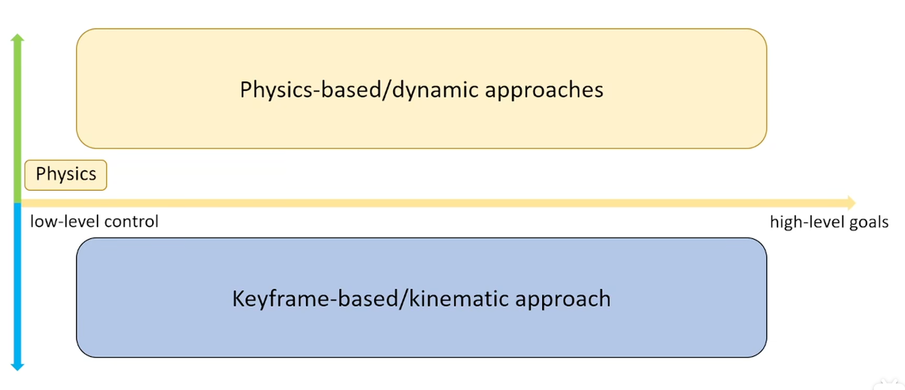

## 二、关键帧动画 (Keyframe Animation)

### 基本概念
- 动画师在关键时间点设置关键姿态（关键帧）
- 中间帧由计算机自动插值生成
- 是最基础、最广泛使用的动画技术

### 插值方法
- **线性插值**：简单但运动生硬，适用于机械运动
- **样条插值（Spline Interpolation）**：使用 Catmull-Rom 或 Hermite 样条，曲线平滑，运动自然
- **贝塞尔曲线**：可控性强，通过控制点调节曲线形状，广泛使用于动画编辑器

### 曲线类型
关键帧之间动画曲线的切线类型影响插值行为：

| 切线类型 | 表现 | 用途 |
|------|------|------|
| **Auto / Clamped Auto** | 自动计算平滑切线 | 平滑过渡 |
| **Linear** | 恒定速度 | 机械运动 |
| **Constant (Stepped)** | 保持直到下一关键帧 | 瞬间状态切换 |
| **Custom** | 手动调节切线权重 | 精确控制 |

### BVH 动画格式
- BVH（Biovision Hierarchy）是 MoCap 数据的最常用交换格式
- 文件结构：`HIERARCHY`（骨架定义） + `MOTION`（帧数据）
- HIERARCHY 定义关节父子关系 + OFFSET（骨骼长度）
- MOTION 定义每帧的 root position + 各关节 Euler 旋转
- 所有子关节存的是 **Local Rotation**（相对父关节）

### 优缺点
| 优点 | 缺点 |
|------|------|
| 动画师完全控制 | 工作量大 |
| 艺术表现力强 | 难以实时响应 |
| 技术成熟 | 需要专业技能 |

---

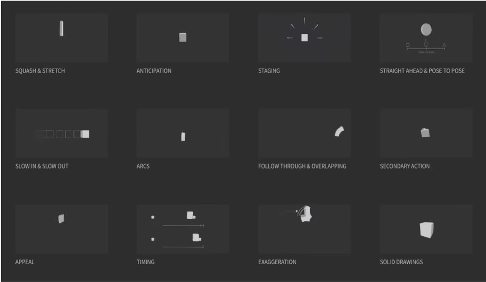

这个动画不赖

## 三、运动学

### 前向运动学 (Forward Kinematics, FK)
- **原理**：给定关节角度，计算末端位置
- **过程**：从根节点沿骨骼树向下计算
- **特点**：计算简单，结果确定
- **适用场景**：动画师直接控制关节旋转

### 逆向运动学 (Inverse Kinematics, IK)
- **原理**：给定末端目标位置，反算关节角度
- **过程**：有点像递归根据结果算出过程
- **特点**：需要求解，可能有多个或无解

### IK 求解方法
1. **解析法**：精确解，计算快，但只适用于简单结构
2. **数值法（Jacobian方法）**：迭代求解，通用性强
3. **启发式方法（CCD/FABRIK）**：简单高效，适合实时应用

### IK 应用场景
- 脚部踩在不平地面
- 手抓取物体
- 头部看向目标
- 程序化动画

---

## 四、动画重定向 (Retargeting)

### 概念
将一个角色的动画应用到另一个不同骨骼结构的角色上

### 核心挑战
- 骨骼比例不同
- 关节数量不同
- 绑定姿势不同

### 解决方法
1. **骨骼映射**：建立源骨骼与目标骨骼的对应关系
2. **姿态重定向**：转换关节旋转数据
3. **比例调整**：根据肢体长度调整动画
4. **约束处理**：保持脚部接地、避免穿模等

### 应用
- 动画资源复用
- 多角色共享动画库
- 动捕数据应用

---

## 五、状态机与 Motion Graphs

### 动画状态机
- 管理角色不同动画状态之间的切换
- 状态：Idle、Walk、Run、Jump等
- 过渡条件：速度、输入、事件触发

### Motion Graphs
- 将动画片段作为图的节点
- 边表示可能的过渡
- 通过搜索算法找到最优路径

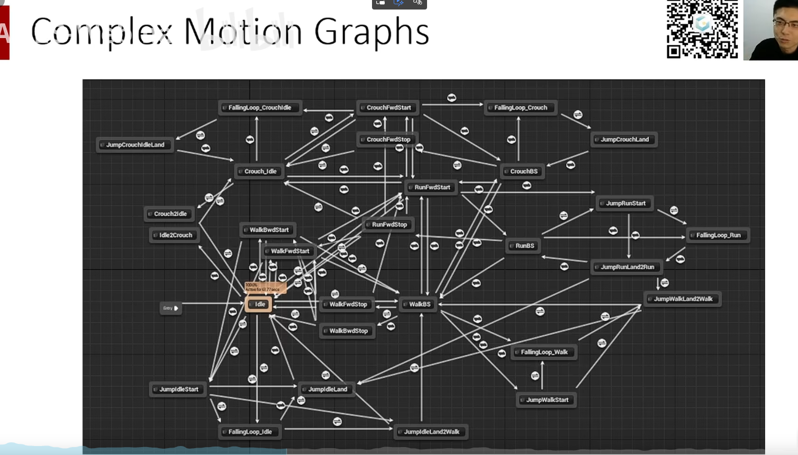

### 关键技术
1. **相似度度量**：评估两个姿态的接近程度
2. **过渡点选择**：选择最平滑的过渡时机
3. **图搜索**：找到满足约束的动画序列

### 优势
- 自动生成复杂动画序列
- 响应式动画生成
- 减少手工工作量

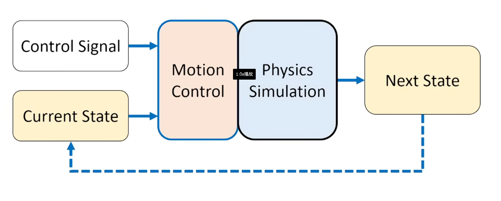

### 与 Motion Matching 的关系
Motion Graphs 和 Motion Matching 都是数据驱动的动画方案，但思路不同：
- **Motion Graphs**：构建动画片段间的过渡图，运行时通过图搜索找路径
- **Motion Matching**：每帧在动画数据库中搜索最匹配当前状态（速度、方向、姿势）的动画帧
- Motion Matching 不需要显式的状态机/图结构，更灵活，但对动画数据量要求更高

### 参考
- GDC 2016: "Motion Matching and The Road to Next-Gen Animation"（育碧，Motion Matching 开创性分享）
- GDC 2021: "Motion Matching in 'The Last of Us Part II'"（Naughty Dog）

---

## 六、Ragdoll 物理布娃娃

### 概念
角色失去控制后，由物理引擎驱动的被动动画（如死亡倒地、受击击飞）。

### 实现要点
1. **骨骼简化**：用刚体（Capsule/Sphere/Box）近似骨骼结构，不要用 Mesh Collider
2. **关节约束**：限制关节的运动范围（如肘部只能 0-150 度），避免反生理姿态
3. **质量分布**：设置各部位质量（躯干最重，手指最轻），保证合理的物理行为
4. **碰撞设置**：避免自身穿透（同角色 Root 以下的碰撞体互相忽略）

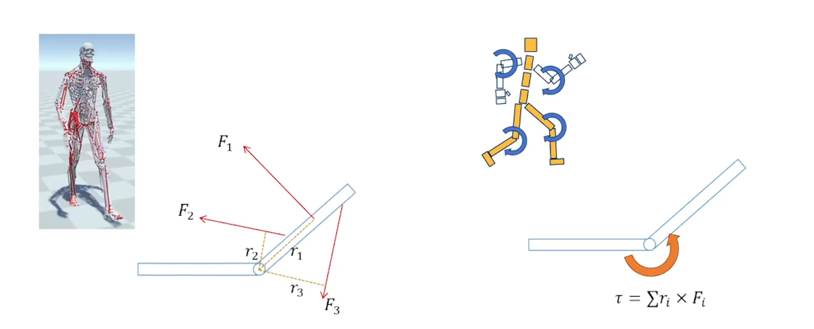

### UE5 中的 Ragdoll 设置
SkeletalMesh -> 右键 -> Create Physics Asset
-> 自动为每根骨骼生成碰撞体
-> 设置 Constraints（角度限制 + 阻尼）
-> 运行时：`Mesh->SetAllBodiesSimulatePhysics(true)`

### Ragdoll 与动画混合
- **GetUp动画**：从倒地姿态恢复站立
- **动态过渡**：动画控制权在物理和动画系统间切换
- **姿态匹配**：从Ragdoll状态找到合适的起身动画起点

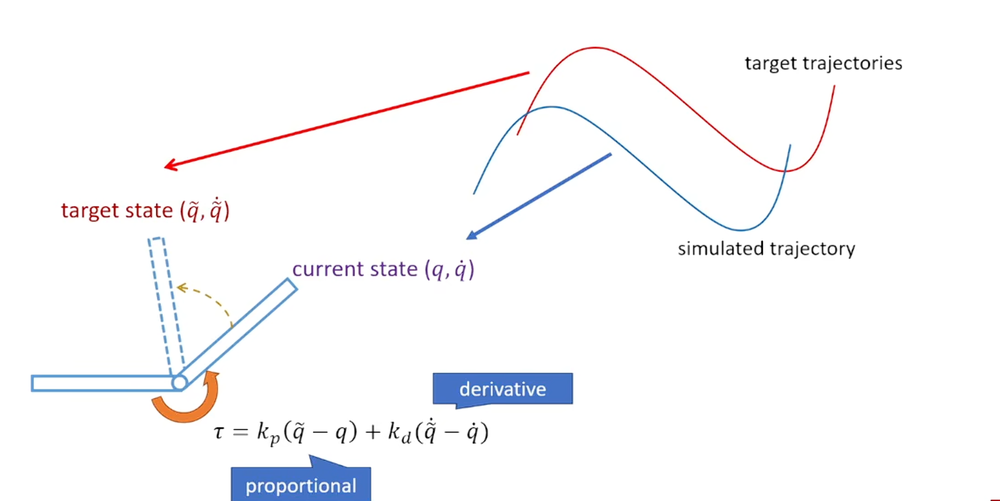

### 优化技巧
- 自适应激活：只在需要时启用物理
- 阻尼设置：防止过度抖动
- 质心调整：保证合理的物理行为

---

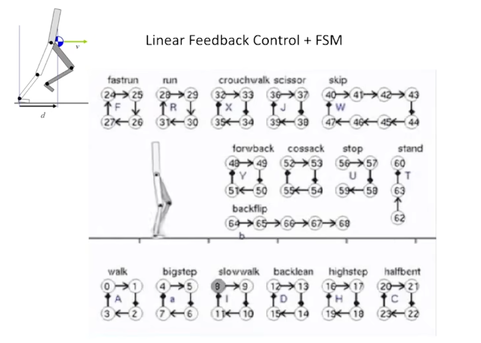

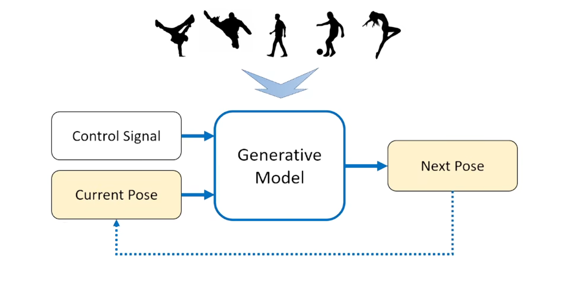

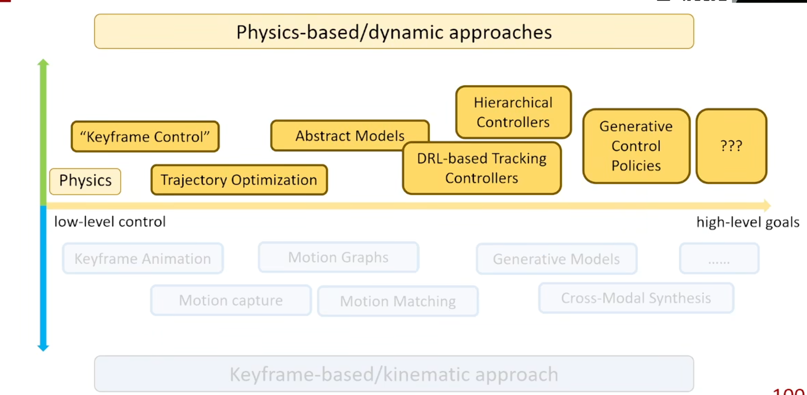

## 七、其他重要概念

### 动画混合 (Blending)

#### 线性混合（Lerp Blending）
最基础的混合方式，对两个动画的每个骨骼变换做线性插值：
Result.BoneTransform = Lerp(A.BoneTransform, B.BoneTransform, Alpha)
- Alpha=0：完全用动画A
- Alpha=1：完全用动画B
- 适用于走跑切换等简单混合

#### 加法混合（Additive Blending）
将一个动画作为"增量"叠加到基础动画上：
Result = Base + (Additive - Ref) * Alpha
- Ref 是加法动画的参考姿态（通常是第一帧或绑定姿态）
- 典型用途：在跑步基础上叠加受击晃动、呼吸起伏
- UE 中通过 Additive Animation Type 设置

#### 遮罩混合（Masked Blending）
通过骨骼遮罩（Bone Mask）只混合部分骨骼：
- 下半身用移动动画，上半身用攻击动画
- UE 中通过 Layered blend per bone 节点实现
- Avatar Mask 可以精确控制每根骨骼的混合权重

#### BlendSpace（UE 专属）
基于 1D 或 2D 参数空间的动画混合。使用 Delaunay 三角剖分将 Sample 点组织为三角形网格，当输入参数落在某三角形内时，只激活 3 个顶点动画做 3-way Blend。

### 程序化动画 (Procedural Animation)
- 运行时生成的动画，不依赖预录制动画片段
- **IK 脚步适配**：脚部根据地面高度自动调整（Two Bone IK / FABRIK）
- **注视行为（Aim Offset / Look At）**：头部/脊柱根据目标方向自动旋转
- **物理驱动的次级动画**：头发、衣服褶皱、尾巴摆动（AnimDynamics / Physics Control）
- **程序化爬墙/攀爬**：根据墙壁法线自动调整手和脚的吸附位置

### 动画压缩

动画数据（位置、旋转、缩放曲线）在原始形式下占用大量内存。以 30fps 的角色动画为例：
- 50 根骨骼 x 3 条曲线（位置+旋转x2）x 每帧 4 字节 x 30fps x 10 秒 = 约 180KB/片段
- 1000 个动画片段 = 180MB

#### 压缩策略

| 策略 | 原理 | 效果 |
|------|------|------|
| **关键帧精简（Key Reduction）** | 删除对视觉无影响的冗余关键帧 | 压缩 50%-70% |
| **曲线拟合（Curve Fitting）** | 用低阶多项式或贝塞尔逼近原始曲线 | 压缩 60%-80% |
| **量化（Quantization）** | 将浮点值映射为整数（如 16bit）存储 | 压缩 50% |
| **线性键压缩（Linear Key Removal）** | 线性变化段的中间帧可以删除 | 额外 10%-30% |
| **常量检测** | 不变的曲线只存一个值 | 极小 |

#### UE 中的动画压缩
- UE 支持多种压缩算法（`UAnimCompress` 子类）
- 常用：`ACL`（Animation Compression Library）-- 开源，压缩比极高
- 可在 Animation Sequence 的 Compression 设置中调整精度
- 误差度量：比较压缩前后骨骼变换的最大偏差

---

## 八、IK 求解器全面对比

Games105 覆盖了四种主要的 IK 求解方法。详细推导和代码见 [附B、IK 算法详解](#附bik-算法详解)。

| | Two Bone IK | CCD | 梯度下降 | Jacobian DLS | FABRIK |
|------|------|------|------|------|------|
| **类型** | 解析法 | 几何迭代 | 数值优化 | 数值优化 | 几何迭代 |
| **迭代次数** | 0（单次解） | 5-20 | 10-50 | 3-10 | 5-10 |
| **数学难度** | 余弦定理 | 极低 | 偏导数 | 矩阵伪逆 | 几何 |
| **多末端** | 不支持 | 不支持 | 不支持 | 支持 | 需扩展 |
| **角度限制** | 需额外处理 | 极易 | 需额外 | 需额外 | 中等 |
| **引擎选用** | UE TwoBoneIK | UE CCDIK | 研究用 | UE FullBodyIK | UE FABRIK |

**工程建议**：
- 两条骨骼（手臂/腿）：Two Bone IK（解析法，零迭代开销）
- 两条以上 + 简单实现：CCD（几十行代码）
- 两条以上 + 姿态自然：FABRIK（最快最自然）
- 全身 IK（手脚同时约束）：Jacobian DLS

---

## 九、UE5 工程实践对照

以下是 Games105 课程概念在 UE5 中的对应实现：

| 课程概念 | UE5 实现 |
|------|------|
| FK 前向运动学 | AnimGraph 中直接连接节点（默认即为 FK 计算） |
| IK 逆向运动学 | Two Bone IK / FABRIK / CCDIK / FullBodyIK 节点 |
| 动画状态机 | StateMachine 状态机节点 |
| BlendSpace | BlendSpace 节点 + BlendSpace 资产 |
| 动画混合 | Blend Poses / Layered blend per bone / BlendSpace |
| 动画重定向 | IK Rig + IK Retargeter 资产 |
| Ragdoll 物理 | Physics Asset + Set All Bodies Below Simulate Physics |
| Root Motion | Root Motion 提取 + Montage |
| 动画事件 | AnimNotify / AnimNotifyState |
| Motion Matching | Pose Search Schema + Chooser + Motion Matching 节点 |
| 动画压缩 | ACL 压缩插件 / Animation Compression 设置 |
| 骨骼遮罩 | Layered blend per bone + Bone Mask / Blend Mask 资产 |

---

## 十、推荐参考文章

### Games105 课程相关
- **GAMES105 课程主页**：https://games-cn.org/games105/ -- 官方课件、视频、作业
- **知乎 GAMES105 专栏**：搜索 "GAMES105 笔记" / "GAMES105 作业" 有大量学习笔记
- **Bilibili**：搜索 "GAMES105 游戏动画" 有完整录播

### 线性代数基础
- **《3Blue1Brown - 线性代数的本质》**：YouTube/B站，动画可视化理解向量、矩阵、特征值
- **《游戏引擎中的线性代数》**（知乎专栏）：从点乘叉乘到四元数的游戏开发视角讲解

### IK 与动画算法
- **《CCD 循环坐标下降法 IK 详解》**（CSDN）：CCD 算法的完整推导 + Unity 代码
- **《FABRIK: A fast, iterative solver for the Inverse Kinematics problem》**：FABRIK 原始论文
- **《Full Body IK in Unreal Engine》**（UE 官方文档）：UE5 FullBodyIK 节点使用
- **Ryan Brucks - IK 系列博客**：UE 动画 TA 的实战教程（shaderbits.com）

### 动画系统架构
- **《Unreal Engine Animation System Overview》**（UE 官方文档）
- **《Game Engine Architecture》- Animation Chapter**（Jason Gregory）
- **《Motion Matching in 'The Last of Us Part II'》**（Naughty Dog GDC）
- **GDC 2016: Motion Matching and The Road to Next-Gen Animation**（育碧）

### 物理动画
- **《Ragdoll Physics in Games》**：布娃娃系统的原理与优化
- **UE Physics Control Component**：UE5 新增的物理动画控制系统
- **Natural Motion (Euphoria/Morpheme)**：R* 使用的程序化物理动画引擎

### 动画压缩
- **ACL (Animation Compression Library)**：https://github.com/nfrechette/acl -- UE 5.1+ 内置
- **《Animation Compression in UE》**（UE 官方文档）：压缩设置指南

> 学完 Games105 后建议的学习路径：
> 1. 用 Python 实现一轮 FK/IK/CCD/FABRIK/Jacobian -- 理解数学本质
> 2. 在 UE5 中搭建一个完整的状态机 + BlendSpace 的第三人称动画
> 3. 阅读 UE 源码 `AnimNode_` 系列 -- 理解工业级动画管线
> 4. 看 GDC Motion Matching 分享 -- 了解最前沿方向

---

## 十一、线性代数基础

> 参考：https://www.cnblogs.com/3-louise-wang/p/17410788.html

### 1. 向量

- 向量是一种同时具有大小和方向的量：给定向量 a，大小为 ||a||，方向为 a/||a||（归一化）
- 可以表示一个位置、特征值等

### 2. 向量叉乘与 Rodrigues 旋转公式

叉乘的作用在于寻找一个**同时垂直**于两个向量的向量，比如法向量。

给定两个向量，如何求出其中一个向量旋转到另一个向量的最小旋转？
- **利用叉乘得到旋转轴**：`axis = normalize(a x b)`
- **利用点乘得到最小旋转角**：`theta = arccos((a dot b) / (||a|| * ||b||))`

如果给定旋转轴 u（单位向量）和旋转角 theta，如何得到旋转后的向量？

**Rodrigues 旋转公式**：
```
b = a + (sin theta) * (u x a) + (1 - cos theta) * (u x (u x a))
```

推导思路（将 a 分解为平行于 u 和垂直于 u 的分量）：
- 平行分量 a_parallel = (a dot u) * u -- 旋转后不变
- 垂直分量 a_perp = a - a_parallel -- 在垂直于 u 的平面内旋转 theta
- 在旋转平面内，构造两个正交基底：v = u x a_perp / ||a_perp||，t = u x v
- 旋转后：a' = a_parallel + ||a_perp|| * (cos(theta)*v + sin(theta)*t)
- 代入化简即得 Rodrigues 公式

### 3. 矩阵

- **特殊矩阵**：零矩阵、单位矩阵 I、对角矩阵、对称矩阵、反对称矩阵
- **矩阵操作**：转置 A^T、逆 A^{-1}、行列式 det(A)、迹 trace(A)
- **叉乘的矩阵形式**：向量叉乘 u x v 可以表示为反对称矩阵乘法 [u]_x * v

其中 [u]_x 是向量 u 的反对称矩阵（skew-symmetric matrix）：
```
        [   0   -uz   uy  ]
[u]_x = [  uz    0   -ux  ]
        [ -uy   ux    0   ]
```

叉乘转换为矩阵乘法：`u x v = [u]_x * v`

- **旋转用矩阵表示**：Rodrigues 旋转公式的矩阵形式：
  `R = cos(theta)*I + (1-cos(theta))*u*u^T + sin(theta)*[u]_x`

- **正交矩阵**：
  - 定义：所有列（行）互相正交 -> A^T = A^{-1}，即 A^T A = I
  - 正交矩阵的列向量都是单位向量且两两正交：a_i^T * a_j = 0 (i != j)，a_i^T * a_i = 1
  - 行列式 det(A) = +/- 1，满足右手定则为 +1
  - 旋转矩阵是行列式为 +1 的正交矩阵（SO(3)）
  - 对于 3x3 的正交矩阵 U，至少有一个实特征值 lambda = det(U) = +/- 1

### 4. 刚体变换（Rigid Transformation）

- **旋转矩阵的性质**：R^T = R^{-1}，det(R) = 1，R 的列向量是单位正交基
- **旋转的组合从右往左**：R_total = R_z * R_y * R_x（先绕 X 轴，再 Y，最后 Z）
- **绕坐标轴旋转的矩阵**：

```
         [ 1    0      0   ]         [ cos   0  sin ]         [ cos  -sin  0 ]
R_x(t) = [ 0  cos  -sin ]  R_y(t)= [  0    1   0  ]  R_z(t)= [ sin   cos  0 ]
         [ 0  sin   cos ]          [-sin   0  cos ]         [  0     0   1 ]
```

---

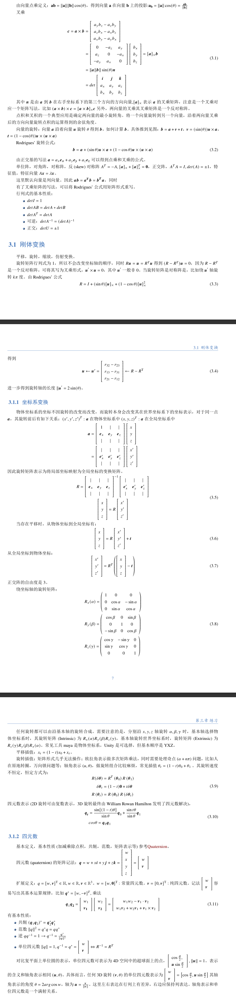

Two Bone IK

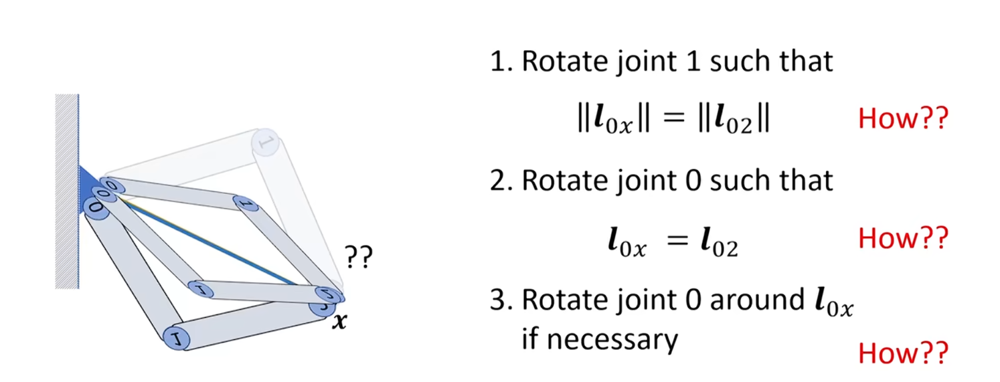

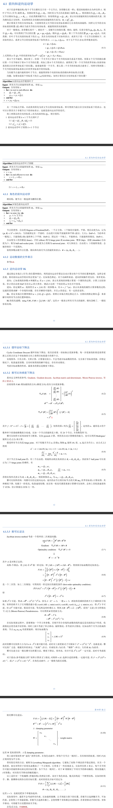

## 十二、CCD 算法详解

**反向运动学 (IK) 是一种设置动画的方法，它翻转链操纵的方向。它是从叶子而不是根开始进行工作的。**

### CCD 策略思路

1. 从最小子骨骼开始遍历并趋近目标
2. 每个骨骼都将其子骨骼的轴点作为跟随点（最小子骨骼无子节点需直接跟随目标点），开始趋近
3. 骨骼跟随方法为，以自身轴点与目标点的方向为骨骼变换方向，并将骨骼终点与目标点对齐

从目标点（X）开始求解，并从链式结构的"叶节点"到"根节点"逐渐将整个链式结构趋近目标位置。

**范例：**
构建链式结构：[P2,P1]、[P3,P2]、[P4,P3]，其长度分别为 d1,d2,d3
（A）从尾端开始，以[P4,P3]开始逼近 X 点
（B）d3趋近，连接[P3,X]，将[P4,P3]移动至[P4',P3']，P4' == X
（C）d2趋近，连接[P2,P3']，将[P3,P2]移动至[P3',P2']
（D）d1趋近，连接[P1,P2']，将[P2,P1]移动至[P2',P1']

### 角度限制

每一根骨骼在运动的过程中往往都会受到铰连接带来的运动角度限制。
在链式结构跟随目标点运动时每个骨骼的运动角度都是相对的，即每个骨骼的角度限制都是以其子骨骼为相对方向。
叶子节点因为没有子骨骼就没有什么限制。

### Unity 实现代码

```csharp
public class Segment {
    public float len;           // 线段长度
    public Vector2 angleLimt = new Vector2(-180f, 180f); // 角度限制范围
    public Color color = Color.white; // Gizmo color

    public Vector2 a { get; private set; } // 线段起点
    public Vector2 b { get; private set; } // 线段终点
    public Vector2 forward { get { return (b - a).normalized; } }

    /// <summary>
    /// 跟随目标节点,并计算自身位置
    /// </summary>
    public void Follow(Vector2 target, Vector2 prevDir, Vector2 limt, bool isForward = true) {
        if (isForward) {
            a = -(target - a).normalized * len + target;
            b = target;
        } else {
            a = target;
            b = -(target - b).normalized * len + target;
        }
        if (limt.x != -180 || limt.y != 180) LimtAngle(prevDir, limt, isForward);
    }

    /// <summary>
    /// 角度限制
    /// </summary>
    private void LimtAngle(Vector2 prevDir, Vector2 limt, bool isForward) {
        // 计算当前方向与上一段方向的角度差
        // 限制在 limt.x 到 limt.y 范围内
    }
}
```

---

![CharacterAnimation Extract[18-31] conv 0](../assets/CharacterAnimation Extract[18-31] conv 0.png)

![CharacterAnimation Extract[18-31] conv 1](../assets/CharacterAnimation Extract[18-31] conv 1.png)

![CharacterAnimation Extract[18-31] conv 2](../assets/CharacterAnimation Extract[18-31] conv 2.png)

![CharacterAnimation Extract[18-31] conv 3](../assets/CharacterAnimation Extract[18-31] conv 3.png)

![CharacterAnimation Extract[18-31] conv 4](../assets/CharacterAnimation Extract[18-31] conv 4.png)

![CharacterAnimation Extract[18-31] conv 5](../assets/CharacterAnimation Extract[18-31] conv 5.png)

![CharacterAnimation Extract[18-31] conv 6](../assets/CharacterAnimation Extract[18-31] conv 6.png)

![CharacterAnimation Extract[18-31] conv 7](../assets/CharacterAnimation Extract[18-31] conv 7.png)

![CharacterAnimation Extract[18-31] conv 8](../assets/CharacterAnimation Extract[18-31] conv 8.png)

![CharacterAnimation Extract[18-31] conv 9](../assets/CharacterAnimation Extract[18-31] conv 9.png)

![CharacterAnimation Extract[18-31] conv 10](../assets/CharacterAnimation Extract[18-31] conv 10.png)

![CharacterAnimation Extract[18-31] conv 11](../assets/CharacterAnimation Extract[18-31] conv 11.png)

![CharacterAnimation Extract[18-31] conv 12](../assets/CharacterAnimation Extract[18-31] conv 12.png)

# 附录

## 附A、动画参数与 BVH 解析

### A.1 每个关节的三样东西

无论 FK / IK / Retarget / 引擎（Unity / UE），本质都只需要：

**Joint = (Position, Rotation, BoneLength)**

| 参数 | 符号 | 含义 | 来源 |
|------|------|------|------|
| **Position (p)** | `p_i` | 关节在世界空间的位置 | FK 计算得出 |
| **Rotation (R)** | `R_i` (四元数) | 关节的旋转 | BVH 中的 Euler 角转换 |
| **Bone Length (l)** | `l_i` (offset) | 骨骼长度（局部空间） | BVH HIERARCHY 中的 OFFSET |

---

### A.2 BVH 文件结构详解

BVH（Biovision Hierarchy）文件由两部分组成：

```
HIERARCHY（骨架定义）
  ROOT hip
    OFFSET 0.00 0.00 0.00         <- 根关节位置偏移
    CHANNELS 6 X Y Z ...          <- 根关节动画通道（6个：posX,Y,Z + rotZ,X,Y）
    JOINT spine
      OFFSET 0.00 10.0 0.00       <- spine 相对 hip 的偏移
      CHANNELS 3 Z X Y            <- spine 只有旋转通道（3个：rotZ,X,Y）
      JOINT chest ...
    End Site                      <- 末端（无关节，只标记骨骼终点）
      OFFSET 0.00 5.0 0.00
  ...

MOTION（帧数据）
  Frames: 1000
  Frame Time: 0.033333            <- 30fps
  0.00 80.00 0.00 0.00 0.00 0.00 ...  <- 第1帧
  0.01 80.01 0.00 1.00 0.00 0.00 ...  <- 第2帧
  ...
```

#### HIERARCHY 部分：骨架结构

- **ROOT**：唯一的根关节（如 hip/hips），有 6 个通道：`position[X,Y,Z] + rotation[Z,X,Y]`
- **JOINT**：非根关节（如 spine/arm/leg），只有 3 个通道：`rotation[Z,X,Y]`
- **OFFSET**：子关节相对父关节的位置偏移（`(x, y, z)` 向量），这就是**骨骼长度和方向**
- **End Site**：链末端的终止点（如手指尖、头顶），只有 OFFSET 没有 CHANNELS
- **CHANNELS**：每帧数据中包含的通道数量和顺序

#### MOTION 部分：动画帧数据

- **Frames**：总帧数
- **Frame Time**：每帧时间间隔（例如 1/30 = 0.033333 秒）
- **数据行**：每行按 HIERARCHY 定义的 CHANNELS 顺序排列
  - 根关节 6 个值：`posX posY posZ rotZ rotX rotY`
  - 每个子关节 3 个值：`rotZ rotX rotY`

---

### A.3 从 BVH 提取三个核心参数

#### (1) Offset（骨骼结构）-- 静态数据

从 HIERARCHY 部分的 OFFSET 行提取：

```python
def parse_hierarchy(bvh_lines):
    """解析 BVH 骨架结构，提取 OFFSET 和父子关系"""
    joints = []          # [(name, parent_index, offset)]
    stack = [("ROOT", -1)]  # (joint_name, parent_index)

    for line in bvh_lines:
        if "OFFSET" in line:
            # 提取 offset = 骨骼在父关节坐标系下的位置
            _, x, y, z = line.strip().split()
            offset = np.array([float(x), float(y), float(z)])
            joint_name = stack[-1][0]
            parent_idx = stack[-1][1]
            joints.append((joint_name, parent_idx, offset))

        elif "JOINT" in line or "ROOT" in line:
            name = line.strip().split()[1]
            stack.append((name, len(joints)))

        elif "End Site" in line:
            stack.append(("EndSite", len(joints)))

        elif "}" in line:
            stack.pop()  # 退出当前关节

    return joints
```

提取结果 `joint_offset[i]`：
- 这是子关节相对父关节的**初始偏移向量**（局部坐标）
- 长度为 `||offset||` = 骨骼长度
- 方向为 `offset / ||offset||` = 骨骼在绑定姿态下的方向
- 这个值**不随动画帧变化**，是骨架的静态结构

#### (2) Rotation（动画核心）-- 帧数据

从 MOTION 部分每帧提取各关节的 Euler 旋转：

```python
def parse_motion(bvh_lines, joints):
    """解析 BVH MOTION 部分，提取每帧的关节旋转和根位移"""
    frames = []
    # ROOT: 6 channels (posX, posY, posZ, rotZ, rotX, rotY)
    # JOINT: 3 channels (rotZ, rotX, rotY)

    for line in bvh_lines:
        values = [float(v) for v in line.strip().split()]
        frame_data = {}
        channel_offset = 0

        for joint_name, parent_idx, offset in joints:
            is_root = (parent_idx == -1)

            if is_root:
                # 根关节：提取位置 + 旋转（6个通道）
                root_pos = np.array(values[channel_offset:channel_offset+3])
                rot_zxy = values[channel_offset+3:channel_offset+6]
                channel_offset += 6

                # BVH 旋转顺序是 ZXY，转换为旋转矩阵
                R_local = R.from_euler('ZXY', rot_zxy, degrees=True)
                frame_data[joint_name] = {
                    'position': root_pos,
                    'rotation': R_local
                }
            else:
                # 子关节：只提取旋转（3个通道）
                rot_zxy = values[channel_offset:channel_offset+3]
                channel_offset += 3

                R_local = R.from_euler('ZXY', rot_zxy, degrees=True)
                frame_data[joint_name] = {
                    'rotation': R_local
                }

        frames.append(frame_data)

    return frames
```

提取结果：每关节每帧的 `R_local`
- 这是**局部旋转**（相对父关节的旋转），用四元数或旋转矩阵表示
- 输入是 BVH 的 ZXY Euler 角（度数），需转换为旋转矩阵/四元数
- 这就是动画的**本质数据**

#### (3) Root Position（角色移动）-- 帧数据

```python
p_root = frame_data['ROOT']['position']  # (px, py, pz) 世界位移
```

- **只有 ROOT 关节有位置动画**
- 其他所有关节的位置都由 FK 递推计算得出
- root position 表示角色在世界空间中的移动轨迹

---

### A.4 FK 核心公式与实现

给定每帧每关节的局部旋转 `R_i` 和骨架 offset `l_i`，通过 FK 计算世界空间姿态：

#### 位置递推（父 -> 子）

```
p_i = p_parent + Q_parent · l_i

其中：
  p_i       = 关节 i 的世界空间位置
  p_parent  = 父关节的世界空间位置
  Q_parent  = 父关节的世界空间旋转（四元数）
  l_i       = 关节 i 的局部 offset（骨骼向量）
```

#### 旋转递推（父 -> 子）

```
Q_i = Q_parent · R_i

其中：
  Q_i       = 关节 i 的世界空间旋转
  Q_parent  = 父关节的世界空间旋转
  R_i       = 关节 i 的局部旋转（从 BVH 提取）
```

#### 完整 Python 实现

```python
def forward_kinematics(joints, frame_data):
    """
    输入：骨架结构 + 一帧的局部旋转数据
    输出：所有关节的世界空间位置和旋转
    """
    world_positions = []
    world_orientations = []

    for i, (name, parent_idx, offset) in enumerate(joints):
        if parent_idx == -1:  # ROOT
            p_world = frame_data[name]['position']
            Q_world = frame_data[name]['rotation']
        else:
            p_parent = world_positions[parent_idx]
            Q_parent = world_orientations[parent_idx]
            R_local = frame_data[name]['rotation']

            # FK 核心公式
            p_world = p_parent + Q_parent.apply(offset)  # p_i = p_parent + Q_parent · l_i
            Q_world = Q_parent * R_local                 # Q_i = Q_parent · R_i

        world_positions.append(p_world)
        world_orientations.append(Q_world)

    return world_positions, world_orientations
```

---

## 附B、IK 算法详解

> 参考：GAMES105 课程、知乎《IK 算法总结》、CSDN《CCD IK 详解》、FABRIK 原始论文

IK（Inverse Kinematics，逆向运动学）的核心问题是：**给定末端效应器（end effector）的目标位置，反算各关节应该旋转多少度**。

这是一个"反向"问题——FK 是从关节角算末端位置（确定性的），IK 是从末端位置反推关节角（可能有零个、一个或多个解，需要迭代求解）。

---

### B.1 Two Bone IK（解析法）

#### 适用场景

最简单的 IK 场景：只有两根骨骼（如大腿+小腿、大臂+小臂）。因为只有 2 个自由度（两个关节各绕一个轴旋转），存在解析解。

这是 UE5 中 `Two Bone IK` 节点和 Unity 中 `TwoBoneIK` 约束的数学基础。

#### 几何分析

```
关节结构：
  Joint0 ----(len1)---- Joint1 ----(len2)---- End

已知：
  - Joint0 位置（固定，如肩膀/髋关节）
  - Target 位置（末端目标，如手要够到的位置）
  - len1, len2（骨骼长度，常量）

求解：
  - Joint1 的位置（即肘/膝盖的位置）
  - Joint0 和 Joint1 的旋转
```

#### 三角形求解法

从 Joint0 到 Target 的距离为 d，两根骨骼 len1 和 len2 与 d 构成三角形：

```
          Joint1
         /      \
    len1/        \len2
       /          \
  Joint0 -------- Target
           d
```

**第一步：用余弦定理求 Joint1 的位置**

```
d = distance(Joint0, Target)

# 余弦定理：len2^2 = len1^2 + d^2 - 2*len1*d*cos(alpha)
cos_alpha = (len1^2 + d^2 - len2^2) / (2 * len1 * d)
alpha = arccos(clamp(cos_alpha, -1, 1))

# Joint1 在 Joint0->Target 方向上旋转 alpha 角度
base_dir = normalize(Target - Joint0)
bend_normal = cross(base_dir, reference_pole)  # 弯曲方向（由Pole Vector决定）

# Joint1 的位置
joint1_pos = Joint0 + len1 * rotate(base_dir, alpha, bend_normal)
```

**第二步：计算 Joint0 的旋转**

```python
# Joint0 需要从初始方向旋转到 Joint1 方向
initial_dir0 = normalize(joint1_offset)  # 绑定姿态下骨骼方向
current_dir0 = normalize(joint1_pos - Joint0)
rot0 = rotation_between(initial_dir0, current_dir0)
```

**第三步：计算 Joint1 的旋转**

```python
# Joint1 需要从初始方向旋转到 Target 方向
initial_dir1 = normalize(joint2_offset)
current_dir1 = normalize(Target - joint1_pos)
rot1_local = rotation_between(initial_dir1, current_dir1)
# 注意：这是相对 Joint1 的局部旋转
```

#### 完整代码

```python
def two_bone_ik(joint0_pos, target_pos, len1, len2, pole_vector):
    """
    Two Bone IK 解析解
    
    参数:
        joint0_pos: 根关节位置（肩膀/髋）
        target_pos: 末端目标位置（手/脚的目标）
        len1: 第一根骨骼长度
        len2: 第二根骨骼长度
        pole_vector: 弯曲方向参考向量（决定肘/膝盖朝哪个方向弯）
    
    返回:
        joint1_pos: 中间关节位置
        rot0: Joint0 的旋转
        rot1_local: Joint1 的局部旋转
    """
    # 1. 计算距离
    to_target = target_pos - joint0_pos
    d = np.linalg.norm(to_target)
    
    # 2. 可达性检查
    if d > len1 + len2:
        # 手太远，伸直整条手臂
        to_target /= d
        joint1_pos = joint0_pos + len1 * to_target
    elif d < abs(len1 - len2):
        # 手太近，折叠到极限
        to_target /= d if d > 1e-6 else 1.0
        joint1_pos = joint0_pos + len1 * to_target
    else:
        # 3. 余弦定理求角度
        cos_alpha = (len1**2 + d**2 - len2**2) / (2 * len1 * d)
        cos_alpha = np.clip(cos_alpha, -1.0, 1.0)
        alpha = np.arccos(cos_alpha)
        
        # 4. 确定弯曲方向（Pole Vector 决定）
        to_target /= d
        bend_axis = np.cross(to_target, pole_vector)
        bend_axis /= np.linalg.norm(bend_axis)
        
        # 5. 旋转 base_dir 得到 joint1 位置
        rot_vec = alpha * bend_axis
        rot = R.from_rotvec(rot_vec)
        joint1_dir = rot.apply(to_target)
        joint1_pos = joint0_pos + len1 * joint1_dir
    
    return joint1_pos
```

#### 优缺点

| 优点 | 缺点 |
|------|------|
| 单次计算，无迭代开销 | 仅支持 2 根骨骼 |
| 结果确定，无收敛问题 | 需要额外处理可达性边界情况 |
| 计算极快（毫秒级以下） | 无法约束角度限制 |

---

### B.2 CCD（循环坐标下降法）

#### 核心思想

CCD（Cyclic Coordinate Descent）是**最简单、最直观**的迭代 IK 方法。

从骨骼链的末端开始，逐关节向根方向遍历。对每个关节：
1. 计算"从这个关节看，末端应该指向哪里"
2. 旋转这个关节，让末端直接指向目标
3. 然后向上移动到父关节，重复

因为它每次都把末端"对准"目标，像一个一个关节"贪心"地拉过去——这就是 Coordinate Descent（坐标下降）的含义。

#### 几何直观

```
初始状态：Joint0-Joint1-Joint2-...-End不在目标处

第1轮迭代：
  Step1: 旋转最后面的Joint_n-1，使End直接指向Target
    -> 现在 End 离 Target 近了一些
  Step2: 旋转Joint_n-2，使End直接指向Target
    -> End 又近了一些
  ...
  Step N: 旋转Joint0
    -> 完整一轮结束

第2轮：重复上述过程，End渐渐逼近Target
```

可以把 CCD 想象成：末端系着一根橡皮筋连着目标，从尾到头依次旋转每个关节，每次旋转都把末端往目标方向拉。

#### 单关节旋转公式

对于关节 i，已知：
- `joint_i`：关节的世界位置
- `end`：当前末端位置
- `target`：目标位置

要旋转关节 i，使 `(end - joint_i)` 旋转到 `(target - joint_i)` 方向：

```python
# 从关节指向末端的向量
v_cur = end - joint_i
# 从关节指向目标的向量
v_target = target - joint_i

# 旋转轴：垂直于 v_cur 和 v_target
axis = normalize(cross(v_cur, v_target))

# 旋转角度：v_cur 和 v_target 的夹角
theta = arccos(dot(normalize(v_cur), normalize(v_target)))

# 旋转关节（世界空间）
R_delta = R.from_rotvec(theta * axis)
joint_orientation[i] = R_delta * joint_orientation[i]
```

#### 完整算法伪代码

```
CCD_IK(joints, target, max_iter=10, threshold=0.001):
    for iter in 1..max_iter:
        # FK 计算当前末端位置
        end = forward_kinematics(joints)
        
        # 检查是否到达目标
        if distance(end, target) < threshold:
            break
        
        # 从末端向根方向遍历（跳过末端 effector 本身）
        for i in range(num_joints-2, -1, -1):
            joint_pos = world_positions[i]
            
            # 计算旋转
            v_cur = normalize(end - joint_pos)
            v_target = normalize(target - joint_pos)
            
            if v_cur == v_target:
                continue  # 已经对准
            
            axis = normalize(cross(v_cur, v_target))
            theta = arccos(dot(v_cur, v_target))
            
            # 应用旋转
            R_delta = R.from_rotvec(theta * axis)
            joints[i].orientation = R_delta * joints[i].orientation
            
            # 旋转后重新 FK（因为后续关节位置变了）
            end = forward_kinematics(joints)
```

#### 角度限制

CCD 最容易加入角度限制。在旋转每个关节时，检查旋转后的角度是否超出限制范围：

```python
# 计算旋转后的局部角度
local_angle = compute_local_angle(joints[i], joints[i-1])

# clamp 到限制范围
local_angle = clamp(local_angle, min_angle, max_angle)

# 用 limited angle 重新计算旋转
```

#### 优缺点

| 优点 | 缺点 |
|------|------|
| 实现极简单（几十行代码） | 收敛慢，需要多轮迭代 |
| 每个关节只处理一次旋转 | 末端关节承担过多旋转（不自然） |
| 天然支持角度限制 | 容易产生"手肘外翻"等不自然姿态 |
| 不需要矩阵运算 | 多末端约束不支持 |

#### 收敛特性

CCD 的收敛速度取决于骨骼链长度和初始姿态。对于手臂（3-4 个关节），通常 5-10 轮就能收敛；对于长链（如蛇/尾巴），可能需要更多迭代。

CCD 的一个经典问题是"末端效应器承担过多旋转"——离末端近的关节转得多，离根近的关节转得少，导致不自然的姿态（如手腕转了 90 度但肩膀只转了 10 度）。

---

### B.3 梯度下降 IK（Jacobian Transpose 法）

#### 核心思想

把 IK 看作一个**优化问题**：

```
目标函数：E(theta) = 1/2 * ||FK(theta) - target||^2
目标：找到 theta 使 E(theta) 最小
```

E(theta) 是"末端离目标有多远"（误差平方和），越小越好。

梯度下降的核心：**沿着误差函数的负梯度方向走，就能最快地减小误差**。

#### 误差函数的梯度

用链式法则求 E 对每个关节角 theta_i 的偏导数：

```
dE/dtheta_i = (end - target) · (d(end)/dtheta_i)

其中 d(end)/dtheta_i = "关节 i 转一点时末端如何移动"
                     = axis_i x (end - joint_i)
```

所以：

```
grad_i = (end - target) · (axis_i x (end - joint_i))
```

这就是我们反复使用的核心公式！

#### 物理直觉

- `(end - target)`：末端需要向哪个方向移动才能到达目标（误差向量）
- `axis_i x (end - joint_i)`：关节 i 绕 axis_i 转 1 弧度时，末端移动的方向（切线速度方向）
- 两个向量的点积："关节旋转产生的末端移动方向"和"我们需要末端移动的方向"有多一致
  - 点积 > 0：这个关节沿 axis_i 正转能让末端靠近目标，grad_i 告诉我们"需转多少"
  - 点积 < 0：需要反转
  - 点积 ~ 0：这个关节的旋转几乎不影响末端到目标的距离

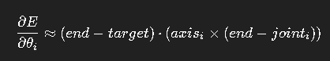

#### 完整流程（6步）

**Step 0：准备数据**
```python
joint_positions      # FK 算出的世界位置
joint_axes           # 每个关节旋转轴（世界空间）
thetas               # 当前关节角度
target               # 目标点
alpha = 0.1          # 学习率
```

**Step 1：迭代循环**
```python
for iter in range(max_iter):
```

**Step 2：FK 计算末端**
```python
    joint_positions = forward_kinematics(thetas)
    end = joint_positions[-1]
```

**Step 3：计算误差向量**
```python
    error = end - target
    if np.linalg.norm(error) < threshold:
        break
```

**Step 4：对每个关节计算梯度**（这是核心！）
```python
    for i in range(num_joints):
        joint_pos = joint_positions[i]
        axis = joint_axes[i]
        r = end - joint_pos                # 关节到末端的力臂
        grad_i = np.dot(error, np.cross(axis, r))
```

这一步等于在问："关节 i 转一点，误差是变大还是变小？变多少？"

**Step 5：沿负梯度方向更新角度**
```python
        thetas[i] -= alpha * grad_i   # 沿负梯度方向
```

**Step 6：收敛判断**
```python
    if np.linalg.norm(error) < threshold:
        break
```

#### 完整 Python 实现（四元数版本）

```python
def ik_gradient_descent(joint_orientations, joint_axes_local, 
                         offsets, target, max_iter=20, alpha=0.05):
    for iter in range(max_iter):
        # FK
        positions, orientations = FK(joint_orientations, offsets)
        end = positions[-1]
        
        error = end - target
        if np.linalg.norm(error) < 0.001:
            break
        
        # 对每个关节
        for i in range(len(joint_orientations)):
            joint_pos = positions[i]
            
            # 局部旋转轴转到世界空间
            axis_local = joint_axes_local[i]
            axis_world = orientations[i].apply(axis_local)
            
            r = end - joint_pos
            grad = np.dot(error, np.cross(axis_world, r))
            
            # 旋转更新
            delta_angle = -alpha * grad
            delta_rot = R.from_rotvec(delta_angle * axis_world)
            joint_orientations[i] = delta_rot * joint_orientations[i]
    
    return joint_orientations
```

#### 优缺点

| 优点 | 缺点 |
|------|------|
| 比 CCD 产生更自然的姿态 | 收敛速度比 Jacobian 慢 |
| 不需要矩阵求逆 | 对学习率 alpha 敏感 |
| 梯度计算简单（叉乘+点乘） | 学习率太大震荡，太小收敛慢 |
| 可以处理冗余自由度 | 可能陷入局部最优 |

---

### B.4 Jacobian 伪逆 IK

#### 核心思想

梯度下降是"一个关节一个关节调"。Jacobian 方法是**一次性算出所有关节应该一起怎么动**。

核心关系（一阶泰勒展开）：

```
delta_x ≈ J · delta_theta

其中：
  delta_x      = 末端位置变化（3x1 向量）
  delta_theta  = 关节角度变化（nx1 向量，n=关节数）
  J            = Jacobian 矩阵（3xn 矩阵）
```

#### Jacobian 矩阵的构造

Jacobian 矩阵的每一列表示"对应的关节旋转时，末端如何移动"：

```
J = [J_0, J_1, J_2, ..., J_{n-1}]

J_i = axis_i x (end - joint_i)

J_i 的物理意义：
  "关节 i 绕 axis_i 旋转 1 弧度时，末端位置的变化量"
  （即末端速度对关节角速度的偏导数）
```

如果关节是旋转关节（revolute），J_i = axis_i x (end - joint_i)。
如果关节是移动关节（prismatic），J_i = axis_i。

#### 从 delta_x 反推 delta_theta

已知 `delta_x = J · delta_theta`，要解 `delta_theta`：

如果 J 是可逆方阵（3 个关节正好控制 3D 位置），直接求逆：
```
delta_theta = J^{-1} · delta_x
```

但通常 J 不是方阵（关节数 != 3），需要**伪逆（Pseudoinverse）**：
```
delta_theta = J^+ · delta_x

其中 J^+ 是 Moore-Penrose 伪逆
```

**伪逆的几何意义**：在所有能让末端移动到目标的 delta_theta 中，选择 **L2 范数最小** 的那个（"关节转得最少"）。

#### 阻尼最小二乘法（DLS，防震荡）

纯伪逆法在接近奇异构型时（如手臂完全伸直）会产生极大的 delta_theta，导致抖动。

DLS 在伪逆中加入阻尼项：

```
delta_theta = J^T · (J · J^T + lambda^2 · I)^{-1} · delta_x

lambda：阻尼系数（通常 0.1 ~ 1.0）
lambda 越大，解越稳定但收敛越慢
lambda 越小，收敛越快但可能震荡
```

#### 完整流程（6步）

**Step 1：计算误差**
```python
error = target - end
if np.linalg.norm(error) < threshold:
    return
```

**Step 2：构建 Jacobian（3 x n 矩阵）**
```python
J = np.zeros((3, n))
for i in range(n):
    joint_pos = positions[i]
    axis = orientations[i].apply(local_axes[i])
    r = end - joint_pos
    J[:, i] = np.cross(axis, r)
```

**Step 3：计算 delta_theta（DLS）**
```python
# Damped Least Squares
JT = J.T
JJT = J @ JT
lambda_sq = 0.5 * 0.5  # lambda^2
delta_theta = JT @ np.linalg.solve(JJT + lambda_sq * np.eye(3), error)

# 或简单伪逆（不带阻尼）
# delta_theta = np.linalg.pinv(J) @ error
```

**Step 4：更新关节**
```python
for i in range(n):
    axis = orientations[i].apply(local_axes[i])
    angle = delta_theta[i]
    rot = R.from_rotvec(angle * axis)
    orientations[i] = rot * orientations[i]
```

**Step 5：FK 更新**
```python
positions, orientations = FK(orientations, offsets)
end = positions[-1]
```

**Step 6：循环**
```python
for iter in range(max_iter):
    ...（重复 Step 1-5）
```

#### 完整 Python 实现

```python
def ik_jacobian(orientations, local_axes, offsets, target, 
                max_iter=20, lambda_damp=0.5):
    for iter in range(max_iter):
        positions, _ = FK(orientations, offsets)
        end = positions[-1]
        
        error = target - end
        if np.linalg.norm(error) < 0.001:
            break
        
        # 构建 Jacobian
        n = len(orientations)
        J = np.zeros((3, n))
        for i in range(n):
            axis = orientations[i].apply(local_axes[i])
            r = end - positions[i]
            J[:, i] = np.cross(axis, r)
        
        # DLS 求解
        JT = J.T
        JJT = J @ JT
        lam = lambda_damp * lambda_damp
        delta_theta = JT @ np.linalg.solve(JJT + lam * np.eye(3), error)
        
        # 更新
        for i in range(n):
            axis = orientations[i].apply(local_axes[i])
            rot = R.from_rotvec(delta_theta[i] * axis)
            orientations[i] = rot * orientations[i]
    
    return orientations
```

#### 优缺点

| 优点 | 缺点 |
|------|------|
| 收敛快（二次收敛） | 需要矩阵求逆/伪逆（计算开销） |
| 一次更新所有关节 | 接近奇异构型时数值不稳定 |
| 支持多末端约束 | 需要 DLS 防震荡 |
| 姿态更自然（全局优化） | 实现比 CCD 复杂 |

#### 常见坑与解决方案

**(1) 抖动/爆炸**：使用 DLS（阻尼最小二乘）替代纯伪逆

**(2) 奇异构型**：手臂完全伸直时 Jacobian 秩不足，DLS 可以缓解

**(3) 不可达**：末端位置超出骨骼链总长度，error 不会变 0（正常，返回最接近的姿态）

**(4) 局部最优**：Jacobian 方法也可能陷入局部最优，但通常比梯度下降好

---

### B.5 FABRIK（前后向 IK）

#### 核心思想

FABRIK（Forward And Backward Reaching Inverse Kinematics）是一种**几何迭代法**，不是基于角度梯度，而是基于**前后向位置调整**。

- **前向（Forward）**：从末端到根，逐关节"拉"向目标
- **后向（Backward）**：从根到末端，逐关节"拉"回根位置

每次前后向迭代都会让末端更接近目标，同时保持骨骼长度不变。

#### 算法流程

```
初始：所有关节位置由 FK 确定

Backward Pass（外循环，从末端到根）：
  1. 把末端关节位置设为目标位置
  2. 对每根骨骼（从末端向根）：
     将关节 i 沿 (joint_{i+1} -> joint_i) 方向拉，保持骨骼长度

Forward Pass（外循环，从根到末端）：
  1. 把根关节位置设回原位
  2. 对每根骨骼（从根向末端）：
     将关节 i+1 沿 (joint_i -> joint_{i+1}) 方向拉，保持骨骼长度
```

#### 单步示例（3 关节）

```
初始：  P0 -------- P1 -------- P2 -------- P3(end)
                                          Target = T

Backward Pass：
  Step 1: P3' = T （末端移到目标）
  Step 2: P2' = P3' + normalize(P2 - P3') * len3 （保持骨骼长度）
  Step 3: P1' = P2' + normalize(P1 - P2') * len2
  Step 4: P0' = P1' + normalize(P0 - P1') * len1

Forward Pass：
  Step 1: P0'' = 原P0位置 （根归位）
  Step 2: P1'' = P0'' + normalize(P1' - P0'') * len1
  Step 3: P2'' = P1'' + normalize(P2' - P1'') * len2
  Step 4: P3'' = P2'' + normalize(P3' - P2'') * len3

一轮迭代结束，P3'' 比初始 P3 更接近 T
```

#### Python 实现

```python
def fabrik(positions, target, bone_lengths, max_iter=10, tol=0.001):
    """
    FABRIK IK
    
    参数:
        positions: 关节位置列表 [P0, P1, ..., Pn]
        target: 末端目标位置
        bone_lengths: 骨骼长度 [len1, len2, ..., len_n]
    """
    n = len(positions)
    root_pos = positions[0].copy()  # 保存根位置
    
    for _ in range(max_iter):
        # 检查收敛
        if np.linalg.norm(positions[-1] - target) < tol:
            break
        
        # ===== Backward Pass (末端到根) =====
        positions[-1] = target  # 末端移到目标
        for i in range(n-2, -1, -1):
            direction = positions[i] - positions[i+1]
            dist = np.linalg.norm(direction)
            if dist > 0:
                direction /= dist
            positions[i] = positions[i+1] + direction * bone_lengths[i]
        
        # ===== Forward Pass (根到末端) =====
        positions[0] = root_pos  # 根归位
        for i in range(n-1):
            direction = positions[i+1] - positions[i]
            dist = np.linalg.norm(direction)
            if dist > 0:
                direction /= dist
            positions[i+1] = positions[i] + direction * bone_lengths[i]
    
    return positions
```

#### 优缺点

| 优点 | 缺点 |
|------|------|
| 收敛极快（通常 5-10 次迭代） | 只调整位置，不直接给出旋转 |
| 不需要角度/梯度/矩阵 | 需要后处理求关节旋转 |
| 天然保持骨骼长度 | 角度限制实现稍复杂 |
| 姿态非常自然 | 多末端约束需扩展 |

FABRIK 是目前**最快的 IK 算法**之一，UE5 的 FABRIK 节点底层就是这个算法。

---

### B.6 四种 IK 算法完整对比

| | Two Bone IK | CCD | 梯度下降 | Jacobian DLS | FABRIK |
|------|------|------|------|------|------|
| **类型** | 解析法 | 几何迭代 | 数值优化 | 数值优化 | 几何迭代 |
| **迭代次数** | 0（单次解） | 5-20 | 10-50 | 3-10 | 5-10 |
| **收敛速度** | 瞬时 | 慢 | 较慢 | 快 | 极快 |
| **每步计算** | O(1) | O(n) | O(n) | O(n^3) | O(n) |
| **数学难度** | 低（余弦定理） | 极低 | 中（偏导数） | 高（矩阵伪逆） | 低（几何） |
| **多末端** | 不支持 | 不支持 | 不支持 | 支持 | 需扩展 |
| **角度限制** | 需额外处理 | 极易 | 需额外 | 需额外 | 中等 |
| **姿态自然度** | 好 | 一般 | 较好 | 好 | 极好 |
| **Unity** | Animation Rigging | 自定义 | 自定义 | 自定义 | Animation Rigging |
| **UE5** | Two Bone IK | CCDIK | - | FullBodyIK | FABRIK |

### 工程选型指南

```
两条骨骼（手臂/腿）？
  -> Two Bone IK（解析法，零开销）

两条以上骨骼，追求实现简单？
  -> CCD（几十行代码）

两条以上骨骼，追求姿态自然？
  -> FABRIK（最快最自然）

全身 IK（手脚同时约束）？
  -> Jacobian DLS（唯一支持多末端的）

不想写代码？
  -> Unity Animation Rigging / UE5 IK 节点

---

## 附C、坐标系（Local / Component / World Space）

在 Unreal Engine（尤其是动画系统、骨骼系统和 Transform 计算里），Local Space（本地空间）、Component Space（组件空间）、World Space（世界空间）是三个最常见的坐标系。

可以理解成：Local Space -> Component Space -> World Space
每一级都是基于上一级计算出来的。

### C.1 Local Space（本地空间）

Local Space 表示**相对于父节点（Parent）的变换**。

例如：前臂 Local Location = (10,0,0) 表示前臂相对于上臂向前偏移 10，而不是相对于角色。

手掌 Local Rotation Pitch = 30 度表示相对于前臂旋转 30 度，而不是世界坐标里的 30 度。

动画蓝图里很多节点默认使用 Bone Space / Local Space，因为动画本质上存的是父骨骼 -> 子骨骼的相对变换。

### C.2 Component Space（组件空间）

Component Space 是**相对于 SkeletalMeshComponent 的坐标系**。

手的位置在 Component Space 为 (50,20,120) 表示手距离 Mesh 原点 X=50, Y=20, Z=120。这里已经不关心父骨骼了，所有骨骼都直接相对于 SkeletalMeshComponent 计算。

### C.3 World Space（世界空间）

World Space 是**相对于整个关卡世界**。

例如 Actor Location = (1000,500,0)，手的位置在 World Space 为 (1050,520,120)，表示手在地图中的真实位置。

### C.4 三者关系

假设 Actor Location=(1000,0,0)，Mesh Relative=(0,0,100)，手 Component=(50,0,120)：
```
World = Actor + Mesh Relative + Component
Hand World = (1050, 0, 220)
```

关系图：
```
World Space
    ^
Actor Transform
    ^
Component Space
    ^
Bone Hierarchy Accumulation (FK)
    ^
Local Space
```

### C.5 实战记忆法

| Space | 相对于谁 | 典型用途 |
|------|------|------|
| Local Space | 父骨骼 | 播放动画、修改骨骼姿态 |
| Component Space | SkeletalMeshComponent | IK、AimOffset、武器持握修正 |
| World Space | 整个地图 | 枪口射线、锁定目标、生成子弹 |

一句话：
- Local = 父骨骼坐标
- Component = 角色Mesh坐标
- World = 世界坐标
