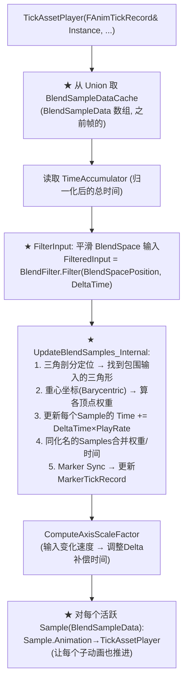
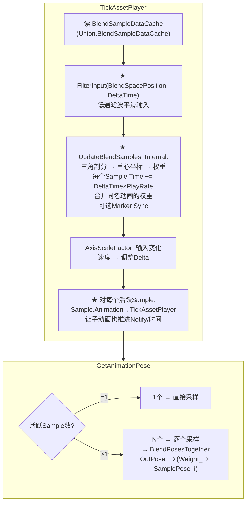

# UE 动画系统：BlendSpace 详解

> 基于 UE 5.7.4 源码。BlendSpace 是 UE 动画系统中和 SequencePlayer 并列的最常用节点。本文覆盖：BlendSpace 的三角剖分原理、UpdateBlendSamples 采样权重计算、TickAssetPlayer 流程、GetAnimationPose 多动画混合、BlendFilter 输入平滑机制。

---

## 一、BlendSpace 是什么？

BlendSpace 是一个**参数化的动画混合空间**。你在动画蓝图里放一个 BlendSpace 节点，给它一个 2D（或 1D）输入参数，它自动找到周围的动画采样点（Samples），按权重混合输出。

```
          Run_Left ●────────● Run_Fwd ────────● Run_Right
                    \      / \      /          /
                     \    /   \    /          /
          Walk_Left ●──● Walk_Fwd ──● Walk_Right
                         
         X轴 = Direction (-180° to +180°)
         Y轴 = Speed     (0 to 800)
         
         输入 (X=0, Y=600) → 激活 Walk_Fwd, Walk_Right, Run_Fwd, Run_Right
```

**核心数据结构**：

| 概念 | 结构 | 含义 |
|------|------|------|
| Sample | `FBlendSample` | 在 BlendSpace 中放置的单个动画资产 |
| Blend Parameter | `FBlendParameter` | 参数化轴（Min/Max/GridNum） |
| Grid Element | `FEditorElement` | 编辑器中三角形网格的节点 |
| Blend Sample Data | `FBlendSampleData` | **运行时**每个活跃 Sample 的动态数据 |
| Triangulation | Delaunay 三角剖分 | 把离散的 Sample 点组织成三角形网格 |

---

## 二、三角剖分原理

BlendSpace 使用 **Delaunay 三角剖分** 把 Sample 点连成不重叠的三角形。

```
      S1 ●───────────● S3
         \         /
          \  Input● (光标位置)
           \     /
            \   /
             \ /
      S0 ●────● S2
```

当输入参数落在某个三角形内时，只有该三角形的**3个顶点** Sample 被激活（在动画之间做**3-way Blend**）。如果 BlendSpace 配备了 `PerBoneBlend` 或更复杂的插值策略，可能会激活更多。

**FBlendSampleData**（每个活跃 Sample 的运行时数据）：

```cpp
struct FBlendSampleData
{
    int32 SampleDataIndex;       // 指向 SampleData[] 的索引
    UAnimSequence* Animation;   // 实际动画资产
    float TotalWeight;          // ★ 此 Sample 在当前输入下的权重 (总和=1.0)
    float WeightRate;           // 权重变化速率（平滑 BlendSpace 使用）
    float Time;                 // 此 Sample 的当前播放时间（归一化后）
    float PreviousTime;          // 上一帧播放时间
    float SamplePlayRate;       // 合并用——多个 Sample 指向同一个动画时的组合播放速率
    FDeltaTimeRecord DeltaTimeRecord;  // 时间记录
    FMarkerTickRecord MarkerTickRecord; // Marker 同步
    TArray<float> PerBoneBlendData;     // Per-Bone 混合权重
};
```

**关键设计**：多个 Sample 可以指向同一个动画！比如 Walk_Fwd 在 (0, 300) 和 (0, 450) 各放了一个 Sample。当输入落在它们之间时，同一个 `UAnimSequence*` 出现两次，但权重不同——系统会把它们的 `Time` 合并。

---

## 三、TickAssetPlayer — 和 Sequence 的本质区别

**`BlendSpace.cpp:481`**

Sequence 的 TickAssetPlayer 推进**一个** `TimeAccumulator`。BlendSpace 的 TickAssetPlayer 完全不同：



### 3.1 FilterInput — 输入平滑

BlendSpace 有一个 `BlendFilter`（`FBlendFilter` 结构），对用户的输入参数做**低通滤波**，防止突然跳变：

```cpp
const FVector FilteredBlendInput = FilterInput(
    Instance.BlendSpace.BlendFilter,
    BlendSpacePosition,  // 用户输入 (x,y,0)
    DeltaTime
);
```

这避免了输入从 (0,0) 瞬间跳到 (1,1) 导致动画剧烈切换。

### 3.2 UpdateBlendSamples — 三角剖分 + 权重计算

```cpp
bool UBlendSpace::UpdateBlendSamples_Internal(
    const FVector& InBlendSpacePosition,
    float InDeltaTime,
    TArray<FBlendSampleData>& OldSampleDataList,  // 上一帧的 (in)
    TArray<FBlendSampleData>& SampleDataList,     // 新的 (out)
    int32& CachedTriangulationIndex)              // ★ 缓存：复用上一帧的三角形
{
    // 1. ★ 三角剖分定位
    //    先尝试 CachedTriangulationIndex（上一帧的三角形）
    //    如果不包含输入点 → 全量搜索
    //    找到包围输入的三角形 → 记录3个顶点 Sample 索引

    // 2. ★ 重心坐标计算权重
    //    Barycentric Coordinates: Input Point → (w0, w1, w2)
    //    其中 w0 + w1 + w2 = 1.0

    // 3. 加权播放速率
    //    Time += DeltaTime × PlayRate × Weight
    //    如果同一个 AnimSequence 出现在多个样本 → 合并 TotalWeight + 组合播放速率

    // 4. TargetWeightInterpolation: 可选平滑权重变化
    if (TargetWeightInterpolationSpeedPerSec > 0.f)
    {
        // 从旧权重向新权重平滑插值
        SampleData.TotalWeight = FMath::FInterpConstantTo(
            OldWeight, NewWeight, DeltaTime, InterpolationSpeed);
    }

    // 5. Marker Sync (如果有)
    if (bCanDoMarkerSync)
    {
        // 找到权重最高的带 Marker 的 Sample 作为 Leader
        // 其他 Sample 按 Leader 的位置跟进
    }
}
```

### 3.3 对每个子动画调 TickAssetPlayer

BlendSpace 的 `TimeAccumulator` 不直接代表任何一个子动画的时间——它是**归一化后的 BlendSpace 总时间**。每个 `FBlendSampleData` 有自己的 `Time` / `PreviousTime` / `DeltaTimeRecord`。BlendSpace 在 TickAssetPlayer 中对每个活跃的子动画调用：

```cpp
for (FBlendSampleData& SampleData : SampleDataList)
{
    // 创建临时的 FAnimTickRecord（用 SampleData.Time 作为 TimeAccumulator）
    FAnimTickRecord SampleRecord(SampleData.Animation, bLooping, PlayRate, ...);
    SampleRecord.TimeAccumulator = &SampleData.Time;
    // ★ 调用子动画的 TickAssetPlayer
    SampleData.Animation->TickAssetPlayer(SampleRecord, NotifyQueue, SubContext);
}
```

---

## 四、GetAnimationPose — 多动画加权混合

**`BlendSpace.cpp:1131`**

```cpp
void UBlendSpace::GetAnimationPose(
    TArray<FBlendSampleData>& BlendSampleDataCache,  // ★ 所有活跃 Sample
    const FAnimExtractContext& ExtractionContext,
    FAnimationPoseData& OutAnimationPoseData) const
{
    // 只有一个活跃 Sample → 直接采样
    if (BlendSampleDataCache.Num() == 1)
    {
        BlendSampleDataCache[0].Animation->GetAnimationPose(OutAnimationPoseData, ExtractionContext);
        return;
    }

    // ★ 多个活跃 Sample → 逐个采样，按权重混合
    FCompactPose& OutPose = OutAnimationPoseData.GetPose();

    if (BlendSampleDataCache.Num() > 0)
    {
        TArray<FCompactPose> ChildPoses;
        TArray<FBlendedCurve> ChildCurves;
        TArray<UE::Anim::FStackAttributeContainer> ChildAttributes;

        FAnimationPoseData FirstSamplePoseData(OutAnimationPoseData);
        // 第一个 Sample：直接写入输出
        BlendSampleDataCache[0].Animation->GetAnimationPose(FirstSamplePoseData, ExtractContext);

        // 后续 Sample：每个单独采样，然后 Blending
        for (int32 SampleIdx = 1; SampleIdx < BlendSampleDataCache.Num(); ++SampleIdx)
        {
            const FBlendSampleData& SampleData = BlendSampleDataCache[SampleIdx];

            // 创建独立的临时骨骼/曲线/属性容器
            FCompactPose ChildPose;
            FBlendedCurve ChildCurve;
            FStackAttributeContainer ChildAttr;

            FAnimationPoseData SamplePoseData(ChildPose, ChildCurve, ChildAttr);
            SampleData.Animation->GetAnimationPose(SamplePoseData, ExtractContext);

            // ★ 按权重把 ChildPose 叠加到 OutPose
            //    如果 TotalWeight 是归一化的（所有 Sample 权重和为 1.0）
            FAnimationRuntime::BlendPosesTogether(
                ChildPoses, ChildCurves, ChildAttributes,
                OutPose, OutCurve, OutAttributes,
                SampleData.PerBoneBlendData,  // Per-Bone 权重（可选）
                SampleData.TotalWeight);
        }
    }
}
```

**混合公式**：

```
OutPose[Bone] = Σ (Sample[i].Weight × Sample[i].GetAnimationPose(Time[i])[Bone])
```

---

## 五、BlendSpace vs SequencePlayer 对比

| 特性 | SequencePlayer | BlendSpace |
|------|:-:|:-:|
| TickRecord 数量 | 1 | 1（但内含多个子动画的 BlendSampleData） |
| 时间管理 | `TimeAccumulator` 指针 | `TimeAccumulator` + 每个 Sample 独立的 `Time` |
| 子动画 Tick | 无（就一个动画） | 对每个活跃 Sample 的子动画调 TickAssetPlayer |
| GetAnimationPose | 直接采样一个动画 | 采样 N 个动画 → 按权重混合 |
| Marker Sync | 直接支持 | 支持（带 Marker 的最高权重 Sample 做 Leader） |
| 特殊逻辑 | — | FilterInput、三角剖分、重心坐标、AxisScaleFactor |

---

## 六、数据流总图



---

## 七、关键源码文件索引

| 文件 | 内容 |
|------|------|
| `BlendSpace.h:113` | `FBlendParameter` — BlendSpace 参数轴定义 |
| `BlendSpace.h:164` | `FBlendSample` — 编译时 Sample 定义 |
| `BlendSpace.h:891-907` | BlendSpace 核心字段：`SampleIndexWithMarkers`, `SampleData`, `GridSamples`, `BlendParameters` |
| `AnimationAsset.h:121` | `FBlendSampleData` — 运行时每个活跃 Sample 的动态数据 |
| `BlendSpace.cpp:294` | `UpdateBlendSamples` — 三角剖分 + 权重计算 |
| `BlendSpace.cpp:303` | `ResetBlendSamples` — 重置 Sample 时间 + Marker Sync |
| `BlendSpace.cpp:481-560` | ★ `TickAssetPlayer` — 和 Sequence 完全不同的时间管理 |
| `BlendSpace.cpp:1131-1240` | ★ `GetAnimationPose` — 多动画加权混合 |
