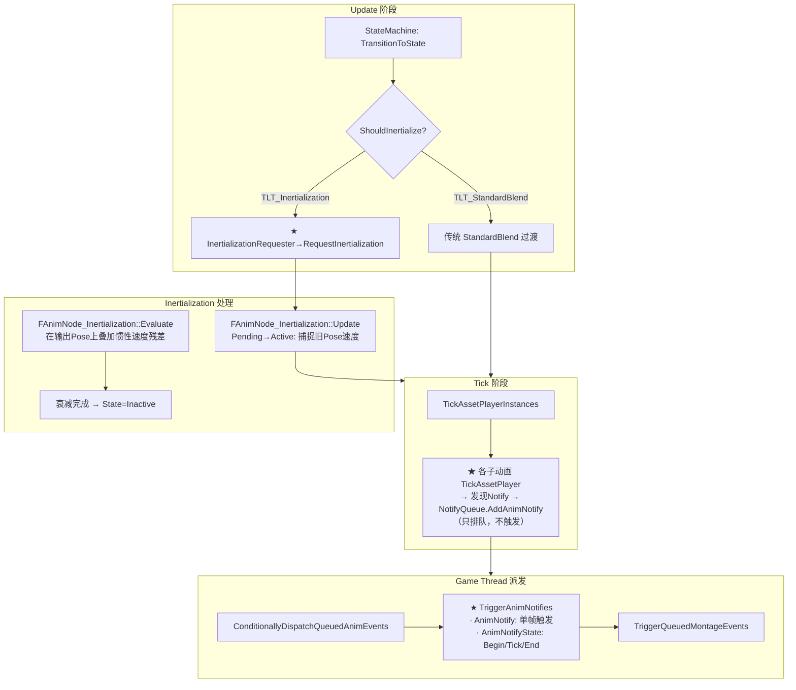

# UE 动画系统：Inertialization 惯性化过渡 + AnimNotify 系统

> 基于 UE 5.7.4 源码。这是最后两部分的合篇：Inertialization 是 UE5 中替代传统 Blend 的新过渡方式；AnimNotify 覆盖 Notify 的产生、排队、触发、派发完整链路。

---

## 一、Inertialization 惯性化过渡

### 1.1 传统 Blend vs Inertialization

传统的状态过渡（StandardBlend）是一个**多帧过程**：

```
A 状态 ──→ B 状态
  Alpha: 0.0 ──────────────────→ 1.0 (需要 CrossfadeDuration 秒)

每帧: Output = Lerp(A_Pose, B_Pose, Alpha)
```

问题：
- 过渡期间两个状态的 AnimGraph 都要 Tick 和 Evaluate（**双倍开销**）
- B 状态在过渡期间被"冻结"在 BlendIn 的位置

**Inertialization** 完全不 Blending：

```
A 状态 ──→ B 状态
  瞬间切换! (0 帧)

切换时:
  1. 捕捉 A 状态最后一帧的速度(dPose/dt = Pose_Prev - Pose_Curr)
  2. 瞬间切到 B 状态
  3. B 状态输出 = B_Pose + 惯性补偿
     （B 的 Pose 上叠加一个逐渐衰减的"A 的速度残差"）

每帧: 惯性补偿按指数衰减 → 最终完全消失
```

**优点**：
- 过渡期间不需要 Tick A 状态
- 过渡时间短（典型 0.1-0.3s），流畅自然
- 和 BlendProfile 配合可做 Per-Bone 惯性化

### 1.2 三态机制

**`AnimNode_Inertialization.h:52`**

```cpp
enum class EInertializationState : uint8
{
    Inactive,   // 未激活 — 正常工作
    Pending,    // 请求已收到 — 下一帧准备捕捉速度差异
    Active      // 激活中 — 叠加惯性补偿，每帧衰减
};
```

**状态切换流程**：

```
StateMachine 触发 Transition (LogicType = TLT_Inertialization)
  │
  ├─ TransitionToState → ShouldInertialize() → true
  │    └─ InertializationRequester→RequestInertialization(duration, blendProfile)
  │       
  ├─ AnimGraph 中的 FAnimNode_Inertialization 节点收到请求
  │    └─ State = Pending
  │
  ├─ 下一帧 Update:
  │    State = Pending → 捕捉当前 Pose (旧状态最后一帧)
  │    State = Active  → 计算惯性速度
  │
  └─ 后续每帧:
       State = Active → 惯性速度衰减
       if (衰减完成) → State = Inactive
```

### 1.3 和 StateMachine 的关系

StateMachine 的 `TransitionToState` 中，如果 `ShouldInertialize()` 返回 true，会向 `IInertializationRequester` 发送请求。AnimGraph 中的 `FAnimNode_Inertialization` 节点（包裹 Inertialization 节点）监听并执行。

**`FAnimNode_Inertialization::Update_AnyThread`**：
1. State == Pending → 存下当前帧的 Pose → State = Active（开始惯性衰减）
2. State == Active → 衰减相位（Phase += DeltaTime / Duration）→ 衰减完成后 State = Inactive

**`FAnimNode_Inertialization::Evaluate_AnyThread`**：
1. 先正常 Evaluate 节点内部 AnimGraph（新状态）
2. State == Active → 在输出 Pose 上叠加惯性速度残差

### 1.4 Inertialization 空间

**`EInertializationSpace`**：

| 空间 | 惯性化内容 |
|------|-----------|
| `Default` | 只在局部空间惯性化 |
| `WorldSpace` | 位移和旋转在世界空间惯性化（处理角色瞬移/换挂载父节点） |
| `WorldRotation` | 只旋转在世界空间惯性化 |

---

## 二、AnimNotify 系统

### 2.1 两类 Notify

UE 有两种动画通知：

| 类型 | 生命周期 | 典型用途 |
|------|----------|----------|
| **AnimNotify** | 单帧触发（`Notify` 事件） | 播放音效、生成粒子 |
| **AnimNotifyState** | 持续触发（`NotifyBegin` → `NotifyTick` → `NotifyEnd`） | 开启/关闭碰撞、持续特效 |

### 2.2 Notify 的产生（在 Tick 阶段）

Notify 是在 **TickAssetPlayer** 阶段被发现的。`AdvanceTime` 或 `TickByMarkerAsLeader` 推进时间后，系统检查 `[PreviousTime, CurrentTime]` 区间内有没有 Notify：

```
TickAssetPlayer:
  PreviousTime = *(TimeAccumulator)  // 上一帧时间
  AdvanceTime(..., CurrentTime, ...) // 推进到新时间
  *(TimeAccumulator) = CurrentTime   // 写回

  // ★ 在 [PreviousTime, CurrentTime] 之间找所有 Notify
  for (Notify in AnimSequence.Notifies)
      if (Notify.Time 在 [PreviousTime, CurrentTime] 区间内)
          NotifyQueue.AddAnimNotify(Notify, SourceAsset)
```

### 2.3 Notify 的排队（FAnimNotifyQueue）

**`AnimNotifyQueue.cpp:91`**

```cpp
void FAnimNotifyQueue::AddAnimNotify(const FAnimNotifyEvent* Notify, const UObject* NotifySource)
{
    // ★ 不是直接触发！只是排队
    AnimNotifies.Add(FAnimNotifyEventReference(Notify, NotifySource));
}
```

**排队不触发**的原因是：触发 Notify 会执行用户蓝图/C++ 代码，可能销毁组件、改变动画状态。这些副作用在 Tick 阶段（可能还在 Worker Thread）做不安全。

### 2.4 Notify 的触发（Put in Queue → GameThread 派发）

**完整链路**：

```
Tick 阶段 (Worker Thread):
  TickAssetPlayer
    └─ SourceAsset→TickAssetPlayer(..., NotifyQueue, ...)
         └─ 发现 [PreviousTime, CurrentTime] 内的 Notify
              └─ NotifyQueue.AddAnimNotify(...)  ← 只排队，不触发

...
PostAnimEvaluation (Game Thread):
  PostUpdateAnimation
    └─ ...

TickComponent (Game Thread, 在 RefreshBoneTransforms 之后):
  ConditionallyDispatchQueuedAnimEvents()
    └─ AnimScriptInstance→DispatchQueuedAnimEvents()
         └─ ★ TriggerAnimNotifies(DeltaSeconds)
              ├─ 遍历 NotifyQueue.AnimNotifies
              ├─ AnimNotify: 立即调用 Notify(NotifySource)
              └─ AnimNotifyState:
                   ├─ 之前没激活的 → NotifyBegin
                   ├─ 一直激活的   → NotifyTick
                   └─ 不再出现的   → NotifyEnd
```

### 2.5 触发时机

**`AnimInstance.cpp:1585` — `TriggerAnimNotifies`**：

```cpp
void UAnimInstance::TriggerAnimNotifies(float DeltaSeconds)
{
    for (const FAnimNotifyEventReference& EventRef : NotifyQueue.AnimNotifies)
    {
        if (const FAnimNotifyEvent* NotifyEvent = EventRef.GetNotify())
        {
            if (NotifyEvent->NotifyStateClass)
            {
                // ★ AnimNotifyState: 维护 ActiveAnimNotifyState 列表
                if (已经在 ActiveAnimNotifyState 中)
                    → NotifyTick (持续触发)
                else
                    → NotifyBegin (新增)
            }
            else
            {
                // ★ AnimNotify: 单帧直接触发
                NotifyEvent->Notify(NotifySource);
            }
        }
    }

    // 处理 AnimNotifyState: 上一帧激活、这一帧不在队列中 → NotifyEnd
    for (const FAnimNotifyEvent& EndedState : ActiveAnimNotifyState中且不在New中的)
        EndedState.NotifyStateClass->NotifyEnd(...);
}
```

### 2.6 权重过滤

Notifies 支持权重过滤（避免低权重动画触发 Notify）：

```cpp
// 权重低于阈值的 Notify 不会加入队列
// 例如：一个 BlendSpace 中权重只有 0.05 的 Walk_Left 动画
// 不应该触发 Footstep 音效
if (InstanceWeight < Notify->TriggerWeightThreshold)
    return;  // 跳过
```

---

## 三、Inertialization 和 AnimNotify 在完整流程中的位置



---

## 四、关键源码文件索引

| 文件 | 内容 |
|------|------|
| `AnimNode_Inertialization.h:24-47` | `IInertializationRequester` — 请求接口 |
| `AnimNode_Inertialization.h:51-74` | `EInertializationState` 三态 + `EInertializationSpace` |
| `AnimNode_Inertialization.cpp` | Update/Evaluate 实现 |
| `AnimNode_StateMachine.cpp:1351-1399` | `ShouldInertialize()` + 请求发出 |
| `AnimNotifyQueue.cpp:91-94` | `AddAnimNotify` — 排队 |
| `AnimNotifyQueue.cpp:96-99` | `AddAnimNotifies` — 批量排队 |
| `AnimInstance.cpp:780-797` | `DispatchQueuedAnimEvents` — 入口 |
| `AnimInstance.cpp:1585-1650` | ★ `TriggerAnimNotifies` — 核心触发逻辑 |
| `SkeletalMeshComponent.cpp:1949-1969` | `ConditionallyDispatchQueuedAnimEvents` |
