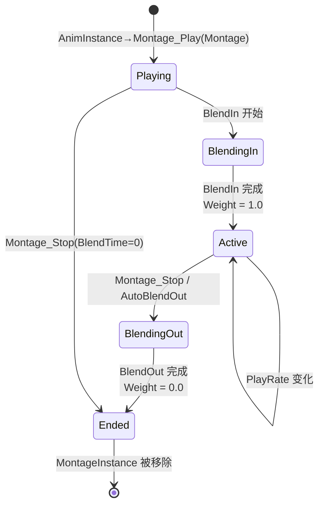
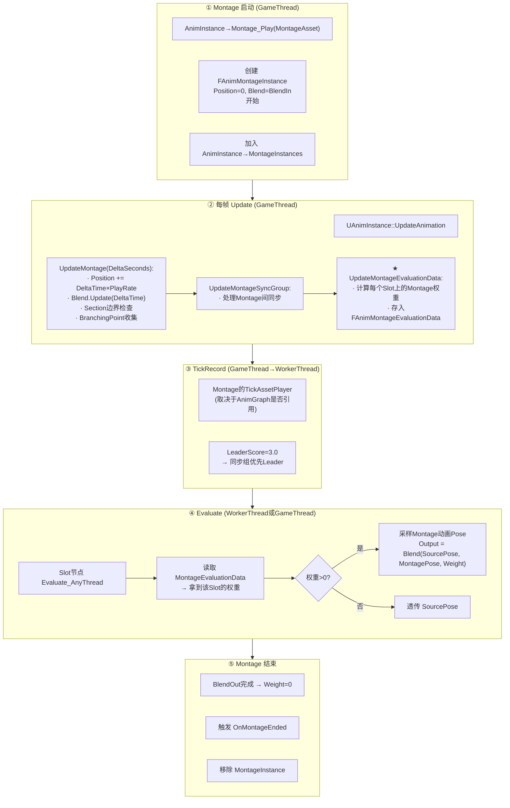

# UE 动画系统：AnimMontage 与 Slot 机制详解

> 基于 UE 5.7.4 源码。Montage 是 UE 动画系统中**最灵活、最常用的运行时动画播放系统**。它通过 Slot 节点把自己"叠加"到 AnimGraph 上，支持 Section 分段、BlendIn/BlendOut、BranchingPoint 分支控制。本文覆盖：FAnimMontageInstance 生命周期、Slot 的工作方式、Montage TickAssetPlayer、Section 切换、Montage 同步。

---

## 一、Montage 是什么？

Montage（`UAnimMontage`）是一种**复合动画资产**，由多个 Section（段落）组成，每个 Section 播放一段动画序列。和 SequencePlayer 的核心区别：

| | SequencePlayer | AnimMontage |
|---|---|---|
| 位置 | AnimGraph 中的**固定节点** | **动态播放**，不预先绑在 AnimGraph 里 |
| 生命周期 | 随状态机进入/退出 | `Play()` → BlendIn → 播放 → BlendOut → `Stop()` |
| 接入方式 | 节点的 `StatePoseLink` | **Slot 节点**（AnimGraph 中的插槽） |
| 分段 | 无 | 多 Section，支持 SetNextSection 跳转 |
| 控制 | AnimGraph 状态机 | C++ / Blueprint 直接 API 控制 |

---

## 二、Slot 是什么？

在 AnimGraph 里放一个 **Slot 节点**（如 `DefaultSlot`），它就变成一个"插槽"——任何播放到这个 Slot 名称的 Montage 会自动混合到这里：

```
AnimGraph:
  StateMachine → Slot("DefaultSlot") → OutputPose
                    ↑
                    │ Montage 通过 Slot 名称接入
                    │
  UAnimMontage.SlotAnimTracks[0].SlotName = "DefaultSlot"
```

**一个 AnimGraph 可以有多个 Slot**（`UpperBodySlot`, `FullBodySlot` 等），不同 Montage 播放到不同 Slot，互不干扰。

---

## 三、FAnimMontageInstance — 完整生命周期

**`AnimMontage.h:334`**

```cpp
struct FAnimMontageInstance
{
    UAnimMontage* Montage;           // 引用的 Montage 资产

    bool bPlaying;                   // 是否正在播放
    float Position;                  // ★ 当前播放位置（秒），相当于 InternalTimeAccumulator
    float PlayRate;                  // 播放速率
    FAlphaBlend Blend;               // ★ BlendIn/BlendOut 的 Alpha 混合器

    int32 CurrentSection;            // 当前 Section 索引
    TArray<int32> NextSections;      // 每个 Section 的"下一段"跳转目标
    TArray<int32> PrevSections;      // 回退目标

    float PreviousWeight;            // 上一帧的 Slot 权重
    float NotifyWeight;              // 用于 Notify 触发判断的权重

    bool bInterrupted;               // 是否被打断
    float BlendStartAlpha;           // Blend 起始 Alpha
    float DefaultBlendTimeMultiplier; // Blend 时间缩放

    FName SyncGroupName;             // 同步组名称
    FAnimMontageInstance* MontageSyncLeader;    // 同步 Leader
    TArray<FAnimMontageInstance*> MontageSyncFollowers; // 同步 Follower

    TArray<FAnimNotifyEvent> ActiveStateBranchingPoints; // 当前激活的 BranchingPoint
    FDeltaTimeRecord DeltaTimeRecord;
    FMarkerTickRecord MarkerTickRecord;
    TArray<FPassedMarker> MarkersPassedThisTick;

    int32 DisableRootMotionCount;    // RootMotion 禁用计数器
    // ... 更多字段
};
```

### 3.1 生命周期图



### 3.2 UpdateMontage — 每帧的 Montage 推进

**`UAnimInstance::UpdateAnimation` 中调用（`AnimInstance.cpp:608-620`）**：

```cpp
// 在 UAnimInstance::UpdateAnimation 里：
UpdateMontage(DeltaSeconds);            // ★ 推进所有 MontageInstance
UpdateMontageSyncGroup();               // ★ 处理 Montage 之间的 SyncGroup
UpdateMontageEvaluationData();          // ★ 更新 Slot 权重数据（供 AnimGraph Evaluate 使用）
```

**`UpdateMontage` 内部做了**：
1. 遍历 `MontageInstances`（UAnimInstance 管理的所有活跃 Montage）
2. 推进每个 Instance 的 `Position += DeltaTime × PlayRate`
3. 处理 BlendIn：`Blend.Update(DeltaTime)` → Alpha 从 0→1
4. 处理 BlendOut：如果触发了 AutoBlendOut 或 `Montage_Stop`，Blend 反向
5. 检查 Section 边界：如果 `Position` 越过了当前 Section 的末尾 → 跳转到 `NextSections[CurrentSection]`
6. 检查 Montage 结束：播放到末尾且不循环 → BlendOut → Ended
7. 收集 BranchingPoint 事件

### 3.3 Section 切换

```cpp
// UAnimInstance API:
AnimInstance->Montage_SetNextSection(FName("Attack_Start"), FName("Attack_Impact"));

// FAnimMontageInstance 内部：
NextSections[Attack_Start_Index] = Attack_Impact_Index;
// 当 Position 到达 Attack_Start 的末尾时，自动跳转到 Attack_Impact 的起始位置
```

Section 切换可以触发 `OnMontageSectionChanged` 委托。

---

## 四、Slot 节点怎么工作

Slot 节点在 AnimGraph 中**不只是播放 Montage**——当没有 Montage 播放时，它**透传上游 Pose**；当有 Montage 播放时，它**在上游 Pose 上叠加 Montage 的 Animation Pose**。

```
无 Montage:
  StateMachine → Slot("DefaultSlot") → OutputPose
  (Slot 透明传 StateMachine 的 Pose)

有 Montage:
  StateMachine → Slot("DefaultSlot") → OutputPose
                    ↑
                    │ (Montage Pose 按 Slot Weight 叠加)
                    │
  Montage Anim → 采样 → Pose_Montage
```

**核心机制**：Slot 节点的 `Evaluate_AnyThread` 会：

1. 调用上游（`StatePoseLink`）的 Evaluate → 得到 `SourcePose`
2. 查找当前挂载到此 Slot 名称的 Montage（通过 `FAnimMontageEvaluationData`）
3. 如果有 Montage 且权重 > 0：
   - 采样 Montage 的 Animation Pose
   - 按 Slot 权重混合：`OutputPose = Blend(SourcePose, MontagePose, SlotWeight)`
4. 如果无 Montage：`OutputPose = SourcePose`（透传）

**Slot 权重从哪来？** `UpdateMontageEvaluationData()` 每帧计算所有活跃 Montage 在各个 Slot 上的权重。一个 Montage 可能同时影响多个 Slot（如果它的 `SlotAnimTracks` 配置了多个 Slot）。

---

## 五、Montage 的 TickAssetPlayer — 和 Sequence 的本质区别

**`AnimMontage.cpp:1251`**

Montage 的 `TickAssetPlayer` 和 Sequence 完全不同——**Montage 已经在 UpdateMontage 中推进了时间**，TickAssetPlayer 只是把当前状态同步给同步系统（用于 Marker Sync / SyncGroup 的 Leader/Follower 协调）：

```cpp
void UAnimMontage::TickAssetPlayer(FAnimTickRecord& Instance, NotifyQueue, Context) const
{
    // Montage 不使用 TickRecord.TimeAccumulator!
    // 时间管理在 FAnimMontageInstance::Position 中
    const float CurrentTime = Instance.Montage.CurrentPosition;  // ← 从 Union 读
    const float PreviousTime = Instance.DeltaTimeRecord->GetPrevious();
    const float MoveDelta = Instance.DeltaTimeRecord->Delta;

    if (Context.IsLeader())
    {
        // Leader：设置同步上下文，让 Follower 能跟进
        Context.SetLeaderDelta(MoveDelta);
        Context.SetPreviousAnimationPositionRatio(PreviousTime / GetPlayLength());

        // Marker Sync（如果启用）
        if (Instance.bCanUseMarkerSync && Context.CanUseMarkerPosition())
        {
            // 更新 MarkerSyncStartPosition / MarkerSyncEndPosition
            // 把 MarkersPassedThisTick 同步给 Follower
        }
    }
    // Follower 模式下不做事——Follower 由同步系统的长度比例机制定位
}
```

**关键区别**：
- Sequence 的 TickAssetPlayer：**修改 TimeAccumulator**（推进时间）
- Montage 的 TickAssetPlayer：**不修改时间**，只把状态同步给同步系统的 Context

---

## 六、Montage 与 TickRecord 的关系

回顾 TickRecord 的 union：

```cpp
struct FAnimTickRecord
{
    float* TimeAccumulator;     // ← Sequence/BlendSpace 用
    // ...
    union {
        struct { ... } BlendSpace;
        struct {  // ★ Montage 专用
            float CurrentPosition;                          // ← Montage 时间在这里
            TArray<FPassedMarker>* MarkersPassedThisTick;  // ← 本帧穿过的 Marker
        } Montage;
    };
};
```

Montage 的 TickRecord 不使用 `TimeAccumulator` 指针。时间由 `FAnimMontageInstance::Position` 管理，TickRecord 只是把它"同步"给同步系统。

### 为什么 Montage 的 LeaderScore = 3.0？

```
LeaderScore = 3.0  >  AlwaysLeader(2.0)  >  CanBeLeader(BlendWeight)
```

Montage 的 LeaderScore 恒定为 3.0，意味着 Montage **永远优先成为同步组的 Leader**（相同 SyncGroup 中，Montage 的播放速度决定其他动画的节奏）。

---

## 七、Montage Sync — Montage 之间的同步

UE 支持 Montage 之间的同步：

```cpp
// AnimInstance->Montage_Play:
// Montage A 播放到 Slot "Action", SyncGroup = "StrikeSync"
// Montage B 也播放到同一个 SyncGroup → B 成为 A 的 Follower
// B 的播放速度会根据 A 调整
```

实现方式：`FAnimMontageInstance` 有 `MontageSyncLeader` 和 `MontageSyncFollowers` 字段。`UpdateMontageSyncGroup` 中处理 Leader/Follower 关系，本质上和 TickRecord 的 SyncGroup 是两个独立的同步系统（Montage Sync 是在 Montage 层面的，SyncGroup 是在 AssetPlayer 层面的）。

---

## 八、Sloting 的权重计算

一个 Montage 播放在 Slot 上的实际混合权重取决于：

```
SlotWeight = Montage.Weight × Slot.BlendInAlpha × Slot.BlendOutAlpha

其中:
  Montage.Weight = MontageInstance.Blend.GetBlendedValue()
    BlendIn 时: 0 → 1
    正常播放: 1
    BlendOut 时: 1 → 0
```

这个权重每帧由 `UpdateMontageEvaluationData` 更新，然后 Slot 节点在 Evaluate 时读取。

---

## 九、完整流程总图



---

## 十、和 Synchronized TickRecord 系统的区别

| | TickRecord SyncGroup | Montage Sync |
|---|---|---|
| 参与者 | 所有 AssetPlayer（Sequence/BlendSpace/Montage） | 只限 Montage Instance |
| 管理位置 | `FAnimSync::TickAssetPlayerInstances` | `UpdateMontageSyncGroup` |
| Leader 选举 | 按 LeaderScore 排序 | 先播放的 Montage 是 Leader |
| 跨实例 | 支持 LinkedInstance 转发 | 只限同一 AnimInstance 内 |

---

## 十一、关键源码文件索引

| 文件 | 内容 |
|------|------|
| `AnimMontage.h:83` | `FSlotAnimationTrack` — Slot 到动画的映射 |
| `AnimMontage.h:334-475` | `FAnimMontageInstance` — 运行时状态 |
| `AnimMontage.h:502` | `UAnimMontage::Play` |
| `AnimMontage.h:507` | `UAnimMontage::Stop` |
| `AnimMontage.cpp:1251` | `TickAssetPlayer` — Montage 版 |
| `AnimInstance.cpp:608-620` | `UpdateMontage` / `UpdateMontageSyncGroup` / `UpdateMontageEvaluationData` |
| `AnimInstance.cpp:689-777` | `PostUpdateAnimation` — Montage-blended RootMotion |
| `AnimInstance.h:813` | `MontageInstances` — 所有活跃 Montage |
