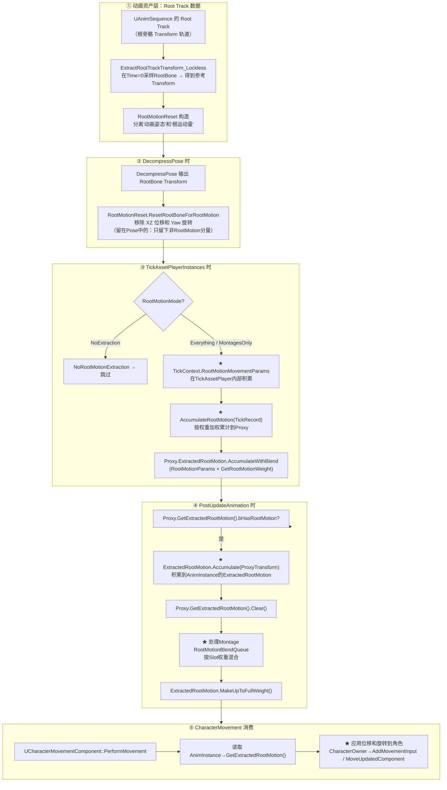

# UE 动画系统：RootMotion 完整链路

> 基于 UE 5.7.4 源码。RootMotion 是 UE 中"由动画驱动角色移动"的机制。本文覆盖：四种 RootMotionMode、动画资产中的 Root Track、提取 → 积累在 Proxy/AnimInstance → CharacterMovement 消费的完整链路。

---

## 一、什么是 RootMotion？

RootMotion = **动画驱动的根骨骼位移**。角色根骨骼在动画中移动了 (100, 0, 0)，角色就在世界里移动 (100, 0, 0)——不是由 CharacterMovement 的速度计算出来的，而是**直接从动画数据中提取的**。

UE 动画资产（UAnimSequence）有一个特殊的 **Root Track**——根骨骼的 Transform 轨道。RootMotion 机制把这个 Transform 分成两部分：

```
RootBone的Transform = 动画姿态部分（旋转/缩放） + 根运动部分（XZ平面位移）
                             ↑                          ↑
                        留在FCompactPose中          提取到ExtractedRootMotion
                        （用于渲染）                 （交给CharacterMovement移动角色）
```

---

## 二、四种 RootMotionMode

**`AnimEnums.h:27`**

| 模式 | 含义 | 动画中RootBone位移 | 适用场景 |
|------|------|:-:|------|
| `NoRootMotionExtraction` | 不提取 | 留在 Pose 中，骨骼不动 | 不需要 RootMotion 的角色 |
| `IgnoreRootMotion` | 提取但不应用 | 和 `RootMotionFromEverything` 一样提取 | 想手动处理 RootMotion 数据 |
| **`RootMotionFromEverything`** | ★ 从所有动画提取 | 按权重混合所有 TickRecord 的 RootMotion | 单机游戏、不需要网络同步 |
| **`RootMotionFromMontagesOnly`** | 只从 Montage 提取 | 只提取 Montage 的 RootMotion | **多人网络游戏**（标配） |

**为什么网络游戏要用 `RootMotionFromMontagesOnly`？** 因为状态机中的 Locomotion 动画在不同客户端可能处于不同的相位（不同步），而 Montage 是显式触发的（`PlayMontage` → 服务器RPC → `Multicast PlayMontage`），所有客户端同一时刻开始播同一个 Montage → RootMotion 一致。

---

## 三、RootMotion 完整链路



### 3.1 阶段 ①：Root Track 采样 + 锁定

**`AnimSequence.cpp:1540`**

```cpp
FTransform RootTransform = ExtractRootTrackTransform_Lockless(ExtractionContext, &RequiredBones);
// → 从动画数据中采样 Time=0 和 Time=CurrentTime 的 RootBone Transform

const FRootMotionReset RootMotionReset(
    bEnableRootMotion,
    RootMotionRootLock,   // ★ 锁定方式
    bForceRootLock,
    RootTransform,        // Time=0时的RootTransform（参考坐标系）
    bTreatAnimAsAdditive
);
```

**RootMotionRootLock 方式**：

| 锁定方式 | 含义 |
|----------|------|
| `RefPose` | RootBone 的位移基准是 Skeleton 的 RefPose |
| `AnimFirstFrame` | 用动画第 1 帧的 RootBone 作为基准 |
| `Zero` | 用 Identity Transform 作为基准 |

### 3.2 阶段 ②：DecompressPose 中分离

在 `DecompressPose` 处理 RootBone 时，`RootMotionReset.ResetRootBoneForRootMotion` 把 RootBone 的 XZ 平面位移和 Yaw 旋转**从 Pose 中移除**：

```cpp
// 伪代码
OutPose[RootBoneIndex].Translation.X = 0;   // 移除 X 位移
OutPose[RootBoneIndex].Translation.Y = 0;   // 移除 Y 位移
OutPose[RootBoneIndex].Rotation.Yaw = 0;    // 移除 Yaw 旋转
// 保留: Z位移(跳跃), Pitch/Roll旋转, 缩放
```

被移除的量**不消失**——它们被记录到 `RootMotionMovementParams` 中。

### 3.3 阶段 ③：TickAssetPlayerInstances 中按权重累加

**`AnimSync.cpp:86-105`**

```cpp
auto AccumulateRootMotion = [&](FAnimTickRecord& TickRecord, FAnimAssetTickContext& TickContext)
{
    if (RootMotionMode == RootMotionFromEverything)
    {
        // ★ 加权: RootMotionParams × GetRootMotionWeight()
        InProxy.ExtractedRootMotion.AccumulateWithBlend(
            TickContext.RootMotionMovementParams,
            TickRecord.GetRootMotionWeight());
    }
};
```

**`GetRootMotionWeight()` 返回 `EffectiveBlendWeight × RootMotionWeightModifier`。**

如果有 3 个动画都在产生 RootMotion（一个 BlendSpace 的 Walk 样本 + 一个 Montage 的 Strike），每个按自己的权重贡献。权重加起来不超过 1.0。

### 3.4 阶段 ④：PostUpdateAnimation 中收集到 AnimInstance

**`AnimInstance.cpp:737-758`**

```cpp
void UAnimInstance::PostUpdateAnimation()
{
    // 1. Proxy 层积累的 RootMotion → AnimInstance
    if (Proxy.GetExtractedRootMotion().bHasRootMotion)
    {
        FTransform ProxyTransform = Proxy.GetExtractedRootMotion().GetRootMotionTransform();
        ProxyTransform.NormalizeRotation();
        ExtractedRootMotion.Accumulate(ProxyTransform);  // ★ 移到 AnimInstance
        Proxy.GetExtractedRootMotion().Clear();           // 清空 Proxy（下一帧重新收集）
    }

    // 2. ★ Montage-blended RootMotion — 按 Slot 权重
    for (const FQueuedRootMotionBlend& RootMotionBlend : RootMotionBlendQueue)
    {
        const float SlotWeight = GetSlotNodeGlobalWeight(RootMotionBlend.SlotName);
        ExtractedRootMotion.AccumulateWithBlend(RootMotionBlend.Transform, SlotWeight);
    }

    // 3. 确保权重不超过 1.0
    if (ExtractedRootMotion.bHasRootMotion)
        ExtractedRootMotion.MakeUpToFullWeight();
}
```

**`ExtractedRootMotion` 是 `FRootMotionMovementParams` 类型**——储存本帧的位移向量和旋转。

---

## 四、RootMotion 的时间区间提取

**`AnimSequence.cpp:1543`** — `ExtractRootMotion`

RootMotion 不是在一个时间点提取的——它提取的是 **从上一帧到这一帧区间内** 的根运动：

```cpp
FTransform UAnimSequence::ExtractRootMotion(const FAnimExtractContext& ExtractionContext) const
{
    float PreviousPosition = ExtractionContext.CurrentTime;
    float CurrentPosition = ExtractionContext.CurrentTime;
    float DesiredDeltaMove = ExtractionContext.DeltaTimeRecord.Delta;

    do
    {
        // 推进到下一帧位置（或动画边界）
        FAnimationRuntime::AdvanceTime(false, DesiredDeltaMove, CurrentPosition, GetPlayLength());

        // ★ 提取 [PreviousPosition, CurrentPosition] 区间内的 RootMotion
        RootMotionParams.Accumulate(
            ExtractRootMotionFromRange(PreviousPosition, CurrentPosition, ExtractionContext));

        // 如果循环且到达边界 → 继续剩余 Delta
        if (AdvanceType == ETAA_Finished && ExtractionContext.bLooping)
        {
            DesiredDeltaMove -= (CurrentPosition - PreviousPosition);
            PreviousPosition = 0.f;
        }
    } while (...);
}
```

---

## 五、和前面学过的系统的关系

| 系统 | RootMotion 相关的部分 |
|------|----------------------|
| **TickAssetPlayer** | `TickContext.RootMotionMovementParams` 在 Leader 推时间时填充 |
| **TickAssetPlayerInstances** | `AccumulateRootMotion` 按 `GetRootMotionWeight()` 加权后积累到 Proxy |
| **PerformAnimationProcessing** | `DecompressPose` 中的 `RootMotionReset` 分离 Root vs 姿态 |
| **PostUpdateAnimation** | 从 Proxy 搬到 AnimInstance + Montage Insert 混合 |
| **CharacterMovement** | `PerformMovement` 读取 `ExtractedRootMotion` → 应用到角色 |

---

## 六、关键源码文件索引

| 文件 | 内容 |
|------|------|
| `AnimEnums.h:27` | `ERootMotionMode` 四种模式 |
| `AnimSequence.cpp:1540` | `ExtractRootTrackTransform_Lockless` |
| `AnimSequence.cpp:1543` | `ExtractRootMotion` — 时间区间提取 |
| `AnimSequence.cpp:1607` | `ExtractRootMotionFromRange` — [Prev,Curr] 区间采样 |
| `AnimSequence.cpp:1821` | `RootMotionReset` 构造 + 锁定方式 |
| `AnimSync.cpp:86-105` | `AccumulateRootMotion` — 加权累加 |
| `AnimInstance.cpp:737-758` | `PostUpdateAnimation` — 搬移 + Montage 混合 |
| `SkeletalMeshComponent.cpp:4513` | Root Motion 提取检查 |
