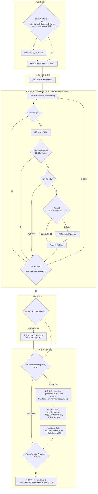
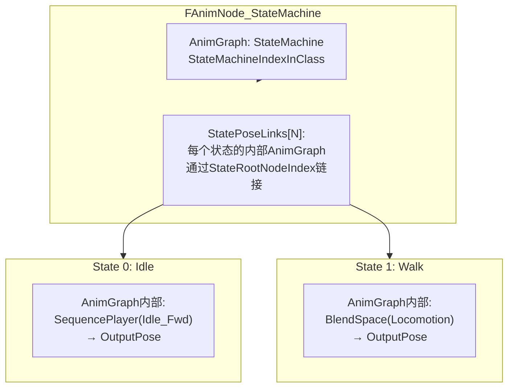
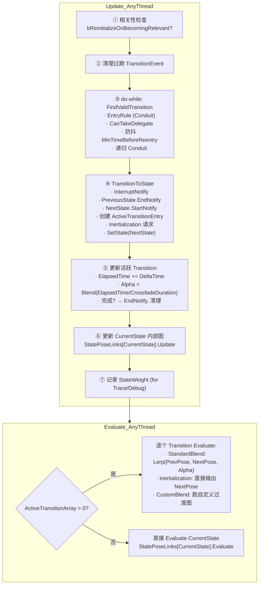

# UE 动画系统：StateMachine 状态机详解

> 基于 UE 5.7.4 源码。本文深入覆盖：状态机的编译数据结构（Baked 层）与运行时节点（FAnimNode_StateMachine）如何配合；状态过渡的完整流程（FindValidTransition → TransitionToState → ActiveTransition → Evaluate）；Conduit、Transition Request Queue、Inertialization、权重计算等关键机制。

---

## 一、架构概览：两层结构

StateMachine 有两层：

```
┌─────────────────────────────────────────────┐
│ 编译时（Baked 层）                           │
│ FBakedAnimationStateMachine                 │
│   ├─ FBakedAnimationState[] (所有状态)       │
│   ├─ FAnimationTransitionBetweenStates[]     │
│   └─ InitialState                            │
│ 存储 AnimBlueprint 编译后的静态数据           │
└─────────────────────────────────────────────┘
                    ↓ 引用
┌─────────────────────────────────────────────┐
│ 运行时（Node 层）                            │
│ FAnimNode_StateMachine                      │
│   ├─ CurrentState                            │
│   ├─ ElapsedTime                             │
│   ├─ ActiveTransitionArray[]                 │
│   ├─ StatePoseLinks[] (每个状态内部的AnimGraph)│
│   └─ QueuedTransitionEvents[]                │
│ 每帧 Update/Evaluate 的动态数据               │
└─────────────────────────────────────────────┘
```

`StateMachineIndexInClass` 是 FAnimNode_StateMachine 最重要的字段——它指向 `UAnimBlueprintGeneratedClass::BakedStateMachines[StateMachineIndexInClass]`。**多个 FAnimNode_StateMachine 实例可以共享同一个 Baked 数据**（不同的 AnimInstance 实例化同一份 ABP）。

---

## 二、编译时数据结构（Baked 层）

### 2.1 FBakedAnimationStateMachine

**`AnimStateMachineTypes.h:363`**

```cpp
struct FBakedAnimationStateMachine
{
    FName MachineName;                              // 状态机名称（调试用）
    int32 InitialState;                             // 入口状态的索引

    TArray<FBakedAnimationState> States;            // 所有状态
    TArray<FAnimationTransitionBetweenStates> Transitions; // 所有过渡（Transitions[i] 存在 States 外共用）
};
```

**设计要点**：`Transitions` 存在 StateMachine 级别而非 State 级别，是因为多个状态可能有相同的过渡配置（如"从任意状态到 Idle"）。State 通过 `FBakedStateExitTransition.TransitionIndex` 引用 Transitions 数组。

### 2.2 FBakedAnimationState

**`AnimStateMachineTypes.h:307`**

```cpp
struct FBakedAnimationState
{
    TArray<int32> PlayerNodeIndices;     // 此状态中所有 AssetPlayer 节点的属性索引
    TArray<int32> LayerNodeIndices;      // 此状态中所有 LinkedAnimLayer 节点
    TArray<FBakedStateExitTransition> Transitions; // ★ 此状态的出边过渡列表（编译时已按优先级排序）
    FName StateName;                     // 状态名称
    int32 StateRootNodeIndex;            // 此状态内部 AnimGraph 的根节点索引
    int32 StartNotify;                   // 进入状态时触发的 Notify 索引
    int32 EndNotify;                     // 退出状态时触发的 Notify 索引
    int32 FullyBlendedNotify;            // 完全混合进入该状态时的 Notify
    int32 EntryRuleNodeIndex;            // Conduit 入口规则节点索引（普通状态=INDEX_NONE）
    bool bAlwaysResetOnEntry;            // 重新进入该状态时是否总是重置
};
```

### 2.3 FBakedStateExitTransition

```cpp
struct FBakedStateExitTransition
{
    int32 TransitionIndex;              // 指向 Transitions 数组的索引
    int32 CanTakeDelegateIndex;         // 过渡条件节点索引（如 BlendSpace Position > 300）
    int32 CustomResultNodeIndex;        // 自定义过渡图节点索引
    int32 PoseEvaluatorLinks[];        // TransitionPoseEvaluator 节点索引
    FName SyncGroupNameToRequireValidMarkersRule; // 要求具体同步组 Marker 合法的条件
    bool bAutomaticRuleBasedOnSequencePlayerInState; // "自动过渡" 标记
};
```

### 2.4 FAnimationTransitionBetweenStates

```cpp
struct FAnimationTransitionBetweenStates
{
    int32 PreviousState;                     // 源状态
    int32 NextState;                         // 目标状态
    float CrossfadeDuration;                 // 过渡时长（秒）
    EAlphaBlendOption BlendMode;             // 混合曲线（Linear/Cubic/HermiteCubic等）
    UBlendProfile* BlendProfile;             // Per-Bone Blend 的配置
    ETransitionLogicType::Type LogicType;    // ★ 过渡类型
    int32 StartNotify / EndNotify / InterruptNotify; // 过渡的 Notify
    float MinTimeBeforeReentry;              // 最小重入间隔（防抖 bounce）
    bool bAllowInertializationForSelfTransitions; // 自我过渡时是否惯性化
    UCurveFloat* CustomCurve;                // 自定义混合曲线
};
```

**`ETransitionLogicType` 三种类型**：

| 类型 | 含义 | 过渡帧数 |
|------|------|----------|
| `TLT_StandardBlend` | 传统 Blend：Pose A → Pose B 按 Alpha 混合 | 多帧 |
| `TLT_Inertialization` | ★ UE5 默认：从 Pose A 惯性衰减，目标自然启动 | 0 帧（瞬间切换） |
| `TLT_Custom` | 用户自定义过渡图（`CustomTransitionGraph`） | 多帧 |

---

## 三、Conduit（管道）

Conduit 不是真正的"状态"——它没有自己的 AnimGraph（`StateRootNodeIndex == INDEX_NONE`），只是一个**路由节点**。它只有一个 `EntryRuleNodeIndex`，决定是否允许走这个 Conduit 到后续状态。

```
  Idle ──→ [Conduit: IsMoving?] ──→ Walk  (走这个)
                                 └─→ Run   (或这个)
```

Conduit 的过渡和普通状态一样走 `FindValidTransition`，但它是**透明的**——一旦 Conduit 的出口过渡成立，状态机会直接跳到出口的最终目标状态（可以跨越多层 Conduit），而不是停在 Conduit 内部。

---

## 四、Initialize_AnyThread

**`AnimNode_StateMachine.cpp:218`**

```cpp
void FAnimNode_StateMachine::Initialize_AnyThread(const FAnimationInitializeContext& Context)
{
    // 1. 为每个状态创建 FPoseLink（连接到状态内部 AnimGraph 的根节点）
    for (int32 StateIndex = 0; StateIndex < Machine->States.Num(); ++StateIndex)
    {
        const FBakedAnimationState& State = Machine->States[StateIndex];

        // 创建该状态的 PoseLink（Conduit 的 LinkID = INDEX_NONE）
        FPoseLink& StatePoseLink = StatePoseLinks.AddDefaulted_GetRef();
        if (State.StateRootNodeIndex != INDEX_NONE)
            StatePoseLink.LinkID = AnimNodeProperties.Num() - 1 - State.StateRootNodeIndex;

        // 初始化所有过渡条件节点（FAnimNode_TransitionResult）
        for (auto& TransitionRule : State.Transitions)
        {
            if (TransitionRule.CanTakeDelegateIndex != INDEX_NONE)
                TransitionNode->Initialize_AnyThread(Context);
        }
    }

    // 2. 复位运行时状态
    ActiveTransitionArray.Reset();
    QueuedTransitionEvents.Reset();
    LastStateEntryTime.AddZeroed(Machine->States.Num());

    // 3. ★ 进入 InitialState
    SetState(Context, Machine->InitialState, false);
    bFirstUpdate = true;
}
```

**`SetState` 做了什么**：

```cpp
void FAnimNode_StateMachine::SetState(const FAnimationBaseContext& Context, int32 NewStateIndex, bool bAllowReEntry)
{
    const FBakedAnimationState& NewStateInfo = GetStateInfo(NewStateIndex);

    // 重新进入同一个状态？→ 如果允许 & 状态配置了 bAlwaysResetOnEntry，则重置
    if (NewStateIndex == CurrentState && NewStateInfo.bAlwaysResetOnEntry && bAllowReEntry)
    {
        // reinitialize state
        FAnimationInitializeContext InitContext(...);
        StatePoseLinks[CurrentState].Initialize(InitContext);
        ElapsedTime = 0.0f;
        return;
    }

    // ★ 跳转到新状态
    SetStateInternal(NewStateIndex);       // CurrentState = NewStateIndex; ElapsedTime = 0
    StatePoseLinks[NewStateIndex].Initialize(Context);  // 初始化新状态内部 AnimGraph
    LastStateEntryTime[NewStateIndex] = WorldTime;      // 记录进入时间
}
```

---

## 五、Update_AnyThread —— ★ 核心更新逻辑

**`AnimNode_StateMachine.cpp:385`**



### 5.1 FindValidTransition — 查找合法过渡

**`AnimNode_StateMachine.cpp:746`**

```cpp
bool FAnimNode_StateMachine::FindValidTransition(...)
{
    // 1. 防循环：如果 OutVisitedStateIndices 已包含当前状态，直接返回 false
    if (OutVisitedStateIndices.Contains(CheckingStateIndex)) return false;

    // 2. ★ EntryRule 检查（Conduit 有，普通状态一般没有）
    if (StateInfo.EntryRuleNodeIndex != INDEX_NONE)
    {
        // 执行 EntryRule 的 CanEnterTransition 逻辑
        if (NativeTransitionDelegate.IsBound())
            bCanEnterTransition = NativeTransitionDelegate.Execute();  // C++ 覆写
        else
            TransitionNode->GetEvaluateGraphExposedInputs().Execute(Context); // Blueprint 条件
        if (!bCanEnterTransition) return false;  // ← 被挡在门外
    }

    // 3. 遍历此状态的所有出边 Transitions（编译时已按优先级排序）
    for (int32 TransitionIndex = 0; ...; ++TransitionIndex)
    {
        // 3a. 防抖检查
        if (WorldTime - LastStateEntryTime[NextState] < TransitionInfo.MinTimeBeforeReentry)
            continue;  // 刚离开那个状态，还不能重入

        // 3b. ★ CanTakeDelegate — 过渡条件检查
        FAnimNode_TransitionResult* ResultNode = GetTransitionResultNode(...);
        // 执行过渡条件（如 "Speed > 100", "IsMoving == true" 等）

        // 3c. 可选：SyncGroup Marker 合法性检查
        if (TransitionRule.SyncGroupNameToRequireValidMarkersRule != NAME_None)
            if (!Sync.IsSyncGroupValid(...)) continue;

        // 3d. ★ 如果是 Conduit 的过渡 → 递归 FindValidTransition 到 Conduit 内部
        if (IsAConduitState(NextState))
        {
            if (FindValidTransition(Context, NextStateInfo, OutPotentialTransition, OutVisitedStateIndices))
                return true;  // ← 递归返回 true，跳过 Conduit, 直接到最终目标
        }
        else
        {
            // 3e. 普通状态 → 记录为候选
            OutPotentialTransition.TargetState = NextState;
            OutPotentialTransition.TransitionRule = &TransitionRule;
            return true;  // ← 找到第一个合法的就返回（优先级排序已处理好）
        }
    }
    return false;
}
```

**过渡条件检查的具体流程**：

```cpp
// CanTakeDelegate 节点的检查：
if (TransitionRule.CanTakeDelegateIndex != INDEX_NONE)
{
    FAnimNode_TransitionResult* ResultNode = ...;

    if (TransitionRule.bAutomaticRuleBasedOnSequencePlayerInState)
    {
        // ★ "自动过渡" 模式：检查状态内 AssetPlayer 的剩余时间
        // 如果动画播放到末尾（时间不足以再走一帧），自动过渡
        // 常用于 Sequence Evaluator 做自动循环
    }
    else if (ResultNode->NativeTransitionDelegate.IsBound())
    {
        // C++ 自定义过渡条件
        ResultNode->bCanEnterTransition =
            ResultNode->NativeTransitionDelegate.Execute();
    }
    else
    {
        // Blueprint 过渡条件图
        ResultNode->GetEvaluateGraphExposedInputs().Execute(Context);
    }

    if (!ResultNode->bCanEnterTransition) continue;
}
```

### 5.2 TransitionToState — 执行过渡

**`AnimNode_StateMachine.cpp:1292`**

```cpp
void FAnimNode_StateMachine::TransitionToState(...)
{
    // 1. 如果有活跃过渡 → 触发 InterruptNotify
    if (ActiveTransitionArray.Num() > 0 && LastTransition.bActive)
    {
        Context.AnimInstanceProxy->AddAnimNotifyFromGeneratedClass(InterruptNotify);
    }

    // 2. ★ 触发状态 Notify：PreviousState.EndNotify + NextState.StartNotify
    Context.AnimInstanceProxy->AddAnimNotifyFromGeneratedClass(GetStateInfo(PreviousState).EndNotify);
    Context.AnimInstanceProxy->AddAnimNotifyFromGeneratedClass(GetStateInfo(NextState).StartNotify);

    // 3. 查找是否已有指向 NextState 的旧过渡
    FAnimationActiveTransitionEntry* PreviousTransitionForNextState = nullptr;
    for (auto& TransitionEntry : ActiveTransitionArray)
        if (TransitionEntry.PreviousState == NextState)
            PreviousTransitionForNextState = &TransitionEntry; // ← 找到了! NextState 本身还在被过渡出去

    // 4. ★ 创建新的 FAnimationActiveTransitionEntry
    //    关键公式: CrossfadeDuration = Max(配置时长 - 时间调整, 0) × InverseAlpha
    FAnimationActiveTransitionEntry& NewTransition = ActiveTransitionArray.Emplace_GetRef(
        NextState, ExistingWeightOfNextState, PreviousState, TransitionInfo, CrossFadeTimeAdjustment);

    // 5. ★ 如果需要 Inertialization...
    if (ShouldInertialize()) // TLT_Inertialization 或 bAllowInertializationForSelfTransitions+bAlwaysResetOnEntry
    {
        IInertializationRequester* Requester =
            Context.GetMessage<IInertializationRequester>();
        Requester->RequestInertialization(Request);
        // 注：Inertialization 不创建传统 Blend，而是通过
        //    FAnimNode_Inertialization 节点在 AnimGraph 中做惯性衰减
    }

    // 6. ★ SetState → 更新 CurrentState
    SetState(Context, NextState, ...);
}
```

**为什么 Transition 是一个 Array（栈）？**

一帧内可能连续经过多个状态：

```
A → B → C（Conduit → D 进入失败 → C）
```

此时 ActiveTransitionArray 里可能有 `[A→B, B→C]` 两个活跃过渡，B 还没完全混入就被中断了。

### 5.3 GetStateWeight — 状态权重计算

**`AnimNode_StateMachine.cpp:1413`**

```cpp
float FAnimNode_StateMachine::GetStateWeight(int32 StateIndex) const
{
    float TotalWeight = 0.0f;
    for (int32 Index = 0; Index < NumTransitions; ++Index)
    {
        const FAnimationActiveTransitionEntry& Transition = ActiveTransitionArray[Index];
        float SourceWeight = (1.0f - Transition.Alpha);

        if (Index > 0)
            TotalWeight *= SourceWeight;  // ← 堆叠过渡：每个新过渡压缩之前所有状态的贡献
        else if (Transition.PreviousState == StateIndex)
            TotalWeight += SourceWeight;

        if (Transition.NextState == StateIndex)
            TotalWeight += Transition.Alpha;
    }
    return TotalWeight;
}
```

**例子**：Idle(1.0) → Walk(α=0.25) → Run(α=0.1)

```
ActiveTransitionArray = [Idle→Walk(α=0.25), Walk→Run(α=0.1)]

Idle 权重 = (1.0 - 0.25) × (1.0 - 0.1) = 0.75 × 0.9 = 0.675
Walk 权重 = 0.25 × (1.0 - 0.1) = 0.25 × 0.9 = 0.225
Run  权重 = 0.1
总和 = 1.0 ✓
```

---

## 六、Evaluate_AnyThread — 输出混合后的 Pose

**`AnimNode_StateMachine.cpp:953`**

```cpp
void FAnimNode_StateMachine::Evaluate_AnyThread(FPoseContext& Output)
{
    if (ActiveTransitionArray.Num() > 0)
    {
        // ★ 按 Transition 栈的顺序逐个 Evaluate
        for (int32 Index = 0; Index < ActiveTransitionArray.Num(); ++Index)
        {
            FAnimationActiveTransitionEntry& ActiveTransition = ActiveTransitionArray[Index];
            const bool bIntermediatePoseIsValid = (Index > 0);

            if (ActiveTransition.bActive)
            {
                switch (ActiveTransition.LogicType)
                {
                case TLT_StandardBlend:
                    // 传统 Blend：PreviousPose ⊕ NextPose 按 Alpha 混合
                    EvaluateTransitionStandardBlend(Output, ActiveTransition, bIntermediatePoseIsValid);
                    break;
                case TLT_Inertialization:
                    // Inertialization：直接输出目标状态的 Pose
                    // （惯性衰减由 AnimGraph 中的 FAnimNode_Inertialization 处理）
                    EvaluateState(ActiveTransition.NextState, Output);
                    break;
                case TLT_Custom:
                    // 用户自定义过渡图
                    EvaluateTransitionCustomBlend(Output, ActiveTransition, bIntermediatePoseIsValid);
                    break;
                }
            }
        }
        Output.Pose.NormalizeRotations();
    }
    else
    {
        // 无过渡 → 直接 Evaluate 当前状态
        StatePoseLinks[CurrentState].Evaluate(Output);
    }
}
```

### StandardBlend 的混合算法

```cpp
void FAnimNode_StateMachine::EvaluateTransitionStandardBlend(...)
{
    if (bIntermediatePoseIsValid)
    {
        // Index > 0：当前 Output 已经是之前过渡的结果
        // 保留为 PreviousStateResult
        FPoseContext PreviousStateResult = Output;
        const FPoseContext& NextStateResult = EvaluateState(Transition.NextState, Output);
        EvaluateTransitionStandardBlendInternal(
            Output, Transition, PreviousStateResult, NextStateResult);
    }
    else
    {
        // Index == 0：第一个过渡
        const FPoseContext& PreviousStateResult = EvaluateState(Transition.PreviousState, Output);
        const FPoseContext& NextStateResult = EvaluateState(Transition.NextState, Output);
        EvaluateTransitionStandardBlendInternal(
            Output, Transition, PreviousStateResult, NextStateResult);
    }
}

void EvaluateTransitionStandardBlendInternal(Output, Transition, PrevPose, NextPose)
{
    // Per-Bone Blend（有 BlendProfile）：
    //   每根骨骼按 BlendProfile 的权重分别混合
    // 普通 Blend：
    if (Transition.BlendProfile)
        FAnimationRuntime::BlendPosesPerBoneFilter(
            Output.Pose, PrevPose, NextPose, Transition.Alpha, Transition.StateBlendData);
    else
        FAnimationRuntime::LerpPoses(
            Output.Pose, PrevPose, NextPose, Transition.Alpha);
}
```

---

## 七、Transition Request Queue — 过渡请求队列

状态机支持**外部（C++或 Blueprint）触发过渡请求**，而不只是依赖 AnimGraph 中的过渡条件：

```cpp
// 在 NativeUpdateAnimation 或 Blueprint 中调用：
StateMachine.RequestTransitionEvent(FTransitionEvent("ToIdle", ETransitionRequestQueueMode::Shared));
```

**队列管理**（在 Update_AnyThread 开头）：
```cpp
// 移除过期的请求
for (int32 RequestIndex = QueuedTransitionEvents.Num() - 1; RequestIndex >= 0; --RequestIndex)
    if (QueuedTransitionEvents[RequestIndex].HasExpired())
        QueuedTransitionEvents.RemoveAt(RequestIndex);

// 在 TransitionToState 结束时消费标记的请求
ConsumeMarkedTransitionEvents();
```

**工作流**：
```
1. 外部调用 RequestTransitionEvent("Jump")
2. QueuedTransitionEvents.Add(FTransitionEvent("Jump"))
3. 下一帧 Update_AnyThread → 不检查过期
4. AnimGraph Update 时，FindValidTransition 内部检查
   是否有匹配的 QueuedTransitionEvent
5. TransitionToState → ConsumeMarkedTransitionEvents() → 移除已消费的请求
```

---

## 八、Conduit 的完整工作流

Conduit 是一个没有 Pose 的状态，纯粹做**路由决策**：

```
State: Locomotion(Idle/Walk/Run)

Conduit: IsMoving?
  ├─ EntryRule: Speed > 10  (CanEnterTransition = Speed > 10)
  └─ Transitions: → Walk (CanTakeDelegate: Speed in [10, 300])
                  → Run  (CanTakeDelegate: Speed > 300)

StateMachine 在 Idle 状态时:
  1. FindValidTransition(Idle) → 没有直接出边
  2. ... 或者通过某个过渡到 IsMoving? → EntryRule 检查通过
  3. FindValidTransition 递归进入 Conduit:
     → 检查 → Walk 的 CanTakeDelegate → 通过 → 返回
     → 在 TransitionToState 中把 Conduit 作为中间状态跳过去
     → 最终 CurrentState 直接到 Walk，ActiveTransitionArray 也直接是 [Idle→Walk]
```

**关键**：如果 Conduit 的 EntryRule 通过了，但所有出边的 CanTakeDelegate 都不满足 → 当前状态保持不变（Conduit 不会被保留为 CurrentState）。

---

## 九、StateMachine 与 AnimGraph 的关系



**每个状态的内部 AnimGraph 是独立的子图**。`Update_AnyThread` 只更新"活跃的"状态（CurrentState 或 ActiveTransition 中的状态），不活跃的状态不消耗 Tick。

---

## 十、完整一帧的数据流



---

## 十一、和 TickRecord/同步系统的关系

StateMachine 的 Update_AnyThread 内部调用 `StatePoseLinks[StateIndex].Update(Context)`，这最终会递归进入该状态内部 AnimGraph 中各节点的 `Update_AnyThread`——包括 SequencePlayer 的 `CreateTickRecordForNode`。

也就是说：

```
StateMachine::Update_AnyThread
  └─ StatePoseLinks[Walk].Update
       └─ Walk 内部 AnimGraph 的节点 Update
            └─ BlendSpacePlayer::Update_AnyThread
                 └─ CreateTickRecordForNode
                      └─ 创建 TickRecord → 加入同步系统
```

所有当前活跃状态的 AssetPlayer 的 TickRecord 都会在同一帧内被收集，然后在 `FAnimInstanceProxy::UpdateAnimation` 末尾的 `Sync.TickAssetPlayerInstances` 中统一推进。

---

## 十二、关键源码文件索引

| 文件 | 关键内容 |
|------|----------|
| `AnimNode_StateMachine.h` | `FAnimNode_StateMachine` 完整结构（字段 + 方法声明） |
| `AnimNode_StateMachine.cpp:40-81` | `FAnimationActiveTransitionEntry` 构造 — CrossfadeDuration 计算 |
| `AnimNode_StateMachine.cpp:125-163` | `Update()` — ElapsedTime/Alpha/BlendProfile 更新 |
| `AnimNode_StateMachine.cpp:218-286` | `Initialize_AnyThread` |
| `AnimNode_StateMachine.cpp:304-335` | `ConditionallyCacheBonesForState` |
| `AnimNode_StateMachine.cpp:385-661` | ★ `Update_AnyThread` — 核心更新 |
| `AnimNode_StateMachine.cpp:663-744` | `GetRelevantAnimTimeRemaining` — 状态内 AssetPlayer 剩余时间 |
| `AnimNode_StateMachine.cpp:746-850` | ★ `FindValidTransition` — 过渡搜索 |
| `AnimNode_StateMachine.cpp:1292-1411` | ★ `TransitionToState` — 执行过渡 |
| `AnimNode_StateMachine.cpp:1413-1450` | ★ `GetStateWeight` — 状态权重计算 |
| `AnimNode_StateMachine.cpp:953-1040` | ★ `Evaluate_AnyThread` |
| `AnimNode_StateMachine.cpp:1043-1100` | `EvaluateTransitionStandardBlend` |
| `AnimStateMachineTypes.h` | `FBakedAnimationStateMachine`, `FBakedAnimationState`, `FBakedStateExitTransition`, `FAnimationTransitionBetweenStates` |
