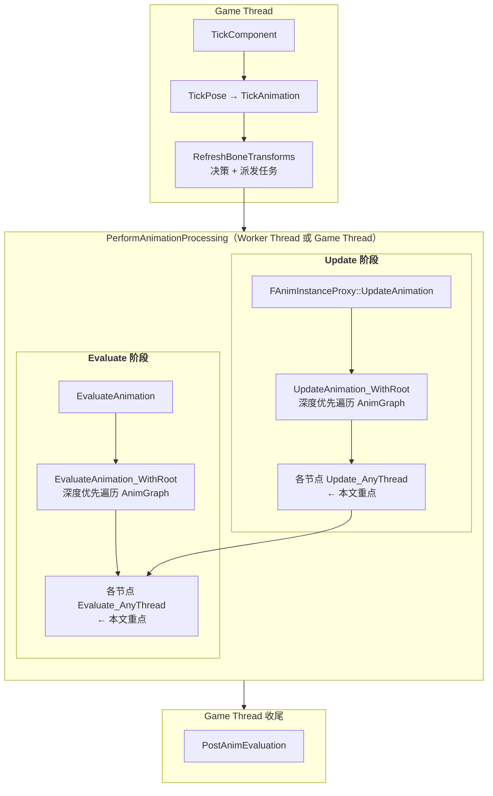
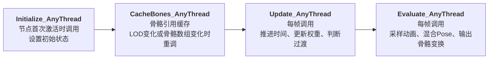
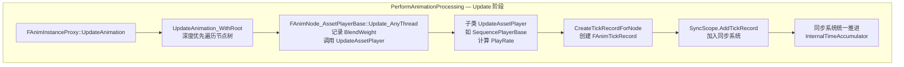
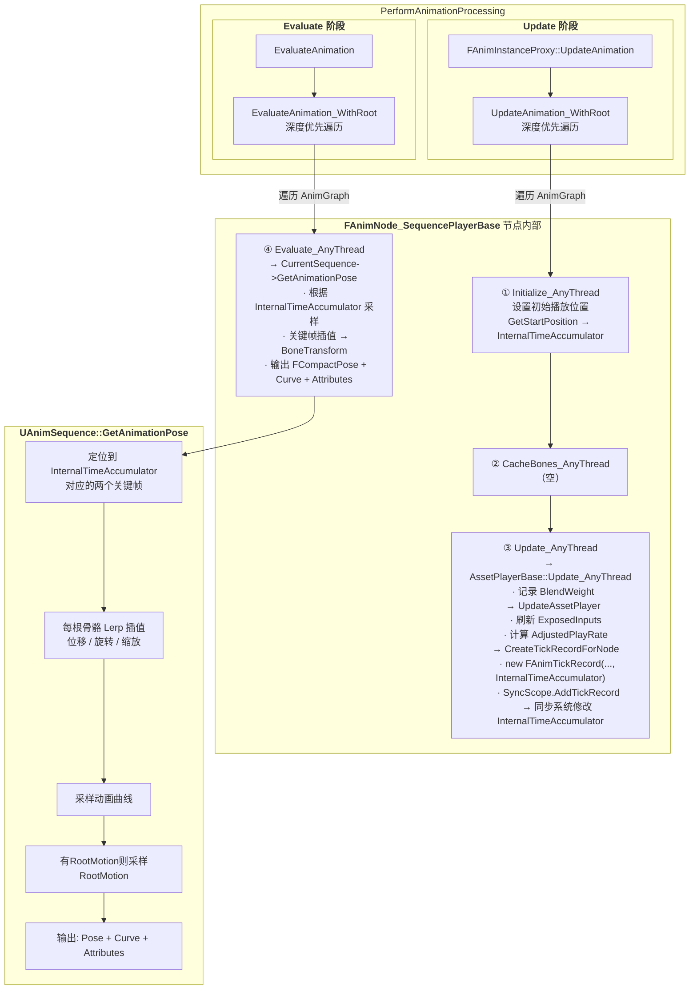

# AnimNode 生命周期：从 Initialize 到 Pose 的完整调用链

> 基于 UE 5.7.4 源码。本文沿继承链从上到下梳理：`FAnimNode_Base` → `FAnimNode_AssetPlayerBase` → `FAnimNode_SequencePlayerBase` → `UAnimSequence::GetAnimationPose`，把 AnimNode 的四个生命周期函数（Initialize / CacheBones / Update / Evaluate）彻底讲清楚。

---

## 零、在完整流程中的位置

先把这个调用链放回到之前梳理的一帧动画更新大框架中：



---

## 一、FAnimNode_Base —— 所有动画节点的基类

**源码位置**：`Engine/Source/Runtime/Engine/Private/Animation/AnimNodeBase.cpp:128-142`

`FAnimNode_Base` 是所有动画节点的公共基类。它提供了 **四个核心生命周期虚函数**，默认都是空实现：

```cpp
// AnimNodeBase.cpp:128
void FAnimNode_Base::Initialize_AnyThread(const FAnimationInitializeContext& Context)
{
    // 默认空实现
}

// AnimNodeBase.cpp:132
void FAnimNode_Base::CacheBones_AnyThread(const FAnimationCacheBonesContext& Context)
{
    // 默认空实现
}

// AnimNodeBase.cpp:136
void FAnimNode_Base::Update_AnyThread(const FAnimationUpdateContext& Context)
{
    // 默认空实现
}

// AnimNodeBase.cpp:140
void FAnimNode_Base::Evaluate_AnyThread(FPoseContext& Output)
{
    // 默认空实现
}
```

### 基类为什么全是空实现？

**因为每个动画节点的职责完全不同。** 基类提供统一接口，让 PerformAnimationProcessing 可以无差别地遍历所有节点并调用这四个函数。子类按需重写：

- **重写所有四个**：SequencePlayer（播放动画，需要初始化时间、Update 推进、Evaluate 采样）
- **只重写 Update + Evaluate**：StateMachine（不需要 Initialize/CacheBones 的特殊逻辑）
- **只重写 CacheBones**：TwoBoneIK、LookAt（需要缓存特定骨骼索引）
- **一个都不重写**：纯数据节点（只暴露变量给蓝图，不产生动画输出）

### 四个生命周期函数的意义



| 阶段 | 函数 | 调用时机 | 职责 |
|------|------|----------|------|
| 初始化 | `Initialize_AnyThread` | 节点首次激活 | 设置初始播放位置、重置状态 |
| 骨骼缓存 | `CacheBones_AnyThread` | LOD变化 / 骨骼数组变化 | 把高层骨骼引用转为运行时紧凑骨骼索引 |
| 更新状态 | `Update_AnyThread` | **每帧**（Update 阶段） | 推进时间、判断状态机过渡、更新 Blend 权重、创建 TickRecord |
| 计算姿态 | `Evaluate_AnyThread` | **每帧**（Evaluate 阶段） | 采样动画序列、混合多个 Pose、输出最终骨骼 Transform |

---

## 二、FAnimNode_AssetPlayerBase —— 资产播放器公共基类

**源码位置**：`Engine/Source/Runtime/Engine/Private/Animation/AnimNode_AssetPlayerBase.cpp:10-50`

这是所有"播放动画资产"的节点的公共基类。它的子类包括：

| 节点类 | 用途 |
|--------|------|
| `FAnimNode_SequencePlayer` | 播放 AnimSequence |
| `FAnimNode_SequenceEvaluator` | 在指定时间采样 AnimSequence（不推进时间） |
| `FAnimNode_BlendSpacePlayer` | 播放 BlendSpace |
| `FAnimNode_BlendSpaceEvaluator` | 在指定参数采样 BlendSpace |

### 2.1 Initialize_AnyThread

```cpp
// AnimNode_AssetPlayerBase.cpp:10
void FAnimNode_AssetPlayerBase::Initialize_AnyThread(const FAnimationInitializeContext& Context)
{
    FAnimNode_Base::Initialize_AnyThread(Context);  // 调用基类（空实现）

    MarkerTickRecord.Reset();       // 清空标记同步记录
    bHasBeenFullWeight = false;     // 从未满权重过
}
```

- `MarkerTickRecord`：动画序列里可以打同步标记（如 `LeftFootDown`、`RightFootDown`），用于让不同动画按脚步点对齐。初始化时必须清掉旧状态
- `bHasBeenFullWeight`：记录这个 asset player 是否曾经达到过满权重（权重接近 1.0），用于状态机逻辑和同步行为判断

### 2.2 Update_AnyThread —— 记录权重 + 委托子类

```cpp
// AnimNode_AssetPlayerBase.cpp:18
void FAnimNode_AssetPlayerBase::Update_AnyThread(const FAnimationUpdateContext& Context)
{
    // 1. 从上下文获取当前节点的最终混合权重
    BlendWeight = Context.GetFinalBlendWeight();

    // 2. 标记是否曾经满权重（用于状态机等逻辑）
    bHasBeenFullWeight = bHasBeenFullWeight
        || (BlendWeight >= (1.0f - ZERO_ANIMWEIGHT_THRESH));

    // 3. 委托给子类：具体怎么更新由 SequencePlayer / BlendSpacePlayer 决定
    UpdateAssetPlayer(Context);
}
```

**这里的 BlendWeight 是从哪里来的？** 它不是节点自己决定的，而是从 AnimGraph 的上游一层层传下来的。比如：

```
StateMachine: Idle → Walk 过渡, Walk 权重 = 0.25
  └─ SequencePlayer: Walk_Fwd
       最终的 FinalBlendWeight = 0.25 × 上层LOD/Slot等混合权重
```

### 2.3 CreateTickRecordForNode —— ★ 核心：把动画资产加入同步系统

```cpp
// AnimNode_AssetPlayerBase.cpp:27
void FAnimNode_AssetPlayerBase::CreateTickRecordForNode(
    const FAnimationUpdateContext& Context,
    UAnimSequenceBase* Sequence,   // 播放哪个动画
    bool bLooping,                 // 是否循环
    float PlayRate,                // 播放速率
    bool bIsEvaluator)             // false=Player(推进时间), true=Evaluator(只采样)
{
    const float FinalBlendWeight = Context.GetFinalBlendWeight();

    // ★ 从 Context 中获取同步组作用域（必须存在，否则报错）
    UE::Anim::FAnimSyncGroupScope& SyncScope =
        Context.GetMessageChecked<UE::Anim::FAnimSyncGroupScope>();

    // ★ 创建 FAnimTickRecord：一份"这个动画本帧该怎么播放"的说明书
    FAnimTickRecord TickRecord(
        Sequence,
        bLooping,
        PlayRate,
        bIsEvaluator,
        FinalBlendWeight,
        /*inout*/ InternalTimeAccumulator,  // ← 注意：时间会被同步系统修改
        MarkerTickRecord
    );

    // 收集上下文数据到 TickRecord
    TickRecord.GatherContextData(Context);
    TickRecord.RootMotionWeightModifier = Context.GetRootMotionWeightModifier();
    TickRecord.DeltaTimeRecord = &DeltaTimeRecord;
    TickRecord.bRequestedInertialization =
        Context.GetMessage<UE::Anim::FAnimInertializationSyncScope>() != nullptr;

    // ★★★ 核心动作：把 TickRecord 加入同步组作用域
    // 同步系统之后统一处理：时间推进、SyncGroup、Marker Sync、Notify、RootMotion
    SyncScope.AddTickRecord(
        TickRecord,
        GetSyncParams(TickRecord.bRequestedInertialization),
        UE::Anim::FAnimSyncDebugInfo(Context)
    );
}
```

**为什么 SequencePlayer 不自己 `Time += DeltaTime * PlayRate`？**

因为一个角色的动画图可能同时有多个动画在播放（Locomotion、Montage、AimOffset、Additive 等），它们需要：
- **SyncGroup 同步**：左脚的 Walk 和右脚的 Run 可能属于同一个同步组，需要 leader/follower 协调
- **Marker Sync**：按动画标记（LeftFootDown 等）对齐，而不是按绝对时间
- **统一时间推进**：所有 asset player 的时间由同步系统统一计算，避免各自独立推进导致不一致
- **RootMotion 按权重混合**

所以 UE 的设计是：**每个 asset player 在 Update 阶段创建 TickRecord 提交给同步系统，由同步系统统一推进时间。** 节点的 `InternalTimeAccumulator` 会在这一步被同步系统修改。

### 2.4 完整链路



---

## 三、FAnimNode_SequencePlayerBase —— Sequence Player 节点

**源码位置**：`Engine/Source/Runtime/Engine/Private/Animation/AnimNode_SequencePlayer.cpp:47-143`

这就是动画蓝图里 **Sequence Player 节点**的运行时实现。它继承自 `FAnimNode_AssetPlayerBase`，专门处理 `UAnimSequenceBase` 类型的动画资产。

### 3.1 Initialize_AnyThread —— 设置初始播放位置

**源码**：`AnimNode_SequencePlayer.cpp:47`

```cpp
void FAnimNode_SequencePlayerBase::Initialize_AnyThread(const FAnimationInitializeContext& Context)
{
    FAnimNode_AssetPlayerBase::Initialize_AnyThread(Context);  // 父类：清 Marker + 权重

    // ★ 更新蓝图暴露的 pin 输入（Sequence、PlayRate、StartPosition 等）
    GetEvaluateGraphExposedInputs().Execute(Context);

    // Sequence Player 不支持 Montage
    UAnimSequenceBase* CurrentSequence = GetSequence();
    if (CurrentSequence && !ensureMsgf(!CurrentSequence->IsA<UAnimMontage>(), ...))
        CurrentSequence = nullptr;

    // 设置初始播放时间
    InternalTimeAccumulator = GetStartPosition();
    PlayRateScaleBiasClampState.Reinitialize();  // 重置 PlayRate 的 Scale/Bias/Clamp 状态

    if (CurrentSequence != nullptr)
    {
        // Clamp 初始时间到 [0, 动画长度]
        InternalTimeAccumulator = FMath::Clamp(GetEffectiveStartPosition(Context), 0.f,
            CurrentSequence->GetPlayLength());

        // 计算有效 PlayRate
        const float AdjustedPlayRate = PlayRateScaleBiasClampState.ApplyTo(
            GetPlayRateScaleBiasClampConstants(),
            (CurrentPlayRate / CurrentPlayRateBasis), 0.f);
        const float EffectivePlayrate = CurrentSequence->RateScale * AdjustedPlayRate;

        // 特殊处理：StartPosition=0 且负向播放 → 从末尾开始倒放
        if ((EffectiveStartPosition == 0.f) && (EffectivePlayrate < 0.f))
            InternalTimeAccumulator = CurrentSequence->GetPlayLength();
    }
}
```

### 3.2 CacheBones_AnyThread —— 空实现

**源码**：`AnimNode_SequencePlayer.cpp:80`

```cpp
void FAnimNode_SequencePlayerBase::CacheBones_AnyThread(const FAnimationCacheBonesContext& Context)
{
    // Sequence Player 不需要缓存特定骨骼 —— 它播放整段动画，骨骼数据由
    // UAnimSequenceBase::GetAnimationPose 根据 RequiredBones 动态采样
}
```

不需要的原因是：SequencePlayer 不对特定几根骨骼做操作（不像 TwoBoneIK 需要知道 "UpperArm" 和 "LowerArm" 的索引）。它只需要把 `InternalTimeAccumulator` 告诉动画资产，由资产自己根据 RequiredBones 采样所有需要的骨骼。

### 3.3 UpdateAssetPlayer —— Update 阶段核心

**源码**：`AnimNode_SequencePlayer.cpp:85`

```cpp
void FAnimNode_SequencePlayerBase::UpdateAssetPlayer(const FAnimationUpdateContext& Context)
{
    // 1. 每帧刷新蓝图 pin 输入（用户可能在 EventGraph 里动态改了 PlayRate 等）
    GetEvaluateGraphExposedInputs().Execute(Context);

    UAnimSequenceBase* CurrentSequence = GetSequence();
    // 再次检查 Montage（因为 Sequence 可能是动态切换的）
    // ...

    if (CurrentSequence != nullptr && CurrentSequence->GetSkeleton() != nullptr)
    {
        // 2. 计算修正后的 PlayRate
        const float AdjustedPlayRate = PlayRateScaleBiasClampState.ApplyTo(
            GetPlayRateScaleBiasClampConstants(),
            (CurrentPlayRate / CurrentPlayRateBasis),
            Context.GetDeltaTime());   // ← 这次传了 DeltaTime（和 Initialize 不同）

        // 3. Clamp 当前时间到合法范围
        InternalTimeAccumulator = FMath::Clamp(InternalTimeAccumulator, 0.f,
            CurrentSequence->GetPlayLength());

        // ★★★ 4. 创建 TickRecord → 交给同步系统推进时间
        CreateTickRecordForNode(Context, CurrentSequence, IsLooping(), AdjustedPlayRate,
            false);  // false = Player（推进时间），不是 Evaluator
    }
}
```

**这一帧 SequencePlayer 的 InternalTimeAccumulator 是怎么推进的？**

```
UpdateAssetPlayer
  → CreateTickRecordForNode
      → FAnimTickRecord TickRecord(..., /*inout*/ InternalTimeAccumulator, ...)
      → SyncScope.AddTickRecord(TickRecord, ...)
          → 同步系统内部根据 DeltaTime、PlayRate、SyncGroup 关系
             修改 TickRecord.InternalTimeAccumulator ← 指针指向节点的 InternalTimeAccumulator
```

所以 `InternalTimeAccumulator` 是被同步系统**通过指针直接修改**的，不是节点自己加 DeltaTime。

### 3.4 Evaluate_AnyThread —— ★ 真正采样 Pose

**源码**：`AnimNode_SequencePlayer.cpp:120`

```cpp
void FAnimNode_SequencePlayerBase::Evaluate_AnyThread(FPoseContext& Output)
{
    UAnimSequenceBase* CurrentSequence = GetSequence();
    if (CurrentSequence != nullptr && CurrentSequence->GetSkeleton() != nullptr)
    {
        // Additive 检查：如果输出期望 Additive 但当前动画不是，打 Warning
        const bool bExpectedAdditive = Output.ExpectsAdditivePose();
        const bool bIsAdditive = CurrentSequence->IsValidAdditive();
        if (bExpectedAdditive && !bIsAdditive)
            Output.LogMessage(EMessageSeverity::Warning, ...);

        // ★★★ 核心：根据 InternalTimeAccumulator 采样动画
        FAnimationPoseData AnimationPoseData(Output);
        CurrentSequence->GetAnimationPose(
            AnimationPoseData,
            FAnimExtractContext(
                static_cast<double>(InternalTimeAccumulator),  // ← 当前播放时间
                Output.AnimInstanceProxy->ShouldExtractRootMotion(),
                DeltaTimeRecord,
                IsLooping()
            )
        );
    }
    else
    {
        Output.ResetToRefPose();  // 无效资产 → 输出参考姿态
    }
}
```

**`FAnimationPoseData` 包装了什么？** 它包装了 `FPoseContext`，里面包含三个输出通道：

```
FAnimationPoseData
  ├─ Pose（FCompactPose）      → 骨骼局部变换
  ├─ Curve（FBlendedHeapCurve） → 动画曲线（MorphTarget、Material Parameter 等）
  └─ Attributes                → 自定义属性
```

所以 `GetAnimationPose` 不仅输出骨骼姿态，同时还可能输出动画曲线和自定义属性。

**`FAnimExtractContext` 里的参数：**

| 参数 | 含义 |
|------|------|
| `InternalTimeAccumulator` | 当前采样时间点 |
| `ShouldExtractRootMotion()` | 是否提取 RootMotion |
| `DeltaTimeRecord` | 本帧时间推进记录（用于 Notify、Marker Sync、RootMotion 区间判断） |
| `IsLooping()` | 是否循环（影响循环边界的采样和事件处理） |

### 3.5 SequencePlayer 的 Update vs Evaluate 对比

这是理解 Update/Evaluate 分离的最佳案例：

| | **UpdateAssetPlayer** | **Evaluate_AnyThread** |
|---|---|---|
| **阶段** | Update | Evaluate |
| **关心的问题** | "这一帧时间该怎么走？" | "当前时间点的骨骼姿态是什么？" |
| **输入** | Context.DeltaTime | InternalTimeAccumulator |
| **做什么** | 计算 PlayRate → 创建 TickRecord → 同步系统推进时间 | 采样动画序列 → 输出 Pose/Curve/Attributes |
| **是否改变状态** | 是（通过 TickRecord 修改 InternalTimeAccumulator） | 否（只读 InternalTimeAccumulator，纯计算） |

---

## 四、UAnimSequence::GetAnimationPose —— Pose 从哪来

**源码位置**：`Engine/Source/Runtime/Engine/Private/Animation/AnimSequence.cpp:1658`

当 `Evaluate_AnyThread` 调用 `CurrentSequence->GetAnimationPose()` 时，实际执行的是：

```cpp
// AnimSequence.cpp:1658
void UAnimSequence::GetAnimationPose(FAnimationPoseData& OutAnimationPoseData,
    const FAnimExtractContext& ExtractionContext) const
{
    const FCompactPose& OutPose = OutAnimationPoseData.GetPose();

    if (IsValidAdditive() && ShouldUseRawDataForPoseExtraction(...))
    {
        // Additive 动画：分 LocalSpaceBase 和 MeshSpaceRotation 两种
        if (AdditiveAnimType == AAT_LocalSpaceBase)
            GetBonePose_Additive(OutAnimationPoseData, ExtractionContext);
        else if (AdditiveAnimType == AAT_RotationMeshSpace)
            GetBonePose_AdditiveMeshRotationOnly(OutAnimationPoseData, ExtractionContext);
    }
    else
    {
        // ★ 普通动画：根据时间采样，插值关键帧，输出每根骨骼的 Transform
        GetBonePose(OutAnimationPoseData, ExtractionContext);
    }

    // 如果有 RootMotion，把 RootMotion delta 采样到 Pose 的 Attribute 容器中
    if (HasRootMotion())
    {
        // RootMotionProvider->SampleRootMotion(...)
    }
}
```

### 内部流程

```
GetAnimationPose
  └─ GetBonePose (普通动画)
       ├─ 根据 ExtractionContext.CurrentTime 定位到最近的两个关键帧
       ├─ 对每根 RequiredBone：
       │    ├─ 取前一帧和后一帧的 Transform（位移/旋转/缩放）
       │    ├─ 按时间比例插值（Lerp）
       │    └─ 写入 OutPose[BoneIndex]
       ├─ 采样动画曲线（MorphTarget、MaterialParameter 等）
       └─ 如果 HasRootMotion：采样根运动数据到 Attributes
```

**这就是 Pose 的真正来源**：动画师在 DCC 里做的关键帧 → 导入 UE 压缩存储 → 运行时按时间采样 + 插值 → 写到 `FCompactPose`。

---

## 五、完整调用链总图

把上面四个类的调用关系串起来：



---

## 六、关键源码文件索引

| 文件 | 行号 | 内容 |
|------|------|------|
| `AnimNodeBase.cpp` | 128-142 | `FAnimNode_Base` 四个空实现 |
| `AnimNode_AssetPlayerBase.cpp` | 10-16 | `Initialize_AnyThread` — 清 Marker、重置权重 |
| `AnimNode_AssetPlayerBase.cpp` | 18-25 | `Update_AnyThread` — 记录 BlendWeight、委托子类 |
| `AnimNode_AssetPlayerBase.cpp` | 27-45 | `CreateTickRecordForNode` — ★ 创建 TickRecord 加入同步系统 |
| `AnimNode_AssetPlayerBase.cpp` | 47-50 | `GetAccumulatedTime` — 返回 InternalTimeAccumulator |
| `AnimNode_SequencePlayer.cpp` | 47-78 | `Initialize_AnyThread` — 设置初始播放位置和 PlayRate |
| `AnimNode_SequencePlayer.cpp` | 80-83 | `CacheBones_AnyThread` — 空 |
| `AnimNode_SequencePlayer.cpp` | 85-118 | `UpdateAssetPlayer` — ★ Update 阶段核心 |
| `AnimNode_SequencePlayer.cpp` | 120-143 | `Evaluate_AnyThread` — ★ 采样 Pose |
| `AnimSequence.cpp` | 1658-1688 | `GetAnimationPose` — 关键帧插值，输出 Pose |

---

## 七、一句话总结

**Initialize** 设置起点 → **CacheBones** 缓存骨骼引用（SequencePlayer 不需要）→ **Update** 每帧创建 TickRecord 交给同步系统推进 `InternalTimeAccumulator` → **Evaluate** 用 `InternalTimeAccumulator` 去 `UAnimSequence::GetAnimationPose` 采样关键帧并插值出 `FCompactPose`（+ Curve + Attributes）。

`CreateTickRecordForNode` 是理解"为什么 Update 和 Evaluate 要分开"的关键：SequencePlayer 不自己推进时间，而是提交 TickRecord 给同步系统，让系统统一处理 SyncGroup、Marker Sync、RootMotion 权重等跨节点的协调问题。
