# Games105 - 游戏动画笔记

## 一、动力学与运动学

### 动力学 (Dynamics)
- 研究物体运动与力的关系
- 需要考虑质量、力、扭矩等物理属性
- 通过物理模拟计算运动（如布料、流体、刚体）
- 计算量大，但结果真实

### 运动学 (Kinematics)
- 只研究物体运动本身，不涉及力
- 直接指定位置、速度、加速度
- 计算效率高，易于控制
- 广泛应用于角色动画

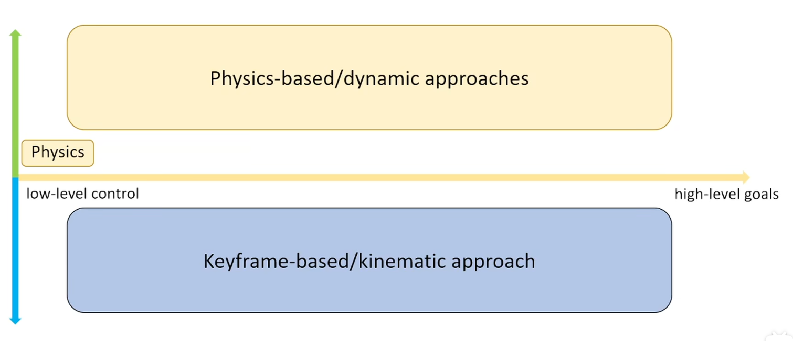

---

## 二、关键帧动画 (Keyframe Animation)

### 基本概念
- 动画师在关键时间点设置关键姿态（关键帧）
- 中间帧由计算机自动插值生成
- 是最基础、最广泛使用的动画技术

### 插值方法
- **线性插值**：简单但运动生硬
- **样条插值**：曲线平滑，运动自然
- **贝塞尔曲线**：可控性强，广泛使用

### 优缺点
| 优点 | 缺点 |
|------|------|
| 动画师完全控制 | 工作量大 |
| 艺术表现力强 | 难以实时响应 |
| 技术成熟 | 需要专业技能 |

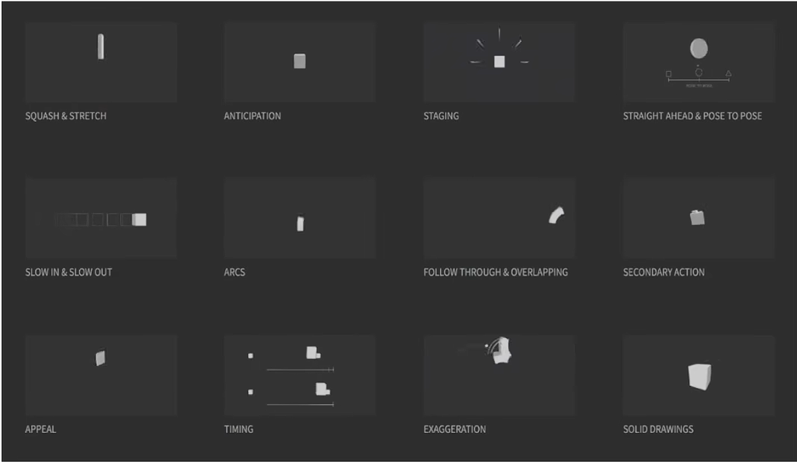

这个动画不赖

---

## 三、运动学

### 前向运动学 (Forward Kinematics, FK)
- **原理**：给定关节角度，计算末端位置
- **过程**：从根节点沿骨骼树向下计算
- **特点**：计算简单，结果确定
- **适用场景**：动画师直接控制关节旋转

### 逆向运动学 (Inverse Kinematics, IK)
- **原理**：给定末端目标位置，反算关节角度
- **过程**：有点像递归根据结果算出过程
- **特点**：需要求解，可能有多个或无解

### IK 求解方法
1. **解析法**：精确解，计算快，但只适用于简单结构
2. **数值法（Jacobian方法）**：迭代求解，通用性强
3. **启发式方法（CCD/FABRIK）**：简单高效，适合实时应用

### IK 应用场景
- 脚部踩在不平地面
- 手抓取物体
- 头部看向目标
- 程序化动画

---

## 四、动画重定向 (Retargeting)

### 概念
将一个角色的动画应用到另一个不同骨骼结构的角色上

### 核心挑战
- 骨骼比例不同
- 关节数量不同
- 绑定姿势不同

### 解决方法
1. **骨骼映射**：建立源骨骼与目标骨骼的对应关系
2. **姿态重定向**：转换关节旋转数据
3. **比例调整**：根据肢体长度调整动画
4. **约束处理**：保持脚部接地、避免穿模等

### 应用
- 动画资源复用
- 多角色共享动画库
- 动捕数据应用

---

## 五、状态机与 Motion Graphs

### 动画状态机
- 管理角色不同动画状态之间的切换
- 状态：Idle、Walk、Run、Jump等
- 过渡条件：速度、输入、事件触发

### Motion Graphs
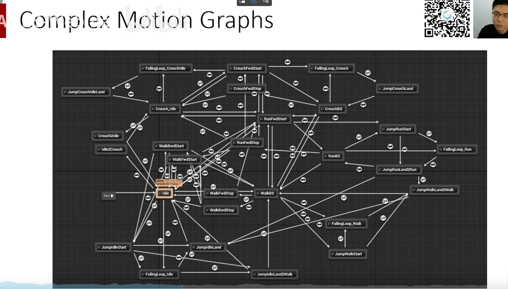

### 核心思想
- 将动画片段作为图的节点
- 边表示可能的过渡
- 通过搜索算法找到最优路径

### 关键技术
1. **相似度度量**：评估两个姿态的接近程度
2. **过渡点选择**：选择最平滑的过渡时机
3. **图搜索**：找到满足约束的动画序列

### 优势
- 自动生成复杂动画序列
- 响应式动画生成
- 减少手工工作量

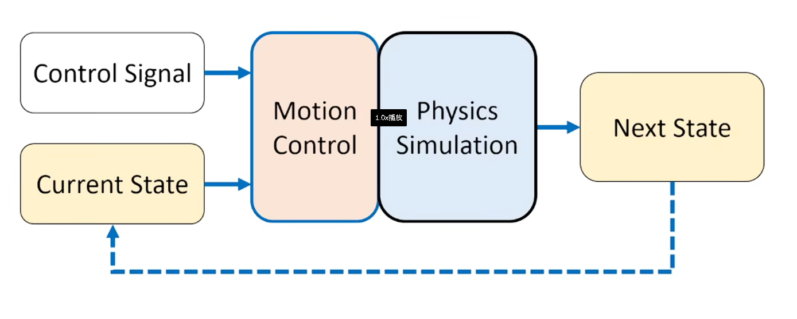

---

## 六、Ragdoll 物理布娃娃

### 概念
角色失去控制后，由物理引擎驱动的被动动画

### 实现要点
1. **骨骼简化**：用刚体近似骨骼结构
2. **关节约束**：限制关节的运动范围
3. **质量分布**：设置各部位质量
4. **碰撞设置**：避免自身穿透

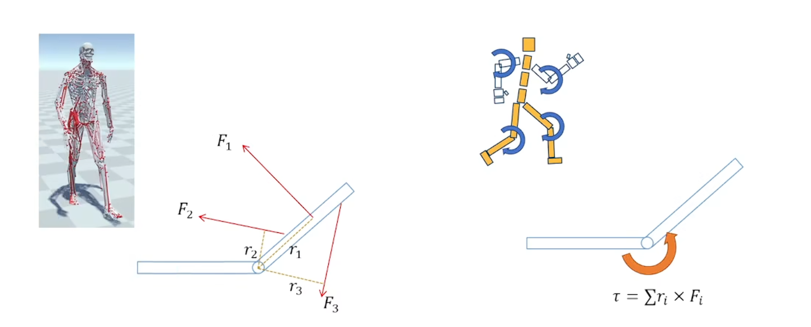

### Ragdoll 与动画混合
- **GetUp动画**：从倒地姿态恢复站立
- **动态过渡**：动画控制权在物理和动画系统间切换
- **姿态匹配**：从Ragdoll状态找到合适的起身动画起点

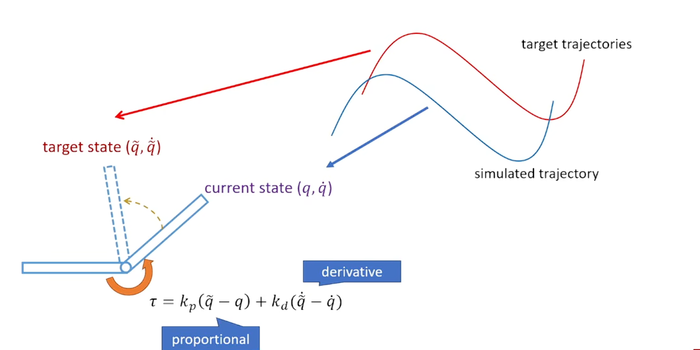

### 优化技巧
- 自适应激活：只在需要时启用物理
- 阻尼设置：防止过度抖动
- 质心调整：保证合理的物理行为

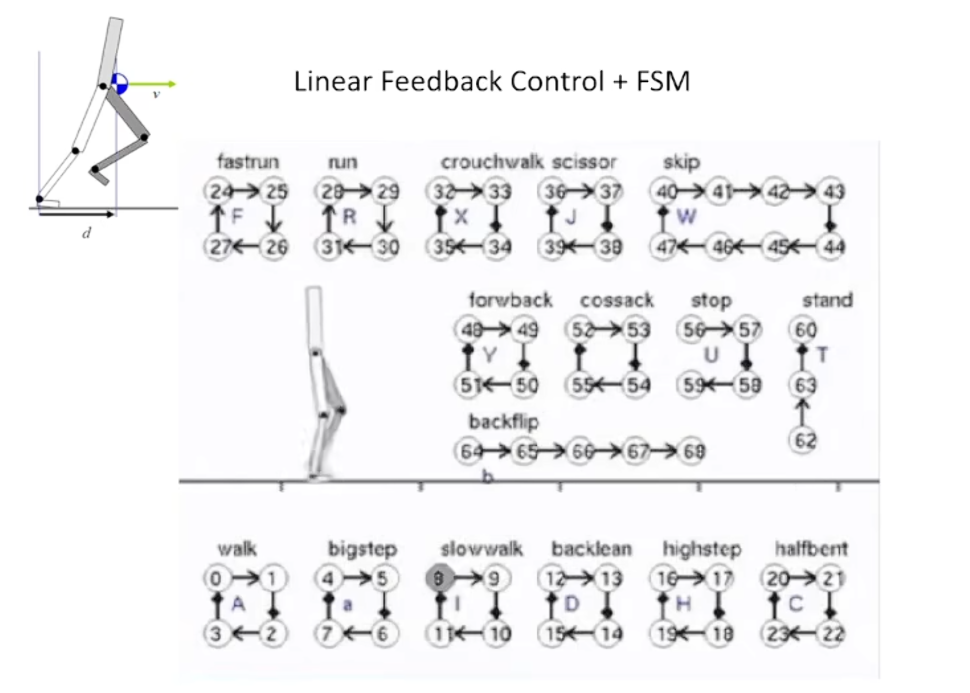

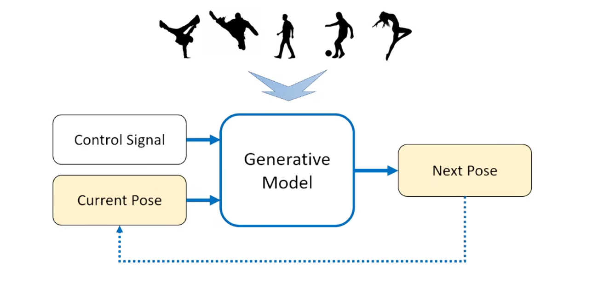

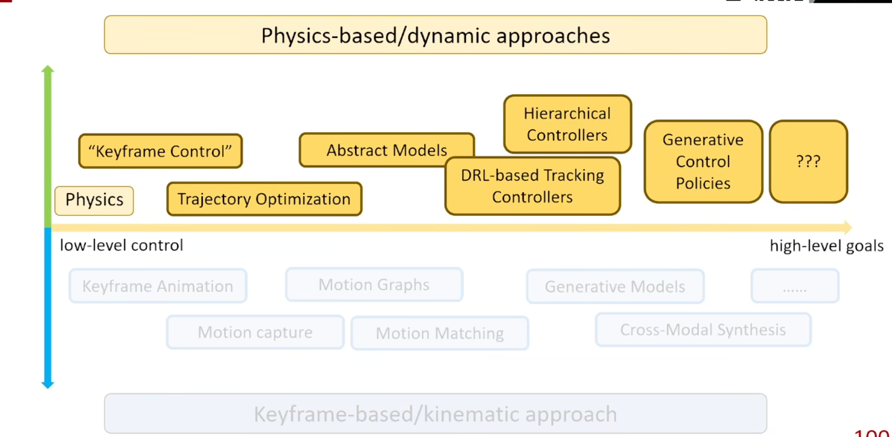

---

## 七、其他重要概念

### 动画混合 (Blending)
- 线性混合
- 加法混合
- 遮罩混合

### 程序化动画 (Procedural Animation)
- 运行时生成的动画
- 响应环境变化
- 如：脚步适配地形、注视行为

### 动画压缩
- 关键帧精简
- 误差度量
- 运行时解压

## 线性代数[#](https://www.cnblogs.com/3-louise-wang/p/17410788.html#2119819114)

### 1. 向量[#](https://www.cnblogs.com/3-louise-wang/p/17410788.html#3336471215)

- 向量是一种同时具有大小和方向的量
  给定一个向量a，大小为||a||，方向为a||a||（归一化）
- 可以表示一个位置、特征值....

### 2. 向量叉乘的两种理解[#](https://www.cnblogs.com/3-louise-wang/p/17410788.html#3536689510)


- 叉乘的作用在于寻找一个**同时垂直**于两个向量的向量，比如法向量

- 给定两个向量，如何求出其中一个向量旋转到另一个向量的最小旋转？**利用叉乘得到旋转轴、利用点乘得到最小旋转角**

  

- 如果给定旋转轴u和旋转角θ，如何得到旋转后的向量的值？

  - 方向：
    
    这里的v指的是找到一个同时垂直于u和a的方向，t是同时垂直于u和v的方向
  - 大小：在上图的平面上进行推理，如下
    
    这里的||u×a||是a在该平面的投影，是a和u夹角乘上a的值，相当于||u×a||，即叉乘的长度
    最后得到a往||v方向移动sinθ，往||t方向移动1−cosθ
  - 总的公式：Robrigues's rotation formula
    b=a+(sinθ)u×a+(1−cosθ)u×(u×a)

### 3. 矩阵[#](https://www.cnblogs.com/3-louise-wang/p/17410788.html#116812653)

- 特殊矩阵
  

- 矩阵的操作
  

- 叉乘的矩阵形式
  

  叉乘的操作用矩阵形式表示：
  

- 旋转用矩阵表示
  

- 正交阵

  - 定义：所有列（行）是互相构成正交的向量 ———> 产生的性质： AT=A−1 / ATA=I
    如图所示，对于矩阵A的的每一列向量来说都是互相正交的，所以其aTiaj=1，对于同一个向量来说，aTa等于其长度的平方，定义上表示aTa=1，说明正交矩阵的列向量都是单位向量。
    
    

  - 正交阵的行列式是±1，正负值取决于向量的顺序，如果其向量积满足右手定则，则为+1，否则为-1

  - 对于一个

    3×3

    的正交阵

    U

    （奇数阶的正交阵）来说，至少会有一个实的特征值

    λ=detU=±1

    > 关于特征值的定义：
    > 

### 4. Rigid Transformation[#](https://www.cnblogs.com/3-louise-wang/p/17410788.html#3343866567)

- 旋转矩阵的一些性质
  
- 旋转的组合是从右往左的
  
- 绕着坐标轴旋转的旋转矩阵
  

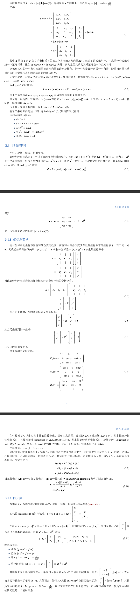

Two Bone Ik

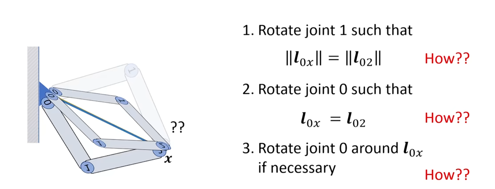

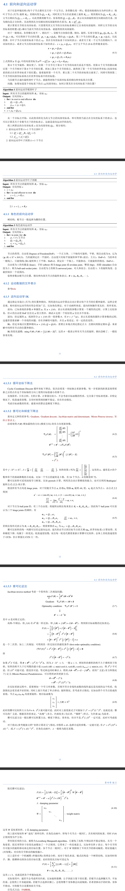

### IK（反向动力学）

**反向运动学 (IK) 是一种设置动画的方法，它翻转链操纵的方向。它是从叶子而不是根开始进行工作的。**

> 要了解 IK 是如何进行工作的，首先必须了解**层次链接**和[正向运动学](https://blog.csdn.net/f980511/article/details/123460210)的原则。

**简单演示**

现在举个手臂的例子。要设置使用正向 运动学 的手臂的动画，可以旋转大臂使它移离肩膀，然后旋转小臂，手部等等，为每个子对象添加旋转关键点。

要设置使用反向运动学的手臂的动画，可以移动用以定位腕部的目标。手臂的上半部分和下半部分为 IK 解决方案所旋转，使称为**末端效应器**的腕部轴点向着目标移动。

| 根、茎、叶(点) | CCD 末端效应器运动 | CCD 蒙皮后 |
| -------------- | ------------------ | ---------- |

> -   反向运动学定义为确定一组适当的关节构型，使末端尽可能平稳、快速、准确地移动到所需位置的问题。
> -   是一种通过估计每个独立自由度来计算姿态的方法，以满足用户约束的给定任务。

反向动力学的实现方法有很多种，常见的有 CCD （[循环坐标下降法](https://blog.csdn.net/f980511/article/details/123316988?spm=1001.2014.3001.5502)），FABR（前向和后向法），本文只说明反向动力学的基本方法。

### 策略 思路

1.从最小子骨骼开始遍历并趋近目标  
2.每个骨骼都将其子骨骼的轴点作为跟随点（最小子骨骼无子节点需直接跟随目标点），开始趋近  
3.骨骼跟随方法为，以自身轴点与目标点的方向为骨骼变换方向，并将骨骼终点与目标点对齐

> 从目标点（X）开始求解，并从链式结构的“叶节点”到“根节点”逐渐将整个链式结构趋近目标位置。

**范例：**  
构建链式结构：\[P2, P1 \]、\[P3,P2\]、\[P4,P3\]，其长度分别为d1,d2,d3  
（A）从尾端开始，以\[P4,P3\]开始逼近 X 点,  
（B）d3趋近，连接\[P3, X\], 将\[P4,P3\]移动至\[P4‘,P3’\],P4’ == X  
（C）d2趋近，连接\[P2, P3’\],将\[P3,P2\]移动至\[P3’,P2’\]  
（D）d1趋近，连接\[P1, P2’\],将\[P2,P1\]移动至\[P2’,P1‘\]   


### 角度限制

特殊情况下，得到运动的形状还不够，还需要进行一定的运动限制，现实中每一根骨骼在运动的过程中往往都会受到铰连接，带来的运动角度限制！

在链式结构跟随目标点运动时每个骨骼的运动角度都是相对的，即每个骨骼的角度限制都是以其子骨骼为相对方向（与子骨骼世界方向相同时角度为0°，相反时为180°或-180°），那么自然叶子节点因为没有子骨骼就没有什么限制（你要想有的话也可以有的，我这里不做实现）。

**下图：**  
a为父骨骼，b 为子骨骼，那么，a的限制角度计算方式就为，a方向 旋转到 b方向 的角度为准，范围为（-180,180）,角度的限制在跟随的过程中计算即可。  


## 实现 代码 ：

**Segment 类**

```csharp
    public class Segment
    {
   
   
        public float len;           //线段长度
        public Vector2 angleLimt = new Vector2(-180f, 180f);        //角度限制范围


        public Color color = Color.white;       //Gizmo color

        public Vector2 a {
   
    get; private set; }      //线段起点
        public Vector2 b {
   
    get; private set; }      //线段终点
        public Vector2 forward {
   
    get {
   
    return (b - a).normalized; } }       //线段终点方向

        /// <summary>
        /// 跟随目标节点,并计算自身位置
        /// </summary>
        /// <param name="target">目标点位置</param>
        /// <param name="prevDir">上一线段的方向</param>
        /// <param name="limt">是否使用角度限制</param>
        /// <param name="isForward">是否将线段终点作为向前方向</param>
        public void Follow(Vector2 target, Vector2 prevDir, Vector2 limt, bool isForward = true)
        {
   
   
            if (isForward)
            {
   
   
                a = -(target - a).normalized * len + target;
                b = target;
            }
            else
            {
   
   
                a = target;
                b = -(target - b).normalized * len + target;
            }

            if (limt.x != -180 || limt.y != 180) LimtAngle(prevDir, limt, isForward);
        }

        /// <summary>
        /// 角度限制
        /// </summary>
        /// <param name="prevDir">上一线段的方向</param>
        /// <param name="limt">角度的限制范围</param>
        /// <param name="isForward">是否将线段终点作为向前方向</param>
        
```

------

# 一、动画系统真正需要的参数（本质）

无论 FK / IK / Retarget / 引擎（Unity / UE），本质都只需要：

### ✅ 每个关节三样东西

[
\text{Joint} = (p, R, l)
]

| 参数              | 含义                 | 来源       |
| ----------------- | -------------------- | ---------- |
| **p（position）** | 关节位置（世界空间） | FK算出来   |
| **R（rotation）** | 关节旋转（四元数）   | Euler / IK |
| **l（offset）**   | 骨骼长度（局部）     | BVH        |

------

# 二、从 BVH 中如何获取这些参数

## 1️⃣ offset（骨骼结构）

```python
joint_offset[i]
```

👉 含义：

- 子关节相对父关节的**初始方向**
- 不随动画变化

✔ 这是“骨架结构”

------

## 2️⃣ rotation（动画核心）

```python
r = frame[channel_index:channel_index+3]
R_local = R.from_euler('XYZ', r, degrees=True)
```

👉 这是：

- 每一帧的关节旋转（局部）
- 动画的本质数据

------

## 3️⃣ root position（角色移动）

```python
p_root = frame[0:3]
```

👉 只有 root 有位置动画
👉 其他关节都是靠 FK 推出来的

------

# 三、从这些参数得到“动画结果”

## FK核心公式（你前面写的）

[
p_i = p_{parent} + Q_{parent} \cdot l_i
]

[
Q_i = Q_{parent} \cdot R_i
]

------

# 四、IK / CCD 需要的额外参数

IK不是从文件来，而是**你运行时计算的**

------

## 1️⃣ 方向向量（最核心）

```python
v1 = end - current
v2 = target - current
```

👉 这两个向量决定：

✔ 旋转多少
✔ 往哪转

------

## 2️⃣ 旋转角度

```python
theta = arccos(dot(v1, v2))
```

------

## 3️⃣ 旋转轴

```python
axis = cross(v1, v2)
```

------

## 4️⃣ 最终旋转

```python
R_delta = R.from_rotvec(theta * axis)
```

------

# 五、总结：动画中“所有需要的参数”

你可以记成这一张表：

------

## 🎯 静态数据（骨架）

- `joint_parent`
- `joint_offset`

------

## 🎯 动画数据（BVH）

- root position
- joint rotation（Euler）

------

## 🎯 FK计算得到

- joint_positions（世界坐标）
- joint_orientations（世界旋转）

------

## 🎯 IK需要额外计算

- 当前→末端 向量
- 当前→目标 向量
- rotation axis（叉乘）
- rotation angle（点乘）

你现在这一步已经很接近“自己能写 IK 了”，我帮你把**完整流程从公式 → 实际操作 → 每个关节怎么转**讲清楚。

------

那我是不是对每一个关节做这个运算就可以了，∂E≈((end−target)⋅(axisi×(end−jointi)))，能不能告诉我这个流程完整是怎么样的，对每一个关节进行什么样的旋转

# 一、先回答你的核心问题

> 是不是对每个关节用这个公式就行？

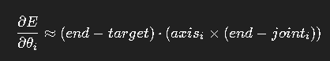

👉 **答案：是的，但不够完整**

因为你还缺两步：

```text
1️⃣ 用这个求“梯度”（转多少）
2️⃣ 用梯度去更新角度（真的去转）
```

------

# 二、完整流程（最关键）

我给你一个**从头到尾的标准 IK 梯度下降流程**

------

## ✅ Step 0：准备数据

你必须有：

```python
joint_positions      # FK算出来
joint_axes           # 每个关节旋转轴（世界坐标）
thetas               # 当前角度
target               # 目标点
```

------

## ✅ Step 1：循环迭代

```python
for iter in range(max_iter):
```

------

## ✅ Step 2：做一次 FK

```python
joint_positions = forward_kinematics(thetas)
end = joint_positions[-1]
```

------

## ✅ Step 3：计算误差

```python
error = end - target
```

------

## ✅ Step 4：对每个关节算梯度（你问的核心）

```python
for i in range(num_joints):

    joint_pos = joint_positions[i]
    axis = joint_axes[i]

    r = end - joint_pos

    grad_i = np.dot(error, np.cross(axis, r))
```

------

👉 这一步在干嘛？

```text
如果这个关节转一点，会让末端朝目标靠近还是远离？
```

------

## ✅ Step 5：更新角度（真正发生旋转）

```python
thetas[i] -= alpha * grad_i
```

------

👉 含义：

```text
grad > 0 → 往负方向转
grad < 0 → 往正方向转
```

------

## ✅ Step 6：判断收敛

```python
if np.linalg.norm(error) < threshold:
    break
```

------

# 三、你问的重点：每个关节“怎么旋转”

这个是最关键理解：

------

## 🎯 实际旋转是这样发生的

你并没有直接“旋转向量”

而是：

```text
改变角度 θ_i
→ FK重新算
→ 整个骨架动了
```

------

👉 所以流程是：

```text
θ_i 改一点
→ joint_i 转一点
→ 后面的骨骼全部更新
→ end 位置变化
```

------

# 四、这个公式的物理意义（非常重要）

[
grad_i = (error) \cdot (axis_i \times r)
]

------

拆开看：

### 1️⃣ error

```text
当前末端偏离目标多少
```

------

### 2️⃣ r = (end - joint)

```text
这个关节影响末端的“力臂”
```

------

### 3️⃣ axis × r

```text
这个关节转动时，末端的移动方向
```

------

### 4️⃣ dot

```text
这个方向和误差方向是否一致
```

------

👉 最终：

```text
这个关节转动，会不会让误差变小？
```

------

# 五、和 CCD 的区别（你会更清楚）

------

## CCD：

```text
每个关节：
    直接算一个旋转
```

------

## 梯度下降：

```text
每个关节：
    只算“该转多少”（标量）
```

------

👉 区别：

| 方法     | 控制方式 |
| -------- | -------- |
| CCD      | 直接旋转 |
| 梯度下降 | 调整角度 |

------

# 六、如果你用四元数（更真实）

上面是“角度版本”，但你现在用的是：

```python
Rotation（四元数）
```

------

## 对应写法：

```python
delta_angle = -alpha * grad_i

delta_rot = R.from_rotvec(delta_angle * axis)

joint_orientations[i] = delta_rot * joint_orientations[i]
```

------

👉 这才是“真正旋转关节”

------

# 七、完整最小版本（你可以直接用）

```python
for iter in range(10):

    joint_positions = FK(joint_orientations)
    end = joint_positions[-1]

    error = end - target

    for i in range(num_joints):

        joint_pos = joint_positions[i]
        axis = joint_axes[i]

        r = end - joint_pos

        grad = np.dot(error, np.cross(axis, r))

        delta_angle = -alpha * grad

        delta_rot = R.from_rotvec(delta_angle * axis)

        joint_orientations[i] = delta_rot * joint_orientations[i]
```

------

# 八、一句话总结（你必须记住）

> 👉 梯度下降 IK 的本质是：
> **每个关节尝试转一点，看能不能减少误差，然后不断迭代逼近目标**

------

可以，我们用**和你刚刚理解梯度下降一样的“工程流程”方式**，把 **雅可比逆法（Jacobian Inverse / Pseudoinverse）**彻底讲清楚，而且直接对应你能写代码的步骤。

------

# 一、核心目标（和CCD / 梯度下降一致）

你要做的事情始终是：

👉 让末端点 `end` 移动到 `target`

定义误差：

[
e = target - end
]

------

# 二、和梯度下降的区别（重点）

你之前的做法是：

👉 一个关节一个关节调（CCD / 梯度）

而 **雅可比方法是：**

👉 一次性算出“所有关节应该怎么一起动”

------

# 三、雅可比矩阵到底是什么

核心关系：

[
\Delta x = J \cdot \Delta \theta
]

解释：

| 符号              | 含义         |
| ----------------- | ------------ |
| ( \Delta \theta ) | 关节角度变化 |
| ( \Delta x )      | 末端位置变化 |
| ( J )             | 雅可比矩阵   |

------

## 👉 雅可比矩阵的物理意义

第 i 列：

[
J_i = axis_i \times (end - joint_i)
]

你是不是发现：

👉 **这就是你刚刚梯度下降里的那个公式！**

没错：

- 梯度下降：一个一个用
- 雅可比：全部拼成矩阵

------

# 四、完整流程（最重要）

我直接给你**可以写代码的步骤**

------

## Step 1：计算当前误差

```python
error = target - end
```

------

## Step 2：构建 Jacobian

假设有 n 个关节：

```python
J = np.zeros((3, n))
```

循环每个关节：

```python
for i in range(n):
    joint_pos = joint_positions[i]

    # 关节旋转轴（world space）
    axis = joint_orientations[i].apply(local_axis[i])

    r = end - joint_pos

    J[:, i] = np.cross(axis, r)
```

------

## Step 3：求 Δθ（核心）

理想公式：

[
\Delta \theta = J^{-1} e
]

但 J 不是方阵 → 用伪逆：

[
\Delta \theta = J^+ e
]

代码：

```python
J_pinv = np.linalg.pinv(J)
delta_theta = J_pinv @ error
```

------

## Step 4：更新关节

```python
for i in range(n):
    angle = delta_theta[i]

    axis = joint_orientations[i].apply(local_axis[i])

    rot = R.from_rotvec(axis * angle)

    joint_orientations[i] = rot * joint_orientations[i]
```

------

## Step 5：Forward Kinematics

```python
joint_positions, joint_orientations = FK(...)
```

------

## Step 6：循环迭代

```python
for iter in range(max_iter):
    ...
    if np.linalg.norm(error) < threshold:
        break
```

------

# 五、和你刚刚梯度下降的对应关系

| 梯度下降       | 雅可比         |
| -------------- | -------------- |
| 一个关节算梯度 | 所有关节一起算 |
| 标量更新       | 向量更新       |
| 慢但稳定       | 快但可能震荡   |

------

# 六、为什么它更强

CCD：

👉 局部贪心（一个关节一个关节）

雅可比：

👉 全局优化（所有关节一起动）

------

# 七、你现在最关键要理解的点

### 1️⃣ 这个式子：

[
J_i = axis_i \times (end - joint_i)
]

👉 本质：

**“这个关节转一点，会把末端往哪个方向推？”**

------

### 2️⃣ 这个式子：

[
\Delta \theta = J^+ e
]

👉 本质：

**“为了把末端移动到目标，我应该让每个关节转多少？”**

------

# 八、常见坑（你一定会踩）

### ❌ 抖动 / 爆炸

解决：

```python
delta_theta *= 0.1  # learning rate
```

------

### ❌ 不可达

手太短：

👉 error不会变0（正常）

------

### ❌ 奇异矩阵

用：

```python
np.linalg.pinv(J)
```

而不是 inverse

------

# 九、一句话总结

👉 梯度下降 = “一个关节一个关节试”
👉 雅可比 = “算出所有关节一起该怎么动”

![CharacterAnimation Extract[18-31] conv 0](../assets/CharacterAnimation Extract[18-31] conv 0.png)

![CharacterAnimation Extract[18-31] conv 1](../assets/CharacterAnimation Extract[18-31] conv 1.png)

![CharacterAnimation Extract[18-31] conv 2](../assets/CharacterAnimation Extract[18-31] conv 2.png)

![CharacterAnimation Extract[18-31] conv 3](../assets/CharacterAnimation Extract[18-31] conv 3.png)

![CharacterAnimation Extract[18-31] conv 4](../assets/CharacterAnimation Extract[18-31] conv 4.png)

![CharacterAnimation Extract[18-31] conv 5](../assets/CharacterAnimation Extract[18-31] conv 5.png)

![CharacterAnimation Extract[18-31] conv 6](../assets/CharacterAnimation Extract[18-31] conv 6.png)

![CharacterAnimation Extract[18-31] conv 7](../assets/CharacterAnimation Extract[18-31] conv 7.png)

![CharacterAnimation Extract[18-31] conv 8](../assets/CharacterAnimation Extract[18-31] conv 8.png)

![CharacterAnimation Extract[18-31] conv 9](../assets/CharacterAnimation Extract[18-31] conv 9.png)

![CharacterAnimation Extract[18-31] conv 10](../assets/CharacterAnimation Extract[18-31] conv 10.png)

![CharacterAnimation Extract[18-31] conv 11](../assets/CharacterAnimation Extract[18-31] conv 11.png)

![CharacterAnimation Extract[18-31] conv 12](../assets/CharacterAnimation Extract[18-31] conv 12.png)

在 Unreal Engine（尤其是动画系统、骨骼系统和 Transform 计算里），**Local Space（本地空间）**、**Component Space（组件空间）**、**World Space（世界空间）** 是三个最常见的坐标系。

可以理解成：

```text
Local Space → Component Space → World Space
```

每一级都是基于上一级计算出来的。

------

# 1. Local Space（本地空间）

Local Space 表示：

**相对于父节点（Parent）的变换。**

对于骨骼来说：

```text
手骨
 └─ 前臂骨
      └─ 上臂骨
```

如果前臂骨：

```cpp
Location = (10,0,0)
```

那么意思是：

```text
前臂相对于上臂向前偏移10
```

而不是相对于角色。

------

例如：

```text
角色
 └─ 上臂
      └─ 前臂
           └─ 手掌
```

手掌 Local Rotation：

```text
Pitch = 30°
```

表示：

```text
相对于前臂旋转30°
```

而不是世界坐标里的30°。

------

### 动画蓝图里

很多节点默认使用：

```text
Bone Space / Local Space
```

因为动画本质上存的是：

```text
父骨骼 -> 子骨骼
```

的相对变换。

------

# 2. Component Space（组件空间）

Component Space：

**相对于 SkeletalMeshComponent 的坐标系。**

------

假设角色在世界里：

```text
World Location
(1000,500,0)
```

Mesh 挂在 Character 上：

```text
Character
 └─ SkeletalMeshComponent
```

此时：

```text
Component Origin
(0,0,0)
```

就是 Mesh 的原点。

------

例如：

手的位置：

```text
Component Space
(50,20,120)
```

表示：

```text
手距离Mesh原点：
X=50
Y=20
Z=120
```

------

注意：

这里已经不关心父骨骼了。

所有骨骼都直接相对于：

```text
SkeletalMeshComponent
```

计算。

------

## Local → Component

例如：

```text
Root
 └─ Spine
      └─ Arm
           └─ Hand
```

Local Space：

```text
Spine -> Root
Arm -> Spine
Hand -> Arm
```

层层累加：

```text
Hand
= Root
+ Spine
+ Arm
+ Hand
```

得到：

```text
Hand Component Transform
```

这就是 Component Space。

------

# 为什么动画系统喜欢 Component Space

因为很多 IK 节点需要知道：

```text
手最终在哪里
脚最终在哪里
```

而不是：

```text
手相对于前臂在哪里
```

所以：

### Two Bone IK

### FABRIK

### CCDIK

### Aim Offset

很多节点内部都会先转成：

```text
Component Space
```

进行计算。

因此动画蓝图里经常能看到：

```text
Local To Component
```

和

```text
Component To Local
```

节点。

------

# 3. World Space（世界空间）

World Space：

**相对于整个关卡世界。**

------

例如：

```text
Actor Location

(1000,500,0)
```

玩家站在这里。

------

手的位置：

```text
(1050,520,120)
```

表示：

```text
手在地图中的真实位置
```

不依赖：

```text
父骨骼
Mesh
Actor
```

------

例如射线检测：

```cpp
LineTraceSingleByChannel
```

需要：

```cpp
Start
End
```

都是：

```text
World Space
```

坐标。

------

# 三者关系

假设：

```text
Actor
Location=(1000,0,0)
```

Mesh：

```text
Relative=(0,0,100)
```

手骨：

```text
Component=(50,0,120)
```

那么：

```text
World
=
Actor
+
Mesh Relative
+
Component
```

得到：

```text
Hand World

(1050,0,220)
```

------

关系图：

```text
World Space
    ↑
Actor Transform

Component Space
    ↑
Bone Hierarchy Accumulation

Local Space
```

------

# 实战记忆法

开发战斗系统时可以这样记：

| Space           | 相对于谁              |
| --------------- | --------------------- |
| Local Space     | 父骨骼                |
| Component Space | SkeletalMeshComponent |
| World Space     | 整个地图              |

或者一句话：

```text
Local = 父骨骼坐标

Component = 角色Mesh坐标

World = 世界坐标
```

对于你正在做的 UE C++ 状态机和 TPS/动作战斗系统：

- 播放动画、修改骨骼姿态 → 通常用 Local Space
- IK、AimOffset、武器持握修正 → 通常用 Component Space
- 枪口射线、锁定目标、生成子弹 → 通常用 World Space

这是最常见的使用场景划分。
