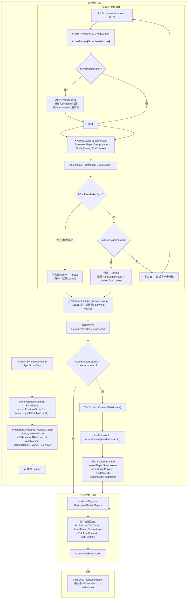
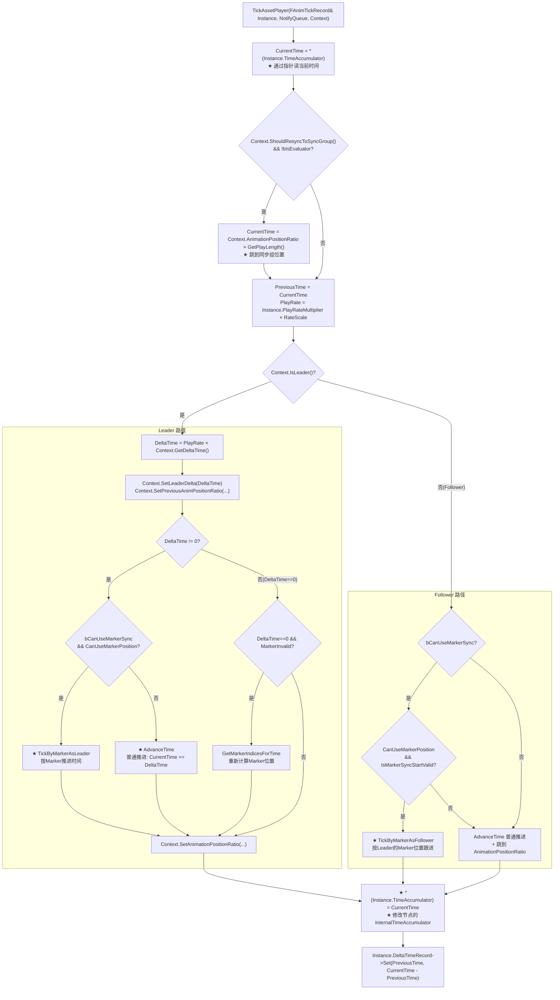
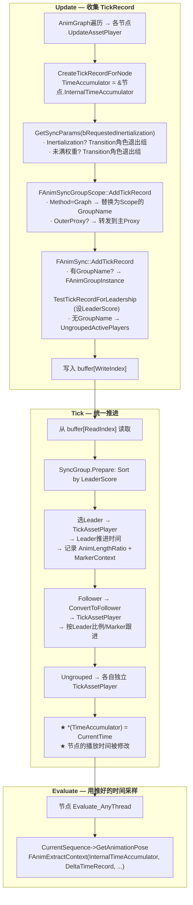

# UE 动画系统：FAnimTickRecord 与同步系统深度剖析

> 基于 UE 5.7.4 源码。深入回答：TickRecord 每个字段什么意思？同步系统 Leader/Follower 机制详细流程？**Marker Sync 是什么、怎么工作的？** Montage/BlendSpace 的 TickRecord 和 Sequence 有什么区别？

---

## 一、核心问题：为什么需要 TickRecord + 同步系统？

先回顾上一篇的核心结论：**SequencePlayer 不自己 `Time += DeltaTime`，而是创建 TickRecord 交给同步系统**。为什么？

一个角色的动画图里可能同时有多个动画在播放。这些动画之间可能有关系：SyncGroup 同步、Marker 对齐、RootMotion 权重混合。如果每个 SequencePlayer 各自推进时间，这些协调几乎不可能。

UE 的设计：

```
Update 阶段：各节点创建 TickRecord → 提交给 FAnimSync
Tick 阶段 ：FAnimSync::TickAssetPlayerInstances → 统一推进所有 TickRecord
Evaluate 阶段：各节点用已更新的 InternalTimeAccumulator 采样 Pose
```

**"统一推进"的机制**：TickRecord 通过 `float* TimeAccumulator` 指针直指节点的 `InternalTimeAccumulator`。同步系统通过这个指针修改节点内部时间——不需要"回调"节点，直接改内存。

---

## 二、FAnimTickRecord 完整字段解析

**源码位置**：`Engine/Source/Runtime/Engine/Classes/Animation/AnimationAsset.h:410`

```cpp
USTRUCT()
struct FAnimTickRecord
{
    // ═══════════ 1. 核心标识 ═══════════
    TObjectPtr<UAnimationAsset> SourceAsset = nullptr;  // 播放哪个动画资产
    float* TimeAccumulator = nullptr;   // ★ 指向节点 InternalTimeAccumulator 的指针
    float PlayRateMultiplier = 1.0f;    // 最终播放速率（已算出）
    float EffectiveBlendWeight = 0.0f;  // AnimGraph 层层传递的混合权重
    float RootMotionWeightModifier = 1.0f; // RootMotion 权重修正系数

    // ═══════════ 2. 行为标记 ═══════════
    bool bLooping = false;              // 是否循环
    bool bIsEvaluator = false;          // false=Player(推进时间) / true=Evaluator(只采样)
    bool bRequestedInertialization = false; // 是否请求惯性化过渡
    bool bOverridePositionWhenJoiningSyncGroupAsLeader = false; // 加入组时覆盖Leader位置
    bool bIsExclusiveLeader = false;    // 必须是Leader，否则移出同步组
    bool bActiveContext = true;         // 是否活跃

    // ═══════════ 3. 时间记录 ═══════════
    FDeltaTimeRecord* DeltaTimeRecord = nullptr;  // 本帧时间推进记录
    FMarkerTickRecord* MarkerTickRecord = nullptr; // Marker 同步状态

    // ═══════════ 4. Leader 选举 ═══════════
    bool bCanUseMarkerSync = false;     // 是否可以用 Marker 同步（由同步系统设置）
    float LeaderScore = 0.0f;           // Leader 排序分数（越高越优先）

    // ═══════════ 5. Notify 上下文数据 ═══════════
    TSharedPtr<TArray<TUniquePtr<const IAnimNotifyEventContextDataInterface>>> ContextData;

    // ═══════════ 6. 各类资产的额外数据（union） ═══════════
    union {
        struct { // BlendSpace — 多动画同时采样
            FBlendFilter* BlendFilter;
            TArray<FBlendSampleData>* BlendSampleDataCache;
            int32  TriangulationIndex;
            float  BlendSpacePositionX;
            float  BlendSpacePositionY;
            bool   bTeleportToTime;
        } BlendSpace;
        struct { // Montage — 分开管理位置，不用 TimeAccumulator
            float CurrentPosition;
            TArray<FPassedMarker>* MarkersPassedThisTick;
        } Montage;
    };
};
```

### 逐字段解释

**`TimeAccumulator`（★最关键）**：一个 `float*` 指针，指向节点的 `InternalTimeAccumulator`。任何人修改 `*TimeAccumulator` 就等于修改了节点的播放时间。这是同步系统"统一推进"的物理基础。

**`PlayRateMultiplier`**：不是原始的 PlayRate，而是已经经过了所有修正的最终值：`PlayRate / PlayRateBasis → ScaleBiasClamp.ApplyTo(...) → × RateScale`。同步系统直接用它推进时间，不需要再算。

**`EffectiveBlendWeight`**：从 AnimGraph 上游（状态机、BlendList、LOD 等）层层传下来的最终混合权重。用于：
- RootMotion 最终权重（`GetRootMotionWeight()` = `EffectiveBlendWeight × RootMotionWeightModifier`）
- `CanBeLeader` / `TransitionLeader` 角色的 LeaderScore（直接用权重做分数）

**`LeaderScore`** 分数体系：
| 角色 | 分数来源 | 典型值 |
|------|----------|--------|
| `CanBeLeader` | `EffectiveBlendWeight` | 0.0 ~ 1.0 |
| `AlwaysLeader` | 固定 2.0 | 2.0 |
| `TransitionLeader` | `EffectiveBlendWeight` | 0.0 ~ 1.0 |
| Montage Leader | 固定 3.0 | 3.0 |
| `ExclusiveAlwaysLeader` | 固定 2.0（必须是 Leader） | 2.0 |

**Union 中的 BlendSpace 数据**：BlendSpace 可能同时播放多个动画（比如 Walk_Fwd + Walk_Right 混合），需要额外的采样缓存和位置信息。注意它**没有** TimeAccumulator——BlendSpace 的时间推进行为是特殊的。

**Union 中的 Montage 数据**：Montage 不使用 `TimeAccumulator`，而是 `CurrentPosition`。因为 Montage 有自己的 Section/BranchingPoint 系统，时间管理更复杂。

---

## 三、辅助数据结构

### 3.1 FDeltaTimeRecord

**`AnimationAsset.h:97`**

```cpp
struct FDeltaTimeRecord
{
    void Set(float InPrevious, float InDelta)
    {
        Previous = InPrevious;
        Delta = InDelta;
        bPreviousIsValid = true;
    }

    float Delta = 0.f;         // 本帧实际推进了多少时间
private:
    float Previous = 0.f;      // 上一帧的时间位置
    bool  bPreviousIsValid = false;
};
```

**Delta 不只是 `DeltaTime × PlayRate`**，而是经过了同步系统协调、Marker Sync 跳跃、循环边界处理后的**有效推进量**。Evaluate 阶段用它判断 "在 `[Previous, CurrentTime]` 区间内经过了哪些 Notify/Marker"。

### 3.2 FMarkerPair

**`AnimationAsset.h:55`**

```cpp
struct FMarkerPair
{
    int32 MarkerIndex;      // Marker 在 AuthoredSyncMarkers 数组中的索引
    float TimeToMarker;     // 当前时间到该 Marker 的时间距离（可正可负）
};
```

两个 `FMarkerPair` 构成一个 `FMarkerTickRecord`：前一个 Marker + 后一个 Marker，界定当前位置在 Marker 空间中的"区间"。

### 3.3 FMarkerTickRecord

**`AnimationAsset.h:66`**

```cpp
struct FMarkerTickRecord
{
    FMarkerPair PreviousMarker;  // 上一个 Marker
    FMarkerPair NextMarker;      // 下一个 Marker

    bool IsValid(bool bLooping) const
    {
        int32 Threshold = bLooping ? MarkerIndexSpecialValues::AnimationBoundary
                                   : MarkerIndexSpecialValues::Uninitialized;
        return PreviousMarker.MarkerIndex > Threshold
            && NextMarker.MarkerIndex > Threshold;
    }

    void Reset() { PreviousMarker.Reset(); NextMarker.Reset(); }
};
```

**关键设计**：每个 AssetPlayer 节点**持有一个** `FMarkerTickRecord` 成员变量。`FAnimTickRecord::MarkerTickRecord` 是指向节点这个成员的**指针**。所以 TickAssetPlayer 修改 `*MarkerTickRecord` 就是修改节点的 Marker 状态，下一帧还在。

### 3.4 FMarkerSyncAnimPosition —— 跨动画的"Marker 位置语言"

**`AnimationAsset.h:371`**

```cpp
struct FMarkerSyncAnimPosition
{
    FName PreviousMarkerName;       // 前一个 Marker 的名称（如 "LeftFootDown"）
    FName NextMarkerName;           // 后一个 Marker 的名称
    float PositionBetweenMarkers;   // 在两个 Marker 之间的位置比例 [0,1]

    bool IsValid() const
    {
        return PreviousMarkerName != NAME_None && NextMarkerName != NAME_None;
    }
};
```

**这是 Marker Sync 的跨动画"共通语言"**。不同动画的 LeftFootDown 时间不同，但它们可以共享同一个 `FMarkerSyncAnimPosition`："在 LeftFootDown 和 RightFootDown 之间，已经走了 60%"。Leader 计算这个位置，Follower 用它来定位自己的时间。

### 3.5 FPassedMarker

**`AnimationAsset.h:399`**

```cpp
struct FPassedMarker
{
    FName PassedMarkerName;      // 经过的 Marker 名称
    float DeltaTimeWhenPassed;   // 经过该 Marker 时还剩余多少 DeltaTime
};
```

记录本帧内穿过了哪些 Marker。由 `AdvanceMarkerPhaseAsLeader` 填充，用于 Animation Insights 追踪和同步诊断。

### 3.6 FAnimSyncParams — 同步参数（节点 → 同步系统）

**`AnimSync.h:17`**

```cpp
struct FAnimSyncParams
{
    FName GroupName = NAME_None;             // 同步组名称
    EAnimGroupRole::Type Role = CanBeLeader;  // 组角色
    EAnimSyncMethod Method = DoNotSync;       // 同步方式
    bool bOverridePositionWhenJoiningSyncGroupAsLeader = false;
};
```

**`EAnimSyncMethod` 三种方式**：

| 方式 | 含义 | GroupName 来源 |
|------|------|----------------|
| `DoNotSync` | 不参与同步组，独立 Tick | `NAME_None`（强制） |
| `SyncGroup` | 显式指定同步组 | 节点的 `GetGroupName()` |
| `Graph` | 使用 Scope 上下文中的同步组 | `FAnimSyncGroupScope` 的 GroupName |

**`EAnimGroupRole` 角色表**：

| 角色 | LeaderScore | 行为 |
|------|-------------|------|
| `CanBeLeader` | `BlendWeight` | 可以当 Leader 也可以当 Follower |
| `AlwaysLeader` | 2.0 | 总是 Leader |
| `TransitionLeader` | `BlendWeight` | 过渡期间 Leader，需达到满权重才生效 |
| `TransitionFollower` | — | 过渡期间 Follower，需达到满权重 |
| `ExclusiveAlwaysLeader` | 2.0 | 必须是 Leader + 必须独占（否则被踢到 ungrouped） |

### 3.7 GetSyncParams 逻辑

**`AnimNode_AssetPlayerBase.cpp:78`**

```cpp
FAnimSyncParams GetSyncParams(bool bRequestedInertialization) const
{
    EAnimGroupRole::Type SyncGroupRole = GetGroupRole();
    FName SyncGroupName = GetGroupName();
    EAnimSyncMethod MethodToUse = GetGroupMethod();

    // ★ Inertialization 保护：
    //    如果本帧请求了惯性化过渡，
    //    TransitionLeader / TransitionFollower 暂时不参与同步组
    if (bRequestedInertialization)
    {
        if (SyncGroupRole == TransitionLeader || SyncGroupRole == TransitionFollower)
            SyncGroupName = NAME_None;  // 退出同步组
    }
    // ★ 标准 Blend 保护：
    //    如果角色是 Transition 且从未达到满权重，不参与同步组
    else if ((SyncGroupRole == TransitionLeader || SyncGroupRole == TransitionFollower)
             && !bHasBeenFullWeight)
    {
        SyncGroupName = NAME_None;
    }

    return FAnimSyncParams(SyncGroupName, SyncGroupRole, MethodToUse, ...);
}
```

**设计思路**：过渡期间，动画权重可能很低（0.1），此时就参与同步会导致画面跳变。所以 Transition 角色要等权重足够高、或 Inertialization 完成后才真正加入同步组。

---

## 四、Marker Sync 深度解析

### 4.1 什么是 Marker？

动画序列里可以定义**同步标记（Sync Markers）**。这些是动画师在动画资产中手动放置的命名时间点：

```
Walk 动画:
  [LeftFootDown  0.0s]  [RightFootDown  0.5s]  [LeftFootDown  1.0s]

Run  动画:
  [LeftFootDown  0.0s]    [RightFootDown 0.3s]    [LeftFootDown 0.6s]
```

在 UE 中，这些 Marker 存储在 `UAnimSequence::AuthoredSyncMarkers` 数组中：

```cpp
struct FAnimSyncMarker
{
    FName MarkerName;  // "LeftFootDown", "RightFootDown"
    float Time;        // 在动画时间轴上的位置（秒）
    int32 TrackIndex;  // 在哪个 Notify Track 上
};
```

### 4.2 为什么需要 Marker Sync？

**普通的长度比例同步**会出问题：

```
Leader: Walk  当前 0.3s → AnimLengthRatio = 0.3/1.0 = 0.3
Follower: Run 同步到 0.3×0.6 = 0.18s

问题: Walk 在 0.3s 已经过了 LeftFootDown (0.0s)，正走向 RightFootDown (0.5s)
      但 Run 在 0.18s 刚过了 LeftFootDown (0.0s)，离 RightFootDown (0.3s) 还远
      两个动画"相位"不一致！
```

**Marker Sync**：
```
Leader: Walk  在 LeftFootDown → RightFootDown 之间，PositionBetweenMarkers = 0.6
Follower: Run 在自己的 LeftFootDown → RightFootDown 之间，
               按相同的 PositionBetweenMarkers = 0.6 定位
               → 0.0 + 0.6×(0.3-0.0) = 0.18s
```

两个动画在 Marker 空间的相对位置完全一致，保证"脚步相位"对齐。

### 4.3 Marker Sync 算法详解

#### GetMarkerIndicesForTime — 根据时间定位 Marker

**`AnimSequence.cpp:4144`**

```cpp
void UAnimSequence::GetMarkerIndicesForTime(float CurrentTime, bool bLooping,
    const TArray<FName>& ValidMarkerNames,
    FMarkerPair& OutPrevMarker, FMarkerPair& OutNextMarker) const
{
    // 初始化为动画边界
    OutPrevMarker.MarkerIndex = AnimationBoundary;
    OutPrevMarker.TimeToMarker = -CurrentTime;
    OutNextMarker.MarkerIndex = AnimationBoundary;
    OutNextMarker.TimeToMarker = GetPlayLength() - CurrentTime;

    // 遍历所有 AuthoredSyncMarkers（支持循环偏移）
    for (int32 LoopMod = bLooping ? -1 : 0; LoopMod < (bLooping ? 2 : 1); ++LoopMod)
    {
        for (int32 Idx = 0; Idx < AuthoredSyncMarkers.Num(); ++Idx)
        {
            const FAnimSyncMarker& Marker = AuthoredSyncMarkers[Idx];
            if (ValidMarkerNames.Contains(Marker.MarkerName))
            {
                float MarkerTime = Marker.Time + LoopMod * GetPlayLength();
                if (MarkerTime < CurrentTime)
                {
                    OutPrevMarker.MarkerIndex = Idx;       // 更新为更近的前一个
                    OutPrevMarker.TimeToMarker = MarkerTime - CurrentTime;
                }
                else if (MarkerTime >= CurrentTime)
                {
                    OutNextMarker.MarkerIndex = Idx;       // 找到第一个 ≥ 当前时间的
                    OutNextMarker.TimeToMarker = MarkerTime - CurrentTime;
                    break;
                }
            }
        }
    }
}
```

简单说：遍历所有 Marker，找出 `(最近一个 < CurrentTime)` 作为 PrevMarker，`(第一个 ≥ CurrentTime)` 作为 NextMarker。`TimeToMarker` 对 Prev 是负数（过去），对 Next 是正数（未来）。

#### AdvanceMarkerPhaseAsLeader — Marker 模式下推进时间

**`AnimSequence.cpp:3350`**

```cpp
void UAnimSequence::AdvanceMarkerPhaseAsLeader(
    bool bLooping, float MoveDelta, const TArray<FName>& ValidMarkerNames,
    float& CurrentTime, FMarkerPair& PrevMarker, FMarkerPair& NextMarker,
    TArray<FPassedMarker>& MarkersPassed, ...) const
{
    const bool bPlayingForwards = MoveDelta >= 0.f;
    float CurrentMoveDelta = MoveDelta;

    // Ensure time is within boundaries
    CurrentTime = FMath::Clamp(CurrentTime, 0.f, GetPlayLength());

    if (bPlayingForwards)
    {
        while (true)  // 可能跨越多个 Marker
        {
            // 如果 NextMarker 是动画边界（没有更多 Marker 了）
            if (NextMarker.MarkerIndex == AnimationBoundary)
            {
                CurrentTime = FMath::Min(CurrentTime + CurrentMoveDelta, GetPlayLength());
                NextMarker.TimeToMarker = GetPlayLength() - CurrentTime;
                PrevMarker.TimeToMarker -= CurrentTime - PrevCurrentTime;
                break;
            }

            const FAnimSyncMarker& NextSyncMarker = AuthoredSyncMarkers[NextMarker.MarkerIndex];

            // 本帧推进量超过 NextMarker → 穿过它
            if (CurrentMoveDelta > NextMarker.TimeToMarker)
            {
                CurrentTime = NextSyncMarker.Time;         // 跳到 Marker 位置
                CurrentMoveDelta -= NextMarker.TimeToMarker; // 消耗剩余 Delta

                PrevMarker.MarkerIndex = NextMarker.MarkerIndex;  // 这个 Marker 变成前一个
                PrevMarker.TimeToMarker = 0.0f;

                // ★ 记录穿过了这个 Marker
                MarkersPassed.Add(FPassedMarker{NextSyncMarker.MarkerName, CurrentMoveDelta});

                // 继续循环，处理剩余的 DeltaTime（可能跨过多个 Marker）
            }
            else
            {
                // 没有穿过 NextMarker，直接停在区间内
                CurrentTime += CurrentMoveDelta;
                NextMarker.TimeToMarker -= CurrentMoveDelta;
                PrevMarker.TimeToMarker -= CurrentMoveDelta;
                break;
            }
        }
    }
    // ... 反向播放类似逻辑
}
```

**核心**：一次 Tick 可能跨越多个 Marker。`while(true)` 循环保证正确依次穿过它们，每个穿过的 Marker 记录到 `MarkersPassed`。

#### TickByMarkerAsLeader — Leader 的完整 Marker Tick 流程

**`AnimSequenceBase.cpp:614`**

```cpp
void UAnimSequenceBase::TickByMarkerAsLeader(
    FMarkerTickRecord& Instance, FMarkerTickContext& MarkerContext,
    float& CurrentTime, float& OutPreviousTime,
    const float MoveDelta, const bool bLooping, ...) const
{
    // 1. 如果 MarkerTickRecord 无效（首次 / 跳转），重新定位
    if (!Instance.IsValid(bLooping))
    {
        if (MarkerContext.IsMarkerSyncStartValid())
            GetMarkerIndicesForPosition(..., CurrentTime);  // 用同步组的起始位置
        else
            GetMarkerIndicesForTime(CurrentTime, bLooping, ...);  // 从当前时间算
    }

    // 2. 记录 Tick 前的 Marker 位置（同步组的起始位置）
    MarkerContext.SetMarkerSyncStartPosition(
        GetMarkerSyncPositionFromMarkerIndicies(...));

    OutPreviousTime = CurrentTime;

    // 3. ★ 核心：用 Marker 方式推进时间
    AdvanceMarkerPhaseAsLeader(bLooping, MoveDelta, ..., CurrentTime,
        Instance.PreviousMarker, Instance.NextMarker, MarkerContext.MarkersPassedThisTick);

    // 4. 记录 Tick 后的 Marker 位置（同步组的结束位置→供 Follower 使用）
    MarkerContext.SetMarkerSyncEndPosition(
        GetMarkerSyncPositionFromMarkerIndicies(...));
}
```

#### TickByMarkerAsFollower — Follower 的 Marker 同步

**`AnimSequenceBase.cpp:597`**

```cpp
void UAnimSequenceBase::TickByMarkerAsFollower(
    FMarkerTickRecord& Instance, FMarkerTickContext& MarkerContext,
    float& CurrentTime, float& OutPreviousTime,
    const float MoveDelta, const bool bLooping, ...) const
{
    // 1. 如果 MarkerTickRecord 无效，从 Leader 的起始位置定位
    if (!Instance.IsValid(bLooping))
        GetMarkerIndicesForPosition(MarkerContext.GetMarkerSyncStartPosition(),
            bLooping, Instance.PreviousMarker, Instance.NextMarker, CurrentTime);

    OutPreviousTime = CurrentTime;

    // 2. ★ 核心：按 Leader 的 Marker 位置跟进
    AdvanceMarkerPhaseAsFollower(MarkerContext, MoveDelta, bLooping, CurrentTime,
        Instance.PreviousMarker, Instance.NextMarker);
}
```

**Leader 和 Follower 的关键区别**：
- **Leader**：自己决定往前走多少，产出 `MarkerSyncStartPosition` 和 `MarkerSyncEndPosition`
- **Follower**：拿到 Leader 的 `MarkerSyncStartPosition` 作为自己的起点，然后跟随 `AdvanceMarkerPhaseAsFollower` 按 Leader 的 Marker 区间比例定位时间

---

## 五、同步系统核心流程

### 5.1 整体架构图

```mermaid
flowchart TB
    subgraph PHASE1["<b>Phase 1: Update 阶段 — 各节点创建 TickRecord 提交</b>"]
        direction TB
        NODE["AnimGraph 节点<br/>SequencePlayer / BlendSpacePlayer / Slot"]
        CTX["CreateTickRecordForNode<br/>new FAnimTickRecord(...)"]
        SCOPE["FAnimSyncGroupScope::AddTickRecord"]
        FORWARD["有 OuterProxy?<br/>→ 转发到主Proxy<br/>→ Proxy.AddTickRecord"]
        ADD["→ FAnimSync::AddTickRecord"]
    end

    subgraph PHASE2["<b>Phase 2: 分类存储 (双缓冲)</b>"]
        direction TB
        DECIDE{"GroupName != NAME_None?"}
        GROUP["FAnimGroupInstance.ActivePlayers<br/>TestTickRecordForLeadership<br/>· CanBeLeader → LeaderScore=BlendWeight<br/>· AlwaysLeader → LeaderScore=2.0<br/>· Montage → LeaderScore=3.0"]
        UNGROUPED["UngroupedActivePlayers"]
    end

    subgraph PHASE3["<b>Phase 3: TickAssetPlayerInstances</b> — FAnimInstanceProxy::UpdateAnimation 末尾调用"]
        direction TB
        TICK_ALL["遍历每个 FAnimGroupInstance"]
        PREPARE["① Prepare: ActivePlayers.Sort()<br/>按 LeaderScore 降序"]
        MARKER_CHECK{"Leader 有<br/>AuthoredSyncMarkers?"}
        MARKER_ON["启用 Marker Sync:<br/>· ValidMarkers = Leader 的 Marker<br/>· bCanUseMarkerSync = true"]
        MARKER_OFF["普通长度比例同步"]
        FIND_LEADER["② 遍历候选 Leader<br/>每个调 SourceAsset→TickAssetPlayer"]
        LEADER_OK{"TickContext<br/>合法?"}
        NEXT_CANDIDATE["尝试下一个候选"]
        FINALIZE["③ Finalize:<br/>Leader变了? → 重置Follower Marker"]
        KICK["④ 踢出失败的 ExclusiveLeader"]
        TICK_FOLLOWERS["⑤ ConvertToFollower<br/>遍历 Follower 调 TickAssetPlayer"]
    end

    subgraph PHASE4["<b>Phase 4: TICK_UNGROUPED</b>"]
        TICK_UNG["遍历 UngroupedActivePlayers<br/>各自独立 TickAssetPlayer"]
    end

    subgraph PHASE5["<b>Phase 5: FLIP</b>"]
        FLIP["TickSyncGroupWriteIndex<br/>双缓冲翻转"]
    end

    NODE --> CTX --> SCOPE --> FORWARD --> ADD --> DECIDE
    DECIDE -->|"有GroupName"| GROUP
    DECIDE -->|"NAME_None"| UNGROUPED
    GROUP --> PHASE3
    UNGROUPED --> PHASE3
    TICK_ALL --> PREPARE --> MARKER_CHECK
    MARKER_CHECK -->|"是"| MARKER_ON --> FIND_LEADER
    MARKER_CHECK -->|"否"| MARKER_OFF --> FIND_LEADER
    FIND_LEADER --> LEADER_OK
    LEADER_OK -->|"合法(有返回值)"| FINALIZE
    LEADER_OK -->|"不合法"| NEXT_CANDIDATE --> FIND_LEADER
    FINALIZE --> KICK --> TICK_FOLLOWERS --> PHASE4 --> PHASE5
```



### 5.2 TickAssetPlayerInstances 完整源码流程

**`AnimSync.cpp:79`**



### 5.3 Leader 搜索的详细逻辑

**为什么 Leader 可能不是第一个？** 因为第一个候选（LeaderScore 最高）的 Marker 位置可能不合法（比如动画刚开始，还没走到第一个 Marker）。这时系统会尝试下一个候选 Leader，直到找到一个能产出合法同步位置的。

```cpp
// AnimSync.cpp:163-257
for (int32 GroupLeaderIndex = 0; GroupLeaderIndex < ActivePlayers.Num(); ++GroupLeaderIndex)
{
    FAnimTickRecord& GroupLeader = SyncGroup.ActivePlayers[GroupLeaderIndex];

    // 处理 OverridePosition 逻辑：
    //   如果是新加入的 Leader（MarkerTickRecord 或 SourceAsset 变了）
    //   → 重置同步组的 Marker 起始位置
    // 处理 Inertialization 重同步：
    //   如果 Leader 请求了惯性化，可能需要和上一帧的 Leader 重同步

    // ★ 真正 Tick
    GroupLeader.SourceAsset->TickAssetPlayer(GroupLeader, NotifyQueue, TickContext);

    // 累加 RootMotion
    AccumulateRootMotion(GroupLeader, TickContext);

    if (!TickContext.CanUseMarkerPosition())
    {
        // 不用 Marker → 第一个 Tick 成功的直接当 Leader
        SyncGroup.PreviousAnimLengthRatio = TickContext.GetPreviousAnimationPositionRatio();
        SyncGroup.AnimLengthRatio = TickContext.GetAnimationPositionRatio();
        SyncGroup.GroupLeaderIndex = GroupLeaderIndex;
        break;
    }
    else if (TickContext.MarkerTickContext.IsMarkerSyncEndValid())
    {
        // Marker 同步位置合法！
        SyncGroup.MarkerTickContext = TickContext.MarkerTickContext;
        SyncGroup.GroupLeaderIndex = GroupLeaderIndex;
        break;
    }
    // 否则继续尝试下一个
}
```

---

## 六、UAnimSequenceBase::TickAssetPlayer — 时间推进的最后一步

**`AnimSequenceBase.cpp:500`**



---

## 七、Montage / BlendSpace / Sequence 的 TickRecord 差异

### 7.1 SequencePlayer

- 创建**一个** TickRecord
- 使用 `TimeAccumulator` 指针
- `bIsEvaluator = false`

### 7.2 BlendSpacePlayer

- 创建**一个** TickRecord（但 union 中有 `BlendSampleDataCache`）
- `BlendSampleDataCache` 包含当前采样点的多个动画（如 Walk_Fwd + Walk_Right）
- TickAssetPlayer 内部会为每个 BlendSample 分别调用子动画的 Tick

### 7.3 Montage

- 不使用 `TimeAccumulator`，用 `Montage.CurrentPosition`
- 有自己的 Section / BranchingPoint / BlendIn/BlendOut 系统
- `MarkersPassedThisTick` 直接存在 TickRecord 的 union 中

| 特性 | SequencePlayer | BlendSpacePlayer | Montage Slot |
|------|:-:|:-:|:-:|
| 每个TickRecord对应 | 1个动画 | 整个BlendSpace（内含多个动画） | 1个Montage |
| 时间管理 | `TimeAccumulator` 指针 | 同上 | `Montage.CurrentPosition` |
| LeaderScore | 由Weight/Role决定 | 同上 | 固定3.0（最高） |
| Marker Sync | 支持 | 支持 | 支持 |

---

## 八、FAnimSync 双缓冲机制

```cpp
struct FAnimSync
{
    TArray<FAnimTickRecord> UngroupedActivePlayerArrays[2];  // [0]和[1]
    FSyncGroupMap SyncGroupMaps[2];                           // 同上
    int32 SyncGroupWriteIndex = 0;

    int32 GetSyncGroupReadIndex() const { return 1 - SyncGroupWriteIndex; }
    int32 GetSyncGroupWriteIndex() const { return SyncGroupWriteIndex; }

    void TickSyncGroupWriteIndex() { SyncGroupWriteIndex = GetSyncGroupReadIndex(); }
};
```

**一帧内的使用顺序**：

```
帧 N:
  ① Update 阶段 → AddTickRecord → 写入 buffer[WriteIndex=0]
  ② Tick 阶段  → TickAssetPlayerInstances → 读取 buffer[ReadIndex=1]（上帧数据）
  ③ Flip       → WriteIndex = 1

帧 N+1:
  ① Update 阶段 → AddTickRecord → 写入 buffer[WriteIndex=1]
  ② Tick 阶段  → TickAssetPlayerInstances → 读取 buffer[ReadIndex=0]
  ③ Flip       → WriteIndex = 0
```

**为什么需要双缓冲？** 因为 Update 阶段遍历 AnimGraph 节点收集 TickRecord，而 Tick 阶段要统一处理它们。如果同帧读写同一个 buffer，新增的 TickRecord 会混入当前正在处理的集合，导致不可预测的行为。双缓冲让"收集"和"处理"完全隔离。

---

## 九、FAnimGroupInstance 完整结构

**`AnimationAsset.h:641`**

```cpp
struct FAnimGroupInstance
{
    TArray<FAnimTickRecord> ActivePlayers;  // 按 LeaderScore 排序的 TickRecord 列表

    int32 GroupLeaderIndex;           // 当前 Leader 在 ActivePlayers 中的索引
    TArray<FName> ValidMarkers;      // 同步组的有效 Marker 名称（从 Leader 取）
    bool bCanUseMarkerSync;          // 是否可以走 Marker Sync

    float MontageLeaderWeight;       // Montage Leader 的最新权重
    FMarkerTickContext MarkerTickContext; // 同步组的 Marker 上下文

    float PreviousAnimLengthRatio;   // Tick 之前的动画长度比例 [0,1]
    float AnimLengthRatio;           // Tick 之后的动画长度比例 [0,1]

    void Prepare(const FAnimGroupInstance* PreviousGroup);
    void Finalize(const FAnimGroupInstance* PreviousGroup);
    void TestTickRecordForLeadership(EAnimGroupRole::Type Role);
};
```

### TestTickRecordForLeadership

设置刚加入的 TickRecord 的 LeaderScore：

```cpp
void FAnimGroupInstance::TestTickRecordForLeadership(EAnimGroupRole::Type Role)
{
    FAnimTickRecord& NewRecord = ActivePlayers.Top();

    switch (Role)
    {
    case EAnimGroupRole::CanBeLeader:
    case EAnimGroupRole::TransitionLeader:
        NewRecord.LeaderScore = NewRecord.EffectiveBlendWeight;
        break;
    case EAnimGroupRole::AlwaysLeader:
        NewRecord.LeaderScore = 2.0f;
        break;
    case EAnimGroupRole::ExclusiveAlwaysLeader:
        NewRecord.LeaderScore = 2.0f;
        NewRecord.bIsExclusiveLeader = true;
        break;
    }

    // 如果 SourceAsset 是 Montage，LeaderScore = 3.0（最高优先级）
    if (NewRecord.SourceAsset && NewRecord.SourceAsset->IsA<UAnimMontage>())
    {
        NewRecord.LeaderScore = 3.0f;
        MontageLeaderWeight = NewRecord.EffectiveBlendWeight;
    }
}
```

---

## 十、FAnimSyncGroupScope — Graph 消息转发机制

**`AnimSyncScope.cpp:17-86`**

```cpp
FAnimSyncGroupScope::FAnimSyncGroupScope(
    const FAnimationBaseContext& InContext, FName InSyncGroup, EAnimGroupRole::Type InGroupRole)
    : Proxy(*InContext.AnimInstanceProxy)   // 当前 Proxy
    , SyncGroup(InSyncGroup)
    , GroupRole(InGroupRole)
{
    // ★ 检查是否有外层 Scope（如果嵌套在 LinkedInstance 中）
    if (const FAnimSyncGroupScope* OuterMessage = InContext.GetMessage<FAnimSyncGroupScope>())
    {
        OuterProxy = OuterMessage->OuterProxy != nullptr
                     ? OuterMessage->OuterProxy
                     : &OuterMessage->Proxy;
        // → TickRecord 会被转发到最外层的 MainInstance 的 Proxy
    }
}

void FAnimSyncGroupScope::AddTickRecord(..., const FAnimSyncParams& InSyncParams, ...)
{
    switch (InSyncParams.Method)
    {
    case EAnimSyncMethod::DoNotSync:
        // GroupName = NAME_None，不会进同步组
        break;
    case EAnimSyncMethod::SyncGroup:
        // 保持节点自己的 GroupName
        break;
    case EAnimSyncMethod::Graph:
        // ★ 把 GroupName 替换为 Scope 的 GroupName
        NewSyncParams.GroupName = SyncGroup;
        NewSyncParams.Role = GroupRole;
        break;
    }

    // ★ 有 OuterProxy → 转发到主 Proxy（跨 LinkedInstance 同步到主实例的 TickAssetPlayerInstances）
    if (OuterProxy)
        OuterProxy->AddTickRecord(InTickRecord, NewSyncParams);
    else
        Proxy.AddTickRecord(InTickRecord, NewSyncParams);
}
```

**转发链示意**：

```
AnimGraph (LinkedInstance)
  └─ SyncGroupScope("Locomotion", CanBeLeader)   ← 压入 Context
       └─ SequencePlayer::CreateTickRecordForNode
            └─ GetMessage<FAnimSyncGroupScope>()
                 → Scope.AddTickRecord(tickRecord, "Graph")
                      ├─ SyncParams.Method = "Graph"
                      ├─ NewSyncParams.GroupName = "Locomotion"  ← 替换为Scope的
                      └─ ★ OuterProxy→AddTickRecord
                           └─ 转发到 MainInstance Proxy
                                └─ MainSync.AddTickRecord(..., "Locomotion")
```

这样，LinkedInstance 中任意深度的动画节点，只要在 Scope 包裹下，它的 TickRecord 就能参与主实例的同步组。

---

## 十一、完整数据流总图



---

## 十二、关键源码文件索引

| 文件 | 行号 | 内容 |
|------|------|------|
| `AnimationAsset.h` | 55-62 | `FMarkerPair` |
| `AnimationAsset.h` | 66-85 | `FMarkerTickRecord` |
| `AnimationAsset.h` | 97-117 | `FDeltaTimeRecord` |
| `AnimationAsset.h` | 371-397 | `FMarkerSyncAnimPosition` — 跨动画"共同语言" |
| `AnimationAsset.h` | 399-404 | `FPassedMarker` |
| `AnimationAsset.h` | 410-510 | `FAnimTickRecord` — 完整结构含 union |
| `AnimationAsset.h` | 512-590 | `FMarkerTickContext` |
| `AnimationAsset.h` | 641-681 | `FAnimGroupInstance` |
| `AnimationAsset.h` | 849-908 | `FAnimAssetTickContext` |
| `AnimSync.h` | 17-30 | `FAnimSyncParams` |
| `AnimSync.h` | 33-114 | `FAnimSync` — 双缓冲、TickAssetPlayerInstances |
| `AnimSync.cpp` | 30-47 | `Reset / ResetAll` |
| `AnimSync.cpp` | 49-72 | `AddTickRecord` |
| `AnimSync.cpp` | 79-411 | `TickAssetPlayerInstances` ★ 核心 |
| `AnimSync.cpp` | 413-517 | Marker 查询接口 |
| `AnimSyncScope.h` | 16-60 | `FAnimSyncGroupScope` |
| `AnimSyncScope.cpp` | 17-86 | Scope 实现 + 转发 |
| `AnimationAsset.cpp` | 103-115 | `FAnimGroupInstance::Finalize` |
| `AnimationAsset.cpp` | 117-148 | `FAnimGroupInstance::Prepare` |
| `AnimationAsset.cpp` | — | `TestTickRecordForLeadership` |
| `AnimSequenceBase.cpp` | 500-560 | `TickAssetPlayer` ★ 时间推进最后一步 |
| `AnimSequenceBase.cpp` | 597-611 | `TickByMarkerAsFollower` |
| `AnimSequenceBase.cpp` | 614-642 | `TickByMarkerAsLeader` |
| `AnimSequence.cpp` | 3350-3420 | `AdvanceMarkerPhaseAsLeader` — Marker 跨越算法 |
| `AnimSequence.cpp` | 4144-4181 | `GetMarkerIndicesForTime` — 时间→Marker 定位 |
| `AnimNode_AssetPlayerBase.cpp` | 27-45 | `CreateTickRecordForNode` |
| `AnimNode_AssetPlayerBase.cpp` | 78-109 | `GetSyncParams` — 同步参数计算 |
