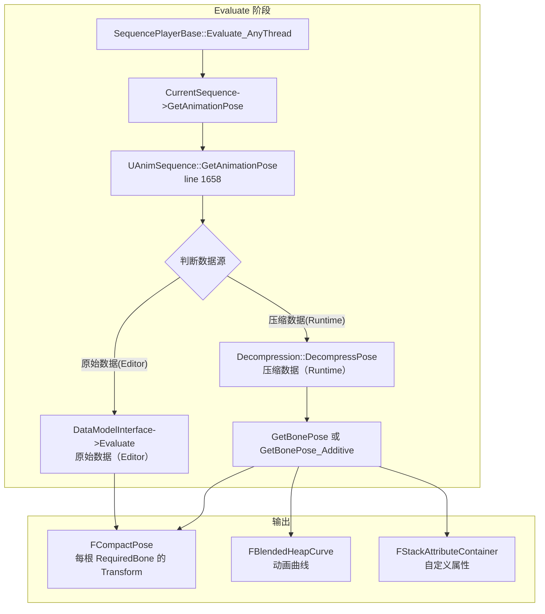
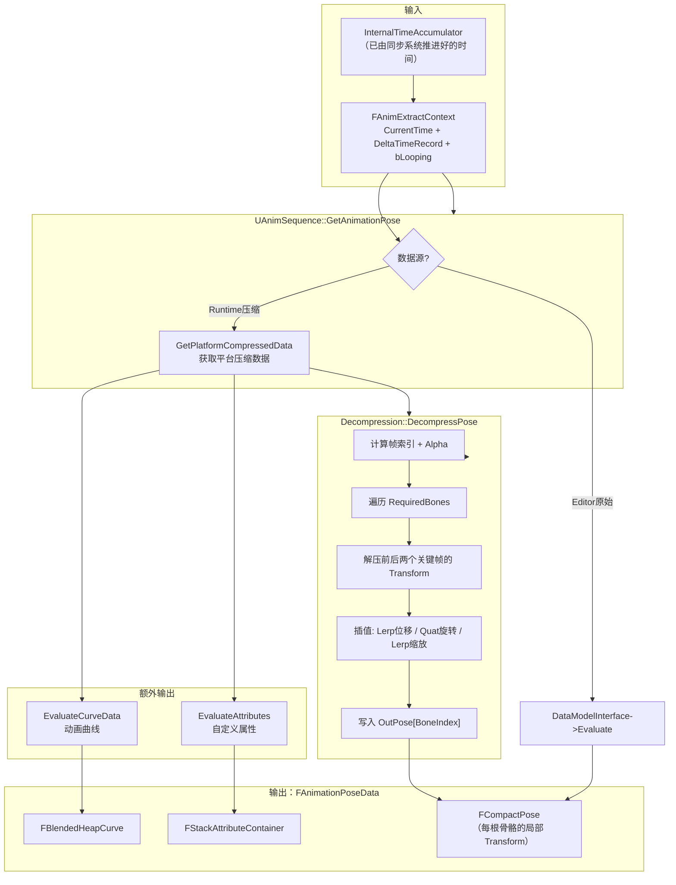

# UE 动画系统：UAnimSequence Pose 采样详解

> 基于 UE 5.7.4 源码。这篇深入回答：`GetAnimationPose` 内部到底做了什么？压缩的动画数据是怎么解压的？关键帧插值怎么实现？Additive 动画怎么处理？RootMotion 怎么提取？

---

## 一、从 Evaluate 到 Pose 的完整链路

先回顾调用链（接上一篇 AnimNode 生命周期文档的末尾）：



**关键**：`GetAnimationPose` 是 UAnimSequence 层面的入口，它分发到两条路径：
- **Editor / 原始数据路径**：`DataModelInterface->Evaluate`（直接读取未压缩的原始骨骼轨道）
- **Runtime / 压缩数据路径**：`Decompression::DecompressPose`（从压缩的 `FCompressedAnimSequence` 解压并插值）

---

## 二、UAnimSequence::GetAnimationPose —— 入口

**源码位置**：`AnimSequence.cpp:1658`

```cpp
void UAnimSequence::GetAnimationPose(FAnimationPoseData& OutAnimationPoseData,
    const FAnimExtractContext& ExtractionContext) const
{
    FCompactPose& OutPose = OutAnimationPoseData.GetPose();

    // ══════ 1. 判断数据源 ══════
    FBoneContainer& RequiredBones = OutPose.GetBoneContainer();
    const bool bUseRawData = ShouldUseRawDataForPoseExtraction_Lockless(RequiredBones, ...);
    const bool bIsBakedAdditive = (!bUseRawData) && IsValidAdditive();

    if (bInvalidSkeleton)
    {
        // 无有效 Skeleton → 输出 RefPose 或 AdditiveIdentity
        bIsBakedAdditive ? OutPose.ResetToAdditiveIdentity() : OutPose.ResetToRefPose();
        return;
    }

    // ══════ 2. 获取平台压缩数据 ══════
    const FCompressedAnimSequence& PlatformCompressedData = GetPlatformCompressedData(ExtractionContext);

    // ══════ 3. 初始化 Pose（RefPose / AdditiveIdentity / RetargetSource） ══════
    if (bIsBakedAdditive)
        OutPose.ResetToAdditiveIdentity();
    else if (bDisableRetargeting)
        // 用 'Retargeting Source' 的 RefPose 初始化
        ...
    else
        OutPose.ResetToRefPose();

    // ══════ 4. 提取 RootMotion Reset（RootBone 锁） ══════
    RootMotionContext.CurrentTime = 0.0;
    FTransform RootTransform = ExtractRootTrackTransform_Lockless(RootMotionContext, &RequiredBones);
    const FRootMotionReset RootMotionReset(bEnableRootMotion, RootMotionRootLock,
        bForceRootLock, RootTransform, bTreatAnimAsAdditive);

#if WITH_EDITOR
    // ══════ 5a. Editor 路径：原始数据 ══════
    if (bUseRawDataForPoseExtraction)
    {
        DataModelInterface->Evaluate(OutAnimationPoseData, EvaluationContext);
        RootMotionReset.ResetRootBoneForRootMotion(OutPose[0], RequiredBones);
        return;
    }
#endif

    // ══════ 5b. Runtime 路径：解压压缩数据 ══════
    if (NumTracks != 0)  // 有骨骼轨道才需要解压
    {
        UE::Anim::Decompression::DecompressPose(OutPose, PlatformCompressedData,
            ExtractionContext, DecompContext, GetRetargetTransforms(), RootMotionReset);
    }

    // ══════ 6. 解压曲线数据 ══════
    EvaluateCurveData_Lockless(OutAnimationPoseData.GetCurve(), ExtractionContext, ...);

    // ══════ 7. 评估自定义属性 ══════
    EvaluateAttributes(OutAnimationPoseData, ExtractionContext, false);
}
```

### 数据源决策

```
原始数据 (bUseRawDataForPoseExtraction = true):
  - 在 Editor 中使用
  - DataModelInterface->Evaluate → 直接读未压缩轨道
  - 用于实时预览和编辑

压缩数据 (bUseRawDataForPoseExtraction = false):
  - 在 Runtime 打包版本中使用
  - Decompression::DecompressPose → 解压 + 插值
  - 所有平台的动画数据在 Cook 时已经被压缩
```

---

## 三、动画数据压缩概述

UE 的动画压缩把原始的关键帧数据转换成运行时高效的压缩格式。关键数据结构：

### 3.1 FCompressedAnimSequence

```cpp
// 每个平台一份压缩数据（Windows/PS5/Xbox等可能有不同的压缩方案）
struct FCompressedAnimSequence
{
    // ★ 压缩后的骨骼轨道数据（二进制 blob）
    TArray<uint8> CompressedByteStream;

    // 压缩数据格式的指针（解压时决定如何解析字节流）
    ICompressedAnimData* CompressedDataStructure;

    // 压缩轨道 → 骨架骨骼 的映射表
    // 例如：压缩轨道0 → 骨架骨骼"LeftUpperArm"
    TArray<FTrackToSkeletonMap> CompressedTrackToSkeletonMapTable;

    // 骨骼轨道数量
    int32 CompressedNumberOfBones;
};
```

### 3.2 压缩轨道 → 骨架映射

动画资产的骨骼轨道索引 ≠ 骨架的骨骼索引。`CompressedTrackToSkeletonMapTable` 建立了映射：

```
压缩轨道 [0] → SkeletonBone[3] (Spine)
压缩轨道 [1] → SkeletonBone[5] (LeftUpperArm)
压缩轨道 [2] → SkeletonBone[6] (LeftLowerArm)
...
```

再经过 `FBoneContainer` → `FCompactPoseBoneIndex` 的映射，最终写入 `FCompactPose` 的对应索引。

### 3.3 压缩数据格式

UE 支持多种压缩编解码器（在 Project Settings → Animation Compression 中配置）：

| 编解码器 | 特点 |
|----------|------|
| **ACL** (Animation Compression Library) | UE 5 默认，基于可变比特率压缩，高质量 |
| **BWT** (UE 自带) | 去量化 + 去除线性键，旧版常用 |

每种编解码器对应一个 `ICompressedAnimData` 子类，负责把 `CompressedByteStream` 解压成 Transform 数据。

---

## 四、UE::Anim::Decompression::DecompressPose —— 解压核心

**源码位置**：`AnimationDecompression.h:15`

```cpp
namespace UE::Anim::Decompression
{
    void DecompressPose(
        FCompactPose& OutPose,                           // 输出 Pose
        const FCompressedAnimSequence& CompressedData,   // 压缩数据
        const FAnimExtractContext& ExtractionContext,     // 采样上下文
        FAnimSequenceDecompressionContext& DecompContext, // 解压上下文
        const TArray<FTransform>& RetargetTransforms,     // Retarget 变换
        const FRootMotionReset& RootMotionReset           // RootMotion 处理
    );
}
```

**内部流程**：

```
DecompressPose
  ├─ 1. 计算时间 → 找到前后两个关键帧
  │     CurrentTime → FrameIndex = floor(Time * FrameRate)
  │     Alpha = (Time - KeyTime0) / (KeyTime1 - KeyTime0)
  │
  ├─ 2. 遍历 RequiredBones 中的每根骨骼：
  │     for each FCompactPoseBoneIndex BoneIndex:
  │       ├─ 查 CompressedTrackToSkeletonMapTable 找对应的压缩轨道
  │       ├─ 从 CompressedByteStream 解压前一个关键帧的 Transform
  │       ├─ 从 CompressedByteStream 解压后一个关键帧的 Transform
  │       ├─ 按 Alpha 插值：
  │       │   位移 = Lerp(T0.Translation, T1.Translation, Alpha)
  │       │   旋转 = Slerp(T0.Rotation, T1.Rotation, Alpha) 或 Lerp(Quat)
  │       │   缩放 = Lerp(T0.Scale3D, T1.Scale3D, Alpha)
  │       └─ OutPose[BoneIndex] = 插值结果
  │
  ├─ 3. 处理 RootMotion（RootBone 的 Transform）
  │     if bEnableRootMotion:
  │       在 RootBone 上应用 RootMotionReset
  │       移除 RootMotion 位移（保留到后续提取）
  │
  └─ 4. 可选：Retarget（把动画从源骨架映射到目标骨架）
```

**关键**：`DecompressPose` 不是简单地解压所有骨骼，而是只解压 `RequiredBones` 中包含的骨骼。这是动画系统的一个重要优化（配合前面说的 RequiredBones 子集）。

---

## 五、FCompactPose —— 紧凑 Pose 数据结构

`FCompactPose` 是骨骼动画采样后的输出容器。它是一个 `TArray<FTransform>`，但索引不是骨架骨骼索引，而是**紧凑骨骼索引**（`FCompactPoseBoneIndex`）。

### 紧凑索引 vs 骨架索引

```
骨架有 200 根骨骼
当前 LOD 只需要 30 根骨骼（RequiredBones）
→ FCompactPose 大小 = 30
→ 压缩轨道 0..29 映射到这 30 个紧凑索引
```

这种"紧凑"表示避免了每帧对 200 根骨骼都分配内存和计算。`FBoneContainer` 负责维护"骨架索引 ↔ 紧凑索引"的双向映射。

### FAnimationPoseData —— Pose + Curve + Attributes

```cpp
struct FAnimationPoseData
{
    FCompactPose& Pose;                    // 骨骼局部变换
    FBlendedHeapCurve& Curve;              // 动画曲线（MorphTarget、材质参数等）
    UE::Anim::FStackAttributeContainer& Attributes; // 自定义属性（UE 5 新增）
};
```

`GetAnimationPose` 同时填充这三个通道，不仅输出骨骼，还输出曲线和属性。

---

## 六、Additive 动画的处理

**源码位置**：`AnimSequence.cpp:1874`

UE 的 Additive 动画分两种：
- **LocalSpaceBase**（`AAT_LocalSpaceBase`）：叠加在 BasePose 的局部空间上
- **MeshSpaceRotation**（`AAT_RotationMeshSpace`）：只在网格空间的旋转上叠加

### GetBonePose_Additive 的处理方式

```cpp
void UAnimSequence::GetBonePose_Additive(...)
{
    // 1. 采样 Additive 动画本身的 Pose（Target Pose）
    GetBonePose(OutAnimationPoseData, ExtractionContext);

    // 2. 采样 Base Pose（RefPose 或指定的 Base 动画）
    GetAdditiveBasePose(BasePoseData, ExtractionContext);

    // 3. 将 Target Pose 转换为相对于 Base Pose 的 Additive 格式
    FAnimationRuntime::ConvertPoseToAdditive(OutPose, BasePose);
    // 内部：OutPose[BoneIndex] = Target[BoneIndex] - Base[BoneIndex]（在局部空间）

    // 4. 曲线也转换为 Additive
    OutCurve.ConvertToAdditive(BaseCurve);
}
```

**关键理解**：Additive 动画存储的是"差值"（Delta），不是绝对姿态。`ConvertPoseToAdditive` 计算每根骨骼的 `TargetTransform - BaseTransform`。

---

## 七、RootMotion 提取

**源码位置**：`AnimSequence.cpp:1821-1844`

```cpp
// 在 GetBonePose 中：
// 1. Time=0 时采样 RootBone（获取 RootMotion 的起点）
RootMotionContext.CurrentTime = 0.0;
FTransform RootTransform = ExtractRootTrackTransform_Lockless(RootMotionContext, &RequiredBones);

// 2. 创建 RootMotionReset：确定了 RootBone 的"参考坐标系"
const FRootMotionReset RootMotionReset(
    bEnableRootMotion,        // 是否启用
    RootMotionRootLock,       // 锁定方式（RefPose / AnimFirstFrame / Zero）
    bForceRootLock,
    RootTransform,            // Time=0 时的 RootTransform
    bTreatAnimAsAdditive
);
```

RootMotion 的提取不是在这里做的。`DecompressPose` 在处理 RootBone 时，`RootMotionReset` 会把 RootBone 的 Transform 分离为"动画姿态"和"根运动量"两部分：
- **动画姿态部分**（留在 `FCompactPose` 中）：RootBone 的旋转（可能还有缩放）
- **根运动部分**（记录到 Context）：RootBone 在 XZ 平面的位移（作为角色移动量）

后续 `AccumulateRootMotion`（在 AnimSync.cpp 中）把这些根运动按权重积累到 `Proxy.ExtractedRootMotion`。

---

## 八、动画曲线的评估

**源码位置**：`AnimSequence.cpp:1860`

```cpp
// 在 GetBonePose 末尾：
EvaluateCurveData_Lockless(OutAnimationPoseData.GetCurve(), ExtractionContext, ...);
```

动画曲线（Animation Curves）存储在动画资产中，每帧可以有浮点值。常见用途：
- **MorphTarget**：驱动面部变形
- **Material Parameter**：驱动材质变化
- **Attribute**：传递自定义浮点值给蓝图

曲线的评估独立于骨骼采样——它有自己的压缩格式和时间轴，在骨骼 Pose 计算完后单独评估。

---

## 九、FAnimExtractContext —— 采样上下文

```cpp
struct FAnimExtractContext
{
    double CurrentTime;                        // 采样时间点
    bool bExtractRootMotion;                   // 是否提取 RootMotion
    const FDeltaTimeRecord* DeltaTimeRecord;   // 时间推进记录（Notify 判断用）
    bool bLooping;                             // 是否循环
    // ...更多标记位
};
```

**`CurrentTime` vs `DeltaTimeRecord`**：
- `CurrentTime`：在哪一个时间点采样（用于定位关键帧）
- `DeltaTimeRecord`：从上一帧到这一帧推进了多少时间和经过了哪些位置（用于判断"这段区间内有没有 Notify 需要触发"）

---

## 十、完整小结：从时间到 Pose



---

## 十一、和第一篇 AnimNode 生命周期的衔接

```
FAnimNode_SequencePlayerBase::Evaluate_AnyThread     ← 第一篇文档
  │
  └─ CurrentSequence->GetAnimationPose(...)           ← 本文档
       │
       └─ GetBonePose → DecompressPose                ← 本文档
            │
            └─ 遍历 RequiredBones
                 └─ 解压 + 插值 → FTransform
                      └─ 写入 FCompactPose
```

**一句话**：AnimNode 负责"在什么时候采样"，UAnimSequence 负责"怎么从压缩数据中提取那个时间点的骨骼姿态"。

---

## 十二、关键源码文件索引

| 文件 | 行号 | 内容 |
|------|------|------|
| `AnimSequence.cpp` | 1658-1872 | `GetAnimationPose` — 入口 |
| `AnimSequence.cpp` | 1731-1872 | `GetBonePose` — 骨骼 Pose 采样 |
| `AnimSequence.cpp` | 1874-1905 | `GetBonePose_Additive` — Additive 动画 |
| `AnimationDecompression.h` | 13-20 | `DecompressPose` — 解压接口 |
| `AnimCompressionTypes.h` | — | 压缩数据类型定义 |
| `AnimSequenceBase.cpp` | 500-560 | `TickAssetPlayer` — 推进时间 |
| `BonePose.h` | 346-353 | `FCompactPose` |
| `AnimationAsset.h` | 97-117 | `FDeltaTimeRecord` |
| `AnimationAsset.h` | 849-908 | `FAnimAssetTickContext` — Tick 上下文 |
