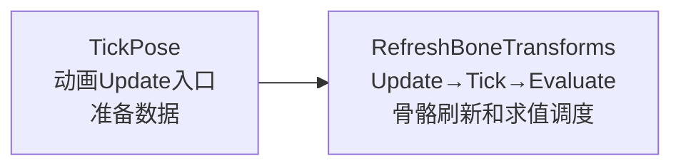
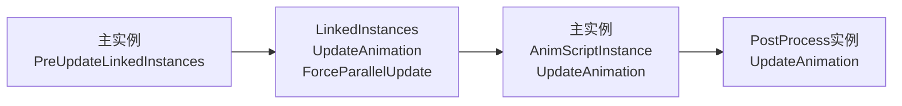
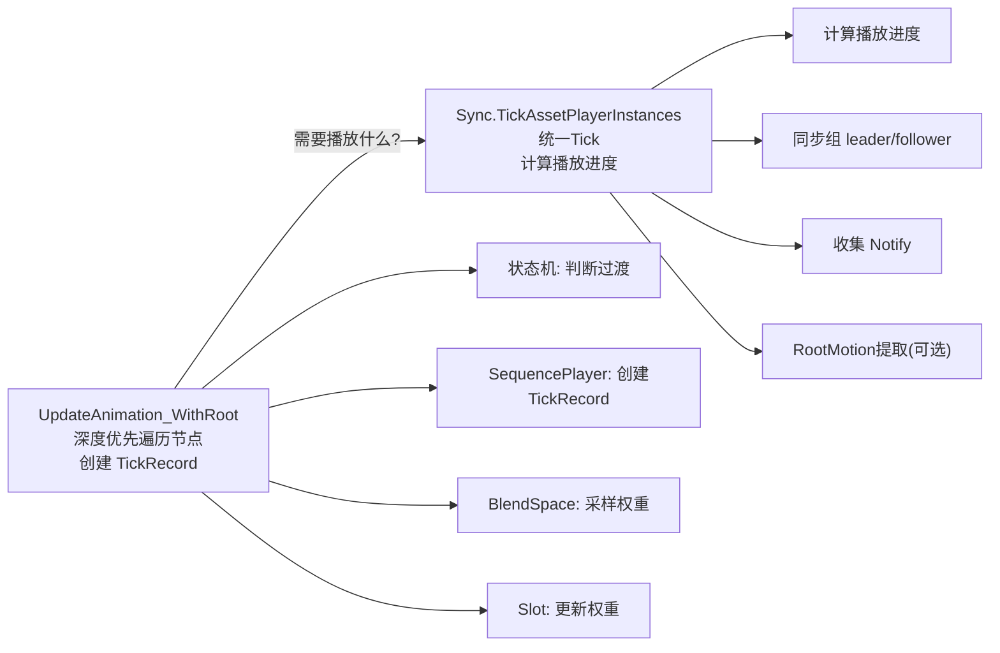
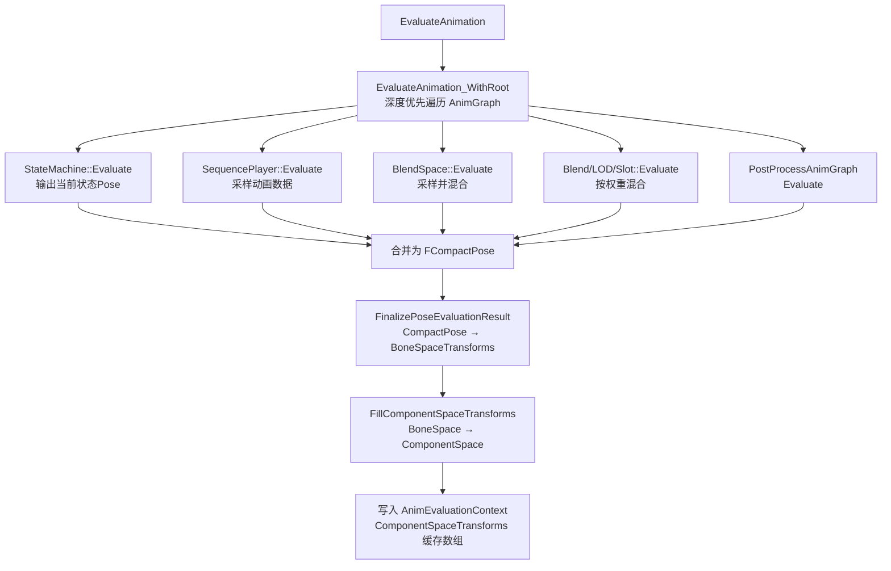
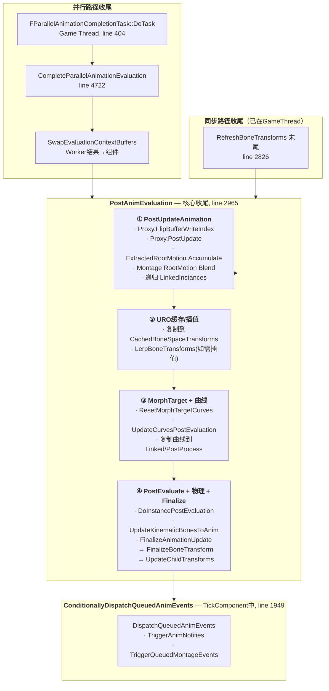
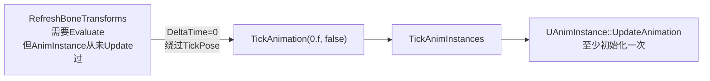

# 动画蓝图中的动画更新流程

> 一、先搞清楚几个基本概念

在读源码之前，需要先理解 UE 动画系统的线程模型。

### Game Thread（游戏主线程）

UE 中大部分 UObject / Actor / Component 的逻辑都在这个线程上跑。**为什么很多东西必须在 Game Thread？** 因为 UObject、AActor、UActorComponent、Blueprint 变量、World 这些对象不是线程安全的，多线程同时读写会导致数据竞争。所以 UE 规定 UObject 相关操作主要在 Game Thread 上做。

动画系统中 Game Thread 负责的典型工作：
- `NativeUpdateAnimation` / `BlueprintUpdateAnimation`（可能访问 CharacterMovement、Actor 等）
- Montage 播放状态管理
- AnimNotify 派发
- 组件状态读写

### Worker Thread（后台工作线程）

UE 有 Task Graph 任务系统，可以把耗时计算丢给 worker thread 并行执行。**Worker Thread 是帮 Game Thread 分担计算任务的后台线程，不能随意触碰 UObject。**

动画系统中 Worker Thread 负责的典型工作：
- AnimGraph 节点的 Update（状态机、Blend 权重等）
- AnimGraph 节点的 Evaluate（采样动画、计算 Pose）

### Proxy 层（FAnimInstanceProxy）

这是理解 UE 并行动画系统的关键。

`UAnimInstance` 是 UObject，主要只能安全地在 Game Thread 上访问。但动画图计算很耗时，UE 希望它能在 Worker Thread 上跑。所以 UE 引入了 `FAnimInstanceProxy`——它是 `UAnimInstance` 的线程友好代理，内部持有 AnimGraph 的根节点引用和运行时数据，可以被并行任务安全读写。

可以这样理解：

> **UAnimInstance** = 办公室里的正式档案（Game Thread 管）
> **FAnimInstanceProxy** = 给后台计算人员准备的工作副本（Worker Thread 安全）

Game Thread 在 `UAnimInstance::UpdateAnimation` 中把蓝图变量、Montage 状态等数据同步到 Proxy，之后 Worker Thread 就可以通过 Proxy 独立完成 AnimGraph 的 Update 和 Evaluate。

### Update 和 Evaluate 的区别

这是动画系统中最重要的两个阶段，很容易混淆：

| | **Update** | **Evaluate** |
|---|---|---|
| **目的** | 推进动画图**状态** | 计算最终骨骼 **Pose** |
| **核心调用** | `FAnimInstanceProxy::UpdateAnimation` | `EvaluateAnimation` → `EvaluateAnimation_WithRoot` |
| **节点函数** | `FAnimNode_*::Update_AnyThread` | `FAnimNode_*::Evaluate_AnyThread` |
| **具体做什么** | 推进时间、判断状态机过渡、计算 Blend 权重、为 SequencePlayer 创建 TickRecord | 采样 AnimSequence、混合多个 Pose、输出骨骼 Transform |
| **回答的问题** | "这一帧动画图应该处在什么状态？" | "最终每根骨骼的 Transform 是什么？" |

**一个具体例子**：角色从 Idle 过渡到 Walk：

- **Update 阶段**：读取 Speed=350，状态机判断 Idle→Walk 过渡，过渡权重推进到 0.25，推进 Walk 序列播放时间
- **Evaluate 阶段**：采样 Idle Pose，采样 Walk Pose，按 0.25 权重混合，输出最终骨骼 Transform

---

## 二、一帧动画更新的大体流程

本文默认**多线程模式**下的动画更新流程。大致分为以下阶段：

1. **TickPose（主线程）**：从 `USkeletalMeshComponent::TickComponent` 出发，调用 `UAnimInstance::UpdateAnimation`，主要处理 ABP 的 EventGraph 数据拷贝等预先数据处理
2. **Update 和 Tick（可并行）**：从 AnimGraph 根节点深度优先遍历，判断需要执行的动画节点、更新权重、收集 Notify；对于资产播放器类节点，调用 `Update_AnyThread` 创建 TickRecord；然后统一 Tick 计算播放进度
3. **Evaluate（可并行）**：同样从根节点遍历，递归计算最终 Pose
4. **AnimationCompletion（主线程）**：工作线程任务完成后，交换 buffer，把算出来的参数写回 SkeletalMeshComponent，处理 Notify、RootMotion 等收尾

```mermaid
flowchart TB
    subgraph GT1["<b>Game Thread</b>（主线程准备）"]
        TC["TickComponent"]
        TP["TickPose"]
        TA["TickAnimation<br/>RecalcRequiredBones"]
        TAI["TickAnimInstances"]
        UPD["UAnimInstance::UpdateAnimation"]
        MONT["UpdateMontage"]
        NATIVE["NativeUpdateAnimation"]
        BP["BlueprintUpdateAnimation<br/>（ABP EventGraph 数据拷贝）"]
    end

    subgraph GT2["<b>Game Thread</b>（求值调度）"]
        RBT["RefreshBoneTransforms<br/>决策: 是否Evaluate/并行/缓存"]
        PREP["填充 AnimEvaluationContext"]
        DISP["DispatchParallelEvaluationTasks<br/>SwapBuffer + 创建TaskGraph"]
    end

    subgraph WT["<b>Worker Thread</b>（并行动画求值）"]
        EVAL_TASK["FParallelAnimationEvaluationTask"]
        PAE["ParallelAnimationEvaluation"]
        PAP["PerformAnimationProcessing"]
        U_PHASE["<b>Update 阶段</b><br/>Proxy::UpdateAnimation<br/>AnimGraph 节点 Update_AnyThread<br/>Sync.TickAssetPlayerInstances"]
        E_PHASE["<b>Evaluate 阶段</b><br/>EvaluateAnimation<br/>采样动画 + 混合 Pose<br/>CompactPose → BoneSpace → ComponentSpace"]
    end

    subgraph GT3["<b>Game Thread</b>（收尾提交）"]
        COMP_TASK["FParallelAnimationCompletionTask"]
        CAE["CompleteParallelAnimationEvaluation"]
        SWAP["SwapEvaluationContextBuffers<br/>Worker Thread 结果交换回组件"]
        POST["PostAnimEvaluation"]
        POST_UPDATE["PostUpdateAnimation<br/>RootMotion / Notify 派发"]
    end

    TC --> TP --> TA --> TAI --> UPD
    UPD --> MONT --> NATIVE --> BP
    BP --> RBT --> PREP --> DISP
    DISP --> EVAL_TASK --> PAE --> PAP
    PAP --> U_PHASE --> E_PHASE
    E_PHASE --> COMP_TASK --> CAE --> SWAP --> POST --> POST_UPDATE
```



---

## 三、万物之源：USkeletalMeshComponent::TickComponent

**源码文件**：`Engine/Source/Runtime/Engine/Private/Components/SkeletalMeshComponent.cpp:1866`

`USkeletalMeshComponent::TickComponent` 是整个动画更新流程的起点。它会先 `Super::TickComponent`，然后先后调用 **TickPose** 和 **RefreshBoneTransforms**：

```cpp
// 在 USkinnedMeshComponent::TickComponent 中：
if (ShouldTickPose())
{
    TickPose(DeltaTime, false);
}

if (ShouldUpdateTransform(bLODHasChanged))
{
    if (LeaderPoseComponent.IsValid())
        UpdateFollowerComponent();
    else 
        RefreshBoneTransforms(ThisTickFunction);
}
```

这一段的调用关系是最主要的链路：



接下来我们从 TickPose 和 RefreshBoneTransforms 分别展开。

---

## 四、TickPose：动画 Update 的入口

**源码位置**：`SkeletalMeshComponent.cpp:1773`

> **注意**：TickPose 这个名字有点误导——它并不是真正去计算 Pose，而是**动画 Update 的入口**，主要职责是预先准备数据。

### 4.1 逐段讲解

```cpp
void USkeletalMeshComponent::TickPose(float DeltaTime, bool bNeedsValidRootMotion)
{
    Super::TickPose(DeltaTime, bNeedsValidRootMotion);  // 父类前置处理

    if (ShouldTickAnimation())    // 判断本帧是否要 Tick 动画
    {
        // 记录本帧姿态 Tick 的帧号（防止同一帧重复更新）
        LastPoseTickFrame = static_cast<uint32>(GFrameCounter);

        // 决定动画更新的 DeltaTime
        float DeltaTimeForTick;
        if (bExternalTickRateControlled)
        {
            // 情况1：外部系统控制 Tick 速率
            DeltaTimeForTick = ExternalDeltaTime;
        }
        else if (ShouldUseUpdateRateOptimizations())
        {
            // 情况2：URO 跳帧优化，补回跳过的时间
            DeltaTimeForTick = DeltaTime + AnimUpdateRateParams->GetTimeAdjustment();
        }
        else
        {
            // 情况3：普通每帧更新
            DeltaTimeForTick = DeltaTime;
        }

        TickAnimation(DeltaTimeForTick, bNeedsValidRootMotion);  // 核心
    }
    else if (!bExternalTickRateControlled)
    {
        // URO 跳帧：通知所有 AnimInstance 本帧被跳过
        AnimScriptInstance->OnUROSkipTickAnimation();
        for (auto* LinkedInstance : LinkedInstances)
            LinkedInstance->OnUROSkipTickAnimation();
        if (PostProcessAnimInstance)
            PostProcessAnimInstance->OnUROSkipTickAnimation();
    }
}
```

**关键点**：

- `ShouldTickAnimation()` 受可见性、URO、暂停、LOD 等多种因素影响——如果不 Tick，就通知 AnimInstance 本帧被跳过
- DeltaTime 有三种计算路径：外部控制 / URO 补时间 / 普通。URO 下跳过的帧会在下一次更新时把时间补回来，保证动画播放速度不慢
- 真正的动画更新在 `TickAnimation` 里发生

### 4.2 BlueprintUpdateAnimation

`TickPose` 最终会走到 `UAnimInstance::UpdateAnimation`，在其中调用 `BlueprintUpdateAnimation`。这就是 ABP 的 **Event Graph（事件图表）**——UE 在这里执行用户在动画蓝图的 EventGraph 中写的逻辑，从 Game Thread 上做数据拷贝（比如从 CharacterMovement 读速度、从 Actor 读状态），把结果写入 AnimInstance 的变量，供后续 AnimGraph 使用。

> **一句话**：TickPose 是主线程准备用户定义的需要读取的数据，也就是**数据拷贝**阶段。

---

## 五、TickAnimation → TickAnimInstances

### 5.1 TickAnimation

**源码位置**：`SkeletalMeshComponent.cpp:1559`

```cpp
void USkeletalMeshComponent::TickAnimation(float DeltaTime, bool bNeedsValidRootMotion)
{
    if (!bEnableAnimation)
        return;

    // 1. 确保 RequiredBones 是最新的
    if (!bRequiredBonesUpToDate)
        RecalcRequiredBones(GetPredictedLODLevel());
    else if (!AreRequiredCurvesUpToDate())
        RecalcRequiredCurves();

    // 2. 编辑器保护：如果 SkeletalMesh 正在编译，跳过
    // ...

    // 3. 标记：本轮动画更新后将产生需要派发的动画事件
    bNeedsQueuedAnimEventsDispatched = true;

    // 4. 核心：更新所有动画实例
    TickAnimInstances(DeltaTime, bNeedsValidRootMotion);
}
```

**逐段解释**：

- **RequiredBones**：当前 LOD 下动画系统真正需要处理的骨骼集合（全量骨骼的子集）。不同 LOD 使用不同骨骼数，远处角色可能不需要手指、脸部等细节骨骼。`RecalcRequiredBones` 根据预测的 LOD 级别重新计算本帧需要参与动画的骨骼
- **RequiredCurves**：动画曲线（Morph Target、Material Parameter、Attribute 等）的子集，同理按需计算
- **`bNeedsQueuedAnimEventsDispatched = true`**：告诉系统"本轮动画更新后有派发事件的责任"——因为 AnimNotify、Montage 事件不是立刻触发的，而是先排队，稍后在安全阶段统一派发

### 5.2 TickAnimInstances

**源码位置**：`SkeletalMeshComponent.cpp:1618`

这个函数负责把 DeltaTime 传给 SkeletalMeshComponent 上的各类 UAnimInstance。**它本身不计算骨骼矩阵，只是更新动画实例状态，并为后续并行求值准备代理数据。**

```cpp
void USkeletalMeshComponent::TickAnimInstances(float DeltaTime, bool bNeedsValidRootMotion)
{
    // 1. 主实例预处理 Linked Instances
    if (AnimScriptInstance != nullptr)
        AnimScriptInstance->PreUpdateLinkedInstances(DeltaTime * GlobalAnimRateScale);

    // 2. 先更新 Linked Instances（强制并行更新模式）
    for (UAnimInstance* LinkedInstance : LinkedInstances)
    {
        LinkedInstance->UpdateAnimation(
            DeltaTime * GlobalAnimRateScale,
            false,  // 不负责 RootMotion
            UAnimInstance::EUpdateAnimationFlag::ForceParallelUpdate
        );
    }

    // 3. 更新主动画实例（传入 bNeedsValidRootMotion）
    if (AnimScriptInstance != nullptr)
        AnimScriptInstance->UpdateAnimation(
            DeltaTime * GlobalAnimRateScale, bNeedsValidRootMotion);

    // 4. 更新 PostProcess 实例（不负责 RootMotion）
    if (ShouldUpdatePostProcessInstance())
        PostProcessAnimInstance->UpdateAnimation(
            DeltaTime * GlobalAnimRateScale, false);
}
```

**执行顺序为什么是这样？**



1. 主实例先 `PreUpdateLinkedInstances`：让 Linked Instances 能拿到正确上下文
2. Linked Instances 先于主实例更新：确保 Root Motion 或非线程更新路径下 proxy 初始化正确
3. 主实例负责核心动画逻辑和 RootMotion
4. PostProcess 最后更新：因为它依附于主动画结果做后处理（IK 修正、骨骼后处理、Control Rig 等）

**几个关键细节**：

- 所有实例的 DeltaTime 都乘了 `GlobalAnimRateScale`，组件级动画播放速率统一影响所有实例
- 只有主实例拿到 `bNeedsValidRootMotion`，Linked 和 PostProcess 都传 `false`——RootMotion 的主要责任在主实例
- Linked Instances 被强制 `ForceParallelUpdate`，这意味着它们的 AnimGraph Update 不会在 `UpdateAnimation` 里立即执行，而是留给后续并行任务统一处理

---

## 六、UAnimInstance::UpdateAnimation —— Game Thread 上的实例更新

**源码位置**：`AnimInstance.cpp:512`

这是 Game Thread 上动画更新的核心函数。它的职责是：**更新 Montage、执行 NativeUpdate / BlueprintUpdate、准备 Proxy 数据，并决定是否立即执行 AnimGraph Update。**

```cpp
void UAnimInstance::UpdateAnimation(float DeltaSeconds, bool bNeedsValidRootMotion,
    EUpdateAnimationFlag UpdateFlag)
{
    FAnimInstanceProxy& Proxy = GetProxyOnGameThread<FAnimInstanceProxy>();

    // 1. 应用待处理的物理重置
    if (PendingDynamicResetTeleportType != ETeleportType::None)
    {
        Proxy.ResetDynamics(PendingDynamicResetTeleportType);
    }

    // 2. 特殊模式：只 Tick Montage（不更新 AnimGraph）
    if (SkelMeshComp->ShouldOnlyTickMontages(DeltaSeconds))
    {
        ClearQueuedAnimEvents(true);
        Proxy.ResetUpdateCounter();
        UpdateMontage(DeltaSeconds);
        return;   // 不继续后续流程！
    }

    // 3. PreUpdate：标记 bNeedsUpdate = true，清理 Notify 队列等
    PreUpdateAnimation(DeltaSeconds);

    // 4. Montage 三连：更新播放 → 同步组 → 评估数据
    UpdateMontage(DeltaSeconds);
    UpdateMontageSyncGroup();
    UpdateMontageEvaluationData();

    // 5. AnimSubsystem PreUpdate 回调

    // 6. ★★★ NativeUpdateAnimation ★★★
    NativeUpdateAnimation(DeltaSeconds);    // C++ 覆写

    // 7. ★★★ BlueprintUpdateAnimation ★★★
    BlueprintUpdateAnimation(DeltaSeconds); // ABP EventGraph

    // 8. AnimSubsystem PostUpdate 回调

    // 9. 决定是否立即执行 Proxy 层 AnimGraph Update
    const bool bWantsImmediateUpdate = NeedsImmediateUpdate(DeltaSeconds, bNeedsValidRootMotion);
    bool bShouldImmediateUpdate = bWantsImmediateUpdate;

    switch (UpdateFlag)
    {
        case EUpdateAnimationFlag::ForceParallelUpdate:
            bShouldImmediateUpdate = false;   // ← Linked Instances 走这里
            break;
    }

    if (bShouldImmediateUpdate)
    {
        ParallelUpdateAnimation();   // → Proxy.UpdateAnimation()
        PostUpdateAnimation();
    }
    // 否则：AnimGraph Update 留给后续并行任务
}
```

### 6.1 这段代码的关键设计

**它分了两层 Update**：

| 层次 | 函数 | 线程 | 职责 |
|------|------|------|------|
| 实例层 | `NativeUpdateAnimation` / `BlueprintUpdateAnimation` | **Game Thread** | 从外部读取数据（CharacterMovement、Actor），写入 AnimInstance 变量 |
| 代理层 | `ParallelUpdateAnimation` → `FAnimInstanceProxy::UpdateAnimation` | **Game Thread 或 Worker Thread** | 驱动 AnimGraph 节点（状态机、Sequence 时间、Blend 权重） |

**为什么需要分两层？**

`NativeUpdateAnimation` / `BlueprintUpdateAnimation` 可能访问 `TryGetPawnOwner()`、`GetWorld()`、`CharacterMovementComponent` 等 UObject，这些**不适合放到 Worker Thread**（会有线程安全问题）。所以 UE 的设计是：

1. Game Thread 上先把需要的数据准备好，拷贝到 Proxy
2. Proxy 层 AnimGraph Update 可以在 Worker Thread 安全执行（只读 Proxy 中已准备好的数据）

### 6.2 ForceParallelUpdate 的含义

Linked Instances 被传入 `ForceParallelUpdate`，进入 `UpdateAnimation` 后：

```cpp
case EUpdateAnimationFlag::ForceParallelUpdate:
    bShouldImmediateUpdate = false;  // 不立即执行 Proxy Update
```

所以 Linked Instance 在本函数中只做 Montage / NativeUpdate / BlueprintUpdate，它的 AnimGraph Update **延迟到后续并行动画任务中统一执行**。这保证了 proxy 初始化的正确性，也避免了在主实例之前过早执行。

### 6.3 NeedsImmediateUpdate 的判断条件

`bWantsImmediateUpdate` 由 `NeedsImmediateUpdate()` 决定（`AnimInstance.cpp:835`），以下情况会要求**立即在 Game Thread 执行**：

- `RootMotionMode == RootMotionFromEverything` 且需要有效 RootMotion
- `CanRunParallelWork() == false`（动画蓝图或节点不支持并行）
- 多线程动画更新被全局禁用（`bAllowMultiThreadedAnimationUpdate == false`）

---

## 七、RefreshBoneTransforms —— 绝对的求值调度核心

**源码位置**：`SkeletalMeshComponent.cpp:2656`

如果说 TickPose 是"更新动画状态、准备数据"，那 `RefreshBoneTransforms` 就是 **Update → Tick → Evaluate 的调度中心**。

### 7.1 前置概念：RequiredBones 和 AnimEvaluationContext

**RequiredBones**：全量骨骼的子集。在进入工作线程之前，先更新当前帧需要参与计算的骨骼集合和曲线集合，这是 UE 动画更新的重要优化手段——避免每帧对全部骨骼做计算。

**AnimEvaluationContext**（`FAnimationEvaluationContext`）：SkeletalMeshComponent 的一个属性，缓存工作线程上动画解算过程中需要访问的属性。它就像一份"任务说明书"，Worker Thread 通过它读取所需数据，计算完成后也通过它返回结果。关键字段：

```cpp
struct FAnimationEvaluationContext
{
    const USkeletalMesh* SkeletalMesh;
    UAnimInstance* AnimInstance;
    UAnimInstance* PostProcessAnimInstance;

    bool bDoEvaluation;       // 是否真正 Evaluate
    bool bDoInterpolation;    // 是否做插值
    bool bForceRefPose;       // 是否强制参考姿态

    // 评估结果缓冲区
    TArray<FTransform> ComponentSpaceTransforms;
    TArray<FTransform> BoneSpaceTransforms;
    // 缓存（URO 跳帧用）
    TArray<FTransform> CachedComponentSpaceTransforms;
    TArray<FTransform> CachedBoneSpaceTransforms;
    // ...
};
```

### 7.2 逐段讲解

```cpp
void USkeletalMeshComponent::RefreshBoneTransforms(FActorComponentTickFunction* TickFunction)
{
    check(IsInGameThread());  // 必须从 Game Thread 调用

    // ═══════════════ 阶段1：基础检查 ═══════════════
    if (!GetSkeletalMeshAsset() || GetNumComponentSpaceTransforms() == 0)
        return;

    // 确保 RequiredBones / RequiredCurves 是最新的
    if (!bRequiredBonesUpToDate)
        RecalcRequiredBones(GetPredictedLODLevel());
    else if (!AreRequiredCurvesUpToDate())
        RecalcRequiredCurves();

    // ═══════════════ 阶段2：决策 - 求值策略 ═══════════════
    // 是否启用 Evaluation Rate Optimization（URO 的求值层优化）
    const bool bDoEvaluationRateOptimization = ...;

    // 本帧是否要真正 Evaluate？
    const bool bShouldDoEvaluation =
        !bDoEvaluationRateOptimization      // 没开启优化 → 必须 Evaluate
        || bInvalidCachedBones              // 缓存失效 → 必须 Evaluate
        || bInvalidCachedCurve              // 曲线缓存失效
        || (bExternalTickRateControlled && bExternalUpdate)
        || (bCachedShouldUseUpdateRateOptimizations
            && !AnimUpdateRateParams->ShouldSkipEvaluation());

    // 跳过的帧是否做插值？
    const bool bShouldDoInterpolation = ...;

    // ═══════════════ 阶段3：决策 - 是否可以并行 ═══════════════
    const bool bDoPAE =
        !!CVarUseParallelAnimationEvaluation.GetValueOnGameThread()
        && FApp::ShouldUseThreadingForPerformance();

    const bool bDoParallelEvaluation =
        bHasValidInstanceForParallelWork
        && bDoPAE
        && (bShouldDoEvaluation || bShouldDoParallelInterpolation)
        && TickFunction && TickFunction->IsCompletionHandleValid();

    // ═══════════════ 阶段4：处理已有并行任务 ═══════════════
    const bool bBlockOnTask = !bDoParallelEvaluation;
    if (HandleExistingParallelEvaluationTask(bBlockOnTask, true))
        return;  // 已有任务已处理完成

    // ═══════════════ 阶段5：填充 AnimEvaluationContext ═══════════════
    AnimEvaluationContext.SkeletalMesh = GetSkeletalMeshAsset();
    AnimEvaluationContext.AnimInstance = AnimScriptInstance;
    AnimEvaluationContext.bDoEvaluation = bShouldDoEvaluation;
    AnimEvaluationContext.bDoInterpolation = bShouldDoInterpolation;
    AnimEvaluationContext.bForceRefPose = bForceRefpose;
    // ... 缓存策略等

    // ═══════════════ 阶段6：求值前准备 ═══════════════
    if (bShouldDoEvaluation)
    {
        DoInstancePreEvaluation();

        // 保护：如果 AnimInstance 从未 Update 过，强制补一次
        if (AnimScriptInstance && !AnimScriptInstance->NeedsUpdate()
            && !AnimScriptInstance->GetUpdateCounter().HasEverBeenUpdated())
        {
            TickAnimation(0.f, false);  // 绕过 TickPose，避免被 URO 拦截
        }
    }

    // ═══════════════ 阶段7：执行（三种路径） ═══════════════
    if (bDoParallelEvaluation)
    {
        // 路径A：并行 → 派发 Task Graph 任务
        DispatchParallelEvaluationTasks(TickFunction);
    }
    else if (AnimEvaluationContext.bDoEvaluation || AnimEvaluationContext.bDoInterpolation)
    {
        // 路径B：同步求值 → Game Thread 直接执行
        DoParallelEvaluationTasks_OnGameThread();
    }
    else
    {
        // 路径C：跳过求值 → 从缓存拷贝
        // Copy CachedBoneSpaceTransforms → BoneSpaceTransforms
        // Copy CachedComponentSpaceTransforms → ComponentSpaceTransforms
        // 必要时补 ParallelUpdateAnimation（AnimGraph 状态更新）
    }

    // 同步路径最后：提交结果（并行路径的提交由 CompleteParallelAnimationEvaluation 完成）
    PostAnimEvaluation(AnimEvaluationContext);
    AnimEvaluationContext.Clear();
}
```

### 7.3 三种执行路径总结

| 路径 | 条件 | 谁执行 | 说明 |
|------|------|--------|------|
| **A. 并行** | `bDoParallelEvaluation == true` | Worker Thread | 派发 Task Graph，结果由 Completion Task 收尾 |
| **B. 同步求值** | 不能并行但需要 Evaluate/Interpolate | Game Thread | `DoParallelEvaluationTasks_OnGameThread` |
| **C. 跳过** | URO 跳帧且缓存有效 | Game Thread | 只拷贝缓存，不重新算 Pose |

---

## 八、并行路径：DispatchParallelEvaluationTasks → Task Graph

**源码位置**：`SkeletalMeshComponent.cpp:2855`

```cpp
void USkeletalMeshComponent::DispatchParallelEvaluationTasks(FActorComponentTickFunction* TickFunction)
{
    SwapEvaluationContextBuffers();  // ★ 交换 Context buffer 和组件 buffer

    // 创建两个 Task Graph 任务：
    // 任务1：在 Worker Thread 执行动画求值
    ParallelAnimationEvaluationTask = TGraphTask<FParallelAnimationEvaluationTask>
        ::CreateTask().ConstructAndDispatchWhenReady(this);

    // 任务2：等任务1完成后，在 Game Thread 执行收尾
    FGraphEventArray Prerequistes;
    Prerequistes.Add(ParallelAnimationEvaluationTask);
    FGraphEventRef TickCompletionEvent = TGraphTask<FParallelAnimationCompletionTask>
        ::CreateTask(&Prerequistes).ConstructAndDispatchWhenReady(this);

    // 确保 Tick 完成前动画结果已写回
    TickFunction->GetCompletionHandle()->DontCompleteUntil(TickCompletionEvent);
}
```

### 8.1 两个 Task 的线程分配

- **`FParallelAnimationEvaluationTask`**（line 323）：`GetDesiredThread()` 返回 `CPrio_ParallelAnimationEvaluationTask`，即 **Worker Thread**。其 `DoTask` 中调用 `Comp->ParallelAnimationEvaluation()`
- **`FParallelAnimationCompletionTask`**（line 377）：`GetDesiredThread()` 返回 `ENamedThreads::GameThread`，即 **Game Thread**。其 `DoTask` 中调用 `Comp->CompleteParallelAnimationEvaluation(true)`

### 8.2 SwapEvaluationContextBuffers —— Buffer 交换机制

**源码位置**：`SkeletalMeshComponent.cpp:2837`

```cpp
void USkeletalMeshComponent::SwapEvaluationContextBuffers()
{
    Exchange(AnimEvaluationContext.ComponentSpaceTransforms, GetEditableComponentSpaceTransforms());
    Exchange(AnimEvaluationContext.BoneSpaceTransforms, BoneSpaceTransforms);
    Exchange(AnimEvaluationContext.CachedComponentSpaceTransforms, CachedComponentSpaceTransforms);
    Exchange(AnimEvaluationContext.CachedBoneSpaceTransforms, CachedBoneSpaceTransforms);
    Exchange(AnimEvaluationContext.Curve, AnimCurves);
    Exchange(AnimEvaluationContext.CachedCurve, CachedCurve);
    Exchange(AnimEvaluationContext.CustomAttributes, CustomAttributes);
    Exchange(AnimEvaluationContext.CachedCustomAttributes, CachedAttributes);
    // ...
}
```

这个函数在派发任务前和完成任务后各调用一次：

1. **派发前 Swap**：组件 buffer 变成空的，Context buffer 拿到上一帧的数据作为输入
2. **完成后 Swap**：把 Worker Thread 写入 Context buffer 的结果交换回组件 buffer

这样设计的好处是：Worker Thread 写入 Context 的 buffer，Game Thread 从组件的 buffer 读取，两边互不干扰。

---

## 九、PerformAnimationProcessing —— Update + Evaluate 的真正执行

**源码位置**：`SkeletalMeshComponent.cpp:2349`

`ParallelAnimationEvaluation()` 调用 `PerformAnimationProcessing`，这是动画求值任务里真正干活的函数：

```cpp
void USkeletalMeshComponent::PerformAnimationProcessing(
    const USkeletalMesh* InSkeletalMesh, UAnimInstance* InAnimInstance,
    bool bInDoEvaluation, ...,
    TArray<FTransform>& OutSpaceBases,        // 输出：组件空间骨骼变换
    TArray<FTransform>& OutBoneSpaceTransforms, // 输出：骨骼空间变换
    FVector& OutRootBoneTranslation,           // 输出：RootBone 位移
    FBlendedHeapCurve& OutCurve,               // 输出：动画曲线
    UE::Anim::FMeshAttributeContainer& OutAttributes) // 输出：自定义属性
{
    // ═══════════ Update 阶段 ═══════════
    if (InAnimInstance && InAnimInstance->NeedsUpdate())
        InAnimInstance->ParallelUpdateAnimation();  // → Proxy.UpdateAnimation()

    if (ShouldPostUpdatePostProcessInstance())
        PostProcessAnimInstance->ParallelUpdateAnimation();

    // ═══════════ Evaluate 阶段 ═══════════
    if (bInDoEvaluation && OutSpaceBases.Num() > 0)
    {
        FCompactPose EvaluatedPose;

        // 1. 主 AnimGraph Evaluate
        EvaluateAnimation(InSkeletalMesh, InAnimInstance, ...,
            OutRootBoneTranslation, OutCurve, EvaluatedPose, Attributes);

        // 2. PostProcess AnimGraph Evaluate
        EvaluatePostProcessMeshInstance(OutBoneSpaceTransforms,
            EvaluatedPose, OutCurve, InSkeletalMesh, ...);

        // 3. Finalize：CompactPose → BoneSpaceTransforms → ComponentSpaceTransforms
        FinalizePoseEvaluationResult(InSkeletalMesh,
            OutBoneSpaceTransforms, OutRootBoneTranslation, EvaluatedPose);

        InSkeletalMesh->FillComponentSpaceTransforms(
            OutBoneSpaceTransforms, FillComponentSpaceTransformsRequiredBones, OutSpaceBases);
    }
}
```

---

## 十、FAnimInstanceProxy::UpdateAnimation —— AnimGraph 节点 Update

**源码位置**：`AnimInstanceProxy.cpp:1222`

```cpp
void FAnimInstanceProxy::UpdateAnimation()
{
    FAnimationUpdateContext Context(this, CurrentDeltaSeconds, &SharedContext);

    // 设置根节点为 AnimGraph 的输出节点
    Context.SetNodeId(AnimClassInterface->GetAnimBlueprintFunctions()[0].OutputPoseNodeIndex);

    // ★ 核心1：深度优先遍历 AnimGraph，从 RootNode 开始 Update
    UpdateAnimation_WithRoot(Context, RootNode, NAME_AnimGraph);

    // ★ 核心2：统一 Tick 所有资产播放器实例
    Sync.TickAssetPlayerInstances(*this, CurrentDeltaSeconds);
}
```

### 10.1 UpdateAnimation_WithRoot —— 深度优先遍历

从 AnimGraph 的 Root Node 开始，深度优先遍历整棵节点树。对于每个动画节点，调用 `Update_AnyThread()`：

- **状态机节点**（`FAnimNode_StateMachine`）：判断状态过渡条件，更新过渡权重
- **SequencePlayer 节点**：经过一系列处理后，最终**创建一个 TickRecord**——里面存着下一步 Tick 需要的参数（播放速率、时间等）
- **BlendSpacePlayer 节点**：根据输入参数计算采样权重
- **Slot 节点**：更新 Montage Slot 权重
- **SaveCachedPose 节点**：更新缓存姿态状态

### 10.2 Sync.TickAssetPlayerInstances —— 统一 Tick

在 UpdateAnimation_WithRoot 收集完所有 TickRecord 之后，`Sync.TickAssetPlayerInstances` 统一处理：

- **计算播放进度**：根据 DeltaTime 和 TickRecord 推进动画时间
- **处理同步组**：处理 SyncGroup 的 leader 和 follower 关系
- **收集 Notify**：在当前时间段内触发哪些 AnimNotify
- **RootMotion 提取**：如果 ABP 类设置里改成了 `RootMotionFromEverything`，这里会提取 Root Motion 并积累

所以在 Update 阶段，其实是 **Update → Tick** 这样的两步流程：



---

## 十一、EvaluateAnimation —— 递归求值计算 Pose

上一步 Update 中，已经更新好了每个节点 Evaluate 的必要参数（时间、权重等），接下来就是递归进行 Evaluate。

EvaluateAnimation 内部的调用链：



核心函数 `EvaluateAnimation_WithRoot` 从 Root Node 开始遍历 Evaluate，得到的是：

- **Pose**（`FCompactPose`）：每根骨骼的局部变换
- **Curve**（`FBlendedHeapCurve`）：动画曲线数据
- **Attributes**：自定义属性

Evaluate 结果会先从 `FPoseContext` 拷贝到 `FParallelEvaluationData` 里的 Pose / Curve / Attributes，随后 `PerformAnimationProcessing` 通过 `FinalizePoseEvaluationResult` 把 Pose 转成 `BoneSpaceTransforms`，再通过 `FillComponentSpaceTransforms` 转成 `ComponentSpaceTransforms`，最终写入 **AnimEvaluationContext** 对应的缓存数组里。

---

## 十二、AnimationCompletion —— 主线程收尾（完整源码剖析）

> **先搞清楚**："AnimationCompletion" 不是 UE 源码中的一个函数名，而是文章作者对这一整个收尾阶段的**统称**。在源码中，它对应以下调用链（分并行和同步两条路径，最终汇合到 `PostAnimEvaluation`）。

### 12.1 两条路径如何进入收尾

**并行路径**（Worker Thread 算完后回到 Game Thread）：

```
FParallelAnimationCompletionTask::DoTask           [Game Thread, line 404]
  └─ CompleteParallelAnimationEvaluation(true)      [line 4722]
       ├─ SwapEvaluationContextBuffers              [line 4729]
       └─ PostAnimEvaluation                        [line 4731]
```

**同步路径**（根本没派发并行任务，一直在 Game Thread）：

```
RefreshBoneTransforms                               [line 2656]
  └─ ... 同步执行或跳过 Evaluate ...
  └─ PostAnimEvaluation                             [line 2826]
  └─ AnimEvaluationContext.Clear                    [line 2827]
```

> **关键区别**：并行路径的 `SwapEvaluationContextBuffers` 在 `CompleteParallelAnimationEvaluation` 里才调用（因为 Worker Thread 写的是 Context 的 buffer，这里才交换回组件）；同步路径的 Swap 在 `DoParallelEvaluationTasks_OnGameThread` 里已经做过了，所以 `PostAnimEvaluation` 直接读组件 buffer。

---

### 12.2 CompleteParallelAnimationEvaluation —— 并行路径的入口

**源码位置**：`SkeletalMeshComponent.cpp:4722`

```cpp
void USkeletalMeshComponent::CompleteParallelAnimationEvaluation(bool bDoPostAnimEvaluation)
{
    ParallelAnimationEvaluationTask.SafeRelease(); // 释放 Worker Thread 任务引用

    // 安全检查：确保 Context 没有被中途篡改
    if (bDoPostAnimEvaluation
        && (AnimEvaluationContext.AnimInstance == AnimScriptInstance)
        && (AnimEvaluationContext.SkeletalMesh == GetSkeletalMeshAsset())
        && (AnimEvaluationContext.ComponentSpaceTransforms.Num() == GetNumComponentSpaceTransforms()))
    {
        SwapEvaluationContextBuffers();    // ★ Worker Thread 结果 → 组件
        PostAnimEvaluation(AnimEvaluationContext);  // ★ 核心收尾
    }

    AnimEvaluationContext.Clear();  // 清空本次任务上下文
}
```

---

### 12.3 PostAnimEvaluation —— 真正的收尾核心（逐段源码）

**源码位置**：`SkeletalMeshComponent.cpp:2965`

这是 "AnimationCompletion" 最核心的函数，**无论并行还是同步路径最终都会到这里**。下面按源码执行顺序逐段讲解：

```cpp
void USkeletalMeshComponent::PostAnimEvaluation(FAnimationEvaluationContext& EvaluationContext)
{
    // ══════════ 第1步：PostUpdateAnimation ══════════
```

#### 第1步：PostUpdateAnimation（主动画实例 + PostProcess 实例）

```cpp
    if (EvaluationContext.AnimInstance)
    {
        EvaluationContext.AnimInstance->PostUpdateAnimation();
    }

    if (ShouldPostUpdatePostProcessInstance())
    {
        PostProcessAnimInstance->PostUpdateAnimation();
    }

    // 如果 PostUpdateAnimation 中派发的事件导致组件被销毁，直接返回
    if (!IsRegistered())
        return;
```

这一步调用 `UAnimInstance::PostUpdateAnimation()`（详见 12.4），负责 **Proxy buffer 翻转、RootMotion 积累、Montage RootMotion 混合**。

#### 第2步：URO 缓存和插值（仅在 GameThread 插值模式）

```cpp
    // CVarUseParallelAnimationInterpolation==0 时，缓存/插值在 GameThread 做
    if (CVarUseParallelAnimationInterpolation.GetValueOnGameThread() == 0)
    {
        // 2a. 如果需要，把当前结果复制到缓存（供后续跳帧复用）
        if (EvaluationContext.bDuplicateToCacheCurve)
            CachedCurve.CopyFrom(AnimCurves);

        if (EvaluationContext.bDuplicateToCachedAttributes)
            CachedAttributes.CopyFrom(CustomAttributes);

        if (EvaluationContext.bDuplicateToCacheBones)
        {
            CachedComponentSpaceTransforms.Reset();
            CachedComponentSpaceTransforms.Append(GetEditableComponentSpaceTransforms());
            CachedBoneSpaceTransforms.Reset();
            CachedBoneSpaceTransforms.Append(BoneSpaceTransforms);
        }

        // 2b. 如果本帧需要插值（URO 跳帧但配置了插值选项）
        if (EvaluationContext.bDoInterpolation)
        {
            float Alpha;
            if (bEnableUpdateRateOptimizations && AnimUpdateRateParams)
            {
                // 通知所有实例即将做 URO 插值
                AnimScriptInstance->OnUROPreInterpolation();
                for (auto* LinkedInstance : LinkedInstances)
                    LinkedInstance->OnUROPreInterpolation();
                if (PostProcessAnimInstance)
                    PostProcessAnimInstance->OnUROPreInterpolation();

                Alpha = AnimUpdateRateParams->GetInterpolationAlpha();
            }
            else
            {
                Alpha = ExternalInterpolationAlpha;
            }

            // 在 BoneSpace 层面做 Lerp
            FAnimationRuntime::LerpBoneTransforms(
                BoneSpaceTransforms, CachedBoneSpaceTransforms, Alpha, RequiredBones);
            // 重新生成 ComponentSpace
            GetSkeletalMeshAsset()->FillComponentSpaceTransforms(
                BoneSpaceTransforms, FillComponentSpaceTransformsRequiredBones,
                GetEditableComponentSpaceTransforms());
            // 曲线也插值
            AnimCurves.LerpTo(CachedCurve, Alpha);
            // 自定义属性也插值
            UE::Anim::Attributes::InterpolateAttributes(CustomAttributes, CachedAttributes, Alpha);
        }
    }
```

#### 第3步：MorphTarget + 曲线 + 自定义属性

```cpp
    // 只有真正 Evaluate 或做了插值的帧才需要做下面这些工作
    if (EvaluationContext.bDoEvaluation || EvaluationContext.bDoInterpolation)
    {
        // 3a. 清空并重新应用 MorphTarget
        ResetMorphTargetCurves();

        if (AnimScriptInstance)
        {
            // 写回曲线和自定义属性到组件
            GetEditableCustomAttributes() = CustomAttributes;

            // 3b. UpdateCurvesPostEvaluation：材质曲线等
            AnimScriptInstance->UpdateCurvesPostEvaluation();

            // 3c. 复制曲线值到 LinkedInstances
            for (auto* LinkedInstance : LinkedInstances)
                LinkedInstance->CopyCurveValues(*AnimScriptInstance);
        }

        // 3d. 应用通过 SetMorphTarget 设置的 MorphTarget
        UpdateMorphTargetOverrideCurves();

        // 3e. PostProcess 实例的曲线
        if (PostProcessAnimInstance)
        {
            if (AnimScriptInstance)
                PostProcessAnimInstance->CopyCurveValues(*AnimScriptInstance);
            else
                PostProcessAnimInstance->UpdateCurvesPostEvaluation();
        }
```

#### 第4步：PostEvaluate + 物理骨骼 + Finalize

```cpp
        // 4a. 如果真正 Evaluate 了，调用 PostEvaluateAnimation
        if (EvaluationContext.bDoEvaluation)
        {
            DoInstancePostEvaluation();
        }

        bNeedToFlipSpaceBaseBuffers = true;

        // 4b. 更新物理骨骼（如果有）
        if (Bodies.Num() > 0 || bEnablePerPolyCollision)
        {
            UpdateKinematicBonesToAnim(GetEditableComponentSpaceTransforms(),
                ETeleportType::None, true);
            UpdateRBJointMotors();
        }

        // 4c. FinalizeAnimationUpdate → FinalizeBoneTransform + UpdateChildTransforms
        //     如果没有物理骨骼混合，直接翻转 buffer 和更新 bounds
        if (!ShouldBlendPhysicsBones())
        {
            FinalizeAnimationUpdate();
        }
    }
}
```

> 如果启用了物理骨骼混合（`ShouldBlendPhysicsBones()`），`FinalizeAnimationUpdate()` 不会在这里调用，而是留给 `EndPhysicsTickFunction` 在物理 Tick 之后调用，这样物理和动画结果可以正确混合。

---

### 12.4 PostUpdateAnimation —— 逐段源码

**源码位置**：`AnimInstance.cpp:689`

```cpp
void UAnimInstance::PostUpdateAnimation()
{
    // ══════════ 1. 如果自己是主实例，递归调用 LinkedInstances 的 PostUpdateAnimation ══════════
    // 这保证了 LinkedInstances 的 Notify 和 RootMotion 先于主实例处理
    if (GetSkelMeshComponent()->GetAnimInstance() == this)
    {
        for (auto* LinkedInstance : GetSkelMeshComponent()->GetLinkedAnimInstances())
        {
            if (LinkedInstance->NeedsUpdate())
                LinkedInstance->PostUpdateAnimation();
        }
    }

    if (!bNeedsUpdate) return;
    bNeedsUpdate = false;

    // ══════════ 2. Proxy 层翻转 buffer、收尾 ══════════
    FAnimInstanceProxy& Proxy = GetProxyOnGameThread<FAnimInstanceProxy>();

    Proxy.FlipBufferWriteIndex();  // 翻转 Proxy 内部的读写 buffer 索引
    Proxy.PostUpdate(this);        // Proxy 层 PostUpdate（更新 Slot 权重缓存等）

    // ══════════ 3. RootMotion 处理 ══════════
    // 3a. 动画图产出的 RootMotion（如 RootMotionFromEverything 模式）
    if (Proxy.GetExtractedRootMotion().bHasRootMotion)
    {
        FTransform ProxyTransform = Proxy.GetExtractedRootMotion().GetRootMotionTransform();
        ProxyTransform.NormalizeRotation();
        ExtractedRootMotion.Accumulate(ProxyTransform);   // 积累到 AnimInstance
        Proxy.GetExtractedRootMotion().Clear();           // 清空 Proxy 中的临时数据
    }

    // 3b. Montage-blended RootMotion（Montage 中的 RootMotion 按 Slot 权重混合）
    for (const FQueuedRootMotionBlend& RootMotionBlend : RootMotionBlendQueue)
    {
        const float RootMotionSlotWeight = GetSlotNodeGlobalWeight(RootMotionBlend.SlotName);
        const float RootMotionInstanceWeight = RootMotionBlend.Weight * RootMotionSlotWeight;
        ExtractedRootMotion.AccumulateWithBlend(
            RootMotionBlend.Transform, RootMotionInstanceWeight);
    }

    // 3c. 确保 RootMotion 权重不超过 1.0
    if (ExtractedRootMotion.bHasRootMotion)
    {
        ExtractedRootMotion.MakeUpToFullWeight();
    }
}
```

---

### 12.5 DispatchQueuedAnimEvents —— Notify 派发（TickComponent 中调用）

**注意**：这一步不在 `PostAnimEvaluation` 里面，而是在 `TickComponent` 中 `RefreshBoneTransforms` 返回之后调用。

**源码位置**：`SkeletalMeshComponent.cpp:1949`

```cpp
void USkeletalMeshComponent::ConditionallyDispatchQueuedAnimEvents()
{
    if (bNeedsQueuedAnimEventsDispatched)
    {
        bNeedsQueuedAnimEventsDispatched = false;

        // 先 LinkedInstances
        for (auto* LinkedInstance : TArray(...)(LinkedInstances))
            LinkedInstance->DispatchQueuedAnimEvents();

        // 主实例
        if (AnimScriptInstance)
            AnimScriptInstance->DispatchQueuedAnimEvents();

        // PostProcess 实例
        if (PostProcessAnimInstance)
            PostProcessAnimInstance->DispatchQueuedAnimEvents();
    }
}
```

`DispatchQueuedAnimEvents()`（`AnimInstance.cpp:780`）内部做了两件事：

```cpp
void UAnimInstance::DispatchQueuedAnimEvents()
{
    TriggerAnimNotifies(Proxy.GetDeltaSeconds());   // ★ 触发所有排队的 AnimNotify
    TriggerQueuedMontageEvents();                   // ★ 触发 Montage 结束等事件
    // 清理无效的 MontageInstance
}
```

---

### 12.6 "AnimationCompletion" 完整调用链总结



> **一句话**：文章中的 "AnimationCompletion" = `CompleteParallelAnimationEvaluation`（仅并行路径） + `PostAnimEvaluation`（并行和同步都走） +  `PostUpdateAnimation`（实例收尾）+ `ConditionallyDispatchQueuedAnimEvents`（Notify 派发）。其中 `PostAnimEvaluation` 是绝对的核心，负责把所有计算结果提交回组件。

---

## 十三、完整调用链路

### 13.1 正常 Tick 主链路

```mermaid
flowchart TB
    subgraph PHASE1["<b>Phase 1: TickComponent 入口</b> — Game Thread"]
        TC["USkeletalMeshComponent::TickComponent"]
        TC --> SUPER["Super::TickComponent"]
        SUPER --> TICK_POSE["TickPose"]
        SUPER --> RBT_ENTRY["RefreshBoneTransforms"]
    end

    subgraph PHASE2["<b>Phase 2: TickPose → TickAnimation → TickAnimInstances</b> — Game Thread"]
        TICK_POSE --> SHOULD_TICK{"ShouldTickAnimation?"}
        SHOULD_TICK -->|"是"| DELTA["计算 DeltaTime<br/>外部控制 / URO补时间 / 普通"]
        SHOULD_TICK -->|"否(URO跳帧)"| SKIP["通知所有AnimInstance<br/>OnUROSkipTickAnimation"]
        DELTA --> TICK_ANIM["TickAnimation"]
        TICK_ANIM --> RECALC["RecalcRequiredBones<br/>RecalcRequiredCurves"]
        RECALC --> TICK_INST["TickAnimInstances"]
        TICK_INST --> ORDER["<b>更新顺序:</b><br/>1. PreUpdateLinkedInstances<br/>2. LinkedInstances UpdateAnimation<br/>   (ForceParallelUpdate)<br/>3. AnimScriptInstance UpdateAnimation<br/>4. PostProcessAnimInstance UpdateAnimation"]
    end

    subgraph PHASE3["<b>Phase 3: UAnimInstance::UpdateAnimation</b> — Game Thread"]
        ORDER --> UPD_ANIM["UAnimInstance::UpdateAnimation"]
        UPD_ANIM --> PRE_UPD["PreUpdateAnimation<br/>标记 bNeedsUpdate=true"]
        PRE_UPD --> MONTAGE["UpdateMontage<br/>UpdateMontageSyncGroup<br/>UpdateMontageEvaluationData"]
        MONTAGE --> NATIVE["<b>NativeUpdateAnimation</b><br/>C++ 覆写"]
        NATIVE --> BP_UPD["<b>BlueprintUpdateAnimation</b><br/>ABP EventGraph 数据拷贝"]
        BP_UPD --> IMMED{"NeedsImmediateUpdate?<br/>(RootMotion/不支持并行/全局禁用)"}
        IMMED -->|"是"| IMMED_EXEC["ParallelUpdateAnimation<br/>+ PostUpdateAnimation<br/>（Game Thread 立即执行）"]
        IMMED -->|"否 (含ForceParallelUpdate)"| DEFER["延迟到并行任务"]
    end

    subgraph PHASE4["<b>Phase 4: RefreshBoneTransforms 调度决策</b> — Game Thread"]
        RBT_ENTRY --> CHECK{"bEnableAnimation<br/>SkeletalMesh有效?"}
        CHECK -->|"否"| RBT_END(["返回"])
        CHECK -->|"是"| REQ_BONE["确保 RequiredBones/Curves 最新"]
        REQ_BONE --> DECIDE["<b>决策三连:</b><br/>bShouldDoEvaluation?<br/>bShouldDoInterpolation?<br/>bDoParallelEvaluation?"]
        DECIDE --> HANDLE["HandleExistingParallelEvaluationTask"]
        HANDLE --> FILL_CTX["填充 AnimEvaluationContext<br/>SkeletalMesh/AnimInstance/标志位"]
        FILL_CTX --> PRE_EVAL{"bShouldDoEvaluation?"}
        PRE_EVAL -->|"是"| DO_PRE["DoInstancePreEvaluation<br/>(必要时 TickAnimation(0,false))"]
        PRE_EVAL -->|"否"| PATH_SEL{"选择执行路径"}
        DO_PRE --> PATH_SEL
    end

    subgraph PHASE5["<b>Phase 5a: 并行路径</b>"]
        PATH_SEL -->|"bDoParallelEvaluation"| DISPATCH["DispatchParallelEvaluationTasks"]
        DISPATCH --> SWAP1["SwapEvaluationContextBuffers"]
        SWAP1 --> TASK1["TGraphTask<br/>FParallelAnimationEvaluationTask"]
    end

    subgraph PHASE5W["<b>Phase 5b: Worker Thread 动画求值</b>"]
        TASK1 --> PARALLEL_EVAL["ParallelAnimationEvaluation"]
        PARALLEL_EVAL --> PAP["PerformAnimationProcessing"]
        PAP --> PAP_UPDATE["<b>Update:</b><br/>ParallelUpdateAnimation<br/>→ Proxy.UpdateAnimation<br/>→ UpdateAnimation_WithRoot<br/>  (深度优先遍历节点)<br/>  · 状态机判断过渡<br/>  · SequencePlayer创建TickRecord<br/>  · BlendSpace采样权重<br/>→ Sync.TickAssetPlayerInstances<br/>  · 计算播放进度<br/>  · 同步组leader/follower<br/>  · 收集Notify"]
        PAP_UPDATE --> PAP_EVAL["<b>Evaluate:</b><br/>EvaluateAnimation<br/>→ EvaluateAnimation_WithRoot<br/>  (深度优先遍历节点)<br/>EvaluatePostProcessMeshInstance<br/>FinalizePoseEvaluationResult<br/>  CompactPose→BoneSpaceTransforms<br/>FillComponentSpaceTransforms<br/>  BoneSpace→ComponentSpace"]
    end

    subgraph PHASE6["<b>Phase 6a: 同步路径</b> — Game Thread"]
        PATH_SEL -->|"不能并行但需求值"| SYNC_PATH["DoParallelEvaluationTasks_OnGameThread"]
        SYNC_PATH --> SYNC_SWAP1["SwapEvaluationContextBuffers"]
        SYNC_SWAP1 --> SYNC_EXEC["ParallelAnimationEvaluation<br/>（同上，但GameThread执行）"]
        SYNC_EXEC --> SYNC_SWAP2["SwapEvaluationContextBuffers"]
    end

    subgraph PHASE5C["<b>Phase 5c: 跳过求值</b> — Game Thread"]
        PATH_SEL -->|"URO跳帧/缓存有效"| SKIP_EVAL["拷贝缓存:<br/>CachedBoneSpaceTransforms<br/>→ BoneSpaceTransforms<br/>必要时补 ParallelUpdateAnimation"]
    end

    subgraph PHASE7["<b>Phase 7: Game Thread 收尾</b>"]
        PAP_EVAL --> TASK2["TGraphTask<br/>FParallelAnimationCompletionTask<br/>（Game Thread）"]
        TASK2 --> COMPLETE["CompleteParallelAnimationEvaluation"]
        COMPLETE --> SWAP2["SwapEvaluationContextBuffers<br/>Worker结果交换回组件"]
        SYNC_SWAP2 --> POST_EVAL["PostAnimEvaluation"]
        SKIP_EVAL --> POST_EVAL
        SWAP2 --> POST_EVAL
        POST_EVAL --> POST_UPD["<b>PostUpdateAnimation:</b><br/>· Proxy.FlipBufferWriteIndex<br/>· Proxy.PostUpdate<br/>· ExtractedRootMotion.Accumulate<br/>· LinkedInstances 递归PostUpdate"]
        POST_UPD --> FINALIZE["URO缓存/插值<br/>MorphTarget处理<br/>UpdateCurvesPostEvaluation<br/>更新Bounds/RenderData<br/><b>ConditionallyDispatchQueuedAnimEvents</b>"]
    end

    PHASE5 --> PHASE5W
    PHASE5W --> PHASE7
```



### 13.2 特殊反向链路



发生在：**需要 Evaluate，但 AnimInstance 从未 Update 过**。此时 `RefreshBoneTransforms` 强制补一次 DeltaTime=0 的 TickAnimation，绕过 TickPose 避免被 URO 跳过，确保动画图至少初始化过一次。

---

## 十四、线程分工总结

| 阶段 | 线程 | 核心函数 | 职责 |
|------|------|----------|------|
| 组件 Tick | **Game Thread** | `TickPose` → `TickAnimation` → `TickAnimInstances` | 调度决定是否 Tick |
| 实例 Update（Game Thread 层） | **Game Thread** | `UAnimInstance::UpdateAnimation` | Montage、NativeUpdate、BlueprintUpdate、数据拷贝 |
| 调度决策 | **Game Thread** | `RefreshBoneTransforms` | 决定求值策略、填充 AnimEvaluationContext |
| 派发并行任务 | **Game Thread** | `DispatchParallelEvaluationTasks` | Swap buffer、创建 Task Graph 任务 |
| AnimGraph Update（Proxy 层） | **Work Thread** | `FAnimInstanceProxy::UpdateAnimation` | 深度优先遍历节点 Update、创建 TickRecord、Sync.Tick |
| AnimGraph Evaluate | **Work Thread** | `EvaluateAnimation` → `EvaluateAnimation_WithRoot` | 深度优先遍历节点 Evaluate、计算最终 Pose |
| 结果回写 | **Game Thread** | `CompleteParallelAnimationEvaluation` → `PostAnimEvaluation` | Swap buffer、PostUpdate、派发事件 |

> **一句话记忆**：
> - 看到 `UAnimInstance::UpdateAnimation` → Game Thread、蓝图、Montage、数据准备
> - 看到 `FAnimInstanceProxy::UpdateAnimation` → Proxy 层、AnimGraph 节点 Update、可并行
> - 看到 `EvaluateAnimation` → 真正算 Pose、可并行
> - 看到 `RefreshBoneTransforms` → 组件层调度决策
> - 看到 `PostAnimEvaluation` → Game Thread 收尾

---

## 十五、关键源码文件索引

| 文件 | 行号 | 内容 |
|------|------|------|
| `SkeletalMeshComponent.cpp` | 1866 | `TickComponent` — 入口 |
| `SkeletalMeshComponent.cpp` | 1753 | `ShouldTickAnimation` — 是否 Tick |
| `SkeletalMeshComponent.cpp` | 1773 | `TickPose` — 入口调度 |
| `SkeletalMeshComponent.cpp` | 1559 | `TickAnimation` — RequiredBones 准备 |
| `SkeletalMeshComponent.cpp` | 1618 | `TickAnimInstances` — 更新顺序 |
| `SkeletalMeshComponent.cpp` | 2656 | `RefreshBoneTransforms` — 求值调度核心 |
| `SkeletalMeshComponent.cpp` | 2837 | `SwapEvaluationContextBuffers` — Buffer 交换 |
| `SkeletalMeshComponent.cpp` | 2855 | `DispatchParallelEvaluationTasks` — 派发 Task Graph |
| `SkeletalMeshComponent.cpp` | 2893 | `DoParallelEvaluationTasks_OnGameThread` — 同步路径 |
| `SkeletalMeshComponent.cpp` | 2349 | `PerformAnimationProcessing` — Update+Evaluate |
| `SkeletalMeshComponent.cpp` | 4629 | `ParallelAnimationEvaluation` — 并行动画求值 |
| `SkeletalMeshComponent.cpp` | 4722 | `CompleteParallelAnimationEvaluation` — 并行完成 |
| `SkeletalMeshComponent.cpp` | 2965 | `PostAnimEvaluation` — 提交收尾 |
| `SkeletalMeshComponent.cpp` | 323 | `FParallelAnimationEvaluationTask` — Worker Thread Task |
| `SkeletalMeshComponent.cpp` | 377 | `FParallelAnimationCompletionTask` — Game Thread Task |
| `AnimInstance.cpp` | 512 | `UAnimInstance::UpdateAnimation` — 实例层 Update |
| `AnimInstance.cpp` | 689 | `PostUpdateAnimation` — 实例收尾 |
| `AnimInstance.cpp` | 830 | `ParallelUpdateAnimation` — 进入 Proxy Update |
| `AnimInstanceProxy.cpp` | 1222 | `FAnimInstanceProxy::UpdateAnimation` — Proxy 层 Update |
